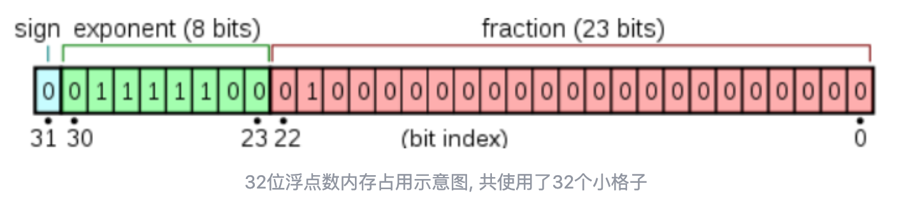
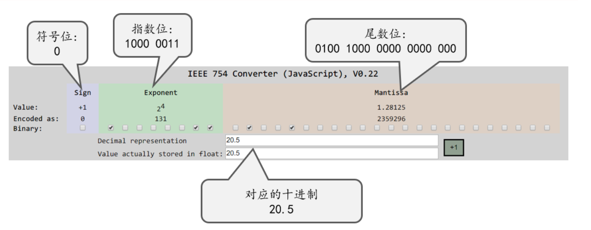
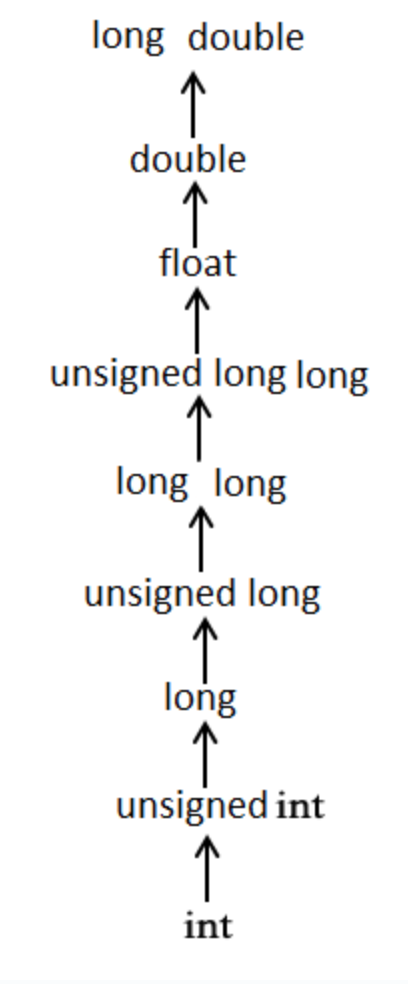
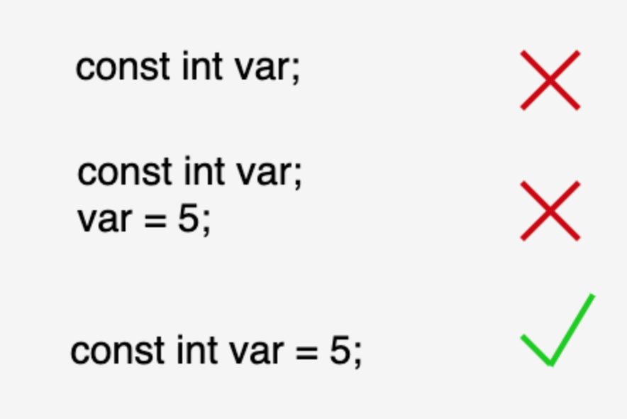
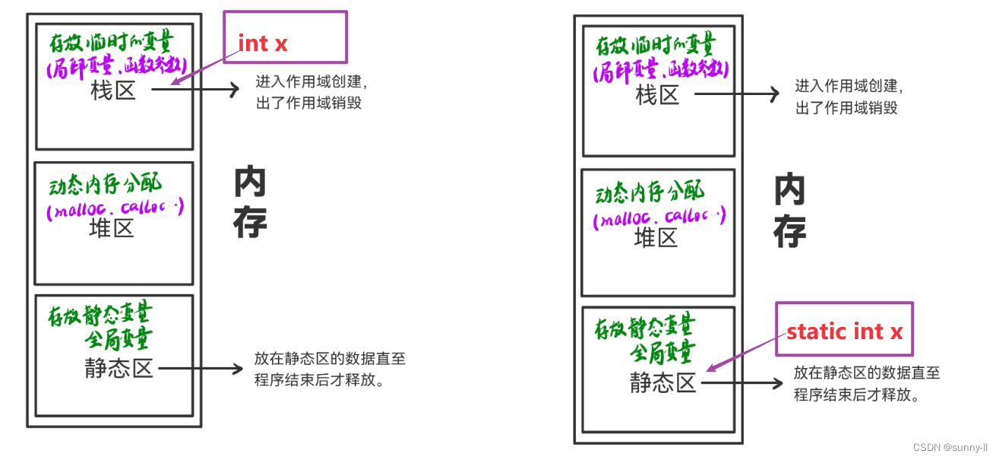
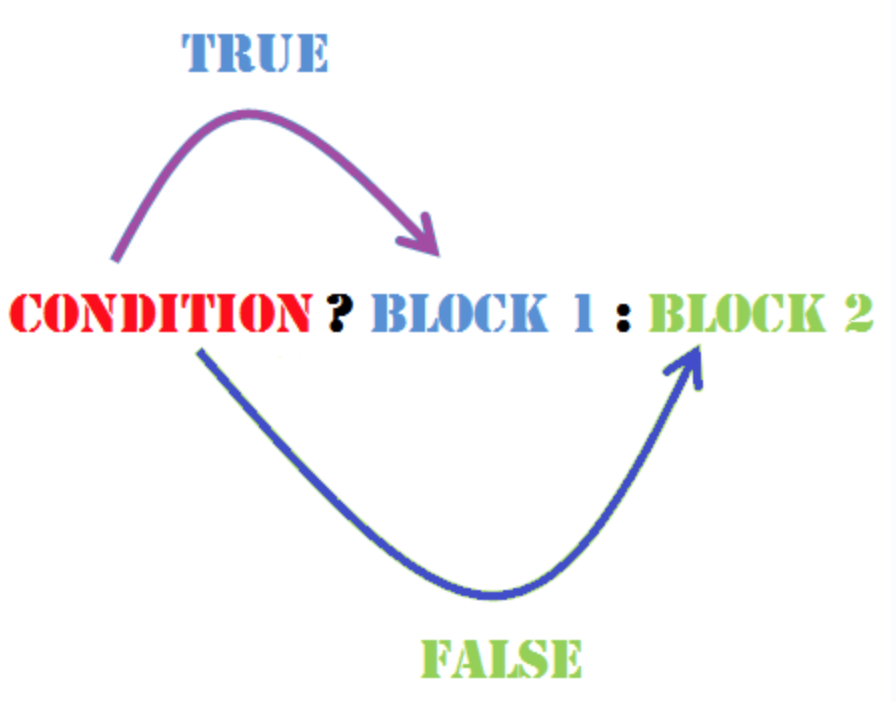
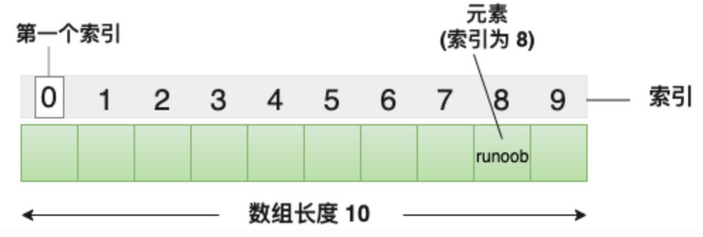
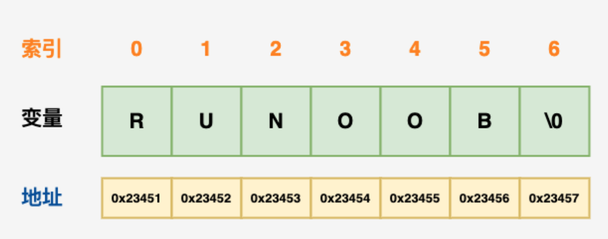
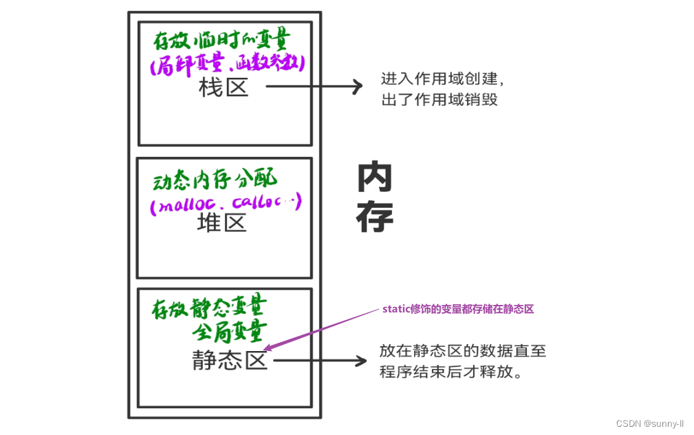
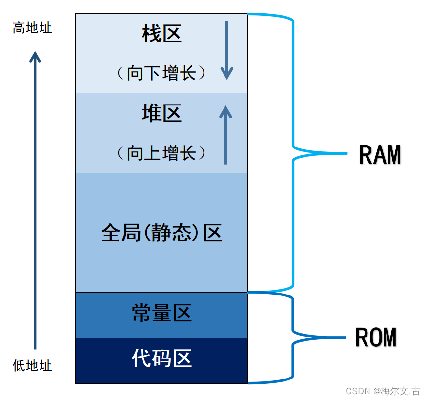

<font size = 6>c</font>

[TOC]

# 简介

C 语言是一种通用的高级语言，最初是由丹尼斯·里奇在贝尔实验室为开发 UNIX 操作系统而设计的。

**特点**

- 结构化语言
- 高效率的程序
- 可以处理底层的活动
- 可以在多种计算机平台上编译

**适用场景**

C 语言最初是用于系统开发工作，特别是组成操作系统的程序。由于 C 语言所产生的代码运行速度与汇编语言编写的代码运行速度几乎一样，所以采用 C 语言作为系统开发语言。使用 C 的实例有如下所示

- 操作系统
- 语言编译器
- 汇编器
- 文本编辑器
- 打印机
- 网络驱动器
- 现代程序
- 数据库
- 语言解释器
- 实体工具

# 数据类型

|     类型     |                       描述                       |
| :----------: | :----------------------------------------------: |
| 基本数据类型 | 算术类型，包括整型、字符型、浮点型和双精度浮点型 |
|   枚举类型   |  也是算术类型，只能赋予其一定的离散整数值的变量  |
|  void 类型   |     表示没有值的数据类型，通常用于函数返回值     |
|   派生类型   |        包括数组类型、指针类型和结构体类型        |

## 整数类型

|      类型      |  存储大小   |                        值范围                        |
| :------------: | :---------: | :--------------------------------------------------: |
|      char      |   1 字节    |               -128 到 127 或 0 到 255                |
| unsigned char  |   1 字节    |                       0 到 255                       |
|  signed char   |   1 字节    |                     -128 到 127                      |
|      int       | 2 或 4 字节 | -32,768 到 32,767 或 -2,147,483,648 到 2,147,483,647 |
|  unsigned int  | 2 或 4 字节 |          0 到 65,535 或 0 到 4,294,967,295           |
|     short      |   2 字节    |                  -32,768 到 32,767                   |
| unsigned short |   2 字节    |                     0 到 65,535                      |
|      long      |   4 字节    |           -2,147,483,648 到 2,147,483,647            |
| unsigned long  |   4 字节    |                  0 到 4,294,967,295                  |

各种类型的存储大小与系统位数有关，为了得到某个类型或某个变量在特定平台上的准确大小，可以使用 `sizeof` 函数。

## 浮点类型

- float：占用 4 个字节，含 1 位符号位、8 位指数位和 23 位尾数位
- double：占用 8 个字节，包括 1 位符号位、11 位指数位和 52 位尾数位

|    类型     | 存储大小 |         值范围         |    精度     |
| :---------: | :------: | :--------------------: | :---------: |
|    float    |  4 字节  |   1.2E-38 到 3.4E+38   | 6 位有效位  |
|   double    |  8 字节  |  2.3E-308 到 1.7E+308  | 15 位有效位 |
| long double | 16 字节  | 3.4E-4932 到 1.1E+4932 | 19 位有效位 |

**存储方式**

以32位浮点数举例



- sign：符号位， 表示这个浮点数是正数还是负数，为0表示正数， 为1表示负数
- biased exponent：指数位，用于表示以2位底的指数，为了表示方便，浮点型的指数位都有一个固定的偏移量(bias), 用于使 `指数 + 偏移量 = 一个非负整数`，规定在32位单精度类型中，这个偏移量是127；在64位双精度类型中，偏移量是1023
- fraction：尾数位，用于存储尾数，隐藏高位1，低位补0



**相等判断**

在 C 语言中，浮点数的存储遵循 IEEE 754 标准，判断两个浮点数是否相等时，通常需要设置一个精度阈值或使用标准库函数，以避免直接使用 == 运算符带来的精度误差问题。

## void 类型

void 类型指定没有可用的值，它通常用于以下三种情况下

|     类型      |                             描述                             |
| :-----------: | :----------------------------------------------------------: |
| 函数返回为空  |                 不返回值的函数的返回类型为空                 |
| 函数参数为空  | C 中有各种函数不接受任何参数，不带参数的函数可以接受一个 void |
| 指针指向 void | 类型为 void * 的指针代表对象的地址，而不是类型，返回指向 void 的指针，可以转换为任何数据类型 |

# 类型转换

## 简介

C 语言中有两种类型转换

- 隐式类型转换：隐式类型转换是在表达式中自动发生的，无需进行任何明确的指令或函数调用。它通常是将一种较小的类型自动转换为较大的类型，例如，将int类型转换为long类型或float类型转换为double类型。隐式类型转换也可能会导致数据精度丢失或数据截断
- 显式类型转换：显式类型转换需要使用强制类型转换运算符，它可以将一个数据类型的值强制转换为另一种数据类型的值。强制类型转换可以使程序员在必要时对数据类型进行更精确的控制，但也可能会导致数据丢失或截断

```c
// 隐式类型转换

int i = 10;
float f = 3.14;
double d = i + f; 		// 隐式将int类型转换为double类型
```

```c
// 显式类型转换

double d = 3.14159;
int i = (int)d; 			// 显式将double类型转换为int类型
```

## 算术转换

算术转换是隐式地把值强制转换为相同的类型。编译器首先执行整数提升，如果操作数类型不同，则它们会被转换为下列层次中出现的最高层次的类型



例如

```c
#include <stdio.h>
 
int main()
{
   int  i = 17;
   char c = 'c'; /* ascii 值是 99 */
   float sum;
 
   sum = i + c;
   printf("Value of sum : %f\n", sum );
 
}
```

输出结果

```
Value of sum : 116.000000
```

c 首先被转换为整数，但是由于最后的值是 float 型的，所以编译器会把 i 和 c 转换为浮点型，并把它们相加得到一个浮点数。

# 变量

## 简介

变量是程序可操作的存储区的名称。C 中每个变量都有特定的类型，类型决定了变量存储的大小和布局，该范围内的值都可以存储在内存中。

变量的名称可以由字母、数字和下划线字符组成，必须以字母或下划线开头，大写字母和小写字母是不同的。

## 变量定义

变量定义就是告诉编译器在何处创建变量的存储，以及如何创建变量的存储。

```c
type variable_list;
```

## 变量初始化

在 C 语言中，变量的初始化是在定义变量的同时为其赋予一个初始值。变量的初始化可以在定义时进行，也可以在后续的代码中进行。

初始化器由一个等号，后跟一个常量表达式组成。

```c
int x = 10;         // 整型变量 x 初始化为 10
```

**memset**

memset是一个初始化函数，作用是将某一块内存中的全部设置为指定的值。

```c
void *memset(void *s, int value, size_t n);
```

> s指向要填充的内存块
> value是要被设置的值
> n是要被设置该值的字符数
> 返回类型是一个指向存储区s的指针

用法

1. 初始化数组
2. 清空结构体类型的变量

注

1. 不能任意赋值
2. 注意赋值类型

[memset用法详解](https://blog.csdn.net/weixin_44162361/article/details/115790452?ops_request_misc=%7B%22request%5Fid%22%3A%22170221025216800225536878%22%2C%22scm%22%3A%2220140713.130102334..%22%7D&request_id=170221025216800225536878&biz_id=0&utm_medium=distribute.pc_search_result.none-task-blog-2~all~top_positive~default-1-115790452-null-null.142%5ev96%5epc_search_result_base8&utm_term=memset%E7%94%A8%E6%B3%95&spm=1018.2226.3001.4187)

## 变量不初始化

在 C 语言中，如果变量没有显式初始化，那么它的默认值将取决于该变量的类型和其所在的作用域。

对于全局变量和静态变量，以下是不同类型的变量在没有显式初始化时的默认值

- 整型变量（int、short、long等）：默认值为0
- 浮点型变量（float、double等）：默认值为0.0
- 字符型变量（char）：默认值为'\0'，即空字符
- 指针变量：默认值为NULL，表示指针不指向任何有效的内存地址
- 数组、结构体、联合等复合类型的变量：它们的元素或成员将按照相应的规则进行默认初始化，这可能包括对元素递归应用默认规则

注

1. 局部变量不会自动初始化为默认值，它们的初始值是未定义的（包含垃圾值）。因此，在使用局部变量之前，应该显式地为其赋予一个初始值

## 变量声明

变量声明向编译器保证变量以指定的类型和名称存在，这样编译器在不需要知道变量完整细节的情况下也能继续进一步的编译。

变量的声明有两种情况

1. 需要建立存储空间的，例如int a 在声明的时候就已经建立了存储空间
2. 另一种是不需要建立存储空间的，通过使用extern关键字声明变量名而不定义它

```c
extern int i; 	//声明，不是定义
int i; 					//声明，也是定义
```

## 左值右值

C 中有两种类型的表达式

- 左值（lvalue）：指向内存位置的表达式被称为左值表达式，左值可以出现在赋值号的左边或右边
- 右值（rvalue）：指存储在内存中某些地址的数值，右值不能对其进行赋值，只能出现在赋值号的右边

变量是左值，因此可以出现在赋值号的左边。数值型的字面值是右值，因此不能被赋值，不能出现在赋值号的左边。

# 常量

## 简介

常量是固定值，在程序执行期间不会改变。

常量就像是常规的变量，只不过常量的值在定义后不能进行修改。

## 整数常量

整数常量可以是十进制、八进制或十六进制的常量。前缀指定基数：0x 或 0X 表示十六进制，0 表示八进制，不带前缀则默认表示十进制。

整数常量也可以带一个后缀，后缀是 U 和 L 的组合，U 表示无符号整数（unsigned），L 表示长整数（long）。后缀可以是大写，也可以是小写，U 和 L 的顺序任意。

```c
85         /* 十进制 */
0213       /* 八进制 */
0x4b       /* 十六进制 */
30         /* 整数 */
30u        /* 无符号整数 */
30l        /* 长整数 */
30ul       /* 无符号长整数 */

int myInt = 10;
long myLong = 100000L;
unsigned int myUnsignedInt = 10U;
```

## 浮点常量

浮点常量由整数部分、小数点、小数部分和指数部分组成。可以使用小数形式或者指数形式来表示浮点常量，指数形式通过 e 或 E 引入。

浮点数常量可以带有一个后缀 f 或 F 表示。

```c
3.14159       /* 小数形式 合法的 */
314159E-5L    /* 指数形式 合法的 */
510E          /* 非法的：不完整的指数 */
210f          /* 非法的：没有小数或指数 */
.e55          /* 非法的：缺少整数或分数 */

float myFloat = 3.14f;
double myDouble = 3.14159;
```

## 字符常量

字符常量可以是一个普通的字符（例如 'x'）、一个转义序列（例如 '\t'），或一个通用的字符（例如 '\u02C0'）。

在 C 中，有一些特定的字符，当它们前面有反斜杠`\`时，具有特殊的含义，被用来表示如换行符（\n）或制表符（\t）等。下表列出一些转义序列码

|  转义序列  |            含义            |
| :--------: | :------------------------: |
|     \\     |           \ 字符           |
|     \'     |           ' 字符           |
|     \"     |           " 字符           |
|     \?     |           ? 字符           |
|     \a     |          警报铃声          |
|     \b     |           退格键           |
|     \f     |           换页符           |
|     \n     |           换行符           |
|     \r     |            回车            |
|     \t     |         水平制表符         |
|     \v     |         垂直制表符         |
|    \ooo    |     一到三位的八进制数     |
| \xhh . . . | 一个或多个数字的十六进制数 |

字符常量的 ASCII 值可以通过强制类型转换转换为整数值。

```c
char myChar = 'a';
int myAsciiValue = (int) myChar; 	// 将 myChar 转换为 ASCII 值 97
```

## 字符串常量

字符串常量是括在双引号 " " 中的。一个字符串包含类似于字符常量的字符：普通的字符、转义序列和通用的字符。

字符串常量在内存中以 null 终止符 \0 结尾。例如

```c
char myString[] = "Hello, world!"; 		//系统对字符串常量自动加一个 '\0'
```

## 定义常量

在 C 中，有两种简单的定义常量的方式

- 使用 #define 预处理器： #define 可以在程序中定义一个常量，它在编译时会被替换为其对应的值
- 使用 const 关键字：const 关键字用于声明一个只读变量，即该变量的值不能在程序运行时修改

**#define 预处理器**

#define 预处理器定义常量的形式

```c
#define 常量名 常量值
```

下面的代码定义了一个名为 PI 的常量，在程序中使用该常量时，编译器会将所有的 PI 替换为 3.14159。

```c
#define PI 3.14159
```

**const**

可以使用 const 前缀声明指定类型的常量，如下所示

```c
const 数据类型 常量名 = 常量值;
```

下面的代码定义了一个名为MAX_VALUE的常量，在程序中使用该常量时，其值将始终为100，并且不能被修改。

```c
const int MAX_VALUE = 100;
```

const 定义常量时要同时进行初始化。



注

1. 常量一般定义为大写字母形式

**#define 与 const 区别**

#define 与 const 这两种方式都可以用来定义常量，选择哪种方式取决于具体的需求和编程习惯。通常情况下，建议使用 const 关键字来定义常量，因为它具有类型检查和作用域的优势，而 #define 仅进行简单的文本替换，可能会导致一些意外的问题。

- 替换机制：#define 是进行简单的文本替换，而 const 是声明一个具有类型的常量。#define 定义的常量在编译时会被直接替换为其对应的值，而 const 定义的常量在程序运行时会分配内存，并且具有类型信息
- 类型检查：#define 不进行类型检查，因为它只是进行简单的文本替换。而 const 定义的常量具有类型信息，编译器可以对其进行类型检查。这可以帮助捕获一些潜在的类型错误
- 作用域：#define 定义的常量没有作用域限制，它在定义之后的整个代码中都有效。而 const 定义的常量具有块级作用域，只在其定义所在的作用域内有效
- 调试和符号表：使用 #define 定义的常量在符号表中不会有相应的条目，因为它只是进行文本替换。而使用 const 定义的常量会在符号表中有相应的条目，有助于调试和可读性

# 存储类

存储类定义 C 程序中变量/函数的存储位置、生命周期和作用域。

这些说明符放置在它们所修饰的类型之前。

## auto

auto 存储类是所有局部变量默认的存储类，只能修饰局部变量。

定义在函数中的变量默认为 auto 存储类，这意味着它们在函数开始时被创建，在函数结束时被销毁。

## register

register 存储类用于定义存储在寄存器中而不是 RAM 中的局部变量。这意味着变量的最大尺寸等于寄存器的大小（通常是一个字），且不能对它应用一元的 `&` 运算符（因为它没有内存位置）。

register 存储类定义存储在寄存器，所以变量的访问速度更快，但是它不能直接取地址，因为它不是存储在 RAM 中的。在需要频繁访问的变量上使用 register 存储类可以提高程序的运行速度。

```c
register int  miles;
```

寄存器只用于需要快速访问的变量，比如计数器。还应注意的是，定义 `register` 并不意味着变量将被存储在寄存器中，它意味着变量可能存储在寄存器中，这取决于硬件和实现的限制。

## volatile

volatile是一个类型修饰符，用于告诉编译器不能对这些变量进行某些优化，以确保每次访问变量时都从内存中读取值。

**典型用途**

- 硬件寄存器：在嵌入式系统中，硬件寄存器的值可能会被硬件设备改变。例如，一个状态寄存器可能会被硬件设置或清除某些位
- 中断服务例程：在中断服务例程中，可能会修改某些变量的值。这些变量需要被声明为volatile，以确保主程序能够读取到最新的值

**作用**

- 防止编译器优化
	- 编译器不会对volatile修饰的变量进行某些优化，例如
		- 不会将变量的值缓存在寄存器中
		- 不会假设变量的值在两次访问之间保持不变
		- 不会对访问volatile变量的代码进行重排序

- 确保每次访问都从内存中读取
	- 每次访问volatile变量时，都会从内存中读取最新的值，而不是使用缓存中的值

## extern

extern 存储类用于定义在其他文件中声明的全局变量或函数。当使用 extern 关键字时，不会为变量分配任何存储空间，而是指示编译器该变量在其他文件中定义。

extern 存储类用于提供一个全局变量的引用，全局变量对所有的程序文件都是可见的。当使用 extern 时，会把变量名指向一个之前定义过的存储位置。

当有多个文件且定义了一个可以在其他文件中使用的全局变量或函数时，可以在其他文件中使用 extern 来得到已定义的变量或函数的引用。 

## const

被const 修饰的东西都受到强制保护，可以预防意外的变动，能提高程序的健壮性。

**基本用法**

- 声明常量变量：const用于声明一个常量变量，其值在声明后不能被修改
- 声明常量指针：const可以用于指针，表示指针指向的内容不能被修改
- 声明指针常量：const也可以用于指针本身，表示指针的地址不能被修改
- 声明常量指针常量：const可以同时用于指针和指针指向的内容，表示指针的地址和指针指向的内容都不能被修改
- 声明只读参数：在函数中，const可以用于声明只读参数，表示函数不会修改这些参数的值
- 声明只读返回值：const也可以用于函数的返回值，表示返回值不能被修改

**注意事项**

- const 函数只能调用 const 函数，即使某个函数本质上没有修改任何数据，但没有声明为const，也是不能被const函数调用的
- 函数如果返回值为const，则使用该函数时赋值的变量也必须为常量变量

**常量指针**

```c
    /* 指向常量的指针 */

    int const a = 1;
    int b = 2;

    int const *pa = &a;
    printf("The pointer pa points at the const int varible %d.\n", *pa);

    //*pa = b;      不能通过间接访问操作“*”来更改pa所指向变量的值

    pa = &b;        //但pa本身的值可以改变
    printf("The pointer pa points at the int varible %d.\n", *pa);
```

运行结果

```
The pointer pa points at the const int varible 1.
The pointer pa points at the int varible 2.
```

**指针常量**

```c
    /* 指针常量 */

    int a = 1;
    int const b = 2;

    int *const pa = &a;
    printf("The const pointer pa points at the int varible %d.\n", *pa);

    //pa = &b;      //pa本身的值不可更改，即：它“只能指向”变量a

    *pa = b;        //虽然pa“只能指向”变量a，但变量a是可以更改的
    printf("The const pointer pa points at the changed int varible %d.\n", *pa);
```

运行结果

```
The const pointer pa points at the int varible 1.
The const pointer pa points at the changed int varible 2.
```

## static

static 存储类指示编译器在程序的生命周期内保持局部变量的存在，而不需要在每次它进入和离开作用域时进行创建和销毁。因此，使用 static 修饰局部变量可以在函数调用之间保持局部变量的值。

static 修饰符也可以应用于全局变量。当 static 修饰全局变量时，会使变量的作用域限制在声明它的文件内。

静态变量在程序中只被初始化一次，即使函数被调用多次，该变量的值也不会重置。

**用法**

- 修饰局部变量（称为静态局部变量）
- 修饰全局变量（称为静态全局变量）
- 修饰函数（称为静态函数）

**static修饰局部变量**

- 在函数中声明变量时， static 关键字指定变量只初始化一次，并在之后调用该函数时保留其状态
- static修饰局部变量时，会改变局部变量的存储位置，从而使得局部变量的生命周期变长

```c
#include <stdio.h>
#include <stdlib.h>
void test()
{
    static int x = 0;
	x++;
	printf("%d ", x);
}
int main()
{
    int i = 0;
	while (i < 10)
	{
		test();
		i++;
	}
	return 0;
}
```

输出结果

```
 1 2 3 4 5 6 7 8 9 10
```



static的另一个作用是默认初始化为0。其实全局变量也具备这一属性，因为全局变量也存储在静态数据区。在静态数据区，内存中所有的字节默认值都是0x00。

**static修饰全局变量和函数**

在全局和/或命名空间范围 (在单个文件范围内声明变量或函数时) static 关键字指定变量或函数为内部链接，即外部文件无法引用该变量或函数。

- 全局变量的作用域十分的广，只要在一个源文件中定义后，这个程序中的所有源文件、对象以及函数都可以调用，生命周期更是贯穿整个程序
- static修饰全局变量和函数时，会改变全局变量和函数的链接属性——-变为只能在内部链接，从而使得全局变量的作用域变小

static 可以修饰函数和变量，将其对其他源文件隐藏起来，从而避免命名冲突。

# 作用域

作用域是程序中定义的变量所存在的区域，超过该区域变量就不能被访问。C 语言中有三个地方可以声明变量

- 在函数或块内部的局部变量
- 在所有函数外部的全局变量
- 在形式参数的函数参数定义中

## 局部变量

在某个函数或块的内部声明的变量称为局部变量。它们只能被该函数或该代码块内部的语句使用。局部变量在函数外部是不可知的。

```c
#include <stdio.h>
 
int main ()
{
  /* 局部变量声明 */
  int a, b;
  int c;
 
  /* 实际初始化 */
  a = 10;
  b = 20;
  c = a + b;
 
  printf ("value of a = %d, b = %d and c = %d\n", a, b, c);
 
  return 0;
}
```

## 全局变量

全局变量是定义在函数外部，通常是在程序的顶部。全局变量在整个程序生命周期内都是有效的，在任意的函数内部能访问全局变量。

在程序中，局部变量和全局变量的名称可以相同，但是在函数内，如果两个名字相同，会使用局部变量值，全局变量不会被使用。

```c
#include <stdio.h>
 
/* 全局变量声明 */
int g = 20;
 
int main ()
{
  /* 局部变量声明 */
  int g = 10;
 
  printf ("value of g = %d\n",  g);
 
  return 0;
}
```

输出结果

```
value of g = 10
```

## 形式参数

函数的参数，形式参数，被当作该函数内的局部变量，如果与全局变量同名它们会优先使用。

```c
#include <stdio.h>
 
/* 全局变量声明 */
int a = 20;
 
int main ()
{
  /* 在主函数中的局部变量声明 */
  int a = 10;
  int b = 20;
  int c = 0;
  int sum(int, int);
 
  printf ("value of a in main() = %d\n",  a);
  c = sum( a, b);
  printf ("value of c in main() = %d\n",  c);
 
  return 0;
}
 
/* 添加两个整数的函数 */
int sum(int a, int b)
{
    printf ("value of a in sum() = %d\n",  a);
    printf ("value of b in sum() = %d\n",  b);
 
    return a + b;
}
```

输出结果

```
value of a in main() = 10
value of a in sum() = 10
value of b in sum() = 20
value of c in main() = 30
```

# 运算符

运算符是一种告诉编译器执行特定的数学或逻辑操作的符号。C 语言提供了以下类型的运算符

- 算术运算符
- 关系运算符
- 逻辑运算符
- 位运算符
- 赋值运算符
- 杂项运算符

## 算术运算符

变量 A 的值为 10，变量 B 的值为 20

| 运算符 |               描述               |       实例       |
| :----: | :------------------------------: | :--------------: |
|   +    |         把两个操作数相加         | A + B 将得到 30  |
|   -    | 从第一个操作数中减去第二个操作数 | A - B 将得到 -10 |
|   *    |         把两个操作数相乘         | A * B 将得到 200 |
|   /    |           分子除以分母           |  B / A 将得到 2  |
|   %    |     取模运算符，整除后的余数     |  B % A 将得到 0  |
|   ++   |     自增运算符，整数值增加 1     |  A++ 将得到 11   |
|   --   |     自减运算符，整数值减少 1     |   A-- 将得到 9   |

**a++ 与 ++a **

```c
#include <stdio.h>
 
int main()
{
   int c;
   int a = 10;
   c = a++; 
   printf("先赋值后运算：\n");
   printf("Line 1 - c 的值是 %d\n", c );
   printf("Line 2 - a 的值是 %d\n", a );
   a = 10;
   c = a--; 
   printf("Line 3 - c 的值是 %d\n", c );
   printf("Line 4 - a 的值是 %d\n", a );
 
   printf("先运算后赋值：\n");
   a = 10;
   c = ++a; 
   printf("Line 5 - c 的值是 %d\n", c );
   printf("Line 6 - a 的值是 %d\n", a );
   a = 10;
   c = --a; 
   printf("Line 7 - c 的值是 %d\n", c );
   printf("Line 8 - a 的值是 %d\n", a );
 
}
```

输出结果

```
先赋值后运算：
Line 1 - c 的值是 10
Line 2 - a 的值是 11
Line 3 - c 的值是 10
Line 4 - a 的值是 9
先运算后赋值：
Line 5 - c 的值是 11
Line 6 - a 的值是 11
Line 7 - c 的值是 9
Line 8 - a 的值是 9
```

## 关系运算符

变量 A 的值为 10，变量 B 的值为 20

| 运算符 |                             描述                             |     实例      |
| :----: | :----------------------------------------------------------: | :-----------: |
|   ==   |        检查两个操作数的值是否相等，如果相等则条件为真        | (A == B) 为假 |
|   !=   |       检查两个操作数的值是否相等，如果不相等则条件为真       | (A != B) 为真 |
|   >    |    检查左操作数的值是否大于右操作数的值，如果是则条件为真    | (A > B) 为假  |
|   <    |    检查左操作数的值是否小于右操作数的值，如果是则条件为真    | (A < B) 为真  |
|   >=   | 检查左操作数的值是否大于或等于右操作数的值，如果是则条件为真 | (A >= B) 为假 |
|   <=   | 检查左操作数的值是否小于或等于右操作数的值，如果是则条件为真 | (A <= B) 为真 |

## 逻辑运算符

变量 A 的值为 1，变量 B 的值为 0

| 运算符 |                             描述                             |      实例       |
| :----: | :----------------------------------------------------------: | :-------------: |
|   &&   |      称为逻辑与运算符。如果两个操作数都非零，则条件为真      |  (A && B) 为假  |
|  \|\|  | 称为逻辑或运算符。如果两个操作数中有任意一个非零，则条件为真 | (A \|\| B) 为真 |
|   !    | 称为逻辑非运算符。用来逆转操作数的逻辑状态。如果条件为真则逻辑非运算符将使其为假 | !(A && B) 为真  |

## 位运算符

计算机对二进制数据进行的运算（如加、减、乘、除）被称为位运算，与直接使用 +、-、\*、/运算符相比，合理运用位运算可以显著提高代码在机器上的执行效率。 

| 符号 | 描述 |                  运算规则                   |
| :--: | :--: | :-----------------------------------------: |
|  &   |  与  |          两个位都为1时，结果才为1           |
|  \|  |  或  |         两个位都为0时，结果才为0、          |
|  ^   | 异或 |           两个位相同为0，相异为1            |
|  ~   | 取反 |                 0变1，1变0                  |
|  <<  | 左移 |  各二进位全部左移若干位，高位丢弃，低位补0  |
|  >>  | 右移 | 各二进位全部右移若干位，高位补0或符号位补齐 |

**&**

定义

对参与运算的两个数据的二进制位进行"与"运算。

运算规则

> 0 & 0 = 0 
> 0 & 1 = 0 
> 1 & 0 = 0 
> 1 & 1 = 1 

用途

- 清零：如果想将一个单元清零，只要与一个各位都为零的数值相与，结果为零
- 取一个数的指定位：例如，取数 X = 1010 1110 的低4位，只需另找一个数 Y = 0000 1111，然后 X & Y = 0000 1110 即可得到 X 的指定位
- 判断奇偶：通过判断最未位是0还是1来决定奇偶，可以用 if ((a & 1) == 0) 代替 if (a % 2 == 0) 来判断 a 是否为偶数

注
1. 负数按补码形式参与按位与运算

**|**

定义

对参与运算的两个对象的二进制位进行"或"运算。

运算规则

> 0 | 0 = 0 
> 0 | 1 = 1 
> 1 | 0 = 1 
> 1 | 1 = 1 

用途

- 设置某些位为1：例如，将数 X = 1010 1110 的低4位设置为1，只需另找一个数 Y = 0000 1111，然后 X | Y = 1010 1111 即可得到

注

1. 负数按补码形式参与按位或运算

**^**

定义

对参与运算的两个数据的二进制位进行"异或"运算。

运算规则

> 0 ^ 0 = 0 
> 0 ^ 1 = 1 
> 1 ^ 0 = 1 
> 1 ^ 1 = 0 

性质

1. 交换律  
2. 结合律： (a ^ b) ^ c == a ^ (b ^ c)
3. 对于任何数 x，都有 x ^ x = 0，x ^ 0 = x
4. 自反性：a ^ b ^ b = a ^ 0 = a

用途

- 翻转指定位：例如，将数 X = 1010 1110 的低4位翻转，只需另找一个数 Y = 0000 1111，然后 X ^ Y = 1010 0001 即可得到
- 与0相异或值不变：例如 1010 1110 ^ 0000 0000 = 1010 1110
- 交换两个数

```c
void Swap(int &a, int &b) {
	if (a != b) {
		a ^= b;
		b ^= a;
		a ^= b;
	}
}
```

**~**

定义

对参与运算的一个数据的二进制位进行"取反"运算。

运算规则

> ~1 = 1111 1110 
> ~0 = 1111 1111

用途

- 使一个数的最低位为零：例如，使 a 的最低位为0，可以表示为：a & ~1。~1 的值为 1111 1111 1111 1110，再按"与"运算，最低位一定为0

**<<**

定义

将一个运算对象的各二进制位全部左移若干位，高位丢弃，低位补0。

若左移时舍弃的高位不包含1，则每左移一位，相当于该数乘以2。

**>>**

定义

将一个数的各二进制位全部右移若干位，高位补0或补符号位，右边丢弃。

左补0 或补符号位，具体取决于数的正负。

操作数每右移一位，相当于该数除以2。

**不同长度的数据进行位运算**

如果两个不同长度的数据进行位运算，系统会将二者按右端对齐，然后进行位运算。 

以"与运算"为例，在C语言中，long型占4个字节，int型占2个字节。如果一个long型数据与一个int型数据进行"与运算"，右端对齐后，左边不足的位按以下三种情况补足

1. 如果整型数据为正数，左边补16个0
2. 如果整型数据为负数，左边补16个1
3. 如果整型数据为无符号数，左边也补16个0

## 赋值运算符

| 运算符 |                             描述                             |              实例               |
| :----: | :----------------------------------------------------------: | :-----------------------------: |
|   =    |       简单的赋值运算符，把右边操作数的值赋给左边操作数       | C = A + B 将把 A + B 的值赋给 C |
|   +=   | 加且赋值运算符，把右边操作数加上左边操作数的结果赋值给左边操作数 |     C += A 相当于 C = C + A     |
|   -=   | 减且赋值运算符，把左边操作数减去右边操作数的结果赋值给左边操作数 |     C -= A 相当于 C = C - A     |
|   *=   | 乘且赋值运算符，把右边操作数乘以左边操作数的结果赋值给左边操作数 |     C *= A 相当于 C = C * A     |
|   /=   | 除且赋值运算符，把左边操作数除以右边操作数的结果赋值给左边操作数 |     C /= A 相当于 C = C / A     |
|   %=   |      求模且赋值运算符，求两个操作数的模赋值给左边操作数      |     C %= A 相当于 C = C % A     |
|  <<=   |                       左移且赋值运算符                       |    C <<= 2 等同于 C = C << 2    |
|  >>=   |                       右移且赋值运算符                       |    C >>= 2 等同于 C = C >> 2    |
|   &=   |                      按位与且赋值运算符                      |     C &= 2 等同于 C = C & 2     |
|   ^=   |                     按位异或且赋值运算符                     |     C ^= 2 等同于 C = C ^ 2     |
|  \|=   |                      按位或且赋值运算符                      |    C \|= 2 等同于 C = C \| 2    |

## 杂项运算符

|  运算符  |         描述         |                 实例                 |
| :------: | :------------------: | :----------------------------------: |
| sizeof() |    返回变量的大小    |  sizeof(a) 将返回 4，其中 a 是整数   |
|    &     |    返回变量的地址    |       &a; 将给出变量的实际地址       |
|    *     | 返回地址所指向的变量 |          *a; 将指向一个变量          |
|   ? :    |      条件表达式      | 如果条件为真 ? 则值为 X : 否则值为 Y |

**指针*与地址&**

- *：取值  
- &：取址  

```c
int a = 10;
int *b = &a；

printf(“%d\n”, a);
printf(“%d\n”, &a);
printf(“%d\n”, b);
printf(“%d\n”, *b);

输出结果：
10
6487620
6487620
10
```

## 运算符优先级

运算符的优先级确定表达式中项的组合。这会影响到一个表达式如何计算。

下表将按运算符优先级从高到低列出各个运算符。在表达式中，较高优先级的运算符会优先被计算。

|    类别    |              运算符               |  结合性  |
| :--------: | :-------------------------------: | :------: |
|    后缀    |         () [] -> . ++ - -         | 从左到右 |
|    一元    |  + - ! ~ ++ - - (type)* & sizeof  | 从右到左 |
|    乘除    |               * / %               | 从左到右 |
|    加减    |                + -                | 从左到右 |
|    移位    |               << >>               | 从左到右 |
|    关系    |             < <= > >=             | 从左到右 |
|    相等    |               == !=               | 从左到右 |
|  位与 AND  |                 &                 | 从左到右 |
| 位异或 XOR |                 ^                 | 从左到右 |
|  位或 OR   |                \|                 | 从左到右 |
| 逻辑与 AND |                &&                 | 从左到右 |
| 逻辑或 OR  |               \|\|                | 从左到右 |
|    条件    |                ?:                 | 从右到左 |
|    赋值    | = += -= *= /= %=>>= <<= &= ^= \|= | 从右到左 |
|    逗号    |                 ,                 | 从左到右 |

# 判断

C 语言把任何非零和非空的值假定为 true，把零或 null 假定为 false。

## 判断语句

|                             语句                             |                             描述                             |
| :----------------------------------------------------------: | :----------------------------------------------------------: |
|   [if](https://www.runoob.com/cprogramming/c-if.html)   |     一个 if 语句 由一个布尔表达式后跟一个或多个语句组成      |
| [if...else](https://www.runoob.com/cprogramming/c-if-else.html) | 一个 if 语句 后可跟一个可选的 else 语句，else 语句在布尔表达式为假时执行 |
| [嵌套 if](https://www.runoob.com/cprogramming/c-nested-if.html) | 可以在一个 if 或 else if 语句内使用另一个 if 或 else if 语句 |
| [switch](https://www.runoob.com/cprogramming/c-switch.html) |      一个 switch 语句允许测试一个变量等于多个值时的情况      |
| [嵌套 switch](https://www.runoob.com/cprogramming/c-nested-switch.html) |        可以在一个 switch 语句内使用另一个 switch 语句        |

## 三元运算符

```c
Exp1 ? Exp2 : Exp3;
```



# 循环

循环语句允许我们多次执行一个语句或语句组。

## 循环类型

|                           循环类型                           |                             描述                             |
| :----------------------------------------------------------: | :----------------------------------------------------------: |
| [while](https://www.runoob.com/cprogramming/c-while-loop.html) | 当给定条件为真时，重复语句或语句组。它会在执行循环主体之前测试条件 |
| [for](https://www.runoob.com/cprogramming/c-for-loop.html) |        多次执行一个语句序列，简化管理循环变量的代码      |
| [do...while](https://www.runoob.com/cprogramming/c-do-while-loop.html) |  除了它是在循环主体结尾测试条件外，其他与 while 语句类似   |
| [嵌套](https://www.runoob.com/cprogramming/c-nested-loops.html) | 您可以在 while、for 或 do..while 循环内使用一个或多个循环  |

## 循环控制语句

|                           控制语句                           |                             描述                             |
| :----------------------------------------------------------: | :----------------------------------------------------------: |
| [break](https://www.runoob.com/cprogramming/c-break-statement.html) | 终止循环或 switch 语句，程序流将继续执行紧接着循环或 switch 的下一条语句 |
| [continue](https://www.runoob.com/cprogramming/c-continue-statement.html) |  告诉一个循环体立刻停止本次循环迭代，重新开始下次循环迭代  |
| [goto](https://www.runoob.com/cprogramming/c-goto-statement.html) | 将控制转移到被标记的语句。但是不建议在程序中使用 goto 语句 |

# 函数

函数是一组一起执行一个任务的语句。每个 C 程序都至少有一个函数，即主函数 main() 。

- 函数声明告诉编译器函数的名称、返回类型和参数
- 函数定义提供了函数的实际主体

C 标准库提供了大量的程序可以调用的内置函数。

函数还有很多叫法，比如方法、子例程或程序，等等。

## 定义函数

函数定义的一般形式如下

```c
return_type function_name( parameter list )
{
   body of the function
}
```

一个函数的组成部分

- 返回类型：一个函数可以返回一个值。return_type 是函数返回的值的数据类型。有些函数执行所需的操作而不返回值，在这种情况下，return_type 是关键字 void
- 函数名称：这是函数的实际名称。函数名和参数列表一起构成了函数签名
- 参数：参数就像是占位符。当函数被调用时，您向参数传递一个值，这个值被称为实际参数。参数列表包括数参数的类型、顺序、数量。参数是可选的，也就是说，函数可能不包含参数
- 函数主体：函数主体包含一组定义函数执行任务的语句

## 函数声明

函数声明会告诉编译器函数名称及如何调用函数。

函数声明形式

```c
return_type function_name( parameter list );
```

注

1. 在函数声明中，参数的名称并不重要，只有参数的类型是必需的

## 调用函数

创建 C 函数时，会定义函数做什么，然后通过调用函数来完成已定义的任务。

当程序调用函数时，程序控制权会转移给被调用的函数。被调用的函数执行已定义的任务，当函数的返回语句被执行时，或到达函数的结束括号时，会把程序控制权交还给主程序。

注

1. 调用函数前，须确保被调函数已声明

## 函数参数

如果函数要使用参数，则必须声明接受参数值的变量。这些变量称为函数的形式参数。

形式参数就像函数内的其他局部变量，在进入函数时被创建，退出函数时被销毁。

当调用函数时，有两种向函数传递参数的方式

|                           调用类型                           |                             描述                             |
| :----------------------------------------------------------: | :----------------------------------------------------------: |
| [传值调用](https://www.runoob.com/cprogramming/c-function-call-by-value.html) | 该方法把参数的实际值复制给函数的形式参数。在这种情况下，修改函数内的形式参数不会影响实际参数 |
| [引用调用](https://www.runoob.com/cprogramming/c-function-call-by-pointer.html) | 通过指针传递方式，形参为指向实参地址的指针，当对形参的指向操作时，就相当于对实参本身进行的操作 |

# 数组

数组存储一个固定大小的相同类型元素的顺序集合。

所有的数组都是由连续的内存位置组成。最低的地址对应第一个元素，最高的地址对应最后一个元素。

C 语言允许使用指针来处理数组，这使得对数组的操作更加灵活和高效。



## 声明数组

```c
type arrayName [ arraySize ];
```

这叫做一维数组。arraySize 必须是一个大于零的整数常量，type 可以是任意有效的 C 数据类型。

## 初始化数组

```c
double balance[5] = {1000.0, 2.0, 3.4, 7.0, 50.0};
```

大括号 { } 之间的值的数目不能大于我们在数组声明时在方括号 [ ] 中指定的元素数目。

如果省略掉了数组的大小，数组的大小则为初始化时元素的个数。

## 访问数组元素

```c
double salary = balance[9];
```

## 获取数组长度

```c
int numbers[] = {1, 2, 3, 4, 5};
int length = sizeof(numbers) / sizeof(numbers[0]);
```

**使用宏定义**

```c
#include <stdio.h>

#define LENGTH(array) (sizeof(array) / sizeof(array[0]))

int main() {
    int array[] = {1, 2, 3, 4, 5};
    int length = LENGTH(array);

    printf("数组长度为: %d\n", length);

    return 0;
}
```

## 数组名

在 C 语言中，数组名表示数组的地址，即数组首元素的地址。当我们在声明和定义一个数组时，该数组名就代表着该数组的地址。

数组名本身是一个常量指针，意味着它的值是不能被改变的，一旦确定，就不能再指向其他地方。

```c
int myArray[5] = {10, 20, 30, 40, 50};
int *ptr = &myArray[0]; 				// 或者直接写作 int *ptr = myArray;
// ptr 指针变量被初始化为 myArray 的地址，即数组的第一个元素的地址。
```

虽然数组名表示数组的地址，但在大多数情况下，数组名会自动转换为指向数组首元素的指针。

```c
void printArray(int arr[], int size) {
    for (int i = 0; i < size; i++) {
        printf("%d ", arr[i]); 			// 数组名arr被当作指针使用
    }
}

int main() {
    int myArray[5] = {10, 20, 30, 40, 50};
    printArray(myArray, 5); 				// 将数组名传递给函数
    return 0;
}
```

## 数组详解

|                             概念                             |                             描述                             |
| :----------------------------------------------------------: | :----------------------------------------------------------: |
| [多维数组](https://www.runoob.com/cprogramming/c-multi-dimensional-arrays.html) |        C 支持多维数组。多维数组最简单的形式是二维数组        |
| [传递数组给函数](https://www.runoob.com/cprogramming/c-passing-arrays-to-functions.html) | 可以通过指定不带索引的数组名称来给函数传递一个指向数组的指针 |
| [从函数返回数组](https://www.runoob.com/cprogramming/c-return-arrays-from-function.html) |                     C 允许从函数返回数组                     |
| [指向数组的指针](https://www.runoob.com/cprogramming/c-pointer-to-an-array.html) | 可以通过指定不带索引的数组名称来生成一个指向数组中第一个元素的指针 |
| [静态数组与动态数组](https://www.runoob.com/cprogramming/c-static-dynamic-array.html) | 静态数组在编译时分配内存，大小固定，而动态数组在运行时手动分配内存，大小可变 |

# 字符串

在 C 语言中，字符串实际上是使用空字符 \0 结尾的一维字符数组。C 编译器会在初始化数组时，自动把 \0 放在字符串的末尾。



注

1. char \*str = "Hello";：str 指向的是一个字符串字面量，存储在只读内存区域中，不能修改
2. char str[] = "Hello";：str 是一个字符数组，存储在栈上，可以修改其内容

**字符串函数**

| 函数 |                          目的                          |
| :--: | :----------------------------------------------------------: |
|  strcpy(s1, s2)   |       复制字符串 s2 到字符串 s1        |
|  strcat(s1, s2)   |     连接字符串 s2 到字符串 s1 的末尾    |
|  strlen(s1)   |             返回字符串 s1 的长度          |
|  strcmp(s1, s2)   |  如果 s1 和 s2 是相同的，则返回 0；如果 s1<s2 则返回小于 0；如果 s1>s2 则返回大于 0|
|  strchr(s1, ch)   |  返回一个指针，指向字符串 s1 中字符 ch 的第一次出现的位置 |
|  strstr(s1, s2)   |  返回一个指针，指向字符串 s1 中字符串 s2 的第一次出现的位置 |

# 指针

## 简介

指针也就是内存地址，指针变量是用来存放内存地址的变量。就像其他变量或常量一样，必须在使用指针存储其他变量地址之前，对其进行声明。

指针变量声明一般形式为

```c
type *var_name;

int    *ip;    /* 一个整型的指针 */
double *dp;    /* 一个 double 型的指针 */
float  *fp;    /* 一个浮点型的指针 */
char   *ch;    /* 一个字符型的指针 */
```

所有实际数据类型，不管是整型、浮点型、字符型，还是其他的数据类型，对应指针的值的类型都是一样的，都是一个代表内存地址的长的十六进制数。

不同数据类型的指针之间唯一的不同是，指针所指向的变量或常量的数据类型不同。

注

1. void \* 类型表示未确定类型的指针，C、C++ 规定 void \* 类型可以通过类型转换强制转换为任何其它类型的指针

## 使用指针

使用指针时会频繁进行以下几个操作：定义一个指针变量、把变量地址赋值给指针、访问指针变量中可用地址的值。

```c
#include <stdio.h>
 
int main ()
{
   int  var = 20;   /* 实际变量的声明 */
   int  *ip;        /* 指针变量的声明 */
 
   ip = &var; 		 /* 在指针变量中存储 var 的地址 */
 
   printf("var 变量的地址: %p\n", &var  );
 
   /* 在指针变量中存储的地址 */
   printf("ip 变量存储的地址: %p\n", ip );
 
   /* 使用指针访问值 */
   printf("*ip 变量的值: %d\n", *ip );
 
   return 0;
}
```

输出结果

```
var 变量的地址: 0x7ffeeef168d8
ip 变量存储的地址: 0x7ffeeef168d8
*ip 变量的值: 20
```

## NULL 指针

在变量声明的时候，如果没有确切的地址可以赋值，为指针变量赋一个 NULL 值是一个良好的编程习惯。赋为 NULL 值的指针被称为空指针。

NULL 指针是一个定义在标准库中的值为零的常量。

在大多数的操作系统上，程序不允许访问地址为 0 的内存，因为该内存是操作系统保留的。然而，内存地址 0 有特别重要的意义，它表明该指针不指向一个可访问的内存位置。但按照惯例，如果指针包含空值（零值），则假定它不指向任何东西。

**检查是否为空指针**

```c
if(ptr)     /* 如果 p 非空，则完成 */
if(!ptr)    /* 如果 p 为空，则完成 */
```

## 野指针

在C语言中，野指针（wild pointer）是指指向不确定内存地址的指针。野指针的产生通常是由于编程错误导致的，它们可能会引发程序崩溃、数据损坏或其他不可预测的行为。

**产生原因可能有**

- 使用未初始化的指针
- 操作释放后的指针
- 指针运算错误
- 数组越界

通过初始化指针、释放内存后将指针设置为NULL、检查指针是否为空、避免指针运算错误和数组越界等方法，可以有效避免野指针的产生，从而提高程序的稳定性和可靠性。

## 指针详解

|                             概念                             |                          描述                          |
| :----------------------------------------------------------: | :----------------------------------------------------: |
| [指针的算术运算](https://www.runoob.com/cprogramming/c-pointer-arithmetic.html) |        可以对指针进行四种算术运算：++、--、+、-        |
| [指针数组](https://www.runoob.com/cprogramming/c-array-of-pointers.html) |               可以定义用来存储指针的数组               |
| [指向指针的指针](https://www.runoob.com/cprogramming/c-pointer-to-pointer.html) |                  C 允许指向指针的指针                  |
| [传递指针给函数](https://www.runoob.com/cprogramming/c-passing-pointers-to-functions.html) | 通过引用或地址传递参数，使传递的参数在调用函数中被改变 |
| [从函数返回指针](https://www.runoob.com/cprogramming/c-return-pointer-from-functions.html) |  C 允许函数返回指针到局部变量、静态变量和动态内存分配  |

# 函数指针

函数指针，指向函数的指针，其本质是一个指针变量，该指针指向这个函数。

**声明格式**

```c
类型标识符 (*函数名)(参数表)`
如
int (*fun)(int x,int y);
```

**赋值方式**

函数指针是需要把一个函数的地址赋值给它，有两种写法 

```c
fun = &Function；
fun = Function;
```

取地址运算符&不是必需的，因为一个函数标识符就表示了它的地址，如果是函数调用，还必须包含一个圆括号括起来的参数表。

**调用方式** 

```c
x = (*fun)();	//建议使用该方法来与普通函数做区别
x = fun();
```

**示例** 

```c
int add(int x,int y){
    return x+y;
}
int sub(int x,int y){
    return x-y;
}

/* 函数指针 */
int (*fun)(int x,int y);

int main()
{
    //第一种写法
    fun = add;
    qDebug() << "(*fun)(1,2) = " << (*fun)(1,2) ;
	//第二种写法
    fun = &sub;
    qDebug() << "(*fun)(5,3) = " << (*fun)(5,3)  << fun(5,3)；

    return a.exec();
}
```

输出结果

```
(*fun)(1,2) =  3
(*fun)(5,2) =  2 2
```

# 回调函数

函数指针变量可以作为某个函数的参数来使用的，回调函数就是一个通过函数指针调用的函数。

**实例**

```c
#include <stdlib.h>  
#include <stdio.h>
 
/* populate_array() 函数定义了三个参数，其中第三个参数是函数指针，通过该函数来设置数组的值
*/
void populate_array(int *array, size_t arraySize, int (*getNextValue)(void))
{
    for (size_t i=0; i<arraySize; i++)
        array[i] = getNextValue();
}
 
/* 定义回调函数 getNextRandomValue()
 * 返回一个随机值，作为一个函数指针传递给 populate_array() 函数
*/
int getNextRandomValue(void)
{
    return rand();
}
 
int main(void)
{
    int myarray[10];
    
    populate_array(myarray, 10, getNextRandomValue);
    for(int i = 0; i < 10; i++) {
        printf("%d ", myarray[i]);
    }
    printf("\n");
    return 0;
}
```

输出结果

```
16807 282475249 1622650073 984943658 1144108930 470211272 101027544 1457850878 1458777923 2007237709 
```

# 指针函数

指针函数，返回指针的函数，其本质是一个函数，而该函数的返回值是一个指针。 

**声明的格式**

```c
类型标识符 *函数名(参数表)
如
int *fun(int x,int y);
```

**示例**

```C
typedef struct _Data{
    int a;
    int b;
}Data;

//指针函数
Data* f(int a,int b){
    Data * data = new Data;
    data->a = a;
    data->b = b;
    return data;
}

int main(int argc, char *argv[])
{
    QApplication a(argc, argv);
    //调用指针函数
    Data * myData = f(4,5);
    qDebug() << "f(4,5) = " << myData->a << myData->b;

    return a.exec();
}
```

输出结果

```
f(4,5) =  4 5
```

注 

1. 在调用指针函数时，需要一个同类型的指针来接收其函数的返回值
2. 也可以将其返回值定义为 void\*类型，在调用的时候强制转换返回值为自己想要的类型

```C
//指针函数
void *f(int a,int b){
    Data * data = new Data;
    data->a = a;
    data->b = b;
    return data;
}

//调用
Data * myData = static_cast<Data*>(f(4,5));
```

# 枚举

枚举用于定义一组具有离散值的常量，它可以让数据更简洁，更易读。 

## 定义格式 

```c
enum　枚举名　{
	枚举元素1,
	枚举元素2,
	……
};
```

每个枚举常量可以用一个标识符来表示，也可以为它们指定一个整数值，如果没有指定，那么默认从0开始递增。 

**改变枚举元素的值**

```c
enum season {
	spring, 
	summer=3, 
	autumn, 
	winter
};
```

spring 的值为 0，summer 的值为 3，autumn 的值为 4，winter 的值为 5 

## 枚举变量

**先定义枚举类型，再定义枚举变量**

```c
enum DAY
{
      MON=1, TUE, WED, THU, FRI, SAT, SUN
};
enum DAY day;
```

**定义枚举类型的同时定义枚举变量**

```c
enum DAY
{
      MON=1, TUE, WED, THU, FRI, SAT, SUN
} day;
```

**省略枚举名称，直接定义枚举变量**

```c
enum
{
      MON=1, TUE, WED, THU, FRI, SAT, SUN
} day;
```

**举例**

```c
#include <stdio.h>
 
enum DAY
{
      MON=1, TUE, WED, THU, FRI, SAT, SUN
};
 
int main()
{
    enum DAY day;
    day = WED;
    printf("%d",day);
    return 0;
}
```

输出结果

```
3
```

##  搭配switch

```c
#include <stdio.h>
#include <stdlib.h>
int main()
{
 
    enum color { red=1, green, blue };
 
    enum  color favorite_color;
 
    /* 用户输入数字来选择颜色 */
    printf("请输入你喜欢的颜色: (1. red, 2. green, 3. blue): ");
    scanf("%u", &favorite_color);
 
    /* 输出结果 */
    switch (favorite_color)
    {
    case red:
        printf("你喜欢的颜色是红色");
        break;
    case green:
        printf("你喜欢的颜色是绿色");
        break;
    case blue:
        printf("你喜欢的颜色是蓝色");
        break;
    default:
        printf("你没有选择你喜欢的颜色");
    }
 
    return 0;
}
```

## 类型转换

将整数转换为枚举

```c
#include <stdio.h>
#include <stdlib.h>
 
int main()
{
 
    enum day
    {
        saturday,
        sunday,
        monday,
        tuesday,
        wednesday,
        thursday,
        friday
    } workday;
 
    int a = 1;
    enum day weekend;
    weekend = ( enum day ) a;  //类型转换
    //weekend = a; //错误
    printf("weekend:%d",weekend);
    return 0;
}
```

# 结构体

结构体是 C 编程中另一种用户自定义的可用的数据类型，它允许存储不同类型的数据项。

结构体中的数据成员可以是基本数据类型（如 int、float、char 等），也可以是其他结构体类型、指针类型等。

## 定义

结构体定义由关键字 struct 和结构体名组成，结构体名可以根据需要自行定义。

struct 语句的格式如下

```c
struct tag {
    member-list
    member-list
    member-list  
    ...
} variable-list ;
```

- tag 是结构体标签
- member-list 是标准的变量定义
- variable-list 结构变量，定义在结构的末尾，最后一个分号之前

```c
//此声明声明了拥有3个成员的结构体，分别为整型的a，字符型的b和双精度的c
//同时又声明了结构体变量s1
//这个结构体并没有标明其标签
struct 
{
    int a;
    char b;
    double c;
} s1;

//此声明声明了拥有3个成员的结构体，分别为整型的a，字符型的b和双精度的c
//结构体的标签被命名为SIMPLE,没有声明变量
struct SIMPLE
{
    int a;
    char b;
    double c;
};
//用SIMPLE标签的结构体，另外声明了变量t1、t2、t3
struct SIMPLE t1, t2[20], *t3;

//也可以用typedef创建新类型
typedef struct
{
    int a;
    char b;
    double c; 
} Simple2;
//现在可以用Simple2作为类型声明新的结构体变量
Simple2 u1, u2[20], *u3;
```

## 初始化

和其它类型变量一样，对结构体变量可以在定义时指定初始值。

```c
#include <stdio.h>

struct Books
{
   char  title[50];
   char  author[50];
   char  subject[100];
   int   book_id;
} book = {"C 语言", "RUNOOB", "编程语言", 123456};

int main()
{
    printf("title : %s\nauthor: %s\nsubject: %s\nbook_id: %d\n", book.title, book.author, book.subject, book.book_id);
}
```

## 访问结构成员

为了访问结构的成员，我们使用成员访问运算符`.`。

```c
#include <stdio.h>
#include <string.h>
 
struct Books
{
   char  title[50];
   char  author[50];
   char  subject[100];
   int   book_id;
};
 
int main( )
{
   struct Books Book1;        /* 声明 Book1，类型为 Books */
   struct Books Book2;        /* 声明 Book2，类型为 Books */
 
   /* Book1 详述 */
   strcpy( Book1.title, "C Programming");
   strcpy( Book1.author, "Nuha Ali"); 
   strcpy( Book1.subject, "C Programming Tutorial");
   Book1.book_id = 6495407;

   /* Book2 详述 */
   strcpy( Book2.title, "Telecom Billing");
   strcpy( Book2.author, "Zara Ali");
   strcpy( Book2.subject, "Telecom Billing Tutorial");
   Book2.book_id = 6495700;
 
   /* 输出 Book1 信息 */
   printf( "Book 1 title : %s\n", Book1.title);
   printf( "Book 1 author : %s\n", Book1.author);
   printf( "Book 1 subject : %s\n", Book1.subject);
   printf( "Book 1 book_id : %d\n", Book1.book_id);

   /* 输出 Book2 信息 */
   printf( "Book 2 title : %s\n", Book2.title);
   printf( "Book 2 author : %s\n", Book2.author);
   printf( "Book 2 subject : %s\n", Book2.subject);
   printf( "Book 2 book_id : %d\n", Book2.book_id);

   return 0;
}
```

## 指向结构体的指针

可以定义指向结构的指针，方式与定义指向其他类型变量的指针相似

```c
struct Books *struct_pointer;
```

可以在上述定义的指针变量中存储结构变量的地址

```c
struct_pointer = &Book1;
```

使用指向该结构的指针访问结构的成员，须使用 `->` 运算符

```c
struct_pointer->title;
```

## 结构体大小的计算

C 语言中，可以使用 sizeof 运算符来计算结构体的大小，sizeof 返回的是给定类型或变量的字节大小。

对于结构体，sizeof 将返回结构体的总字节数，包括所有成员变量的大小以及可能的填充字节。

```c
#include <stdio.h>

struct Person {
    char name[20];
    int age;
    float height;
};

int main() {
    struct Person person;
    printf("结构体 Person 大小为: %zu 字节\n", sizeof(person));
    return 0;
}
```

输出结果

```
结构体 Person 大小为: 28 字节
```

注

1. 结构体的大小可能会受到编译器的优化和对齐规则的影响，编译器可能会在结构体中插入一些额外的填充字节以对齐结构体的成员变量，以提高内存访问效率。因此，结构体的实际大小可能会大于成员变量大小的总和

# 共用体

共用体是一种特殊的数据类型，允许在相同的内存位置存储不同的数据类型。可以定义一个带有多成员的共用体，但是任何时候只能有一个成员带有值。

共用体提供了一种使用相同的内存位置的有效方式。

## 定义

为了定义共用体，须使用 union 语句，方式与定义结构类似。

union 语句定义了一个新的数据类型，带有多个成员。union 语句的格式如下

```c
union [union tag]
{
   member definition;
   member definition;
   ...
   member definition;
} [one or more union variables];
```

union tag 是可选的，每个 member definition 是标准的变量定义，比如 int i; 或者 float f; 或者其他有效的变量定义。在共用体定义的末尾，最后一个分号之前，可以指定一个或多个共用体变量，这是可选的。

共用体占用的内存应足够存储共用体中最大的成员，所以共用体占用的总内存大小为占内存最大的成员对应的内存量。

## 访问共用体成员

为了访问共用体的成员，使用成员访问运算符 `.`。

例如

```c
#include <stdio.h>
#include <string.h>
 
union Data
{
   int i;
   float f;
   char  str[20];
};
 
int main( )
{
   union Data data;        
 
   data.i = 10;
   data.f = 220.5;
   strcpy( data.str, "C Programming");
 
   printf( "data.i : %d\n", data.i);
   printf( "data.f : %f\n", data.f);
   printf( "data.str : %s\n", data.str);
 
   return 0;
}
```

输出结果

```
data.i : 1917853763
data.f : 4122360580327794860452759994368.000000
data.str : C Programming
```

可以看到共用体的 i 和 f 成员的值有损坏，因为最后赋给变量的值占用了内存位置，这也是 str 成员能够完好输出的原因。

共用体正确使用例子

```c
#include <stdio.h>
#include <string.h>
 
union Data
{
   int i;
   float f;
   char  str[20];
};
 
int main( )
{
   union Data data;        
 
   data.i = 10;
   printf( "data.i : %d\n", data.i);
   
   data.f = 220.5;
   printf( "data.f : %f\n", data.f);
   
   strcpy( data.str, "C Programming");
   printf( "data.str : %s\n", data.str);
 
   return 0;
}
```

输出结果

```
data.i : 10
data.f : 220.500000
data.str : C Programming
```

在这里，所有的成员都能完好输出，因为同一时间只用到一个成员。

# 位域

## 简介

C 语言的位域（bit-field）是一种特殊的结构体成员，允许按位对成员进行定义，指定其占用的位数。

有些信息在存储时，并不需要占用一个完整的字节，而只需占几个或一个二进制位。为了节省存储空间，并使处理简便，C 语言又提供了一种数据结构，称为"位域"或"位段"。

所谓"位域"是把一个字节中的二进位划分为几个不同的区域，并说明每个区域的位数。每个域有一个域名，允许在程序中按域名进行操作。这样就可以把几个不同的对象用一个字节的二进制位域来表示。

典型的实例

- 用 1 位二进位存放一个开关量时，只有 0 和 1 两种状态
- 读取外部文件格式——可以读取非标准的文件格式。例如9 位的整数

例如

```c
#include <stdio.h>
#include <string.h>
 
/* 定义简单的结构 */
struct
{
  unsigned int widthValidated;
  unsigned int heightValidated;
} status1;
 
/* 定义位域结构 */
struct
{
  unsigned int widthValidated : 1;				// 1位
  unsigned int heightValidated : 1;				// 1位
} status2;
// status2内成员总占用2位，未超过unsigned int（4字节），故总占用4字节
// 如果status2成员总占用33位，则占用8字节
int main( )
{
   printf( "Memory size occupied by status1 : %d\n", sizeof(status1));
   printf( "Memory size occupied by status2 : %d\n", sizeof(status2));
 
   return 0;
}
```

输出结果

```c
Memory size occupied by status1 : 8
Memory size occupied by status2 : 4
```

**特点**

- 定义位域时，可以指定成员的位域宽度，即成员所占用的位数
- 位域的宽度不能超过其数据类型的大小，同时位域必须适应所使用的整数类型，故最小占用空间为对应数据类型
- 位域的数据类型可以是 int、unsigned int、signed int 等整数类型，也可以是枚举类型
- 位域可以单独使用，也可以与其他成员一起组成结构体
- 位域的访问是通过点运算符`.`来实现的，与普通的结构体成员访问方式相同

## 位域声明

**格式**

与结构体相仿

```c
struct 位域结构名 
{
	type [member_name] : width ;
};
```

|    元素     |                             描述                             |
| :---------: | :----------------------------------------------------------: |
|    type     | 只能为 int(整型)，unsigned int(无符号整型)，signed int(有符号整型) 三种类型，决定了如何解释位域的值 |
| member_name |                          位域的名称                          |
|    width    |      位域中位的数量。宽度必须小于或等于指定类型的位宽度      |

例如

```c
struct bs{
    int a:8;		// 字节
    int b:2;		// 字节低2位
    int c:6;		// 字节高6位
}data;
```

以上代码定义了一个名为 struct bs 的结构体，data 为 bs 的结构体变量，共占四个字节。

相邻位域字段的类型相同，且其位宽之和小于类型的 sizeo f大小，则后面的字段将紧邻前一个字段存储，直到不能容纳为止。

当成员值超出所表示的范围时，编译器会提出警告

```c
#include <stdio.h>
#include <string.h>
 
struct
{
  unsigned int age : 3;
} Age;
 
int main( )
{
   Age.age = 4;
   printf( "Sizeof( Age ) : %d\n", sizeof(Age) );
   printf( "Age.age : %d\n", Age.age );
 
   Age.age = 7;
   printf( "Age.age : %d\n", Age.age );
 
   Age.age = 8; // 二进制表示为 1000 有四位，超出
   printf( "Age.age : %d\n", Age.age );
 
   return 0;
}
```

警告并输出结果

```
Sizeof( Age ) : 4
Age.age : 4
Age.age : 7
Age.age : 0
```

一个位域存储在同一个字节中，如一个字节所剩空间不够存放另一位域时，则会从下一单元起存放该位域。也可以有意使某位域从下一单元开始

```c
struct bs{
    unsigned a:4;
    unsigned  :4;    /* 空域 */
    unsigned b:4;    /* 从下一单元开始存放 */
    unsigned c:4
}
```

在这个位域定义中，a 占第一字节的 4 位，后 4 位填 0 表示不使用，b 从第二字节开始，占用 4 位，c 占用 4 位。

位域可以是无名位域，这时它只用来作填充或调整位置。无名的位域是不能使用的

```c
struct k{
    int a:1;
    int  :2;    /* 该 2 位不能使用 */
    int b:3;
    int c:2;
};
```

## 位域的使用

域的使用和结构成员的使用相同，其一般形式为

```
位域变量名.位域名
位域变量名->位域名
```

例如

```c
#include <stdio.h>
 
int main(){
    struct bs{
        unsigned a:1;
        unsigned b:3;
        unsigned c:4;
    } bit,*pbit;
    bit.a=1;  	  /* 给位域赋值（应注意赋值不能超过该位域的允许范围） */
    bit.b=7;    	/* 给位域赋值（应注意赋值不能超过该位域的允许范围） */
    bit.c=15;    	/* 给位域赋值（应注意赋值不能超过该位域的允许范围） */
    printf("%d,%d,%d\n",bit.a,bit.b,bit.c);    /* 以整型量格式输出三个域的内容 */
    pbit=&bit;    /* 把位域变量 bit 的地址送给指针变量 pbit */
    pbit->a=0;    /* 用指针方式给位域 a 重新赋值，赋为 0 */
    pbit->b&=3;   /* 使用了复合的位运算符 "&="，相当于：pbit->b=pbit->b&3，位域 b 中原有值为 7，与 3 作按位与运算的结果为 3（111&011=011，十进制值为 3） */
    pbit->c|=1;   /* 使用了复合位运算符"|="，相当于：pbit->c=pbit->c|1，其结果为 15 */
    printf("%d,%d,%d\n",pbit->a,pbit->b,pbit->c);    /* 用指针方式输出了这三个域的值 */
}
```

# typedef

## 取别名

**对基本数据类型取别名**

```C
typedef unsigned int size;
typedef unsigned int16 u16;
typedef unsigned int8 u8;
```

**为自定义数据类型取别名**

```C
typedef struct{
	menu_f btn1;
	menu_f btn2;
	menu_f btn3;
	draw_f draw;
	itemLoader_f loader;
}menuFuncs_t;

typedef enum
{
	DISPLAY_DONE,
	DISPLAY_BUSY,
} display_t;
```

**为数组取别名**

```C
typedef char arr_name[20];
```

用于定义一个名为 arr_name 的数组类型，数组元素类型为 char，数组长度为 20。

使用这个类型定义可以这样声明一个长度为 20 的字符数组

```C
arr_name my_array;

//等同于

char my_array[20];
```

**为函数指针取别名**

```C
typedef void (*display_f)(void);
```

用于定义一个函数指针类型display_f。具体来说，display_f是一个指向无返回值、无参数的函数的指针类型。

这个类型定义语句的语法如下

```c
typedef 返回类型 (*指针变量名)(参数列表);
```

因此，`typedef void (*display_f)(void);` 定义了一个名为 `display_f`的函数指针类型，它可以指向一个无返回值、无参数的函数。在实际使用中，可以使用`display_f`类型来声明函数指针变量，并将其指向一个符合要求的函数。

```C
void my_display() {
    printf("Hello, world!\n");
}

int main() {
    display_f display_ptr = my_display; // 将函数指针指向 my_display 函数
    display_ptr(); 											// 调用函数指针，输出 "Hello, world!"
    return 0;
}
```

## typedef与#define

#define 是 C 指令，用于为各种数据类型定义别名，与 typedef 类似，但是它们有以下几点不同

1. typedef仅限于为类型定义符号名称，#define不仅可以为类型定义别名，也能为数值定义别名，比如可以定义 1 为 ONE
2. typedef 是由编译器执行解释的，#define 语句是由预编译器进行处理的

# 输入&输出

- C 语言提供了一系列内置的函数来读取给定的输入，并根据需要填充到程序中
- C 语言提供了一系列内置的函数来输出数据到计算机屏幕上和保存数据到文本文件或二进制文件中

## 标准文件

C 语言把所有的设备都当作文件。所以设备（比如显示器）被处理的方式与文件相同。以下三个文件会在程序执行时自动打开，以便访问键盘和屏幕

| 标准文件 | 文件指针 | 设备 |
| :------: | :------: | :--: |
| 标准输入 |  stdin   | 键盘 |
| 标准输出 |  stdout  | 屏幕 |
| 标准错误 |  stderr  | 屏幕 |

文件指针是访问文件的方式。

C 语言中的 I/O (输入/输出) 通常使用 printf() 和 scanf() 两个函数。

scanf() 函数用于从标准输入（键盘）读取并格式化， printf() 函数发送格式化输出到标准输出（屏幕）。

scanf() 和 printf() 函数也可用于对字符和字符串的输入输出。

**printf() 函数**

printf() 函数把输出写入到标准输出流 stdout ，并根据提供的格式产生输出。

语法

```c
int printf(const char *format, ...);
```

参数

- format：格式化字符串，指定输出的格式
- ...：可变参数列表，根据格式化字符串中的格式说明符，提供要输出的数据

**scanf() 函数**

scanf() 函数从标准输入流 stdin 读取输入，并根据提供的 format 来浏览输入。

语法

```
int scanf(const char *format, ...);
```

参数

- format：格式化字符串，指定输入的格式
- ...：可变参数列表，根据格式化字符串中的格式说明符，提供存储输入数据的变量地址

## 字符输入输出

**getchar()函数**

getchar(void) 函数从屏幕读取下一个可用的字符，并把它返回为一个整数。这个函数在同一个时间内只会读取一个单一的字符。可以在循环内使用这个方法，以便从屏幕上读取多个字符。

**putchar() 函数**

putchar(int c) 函数把字符输出到屏幕上，并返回相同的字符。这个函数在同一个时间内只会输出一个单一的字符。您可以在循环内使用这个方法，以便在屏幕上输出多个字符。

## 字符串输入输出

**gets() 函数**

gets() 函数用于从标准输入设备读取一行字符串，但不推荐使用，因为它容易导致缓冲区溢出，推荐使用 fgets() 函数。

**fgets() 函数**

语法

```
char *fgets(char *str, int n, FILE *stream);
```

参数

- str：指向字符数组的指针，用于存储读取的字符串
- n：要读取的最大字符数（包括空字符\0）
- stream：文件流，通常使用stdin表示标准输入

例如

```c
#include <stdio.h>

int main() {
    char str[100];
    printf("Enter a string: ");
    fgets(str, sizeof(str), stdin);
    printf("You entered: %s", str);
    return 0;
}
```

**puts() 函数**

puts() 函数用于将一个字符串输出到标准输出设备，并自动在末尾添加换行符。

语法

```c
int puts(const char *str);
```

参数

- str：要输出的字符串

返回值

- 成功时返回非负值，失败时返回EOF

**fputs() 函数**

fputs() 函数用于将字符串输出到指定的流（如标准输出、文件等），但不会自动在字符串末尾添加换行符。

语法

```c
int fputs(const char *str, FILE *stream);
```

参数

- str：要输出的字符串（以空字符 \0 结尾的字符数组）
- stream：指定输出的流，可以是标准输出（stdout）、文件流等

返回值

- 成功时返回一个非负值（通常是输出的字符数）
- 失败时返回 EOF

特点

- 不添加换行符：fputs() 不会在输出字符串后自动添加换行符
- 灵活的输出流：fputs() 可以输出到任意流，如标准输出、文件等

实例

```c
#include <stdio.h>

int main() {
    char str[] = "Hello, World!";
    fputs(str, stdout);  // 输出 "Hello, World!"，不换行
    return 0;
}
```

## 文件输入与输出

C 语言还提供了文件输入输出的功能，允许从文件中读取数据或向文件中写入数据。

**fopen() 函数**

fopen() 函数用于打开一个文件。

语法

```c
FILE *fopen(const char *filename, const char *mode);
```

参数

- filename：要打开的文件名
- mode：打开文件的模式，如"r"（只读）、"w"（只写）、"a"（追加）等

返回值

- 成功时返回指向FILE对象的指针，失败时返回NULL

**fclose() 函数**

fclose() 函数用于关闭一个已打开的文件。

语法

```c
int fclose(FILE *stream);
```

参数

- stream：指向FILE对象的指针

返回值

- 成功时返回0，失败时返回EOF

实例

```c
#include <stdio.h>

int main() {
    FILE *file;
    file = fopen("example.txt", "w");  			// 打开文件用于写入
    if (file != NULL) {
        fprintf(file, "Hello, world!\n");  	// 写入文件
        fclose(file);  // 关闭文件
    }

    char buffer[100];
    file = fopen("example.txt", "r");  			// 打开文件用于读取
    if (file != NULL) {
        fscanf(file, "%s", buffer);  				// 读取数据
        printf("Read from file: %s\n", buffer);
        fclose(file);  											// 关闭文件
    }
    return 0;
}
```

# 文件读写

一个文件，无论是文本文件还是二进制文件，都是代表了一系列的字节。C 语言不仅提供了访问顶层的函数，也提供了底层（OS）调用来处理存储设备上的文件。

## 打开文件

可以使用 fopen( ) 函数来创建一个新的文件或者打开一个已有的文件，这个调用会初始化类型 FILE 的一个对象，类型 FILE 包含了所有用来控制流的必要的信息。下面是这个函数调用的原型

```c
FILE *fopen( const char *filename, const char *mode );
```

在这里，filename 是字符串，用来命名文件，访问模式 mode 的值可以是下列值中的一个

| 模式 |                             描述                             |
| :--: | :----------------------------------------------------------: |
|  r   |             打开一个已有的文本文件，允许读取文件             |
|  w   | 打开一个文本文件，允许写入文件。如果文件不存在，则会创建一个新文件。在这里，程序会从文件的开头写入内容。如果文件存在，文件内容会被清空（即文件长度被截断为0） |
|  a   | 打开一个文本文件，以追加模式写入文件。如果文件不存在，则会创建一个新文件。在这里，程序会在已有的文件内容中追加内容 |
|  r+  |                打开一个文本文件，允许读写文件                |
|  w+  | 打开一个文本文件，允许读写文件。如果文件已存在，则文件会被截断为零长度，如果文件不存在，则会创建一个新文件 |
|  a+  | 打开一个文本文件，允许读写文件。如果文件不存在，则会创建一个新文件。读取会从文件的开头开始，写入则只能是追加模式 |

如果处理的是二进制文件，则需使用下面的访问模式来取代上面的访问模式

> "rb", "wb", "ab", "rb+", "r+b", "wb+", "w+b", "ab+", "a+b"

## 关闭文件

为了关闭文件，可以使用 fclose( ) 函数。函数的原型如下

```c
 int fclose( FILE *fp );
```

如果成功关闭文件，fclose( ) 函数返回零，如果关闭文件时发生错误，函数返回 EOF。EOF 是一个定义在头文件 stdio.h 中的常量。

这个函数实际上，会清空缓冲区中的数据，关闭文件，并释放用于该文件的所有内存。

C 标准库提供了各种函数来按字符或者以固定长度字符串的形式读写文件。

## 写入文件

下面是把字符写入到流中的简单的函数

```c
int fputc( int c, FILE *fp );
```

函数 fputc() 把参数 c 的字符值写入到 fp 所指向的输出流中。如果写入成功，它会返回写入的字符，如果发生错误，则会返回 EOF。

可以使用下面的函数来把一个以 null 结尾的字符串写入到流中

```c
int fputs( const char *s, FILE *fp );
```

函数 fputs() 把字符串 s 写入到 fp 所指向的输出流中。如果写入成功，它会返回一个非负值，如果发生错误，则会返回 EOF。

也可以使用 int fprintf(FILE *fp,const char *format, ...) 函数把一个字符串写入到文件中。

实例

```c
#include <stdio.h>
 
int main()
{
   FILE *fp = NULL;
 
   fp = fopen("/tmp/test.txt", "w+");
   fprintf(fp, "This is testing for fprintf...\n");
   fputs("This is testing for fputs...\n", fp);
   fclose(fp);
}
```

## 读取文件

下面是从文件读取单个字符的简单的函数

```c
int fgetc( FILE * fp );
```

fgetc() 函数从 fp 所指向的输入文件中读取一个字符。返回值是读取的字符，如果发生错误则返回 EOF。

下面的函数允许从流中读取一个字符串

```c
char *fgets( char *buf, int n, FILE *fp );
```

函数 fgets() 从 fp 所指向的输入流中读取 n - 1 个字符。它会把读取的字符串复制到缓冲区 buf，并在最后追加一个 null 字符来终止字符串。

如果这个函数在读取最后一个字符之前就遇到一个换行符 '\n' 或文件的末尾 EOF，则只会返回读取到的字符，包括换行符。也可以使用 int fscanf(FILE *fp, const char *format, ...) 函数来从文件中读取字符串，但是在遇到第一个空格和换行符时，它会停止读取。

实例

```c
#include <stdio.h>
 
int main()
{
   FILE *fp = NULL;
   char buff[255];
 
   fp = fopen("/tmp/test.txt", "r");
   fscanf(fp, "%s", buff);
   printf("1: %s\n", buff );
 
   fgets(buff, 255, (FILE*)fp);
   printf("2: %s\n", buff );
   
   fgets(buff, 255, (FILE*)fp);
   printf("3: %s\n", buff );
   fclose(fp);
 
}
```

输出结果

```
1: This
2: is testing for fprintf...

3: This is testing for fputs...
```

首先，fscanf() 方法只读取了 This，因为它在后边遇到了一个空格。其次，调用 fgets() 读取剩余的部分，直到行尾。最后，调用 fgets() 完整地读取第二行。

## 二进制 I/O 函数

下面两个函数用于二进制输入和输出

```c
size_t fread(void *ptr, size_t size_of_elements, 
             size_t number_of_elements, FILE *a_file);
              
size_t fwrite(const void *ptr, size_t size_of_elements, 
             size_t number_of_elements, FILE *a_file);
```

这两个函数都是用于存储块的读写——通常是数组或结构体。

# 预处理器

## 简介

C 预处理器不是编译器的组成部分，但是它是编译过程中一个单独的步骤。简言之，C 预处理器只不过是一个文本替换工具而已，它们会指示编译器在实际编译之前完成所需的预处理。

所有的预处理器命令都是以井号（#）开头，下面列出了所有重要的预处理器指令

|   指令   |                            描述                             |
| :------: | :---------------------------------------------------------: |
| #define  |                           定义宏                            |
| #include |                     包含一个源代码文件                      |
|  #undef  |                       取消已定义的宏                        |
|  #ifdef  |                  如果宏已经定义，则返回真                   |
| #ifndef  |                  如果宏没有定义，则返回真                   |
|   #if    |              如果给定条件为真，则编译下面代码               |
|  #else   |                       #if 的替代方案                        |
|  #elif   | 如果前面的 #if 给定条件不为真，当前条件为真，则编译下面代码 |
|  #endif  |               结束一个 #if……#else 条件编译块                |
|  #error  |               当遇到标准错误时，输出错误消息                |
| #pragma  |      使用标准化方法，向编译器发布特殊的命令到编译器中       |

## 实例

**定义宏**

```c
#define MAX_ARRAY_LENGTH 20
```

**头文件**

```c
#include <stdio.h>
#include "myheader.h"
```

**条件编译**

```c
#undef  FILE_SIZE
#define FILE_SIZE 42
```

取消已定义的 FILE_SIZE，并定义它为 42。

```c
#ifndef MESSAGE
   #define MESSAGE "You wish!"
#endif
```

只有当 MESSAGE 未定义时，才定义 MESSAGE。

```c
#ifdef DEBUG
   /* Your debugging statements here */
#endif
```

如果定义了 DEBUG，则执行处理语句，可以在编译期间随时开启或关闭调试。

## 预定义宏

不能直接修改这些预定义的宏。

|      宏      |                       描述                        |
| :----------: | :-----------------------------------------------: |
| \_\_DATE\_\_ | 当前日期，一个以 "MMM DD YYYY" 格式表示的字符常量 |
| \_\_TIME\_\_ |  当前时间，一个以 "HH:MM:SS" 格式表示的字符常量   |
| \_\_FILE\_\_ |        这会包含当前文件名，一个字符串常量         |
| \_\_LINE\_\_ |         这会包含当前行号，一个十进制常量          |
| \_\_STDC\_\_ |      当编译器以 ANSI 标准编译时，则定义为 1       |

## 预处理器运算符

C 预处理器提供了下列的运算符来帮助创建宏。

**宏延续运算符（\）**

一个宏通常写在一个单行上。但是如果宏太长，一个单行容纳不下，则使用宏延续运算符（\）。

```c
#define  message_for(a, b)  \
    printf(#a " and " #b ": We love you!\n")
```

**字符串常量化运算符（#）**

在宏定义中，当需要把一个宏的参数转换为字符串常量时，则使用字符串常量化运算符（#）。

```c
#include <stdio.h>
 
#define  message_for(a, b)  \
    printf(#a " and " #b ": We love you!\n")
 
int main(void)
{
   message_for(Carole, Debra);
   return 0;
}
```

输出结果

```
Carole and Debra: We love you!
```

**标记粘贴运算符（##）**

宏定义内的标记粘贴运算符（##）会合并两个参数。它允许在宏定义中两个独立的标记被合并为一个标记。

```c
#include <stdio.h>
 
#define tokenpaster(n) printf ("token" #n " = %d", token##n)
 
int main(void)
{
   int token34 = 40;
   
   tokenpaster(34);
   //编译器实际输出 printf ("token34 = %d", token34);

   return 0;
}
```

**defined() 运算符**

预处理器 defined 运算符是用在常量表达式中的，用来确定一个标识符是否已经使用 #define 定义过。如果指定的标识符已定义，则值为真（非零）。如果指定的标识符未定义，则值为假（零）。

```c
#include <stdio.h>
 
#if !defined (MESSAGE)
   #define MESSAGE "You wish!"
#endif
 
int main(void)
{
   printf("Here is the message: %s\n", MESSAGE);  
   return 0;
}
```

## 带参宏

**定义**

C语言允许宏带有参数，在宏定义中的参数称为形式参数，在宏调用中的参数称为实际参数。

带参宏定义的一般形式为

```c
define 宏名(形参列表) 字符串
```

**举例**

1. 

```c
#define SQ(y) y*y
int main(){
int a, sq;
printf(“input a number: “);
scanf(“%d”, &a);
sq = SQ(a+1);
printf(“sq=%d\n”, sq);
return 0;
}
```

输出结果

```
input a number: 9
sq=19
```

2. 

```c
#define SQ(y) (y)*(y)
int main(){
int a,sq;
printf(“input a number: “);
scanf(“%d”, &a);
sq = 200 / SQ(a+1);
printf(“sq=%d\n”, sq);
return 0;
}
```

输出结果

```
input a number: 9
sq=200
```

3. 

```c
#define SQ(y) ((y)*(y))
int main(){
int a,sq;
printf(“input a number: “);
scanf(“%d”, &a);
sq = 200 / SQ(a+1);
printf(“sq=%d\n”, sq);
return 0;
}
```

输出结果

```
input a number: 9
sq=2
```

由此可见，对于带参宏定义不仅要在参数两侧加括号，还应该在整个字符串外加括号。

注

1. 带参宏定义中，形参之间可以出现空格，但是宏名和形参列表之间不能有空格出现
2. 在带参宏定义中，不会为形式参数分配内存，因此不必指明数据类型。而在宏调用中，实参包含了具体的数据，要用它们去代换形参，因此必须指明数据类型（这一点和函数是不同的：在函数中，形参和实参是两个不同的变量，都有自己的作用域，调用时要把实参的值传递给形参；而在带参数的宏中，只是符号的替换，不存在值传递的问题）
3. 函数调用时要把实参表达式的值求出来再传递给形参，而宏展开中对实参表达式不作计算，直接按照原样替换
4. 在宏定义中，字符串内的形参通常要用括号括起来以避免出错

## 条件编译

条件编译是根据实际定义宏（某类条件）进行代码静态编译的手段。可根据表达式的值或某个特定宏是否被定义来确定编译条件。 

在C语言中，条件编译主要通过预处理指令来实现。预处理器是编译器的一个组成部分，它在实际编译之前处理源代码。预处理器会解析以 # 开头的特殊指令，这些指令告诉预处理器如何修改源代码。

**理由**

- 平台兼容性：不同的操作系统和硬件平台可能需要不同的代码来处理特定的功能。条件编译允许开发者为不同的平台编写特定的代码，而不需要修改源代码 
- 配置选项：软件可能提供不同的配置选项，比如调试模式和发布模式。条件编译可以用来包含或排除调试信息、日志记录等，以适应不同的构建配置 
- 特性开关：在开发过程中，某些特性可能还在开发中或者根据用户需求启用/禁用。条件编译允许在不删除代码的情况下，临时关闭这些特性 
- 优化：对于性能敏感的应用，条件编译可以用来启用或禁用某些优化代码，以提高运行效率 
- 代码维护：在大型项目中，条件编译可以帮助维护者更容易地管理代码，通过预处理器指令来控制代码的复杂性 
- 安全和隐私：某些代码可能包含敏感信息或安全相关的逻辑，条件编译可以用来在不同的发布版本中控制这些代码的包含 
- 避免编译错误：在某些情况下，代码可能依赖于尚未在所有环境中实现的库或特性，条件编译可以用来避免编译错误 
- 减少代码冗余：通过条件编译，可以减少代码中的冗余，使得代码更加简洁，易于阅读和维护 
- 实验和测试：开发者可能想要测试新的代码路径或算法，条件编译允许他们快速切换和测试不同的实现，而不影响主代码基 

**类型**

- #define：定义一个预处理宏
- #undef：取消宏的定义
- #if：编译预处理中的条件命令，相当于C语法中的if语句
- #elif：若#if, #ifdef, #ifndef或前面的#elif条件不满足，则执行#elif之后的语句，相当于C语法中的else-if
- #else：与#if, #ifdef, #ifndef对应, 若这些条件不满足，则执行#else之后的语句，相当于C语法中的else
- #ifdef：判断某个宏是否被定义，若已定义，执行随后的语句
- #ifndef：与#ifdef相反，判断某个宏是否未被定义
- #endif：#if、#else、#elof、#ifdef、#ifndef等这些条件命令的结束标志
- defined：与#if, #elif配合使用，判断某个宏是否被定义
- #error：用于生成一个编译错误消息，并停止编译
- #warning：用于生成编译警告，但不会停止编译
- #line：强制指定新的行号和编译文件名

**例子**

1. 例如防止重复包含头文件的宏

```C
#ifndef ABCD_H
#define ABCD_H
 
// ... some declaration codes

#endif
```

如果一个头文件被引用两次，编译器会处理两次头文件的内容，这将产生错误。为了防止这种情况，标准的做法是把文件的整个内容放在条件编译语句中。

2. 编译报错/警告 

```C
#include <stdio.h>

#define CONST_NAME1 "CONST_NAME1"
#define CONST_NAME2 "CONST_NAME2"

int main()
{  
    #ifndef COMMAND
    #warning Compilation will be stoped ...		//警告但不停止编译
    #error No defined Constant Symbol COMMAND	//报错并停止编译
    #endif

    printf("%s\n", COMMAND);
    printf("%s\n", CONST_NAME1);
    printf("%s\n", CONST_NAME2);

    return 0;
}
```

3. 修改源文件名与行数

在C语言中，`__FILE__`表示当前正在被编译的源文件名字的字符串字面值，`__LINE__`表示当前源文件行数的十进制常量。

```C
#include <stdio.h>
 
int main(void)
{
    printf("-- %s: %d -- \n", __FILE__, __LINE__);
#line 201 "foo.c"
    printf("-- %s: %d -- \n", __FILE__, __LINE__);
#line 101 "foo.c"
    printf("-- %s: %d -- \n", __FILE__, __LINE__);
 
    return 0;
}
```

输出结果

```
gcc -o main ./main.c
./main
-- ./main.c: 5 --
-- foo.c: 201 --
-- foo.c: 101 --
```

4. 综合示例 

```C
#define WINDOWS 1
#define MAC 2
#define LINUX 3

#define PLATFORM WINDOWS
#define DEBUG

#if PLATFORM == WINDOWS
    #define OS_NAME "Windows"
    #ifdef DEBUG
        #define LOG_LEVEL 2
    #else
        #define LOG_LEVEL 1
    #endif
#elif PLATFORM == MAC
    #define OS_NAME "macOS"
    #define LOG_LEVEL 1
#elif PLATFORM == LINUX
    #define OS_NAME "Linux"
    #define LOG_LEVEL 1
#else
    #error "Unsupported platform"
#endif

#if LOG_LEVEL == 1
    #define LOG(msg) printf("INFO: %s\n", msg)
#elif LOG_LEVEL == 2
    #define LOG(msg) printf("DEBUG: %s\n", msg)
#endif

int main() {
    LOG("Program started");
    printf("Running on %s\n", OS_NAME);
    return 0;
}
```

输出结果

```
DEBUG: Program started
Running on Windows
```

# 头文件

## 简介

头文件是扩展名为 .h 的文件，包含了 C 函数声明和宏定义，被多个源文件中引用共享。

有两种类型的头文件

- 程序员编写的头文件
- 编译器自带的头文件

在程序中要使用头文件，需要使用 C 预处理指令 #include 来引用它。

## 引用头文件

```c
#include <file>
```

编译器直接从系统类库目录里查找头文件，如果类库目录下查找失败，编译器会终止查找。

```c
#include "file"
```

1. 先从项目当前目录查找头文件
2. 如果在项目当前目录下查找失败，再从项目配置的头文件引用目录查找头文件。如在Linux GCC编译环境下，一般通过在Makefile文件中使用-L参数指定引用目录
3. 如果项目配置的头文件引用目录中仍然查找失败，再从系统类库目录里查找头文件

## 标准库头文件

C 标准库头文件（Standard Library Header Files）是由 ANSI C（也称为 C89/C90）和 ISO C（C99 和 C11）标准定义的一组头文件，这些头文件提供了大量的函数、宏和类型定义，用于处理输入输出、字符串操作、数学计算、内存管理等常见的编程任务。

|      头文件      |                           功能简介                           |
| :--------------: | :----------------------------------------------------------: |
|  <stdio.h>   | 标准输入输出库，包含 `printf`、`scanf`、`fgets`、`fputs` 等函数 |
|  <stdlib.h>  | 标准库函数，包含内存分配、程序控制、转换函数等，如 `malloc`、`free`、`exit`、`atoi`、`rand` 等 |
|  <string.h>  | 字符串操作函数，如 `strlen`、`strcpy`、`strcat`、`strcmp` 等 |
|   <math.h>   | 数学函数库，包含各种数学运算函数，如 `sin`、`cos`、`tan`、`exp`、`log`、`sqrt` 等 |
|   <time.h>   | 时间和日期函数，如 `time`、`clock`、`difftime`、`strftime` 等 |
|  <ctype.h>   | 字符处理函数，如 `isalpha`、`isdigit`、`isspace`、`toupper`、`tolower` 等 |
|  <limits.h>  | 定义各种类型的限制值，如 `INT_MAX`、`CHAR_MIN`、`LONG_MAX` 等 |
|  <float.h>   |      定义浮点类型的限制值，如 `FLT_MAX`、`DBL_MIN` 等      |
|  <assert.h>  |         包含宏 `assert`，用于在调试时进行断言检查          |
|  <errno.h>   |   定义了错误码变量 `errno` 及相关宏，用于表示和处理错误    |
|  <stddef.h>  | 定义了一些通用类型和宏，如 `size_t`、`ptrdiff_t`、`NULL` 等 |
|  <signal.h>  |     定义了处理信号的函数和宏，如 `signal`、`raise` 等      |
|  <setjmp.h>  |  提供非本地跳转功能的宏和函数，如 `setjmp`、`longjmp` 等   |
|  <locale.h>  | 定义了与地域化相关的函数和宏，如 `setlocale`、`localeconv` 等 |
|  <stdarg.h>  | 提供处理可变参数函数的宏，如 `va_start`、`va_arg`、`va_end` 等 |
| <stdbool.h>  |             定义布尔类型和值 `true` 和 `false`             |
|  <stdint.h>  |    定义了精确宽度的整数类型，如 `int8_t`、`uint16_t` 等    |
| <inttypes.h> |           提供与整数类型相关的格式化输出宏和函数           |
| <complex.h>  |        提供复数运算的函数和宏，如 `cabs`、`carg` 等        |
|  <tgmath.h>  |    为泛型数学函数提供宏，以简化对不同类型数据的数学运算    |
|   <fenv.h>   |         提供对浮点环境的控制，如舍入模式和异常状态         |

# 错误处理

## 简介

C 语言不提供对错误处理的直接支持，但是作为一种系统编程语言，它以返回值的形式允许访问底层数据。

在发生错误时，大多数的 C 或 UNIX 函数调用返回 1 或 NULL，同时会设置一个错误代码 errno，该错误代码是全局变量，表示在函数调用期间发生了错误。

可以在 errno.h 头文件中找到各种各样的错误代码。

C 语言提供了 perror() 和 strerror() 函数来显示与 errno 相关的文本消息。

## 相关函数

- perror() 函数显示传给它的字符串，后跟一个冒号、一个空格和当前 errno 值的文本表示形式
- strerror() 函数，返回一个指针，指针指向当前 errno 值的文本表示形式

例如

```c
#include <stdio.h>
#include <errno.h>
#include <string.h>
 
extern int errno ;
 
int main ()
{
   FILE * pf;
   int errnum;
   pf = fopen ("unexist.txt", "rb");
   if (pf == NULL)
   {
      errnum = errno;
      fprintf(stderr, "错误号: %d\n", errno);
      perror("通过 perror 输出错误");
      fprintf(stderr, "打开文件错误: %s\n", strerror( errnum ));
   }
   else
   {
      fclose (pf);
   }
   return 0;
}
```

输出结果

```
错误号: 2
通过 perror 输出错误: No such file or directory
打开文件错误: No such file or directory
```

## 其他错误

**被零除的错误**

在进行除法运算时，如果不检查除数是否为零，则会导致一个运行时错误。

**程序退出状态**

通常情况下，程序成功执行完一个操作正常退出的时候会带有值 EXIT_SUCCESS。在这里，EXIT_SUCCESS 是宏，它被定义为 0。

如果程序中存在一种错误情况，当退出程序时，会带有状态值 EXIT_FAILURE，被定义为 -1。

# 可变参数

C 语言允许定义一个函数，能根据具体的需求接受可变数量的参数。

**声明方式**

```c
int func_name(int arg1, ...);
```

注

1. 请注意，函数最后一个参数写成 `...` ，即可变参数列表
2. 需要使用 stdarg.h 头文件，该文件提供了实现可变参数功能的函数和宏

**使用步骤**

1. 定义一个函数，最后一个参数为省略号，省略号前面可以设置自定义参数
2. 在函数定义中创建一个 va_list 类型变量，该类型是在 stdarg.h 头文件中定义的
3. 使用 int 参数和 va_start() 宏来初始化 va_list 变量为一个参数列表
4. 使用 va_arg() 宏和 va_list 变量来访问参数列表中的每个项
5. 使用宏 va_end() 来清理赋予 va_list 变量的内存

**常用的宏**

- va_start(ap, last_arg)：初始化可变参数列表。ap 是一个 va_list 类型的变量，last_arg 是最后一个固定参数的名称。该宏将 ap 指向可变参数列表中的第一个参数
- va_arg(ap, type)：获取可变参数列表中的下一个参数。ap 是一个 va_list 类型的变量，type 是下一个参数的类型。该宏返回类型为 type 的值，并将 ap 指向下一个参数
- va_end(ap)：结束可变参数列表的访问。ap 是一个 va_list 类型的变量。该宏将 ap 置为 NULL

**实例**

```c
#include <stdio.h>
#include <stdarg.h>
 
double average(int num,...)
{
 
    va_list valist;
    double sum = 0.0;
    int i;
 
    /* 为 num 个参数初始化 valist */
    va_start(valist, num);
 
    /* 访问所有赋给 valist 的参数 */
    for (i = 0; i < num; i++)
    {
       sum += va_arg(valist, int);
    }
    /* 清理为 valist 保留的内存 */
    va_end(valist);
 
    return sum/num;
}
 
int main()
{
   printf("Average of 2, 3, 4, 5 = %f\n", average(4, 2,3,4,5));
   printf("Average of 5, 10, 15 = %f\n", average(3, 5,10,15));
}
```

输出结果

```
Average of 2, 3, 4, 5 = 3.500000
Average of 5, 10, 15 = 10.000000
```

函数内部使用 va_list 类型的变量 va_list 来访问可变参数列表。在循环中，每次使用 va_arg() 宏获取下一个整数参数，并输出。最后，在函数结束时使用 va_end() 宏结束可变参数列表的访问。

# 内存分配

在程序的内存分配中，静态区、堆区和栈区是三个主要的存储区域，它们在程序运行时扮演着不同的角色。

## 栈区

栈区是由编译器自动分配释放的内存区域，用于存储函数的参数值、局部变量等。

栈区的操作方式类似于数据结构中的栈，遵循先进后出的原则。每当一个函数被调用时，一个新的栈帧（Stack Frame）就会被创建，用于存储函数的参数、局部变量和返回地址。函数执行完毕后，栈帧就会被销毁，内存随之释放。

## 堆区

堆区是用于动态内存分配的区域，程序员可以通过malloc、calloc、realloc等函数在运行时动态地申请内存。分配的内存需要程序员手动释放，否则可能会导致内存泄漏。

堆区的内存分配是不连续的，由操作系统的空闲内存地址链表管理。堆区的大小受限于计算机系统中有效的虚拟内存。

## 静态区

静态区，也称为全局区，是用于存储全局变量、静态变量以及常量的内存区域。这个区域的特点是一旦分配，内存将持续存在直到程序结束。

静态区包括已初始化的和未初始化的数据段。已初始化的数据段存储了程序中声明并初始化的全局变量和静态变量，而未初始化的数据段（BSS段）存储了未初始化的全局变量和静态变量。在程序执行之前，BSS段会自动清零。



## 堆和栈的区别

**申请方式**

- 栈：由系统自动分配，程序结束时由编译器自动释放，存取方式属于先进后出
- 堆：在内存开辟另一块不连续的存储区域。一般由程序员分配释放，若程序员不释放，程序结束时由系统回收

**申请大小**

- 栈：栈的大小是固定的，如果申请的空间超过栈的剩余空间时，将提示overflow。因此，能从栈获得的空间较小
- 堆：堆是不连续的内存区域，堆的大小受限于计算机系统中有效的虚拟内存。由此可见，堆获得的空间比较灵活，也比较大

**申请效率**

- 栈由系统自动分配，速度快。但程序员是无法控制的
- 堆是由malloc分配的内存，一般速度比较慢，而且容易产生碎片，不过用起来最方便

**存储内容**

- 栈：函数、函数中的局部变量、参数、主函数中的指令
- 堆：一般是在堆的头部用一个字节存放堆的大小。堆中的具体内容有程序员安排

**存取效率**

- 栈：栈是机器系统提供的数据结构，计算机会在底层对栈提供支持，分配专门的寄存器存放栈的地址，压栈出栈都有专门的指令执行，这就决定了栈的效率比较高
- 堆：堆则是C/C++函数库提供的，它的机制是很复杂的，效率比栈要低得多

**分配方式**

- 栈：栈有两种分配方式，静态分配和动态分配。静态分配是编译器完成的，动态分配由alloca函数进行分配，但是栈的动态分配和堆是不同的，它的动态分配是由编译器进行释放，无需手工实现
- 堆：堆都是动态分配的，没有静态分配的堆

## 内存分配的总结

- 栈区：内存分配和释放是自动的，由编译器控制，适用于存储函数内部的局部变量
- 堆区：内存分配则更加灵活，但需要程序员负责管理
- 静态区：在程序编译时就已经确定，它们的生命周期贯穿程序的始终
- 常量区：常量字符串就是放在这里的，程序结束后由系统释放 
- 代码区：存放函数的二进制代码



# 内存管理

## 简介

C 语言为内存的分配和管理提供了几个函数。这些函数可以在 <stdlib.h> 头文件中找到。

在 C 语言中，内存是通过指针变量来管理的。指针是一个变量，它存储了一个内存地址，这个内存地址可以指向任何数据类型的变量，包括整数、浮点数、字符和数组等。

C 语言提供了一些函数和运算符，使得程序员可以对内存进行操作，包括分配、释放、移动和复制等。

| 函数 |                          描述                          |
| :--: | :----------------------------------------------------------: |
|  void \*calloc(int num, int size);   |  在内存中动态地分配 num 个长度为 size 的连续空间，并将每一个字节都初始化为 0。所以它的结果是分配了 num*size 个字节长度的内存空间，并且每个字节的值都是 0 |
|  void free(void \*address);   |  该函数释放 address 所指向的内存块,释放的是动态分配的内存空间 |
|  void \*malloc(int num);   |  在堆区分配一块指定大小的内存空间，用来存放数据。这块内存空间在函数执行完成后不会被初始化，它们的值是未知的 |
|  void \*realloc(void \*address, int newsize);   |  该函数重新分配内存，把内存扩展到 newsize |

## 动态分配内存

当动态分配内存时，可以传递任何大小的值。而预先定义了大小的数组，一旦定义则无法改变大小。

例如

```c
#include <stdio.h>
#include <stdlib.h>
#include <string.h>
 
int main()
{
   char name[100];
   char *description;
 
   strcpy(name, "Zara Ali");
 
   /* 动态分配内存 */
   description = (char *)malloc( 200 * sizeof(char) );
   //description = (char *)calloc(200, sizeof(char));
   if( description == NULL )
   {
      fprintf(stderr, "Error - unable to allocate required memory\n");
   }
   else
   {
      strcpy( description, "Zara ali a DPS student in class 10th");
   }
   printf("Name = %s\n", name );
   printf("Description: %s\n", description );
}
```

## 重新调整内存的大小和释放内存

当程序退出时，操作系统会自动释放所有分配给程序的内存，但是，建议在不需要内存时，都应该调用函数 free() 来释放内存。

同时还可以通过调用函数 realloc() 来增加或减少已分配的内存块的大小。

例如

```c
#include <stdio.h>
#include <stdlib.h>
#include <string.h>
 
int main()
{
   char name[100];
   char *description;
 
   strcpy(name, "Zara Ali");
 
   /* 动态分配内存 */
   description = (char *)malloc( 30 * sizeof(char) );
   if( description == NULL )
   {
      fprintf(stderr, "Error - unable to allocate required memory\n");
   }
   else
   {
      strcpy( description, "Zara ali a DPS student.");
   }
   /* 假设您想要存储更大的描述信息 */
   description = (char *) realloc( description, 100 * sizeof(char) );
   if( description == NULL )
   {
      fprintf(stderr, "Error - unable to allocate required memory\n");
   }
   else
   {
      strcat( description, "She is in class 10th");
   }
   
   printf("Name = %s\n", name );
   printf("Description: %s\n", description );
 
   /* 使用 free() 函数释放内存 */
   free(description);
}
```

## 内存泄漏

内存泄漏（Memory Leak）是指程序在申请动态内存后，未能正确释放这些内存，导致内存资源无法被重新利用。随着时间的推移，内存泄漏会逐渐消耗系统的可用内存，最终可能导致程序崩溃或系统性能下降。

**产生原因**

- 忘记释放分配的内存
- 指针被覆盖或重新赋值
- 复杂的指针操作导致丢失内存地址
- 递归函数中忘记释放内存

通过始终释放分配的内存、避免指针覆盖、使用调试工具检测内存泄漏等方法，可以有效避免内存泄漏的发生。

## 内存管理函数与运算符

- malloc() 函数：用于动态分配内存。它接受一个参数，即需要分配的内存大小（以字节为单位），并返回一个指向分配内存的指针
- free() 函数：用于释放先前分配的内存。它接受一个指向要释放内存的指针作为参数，并将该内存标记为未使用状态
- calloc() 函数：用于动态分配内存，并将其初始化为零。它接受两个参数，即需要分配的内存块数和每个内存块的大小（以字节为单位），并返回一个指向分配内存的指针
- realloc() 函数：用于重新分配内存。它接受两个参数，即一个先前分配的指针和一个新的内存大小，然后尝试重新调整先前分配的内存块的大小。如果调整成功，它将返回一个指向重新分配内存的指针，否则返回一个空指针
- sizeof 运算符：用于获取数据类型或变量的大小（以字节为单位）
- 指针运算符：用于获取指针所指向的内存地址或变量的值
- & 运算符：用于获取变量的内存地址
- * 运算符：用于获取指针所指向的变量的值
- memcpy() 函数：用于从源内存区域复制数据到目标内存区域。它接受三个参数，即目标内存区域的指针、源内存区域的指针和要复制的数据大小（以字节为单位）
- memmove() 函数：类似于 memcpy() 函数，但它可以处理重叠的内存区域。它接受三个参数，即目标内存区域的指针、源内存区域的指针和要复制的数据大小（以字节为单位）

# 未定义行为

## 简介

在 C 语言中，"undefined behavior"（未定义行为）是指程序的行为在 C 语言标准中没有明确定义，因此可以表现为任何结果。

这意味着当程序出现未定义行为时，它可能会产生不可预测的结果，包括程序崩溃、数据损坏、安全漏洞，甚至可能看起来正常运行。

## 常见举例

**数组越界**

当我们尝试访问数组的越界元素时，即访问数组的第0个元素之前或数组长度之后的元素时，编译器无法确定访问到的内存空间中存储的是什么内容，因此会导致未定义行为。

```c
int arr[3] = {1, 2, 3};
printf("%d\n", arr[5]); // 越界访问，结果未定义
```

**解引用空指针**

当我们尝试对空指针进行解引用操作时，编译器无法确定要访问的内存空间中存储的内容，因此会导致未定义行为。

```c
int *ptr = NULL;
printf("%d\n", *ptr); // 解引用空指针，结果未定义
```

**未初始化的局部变量**

当我们使用未初始化的局部变量时，其值是未定义的，因此会导致未定义行为。

```c
int x;
printf("%d\n", x); // x 未初始化，结果未定义
```

**浮点数除以零**

当我们尝试对浮点数进行除以零的操作时，结果是未定义的。

```c
float x = 1.0;
float y = x / 0.0; // 浮点数除以零，结果未定义
```

**整数除以零**

当我们尝试对整数进行除以零的操作时，结果是未定义的。

```c
int x = 10;
int y = x / 0; // 整数除以零，结果未定义
```

**符号溢出**

当整数运算导致结果超出了整数类型能表示的范围时，结果是未定义的。

```c
signed char x = 127;
x = x + 1; // signed char 溢出，结果未定义
```

**位移操作数太大**

当执行位移操作时，位移的位数大于或等于操作数的位数时，结果是未定义的。

```c
int x = 1;
int y = x << 32; // 位移操作数太大，结果未定义
```

**错误的类型转换**

当我们进行不安全的类型转换时，结果是未定义的。

```c
int *ptr = (int *)malloc(sizeof(int));
float *fptr = (float *)ptr; // 错误的类型转换，结果未定义
```

**内存越界**

当我们向已经释放或未分配的内存写入数据时，结果是未定义的。

```c
int *ptr = (int *)malloc(sizeof(int));
free(ptr);
*ptr = 10; // 内存越界，结果未定义
```

**未定义的浮点数行为**

比如比较两个 NaN（非数字）值是否相等，这是未定义的行为。

```c
float x = sqrt(-1);
float y = sqrt(-1);
if (x == y) {
    printf("NaN values are equal\n");
}
```

**其他**

- 使用未定义的浮点数特性：依赖于特定硬件或实现的浮点数行为，如浮点数的精度或舍入行为
- 函数参数数量不匹配：调用函数时提供的参数数量与函数定义不匹配，如 printf("%s %d", "Name")
- 修改字符串字面量：尝试修改字符串字面量的内容，如 char *str = "Hello"; str[0] = 'h';
- 使用未定义的程序状态：依赖于未定义的程序状态，如全局变量的初始值
- 违反严格的语法规则：违反 C 语言的严格语法规则，如使用未声明的标识符
- 多线程中的竞态条件：在多线程环境中，未同步的共享资源访问可能导致未定义行为
- 使用未定义的标准库函数行为：某些标准库函数在特定条件下的行为可能是未定义的，如 fscanf() 在未匹配到任何输入时的行为

这些都是在编程过程中需要避免的情况，因为它们可能导致程序在不同的环境下产生不确定的行为，从而使代码不可移植并可能导致程序出现错误。

## 如何规避

为了避免未定义行为，开发过程我们需要

- 仔细阅读和遵守 C 语言标准：了解哪些操作可能导致未定义行为，并避免这些操作
- 使用静态分析工具：这些工具可以帮助检测潜在的未定义行为
- 进行彻底的测试：测试程序的不同执行路径，以确保程序在各种情况下都能正确运行
- 避免依赖未定义行为：不要假设未定义行为会产生特定的结果
- 使用安全的函数和库：使用标准库提供的、定义良好的函数，避免使用可能导致未定义行为的非标准或不安全的函数

未定义行为是 C 语言中一个复杂且危险的概念，它要求开发人员对 C 语言的规则有深入的理解，并采取适当的措施来避免它。通过遵循最佳实践和使用适当的工具，可以最大限度地减少未定义行为的风险，从而提高程序的可靠性和安全性。

# 命令行参数

执行程序时，可以从命令行传值给 C 程序。这些值被称为命令行参数，它们对程序很重要，特别是当想从外部控制程序，而不是在代码内对这些值进行硬编码时，就显得尤为重要了。

在 C 语言中，命令行参数是一种从命令行获取输入的方法，可以用于运行程序时传递信息给程序。命令行参数通过 main 函数的参数传递给程序。

main 函数的原型可以是如下两种形式之一

```c
int main(int argc, char *argv[]);
```

或者

```c
int main(int argc, char **argv);
```

- argc (argument count): 表示命令行参数的数量，包括程序名本身。因此，argc 至少为 1
- argv (argument vector): 是一个指向字符串数组的指针，其中每个字符串是一个命令行参数。数组的第一个元素（即 argv[0]）通常是程序的名称。接下来的元素是传递给程序的命令行参数

多个命令行参数之间用空格分隔，但是如果参数本身带有空格，那么传递参数的时候应把参数放置在双引号 "" 或单引号 '' 内部。

举例

```c
#include <stdio.h>

int main( int argc, char *argv[] )  
{
   printf("Program name %s\n", argv[0]);
 
   if( argc == 2 )
   {
      printf("The argument supplied is %s\n", argv[1]);
   }
   else if( argc > 2 )
   {
      printf("Too many arguments supplied.\n");
   }
   else
   {
      printf("One argument expected.\n");
   }
}
```

编译并运行可执行文件，同时添加命令行参数

```
./a.out "testing1 testing2"

Progranm name ./a.out
The argument supplied is testing1 testing2
```

## 使用场景

命令行参数在许多情况下都很有用，例如

- 配置文件路径
- 模式选择（例如调试模式）
- 输入文件和输出文件名
- 运行时选项和标志（如 -v 表示详细模式）

## 注意事项

- 命令行参数通常是字符串，如果需要将其转换为数值类型，可以使用标准库函数如 atoi 或 strtol
- 应该始终验证和处理命令行参数，以防止输入错误或恶意输入

# 安全函数

## 简介

在 C 语言中，为了提高代码的安全性，尤其是防止缓冲区溢出等常见的安全问题，C11 标准引入了一些 "安全函数"。这些安全函数主要是标准字符串和内存操作函数的增强版本，通过增加参数（如缓冲区大小）来提供更好的错误检测和处理。

**特点**

- 缓冲区大小检查：所有的安全函数都要求传入目标缓冲区的大小参数，以防止缓冲区溢出
- 返回值检查：大多数函数返回 errno_t 类型的错误代码，可以检查函数是否成功执行
- 更好的错误处理：当缓冲区大小不够或出现其他问题时，这些函数会返回错误码，并尝试清空或初始化输出缓冲区

## 常见安全函数

**字符串操作安全函数**

strcpy_s：安全版本的 strcpy，复制字符串并检查目标缓冲区大小。

```c
errno_t strcpy_s(char *dest, rsize_t destsz, const char *src);
```

strcat_s：安全版本的 strcat，将源字符串追加到目标字符串末尾，并检查缓冲区大小。

```c
errno_t strcat_s(char *dest, rsize_t destsz, const char *src);
```

strncpy_s：安全版本的 strncpy，复制最多 n 个字符，并检查缓冲区大小。

```c
errno_t strncpy_s(char *dest, rsize_t destsz, const char *src, rsize_t count);
```

strncat_s：安全版本的 strncat，追加最多 n 个字符到目标字符串末尾，并检查缓冲区大小。

```c
errno_t strncat_s(char *dest, rsize_t destsz, const char *src, rsize_t count);
```

strtok_s：安全版本的 strtok，引入上下文参数，解决线程安全问题。

```c
char *strtok_s(char *str, const char *delim, char **context);
```

**格式化输出安全函数**

sprintf_s：安全版本的 sprintf，格式化输出到字符串时检查缓冲区大小。

```c
int sprintf_s(char *buffer, rsize_t sizeOfBuffer, const char *format, ...);
```

snprintf_s：安全版本的 snprintf，格式化输出时限制字符数并检查缓冲区大小。

```c
int snprintf_s(char *buffer, rsize_t sizeOfBuffer, const char *format, ...);
```

vsprintf_s：安全版本的 vsprintf，接收 va_list 参数列表，并检查缓冲区大小。

```c
int vsprintf_s(char *buffer, rsize_t sizeOfBuffer, const char *format, va_list argptr);
```

**内存操作安全函数**

memcpy_s：安全版本的 memcpy，复制内存区域时检查目标缓冲区大小。

```c
errno_t memcpy_s(void *dest, rsize_t destsz, const void *src, rsize_t count);
```

memmove_s：安全版本的 memmove，复制内存区域，允许重叠，并检查目标缓冲区大小。

```c
errno_t memmove_s(void *dest, rsize_t destsz, const void *src, rsize_t count);
```

memset_s：安全版本的 memset，将指定的字符填充到内存块中，并检查缓冲区大小。

```c
errno_t memset_s(void *dest, rsize_t destsz, int ch, rsize_t count);
```

**其他常用安全函数**

_itoa_s 和 _ultoa_s：安全版本的整数转换函数，将整数转换为字符串时检查目标缓冲区大小。

```c
errno_t _itoa_s(int value, char *buffer, size_t sizeOfBuffer, int radix);
errno_t _ultoa_s(unsigned long value, char *buffer, size_t sizeOfBuffer, int radix);
```

_strlwr_s 和 _strupr_s：将字符串转换为小写或大写的安全版本。

```c
errno_t _strlwr_s(char *str, size_t numberOfElements);
errno_t _strupr_s(char *str, size_t numberOfElements);
```