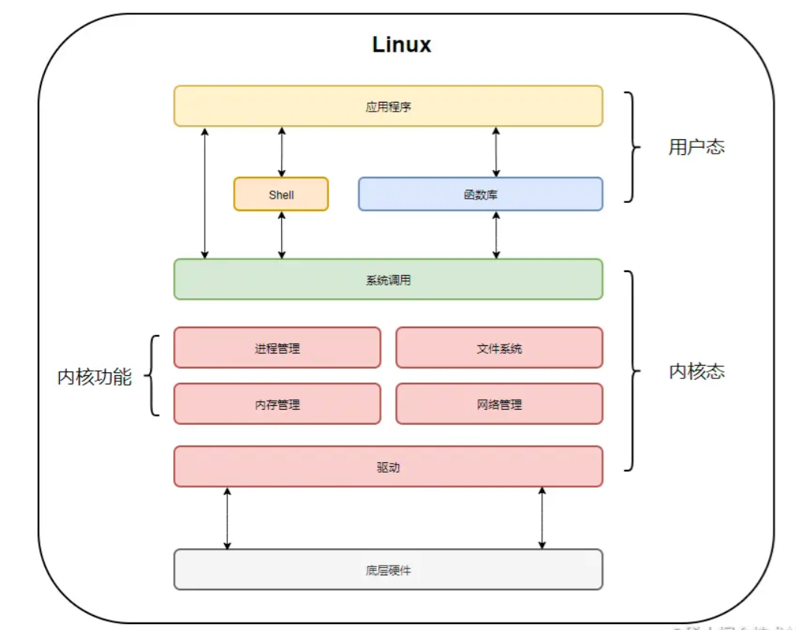

<font size = 6>OS</font>

[toc]

# 概述

## 基本特征

**并发**

- 并发：指宏观上在一段时间内能同时运行多个程序，操作系统通过引入进程和线程，使得程序能够并发运行
- 并行：指同一时刻能运行多个指令，并行需要硬件支持，如多流水线、多核处理器或者分布式计算系统

**共享**

共享是指系统中的资源可以被多个并发进程共同使用。

有两种共享方式

- 互斥共享

- 同时共享

互斥共享的资源称为临界资源，例如打印机等，在同一时刻只允许一个进程访问，需要用同步机制来实现互斥访问。

**虚拟**

虚拟技术把一个物理实体转换为多个逻辑实体。

主要有两种虚拟技术

- 时（时间）分复用技术：例如多个进程能在同一个处理器上并发执行使用了时分复用技术，让每个进程轮流占用处理器，每次只执行一小个时间片并快速切换

- 空（空间）分复用技术：例如虚拟内存使用了空分复用技术，它将物理内存抽象为地址空间，每个进程都有各自的地址空间。地址空间的页被映射到物理内存，地址空间的页并不需要全部在物理内存中，当使用到一个没有在物理内存的页时，执行页面置换算法，将该页置换到内存中

**异步**

异步指进程不是一次性执行完毕，而是走走停停，以不可知的速度向前推进。

## 基本功能

**进程管理**

- 进程控制
- 进程同步
- 进程通信
- 死锁处理
- 处理机调度等

**内存管理**

- 内存分配
- 地址映射
- 内存保护与共享
- 虚拟内存等

**文件管理** 

- 文件存储空间的管理
- 目录管理
- 文件读写管理和保护等

**设备管理** 

完成用户的 I/O 请求，方便用户使用各种设备，并提高设备的利用率。

主要包括

- 缓冲管理
- 设备分配
- 设备处理
- 虛拟设备等

## 用户态与内核态

**介绍** 

简单来说内核态就是操作系统运行线程，用户态就是线程执行用户自己的程序。

- 用户态：不能直接使用系统资源，也不能改变 CPU 的工作状态，并且只能访问这个用户程序自己的存储空间
- 内核态：为了安全性和稳定性，操作系统的程序不能随便访问，这就是内核态。内核态可以使用计算机所有的硬件资源，需要执行操作系统的程序就必须转换到内核态才能执行

**为什么要区分** 

在CPU的所有指令中，有一些指令是非常危险的，如果错用，将导致整个系统崩溃。比如清内存、设置时钟等。

所以，CPU将指令分为特权指令和非特权指令，对于那些危险的指令，只允许操作系统及其相关模块使用，普通的应用程序只能使用那些不会造成灾难的指令。

**CPU指令及权限** 

指令集是多个CPU指令的集合，有权限分级，不同级别权限能使用的 CPU指令集是有限的。

以 Intel CPU 为例，Inter把 CPU 指令集操作的权限由高到低划为4级

- ring 0
- ring 1
- ring 2
- ring 3

其中 ring 0 权限最高，可以使用所有 CPU 指令集，ring 3 权限最低，仅能使用常规 CPU 指令集，不能使用操作硬件资源的 CPU 指令集，比如 IO 读写、网卡访问、申请内存。

而Linux系统仅采用ring 0 和 ring 3 这两个权限。

- ring 0被叫做内核态，完全在操作系统内核中运行。有对硬件的所有操作权限，可以执行所有CPU指令集，访问任意地址的内存，在内核模式下的任何异常都是灾难性的，将会导致整台机器停机
- ring 3被叫做用户态，在应用程序中运行。代码没有对硬件的直接控制权限，也不能直接访问地址的内存，程序是通过调用系统接口来达到访问硬件和内存，在这种保护模式下，即时程序发生崩溃也是可以恢复的，在电脑上大部分程序都是在用户模式下运行的

**空间划分** 

在内存资源上的使用，操作系统对用户态与内核态也做了限制，每个进程创建都会分配虚拟空间地址。以Linux32位操作系统为例，操作系统会把虚拟控制地址划分为两部分，一部分为内核空间，另一部分为用户空间，高位的 1G 由内核使用，而低位的 3G 由各个进程使用。


- 用户态：只能操作 0-3G 范围的低位虚拟空间地址
- 内核态：0-4G 范围的虚拟空间地址都可以操作，尤其是对 3-4G 范围的高位虚拟空间地址必须由内核态去操作
- 每个进程的 高位 1G 都是一样的，即内核空间。只有剩余的 3G 才归进程自己使用，换句话说，高位 1G 的内核空间是被所有进程共享的

**用户态与内核态的切换**

- 系统调用：用户态进程通过系统调用向操作系统申请资源完成工作，例如 fork()就是一个创建新进程的系统调用，系统调用的机制核心使用了操作系统为用户特别开放的一个中断来实现
- 异常：当 CPU 在执行用户态的进程时，发生了一些没有预知的异常，这时当前运行进程会切换到处理此异常的内核相关进程中，也就是切换到了内核态，如缺页异常
- 中断：当 CPU 在执行用户态的进程时，外围设备完成用户请求的操作后，会向 CPU 发出相应的中断信号，这时 CPU 会暂停执行下一条即将要执行的指令，转到与中断信号对应的处理程序去执行，也就是切换到了内核态。如硬盘读写操作完成，系统会切换到硬盘读写的中断处理程序中执行后边的操作等



**切换开销大**

- 保留用户态现场（上下文、寄存器、用户栈等）
- 复制用户态参数，用户栈切到内核栈，进入内核态
- 额外的检查（因为内核代码对用户不信任）
- 执行内核态代码
- 复制内核态代码执行结果，回到用户态
- 恢复用户态现场（上下文、寄存器、用户栈等）

## 系统调用

如果一个进程在用户态需要使用内核态的功能，就进行系统调用从而陷入内核，由操作系统代为完成。


Linux 的系统调用主要有以下这些

|   Task   |          Commands           |
| :------: | :-------------------------: |
| 进程控制 |   fork(); exit(); wait();   |
| 进程通信 |  pipe(); shmget(); mmap();  |
| 文件操作 |  open(); read(); write();   |
| 设备操作 |  ioctl(); read(); write();  |
| 信息维护 | getpid(); alarm(); sleep(); |
|   安全   | chmod(); umask(); chown();  |

## 中断分类

**外中断**

由 CPU 执行指令以外的事件引起，如 I/O 完成中断，表示设备输入/输出处理已经完成，处理器能够发送下一个输入/输出请求。此外还有时钟中断、控制台中断等。

**异常**

由 CPU 执行指令的内部事件引起，如非法操作码、地址越界、算术溢出等。

**陷入**

在用户程序中使用系统调用。

## 宏内核和微内核

**宏内核**

宏内核是将操作系统功能作为一个紧密结合的整体放到内核。

由于各模块共享信息，因此有很高的性能。

**微内核**

由于操作系统不断复杂，因此将一部分操作系统功能移出内核，从而降低内核的复杂性。移出的部分根据分层的原则划分成若干服务，相互独立。

在微内核结构下，操作系统被划分成小的、定义良好的模块，只有微内核这一个模块运行在内核态，其余模块运行在用户态。

因为需要频繁地在用户态和核心态之间进行切换，所以会有一定的性能损失。


## 主流操作系统

- Windows
  - 特点：用户界面友好，驱动程序支持广泛，软件生态丰富，适合个人用户和企业办公
  - 应用场景：个人电脑、办公自动化、企业级服务器（Windows Server）
  - 内核特点：混合内核，结合了微内核和宏内核的优点，提供了高效的任务调度和设备驱动管理
- macOS
  - 特点：基于Unix内核，界面美观，系统稳定，与苹果硬件深度集成
  - 应用场景：个人电脑、创意设计、开发工作
  - 内核特点：继承了Unix的稳定性和微内核的模块化设计，适合多任务处理和图形界面操作
- Linux
  - 特点：开源免费，高度可定制，系统稳定，安全性高
  - 应用场景：服务器、云计算、嵌入式系统、个人电脑（桌面环境如GNOME、KDE）
  - 内核特点：宏内核，所有核心功能（如进程管理、内存管理、设备驱动）都在内核空间运行，性能高，但内核代码复
- Android
  - 特点：基于Linux内核，开源，应用生态丰富，适合移动设备
  - 应用场景：智能手机、平板电脑、智能穿戴设备
- iOS
  - 特点：闭源，系统稳定，与苹果硬件深度集成，应用质量高
  - 应用场景：iPhone、iPad、Apple Watch等苹果设备

# 进程管理

## 进程与线程

**进程**

进程是资源分配的基本单位。

进程控制块 (Process Control Block, PCB) 描述进程的基本信息和运行状态，所谓的创建进程和撤销进程，都是指对 PCB 的操作。

下图显示了 4 个程序创建了 4 个进程，这 4 个进程可以并发地执行。


**线程**

线程是独立调度的基本单位。

一个进程中可以有多个线程，它们共享进程资源。

例如QQ 和浏览器是两个进程，浏览器进程里面有很多线程，例如 HTTP 请求线程、事件响应线程、渲染线程等等，线程的并发执行使得在浏览器中点击一个新链接从而发起 HTTP 请求时，浏览器还可以响应用户的其它事件。


**区别**

1. 拥有资源：进程是资源分配的基本单位，而线程不拥有资源，但可以访问隶属进程的资源

2. 调度：线程是独立调度的基本单位，在同一进程中，线程的切换不会引起进程切换，从一个进程中的线程切换到另一个进程中的线程时，会引起进程切换
3. 系统开销：由于创建或撤销进程时，系统都要为之分配或回收资源，如内存空间、I/O 设备等，所付出的开销远大于创建或撤销线程时的开销。类似地，在进行进程切换时，涉及当前执行进程 CPU 环境的保存及新调度进程 CPU 环境的设置，而线程切换时只需保存和设置少量寄存器内容，开销很小
4. 通信方面：线程间可以通过直接读写同一进程中的数据进行通信，但是进程通信需要借助 IPC（进程间通信）

## 协程

**定义** 

协程是一种用户态的轻量级线程。它由程序员显式地控制其执行流程，允许程序在不同任务之间自由切换，而不需要操作系统内核的干预。

协程的切换通常在用户态完成，因此比线程切换更快、更高效。

多线程编程是比较困难的， 因为调度程序任何时候都能中断线程， 必须记住保留锁， 去保护程序中重要部分， 防止多线程在执行的过程中断。而协程默认会做好全方位保护， 以防止中断。对协程来说， 无需保留锁， 而在多个线程之间同步操作， 协程自身就会同步， 因为在任意时刻， 只有一个协程运行，所以很适合用于高并发处理。

**特点** 

- 轻量级：协程的创建和切换开销非常小，通常只需要几条指令，而线程切换需要操作系统内核的参与，开销较大
- 用户态切换：协程的切换在用户态完成，不需要切换到内核态，因此切换速度更快
- 协作式调度：协程的执行需要程序员显式地控制，即程序必须主动让出控制权或恢复执行。这与线程的抢占式调度不同，线程的调度由操作系统内核控制
- 高并发：由于协程的轻量级特性，可以在一个进程中创建大量的协程，从而实现高并发处理

**协程与线程的区别**

- 调度方式
  - 线程：由操作系统内核调度，是抢占式的，线程的切换由内核控制
  - 协程：由程序员显式控制，是协作式的，协程的切换由程序代码控制
- 切换开销
  - 线程：切换需要切换到内核态，保存和恢复线程的上下文，开销较大
  - 协程：切换在用户态完成，不需要切换到内核态，开销小
- 资源占用
  - 线程：每个线程都有独立的栈空间，占用较多的系统资源
  - 协程：通常共享主线程的栈空间，占用资源少（无需原子操作锁定及同步的开销，不用担心资源共享的问题）
- 并发能力
  - 线程：由于资源占用和切换开销的限制，一个进程中能创建的线程数量有限
  - 协程：由于轻量级特性，可以在一个进程中创建大量的协程，适合高并发场景

**限制**

- 无法使用 CPU 的多核：协程的本质是个单线程，它不能同时用上单个 CPU 的多个核，协程需要和进程配合才能运行在多CPU上
- 处处都要使用非阻塞代码

## 进程状态的切换


- 就绪状态（ready）：等待被调度
- 运行状态（running）
- 阻塞状态（waiting）：等待资源

注

1. 只有就绪态和运行态可以相互转换，其它的都是单向转换。就绪状态的进程通过调度算法从而获得 CPU 时间，转为运行状态；而运行状态的进程，在分配给它的 CPU 时间片用完之后就会转为就绪状态，等待下一次调度
2. 阻塞状态是缺少需要的资源从而由运行状态转换而来，但是该资源不包括 CPU 时间，缺少 CPU 时间会从运行态转换为就绪态

## 进程调度算法

不同环境的调度算法目标不同，因此需要针对不同环境来讨论调度算法。

###  批处理系统

批处理系统没有太多的用户操作，在该系统中，调度算法目标是保证吞吐量和周转时间（从提交到终止的时间）。

**1. 先来先服务 first-come first-serverd（FCFS）**

非抢占式的调度算法，按照请求的顺序进行调度。

有利于长作业，但不利于短作业，因为短作业必须一直等待前面的长作业执行完毕才能执行，而长作业又需要执行很长时间，造成了短作业等待时间过长。

**2. 短作业优先 shortest job first（SJF）**

非抢占式的调度算法，按估计运行时间最短的顺序进行调度。

长作业有可能会饿死，处于一直等待短作业执行完毕的状态。因为如果一直有短作业到来，那么长作业永远得不到调度。

**3. 最短剩余时间优先 shortest remaining time next（SRTN）**

最短作业优先的抢占式版本，按剩余运行时间的顺序进行调度。

 当一个新的作业到达时，其整个运行时间与当前进程的剩余时间作比较。如果新的进程需要的时间更少，则挂起当前进程，运行新的进程；否则新的进程等待。

### 交互式系统

交互式系统有大量的用户交互操作，在该系统中调度算法的目标是快速地进行响应。

**1. 时间片轮转**

将所有就绪进程按 FCFS 的原则排成一个队列，每次调度时，把 CPU 时间分配给队首进程，该进程可以执行一个时间片。当时间片用完时，由计时器发出时钟中断，调度程序便停止该进程的执行，并将它送往就绪队列的末尾，同时继续把 CPU 时间分配给队首的进程。

时间片轮转算法的效率和时间片的大小有很大关系

- 因为进程切换都要保存进程的信息并且载入新进程的信息，如果时间片太小，会导致进程切换得太频繁，在进程切换上就会花过多时间
- 而如果时间片过长，那么实时性就不能得到保证


**2. 优先级调度**

为每个进程分配一个优先级，按优先级进行调度。

为了防止低优先级的进程永远等不到调度，可以随着时间的推移增加等待进程的优先级。

**3. 多级反馈队列**

一个进程需要执行 100 个时间片，如果采用时间片轮转调度算法，那么需要交换 100 次。

多级队列是为这种需要连续执行多个时间片的进程考虑，它设置了多个队列，每个队列时间片大小都不同，例如 1,2,4,8,..。进程在第一个队列没执行完，就会被移到下一个队列。这种方式下，之前的进程可能需要交换 7 次。

每个队列优先权也不同，最上面的优先权最高。因此只有上一个队列没有进程在排队，才能调度当前队列上的进程。

可以将这种调度算法看成是时间片轮转调度算法和优先级调度算法的结合。


### 实时系统

实时系统要求一个请求在一个确定时间内得到响应。

- 硬实时：必须满足绝对的截止时间
- 软实时：后者可以容忍一定的超时

## 进程同步

**临界区** 

对临界资源进行访问的那段代码称为临界区。

为了互斥访问临界资源，每个进程在进入临界区之前，需要先进行检查。

**同步与互斥**

- 同步：多个进程因为合作产生的直接制约关系，使得进程有一定的先后执行关系
- 互斥：多个进程在同一时刻只有一个进程能进入临界区

**信号量**

信号量（Semaphore）是一个整型变量，可以对其执行 down 和 up 操作，也就是常见的 P 和 V 操作。

- down：如果信号量大于 0 ，执行 -1 操作；如果信号量等于 0，进程睡眠，等待信号量大于 0
- up：对信号量执行 +1 操作，唤醒睡眠的进程让其完成 down 操作

down 和 up 操作需要被设计成原语，不可分割，通常的做法是在执行这些操作的时候屏蔽中断。

如果信号量的取值只能为 0 或者 1，那么就成为了互斥量（Mutex），0 表示临界区已经加锁，1 表示临界区解锁。

```c
typedef int semaphore;
semaphore mutex = 1;
void P1() {
    down(&mutex);
    // 临界区
    up(&mutex);
}

void P2() {
    down(&mutex);
    // 临界区
    up(&mutex);
}
```

使用信号量实现生产者-消费者问题

问题描述：使用一个缓冲区来保存物品，只有缓冲区没有满，生产者才可以放入物品；只有缓冲区不为空，消费者才可以拿走物品。

因为缓冲区属于临界资源，因此需要使用一个互斥量 mutex 来控制对缓冲区的互斥访问。

```c
#define N 100						//缓冲区大小
typedef int semaphore;
semaphore mutex = 1;
semaphore empty = N;
semaphore full = 0;

void producer() {
    while(TRUE) {
        int item = produce_item();		//当前物品
        down(&empty);									//与consumer照应 防止死锁出现
        down(&mutex);
        insert_item(item);						//放入物品
        up(&mutex);
        up(&full);
    }
}

void consumer() {
    while(TRUE) {
        down(&full);
        down(&mutex);
        int item = remove_item();		
        consume_item(item);					//拿走物品
        up(&mutex);
        up(&empty);
    }
}
```

**管程**

使用信号量机制实现的生产者消费者问题需要客户端代码做很多控制，而管程把控制的代码独立出来，不仅不容易出错，也使得客户端代码调用更容易。

c 语言不支持管程，下面的示例代码使用了类 Pascal 语言来描述管程。示例代码的管程提供了 insert() 和 remove() 方法，客户端代码通过调用这两个方法来解决生产者-消费者问题。

```pascal
monitor ProducerConsumer
    integer i;
    condition c;

    procedure insert();
    begin
        // ...
    end;

    procedure remove();
    begin
        // ...
    end;
end monitor;
```

管程有一个重要特性：在一个时刻只能有一个进程使用管程。进程在无法继续执行的时候不能一直占用管程，否则其它进程永远不能使用管程。

管程引入了条件变量以及相关的操作：wait() 和 signal() 来实现同步操作。对条件变量执行 wait() 操作会导致调用进程阻塞，把管程让出来给另一个进程持有。signal() 操作用于唤醒被阻塞的进程。

使用管程实现生产者-消费者问题

```pascal
// 管程
monitor ProducerConsumer
    condition full, empty;
    integer count := 0;
    condition c;

    procedure insert(item: integer);
    begin
        if count = N then wait(full);			// 物品满时等待
        insert_item(item);						// 补充物品
        count := count + 1;
        if count = 1 then signal(empty);		// 唤醒
    end;

    function remove: integer;
    begin
        if count = 0 then wait(empty);			// 无物品时等待
        remove = remove_item;					// 购买物品
        count := count - 1;
        if count = N -1 then signal(full);		// 唤醒
    end;
end monitor;

// 生产者客户端
procedure producer
begin
    while true do
    begin
        item = produce_item;
        ProducerConsumer.insert(item);
    end
end;

// 消费者客户端
procedure consumer
begin
    while true do
    begin
        item = ProducerConsumer.remove;
        consume_item(item);
    end
end;
```

## 经典同步问题

生产者和消费者问题前面已经讨论过了。

### 哲学家进餐问题


五个哲学家围着一张圆桌，每个哲学家面前放着食物。哲学家的生活有两种交替活动：吃饭以及思考。当一个哲学家吃饭时，需要先拿起自己左右两边的两根筷子，并且一次只能拿起一根筷子。

下面是一种错误的解法，如果所有哲学家同时拿起左手边的筷子，那么所有哲学家都在等待其它哲学家吃完并释放自己手中的筷子，导致死锁。

```c
#define N 5

void philosopher(int i) {
    while(TRUE) {
        think();
        take(i);       	// 拿起左边的筷子
        take((i+1)%N); 	// 拿起右边的筷子
        eat();
        put(i);
        put((i+1)%N);
    }
}
```

为了防止死锁的发生，可以设置两个条件

- 必须同时拿起左右两根筷子
- 只有在两个邻居都没有进餐的情况下才允许进餐

```c
#define N 5
typedef int semaphore;

semaphore chopstick[N] = {1,1,1,1,1};

void philosopher(int i) {
    while(TRUE) {
      think();
      Swait(chopstick[i+1]%5,chopstick[i]);		// 使用and信号量机制
      eat();
      Signal(chopstick[i+1]%5,chopstick[i]);
    }
}
```

### 读者-写者问题

允许多个进程同时对数据进行读操作，但是不允许读和写以及写和写操作同时发生。

```c
typedef int semaphore;
semaphore rmutex = 1;
semaphore wmutex = 1;
int readcount = 0;

void reader() {
  while(TRUE) {
    down(&rmutex);
    if(readcount == 0) down(&wmutex);	//无读者无写者
    readcount++;
    up(&rmutex);						// 读开始
    ...
    perform read operation;
    ...
    down(&rmutex);
    readcount--;						// 读完 
    if(readcount == 0) up(&wmutex);		// 最后一个读完成
    up(&rmutex);
  }
}

void writer() {
  while(TRUE) {
    down(&wmutex);
    perform write operation;
    up(&wmutex);
  }
}
```

## 进程通信

进程同步与进程通信很容易混淆，它们的区别在于

- 进程同步：控制多个进程按一定顺序执行
- 进程通信：进程间传输信息

进程通信是一种手段，而进程同步是一种目的。也可以说，为了能够达到进程同步的目的，需要让进程进行通信，传输一些进程同步所需要的信息。

**管道**

管道是通过调用 pipe 函数创建的，fd[0] 用于读，fd[1] 用于写。

```c
#include <unistd.h>

int pipe(int fd[2]);
```

它具有以下限制

- 只支持半双工通信（单向交替传输）
- 只能在父子进程或者兄弟进程中使用


**FIFO**

也称为命名管道，去除了管道只能在父子进程中使用的限制。

```c
#include <sys/stat.h>

int mkfifo(const char *path, mode_t mode);
int mkfifoat(int fd, const char *path, mode_t mode);
```

FIFO 常用于客户-服务器应用程序中，FIFO 用作汇聚点，在客户进程和服务器进程之间传递数据。


**消息队列**

相比于 FIFO，消息队列具有以下优点

- 消息队列可以独立于读写进程存在，从而避免了 FIFO 中同步管道的打开和关闭时可能产生的困难
- 避免了 FIFO 的同步阻塞问题，不需要进程自己提供同步方法
- 读进程可以根据消息类型有选择地接收消息，而不像 FIFO 那样只能默认地接收

**信号量**

它是一个计数器，用于为多个进程提供对共享数据对象的访问。

**共享存储**

允许多个进程共享一个给定的存储区。因为数据不需要在进程之间复制，所以这是最快的一种 IPC。

需要使用信号量用来同步对共享存储的访问。

多个进程可以将同一个文件映射到它们的地址空间从而实现共享内存。另外共享内存不是使用文件，而是使用内存的匿名段。

**套接字**

与其它通信机制不同的是，它可用于不同机器间的进程通信。

# 死锁

## 必要条件


- 互斥条件：每个资源要么已经分配给了一个进程，要么就是可用的
- 请求保持：已经得到了某个资源的进程可以再请求新的资源
- 不可抢占：已经分配给一个进程的资源不能强制性地被抢占，它只能被占有它的进程显式地释放
- 循环等待：有两个或者两个以上的进程组成一条环路，该环路中的每个进程都在等待下一个进程所占有的资源

## 处理方法

主要有以下四种方法

- 鸵鸟策略
- 死锁检测与死锁恢复
- 死锁预防
- 死锁避免

### 鸵鸟策略

把头埋在沙子里，假装根本没发生问题。

因为解决死锁问题的代价很高，因此鸵鸟策略这种不采取任务措施的方案会获得更高的性能。

当发生死锁时不会对用户造成多大影响，或发生死锁的概率很低，可以采用鸵鸟策略。

大多数操作系统，包括 Unix，Linux 和 Windows，处理死锁问题的办法仅仅是忽略它。

### 死锁检测与死锁恢复

不试图阻止死锁，而是当检测到死锁发生时，采取措施进行恢复。

**每种进程一个资源的死锁检测**


上图为资源分配图，其中方框表示资源，圆圈表示进程。资源指向进程表示该资源已经分配给该进程，进程指向资源表示进程请求获取该资源。

图 a 可以抽取出环，如图 b，它满足了环路等待条件，因此会发生死锁。

每种类型一个资源的死锁检测算法是通过检测有向图是否存在环来实现，从一个节点出发进行深度优先搜索，对访问过的节点进行标记，如果访问了已经标记的节点，就表示有向图存在环，也就是检测到死锁的发生。

**每种进程多个资源的死锁检测**


上图中，有三个进程四个资源，每个数据代表的含义如下

- E 向量：资源总量
- A 向量：资源剩余量
- C 矩阵：每个进程所拥有的资源数量，每一行都代表一个进程拥有资源的数量
- R 矩阵：每个进程请求的资源数量

进程 P1 和 P2 所请求的资源都得不到满足，只有进程 P3 可以，让 P3 执行，之后释放 P3 拥有的资源，此时 A = (2 2 2 0)。P2 可以执行，执行后释放 P2 拥有的资源，A = (4 2 2 1) 。P1 也可以执行。所有进程都可以顺利执行，没有死锁。

算法总结如下

每个进程最开始时都不被标记，执行过程有可能被标记。当算法结束时，任何没有被标记的进程都是死锁进程。

1. 寻找一个没有标记的进程 Pi，它所请求的资源小于等于 A
2. 如果找到了这样一个进程，那么将 C 矩阵的第 i 行向量加到 A 中，标记该进程，并转回 1.
3. 如果没有这样一个进程，算法终止

**死锁恢复**

- 利用抢占恢复
- 利用回滚恢复
- 通过杀死进程恢复

### 死锁预防

在程序运行之前预防发生死锁，通过破坏产生死锁的必要条件一个或多个来实现。

**破坏互斥条件**

例如假脱机打印机技术允许若干个进程同时输出，唯一真正请求物理打印机的进程是打印机守护进程。

**破坏占有和等待条件**

一种实现方式是规定所有进程在开始执行前请求所需要的全部资源。

**破坏不可抢占条件**

**破坏环路等待**

给资源统一编号，进程只能按编号顺序来请求资源。

### 死锁避免

在程序运行时避免发生死锁。

**安全状态**


图 a 的第二列 Has 表示已拥有的资源数，第三列 Max 表示总共需要的资源数，Free 表示还有可以使用的资源数。从图 a 开始出发，先让 B 拥有所需的所有资源（图 b），运行结束后释放 B，此时 Free 变为 5（图 c）；接着以同样的方式运行 C 和 A，使得所有进程都能成功运行，因此可以称图 a 所示的状态时安全的。

定义：如果没有死锁发生，并且即使所有进程突然请求对资源的最大需求，也仍然存在某种调度次序能够使得每一个进程运行完毕，则称该状态是安全的。

安全状态的检测与死锁的检测类似，因为安全状态必须要求不能发生死锁。

**单个资源的银行家算法**


上图 c 为不安全状态，因此算法会拒绝进程c的请求，从而避免进入图 c 中的状态。

**多个资源的银行家算法**


上图中有五个进程，四个资源。左边的图表示已经分配的资源，右边的图表示还需要分配的资源。最右边的 E、P 以及 A 分别表示：总资源、已分配资源以及可用资源，注意这三个为向量，而不是具体数值，例如 A=(1020)，表示 4 个资源分别还剩下 1/0/2/0。

检查一个状态是否安全的算法如下

- 查找右边的矩阵是否存在一行小于等于向量 A。如果不存在这样的行，那么系统将会发生死锁，状态是不安全的
- 假若找到这样一行，将该进程标记为终止，并将其已分配资源加到 A 中
- 重复以上两步，直到所有进程都标记为终止，则状态时安全的

如果一个状态不是安全的，需要拒绝进入这个状态。

# 内存管理

## 虚拟内存

虚拟内存的目的是为了让物理内存扩充成更大的逻辑内存，从而让程序获得更多的可用内存。

为了更好的管理内存，操作系统将内存抽象成地址空间。每个程序拥有自己的地址空间，这个地址空间被分割成多个块，每一块称为一页。这些页被映射到物理内存，但不需要映射到连续的物理内存，也不需要所有页都必须在物理内存中。虚拟内存可以把一些暂时不用的数据可以放在硬盘（交换区 / page file），需要时再加载到内存。当程序引用到不在物理内存中的页时，由硬件执行必要的映射，将缺失的部分装入物理内存并重新执行失败的指令。

虚拟内存允许程序不用将地址空间中的每一页都映射到物理内存，也就是说一个程序不需要全部调入内存就可以运行，这使得有限的内存运行大程序成为可能。例如有一台计算机可以产生 16 位地址，那么一个程序的地址空间范围是 0~64K。该计算机只有 32KB 的物理内存，虚拟内存技术允许该计算机运行一个 64K 大小的程序。


## 分页系统地址映射

内存管理单元（MMU）管理着地址空间和物理内存的转换，其中的页表（Page table）存储着页（程序地址空间）和页框（物理内存空间）的映射表。

一个虚拟地址分成两个部分，一部分存储页面号，一部分存储偏移量。

下图的页表存放着 16 个页，这 16 个页需要用 4 个比特位来进行索引定位。例如对于虚拟地址（0010 000000000100），前 4 位是存储页面号 2，读取表项内容为（110 1），页表项最后一位表示是否存在于内存中，1 表示存在。后 12 位存储偏移量。这个页对应的页框的地址为 （110 000000000100）。


## 页面置换算法

在程序运行过程中，如果要访问的页面不在内存中，就发生缺页中断从而将该页调入内存中。此时如果内存已无空闲空间，系统必须从内存中调出一个页面到磁盘对换区中来腾出空间。

页面置换算法和缓存淘汰策略类似，可以将内存看成磁盘的缓存。在缓存系统中，缓存的大小有限，当有新的缓存到达时，需要淘汰一部分已经存在的缓存，这样才有空间存放新的缓存数据。

页面置换算法的主要目标是使页面置换频率最低（也可以说缺页率最低）。

**最佳**

> OPT, Optimal replacement algorithm

所选择的被换出的页面将是最长时间内不再被访问，通常可以保证获得最低的缺页率。

是一种理论上的算法，因为无法知道一个页面多长时间不再被访问。

举例：一个系统为某进程分配了三个物理块，并有如下页面引用序列

```html
7，0，1，2，0，3，0，4，2，3，0，3，2，1，2，0，1，7，0，1
```

开始运行时，先将 7, 0, 1 三个页面装入内存。当进程要访问页面 2 时，产生缺页中断，会将页面 7 换出，因为页面 7 再次被访问的时间最长。

**最近最久未使用**

> LRU, Least Recently Used

虽然无法知道将来要使用的页面情况，但是可以知道过去使用页面的情况。LRU 将最近最久未使用的页面换出。

为了实现 LRU，需要在内存中维护一个所有页面的链表。当一个页面被访问时，将这个页面移到链表表头。这样就能保证链表表尾的页面是最近最久未访问的。

因为每次访问都需要更新链表，因此这种方式实现的 LRU 代价很高。

```html
4，7，0，7，1，0，1，2，1，2，6
```


**最近未使用**

> NRU, Not Recently Used

每个页面都有两个状态位：R 与 M，当页面被访问时设置页面的 R=1，当页面被修改时设置 M=1。其中 R 位会定时被清零。

可以将页面分成以下四类

- R=0，M=0
- R=0，M=1
- R=1，M=0
- R=1，M=1

当发生缺页中断时，NRU 算法随机地从类编号最小的非空类中挑选一个页面将它换出。

NRU 优先换出已经被修改的脏页面（R=0，M=1），而不是被频繁使用的干净页面（R=1，M=0）。

**先进先出**

> FIFO, First In First Out

选择换出的页面是最先进入的页面。

该算法会将那些经常被访问的页面换出，导致缺页率升高。

**第二次机会算法**

FIFO 算法可能会把经常使用的页面置换出去，为了避免这一问题，对该算法做一个简单的修改。

当页面被访问 (读或写) 时设置该页面的 R 位为 1。需要替换的时候，检查最老页面的 R 位。如果 R 位是 0，那么这个页面既老又没有被使用，可以立刻置换掉；如果是 1，就将 R 位清 0，并把该页面放到链表的尾端，修改它的装入时间使它就像刚装入的一样，然后继续从链表的头部开始搜索。


**时钟**

> Clock

第二次机会算法需要在链表中移动页面，降低了效率。时钟算法使用环形链表将页面连接起来，再使用一个指针指向最老的页面。


## 分段

虚拟内存采用的是分页技术，也就是将地址空间划分成固定大小的页，每一页再与内存进行映射。

下图为一个编译器在编译过程中建立的多个表，有 4 个表是动态增长的，如果使用分页系统的一维地址空间，动态增长的特点会导致覆盖问题的出现。


分段的做法是把每个表分成段，一个段构成一个独立的地址空间。每个段的长度可以不同，并且可以动态增长。


**段页式**

程序的地址空间划分成多个拥有独立地址空间的段，每个段上的地址空间划分成大小相同的页。这样既拥有分段系统的共享和保护，又拥有分页系统的虚拟内存功能。

**分页与分段的比较**

- 对程序员的透明性：分页透明，但是分段需要程序员显式划分每个段
- 地址空间的维度：分页是一维地址空间，分段是二维的
- 大小是否可以改变：页的大小不可变，段的大小可以动态改变
- 出现的原因：分页主要用于实现虚拟内存，从而获得更大的地址空间；分段主要是为了使程序和数据可以被划分为逻辑上独立的地址空间并且有助于共享和保护

# 设备管理

## 磁盘结构

- 盘面（Platter）：一个磁盘有多个盘面
- 磁道（Track）：盘面上的圆形带状区域，一个盘面可以有多个磁道
- 扇区（Track Sector）：磁道上的一个弧段，一个磁道可以有多个扇区，它是最小的物理储存单位，目前主要有 512 bytes 与 4 K 两种大小
- 磁头（Head）：与盘面非常接近，能够将盘面上的磁场转换为电信号（读），或者将电信号转换为盘面的磁场（写）
- 制动手臂（Actuator arm）：用于在磁道之间移动磁头
- 主轴（Spindle）：使整个盘面转动


## 磁盘调度算法

读写一个磁盘块的时间的影响因素有

- 旋转时间（主轴转动盘面，使得磁头移动到适当的扇区上）
- 寻道时间（制动手臂移动，使得磁头移动到适当的磁道上）
- 实际的数据传输时间

其中，寻道时间最长，因此磁盘调度的主要目标是使磁盘的平均寻道时间最短。

**先来先服务**

> FCFS, First Come First Served

按照磁盘请求的顺序进行调度。

优点是公平和简单。缺点也很明显，因为未对寻道做任何优化，使平均寻道时间可能较长。

**最短寻道时间优先**

> SSTF, Shortest Seek Time First

优先调度与当前磁头所在磁道距离最近的磁道。

虽然平均寻道时间比较低，但是不够公平。如果新到达的磁道请求总是比一个在等待的磁道请求近，那么在等待的磁道请求会一直等待下去，也就是出现饥饿现象。具体来说，两端的磁道请求更容易出现饥饿现象。


**电梯算法**

> SCAN

电梯总是保持一个方向运行，直到该方向没有请求为止，然后改变运行方向。

电梯算法（扫描算法）和电梯的运行过程类似，总是按一个方向来进行磁盘调度，直到该方向上没有未完成的磁盘请求，然后改变方向。

因为考虑了移动方向，因此所有的磁盘请求都会被满足，解决了 SSTF 的饥饿问题。


# 链接

## 编译系统

以下是一个 hello.c 程序

```c
#include <stdio.h>

int main()
{
    printf("hello, world\n");
    return 0;
}
```

在 Unix 系统上，由编译器把源文件转换为目标文件。

```bash
gcc -o hello hello.c
```

这个过程大致如下


- 预处理阶段：处理以 # 开头的预处理命令
- 编译阶段：翻译成汇编文件
- 汇编阶段：将汇编文件翻译成可重定位目标文件
- 链接阶段：将可重定位目标文件和 printf.o 等单独预编译好的目标文件进行合并，得到最终的可执行目标文件

## 目标文件

- 可执行目标文件：可以直接在内存中执行
- 可重定位目标文件：可与其它可重定位目标文件在链接阶段合并，创建一个可执行目标文件
- 共享目标文件：这是一种特殊的可重定位目标文件，可以在运行时被动态加载进内存并链接

## 静态链接

静态链接器以一组可重定位目标文件为输入，生成一个完全链接的可执行目标文件作为输出。

链接器主要完成以下两个任务

- 符号解析：每个符号对应于一个函数、一个全局变量或一个静态变量，符号解析的目的是将每个符号引用与一个符号定义关联起来
- 重定位：链接器通过把每个符号定义与一个内存位置关联起来，然后修改所有对这些符号的引用，使得它们指向这个内存位置


## 动态链接

静态库有以下两个问题

- 当静态库更新时那么整个程序都要重新进行链接
- 对于 printf 这种标准函数库，如果每个程序都要有代码，这会极大浪费资源

共享库是为了解决静态库的这两个问题而设计的，在 Linux 系统中通常用 .so 后缀来表示，Windows 系统上它们被称为 DLL。

它具有以下特点

- 在给定的文件系统中一个库只有一个文件，所有引用该库的可执行目标文件都共享这个文件，它不会被复制到引用它的可执行文件中
- 在内存中，一个共享库的 .text 节（已编译程序的机器代码）的一个副本可以被不同的正在运行的进程共享


