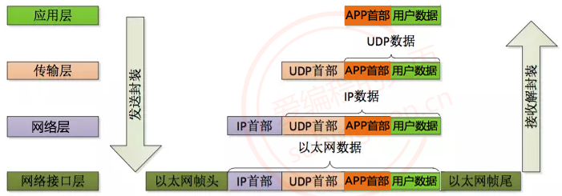

<font size = 6>计算机网络</font>

[toc]

# 概述

## 概念

**局域网和广域网**

- 局域网：局域网将一定区域内的各种计算机、外部设备和数据库连接起来形成计算机通信的私有网络
- 广域网：又称广域网、外网、公网。是连接不同地区局域网或城域网计算机通信的远程公共网络

**网络的网络**

网络把主机连接起来，而互连网（internet）是把多种不同的网络连接起来，因此互连网是网络的网络。

## 主机间通信方式

- 客户-服务器（C/S）：客户是服务的请求方，服务器是服务的提供方


- 对等（P2P）：不区分客户和服务器


## 电路交换与分组交换

**电路交换**

电路交换用于电话通信系统，两个用户要通信之前需要建立一条专用的物理链路，并且在整个通信过程中始终占用该链路。由于通信的过程中不可能一直在使用传输线路，因此电路交换对线路的利用率很低，往往不到 10%。

**分组交换**

每个分组都有首部和尾部，包含了源地址和目的地址等控制信息，在同一个传输线路上同时传输多个分组互相不会影响，因此在同一条传输线路上允许同时传输多个分组，也就是说分组交换不需要占用传输线。

## 时延

总时延 = 排队时延 + 处理时延 + 传输时延 + 传播时延


* 排队时延：分组在路由器的输入队列和输出队列中排队等待的时间，取决于网络当前的通信量
* 处理时延：主机或路由器收到分组时进行处理所需要的时间，例如分析首部、从分组中提取数据、进行差错检验或查找适当的路由等
* 传输时延：主机或路由器传输数据帧所需要的时间
* 传播时延：电磁波在信道中传播所需要花费的时间，电磁波传播的速度接近光速

## 常用设备/机构

**网卡**

- 定义：网卡是一种硬件设备，用来把计算机连接到网络（局域网 LAN 或互联网）
- 功能
	- 把计算机内部的数据转换成电信号/光信号/无线电波，发送到网络里
	- 接收来自网络的数据，并交给操作系统处理
- 类型
	- 有线网卡（以太网口，RJ45 接口）
	- 无线网卡（Wi-Fi，连接路由器/热点）

**交换机**

- 定义：交换机是一种网络设备，用来把多个设备（电脑、打印机、服务器）接入一个局域网
- 功能
	- 根据 MAC 地址 转发数据，只把数据发给目标设备（比集线器更智能）
	- 提高局域网内的通信效率
- 类型
	- 二层交换机（工作在数据链路层，只看 MAC 地址）
	- 三层交换机（能理解 IP 地址，功能类似部分路由器）

**路由器**

- 定义：路由器是一种能在不同网络之间转发数据包的设备
- 功能
	- 根据 IP 地址 决定数据包走哪条路径（路由选择）
	- 把家用网络连接到运营商的公网 IP
	- 提供 NAT（地址转换），让多台设备共享一个公网 IP

**运营商**

- 定义：运营商是提供网络接入服务的公司
- 功能
	- 给用户分配公网 IP，接入互联网
	- 维护网络基础设施（光纤、基站、骨干网）
	- 负责不同地区/国家之间的网络互联

## 计网体系结构


**五层协议**

1. 应用层 

   - 功能
     - 定义应用程序之间通信的规则
     - 提供各种网络服务（网页、邮箱、文件传输、远程登录）
   - 单位：报文（Message）
   - 常见协议
     - Web：HTTP, HTTPS
     - 邮件：SMTP, POP3, IMAP
     - 文件传输：FTP, SFTP
     - 域名解析：DNS
     - 远程登录：SSH, Telnet
   - 常见设备：服务器（Web 服务器、DNS 服务器等）
2. 传输层

   - 功能
   	- 为应用进程之间提供端到端的通信服务
   	- 提供端口号来区分不同应用（如 HTTP=80，HTTPS=443）
   	- 提供可靠性（错误恢复、重传、流量控制）
   - 单位：报文段（Segment）
   - 常见协议
   	- TCP：面向连接，可靠传输（三次握手、四次挥手），用于网页、邮件等
   	- UDP：无连接，不可靠传输，效率高，用于语音、视频、游戏等
   	- 常见设备：通常由操作系统内核实现，不是硬件设备
3. 网络层

   - 功能
   	- 把数据封装成数据报（Packet）
   	- 提供逻辑寻址（IP 地址），不同网络之间的通信
   	- 路由选择：决定数据包的传输路径
   - 单位：数据报（Packet）
   - 常见协议：IP（IPv4、IPv6）、ICMP（ping）、ARP、RIP、OSPF、BGP
   - 常见设备：路由器、三层交换机
4. 数据链路层
	- 功能
		- 把网络层传下来的数据报封装成帧（Frame）
		- 使用 MAC 地址来标识设备
		- 进行差错检测（如 CRC 校验），保证帧在一条链路上无误传输
	- 单位：帧（Frame）
	- 常见协议：以太网（Ethernet）、PPP、HDLC、ARP
	- 常见设备：交换机、网卡
5. 物理层
	- 功能：最底层，定义比特如何通过物理介质传输，如规定接口标准、传输速率、电压等
	- 单位：比特（bit）
	- 常见设备：中继器、集线器、网线、光纤、Wi-Fi 信号发射器

**OSI**

- 表示层：负责数据表示、加密、压缩
- 会话层：负责建立、管理、终止会话

五层协议没有表示层和会话层，而是将这些功能留给应用程序开发者处理。

**TCP/IP**

只有四层，相当于五层协议中数据链路层和物理层合并为网络接口层。

**数据传递过程**

自顶向下封装，自底向上解封装：在向下的过程中，需要添加下层协议所需要的首部或者尾部，而在向上的过程中不断拆开首部和尾部。



# 物理层

## 介绍

**通信方式**

根据信息在传输线上的传送方向，分为以下三种通信方式

* 单工通信：单向传输
* 半双工通信：双向交替传输
* 全双工通信：双向同时传输

**信号分类**

* 模拟信号：连续的信号
* 数字信号：离散的信号

# 链路层

## 概要

**封装成帧**

将网络层传下来的分组添加首部和尾部，用于标记帧的开始和结束


**差错检测**

目前数据链路层广泛使用了循环冗余检验（CRC）来检查比特差错

## 信道分类

**广播信道**

- 一对多通信，一个节点发送的数据能够被广播信道上所有的节点接收到
- 所有的节点都在同一个广播信道上发送数据，因此需要有专门的控制方法进行协调，避免发生冲突（冲突也叫碰撞）
- 主要有两种控制方法进行协调，一个是使用信道复用技术，一是使用 CSMA/CD 协议

**点对点信道**

- 一对一通信
- 因为不会发生碰撞，因此也比较简单，使用 PPP 协议进行控制

## 信道复用技术

+ 频分复用：频分复用的所有主机在相同的时间占用不同的频率带宽资源
+ 时分复用：时分复用的所有主机在不同的时间占用相同的频率带宽资源
+ 波分复用：光的频分复用。由于光的频率很高，因此习惯上用波长而不是频率来表示所使用的光载波
+ 码分复用

## CSMA/CD协议

CSMA/CD 表示载波监听多点接入 / 碰撞检测。

## PPP协议

互联网用户通常需要连接到某个 ISP 之后才能接入到互联网，PPP 协议是用户计算机和 ISP 进行通信时所使用的数据链路层协议。

## MAC地址

MAC 地址是链路层地址，长度为 6 字节（48 位），用于唯一标识网络适配器（网卡）。

一台主机拥有多少个网络适配器就有多少个 MAC 地址。例如笔记本电脑普遍存在无线网络适配器和有线网络适配器，因此就有两个 MAC 地址。

## 交换机

交换机具有自学习能力，学习的是交换表的内容，交换表中存储着 MAC 地址到接口的映射。

正是由于这种自学习能力，因此交换机是一种即插即用设备，不需要网络管理员手动配置交换表内容。

## 虚拟局域网

虚拟局域网可以建立与物理位置无关的逻辑组，只有在同一个虚拟局域网中的成员才会收到链路层广播信息。

# 网络层

## 概要

因为网络层是整个互联网的核心，因此应当让网络层尽可能简单。网络层向上只提供简单灵活的、无连接的、尽最大努力交互的数据报服务。

使用 IP 协议，可以把异构的物理网络连接起来，使得在网络层看起来好像是一个统一的网络。


## IP

### IP 数据报格式


- 版本 : 有 4（IPv4）和 6（IPv6）两个值
- 首部长度 : 占 4 位，因此最大值为 15。值为 1 表示的是 1 个 32 位字的长度，也就是 4 字节。因为固定部分长度为 20 字节，因此该值最小为 5。如果可选字段的长度不是 4 字节的整数倍，就用尾部的填充部分来填充
- 区分服务 : 用来获得更好的服务，一般情况下不使用
- 总长度 : 包括首部长度和数据部分长度
- 生存时间 ：TTL，它的存在是为了防止无法交付的数据报在互联网中不断兜圈子。以路由器跳数为单位，当 TTL 为 0 时就丢弃数据报
- 协议 ：指出携带的数据应该上交给哪个协议进行处理，例如 ICMP、TCP、UDP 等
- 首部检验和 ：因为数据报每经过一个路由器，都要重新计算检验和，因此检验和不包含数据部分可以减少计算的工作量
- 标识 : 在数据报长度过长从而发生分片的情况下，相同数据报的不同分片具有相同的标识符
- 片偏移 : 和标识符一起，用于发生分片的情况。片偏移的单位为 8 字节

### IP 地址编址方式

**分类**

由两部分组成，网络号和主机号，其中不同分类具有不同的网络号长度，并且是固定的。

IP 地址 ::= {< 网络号 >, < 主机号 >}


**子网划分**

通过在主机号字段中拿一部分作为子网号，把两级 IP 地址划分为三级 IP 地址。

IP 地址 ::= {< 网络号 >, < 子网号 >, < 主机号 >}

要使用子网，必须配置子网掩码。一个 B 类地址的默认子网掩码为 255.255.0.0，如果 B 类地址的子网占两个比特，那么子网掩码为 11111111 11111111 11000000 00000000，也就是 255.255.192.0。

注意，外部网络看不到子网的存在。

**无分类**

无分类编址 CIDR 消除了传统 A 类、B 类和 C 类地址以及划分子网的概念，使用网络前缀和主机号来对 IP 地址进行编码，网络前缀的长度可以根据需要变化。

IP 地址 ::= {< 网络前缀号 >, < 主机号 >}

CIDR 的记法上采用在 IP 地址后面加上网络前缀长度的方法，例如 128.14.35.7/20 表示前 20 位为网络前缀，后12为主机位，主机号全0为子网网络地址，主机号全1为子网广播地址。

CIDR 的地址掩码可以继续称为子网掩码，子网掩码首 1 长度为网络前缀的长度。

一个 CIDR 地址块中有很多地址，一个 CIDR 表示的网络就可以表示原来的很多个网络，并且在路由表中只需要一个路由就可以代替原来的多个路由，减少了路由表项的数量。把这种通过使用网络前缀来减少路由表项的方式称为路由聚合，也称为 构成超网。

在路由表中的项目由“网络前缀”和“下一跳地址”组成，在查找时可能会得到不止一个匹配结果，应当采用最长前缀匹配来确定应该匹配哪一个。

### IP分类

IP（Internet Protocol）：本质是一个整形数，用于表示计算机在网络中的地址。IP协议版本有两个

**IPv4**

- 使用一个32位的整形数描述一个IP地址，4个字节，int型，也可以使用一个点分十进制字符串描述这个IP地址，如192.168.247.135
- 分成了4份，每份1字节，8bit（char），最大值为 255
- 按照IPv4协议计算，可以使用的IP地址共有 2^32^ 个

**IPv6**

- 使用一个128位的整形数描述一个IP地址，16个字节，也可以使用一个字符串描述这个IP地址如，2001:0db8:3c4d:0015:0000:0000:1a2f:1a2b
- 分成了8份，每份2字节，每一部分以16进制的方式表示
- 按照IPv6协议计算，可以使用的IP地址共有 2^128^ 个

## 地址解析协议-ARP

网络层实现主机之间的通信，而链路层实现具体每段链路之间的通信。因此在通信过程中，IP 数据报的源地址和目的地址始终不变，而 MAC 地址随着链路的改变而改变。


ARP 实现由 IP 地址得到 MAC 地址。


## 网际控制报文协议-ICMP

ICMP 是为了更有效地转发 IP 数据报和提高交付成功的机会。它封装在 IP 数据报中，但是不属于高层协议。

ICMP 报文分为差错报告报文和询问报文。


**Ping**

Ping 是 ICMP 的一个重要应用，主要用来测试两台主机之间的连通性。

Ping 的原理是通过向目的主机发送 ICMP Echo 请求报文，目的主机收到之后会发送 Echo 回答报文。Ping 会根据时间和成功响应的次数估算出数据包往返时间以及丢包率。

**Traceroute**

Traceroute 是 ICMP 的另一个应用，用来跟踪一个分组从源点到终点的路径。

Traceroute 发送的 IP 数据报封装的是无法交付的 UDP 用户数据报，并由目的主机发送终点不可达差错报告报文。

## 虚拟专用网-VPN

由于 IP 地址的紧缺，一个机构能申请到的 IP 地址数往往远小于本机构所拥有的主机数。并且一个机构并不需要把所有的主机接入到外部的互联网中，机构内的计算机可以使用仅在本机构有效的 IP 地址（专用地址）。

有三个专用地址块

- 10.0.0.0 ~ 10.255.255.255
- 172.16.0.0 ~ 172.31.255.255
- 192.168.0.0 ~ 192.168.255.255

## 网络地址转换-NAT

专用网内部的主机使用本地 IP 地址又想和互联网上的主机通信时，可以使用 NAT 来将本地 IP 转换为全球 IP。

在以前，NAT 将本地 IP 和全球 IP 一一对应，这种方式下拥有 n 个全球 IP 地址的专用网内最多只可以同时有 n 台主机接入互联网。为了更有效地利用全球 IP 地址，现在常用的 NAT 转换表把传输层的端口号也用上了，使得多个专用网内部的主机共用一个全球 IP 地址。使用端口号的 NAT 也叫做网络地址与端口转换 NAPT。

## 路由器的结构

路由器从功能上可以划分为：路由选择和分组转发。

分组转发结构由三个部分组成：交换结构、一组输入端口和一组输出端口。


## 路由选择协议

路由选择协议都是自适应的，能随着网络通信量和拓扑结构的变化而自适应地进行调整。

互联网可以划分为许多较小的自治系统 AS，一个 AS 可以使用一种和别的 AS 不同的路由选择协议。

# 传输层

网络层只把分组发送到目的主机，但是真正通信的并不是主机而是主机中的进程。传输层提供了进程间的逻辑通信，传输层向高层用户屏蔽了下面网络层的核心细节，使应用程序看起来像是在两个传输层实体之间有一条端到端的逻辑通信信道。

## 端口

**介绍**

端口包括逻辑端口和物理端口两种类型

- 物理端口是用于连接物理设备之间的接口，如ADSL Modem、集线器、交换机、路由器上用于连接其他网络设备的接口
- 逻辑端口是指逻辑意义上用于区分服务的端口，比如用于浏览网页服务的80端口，用于FTP服务的21端口等

**定义**

逻辑端口号是一个16位的无符号整数，范围从 0 到 65535。作用是定位到主机上的某一个进程，通过这个端口进程就可以接受到对应的网络数据了。

**作用**

- 区分不同的应用程序：在同一台计算机上，多个应用程序可能同时使用网络服务。端口号用于区分这些应用程序，确保网络数据能够被正确地发送到目标应用程序
- 实现多路复用：通过端口号，操作系统可以将网络数据正确地分配到不同的应用程序中，实现多个应用程序在同一个网络连接上同时运行

**分类**

- 系统端口：0 到 1023，这些端口号通常被分配给标准的服务程序，如HTTP（80）、FTP（21）、SMTP（25）等。这些端口号由IANA（Internet Assigned Numbers Authority）管理，普通用户和应用程序不能使用
- 注册端口：1024 到 49151，这些端口号被分配给用户或应用程序。虽然这些端口号可以被普通用户使用，但最好先向IANA注册，以避免冲突
- 动态或私有端口：49152 到 65535，这些端口号通常用于临时分配给客户端应用程序，用于临时通信。这些端口号不会被分配给特定的服务，因此可以自由使用

**常用端口**

| 应用             | 应用层协议 | 端口号 | 传输层协议 |            备注             |
| ---------------- | :--------: | :----: | :--------: | :-------------------------: |
| 域名解析         |    DNS     |   53   |  UDP/TCP   | 长度超过 512 字节时使用 TCP |
| 动态主机配置协议 |    DHCP    | 67/68  |    UDP     |                             |
| 文件传送协议     |    FTP     | 20/21  |    TCP     |  控制连接 21，数据连接 20   |
| 超文本传送协议   |    HTTP    |   80   |    TCP     |                             |

注

1. 同一个端口号可以在TCP和UDP中分别使用
2. 不要在应用程序中使用0到1023的端口号，这些端口号通常被分配给标准服务
3. 通过IP地址可以定位到某一台主机，通过端口就可以定位到主机上的某一个进程
4. 通过指定的IP和端口，发送数据的时候对端就能接受到数据了
5. 如果这个进程不需要网络通信，那么这个进程就不需要绑定端口的
6. 一个端口只能给某一个进程使用，多个进程不能同时使用同一个端口

## 传输控制协议-TCP

TCP（Transmission Control Protocol）是传输层协议，具有以下特点

- 面向连接
- 可靠传输
- 面向字节流
- 全双工通信


> - 源端口：表示发送端端口号，字段长 16 位，2个字节
> - 目的端口：表示接收端端口号，字段长 16 位，2个字节
> - 序号（sequence number）：字段长 32 位，占4个字节，序号的范围为 [0，4284967296]
>   - 由于TCP是面向字节流的，在一个TCP连接中传送的字节流中的每一个字节都按顺序编号
>   - 首部中的序号字段则是指本报文段所发送的数据的第一个字节的序号，这是随机生成的
>   - 序号是循环使用的，当序号增加到最大值时，下一个序号就又回到了0
> - 确认序号（acknowledgement number）：占32位（4字节），表示收到的下一个报文段的第一个数据字节的序号，如果确认序号为N，序号为S，则表明到序号N-S为止的所有数据字节都已经被正确地接收到了
> - 8个标志位（Flag）
>   - CWR：CWR 标志与后面的 ECE 标志都用于 IP 首部的 ECN 字段，ECE 标志为 1 时，则通知对方已将拥塞窗口缩小
>   - ECE：若其值为 1 则会通知对方，从对方到这边的网络有阻塞。在收到数据包的 IP 首部中 ECN 为 1 时将 TCP 首部中的 ECE 设为 1
>   - URG：该位设为 1，表示包中有需要紧急处理的数据，对于需要紧急处理的数据，与后面的紧急指针有关
>   - ACK：该位设为 1，确认应答的字段有效，TCP规定除了最初建立连接时的 SYN 包之外该位必须设为 1
>   - PSH：该位设为 1，表示需要将收到的数据立刻传给上层应用协议，若设为 0，则先将数据进行缓存
>   - RST：该位设为 1，表示 TCP 连接出现异常必须强制断开连接
>   - SYN：用于建立连接，该位设为 1，表示希望建立连接，并在其序列号的字段进行序列号初值设定
>   - FIN：该位设为 1，表示今后不再有数据发送，希望断开连接
> - 窗口大小：该字段长 16 位，表示从确认序号所指位置开始能够接收的数据大小，TCP 不允许发送超过该窗口大小的数据

### TCP 的三次握手

**须满足条件**

- 服务器端：已经启动，并且启动了监听
- 客户端：基于服务器端监听的IP和端口，向服务器端发起连接请求


**步骤**

1. 首先 B 处于 LISTEN（监听)状态，等待客户的连接请求
2. A 向 B 发送连接请求报文，SYN=1，ACK=0，选择一个初始的序号 x
3. B 收到连接请求报文，如果同意建立连接，则向 A 发送连接确认报文，SYN=1，ACK=1，确认号为 x+1，同时也选择一个初始的序号 y
4. A 收到 B 的连接确认报文后，还要向 B 发出确认，确认号为 y+1，序号为 x+1
5. B 收到 A 的确认后，连接建立

**原因**

第三次握手是为了防止失效的连接请求到达服务器，让服务器错误打开连接。

如果发送的连接请求如果在网络中滞留，那么客户端等待一个超时重传时间之后，就会重新请求连接。但是这个滞留的连接请求最后还是会到达服务器，如果不进行三次握手，那么服务器就会打开两个连接。如果有第三次握手，客户端会忽略服务器之后发送的对滞留连接请求的连接确认，不进行第三次握手，因此就不会再次打开连接。

### TCP 的四次挥手


**步骤**

以下描述不讨论序号和确认号，因为序号和确认号的规则比较简单，并且不讨论 ACK，因为 ACK 在连接建立之后都为 1。

1. A 发送连接释放报文，FIN=1

2. B 收到之后发出确认，此时 TCP 属于半关闭状态，B 能向 A 发送数据但是 A 不能向 B 发送数据

3. 当 B 不再需要连接时，发送连接释放报文，FIN=1

4. A 收到后发出确认，进入 TIME-WAIT 状态，等待 2 MSL（最大报文存活时间，约30s）后释放连接

5. B 收到 A 的确认后释放连接


注

1. 事实上，被动关闭方总是重传FIN直到它收到一个最终的ACK

**原因**

 CLOSE-WAIT 

* 这个状态是为了让服务器端发送还未传送完毕的数据，传送完毕之后，服务器会发送 FIN 连接释放报文

 等待2MSL

- 确保最后一个确认报文能够到达。如果 B 没收到 A 发送来的确认报文，那么就会重新发送连接释放请求报文，A 等待一段时间就是为了处理这种情况的发生
- 等待一段时间是为了让本连接持续时间内所产生的所有报文都从网络中消失，使得下一个新的连接不会出现旧的连接请求报文

为什么是四次挥手

- TCP 是全双工通信，A 关闭发送 ≠ B 关闭发送，双方需要分别关闭

**基于TCP通信的流程图**

记录了从三次握手 -> 数据通信 -> 四次挥手的全过程


### 状态转换

在TCP进行三次握手，或者四次挥手的过程中，通信的服务器和客户端内部会发送状态上的变化，发生的状态变化在程序中是看不到的，这个状态的变化也不需要程序猿去维护，但是在某些情况下进行程序的调试会去查看相关的状态信息。


**客户端**

> - 第一次握手：发送SYN，没有状态 -> SYN_SENT
> - 第二次握手：收到回复的ACK，SYN_SENT -> ESTABLISHED
> - 主动断开连接，第一次挥手发送FIN，状态ESTABLISHED -> FIN_WAIT_1
> - 第二次挥手，收到ACK，状态FIN_WAIT_1 -> FIN_WAIT_2
> - 第三次挥手，收到FIN，状态FIN_WAIT_2 -> TIME_WAIT
> - 第四次挥手，回复ACK，等待2倍报文时长之后，状态TIME_WAIT -> 没有状态

**服务器端**

> - 启动监听，没有状态 -> LISTEN
> - 第一次握手，收到SYN，状态LISTEN -> SYN_RCVD
> - 第三次握手，收到ACK，状态SYN_RCVD -> ESTABLISHED
> - 收到断开连接请求，第一次挥手状态 ESTABLISHED -> CLOSE_WAIT
> - 第三次挥手，发送FIN请求和客户端断开连接，状态CLOSE_WAIT -> LAST_ACK
> - 第四次挥手，收到ACK，状态LAST_ACK -> 无状态(没有了)

### TCP 可靠传输

TCP 通过以下机制保证可靠性

- 序列号（Sequence Number）：保证数据有序
- 确认应答（ACK）：保证数据被接收
- 超时重传（Retransmission）：丢包会重新发送
- 校验和：检测数据是否损坏
- 去重机制：避免重复数据

### TCP 滑动窗口

窗口是缓存的一部分，用来暂时存放字节流。发送方和接收方各有一个窗口，接收方通过 TCP 报文段中的窗口字段告诉发送方自己的窗口大小，发送方根据这个值和其它信息设置自己的窗口大小。

发送窗口内的字节都允许被发送，接收窗口内的字节都允许被接收。如果发送窗口左部的字节已经发送并且收到了确认，那么就将发送窗口向右滑动一定距离，直到左部第一个字节不是已发送并且已确认的状态；接收窗口的滑动类似，接收窗口左部字节已经发送确认并交付主机，就向右滑动接收窗口。

接收窗口只会对窗口内最后一个按序到达的字节进行确认，发送方得到一个字节的确认之后，就知道这个字节之前的所有字节都已经被接收。


### TCP 流量控制

流量控制是为了控制发送方发送速率，保证接收方来得及接收。

接收方发送的确认报文中的窗口字段可以用来控制发送方窗口大小，从而影响发送方的发送速率。将窗口字段设置为 0，则发送方不能发送数据。

**实现方式**

通过接收方通告窗口（rwnd）

```shell
发送窗口 = min(rwnd, cwnd)
```

**零窗口问题**

接收方窗口 = 0 → 发送方暂停发送，TCP 使用探测报文避免死锁。

### TCP 拥塞控制

如果网络出现拥塞，分组将会丢失，此时发送方会继续重传，从而导致网络拥塞程度更高。因此当出现拥塞时，应当控制发送方的速率。这一点和流量控制很像，但是出发点不同。流量控制是为了让接收方能来得及接收，而拥塞控制是为了降低整个网络的拥塞程度。

TCP 主要通过四个算法来进行拥塞控制：慢启动、拥塞避免、快重传、快恢复。

发送方需要维护一个叫做拥塞窗口（cwnd）的状态变量，注意拥塞窗口与发送方窗口的区别：拥塞窗口只是一个状态变量，实际决定发送方能发送多少数据的是发送方窗口。

**拥塞控制算法**

- 慢启动（Slow Start）：指数增长（每 RTT ×2）
- 拥塞避免（AIMD）：线性增长
- 快重传：收到 3 个重复 ACK → 立即重传
- 快恢复：不回到 1，从 ssthresh 开始

### TCP粘包与拆包

**产生原因**

- TCP的流式特性：TCP是面向流的协议，数据以字节流形式传输，没有明确的消息边界
- 缓冲区大小限制
  - 当发送的数据小于TCP发送缓冲区大小时，可能会发生粘包
  - 当发送的数据大于TCP发送缓冲区或MSS（最大报文段长度）时，会发生拆包
- 接收端处理延迟：如果接收端未能及时读取缓冲区中的数据，可能导致多个数据包堆积在一起


**定义**

- 粘包：发送方将多个小数据包合并成一个大数据包发送，接收方收到后无法正确区分每个数据包的边界
- 拆包：发送方将一个大数据包拆分成多个小数据包发送，接收方需要重新组装才能还原完整数据

**解决方法**

- 固定数据长度：发送方将每个数据固定为特定长度，接收方按此长度读取数据。但这种方法会浪费带宽，增加网络传输负载
- 添加特殊分隔符：在每个数据包的末尾添加特定字符（如`\r\n`）作为分隔符，接收方通过分隔符来划分数据包。简单但存在一定局限，比如当一条消息中间如果出现了结束符就会造成半包的问题；如果是复杂的字符串要对内容进行编码和解码处理，这样才能保证结束符的正确性
- 基于长度字段：将消息分为头部和消息体，在头部添加长度字段，接收方根据长度字段来确定数据包的边界。实现负载度较高
- 自定义协议：通过自定义协议来明确消息的边界

注

1. UDP不会发生粘包问题：UDP具有保护消息边界，在每个UDP包中就有了消息头(UDP长度、源端口、目的端口、校验和)
2. 只有 TCP 会出现应用层粘包拆包问题

## 用户数据报协议-UDP

UDP（User Datagram Protocol）是传输层协议，具有以下特点

- 无连接
- 不可靠传输
- 面向报文（有消息边界）
- 支持一对一、一对多、多对多通信
- 开销小、延迟低

### 基本工作机制

**通信过程**

UDP 不需要建立连接

```
发送方 → 直接发送数据 → 接收方
```

**报文结构**

UDP 首部非常简单（8 字节）

```
源端口 | 目的端口 | 长度 | 校验和
```

### 为什么不可靠

UDP 不保证

- 数据一定到达
- 数据顺序正确
- 数据不重复
- 数据不丢失

UDP 提供了校验和，用于检测数据是否损坏（但不负责重传）。

### 适用场景

 适用于对实时性要求高，允许丢包的场景

- 实时音视频
- DNS
- 在线游戏
- 广播 / 组播
- QUIC

## UDP 和 TCP 的特点

* 传输控制协议 TCP（Transmission Control Protocol）是面向连接的，首部字节不固定，提供可靠交付，有流量控制，拥塞控制，提供全双工通信，每一条 TCP 连接只能是一对一

- 用户数据报协议 UDP（User Datagram Protocol）是无连接的，首部字节固定，尽最大可能交付，没有拥塞控制，支持一对一、一对多、多对一和多对多的通信

# 应用层

## 域名系统-DNS

DNS 是一个分布式数据库，提供了主机名和 IP 地址之间相互转换的服务。这里的分布式数据库是指每个站点只保留它自己的那部分数据。

域名具有层次结构，从上到下依次为：根域名、顶级域名、二级域名。


DNS 可以使用 UDP 或者 TCP 进行传输，使用的端口号都为 53。大多数情况下 DNS 使用 UDP 进行传输，这就要求域名解析器和域名服务器都必须自己处理超时和重传从而保证可靠性。在两种情况下会使用 TCP 进行传输

- 如果返回的响应超过的 512 字节（UDP 最大只支持 512 字节的数据）
- 区域传送（区域传送是主域名服务器向辅助域名服务器传送变化的那部分数据）

## 文件传送协议-FTP

FTP 使用 TCP 进行连接，它需要两个连接来传送一个文件

- 控制连接：服务器打开端口号 21 等待客户端的连接，客户端主动建立连接后，使用这个连接将客户端的命令传送给服务器，并传回服务器的应答
- 数据连接：用来传送一个文件数据

FTP 有主动和被动两种模式

- 主动模式：服务器端主动建立数据连接，其中服务器端的端口号为 20，客户端的端口号随机，但是必须大于 1024，因为 0~1023 是熟知端口号


- 被动模式：客户端主动建立数据连接，其中客户端的端口号由客户端自己指定，服务器端的端口号随机。


主动模式要求客户端开放端口号给服务器端，需要去配置客户端的防火墙。被动模式只需要服务器端开放端口号即可，无需客户端配置防火墙。但是被动模式会导致服务器端的安全性减弱，因为开放了过多的端口号。

## 动态主机配置协议-DHCP

DHCP (Dynamic Host Configuration Protocol) 提供了即插即用的连网方式，用户不再需要手动配置 IP 地址等信息。

DHCP 配置的内容不仅是 IP 地址，还包括子网掩码、网关 IP 地址。

## 超文本传输协议-HTTP

### 介绍

HTTP（HyperText Transfer Protocol）是应用层协议，基于TCP（HTTP/1.x、HTTP/2）或 UDP（HTTP/3），用于客户端与服务器之间的通信。

**特点**

- 请求 / 响应模型（Request / Response）
- 半双工
- 短连接（HTTP/1.0）
- 无状态（Stateless）
- 基于文本（HTTP/1.x）
- 可扩展（Header）
- 支持缓存

**URL**

HTTP 使用 URL（Uniform Resource Locator，统一资源定位符）来定位资源，它是 URI（Uniform Resource Identifier，统一资源标识符）的子集，URL 在 URI 的基础上增加了定位能力。URI 除了包含 URL，还包含 URN（Uniform Resource Name，统一资源名称），它只是用来定义一个资源的名称，并不具备定位该资源的能力。


**代理**

代理服务器接受客户端的请求，并且转发给其它服务器。

使用代理的主要目的是

- 缓存
- 负载均衡
- 网络访问控制
- 访问日志记录

代理服务器分为正向代理和反向代理两种

- 用户察觉得到正向代理的存在


- 而反向代理一般位于内部网络中，用户察觉不到


**网关**

与代理服务器不同的是，网关服务器会将 HTTP 转化为其它协议进行通信，从而请求其它非 HTTP 服务器的服务。

**隧道**

使用 SSL 等加密手段，在客户端和服务器之间建立一条安全的通信线路。

### 通信流程

**基本流程**

```tex
客户端 → 请求（Request） → 服务器
客户端 ← 响应（Response） ← 服务器
```

**完整流程**

```tex
1. TCP 三次握手
2. 发送 HTTP 请求
3. 返回 HTTP 响应
4. 关闭连接（或复用连接）
```

### 方法

HTTP 方法 = 对资源的操作语义（查 / 增 / 改 / 删），本质就是URL = 资源，Method = 操作。

**GET**

获取资源，读取数据。

```http
GET /api/user/1
```

特点

- 幂等（多次请求结果一样）
- 可缓存
- 一般无请求体

使用场景

- 查询数据
- 获取页面

**POST**

提交数据/新建数据。

```http
POST /api/user
```

特点

- 非幂等
- 默认不缓存
- 有请求体

使用场景

- 登录
- 提交表单
- 创建数据

**PUT**

整体替换资源。

```http
PUT /api/user/1
```

特点

-  幂等
- 有请求体

**PATCH**

局部修改，比 PUT 更节省流量。

```http
PATCH /api/user/1
```

特点

-  
- 通常非幂等（但也可设计为幂等）
- 修改部分字段

**DELETE**

删除资源。

```http
DELETE /api/user/1
```

特点

- 幂等
- 无请求体（通常）

**HEAD**

类似 GET，但只返回响应头，不返回响应体。

用途

- 检查资源是否存在
- 获取文件大小

### 状态码

HTTP 状态码表示服务器对请求的处理结果，用三位数字表示。

**1xx：信息**

表示请求已收到，继续处理。

- 100 Continue：客户端可以继续发送请求体

**2xx：成功**

请求成功处理。

- 200 OK：请求成功
- 201 Created：资源创建成功

**3xx：重定向**

需要客户端进一步操作。

- 301 永久重定向
- 302 临时重定向

**4xx：客户端错误**

请求有问题（客户端责任）。

- 400 Bad Request：请求格式错误
- 401 Unauthorized：未认证（需要登录）
- 403 Forbidden：已认证，但无权限
- 404 Not Found： 资源不存在
- 405 Method Not Allowed：方法不被允许
- 429 Too Many Requests：请求过多（限流）

**5xx：服务器错误**

服务器处理失败。

- 500 Internal Server Error：服务器内部错误
- 502 Bad Gateway：网关错误（常见于 Nginx）
- 503 Service Unavailable：服务不可用（可能过载）
- 504 Gateway Timeout：网关超时

### 状态管理

HTTP 是无状态协议，服务器不会记住客户端之前的请求。

例如

> 请求1：登录
>
> 请求2：访问用户信息

 在 HTTP 眼里，这两个请求是完全独立的，服务器并不知道这是同一个人。

状态管理要解决的就是`用户是谁？是否登录？权限是什么？`，对应三种解决方案：Cookie / Session / Token。

**Cookie**

服务器发给浏览器的一小段数据，保存在客户端。目的是让服务器识别ID。

工作流程

> 第一次请求：
>
> 客户端 → 服务器
>
> 服务器返回：
>
> Set-Cookie: session_id=abc123
>
> 之后请求(浏览器自动带上)：
>
> Cookie: session_id=abc123

特点

- 存在客户端（浏览器）
- 自动携带
- 有大小限制（≈4KB）

**Session**

服务端存储的用户状态，和Cookie配合使用。

工作流程

> 客户端登录 → 服务器生成 session
>
> 服务器：
>
> session_id → 用户信息（存服务端）
>
> 然后：
>
> Set-Cookie: session_id=abc123
>
> 后续请求：
>
> Cookie: session_id=abc123
>
> 服务器：
>
> 查 session → 找到用户

特点

- 数据在服务端（安全）
- 需要存储（占资源）
- 扩展困难（分布式问题）

**Token**

服务器生成的一段身份凭证字符串。

工作流程

> 登录：
>
> 客户端 → 服务器（用户名密码）
>
> 服务器返回：
>
> {"token": "xxxxx"}
>
> 后续请求：
>
> Authorization: Bearer xxxxx

特点

- 不依赖服务器存储（无状态）
- 可跨服务（分布式友好）
- 手动携带（不自动）

**对比**

|     对比     | Cookie |     Session     | Token  |
| :----------: | :----: | :-------------: | :----: |
|   存储位置   | 客户端 |     服务端      | 客户端 |
| 是否自动携带 |   ✅    | ✅（通过Cookie） |   ❌    |
|    安全性    |  较低  |      较高       |  中等  |
|  是否无状态  |   ❌    |        ❌        |   ✅    |
|  分布式支持  |  一般  |       差        |   好   |

注

1. Session 依赖 Cookie，而Token 替代 Session
2. 传统Web用Cookie + Session，而前后端分离或分布式一般用Token（JWT）

### 报文结构

无论请求还是响应，本质结构都是

```tex
起始行
Header（头部）
空行
Body（正文）
```

**请求报文**

```tex
请求行 + 请求头 + 空行 + 请求体

请求行：方法 URL 协议版本
例：GET /api/user HTTP/1.1
请求头：描述客户端信息 + 请求方式的元数据，不包含真正的数据内容
例：
Host: www.example.com
User-Agent: Chrome
Accept: application/json
Authorization: Bearer xxx
Content-Type: application/json
请求体：真正发送给服务器的数据
```

**响应报文**

```tex
状态行 + 响应头 + 空行 + 响应体

状态行：协议版本 状态码 状态描述
例：HTTP/1.1 200 OK
响应头：描述服务器返回数据的元信息
例：
Content-Type: application/json
Content-Length: 123
Set-Cookie: session_id=xxx
Cache-Control: max-age=3600
响应体：服务器真正返回的数据内容
```

### 连接管理

控制一个 TCP 连接怎么被使用、复用、关闭。

**HTTP/1.0：短连接**

特点：一次请求 → 一个 TCP 连接 → 用完就关

工作方式

```
请求1 → 建连接 → 响应 → 断开
请求2 → 再建连接 → 再断开
```

缺点

- 每次都要三次握手
- 延迟高
- 性能差

**HTTP/1.1：长连接**

改进：一个 TCP 连接 → 多个 HTTP 请求

工作方式

```
请求1 → 响应
请求2 → 响应
请求3 → 响应
（复用同一个 TCP）
```

优点

- 减少 TCP 建立次数
- 提高性能

问题

队头阻塞（HOL），举例如下。

```
请求1 → 请求2 → 请求3
        ↑
      被卡住
```

由于其每个请求串行，必须按顺序返回，就会导致后面的请求被前面的阻塞，从而性能下降。

**HTTP/2：多路复用**

核心能力：一个 TCP 连接 → 并发多个请求

原理

- 请求被拆成多个帧（frame）
- 不同请求交错发送

效果

```
请求1 ↘
请求2 → 同时传输
请求3 ↗
```

优点

- 解决队头阻塞（应用层）
- 提高并发能力
- 减少连接数
- 二进制协议
- 头部压缩（HPACK）

**HTTP/3：基于 QUIC**

核心变化：TCP → UDP（QUIC）

解决问题：TCP 层的队头阻塞

优势

- 更快建立连接（0-RTT）
- 无队头阻塞
- 更适合弱网

### HTTPS

HTTP 有以下安全性问题

- 使用明文进行通信，内容可能会被窃听
- 不验证通信方的身份，通信方的身份有可能遭遇伪装
- 无法证明报文的完整性，报文有可能遭篡改

HTTPS 并不是新协议，而是让 HTTP 先和 SSL（Secure Sockets Layer）通信，再由 SSL 和 TCP 通信，也就是说 HTTPS 使用了隧道进行通信。

通过使用 SSL，HTTPS 具有了加密（防窃听）、认证（防伪装）和完整性保护（防篡改）。

整体流程

> 1. TCP 三次握手
> 2. TLS 握手（关键）
> 3. 加密通信（HTTP）


TLS 握手过程

> 客户端 → ClientHello
> 服务器 → ServerHello + 证书(CA)
> 客户端 → 验证证书 + 生成密钥(非对称加密)
> 双方 → 建立加密通道(对称加密)

注

1. 对称加密：加密和解密使用同一个密钥（快，但密钥分发不安全）
2. 非对称加密：使用一对公钥和私钥，加密和解密用不同的密钥（安全，但较慢）

缺点

* 因为需要进行加密解密等过程，因此速度会更慢

- 需要支付证书授权的高额费用

### Web 页面请求过程

1. **DHCP 配置主机信息**

- 假设主机最开始没有 IP 地址以及其它信息，那么就需要先使用 DHCP 来获取。配置它的 IP 地址、子网掩码和 DNS 服务器的 IP 地址，并在其 IP 转发表中安装默认网关

2. **ARP 解析 MAC 地址**

- 主机通过浏览器生成一个 TCP 套接字，套接字向 HTTP 服务器发送 HTTP 请求。为了生成该套接字，主机需要知道网站的域名对应的 IP 地址
- DHCP 过程只知道网关路由器的 IP 地址，为了获取网关路由器的 MAC 地址，需要使用 ARP 协议

3. **DNS 解析域名**

- 知道了网关路由器的 MAC 地址之后，就可以继续 DNS 的解析过程了
- 到达 DNS 服务器之后，DNS 服务器抽取出 DNS 查询报文，并在 DNS 数据库中查找待解析的域名
- 找到 DNS 记录之后，通过路由器反向转发回网关路由器，并经过以太网交换机到达主机

4. **HTTP 请求页面**

- 有了 HTTP 服务器的 IP 地址之后，主机就能够生成 TCP 套接字，该套接字将用于与Web 服务器进行连接
- 在生成 TCP 套接字之前，必须先与 HTTP 服务器进行三次握手来建立连接
- 连接建立之后，浏览器生成 HTTP GET 报文，并交付给 HTTP 服务器
- HTTP 服务器从 TCP 套接字读取 HTTP GET 报文，生成一个 HTTP 响应报文，将 Web 页面内容放入报文主体中，发回给主机
- 浏览器收到 HTTP 响应报文后，抽取出 Web 页面内容，之后进行渲染，显示 Web 页面

## WebSocket

### 介绍

WebSocket 是一种基于 TCP 的应用层协议，用于在客户端和服务器之间建立持久连接，实现双向实时通信。WebSocket 可以在单个 TCP 连接上实现客户端与服务器之间的实时、低延迟的数据传输。

**特点**

- 基于 TCP
- 全双工通信（双向）
- 持久连接（长连接）
- 低延迟（无重复握手）
- 有消息边界（不像 TCP 字节流）

**出现原因**

HTTP 是请求 → 响应 → 结束， 服务器不能主动推送、实时性差、需要轮询（浪费资源）。

WebSocket 要解决的是建立连接后 → 双方随时发送数据。

**适用场景**

- 实时聊天
- 实时推送
- 在线游戏
- 协同编辑

**端口**

- 80 端口：非加密的 WebSocket 协议，使用 ws:// 开头的 URL
- 443 端口：加密的 WebSocket 协议（通过 TLS/SSL 加密），使用 wss:// 开头的 URL

**WebSocket URL 的基本结构**

```http
ws://[host]:[port]/[path]

- 协议
	- ws://：表示 WebSocket 协议
	- wss://：表示 WebSocket Secure（加密的 WebSocket），类似于 HTTPS
- 主机（host）
	- 服务器的域名或 IP 地址，例如 example.com 或 192.168.1.100
- 端口（port）（可选）
	- WebSocket 默认端口是 80（ws）和 443（wss），可以省略。如果使用其他端口，则需要显式指定，例如 :8080
- 路径（path）
	- 服务器上用于 WebSocket 连接的具体路径，例如 /socket
```

### 通信流程

WebSocket 的连接从一个标准的 HTTP 请求开始，经过一次协议升级后，建立起一个全双工的 WebSocket 连接。

客户端请求。

```tex
GET /chat HTTP/1.1
Host: example.com
Upgrade: websocket
Connection: Upgrade
Sec-WebSocket-Key: abc123
Sec-WebSocket-Version: 13
```

> - Upgrade: websocket：表示希望将协议升级为 WebSocket
> - Connection: Upgrade：告知服务器此次连接希望协议升级
> - Sec-WebSocket-Key：客户端生成的随机密钥，用于服务器生成握手应答的 Sec-WebSocket-Accept
> - Sec-WebSocket-Version：指定 WebSocket 的版本，当前标准版本是 13

服务器响应。

```tex
HTTP/1.1 101 Switching Protocols
Upgrade: websocket
Connection: Upgrade
Sec-WebSocket-Accept: xxx
```

> - HTTP/1.1 101 Switching Protocols ：状态行，它由三个部分组成
>   - 协议版本：HTTP/1.1 表示使用的 HTTP 版本
>   - 状态码：101 是状态码，表示服务器已接受客户端的请求并正在切换协议
>   - 状态描述：Switching Protocols 是对状态码的描述，说明了服务器的响应内容
> - Sec-WebSocket-Accept：由 Sec-WebSocket-Key 和特定算法生成的哈希值，用于确认握手的安全性

建立后通信，此时不再是 HTTP。

```tex
客户端 ⇄ 服务器（双向通信）
```

断开连接。

```tex
Close frame
```

### 数据传输

WebSocket 的数据通过帧 (frame) 进行传输，每一帧都有固定的格式，包含数据以及控制信息。WebSocket 支持以下几种帧类型

- 文本帧（Text Frame）：用于传输文本数据，通常是 UTF-8 编码的字符串
- 二进制帧（Binary Frame）：用于传输二进制数据，如图片、音视频数据等
- 关闭帧（Close Frame）：用于关闭连接
- Ping 和 Pong 帧：用于检测连接的活跃性，Ping 由客户端或服务器发送，Pong 由对方响应

**数据帧的格式**

```tex
 0                   1                   2                   3
 0 1 2 3 4 5 6 7 8 9 0 1 2 3 4 5 6 7 8 9 0 1 2 3 4 5 6 7 8 9 0 1
+-+-+-+-+-------+-+-------------+-------------------------------+
|F|R|R|R| opcode|M| Payload len |    Extended payload length    |
|I|S|S|S|  (4)  |A|     (7)     |             (16/64)           |
|N|V|V|V|       |S|             |   (if payload len==126/127)   |
| |1|2|3|       |K|             |                               |
+-+-+-+-+-------+-+-------------+ - - - - - - - - - - - - - - - +
|     Extended payload length continued, if payload len == 127  |
+ - - - - - - - - - - - - - - - +-------------------------------+
|                               |Masking-key, if MASK set to 1  |
+-------------------------------+-------------------------------+
| Masking-key (continued)       |          Payload Data         |
+-------------------------------- - - - - - - - - - - - - - - - +
:                     Payload Data continued ...                :
+ - - - - - - - - - - - - - - - - - - - - - - - - - - - - - - - +
|                     Payload Data continued ...                |
+---------------------------------------------------------------+
```

- FIN: （1bit），表示是否为最后一帧。如果为1，表示这是最后一帧；如果为0，表示后面还有帧
- RSV1, RSV2, RSV3：（各1bit）保留位，用于扩展协议。通常在初始实现中，这些位应设置为0
- Opcode: （4bit），用于表示帧的类型
  - 0x0：继续帧
  - 0x1：文本帧
  - 0x2：二进制帧
  - 0x3~0x7：预留给以后的非控制帧
  - 0x8：连接关闭帧
  - 0x9：Ping 帧
  - 0xA：Pong 帧
  - 0xB~0xF：预留给以后的控制帧
- Mask: （1bit），表示是否对数据进行掩码处理，客户端到服务器的消息必须使用掩码，服务器到客户端的消息不需要使用掩码
- Payload length: （7bit/7+16bit/7+64bit），表示数据的长度
  - 当它的值在 0 到 125 之间时，表示有效负载的字节数
  - 当它的值是 126（0x7E）时，表示后面将有 2 字节（16 位）来表示有效负载的真实长度（有效负载长度在 0 到 65535 之间）
  - 当它的值是 127（0x7F）时，则表示后面会有 8 字节（64 位）来表示有效负载的真实长度
- Masking Key：（0或4bytes）：所有从客户端发往服务端的数据帧都已经与一个包含在这一帧中的32 bit的掩码进行了运算。如果mask标志位（1 bit）为1，那么这个字段存在，如果标志位为0，那么这个字段不存在。
- Payload data：实际传输的数据，根据Payload length字段的值来确定长度

### 常见机制原理

**保持连接与心跳**

WebSocket 在建立连接后会保持连接状态，直到一方显式关闭连接。为了防止连接由于网络问题或闲置超时而断开，WebSocket 支持通过 Ping-Pong 机制 来检测连接的活跃性。客户端或服务器可以发送一个 Ping 帧，接收方必须在合理时间内响应一个 Pong 帧，确保连接仍然正常。

Ping-Pong 机制的示例流程。

```tex
客户端发送一个 Ping 帧，Payload Data 可能包含当前时间戳
	- 帧格式：| FIN | RSV | Opcode: 0x9 | MASK=1 | Payload Length | Masking key=6 | Payload Data=时间戳 |
服务器接收到 Ping 帧后，立即发送一个 Pong 帧，Payload Data 与接收到的 Ping 帧的 Payload Data 相同
	- 帧格式：| FIN | RSV | Opcode: 0xA | MASK=0 | Payload Length | Payload Data=时间戳 |
客户端接收到 Pong 帧后，可以确认连接仍然活跃
	- 客户端可以根据时间戳计算往返时间（RTT），以评估网络延迟
```

注

1. 双向检测：客户端和服务器都可以发送 Ping 帧，并期望对方发送 Pong 帧。这使得双方都能检测到连接的活跃性
2. 超时处理:如果发送 Ping 帧的一方在一定时间内没有收到 Pong 帧，可以认为连接已经断开或不活跃，并采取相应的措施（如关闭连接或重新连接）
3. Payload Data：Ping 和 Pong 帧的 Payload Data 是可选的，但通常会包含一些简单的数据（如时间戳），以便双方能够进行更详细的检测和分析

**关闭连接**

WebSocket 连接关闭时，双方需要发送一个关闭帧（Close Frame）。关闭帧包含一个关闭码和关闭原因，可以用于表明连接关闭的原因。具体来说，关闭帧的格式遵循 WebSocket 协议规范，其中状态码的位置和结构如下

> FIN 位: 1 bit
> RSV 位: 3 bits (保留位，一般用于扩展)
> Opcode: 4 bits (对于关闭帧，值为 0x8)
> MASK: 1 bit (指示消息是否被掩码，客户端消息必须掩码)
> Payload length: 7 bits, 7+16 bits, 或 7+64 bits (指示随后的有效负载的长度)
> Masking key: 0或4 bytes (如果 MASK 位为 1，则使用，包含用于掩码的密钥)
> Payload data: (长度通过 Payload length 指定)
> 关闭状态码: 在关闭帧的有效负载部分的最开始，紧接在 Payload length 字段后面。这两个字节 （未经掩码处理）表示状态码（Close Code）
> 关闭原因: 状态码之后可以跟随一个可选的 UTF-8 字符串，描述关闭的原因

常见的标准关闭码有

> 1000：正常关闭
> 1001：服务器或客户端因特殊原因需要关闭（如服务器关闭）
> 1002：协议错误
> 1003：接收到不支持的数据类型
> 1006：异常关闭，没有收到关闭帧
> 1007：收到包含不一致数据的帧，导致连接关闭。例如，格式不正确的内容
> 1009：发送的消息超过了可以接收的大小
> 1011：服务器遇到错误，无法完成请求
> 1015：当 WebSocket 连接在 TLS/SSL 握手期间失败时，使用此状态码

除了上述标准状态码外，使用者也可以定义自定义的关闭状态码，通常建议使用在 1,000 到 1,999 之间的代码（一定要注意避免与标准代码冲突）。

关闭流程非常简单就是发送和接收数据，所以对于应用层的 WebSocket 而言就只有两步

```tex
1. 发送: 当一方要关闭连接时，它会构造关闭帧并在 Payload 中写入状态码和可能的关闭原因，然后将其发送给另一方。
2. 接收: 接收方在接收到关闭帧后，会读取 Payload，首先获取状态码，然后读取可选的关闭原因，从而知道连接关闭的具体情况
```

如果是基于 TCP 的四次挥手进行描述就是以下四步

```tex
1. 发起关闭请求
	主动断开连接的一方会创建并发送一个关闭帧（Close Frame），该帧包含关闭状态码和可选的关闭原因
2. 接收关闭帧
	被动断开连接的一方（接收方）收到关闭帧时，会首先解析该帧的状态码和可选原因，接收方可以根据关闭状态码进行相应的处理（例如，记录日志，更新连接状态等）
3. 发送响应的关闭帧 (Pong)
	接收方在确认关闭请求后（可能进行清理操作）会发送自己的关闭帧，这通常是一个回应帧。该响应关闭帧也会包含一个状态码，通常是 1000（正常关闭），并可能附带关闭原因
4. 最终关闭连接
	一旦双方都发送并接收了关闭帧，WebSocket 连接将被正式关闭。关闭连接时，双方可以释放相关资源，如定时器、事件监听器等
```

**安全性**

WebSocket 使用 wss（WebSocket Secure）协议进行安全通信的方式。

- WSS：是通过 TLS/SSL 加密的 WebSocket 协议，类似于 HTTPS 相对于 HTTP 的形式。使用 WSS 可以确保数据在传输过程中得到加密，避免被窃听和篡改

### webSocket和Http对比

**相同点**

- 应用层协议：WebSocket 和 HTTP 都属于应用层协议，主要用于数据的传输
- 基于 TCP：两者都依赖于 TCP 协议进行底层的数据传输，确保数据的可靠性和顺序
- 跨平台兼容性：WebSocket 和 HTTP 都可以在不同的平台和设备上使用，支持跨浏览器和跨设备的通信
- 使用标准的 URL：WebSocket 和 HTTP 都使用类似的 URL 结构，例如 http:// 和 ws://

**不同点**

|   特性   |                 HTTP1.0                  |                WebSocket                 |
| :------: | :--------------------------------------: | :--------------------------------------: |
| 连接模式 |                  短连接                  |                  长连接                  |
| 通信方式 |            单向（请求-响应）             |            双向（全双工通信）            |
| 连接建立 |     每次请求建立新连接，之后关闭连接     |     初始通过 HTTP 握手后建立持久连接     |
|   延迟   |   每次请求都需要重新建立连接，延迟较高   | 连接一旦建立后，延迟较低，可实时传输数据 |
| 数据格式 | 基于文本的请求/响应，通常是 JSON 或 HTML |       数据帧，支持文本和二进制数据       |
| 状态保持 |       无状态（每个请求都是独立的）       |     有状态（连接保持，允许持续交互）     |
|  头信息  |     每个请求都带有完整的 HTTP 头信息     | 头信息仅在握手时使用，后续数据传输不需要 |
| 适用场景 |         静态网页加载、API 请求等         |       实时聊天、在线游戏、数据流等       |
|  安全性  |            依赖于 HTTPS 加密             |   通过 WSS 进行加密，确保数据传输安全    |
| 心跳机制 |         无法主动检测连接是否存活         | 支持 Ping/Pong 心跳机制，确保连接活跃性  |

## 消息队列遥测传输协议-MQTT

### 介绍

MQTT（Message Queuing Telemetry Transport）是一种基于发布/订阅模型的轻量级应用层协议，通常运行在 TCP 之上，专为低带宽、不稳定网络环境（如 IoT）设计。

**核心特点**

- 基于 TCP
- 发布 / 订阅模型（Pub/Sub）
- 轻量级（协议头很小）
- 支持 QoS（服务质量）
- 适用于弱网、低功耗设备

**Topic**

主题，类似路径结构。

```text
home/livingroom/temperature
```

支持

- 多级：`/`
- 通配符
  - `+`（单层）
  - `#`（多层）

注

1. Topic 设计很重要，不合理会导致消息风暴、难以管理

**适用场景**

- 物联网（IoT）
- 实时推送
- 车联网
- 工业控制

### 基本架构

```text
Publisher（发布者） → Broker（代理服务器） → Subscriber（订阅者）
```

- 发布者：发送消息到某个Topic
- 订阅者：订阅 Topic，接收消息
- Broker：MQTT 的中枢
  - 接收消息
  - 过滤 Topic
  - 转发消息

**Broker 选择**

- Mosquitto（轻量）
- EMQX（高并发）
- HiveMQ（企业级）

### 通信流程

客户端向Topic发消息，Broker负责转发给订阅这个 Topic 的人。

1. 建立连接

```text
Client → Broker：CONNECT
Broker → Client：CONNACK
```

2. 订阅消息

```text
Subscriber → Broker：SUBSCRIBE(topic="home/temp")
Broker → Subscriber：SUBACK
```

3. 发布消息

```text
Publisher → Broker：PUBLISH(topic="home/temp", data=25℃)
```

4. 转发消息

```text
Broker → 所有订阅 "home/temp" Topic的客户端：PUBLISH
```

4. 断开连接

```text
Client → Broker：DISCONNECT
```

### QoS

MQTT 提供 3 种消息传递的可靠性等级，用于描述一条消息“至少发几次 / 会不会丢 / 会不会重复”。

**QoS 0**

发送一次，不保证到达。

```text
PUBLISH → 完事
```

- 类似 UDP
- 无确认

适用场景

- 传感器高频数据（温度、湿度）
- 丢一点没关系

**QoS 1**

至少保证消息送达一次。

```text
Client → Broker：PUBLISH
Broker → Client：PUBACK
```

- 可能重复
- 保证到达

适用场景

- 日志
- 普通业务数据

**QoS 2**

消息恰好送达一次。

```text
1. Client → Broker：PUBLISH
2. Broker → Client：PUBREC
3. Client → Broker：PUBREL
4. Broker → Client：PUBCOMP
```

- 最可靠
- 开销最大

适用场景

- 支付
- 控制指令（不能重复执行）

### MQTT vs HTTP vs WebSocket

|   协议    |   模型    |      特点      |
| :-------: | :-------: | :------------: |
|   HTTP    | 请求/响应 | 短连接、开销大 |
| WebSocket | 双向通信  |    实时性好    |
|   MQTT    | 发布/订阅 |  轻量 + 解耦   |


