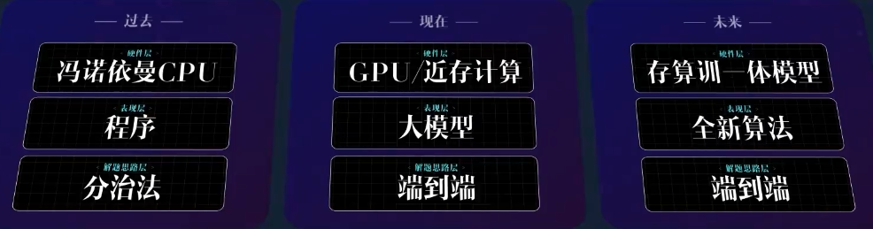

计算机组成

[toc]

# CPU与GPU

**CPU**

CPU（中央处理器，Central Processing Unit），拥有较少的计算单元，但有较多的控制单元和储存单元来处理操作指令，使得CPU拥有强大的指令处理能力，善于进行复杂的逻辑计算。

**GPU**

GPU（图形处理器，Graphics Processing Unit），而GPU仅具有少量的简单控制单元和小型储存单元来控制多线程处理和储存少量并行指令，但具有数量极大的计算单元，使得GPU拥有单一的强大并行计算能力，善于处理大规模重复计算。

# Cache

**为什么需要Cache**

CPU处理数据的速度非常快，内存相对于CPU而言读写速度就显得太慢了，所以如果单纯地让CPU对内存进行读写，所消耗的时间绝大部分是在内存对数据的处理上，而这时候CPU就在空等，浪费了资源，因此就需要在CPU与内存之间连接一个Cache来作为缓冲。

**定义**

Cache是一种位于CPU和主存之间的小容量、高速度的存储器。其主要作用是弥补CPU与主存之间的速度差异，从而提高系统整体性能。

**作用**

在慢速的DRAM和快速的CPU之间插入一至多级的速度较快、容量较小的SRAM起到缓冲作用，使CPU能够快速存取主存中的数据，而不使系统成本上升过高，这就是Cache的作用。

**什么样的数据需要放入Cache**

- 时间局部性：指当CPU处理了一个数据以后它很有可能会对它进行第二次处理
- 空间局部性：是指CPU处理了内存中某一块的数据，它很可能会还对它附近的数据块进行读写操作

这些就是需要放入CPU的数据，在CPU对某一数据进行操作后主存与Cache就开始行动，将可能需要的数据放入到Cache中。

## 基本结构

存储体的基本存储单元为块，每一个块内有块内地址，Cache的地址通过块号与块内地址来表示。除了块之外还有标记，通过标记来识别此时Cache里有无想要的数据，如果标记里有则直接对Cache进行处理，如果在标记里没有找到，则再对主存进行数据传输。

## 工作流程

Cache的操作可以分为读操作与写操作，在介绍操作之前首先应该介绍一下Cache几个结构的作用。

> - 替换结构：在CPU对内存进行读写操作时，如果发现想要的数据在Cache里没有，而且Cache的容量满了的情况下就需要对Cache旧的数据进行替换
> - 地址映射变换结构：这个机构其实可以分为两个，映射结构与变换结构
>   - 映射结构：可以查看将数据放到哪些块中
>   - 变换结构：可以将Cache的块号与主存的块号相互转换

**读操作**

CPU对数据进行读操作时，首先应该查看Cache里的标记中有没有对应地址，如果发现Cache中有要找的数据，则直接从Cache中读取，节省时间。

如果发现Cache中没有，则需要到内存中去读取，根据程序运行的局部性原理（时间局部性与空间局部性），需要将相关的数据写入Cache中，方便下一次的读操作，这时如果Cache中数据没满，则直接写入Cache，如果满了，就需要Cache的替换机构对需要替换的数据进行替换，将数据放入Cache存储体中。

**写操作**

写操作分为两种，写直达法与写回法。

- 写直达法：将要写入的数据既写入Cache又写入主存，写操作的时间就是访问主存的时间
- 写回法：只把数据写入Cache而不写入主存，当Cache数据被替换出去时才写回主存

## 补充

- 命中率：对于Cache来说，如果CPU要进行读写操作的数据在Cache中，则称为命中，如果不在Cache中，则没有命中。
- Cache-主存的地址映射
  - 直接映射：Cache与主存直接映射主存被划分为多个区，Cache里的每一个块对应主存每个区的相应的块，Cache的一个块可对应主存每个区的相应的块，由区号选出具体的块，然后由子块内地址（偏移量）选定具体的数据。利用率较低
  - 全相联映射：Cache的各个块对应主存储器的各个块
  - 组相联映射：在直接映射的基础上Cache的每个组的块数变成了两块或者若干块，导致一块占满时可以放到另外一块
- Cache的替换算法：在Cache的替换机构进行替换时需要采用相关的替换算法
  - 先进先出（FIFO）算法 缺点：可能会替换掉更有用的数据，没有体现程序运行局部性原理
  - 近期最少使用（LRU）算法：将近期最少使用的块替换掉
- Cache的改进
  - 增加Cache的级数
  - 统一缓存和分立缓存
  - 指令Cache、数据Cache

## CPU中cache层级

缓存（Cache）通常分为多个层级，以提高数据访问的速度和效率。缓存层级结构的设计旨在平衡访问速度和成本，使得CPU能够快速获取所需数据。

**一级缓存**

- 位置：位于CPU核心内部，是离CPU核心最近的缓存
- 特点
  - 速度最快：访问延迟最低，通常在1-2个CPU时钟周期内完成
  - 容量最小：由于其位置靠近CPU核心，制造成本较高，因此容量通常较小，一般在 32KB到64KB 之间
  - 专用性：通常分为指令缓存（Instruction Cache，简称I-Cache）和数据缓存（Data Cache，简称D-Cache），以提高效率
- 作用：存储CPU最频繁访问的指令和数据，减少CPU等待数据的时间

**二级缓存**

- 位置：通常位于CPU核心内部，但比L1缓存稍远
- 特点
  - 速度较快：访问延迟比L1缓存高，但比L3缓存低，通常在 10-20个CPU时钟周期 之间
  - 容量较大：比L1缓存大，一般在 256KB到2MB 之间
  - 共享性：在多核CPU中，L2缓存通常是每个核心独立的，但有些设计中L2缓存也可以被多个核心共享
- 作用：存储L1缓存未命中的数据和指令，进一步减少CPU访问主内存的次数

**三级缓存**

- 位置：位于CPU芯片上，但通常比L1和L2缓存更远
- 特点
  - 速度较慢：访问延迟比L1和L2缓存高，通常在 20-40个CPU时钟周期 之间
  - 容量最大：比L1和L2缓存大得多，一般在 2MB到32MB 之间，甚至更大
  - 共享性：在多核CPU中，L3缓存通常被所有核心共享，因此可以提高多核之间的数据共享效率
- 作用：存储L1和L2缓存未命中的数据和指令，进一步减少CPU访问主内存的次数，提高系统的整体性能

**四级缓存**

- 位置：在某些高端处理器中，可能会有L4缓存，通常位于CPU芯片外部
- 特点
  - 速度更慢：访问延迟比L3缓存高，但仍然比主内存快
  - 容量更大：通常在 32MB到128MB 之间，甚至更大
  - 共享性：通常被所有核心共享
- 作用：进一步减少CPU访问主内存的次数，适用于对性能要求极高的应用场景，如高性能计算和数据中心

# 存储设备

|    层级    |     离CPU     | 容量典型值 | 延迟典型值  | 易失 |   实现技术   |                  一句话作用                   |
| :--------: | :-----------: | :--------: | :---------: | :--: | :----------: | :-------------------------------------------: |
| **寄存器** |     内部      | 32×64 bit  |   0.2 ns    |  ✅   |   D触发器    |                指令直接操作数                 |
| **Cache**  |   片上隔壁    | 32 KB-2 MB |  0.5-5 ns   |  ✅   |   SRAM单元   |                缓存 DRAM 热点                 |
|  **SRAM**  |     片上      | 4 KB-几 MB |   1-2 ns    |  ✅   |   6T CMOS    |            MCU 的“内存”或高速缓冲             |
|  **DRAM**  |   片外 DIMM   |  4-512 GB  |  20-100 ns  |  ✅   |  1T1C 电容   |                  传统内存条                   |
|  **HBM**   | 2.5D 硅中介层 |  4-64 GB   |  10-20 ns   |  ✅   | 3D 堆叠 DRAM |              高带宽显存/AI 内存               |
|  **主存**  |       —       |     —      |      —      |  ✅   |   架构概念   | CPU 统一编址的大易失区；PC=DRAM/HBM，MCU=SRAM |
| **Flash**  |   片上/SSD    | 64 KB-2 TB | 10 µs-10 ms |  ❌   |  浮栅晶体管  |                固件、SSD、BIOS                |
|  **磁盘**  |     外设      |  1-20 TB   |   5-15 ms   |  ❌   |  磁性/闪存   |                  冷数据仓库                   |

# 存算一体

## Past

1. 分治法：知其所以然——把问题用人类可理解的、可数理推到的进行拆分，然后再组装回来，可以说分治法是人类解决问题的必由之路。
2. 冯诺依曼CPU：冯诺依曼架构和分治法就是一对最佳搭档。通过分治法解决问题，表达为程序，写出来就是一行一行的代码，函数之间相互调用。但一段时间其实只在运行一段代码，就像分治法，一段时间只是在解决某个子问题。冯诺依曼把数据和程序都写在内存里面，分治法运行到哪一步，就把对应的程序和数据加载到CPU里面去，算完之后再拿出来,其核心就是区分了计算器和存储器。

## Now

1.  端到端：黑盒子、不可解释。不是一段一段地解决问题，它表现出为一个整体，不能确收部分。有时分治法破坏了不同分支之间有很多柔性的连接，如当a、b步骤有很明确的边界的时候，柔性连接就被切断之后，程序性能很难上去。不应该继续使用冯诺依曼架构制成的芯片，否则CPU cycle（周期）有90%是在两边做数据搬运，只有不到10%在做矩阵乘法运算。所以不应该把数据和处理分开，冯诺依曼架构最适合解决分治法的算法问题，但不适合解决端到端的问题。

2.  GPU：是一种中间带有大量计算单元，旁边也需要大量的内存单元的结构。把模型的参数存在两边的内存里面（离计算单元特别近，又叫近存计算），叫High Bandwidth Memory，即高带宽内存。当任务到来时，这些参数被搬到中间的计算核心去做矩阵乘法计算，完成之后再写回去。

## Future

类比人脑，人脑的神经元其实存在着一些信息，每一次计算时电信号又会通过它进行计算，也就是存储信息和进行计算在同一个神经元里发生。今天的存储，它是一个单元一个单元的去存储数据，如果一个单元既存储又计算，那可以节省大量的数据搬运，从而节省大量的能耗。

无论是大模型还是存算一体的芯片，算法和硬件的发展都是在朝着一个仿生的方向在走。脑子不只是在存储知识、也不只是在推理，你的脑子还在每一次推理的过程中在训练自己。

在存算训一体的框架，不再每次搬大量数据，而是每次推理就是哗走一遍，那空出的脑子是不是就可以在这一遍推理完了所积累的知识，拿来更新一下这些模型的参数。因为模型就是一堆参数，如果做了n次推理之后，我有很多结果，假设有一个目标函数，可以判断这些结果的好坏，就可以返回过去刷新一次之前的那些参数。从而实现模型动态运行时的更新，而不是训练好了之后模型就冻结了，用的时候用这个冻结的模型去做推理，即使出现了问题以后，所能做的要么是微调，要么重新训练，而不是运行的时候，也可以对它做持续训练和自我调整。

注

1. 算法的迭代与硬件的迭代息息相关
