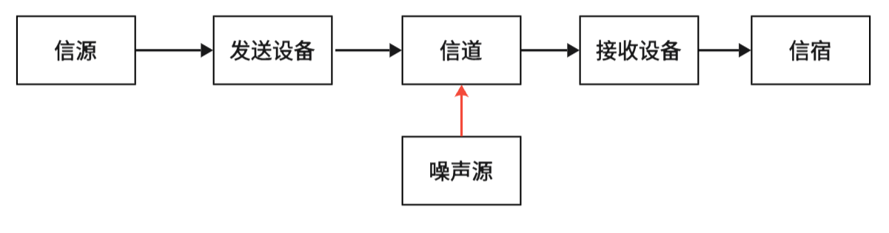
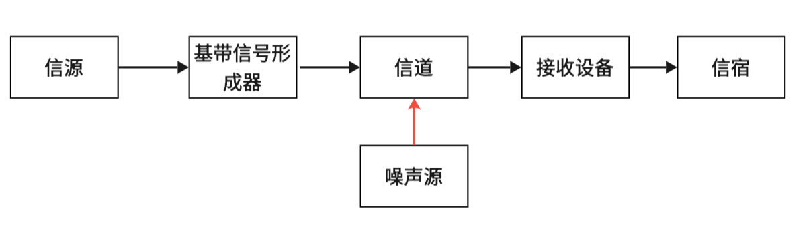
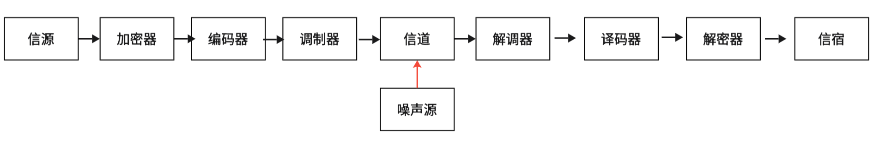
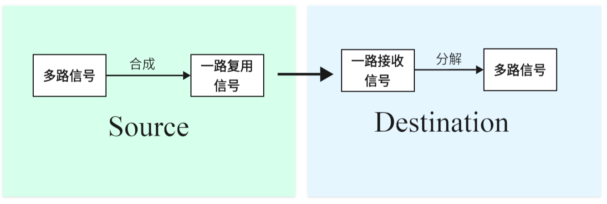

信息通信

[toc]

# 概述

## 通信模型

信道是信号传输的媒介，对通信质量有直接影响。

## 基带、频带信号

### 基本概念

-   编码/解码：为减少在信号传输过程中的信号失真，需要在发送数据前，将信号进行编码（差错编码）

-   调制：通过改变高频载波的幅度、相位或频率，使基带信号变为易于在信道中传输的频带信号

-   解调：将基带信号从载波中提取出来，以便后续处理

-   基带传输：利用数据传输系统直接传送基带信号的传输方式

-   频带传输：在信道中传输已调信号的传输方式

### 基带信号

许多信源发出的信号，含丰富的低频部分，含有直流分量与低频分量，无需调制和解调。

### 频带信号

将基带信号从低频转为高频后的信号，又称已调信号/波。

## 带宽

- 信号带宽：谐波最高频率和最低频率之差，表示信号所占据的频率范围

- 信道带宽：信道不失真传输信号的频率范围

## 信噪比与信道容量

### 信噪比

描述信号在传输过程中，受噪声影响程度的量

$$
(\frac{S}{N}) = \frac{P_{S}}{P_{N}}
$$
其中$P_{S}$表示信号平均功率，$P_{N}$表示噪声平均功率。

也常用分贝（dB）表示信噪比
$$
{(\frac{S}{N})}_{dB} = 10 \bullet \lg{(\frac{S}{N})}
$$

### 信道容量

信道所能允许的不产生错误的最快传输速率。只要传输速率小于信道容量，总可以找到一种信道编码方式实现无差错传输；若传输速率大于信道容量，则不可能实现无差错传输。

**香农公式**
$$
C = B \bullet \log_{2}{(1 + \frac{S}{N})}
$$
C表示信道容量（bit/s），B为信道带宽（Hz）

结论

增大信号功率$S$，减小噪声功率$N$，增加信道带宽$B$，可以增加信道容量。

## 多路复用技术

将彼此无关的低速信号按照一定方法和规则合成一路复用信号，并在一条公用（高速）信道上进行数据传输，到达接收端再进行分离的一种技术。

**常见复用技术**

频分多路复用(FDM)、时分多路复用(TDM)、码分多路复用(CDM)、空分多路复用(SDM)、波分多路复用(WDM)以及偏振多路复用(PDM)等。
