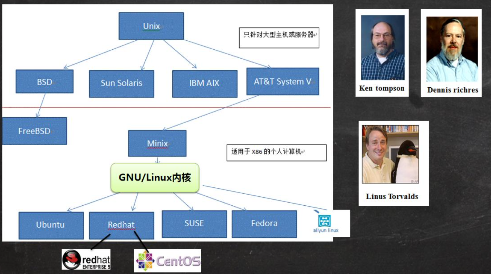
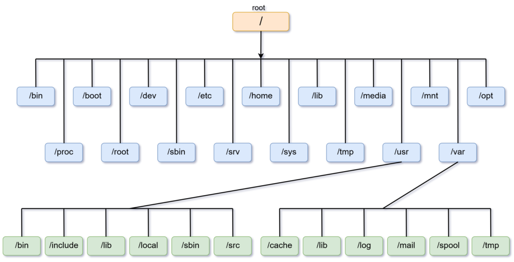
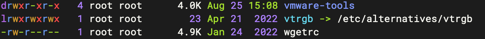
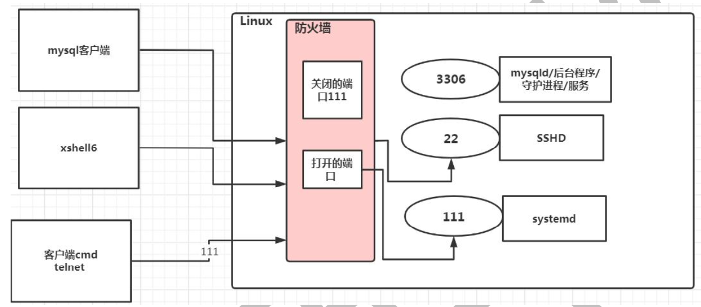
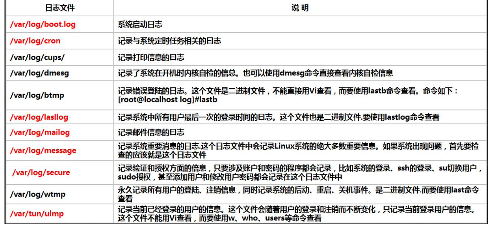

<font size = 6> Linux</font>

[TOC]

# 前言

**发行版**

发行版 = Linux 内核 + 一整套软件生态 + 配置 + 安装工具

常见的有：Ubuntu、RedHat、CentOS、Debain、Fedora、SuSE、OpenSUSE等

**Unix和Linux**



**虚拟网络连接模式**

- 桥接模式：虚拟机的网卡直接桥接到物理网卡上，获取一个独立 IP 地址，和主机处于同一网络，可以直接被其他同网络的电脑访问
- NAT模式：虚拟机通过主机的 IP 地址上网，外网无法主动访问虚拟机
- 主机模式：虚拟机只能和主机通信，不能直接访问外部网络

# Linux 内核

Linux 系统从应用角度来看，分为内核空间和用户空间两个部分。Linux 的内核主要由 5 个子系统组成：进程调度、进程间通信、内存管理、虚拟文件系统、网络接口。

**进程调度**

进程调度指的是系统对进程的多种状态之间转换的策略。Linux 下的进程调度有 3 种策略：SCHED_OTHER、SCHED_FIFO 和 SCHED_RR。

- SCHED_OTHER：分时调度策略（默认），是用于针对普通进程的时间片轮转调度策略
- SCHED_FIFO：实时调度策略，是针对运行的实时性要求比较高、运行时间短的进程调度策略
- SCHED_RR：实时调度策略，是针对实时性要求比较高、运行时间比较长的进程调度策略

**进程间通信**

Linux 操作系统支持多进程，进程之间需要进行数据的交流才能完成控制、协同工作等功能，Linux 的进程间通信是从 UNIX 系统继承过来的。Linux 下的进程间的通信方式主要有管道、信号、消息队列、共享内存和套接字等方法。

**内存管理 MMU**

内存管理是多个进程间的内存共享策略。在Linux中，内存管理主要说的是虚拟内存。虚拟内存可以让进程拥有比实际物理内存更大的内存。每个进程的虚拟内存有不同的地址空间，多个进程的虚拟内存不会冲突。

**虚拟文件系统 VFS**

在 Linux 下支持多种文件系统，如 ext、ext2、minix、umsdos、msdos、vfat、ntfs、proc、smb、ncp、iso9660、sysv、hpfs、affs 等。目前 Linux 下最常用的文件格式是 ext2 和 ext3。

**网络接口**

Linux 支持多种网络接口和协议，网络接口分为网络协议和驱动程序。网络协议是一种网络传输的通信标准，而网络驱动则是对硬件设备的驱动程序。Linux 支持的网络设备多种多样，几乎目前所有网络设备都有驱动程序。

# 目录结构

Linux 的文件系统是采用级层式的树状目录结构，在此结构中的最上层是根目录“/”，然后在此目录下再创建其他的目录。

在Linux世界里，一切皆文件。



**常用目录**

- /bin (/usr/bin、/usr/local/bin)：Binary的缩写，存放着最经常使用的命令
- /sbin (/usr/sbin、 /usr/local/sbin)：即 Super User，存放的是系统管理员使用的系统管理程序
- /home：存放普通用户的主目录，在Linux中每个用户都有一个自己的目录，一般目录名为用户的账号命名
- /root：该目录为系统管理员的用户主目录
- /lib：系统开机所需要最基本的动态连接共享库
- /lost+found：一般为是空，当系统非法关机后，这里就存放了一些文件
- /etc：系统管理所需要的配置文件和子目录，比如 mysql 数据库 my.conf
- /usr：用户的应用程序和文件都放在这个目录下
- /boot：存放启动加载器相关文件，包括一些连接文件以及镜像文件
- /proc：虚拟文件，内容由内存动态生成，存放的是进程和内核的相关信息
- /srv：service，该目录存放一些服务启动之后需要提取的数据
- /sys：虚拟文件，内容由内存动态生成，查看系统已加载内核模块
- /tmp：这个目录是用来存放一些临时文件的
- /dev：类似于 windows 的设备管理器，把所有的硬件用文件的形式存储
- /media： 存放 Linux 系统自动识别一些设备，例如 U 盘
- /mnt：临时挂载别的文件系统的
- /opt：安装软件所存放的目录
- /usr/local：另一个给主机额外安装软件的目录，一般存放通过编译源码方式安装的程序
- /var：存放着在不断扩充着的东西，习惯将经常被修改的目录放在这个目录下，包括各种日志文件
- /selinux：SELinux 是一种安全子系统，它能控制程序只能访问特定文件

# 文件系统

## 分区与文件系统

对分区进行格式化是为了在分区上建立文件系统，一个分区通常只能格式化为一个文件系统，但是磁盘阵列等技术可以将一个分区格式化为多个文件系统。

## 组成


- **inode**

每个一个文件都仅会占用一个 inode（大小固定），记录文件的属性（权限、容量、修改时间等），同时记录此文件的内容所在的 block 编号。

inode 中记录了文件内容所在的 block 编号，但每个 block 非常小，一个大文件随便都需要几十万的 block，而一个 inode 大小有限，无法直接引用这么多 block 编号。因此引入了间接、双间接、三间接引用，间接引用让 inode 的记录引用 block 块记录的信息。


- **block**

记录文件的内容，文件太大时，会占用多个 block，一个 block 只能被一个文件所使用，未使用的部分直接浪费了。因此如果需要存储大量的小文件，最好选用比较小的 block

- **superblock**

记录文件系统的整体信息，包括 inode 和 block 的总量、使用量、剩余量，以及文件系统的格式与相关信息等

- **block bitmap**

记录 block 是否被使用的位图

注

1. 建立一个目录时，会分配一个 inode 与至少一个 block，block 记录的内容是目录下所有文件的 inode 编号以及文件名。文件的 inode 本身不记录文件名，文件名记录在目录中，因此新增文件、删除文件、更改文件名这些操作与目录的写权限有关

# 启动过程

Linux 启动过程可以分为以下几个主要步骤

1. 系统上电后，BIOS/UEFI 执行硬件自检，检查 CPU、内存、硬盘等硬件是否正常，之后找到并加载启动设备的引导加载程序
2. bootloader 引导加载程序加载 Linux 内核到内存中，内核开始初始化硬件设备、文件系统、内存等系统资源
3. 内核加载完毕后，会启动第一个进程：`init`，负责启动系统的其他进程和服务
4. `init` 进程根据配置文件启动所需的系统服务（如网络、图形界面等）
5. 系统服务启动完成后，进入用户登录界面，用户可以通过终端或图形界面登录系统
6. 用户登录后，启动用户会话环境，用户可以开始使用系统

**BIOS**

BIOS（Basic Input/Output System，基本输入输出系统），它是一个固件（嵌入在硬件中的软件），BIOS 程序存放在断电后内容不会丢失的只读内存中。


BIOS 是开机的时候计算机执行的第一个程序，这个程序知道可以开机的磁盘，并读取磁盘第一个扇区的主要开机记录（MBR），由主要开机记录（MBR）执行其中的开机管理程序，这个开机管理程序会加载操作系统的核心文件。

# 优化系统性能

优化 Linux 系统性能可以从以下几个方面着手

- 禁用不必要的服务：使用 `systemctl` 禁用不需要的后台服务，减少系统资源占用
- 优化内存使用：调整 `vm.swappiness` 参数，控制交换空间的使用
- 选择轻量级桌面环境：使用轻量级的桌面环境（如 Xfce、LXQt）或窗口管理器（如 i3、Openbox）
- 使用更高效的文件系统：选择高性能的文件系统，如 ext4、XFS 或 Btrfs，并合理配置挂载选项
- 调整 I/O 调度器：使用适合硬件的 I/O 调度器（如 `deadline`、`noop`）来提高磁盘性能
- 更新驱动程序：安装最新的硬件驱动，特别是显卡和网络驱动，以提升性能
- 精简启动项：删除不必要的启动程序，减少启动时间和内存消耗
- 优化网络设置：调整 TCP 参数（如 `tcp_rmem`, `tcp_wmem`），提高网络吞吐量
- 减少系统日志记录：限制日志文件的大小和频率，避免日志过多占用磁盘空间
- 定期清理缓存和临时文件：使用 `bleachbit` 或手动清理缓存和临时文件，释放磁盘空间

# 文件名通配符

**?**

```shell
# ？表示匹配文件名中任意一个字符

# E.g.
# 使用a?表示以a开头且有两个字符的文件名
ls -l a?  
# 查看当前目录下所有第3个字符是c的文件
ls -l ??c*
```

**\***

```shell
# * 表示匹配文件名中的任意字符串

# E.g.
# 查看当前目录下以字母c结尾的所有文件列表
ls -l *c
# 查看当前目录中倒数第2个字符是c的所有文件
ls -l *c?
```

**[]**

```shell
# [] 通常用于匹配一个字符范围，其表现形式可以是减号` - `表示的字母和数字的范围，也可以使几个字符的组合

# E.g.
# 在当前目录中查看以字母klsyz中的任意一个开头的所有文件 
ls -l [klsyz]*
# 在当前目录下查看文件名中含有数字的所有文件 
ls -l *[0-9]*
```

**[!] **

```shell
# [!] 表示不匹配符号内出现的字符组合或字母子范围。

# E.g.
# 查看当前目录下文件名只有两个字符并以数字开头且第2个字符不是数字的所有文件 
ls -l [0-9][!0-9]]*
# 查看当前目录下文件名只有两个字符且两个字符都不是字母的所有文件 
ls -l [!a-Z][!a-Z]
```

# Vi/Vim

   Linux 系统会内置 vi 文本编辑器，Vim 具有程序编辑的能力，可以看做是 Vi 的增强版本。


**基本配置**

- 用户级别的配置文件（~/.vimrc）只对当前用户有效
- 系统级别的配置文件（/etc/vim/vimrc）对所有Linux用户都有效
- 如果两个配置文件都设置了, 用户级别的配置文件起作用（用户级别优先级高）

```shell
vim ~/.vimrc	# 打开（或新建）配置文件

" vim 配置
" ---------- 基础界面 ----------
set number              " 显示行号
set cursorline          " 高亮当前行
set showmatch           " 括号配对高亮
set matchtime=1         " 匹配括号高亮延时（0.1s）

" ---------- 编码与格式 ----------
set encoding=utf-8
set fileencodings=utf-8,gb18030,gbk,gb2312
set fileformat=unix
set fileformats=unix,dos,mac

" ---------- 高亮与配色 ----------
syntax on               " 打开语法高亮
if has('termguicolors')
    set termguicolors   " 真彩终端
endif
colorscheme desert      " 选一个内置配色，可改 evening/elflord/murphy

" ---------- 折行（自动换行） ----------
set wrap                " 软换行（窗口边界折行）
set linebreak           " 只在单词边界折行，避免中间断开
set showbreak=↪\        " 折行前缀符号
set breakindent         " 折行时保持缩进
set breakindentopt=shift:2,min:20

" ---------- 物理回车自动换行（写邮件/Markdown 常用） ----------
set textwidth=80        " 达到 80 列自动插入硬回车
set formatoptions+=t    " 开启 textwidth 自动插入换行
set formatoptions+=c    " 注释也自动换行
set formatoptions+=r    " 插入模式下按回车自动续注释符号
set formatoptions+=o    " 普通模式下 o/O 续注释

" ---------- 缩进 ----------
set autoindent
set smartindent
set cindent
set tabstop=4           " 一个 tab 显示 4 列
set shiftwidth=4        " 自动缩进 4 列
set expandtab           " 把 tab 转成空格（写 Python 必备）
set smarttab

" ---------- 搜索 ----------
set hlsearch            " 高亮搜索结果
set incsearch           " 实时搜索
set ignorecase
set smartcase

" ---------- 成对字符 ----------
inoremap ( ()<Left>
inoremap { {}<CR>}<Up><Enter>
inoremap [ []<Left>
inoremap " ""<Left>
inoremap ' ''<Left>

" ---------- 其他实用 ----------
set backup              " 保留备份文件 *~
set backspace=indent,eol,start
set clipboard=unnamed   " 与系统剪贴板互通（需 +clipboard 特性）
```

**常用命令**

|       命令       |   类别   |           作用           |
| :--------------: | :------: | :----------------------: |
|    `h j k l`     | 光标移动 |       左 下 上 右        |
|     `w / b`      |          |   下一单词 / 上一单词    |
|     `e / ge`     |          |   单词尾 / 反向单词尾    |
|     `0 / ^`      |          |     行首 / 非空行首      |
|      `$/g_`      |          |     行尾 / 非空行尾      |
|     `gg / G`     |          |     文件头 / 文件尾      |
|  `ngg` 或 `:n`   |          |       跳到第 n 行        |
|     `i / I`      |   编辑   |   在光标前 / 行首插入    |
|     `a / A`      |          |   在光标后 / 行尾插入    |
|     `o / O`      |          |   在下 / 上方新行插入    |
|     `r / R`      |          |  替换 1 字符 / 连续替换  |
|     `x / X`      |          |  删当前字符 / 左边字符   |
|    `dw / diw`    |          | 删到单词尾 / 删整个单词  |
|     `dd / D`     |          |    删整行 / 删到行尾     |
|     `yy / Y`     |          |         复制整行         |
|     `p / P`      |          |     粘到下方 / 上方      |
|   `u / Ctrl+r`   |          |       撤销 / 重做        |
|  `/foo` `Enter`  | 查找替换 |        向下找 foo        |
|  `?foo` `Enter`  |          |        向上找 foo        |
|     `n / N`      |          |   下一个 / 反向下一个    |
| `:%s/old/new/g`  |          |         全局替换         |
| `:%s/old/new/gc` |          |       每次确认替换       |
| `v / V / Ctrl+v` | 可视模式 |    字符 / 行 / 块选择    |
|     `y / d`      |          |      复制或删除选中      |
|    `:sp file`    |   窗口   |         水平分屏         |
|   `:vsp file`    |          |         垂直分屏         |
|     `Ctrl+w`     |          |         循环切屏         |
|     `:close`     |          |        关当前窗口        |
|     `:only`      |          |       只保留当前窗       |
| `:w / :q / :wq`  |   文件   | 保存 / 退出 / 保存并退出 |
|      `:q!`       |          |      强制退出不保存      |
|      `:e!`       |          |     放弃修改重载文件     |
|       `.`        |   进阶   |       重复上次修改       |
|       `==`       |          |      自动缩进当前行      |

# 权限管理

## 文件属性



```shell
# 第 0 位：文件类型(d, - , l , c , b)
	# - 是普通的文件
	# d 是目录
	# l 是链接文件
	# c 是字符设备文件，如鼠标，键盘
	# b 是块设备，比如硬盘
	# p 是管道文件(pipe)
	# s 是本地套接字文件(socket)
# 第 1-3：所有者(u)拥有该文件的权限
# 第 4-6：所属组(g)拥有该文件的权限
# 第 7-9：其他用户(o)拥有该文件的权限
	# rwx 作用于文件
		# r 可读取,查看
		# w 可修改，但不代表可删除该文件
		# x 可执行
    # rwx 作用于目录
    	# r 可读取，ls 查看目录内容
		# w 可修改, 对目录内创建、删除、重命名目录/目录内文件
		# x 可进入该目录内
# 第10位：文件:硬连接数/目录:子目录数
# 第11个：所有者
# 第12个：所属组
# 第13个：文件/文件夹大小（字节）
# 第14-16个：最后修改时间
# 第17个：文件/目录名
```

**umask**

- 文件默认权限：文件默认没有可执行权限，即 -rw-rw-rw-
- 目录默认权限：drwxrwxrwx

可以通过 umask 设置或查看默认权限，通常以掩码的形式来表示。

```shell
umask		# 查看去除的权限，0表示以八进制显示
-S			# 以符号形式显示默认权限

# E.g.
umask		# 查看去除权限
0022
umask 000	# 设置默认权限
umask -S	# 查看默认权限
u=rwx,g=rwx,o=rwx
```

## 用户管理

Linux 是一个多用户多任务的操作系统，任何一个要使用系统资源的用户，必须首先向系统管理员申请一个账号，然后以这个账号的身份进入系统。

**基本命令**

```shell
# 添加用户
useradd <用户名>							# 添加一个用户，默认该用户的家目录在 /home/用户名，并添加到同名组
useradd -d 	<指定目录>(/home/***) <用户名>	 # 给新创建的用户指定家目录
useradd -g <组名> <用户名>				  # 给新创建的用户指定组
usermod –g <用户组> <用户名>	 	 		 # 修改用户的组

# 指定/修改密码
passwd <用户名>

# 删除用户
userdel <用户名>							# 只删除用户
userdel -r <用户名>						# 删除用户以及用户主目录

# 查询用户信息
id <用户名>								# 查询用户信息 
whoami									  # 显示当前操作的用户名
who										  # 显示当前登录到系统的用户信息

# 用户切换
su - 用户名
# 注
# 	1. 从权限高的用户切换到权限低的用户，不需要输入密码，反之需要
# 	2. 当需要返回到原来用户时，使用 exit/logout 指令
```

## 组管理

类似于角色，系统可以对有共性/权限的多个用户进行统一的管理。

```shell
groupadd <组名>					# 新增组
groupdel <组名>					# 删除组
```

## 权限修改

**所有者与组**

```shell
chown <用户名> <文件/目录名>		# 修改文件所有者
chgrp <组名> <文件/目录名>			 # 修改文件/目录所在的组 
-R								  # 如果是目录，则使其下所有子文件或目录递归生效
```

**chmod**

```shell
# chmod [选项] <dirname/filename>		# 修改文件或者目录的权限
- u		# 拥有者
- g		# 所属群组
- o		# 其他人
- a		# 所有人
- +		# 添加权限
- -		# 移除权限
- =		# 设定权限
- r		# 4
- w		# 2
- x		# 1

# 方式1:+ 、-、= 变更权限
chmod u=rwx,g=rx,o=x <文件名/目录名>
chmod o+w <文件/目录名>
chmod a-x <文件/目录名>

# 方式2:通过数字变更权限
chmod u=rwx,g=rx,o=x <文件目录名>
# 二者等价
chmod 751 <文件/目录名>
```

## 用户和组相关文件

- /etc/passwd 文件：用户(user)的配置文件，记录用户的各种信息，每行的含义为用户名:口令:用户标识号:组标识号:注释性描述:主目录:登录 Shell
- /etc/shadow 文件：口令的配置文件，每行的含义为登录名:加密口令:最后一次修改时间:最小时间间隔:最大时间间隔:警告时间:不活动时间:失效时间:标志
- /etc/group 文件：组(group)的配置文件，记录 Linux 包含的组的信息，每行含义为组名:口令:组标识号:组内用户列表
- /etc/sudoers 文件：sudo权限，所有者 root 对它也只有读权限，默认是不能修改的，添加其他用户时需
	1. 先切换到root用户
	2. 在root用户下修改这个文件属性，给其添加写权限
	3. 修改文件内容, 把普通用户添加进去，保存退出
	4. 将文件权限修改为原来的 400 (r--------)
	5. 切换到普通用户，这时候就可以使用 sudo了

# 实用指令

## 开机/重启

**基本命令**

```shell
shutdown –h now				 # 立该进行关机
shudown -h 1				 # 1分钟后关机，默认
shutdown –r now				 # 现在重新启动计算机
halt						 # 关机，作用和上面一样
reboot						 # 现在重新启动计算机
sync						 # 把内存的数据同步到磁盘
```

注

1. 不管是重启系统还是关闭系统，首先要运行 `sync` 命令，把内存中的数据写到磁盘中
2. 目前的 shutdown/reboot/halt 等命令均已经在关机前进行了 sync

## 运行级别

init 进程的一大任务，就是去运行这些开机启动的程序，但是不同的场合需要启动不同的程序，Linux 允许为不同的场合分配不同的开机启动程序，这就叫做运行级别（runlevel）。也就是说，启动时根据运行级别，确定要运行哪些程序。

Linux系统有7个运行级别

- 运行级别0：关机
- 运行级别1：单用户工作状态，root权限，用于系统维护，禁止远程登录
- 运行级别2：多用户状态，没有网络服务
- 运行级别3：多用户状态，有网络服务
- 运行级别4：系统未使用，保留
- 运行级别5：图形界面
- 运行级别6：系统重启

```shell
multi-user.target: analogous to runlevel 3 		# 运行级3 
graphical.target: analogous to runlevel 5		# 运行级5

init [0 1 2 3 4 5 6]							# 选择运行级
systemctl get-default							# 查看默认运行级
systemctl set-default TARGET.target				# 设置默认运行级
```

## 找回root密码

1. 启动系统，进入开机界面，按“e”进入编辑界面
2. 找到以“Linux16”开头内容所在行，在行尾输入 init=/bin/sh
3. 按快捷键 Ctrl+x，进入单用户模式
4. 输入 mount -o remount,rw
5. 输入 passwd 来设置新的 root 密码
6. 输入 touch /.autorelabel
7. 输入 exec /sbin/init 等待系统自动重启

## 帮助指令

**man**

```shell
man [章节号] <命令或配置文件>			# 获得帮助信息

# E.g. 
# 查看 ls 命令的帮助信息 
man ls
```

**help**

```shell
help <命令>					# 获得 shell 内置命令的帮助信息

# E.g. 
# 查看 cd 命令的帮助信息
help cd
```

**info**

info 功能强大的文档阅读工具，提供了比 man 命令更详细、结构化的帮助文档。info 文档采用超文本链接的形式组织内容，特别适合浏览复杂的软件文档。

```shell
info <命令>
```

## 文件目录类

**pwd**

```shell
pwd 					# 显示当前工作目录的绝对路径
```

**ls**

```shell
ls [选项] <目录或文件>		# 显示指定目录下内容
-a						# 显示所有文件（包括以 . 开头的隐藏文件）
-A						# 显示除 . 和 .. 外的所有文件（包括隐藏文件）
-l						# 以长格式列出文件（权限、所有者、大小、修改时间等）
-h						# 与 -l 一起使用时，以人类可读的格式显示文件大小（如 KB、MB）
-R						# 递归列出子目录内容
-t						# 按修改时间排序（最新优先）
-S						# 按文件大小排序（大文件优先）
-r						# 反向排序（配合 -t、-S 等使用）
```

**file**

```shell
file <文件名> [参数]
-b		# 只显示文件类型和文件编码, 不显示文件名
-i		# 显示文件的 MIME 类型（设定某种扩展名的文件用一种应用程序来打开的方式类型）
-F		# 设置输出字符串的分隔符
-L		# 查看软连接文件自身的文件属性
```

**stat**

```shell
stat <目录或文件> [参数]
-f		# 不显示文件本身的信息，显示文件所在文件系统的信息
-L		# 查看软链接文件所关联文件的属性信息
-c		# 查看文件某个单个的属性信息
-t		# 简洁模式，只显示摘要信息, 不显示属性描述

#=== 输出字段 ===#
# File: 文件名
# Size: 文件大小, 单位是字节
# Blocks: 文件使用的数据块总数
# IO Block：IO块大小，是文件系统与内核之间进行 I/O 操作的基本单位，也是文件系统分配磁盘空间的最小单元
# regular file：文件的实际类型，文件类型不同，该关键字也会变化
# Device：设备编号
# Inode：Inode号，操作系统用inode编号来识别不同的文件，找到文件数据所在的block，读出数据
# Links：硬链接计数
# Access：文件所有者+所属组用户+其他人对文件的访问权限
# Uid： 文件所有者名字和所有者ID
# Gid：文件所有数组名字已经组ID
# Access Time：表示文件的访问时间。当文件内容被访问时，这个时间被更新
# Modify Time：表示文件内容的修改时间，当文件的数据内容被修改时，这个时间被更新
# Change Time：表示文件的状态时间，当文件的状态被修改时，这个时间被更新，例如：文件的硬链接链接数，大小，权限，Blocks数等
# Birth: 文件生成的日期

#=== 属性对应的字符 ===#
# %a	文件的八进制访问权限
# %A	人类可读形式的文件访问权限（rwx）
# %b	已分配的块数量
# %B	报告的每个块的大小(以字节为单位)
# %C	SELinux 安全上下文字符串
# %d	设备编号 （十进制）
# %D	设备编号 （十六进制）
# %F	文件类型
# %g	文件所属组组ID
# %G	文件所属组名字
# %h	用连接计数
# %i	inode编号
# %m	挂载点
# %n	文件名
# %N	用引号括起来的文件名，并且会显示软连接文件引用的文件路径
# %o	最佳I/O传输大小提示
# %s	文件总大小, 单位为字节
# %t	十六进制的主要设备类型，用于字符/块设备特殊文件
# %T	十六进制的次要设备类型，用于字符/块设备特殊文件
# %u	文件所有者ID
# %U	文件所有者名字
# %w	文件生成的日期 ，人类可识别的时间字符串 – 获取不到信息不显示
# %W	文件生成的日期 ，自纪元以来的秒数 （参考 %X ）– 获取不到信息不显示
# %x	最后访问文件的时间, 人类可识别的时间字符串
# %X	最后访问文件的时间, 自纪元以来的秒数（从1970.1.1开始到最后一次文件访问的总秒数）
# %y	最后修改文件内容的时间, 人类可识别的时间字符串
# %Y	最后修改文件内容的时间, 自纪元以来的秒数（参考 %X ）
# %z	最后修改文件状态的时间, 人类可识别的时间字符串
# %Z	最后修改文件状态的时间, 自纪元以来的秒数（参考 %X ）
```

**cd**

```shell
cd <参数> 		# 切换到指定目录

# E.g. 
cd ~/cd			# 回到自己的家目录, root，cd ~ 到 /root
cd .. 			# 回到当前目录的上一级目录
cd /root		# 切换到root目录
cd -			# 切换到上次访问的目录
```

**mkdir**

```shell
mkdir [选项] <要创建的目录>		   # 创建目录
-p								# 创建多级目录
```

**touch**

```shell
touch <文件名称>				# 创建空文件
```

**rm**

```shell
rm [选项] <要删除的文件或目录>		# 移除文件或目录
-r								# 递归删除整个文件夹
-f								# 强制删除不提示
-i								# 删除前逐一询问确认
```

**cp**

```shell
cp [选项] <source> <dest>		  # 拷贝文件到指定目录
-r							   # 递归复制整个文件夹

# E.g. 
cp hello.txt /home/bbb		   # 拷贝文件
cp -r /home/bbb /opt		   # 拷贝文件夹
```

**mv**

```shell
mv oldNameFile newNameFile		# 移动文件与目录或重命名
```

## 查看指令

**cat**

```shell
cat [选项] <要查看的文件>		# 查看文件内容
-n							 # 显示行号
```

**more**

more 指令是一个基于 VI 编辑器的文本过滤器，它以全屏幕的方式按页显示文本文件的内容。

```shell
more <要查看的文件>

# 常用操作命令
Enter		  		 # 向下n行，需要定义，默认为1行
⭡/空格键/Ctrl+F	  # 向下滚动一屏
⭣/Ctrl+B		    # 返回上一屏
=			  		 # 输出当前行的行号
：f			 	    # 输出文件名和当前行的行号
!命令				   # 调用Shell，并执行命令
q					# 退出more
```

**less**

less 指令用来分屏查看文件内容，它的功能与 more 指令类似，但是比 more 指令更加强大。less 指令在显示文件内容时，并不是一次将整个文件加载之后才显示，而是根据显示需要加载内容，对于显示大型文件具有较高的效率。

```shell
less <要查看的文件>

# 常用操作命令
⭡				# 向上1行
⭣		  		# 向下1行
空格键/Ctrl+F	   # 向下滚动一屏
Ctrl+B		  	 # 返回上一屏
/字符			    # 搜索，n：向下查找，N；向上查找
q			 	 # 退出less
```

**head**

```shell
head <文件>		# 查看文件头10行内容
-n				 # 设置查看行数

# E.g. 
head -n 5 文件 	# 查看文件头 5 行内容
```

**tail**

```shell
tail <文件> 		# 查看文件尾 10 行内容
-n 				 # 设置查看行数
-f				 # 实时追踪该文档所有更新
```

## 管道指令

管道是将一个命令的标准输出作为另一个命令的标准输入，在命令之间使用 | 分隔各个管道命令。

**cut**

```shell
cut [选项] <file>	  # 对数据进行切分，取出想要的部分
-c					# 以字符为单位进行分割
	 N				# 第N个字符
	 N-				# 第N个以后
	 N-M			# 第N和第M
	 -M				# 第M个以前
-d					# 自定义分隔符，默认为制表符
-f					# 与-d一起使用，指定取出哪个区域

# E.g. 
last | cut -d ' ' -f 1	# 取出用户名
export | cut -c 12-		# 取出第 12 字符以后的所有字符串
```

**sort**

```shell
$ sort [选项] <file or stdin>
-f			# 忽略大小写
-b			# 忽略最前面的空格
-M			# 以月份的名字来排序，例如 JAN，DEC
-n			# 使用数字
-r			# 反向排序
-u			# 相当于 unique，重复的内容只出现一次
-t			# 分隔符，默认为 tab
-k			# 指定排序的区间

# E.g. 
cat /etc/passwd | sort -t ':' -k 3
```

**uniq**

```shell
$ uniq [选项]
-i				# 忽略大小写
-c				# 进行计数
-d				# 仅显示重复出现的行列

# E.g. 
last | cut -d ' ' -f 1 | sort | uniq -c
```

**tr** 

```shell
tr [选项] SET1 ...			# 用来删除一行中的字符，或者对字符进行替换
-d						 	 # 删除指令字符

# E.g. 
last | tr '[a-z]' '[A-Z]'	 # 将 last 输出的信息所有小写转换为大写
```

**col** 

```shell
col [选项]
-x							# 将 tab 键转换成对等的空格键
```

**expand** 

```shell
expand [选项] <file>			# 将 tab 转换一定数量的空格，默认是 8 个
-t							 # tab 转为空格的数量
```

## 输出

**echo**

echo 是一个内置的 Shell 命令，用于在标准输出（通常是终端）显示一行文本或变量的值。

```shell
echo [选项] <输出内容>	# 默认情况下，echo会在输出后添加换行符
-n				  	 	# 不换行输出
-e				   		# 启用转义字符解释

# E.g.
# 进度条模拟
echo -n "Progress: ["
for i in {1..50}
do
	echo -n "#"
	sleep 0.1
done
echo -e "]\nDone!"
```

**tee**

一个输出会同时传送到文件和屏幕上。

```shell
tee [OPTIONS] <FILE>
-a						# 追加到文件末尾，而不是覆盖文件内容
-i						# 忽略中断信号
```

**printf**

用于格式化输出的 Shell 命令，它源自 C 语言的 printf() 函数。

```shell
printf  <format-string>  <arguments...>

# E.g.
printf "|%10s|\n|%-10s|\n" "right" "left"
printf "%-10s %5d %8.2f\n" "Apple" 5 2.5 "Orange" 3 1.75
rintf "%10s %5i %5i %5i %8.2f \n" $(cat printf.txt)
```

**awk**

awk 是一种处理文本文件的语言，是一个强大的文本分析工具。

```shell
awk [options] 'pattern {action}' file
-F						# 指定输入字段的分隔符，默认是空格
-v <变量名>=<值>		 # 设置 awk 内部的变量值
-f <脚本文件>			 # 指定一个包含 awk 脚本的文件，通过 -f 选项将其加载

# awk 变量
- NF：每一行拥有的字段总数
- NR：目前所处理的是第几行数据
- FS：目前的分隔字符，默认是空格键

# E.g.
cat /etc/passwd | awk 'BEGIN {FS=":"} $3 < 10 {print $1 "\t " $3}'
root	0
bin		1
daemon	2

$ last -n 5 | awk '{print $1 "\t" $3}'
dmtsai   192.168.1.100
dmtsai   192.168.1.100
dmtsai   192.168.1.100
dmtsai   192.168.1.100
dmtsai   Fri

$ last -n 5 | awk '{print $1 "\t lines: " NR "\t columns: " NF}'
dmtsai lines: 1 columns: 10
dmtsai lines: 2 columns: 10
dmtsai lines: 3 columns: 10
dmtsai lines: 4 columns: 10
dmtsai lines: 5 columns: 9
```

## 重定向

一般情况下，每个 Unix/Linux 命令运行时都会打开三个文件

- 标准输入文件(stdin)：stdin的文件描述符为0，默认从stdin读取数据
- 标准输出文件(stdout)：stdout 的文件描述符为1，默认向stdout输出数据
- 标准错误文件(stderr)：stderr的文件描述符为2，会向stderr流中写入错误信息

```shell
# E.g.
command 2>file		# stderr 重定向到 file
command 2>>file		# stderr 追加到 file 文件末尾
# stdout 和 stderr 合并后重定向到 file
command > file 2>&1
command >> file 2>&1
# 对 stdin 和 stdout 都重定向
command < file1 >file2
```

**输出重定向**

```shell
>	# 输出重定向，覆写
>>	# 追加

# E.g.
ls -l >a.txt	# 列表的内容写入文件 a.txt 中(覆盖写)，如果 a.txt 没有，则会创建
ls -al >>a.txt	# 列表的内容追加到文件 a.txt 的末尾
cat 文件1 >文件2  # 将文件1的内容覆盖到文件2
echo 内容 >>文件
```

注

1. 如果希望执行某个命令，但又不希望在屏幕上显示输出结果，那么可以将输出重定向到 /dev/null，写入到它的内容都会被丢弃，会起到"禁止输出"的效果

**输入重定向**

```shell
<	# 输入重定向

# E.g.
wc -l < users	# 从users文件读取输入
```

**Here Document**

Here Document 是 Shell 中的一种特殊的重定向方式，用来将输入重定向到一个交互式 Shell 脚本或程序。

```shell
command << delimiter		# document作为输入传递给 command
	document
delimiter

# E.g.
wc -l << EOF
	欢迎来到
	你好
	world
EOF
# 输出结果为 3 行
```

## 搜索查找

**find**

```shell
find [路径] [匹配条件]		# 在指定目录下查找文件和目录
-name <pattern>				# 按文件名查找，支持使用通配符 * 和 ?
-type <type>				# 按文件类型查找，可以是 f（普通文件）、d（目录）、l（符号链接）等
-size [+-]<size>[cwbkMG]	# 按文件大小查找，支持使用 + 或 - 表示大于或小于指定大小，单位可以是 c（字节）、w（字数）、b（块数）、k（KB）、M（MB）或 G（GB）
-mtime <days>				# 按修改时间查找，支持使用 + 或 - 表示在指定天数前或后，days 是一个整数表示天数
-user <username>			# 按文件所有者查找
-group <groupname>			# 按文件所属组查找
```

**locate**

locate 指令可以快速定位文件路径。locate 指令利用事先建立的系统中所有文件名称及路径的 locate 数据库实现快速定位给定的文件。为了保证查询结果的准确度，管理员必须定期更新 locate 数据库——updatedb。它存储在内存中，并且每天更新一次。

```shell
locate <搜索文件>	 # 第一次运行前，必须使用 updatedb 指令创建 locate 数据库
-b					# 仅匹配路径名的基本名称
-c					# 只输出找到的数量
-i					# 忽略大小写
```

**grep**

```shell
grep [选项] <查找内容> <源文件>	# 查找文件里符合条件的字符串或正则表达式
-i							  # 忽略大小写进行匹配
-v							  # 反向查找，只打印不匹配的行
-n							  # 显示匹配行的行号
-r							  # 递归查找子目录中的文件
-l							  # 只打印匹配的文件名
-c							  # 只打印匹配的行数
--exclude-dir="***"			  # 忽略指定目录

# E.g.
cat /home/hello.txt | grep yes
grep -n yes /home/hello.txt
```

**which**

```shell
which <文件/指令...>			# 查找文件/指令路径
```

**whereis**

```shell
whereis <dirname/filename>	   # 查找二进制文件、源代码文件和man手册页
```

## 链接

在 Linux 系统中，链接文件是一种特殊的文件类型，用于为其他文件或目录创建一个别名或指向。链接文件本身并不包含实际的数据，而是指向另一个文件或目录的路径。通过链接文件，用户可以方便地访问文件系统中的资源，而无需记住完整的路径或文件名。


**硬链接**

- 硬链接与原始文件共享相同的inode号，删除原始文件不会影响硬链接，因为数据实际上仍然存在，只是原始文件的名字被删除了，文件真正删除的条件是与之相关的所有硬连接文件均被删除
- 硬链接不能跨文件系统创建
- 不能对目录进行硬链接

**软链接**

- 软链接文件保存着源文件所在的绝对路径，在读取时会定位到源文件上，是一个独立的文件，可以理解为 Windows 的快捷方式
- 当源文件被删除了，软链接会变成一个“悬空链接”，就打不开了
- 因为记录的是路径，所以可以为目录建立软链接

```shell
ln [选项] <source_filename> <dist_filename>		# 创建实体链接
-s												 # 符号连接
-f												 # 如果目标文件存在时，先删除目标文件
```

## 压缩解压

Linux 底下有很多压缩文件名，常见的如下

|  扩展名   |               压缩程序                |
| :-------: | :-----------------------------------: |
|    *.Z    |               compress                |
|   *.zip   |                  zip                  |
|   *.gz    |                 gzip                  |
|   *.bz2   |                 bzip2                 |
|   *.xz    |                  xz                   |
|   *.tar   |   tar 程序打包的数据，没有经过压缩    |
| *.tar.gz  | tar 程序打包的文件，经过 gzip 的压缩  |
| *.tar.bz2 | tar 程序打包的文件，经过 bzip2 的压缩 |
| *.tar.xz  |  tar 程序打包的文件，经过 xz 的压缩   |

**zip**

```shell
zip [选项] <XXX.zip> <将要压缩的内容>	# 压缩文件和目录
-r									  # 递归压缩，即压缩目录

unzip [选项] <XXX.zip> 				# 解压缩文件
-d<目录>								# 指定解压后文件的存放目录
```

**gzip**

- 可以解开 compress、zip 与 gzip 所压缩的文件
- 经过 gzip 压缩过，源文件就不存在了
- 有 9 个不同的压缩等级可以使用

```shell
gzip [选项] <filename>
-k				# 保留原始文件
-d				# 解压缩
-t				# 检验压缩文件是否出错
-v				# 显示压缩比等信息
-r				# 递归压缩目录下的所有文件
-[1-9]			# 代表压缩等级，数字越大压缩比越高，压缩速度越慢，默认为 6
```

**bzip2**

提供比 gzip 更高的压缩比。

```shell
bzip2 [选项] <filename>
-k 				# 保留源文件
-d 				# 解压缩文件（等效于 bunzip2）
-v 				# 显示详细的压缩或解压缩过程
-t 				# 测试压缩文件的完整性
-[1-9] 			# 指定压缩级别，-1 为最快但压缩率最低，-9 为最慢但压缩率最高（默认 -9）
```

**xz**

提供比 bzip2 更佳的压缩比。

```shell
xz [选项] <filename>
-k 				# 保留源文件
-d 				# 解压缩文件（等效于 bunzip2）
-v 				# 显示详细的压缩或解压缩过程
-t 				# 测试压缩文件的完整性
-[1-9] 			# 指定压缩级别，-1 为最快但压缩率最低，-9 为最慢但压缩率最高（默认 -9）
```

**tar**

压缩指令只能对一个文件进行压缩，而打包能够将多个文件打包成一个大文件。tar 不仅可以用于打包，也可以使用 gzip、bzip2、xz 将打包文件进行压缩/解压。

```shell
tar zcvf <***.tar.gz> <filename...>     # gzip 打包压缩
tar zxvf <***.tar.gz>    	 			# gzip 解压缩
-z										# 使用 gzip
-j										# 使用 bzip2
-J										# 使用 xz
-c										# 新建打包文件
-t										# 查看打包文件里面有哪些文件
-x										# 解打包或解压缩的功能
-v										# 在压缩/解压缩的过程中，显示正在处理的文件名
-f <filename> 							# 要处理的文件
-C <目录>								   # 在特定目录解压缩
```

## 时间日期类

**date**

```shell
date									# 显示当前时间
date -s 字符串时间(2020-11-03 20:02:10)	 # 设置日期
hwclock -s								# 改回来
```

**cal**

```shell
cal										# 显示当前月份日历
cal <year>								# 显示当年全部月份日历
```

## 定时调度

Linux 任务调度的工作主要分为以下两类

- 系统执行的工作：系统周期性所要执行的工作，如备份系统数据、清理缓存
- 个人执行的工作：某个用户定期要做的工作，例如每隔 10 分钟检查邮件服务器是否有新信，可由每个用户自行设置

**crond 任务调度**

crontab 是 Linux 系统中用于设置周期性被执行的任务的命令。

- crond 每分钟会定期检查是否有要执行的工作，如果有要执行的工作便会自动执行该工作
- 新创建的 cron 任务，不会马上执行，至少要过 2 分钟后才可以，可以重启 cron 来马上执行

```shell
service crond start		# 手动启动crontab服务
service crond status	# 查看crontab服务状态

crontab [选项]
-e			# 编辑 crontab 定时任务，内定的编辑器是 Vi/Vim
	f1 f2 f3 f4 f5 <program>				# 编辑格式
-r			# 删除所有 crontab 任务
-l			# 列出目前用户的所有 crontab 任务

service crond restart						# 重启任务调度

# == 时间表示 == #
*    *    *    *    *
|    |    |    |    |
|    |    |    |    +----- 星期中星期几 (0 - 6) (星期天 为0)
|    |    |    +---------- 月份 (1 - 12) 
|    |    +--------------- 一个月中的第几天 (1 - 31)
|    +-------------------- 小时 (0 - 23)
+------------------------- 分钟 (0 - 59)
# 	时间符号
*			# 代表任何时间
,			# 代表不连续的时间
-			# 代表连续的时间范围
/n			# 代表单位下每个多久执行一次

# E.g.
0 */2 * * * /sbin/service httpd restart						# 意思是每两个小时重启一次apache 
50 7 * * * /sbin/service sshd start							# 意思是每天7：50开启ssh服务 
50 22 * * * /sbin/service sshd stop							# 意思是每天22：50关闭ssh服务 
0 0 1,15 * * fsck /home										# 每月1号和15号检查/home 磁盘 
1 * * * * /home/bruce/backup								# 每小时的第一分执行 /home/bruce/backup这个文件 
00 03 * * 1-5 find /home "*.xxx" -mtime +4 -exec rm {} \;	# 每周一至周五3点钟，在目录/home中，查找文件名为*.xxx的文件，并删除4天前的文件。
30 6 */10 * * ls											# 意思是每月的1、11、21、31日是的6：30执行一次ls命令
 */1 * * * * /home/my.sh									# 每隔一分钟执行一次脚本
```

注

1. 脚本中涉及文件路径时写全局路径
2. 脚本执行要用到其他环境变量时，通过 source 命令引入环境变量

**at**

at 命令是一次性定时计划任务，at 的守护进程 atd 会以后台模式运行，检查作业队列来运行。

- 默认情况下，atd守护进程每60秒检查作业队列
- 在使用at命令的时候，一定要保证atd进程的启动

```shell
sudo systemctl start atd	# 启动 atd 守护进程
sudo systemctl enable atd	# 设置开机自启
systemctl status atd		# 检查 atd 服务是否运行

at [选项] <时间>
-f <文件>						# 从指定文件读取命令而非标准输入
-l/atq						 # 列出待执行的任务
-d/atrm <任务ID>				# 删除指定任务
-c <任务ID>		    		# 打印任务的内容到标准输出

# == 时间表示 == #

# 绝对时间
# HH:MM (如 14:30)
# YYYY-MM-DD (如 2023-12-25)
# HH:MM YYYY-MM-DD

# 相对时间
# now + 数量 单位 (如 now + 2 hours)
# 单位可以是：minutes, hours, days, weeks

# 特殊关键字
# noon (中午12点)
# midnight (午夜)
# teatime (下午4点)
# tomorrow (明天同一时间)

# E.g.
at 15:30
at> echo Hello at command > ~/at_test.txt
at>   # 按 Ctrl+D 结束输入
```

注

1. /etc/at.allow 和 /etc/at.deny 文件控制用户访问权限
2. at 执行时的环境可能与交互式 shell 不同

## 其他

**history**

```shell
history						# 查看已经执行过历史命令
history 10					# 显示最近使用过的 10 个指令
!5							# 执行历史编号为 5 的指令
```

**tree**

```shell
tree[选项]					# 以树状图列出当前目录结构
-L <level>					 # 限制目录显示层级
-a							 # 显示所有文件和目录
-N							 # 直接列出文件和目录名称，包括控制字符
-d							 # 显示目录名称而非内容
-D							 # 列出文件或目录的更改时间
-g							 # 列出文件或目录的所属群组名称
-u							 # 列出文件或目录的拥有者名称，没有对应的名称时，则显示用户识别码
-f							 # 在每个文件或目录之前，显示完整的相对路径名称
-s							 # 列出文件或目录大小
-h							 # 可视化大小
```

**wc**

```shell
wc [选项] <文件...>				 # 计算文件的Byte数、字数、或是列数
-c						  	  	# 只显示Bytes数
-l						  	  	# 显示行数
-w						  	  	# 只显示字数

# E.g.
ls -l /opt | grep "^-" |wc-l	# 统计/opt文件夹下文件的个数
ls -l /opt | grep "^d" |wc-l	# 统计/opt文件夹下目录的个数
ls -lR /opt | grep "^-" |wc-l	# 统计/opt文件夹下文件的个数，包括子文件夹里的
```

**screen**

```shell
screen -S <session> 				# 新建会话
screen -d <session>/Ctrl+a+d 		# 回到原终端，任务后台跑
screen -ls               			# 看有哪些会话
screen -r <session>         		# 恢复
会话里输入 exit 或 Ctrl+d				# 彻底结束
killall screen						# 批量关闭所有 screen

# 会话里开多个窗口
Ctrl+a c   							# 新建窗口
Ctrl+a w							# 显示所有窗口列表
Ctrl+a n/p							# next/previous 窗口
Ctrl+a 0~9 							# 直接跳窗口
Ctrl+a "   							# 跳转到指定窗口
Ctrl+a A   							# 改当前窗口名字
```

**tmux**

```shell
tmux new -s <session>       		# 新建会话
Ctrl+b d         		 			# detach（回到原 shell）
tmux ls                 			# 列会话
tmux attach/a -t <session>     		# 恢复
会话里输入 exit 或 Ctrl+d				# 彻底结束

# 会话里开多个窗口
Ctrl+b c       						# 新建窗口
Ctrl+b w      						# 可视化列表
Ctrl+b p/n     						# 上一个/下一个
Ctrl+b 0~9     						# 直接跳转
Ctrl+b ,       						# 重命名当前窗口
Ctrl-b &       						# 关闭当前窗口
```

注

1. 默认的快捷键前缀是 Ctrl+B，如果发现按下 Ctrl+B 后没有反应，可能是由于快捷键冲突或配置问题导致的，解决方法如下

```shell
1. touch ~/.tmux.conf
2. 修改快捷键前缀
    # 修改前缀为 Ctrl+Z
    set -g prefix C-z
    unbind C-b
    bind C-z send-prefix
3. tmux source-file ~/.tmux.conf
```

**seq**

专门用来生成等差数列的小工具。

```shell
seq  LAST               # 1 到 LAST，步长 1
seq  FIRST LAST         # FIRST 到 LAST，步长 1
seq  FIRST STEP LAST    # FIRST 到 LAST，指定步长
```

**tmie**

用于统计程序运行所消耗的时间。

```shell
time <command>

# 输出
real  程序实际运行时间
user  程序在用户态消耗CPU时间
sys   程序在内核态消耗CPU时间
```


# 磁盘管理

Linux 无论有几个分区，分给哪一目录使用，归根结底只有一个根目录，一个独立且唯一的文件结构。

Linux 采用了一种叫“挂载”的处理方法，挂载是利用目录作为文件系统的进入点，也就是说，进入目录之后就可以读取文件系统的数据。 

## 硬盘类型

Linux 把所有存储设备都当作文件，放在 `/dev/` 目录下。其中文件名后面的序号的确定与系统检测到磁盘的顺序有关，而与磁盘所插入的插槽位置无关。

**IDE**

IDE（ATA）全称 Advanced Technology Attachment，接口速度最大为 133MB/s，因为并口线的抗干扰性太差，且排线占用空间较大，不利电脑内部散热，已逐渐被 SATA 所取代。


**SATA**

SATA 全称 Serial ATA，也就是使用串口的 ATA 接口，抗干扰性强，且对数据线的长度要求比 ATA 低很多，支持热插拔等功能。SATA-II 的接口速度为 300MB/s，而 SATA-III 标准可达到 600MB/s 的传输速度。SATA 的数据线也比 ATA 的细得多，有利于机箱内的空气流通，整理线材也比较方便。


**SCSI**

SCSI 全称是 Small Computer System Interface（小型机系统接口），SCSI 硬盘广为工作站以及个人电脑以及服务器所使用，因此会使用较为先进的技术，如碟片转速 15000rpm 的高转速，且传输时 CPU 占用率较低，但是单价也比相同容量的 ATA 及 SATA 硬盘更加昂贵。


**SAS**

SAS（Serial Attached SCSI）是新一代的 SCSI 技术，和 SATA 硬盘相同，都是采取序列式技术以获得更高的传输速度，可达到 6Gb/s，此外也通过缩小连接线改善系统内部空间等。


**常见命名方式**

- IDE 磁盘
  - 格式：/dev/hd[a-d]，a → 系统识别到的第一个磁盘，以此类推
  - 分区用数字表示，hda1 → hda 上的第一个分区，以此类推
- SCSI/SATA/USB 硬盘
  - 格式：/dev/sd[a-z]，a → 系统识别到的第一个磁盘，以此类推
  - 分区用数字表示，sda1 → sda 上的第一个分区，以此类推
- NVMe 固态硬盘
  - 格式：/dev/nvmeXnYpZ
    - X → 控制器号（从 0 开始）
    - Y → 命名空间 ID
    - Z → 分区号
- 虚拟设备
  - loop 设备：/dev/loop0 → 用来挂载 ISO 或镜像文件
  - LVM 逻辑卷：/dev/mapper/vgname-lvname
  - RAID 设备：/dev/md0 → 软件 RAID 设备

## 文件系统

文件系统决定了数据在分区上的组织和存储方式。不同的文件系统适合不同的使用场景。

**ext 系列（ext2/ext3/ext4）**

- Linux 最常见的文件系统
- ext4 是目前最主流的版本：支持大文件（单文件最大 16TB，文件系统最大 1EB）
- 向后兼容 ext3/ext2
- 使用场景：一般 Linux 系统分区

**XFS**

- 高性能日志文件系统，适合大文件、大存储场景
- 特点：扩展性强（可扩容，但不能缩容）
- 使用场景：企业级服务器、大数据、日志系统

**Btrfs (B-tree FS)**

- 新一代 Linux 文件系统
- 特点：快照、子卷、压缩、校验、RAID 功能
- 使用场景：需要高级存储管理的环境（类似 ZFS）

**FAT32 / exFAT**

- 跨平台文件系统（Windows/Mac/Linux/U 盘都支持）
- FAT32 单文件最大 4GB，exFAT 支持更大文件
- 使用场景：U盘、移动硬盘

**NTFS**

- Windows 默认文件系统
- Linux 可读写 NTFS（需要 ntfs-3g 工具）
- 使用场景：Linux/Windows 双系统数据交换

**swap**

- 交换分区，不存储文件，用于虚拟内存
- 当物理内存不足时，系统会把一部分数据写入 swap

**iso9660 / udf**

- 光盘镜像文件系统
- iso9660 常见于 ISO 文件，udf 常见于 DVD/蓝光盘。

## 概念对比

|         概念         |    名称    |         大小          |   作用层级   |
| :------------------: | :--------: | :-------------------: | :----------: |
|  **Sector（扇区）**  | 磁盘物理块 |      512B 或 4KB      |   硬件磁盘   |
| **IO Block / Block** | 文件系统块 | 1KB, 2KB, 4KB, 8KB... |   文件系统   |
|    **Page（页）**    |   内存页   |       通常 4KB        | 内核内存管理 |
|      **Buffer**      |   缓冲区   |         可变          |   应用程序   |

**IO Block**

文件大小 2874 字节，IO Block = 4096。实际占用 1 个块 = 4096 字节（尽管文件只有 2874 字节），浪费 4096 - 2874 = 1222 字节（内部碎片）。

**块大小选择**

|    (IO)块大小    |       适用场景       |            优点             |              缺点              |
| :--------------: | :------------------: | :-------------------------: | :----------------------------: |
|  **1KB (1024)**  |      大量小文件      |        减少空间浪费         | 大文件元数据开销大，I/O 效率低 |
|  **4KB (4096)**  |   通用场景（默认）   |       平衡空间和性能        |        小文件有内部碎片        |
| **8KB+ (8192+)** | 大文件、数据库、视频 | 大文件 I/O 效率高，元数据少 |       小文件严重浪费空间       |

## 基本命令

**lsblk**

```shell
lsblk	# 列出系统中所有可用的块设备信息，块设备是指以块为单位进行数据读写的存储设备，如硬盘、SSD、U盘等
-a		# 显示所有设备（包括空设备）
-d		# 仅显示设备本身，不显示分区
-f		# 显示文件系统信息
-l		# 使用列表格式输出（非树状）
-m		# 显示设备的所有者信息和权限

# E.g.
lsblk
NAME   MAJ:MIN RM  SIZE RO TYPE MOUNTPOINTS
sda      8:0    0  100G  0 disk 
├─sda1   8:1    0   50G  0 part /
├─sda2   8:2    0   30G  0 part /data
└─sda3   8:3    0   20G  0 part [SWAP]
sr0     11:0    1 1024M  0 rom  
# NAME：设备名（如 sda, sda1 等）
# MAJ:MIN：主设备号和次设备号。Linux 内核通过这个来识别设备驱动
# RM：是否为可移除设备（1 表示可移除，如 U 盘；0 表示不可移除）
# SIZE：设备或分区的大小
# RO：是否只读设备（1=只读，0=可写）
# TYPE：设备类型
	# disk → 整个磁盘
	# part → 分区
	# lvm → LVM 逻辑卷
	# rom → 只读设备（光驱）
	# loop → loop 设备（常见于容器或 snap 包）
# MOUNTPOINTS：设备挂载点（如 /、/data 等，若为空表示未挂载）

lsblk -f
NAME   FSTYPE LABEL UUID                                 MOUNTPOINT
sda                                                      
├─sda1 ext4         1a2b3c4d-5678-90ef-ghij-1234567890ab /
├─sda2 xfs   data   1234abcd-56ef-78gh-90ij-abcdef123456 /data
└─sda3 swap         abcd1234-ef56-7890-gh12-34567890abcd [SWAP]
# FSTYPE：文件系统类型（如 ext4, xfs, btrfs, swap 等）
# LABEL：文件系统卷标（用户自定义名称）
# UUID：文件系统的唯一标识符
# MOUNTPOINT：设备的挂载点
```

**fdisk**

```shell
fdisk </dev/sdb>			# 开始对指定硬盘设备分区
m							# 显示命令列表
p							# 显示磁盘分区
n							# 新增分区
d							# 删除分区
w							# 写入并退出
q							# 不保存退出
```

**mkfs**

```shell
mkfs [选项] <filesys/blocks>	# 在特定的分区上建立 linux 文件系统
-t							 # 设置文件系统的类型
```

**mount**

```shell
mount <分区名称> <挂载目录>		# 将一个分区与一个目录联系起来
-a							 # 挂载所有在 /etc/fstab 中列出的文件系统
-r							 # 以只读模式挂载

umount <分区名称>/<挂载目录>	# 卸载已挂载的文件系统
```

注

1. 用命令行挂载,重启后会失效
2. 永久挂载：通过修改/etc/fstab 实现挂载，添加完成后执行 mount –a 即刻生效

```shell
# <file system> <mount point>   <type>  <options>       <dump>  <pass>              
/dec/sdb1	/newdisk	/ext4	defaults 0 1
UUID=92c17ab0-eff2-4d48-80da-986b6648db41 / ext4 defaults 0 1
UUID=7119-0A95 /boot/efi vfat errors=remount-ro 0 1  
```

**df**

```shell
df [选项]					# 查询系统整体磁盘使用情况
-a						 # 显示所有文件系统，包括虚拟文件系统
-h						 # 以人类可读的格式显示输出结果
-T						 # 显示文件系统的类型
```

**du**

```shell
du [选项]					# 查询指定目录的磁盘占用情况，默认为当前目录
-s						 # 指定目录占用大小汇总
-h						 # 带计量单位
-a						 # 显示目录中各个文件的大小
-d						 # 显示深度
--max-depth=<n>			 # 子目录深度
```

## 增加一块硬盘

**步骤**

1. 为主机增加硬盘
2. fdisk 对设备进行分区
3. mkfs 为设备分区设置文件系统
4. mount 进行挂载

# 网络管理

## 基本命令

**ifconfig**

```shell
ifconfig [选项]					# 显示或设置网络设备

# E.g.
# 启动关闭指定网卡
ifconfig eth0 down
ifconfig eth0 up

# 配置IP地址
ifconfig eth0 192.168.1.56 							# 给eth0网卡配置IP地址
ifconfig eth0 192.168.1.56 netmask 255.255.255.0 	# 给eth0网卡配置IP地址,并加上子掩码
ifconfig eth0 192.168.1.56 netmask 255.255.255.0 broadcast 192.168.1.255	# 给eth0网卡配置IP地址,加上子掩码,加上个广播地址

ifconfig eth0 mtu 1500 			# 设置能通过的最大数据包大小为 1500 bytes
```

**ip**

```shell
ip [选项] <OBJECT>		   # 显示或设置网络设备
-s							# 输出更详细的信息
-4							# 指定使用的网络层协议是IPv4协议
-6							# 指定使用的网络层协议是IPv6协议
-0							# 输出信息每条记录输出一行，即使内容较多也不换行显示
-r							# 显示主机时，不使用IP地址，而使用主机的域名

# link：网络设备
# address：设备上的协议（IP或IPv6）地址
# addrlabel：协议地址选择的标签配置
# route：路由表条目

# E.g.
ip link show                     # 显示网络接口信息
ip link set eth0 up              # 开启网卡
ip link set eth0 down            # 关闭网卡
ip link set eth0 promisc on      # 开启网卡的混合模式
ip link set eth0 promisc offi    # 关闭网卡的混个模式
ip link set eth0 txqueuelen 1200 # 设置网卡队列长度
ip link set eth0 mtu 1400        # 设置网卡最大传输单元
ip addr show     					# 显示网卡IP信息
ip addr add 192.168.0.1/24 dev eth0 # 设置eth0网卡IP地址192.168.0.1
ip addr del 192.168.0.1/24 dev eth0 # 删除eth0网卡IP地址
ip route show 						# 显示系统路由
ip route add default via 192.168.1.254   # 设置系统默认路由
ip route list                 			 # 查看路由信息
ip route add 192.168.4.0/24  via  192.168.0.254 dev eth0 # 设置192.168.4.0网段的网关为192.168.0.254,数据走eth0接口
ip route add default via  192.168.0.254  dev eth0        # 设置默认网关为192.168.0.254
ip route del 192.168.4.0/24   			 # 删除192.168.4.0网段的网关
ip route del default         			 # 删除默认路由
ip route delete 192.168.1.0/24 dev eth0  # 删除路由
```

**ping**

```shell
ping <目的主机>			 # 测试当前服务器是否可以连接目的主机
-c						# 指定发送的数据包数量
-i						# 指定每次发送数据包的间隔时间（秒）
-w						# 设置发送数据包的等待时间上限，超出该时间后自动停止
-s						# 指定每个数据包的大小（字节），默认是 56 字节
-t						# 设置数据包的生存时间（TTL），指定路由跳数
-q						# 安静模式，只显示开始和结束的统计数据，不显示每个数据包的详细信息
-f						# 疯狂模式，快速发送数据包，用于测试网络承载能力，需谨慎使用
-l						# 指定一次发送的数据包数量，通常用于负载测试
-v						# 显示详细输出信息，用于调试
-4						# 强制使用 IPv4 协议
-6						# 强制使用 IPv6 协议
```

**traceroute / tracepath**

```shell
traceroute www.google.com # 显示数据包到目标主机的路由路径
```

**netstat**

```shell
netstat [选项]		   # 显示网络状态
-a						# 显示所有
-n						# 直接使用IP地址，而不通过域名服务器
-e						# 显示网络其他相关信息
-p						# 显示哪个进程在调用
-s						# 显示网络工作信息统计表
-t						# 显示TCP传输协议的连线状况
-u						# 显示UDP传输协议的连线状况
```

**ss**

```shell
ss [options]			# 查看网络连接状态信息
-a						# 显示所有的套接字，包括监听和非监听的
-t						# 仅显示 TCP 套接字
-u						# 仅显示 UDP 套接字
-l						# 仅显示监听状态的套接字
-p						# 显示与套接字关联的进程信息
-n						# 以数字形式显示地址，而不是解析成主机名
-r						# 将主机名解析为 IP 地址
-s						# 显示套接字的摘要信息
-4						# 仅显示 IPv4 套接字
-6						# 仅显示 IPv6 套接字
-i						# 显示详细的内部信息
-K						# 通过 ID 杀死指定的 socket
-m						# 显示每个套接字使用的内存
-H						# 不显示标题行
```

**route**

```shell
route					# 查看和操作 IP 路由表
-n 						# 显示完整路由表

# Destination	目标网络或主机	  192.168.1.0
# Gateway		下一跳网关	   192.168.1.1
# Genmask		网络掩码		255.255.255.0
# Flags			路由标志		U (路由已启用)
# Metric		路由成本		0
# Iface			出口接口		eth0
```

**dig / nslookup**

```shell
dig www.baidu.com		# DNS 解析工具，用来查询域名对应的 IP
nslookup www.google.com
```

**ethtool**

```shell
ethtool <ethid>			# 查看和修改网卡参数（速率、双工模式）
```

**iftop**

```shell
iftop					# 类似 top，实时显示网络流量
```

**nload**

```shell
nload					# 显示网络带宽使用情况（上行/下行）
```

## 设置指定ip

vim /etc/sysconfig/network-scripts/ifcfg-ens33

`ifcfg-ens33`

```shell
DEVICE=eth0						# 接口名（网卡、设备）
HWADDR=00:0C:2x:6x:0x:xx		# MAC地址
TYPE=Ethernet 					# 网络类型
UUID=926a57ba-92c6-4231-bacb-f27e5e6a9f44 #随机 id
ONBOOT=yes						# 系统启动的时候网络接口是否有效(yes/no)

# IP 的配置方法[none|static|bootp|dhcp](引导时不使用协议|静态分配 IP|BOOTP 协议|DHCP 协议) 
BOOTPROTO=static
# IP 地址
IPADDR=192.168.200.130
# 网关
GATEWAY=192.168.200.2
# 域名解析器
DNS1=192.168.200.2
```

重启网络服务( service network restart )或者重启系统( reboot )生效。

## 设置主机名和host映射

Hosts 是一个文本文件，用来记录 IP 和 Hostname(主机名)的映射关系。

```shell
hostname		# 查看主机名

# == 修改主机名 == #
# 修改文件 /etc/hostname，修改后，重启生效

# == 设置hosts映射 == #
# 修改文件 /etc/hosts
# 如：192.168.200.1 ThinkPad-PC
```

## 主机名解析过程

DNS，Domain Name System（域名系统）是互联网上作为域名和 IP 地址相互映射的一个分布式数据库。

1. 浏览器先检查浏览器缓存中有没有该域名解析IP地址
2. 检查DNS解析器缓存
3. 检查系统中hosts文件中有没有配置对应的域名IP映射
4. 到域名服务DNS进行解析域


# 进程管理

每个进程都可能以两种方式存在的，前台与后台。所谓前台进程就是用户目前的屏幕上可以进行操作的。后台进程则是实际在操作，但由于屏幕上无法看到的进程，一般系统的服务都是以后台进程的方式存在，而且都会常驻在系统中。直到关机才才结束。

## 进程分类

当一个子进程改变了它的状态时（停止运行，继续运行或者退出），有两件事会发生在父进程中

- 子进程向父进程发送 SIGCHLD 信号，包含了子进程的信息，比如进程 ID、进程状态、进程使用 CPU 的时间等
- 如果子进程退出时，它的进程描述符不会立即释放，等父进程得到子进程信息，父进程通过 wait() 和 waitpid() 来销毁子进程

**孤儿进程**

一个父进程退出，而它的一个或多个子进程还在运行，那么这些子进程将成为孤儿进程。

- 孤儿进程将被 init 进程（进程号为 1）所收养，并由 init 进程对它们完成状态收集工作
- 由于孤儿进程会被 init 进程收养，所以孤儿进程不会对系统造成危害

**僵尸进程**

如果子进程退出，而父进程并没有调用 wait() 或 waitpid()，那么子进程的进程描述符仍然保存在系统中，这种进程称之为僵尸进程。

- 系统所能使用的进程号是有限的，如果产生大量僵尸进程，将因为没有可用的进程号而导致系统不能产生新的进程
- 要消灭系统中大量的僵尸进程，可以将其父进程杀死，此时僵尸进程就会变成孤儿进程，由 init 进程释放所有的僵尸进程所占有的资源
- 如果不希望终止父进程，可以使用 waitpid 系统调用或 kill -s SIGCHLD 命令通知父进程回收子进程资源

**守护进程**

守护进程是一种在后台运行的进程，通常用于执行系统级任务或服务，独立于用户会话，即使用户注销也不会终止。通常在系统启动时启动，并在系统关闭时终止。

## 基本命令

**ps**


```shell
ps [options]		# 显示当前终端进程的状态
-w					# 显示加宽可以显示较多的资讯
-aux				# 显示系统中所有用户的所有进程
-ef					# System V 风格，功能类似 ps aux
-u <user>			# 查看某个用户的进程
-p <pid>			# 查看指定 PID 的进程信息

# == ps -aux 输出字段 == #
# USER: 进程所属用户
# PID: pid
# %CPU: 占用的 CPU 使用率
# %MEM: 物理内存使用率
# VSZ: 虚拟内存大小（KB）
# RSS: 实际占用内存（KB）
# TTY: 终端名称
# STAT: 该行程的状态
    # R	正在运行
    # S	睡眠（可中断）
    # D	不可中断睡眠（通常是 I/O）
    # Z	僵尸进程
    # T	停止（被挂起）
    # <	高优先级
    # N	低优先级
    # +	前台进程
    # l	多线程
# START: 进程开始时间
# TIME: 执行的时间
# COMMAND:所执行的指令

# == ps -ef 输出字段 == #
# PPID:父进程 ID
# C:CPU 用于计算执行优先级的因子。数值越大，表明进程是 CPU 密集型运算，执行优先级会降低;数值越小，表明进程是 I/O 密集型运算，执行优先级会提高
# STIME:进程启动的时间
# TTY:完整的终端名称

# E.g.
ps -aux
USER         PID %CPU %MEM    VSZ   RSS TTY      STAT START   TIME COMMAND
root         762  0.0  0.0   5800  1064 ttyS0    Ss+  Sep29   0:00 /sbin/agetty -o -p -- \u --keep-ba
root         769  0.0  0.0   6176  1120 tty1     Ss+  Sep29   0:00 /sbin/agetty -o -p

ps -ef
UID          PID    PPID  C STIME TTY          TIME CMD
root           1       0  0 Sep29 ?        00:00:26 /lib/systemd/systemd --system --deserialize 25 no
root           2       0  0 Sep29 ?        00:00:00 [kthreadd]
```

**pstree**

```shell
pstree [options] [pid or username]		# 显示所有进程的树状图
-a				# 显示每个进程的命令行参数
-p				# 显示进程的PID
-u				# 显示进程的所有者
-h 或 -H pid	   # 高亮显示当前或指定PID的进程
-n				#按PID排序，而不是默认的按名称排序
```

**kill/killall**

```shell
kill [信号] <PID>						 # 向指定进程号（PID）发送信号
killall [选项] [信号] <进程名> 		  # 通过进程名批量发信号
# 常用信号
-1  HUP  重新加载配置（很多守护进程会捕获）
-9  KILL 强制杀，进程无法拦截
-15 TERM 默认，礼貌退出
-18 CONT 继续（对 STOP 状态）
-19 STOP 暂停，不可被捕获

# E.g.
killall nginx           # 给所有叫 nginx 的进程发 TERM
killall -9 firefox      # 强制关闭所有 firefox 进程
killall -u alice -TERM  # 只杀用户 alice 的进程
killall -r 'php-fpm.*'  # 正则匹配，杀 php-fpm 及其子进程
killall -i vim          # 交互确认，每进程都问一次
killall -o 15m          # 仅杀运行时间 >15 分钟的
killall -y 30s          # 等 30 秒还没死才发 KILL
```

**top**

```shell
top [选项]				# 实时系统监控工具
-d <秒数>					# 指定 top 命令的刷新时间间隔，单位为秒
-p <进程ID>				# 仅显示指定进程ID的信息
-u <用户名>				# 仅显示指定用户名的进程信息。
-H						  # 在进程信息中显示线程详细信息
-i						  # 不显示闲置（idle）或无用的进程
-c						  # 显示完整的命令行而不截断
-S						  # 累计显示进程的 CPU 使用时间

# == 操作指令 == #
P							# 以CPU的使用资源排序显示
M							# 以内存的使用资源排序显示
N							# 以pid排序显示
T							# 由进程使用的时间累计排序显示
R							# 反序显示
k							# 给某一个pid一个信号,可以用来杀死进程(9)
r							# 给某个pid重新定制一个nice值（即优先级)
u							# 显示指定用户
ENTER						# 刷新
q							# 退出top（用ctrl+c也可以退出top）

# == 字段含义 == #
load average: 0.00, 0.00, 0.00	# 系统负载，即任务队列的平均长度。 三个数值分别为 1分钟、5分钟、15分钟前到现在的平均值
Cpu(s)
    %us							# 用户空间占用CPU百分比
    %sy							# 内核空间占用CPU百分比
    %id							# 空闲CPU百分比
    %wa							# 等待输入输出的CPU时间百分比
Mem 							# 物理内存
Swap							# 交换分区

# == 进程信息 == #
PID								# 进程id
USER							# 进程所有者的用户名
PR								# 内核实时调度优先级，数值越小越先
NI								# nice 值，用户可调（-20…19，负值更高优先级）
VIRT							# 进程使用的虚拟内存总量，单位kb。
RES								# 进程使用的、未被换出的物理内存大小，单位kb
SHR								# 共享内存大小，单位kb
S								# 进程状态
%CPU							# 上次更新到现在的CPU时间占用百分比
%MEM							# 进程使用的物理内存百分比
TIME+							# 进程使用的CPU时间总计，单位1/100秒
COMMAND							# 命令名/命令行
```

**htop**

```shell
htop							# 交互式系统状态查看器

# == 字段含义 == #
Cpu(s)：数字1，2，3，4分别代表CPU处理器/核
	# 蓝色：显示低优先级(low priority)进程使用的CPU百分比
	# 绿色：显示用于普通用户(user)拥有的进程的CPU百分比
	# 红色：显示系统进程(kernel threads)使用的CPU百分比
Memory/Swap
    # 绿色：显示内存页面占用的RAM百分比
    # 蓝色：显示缓冲区页面占用的RAM百分比
    # 橙色：显示缓存页面占用的RAM百分比
```

# 服务管理

服务本质就是进程，运行在后台，通常都会监听某个端口，等待其它程序的请求，比如(mysqld , sshd 防火墙等)，因此又称为守护进程。

## 基本命令

**service**

```shell
service <服务名> <start|stop|restart|reload|status>	# 服务管理
# service 指令管理的服务在 /etc/init.d 查看						
```

**systemctl**

```shell
systemctl [start|stop|restart|status] <服务名>			# 服务管理
# systemctl 指令管理的服务在 /usr/lib/systemd/system 查看

# E.g.
systemctl list-unit-files				# 查看服务开机启动状态
systemctl enable <服务名>				  # 设置服务开机启动
systemctl disable <服务名>				  # 关闭服务开机启动
systemctl is-enabled <服务名>			  # 查询某个服务是否是自启动的

# 启动关闭防火墙
systemctl stop firewalld				# 临时生效，当重启系统后，还是回归以前对服务的设置
systemctl start firewalld
# 如果希望设置某个服务自启动或关闭永久生效，要使用 systemctl [enable|disable] <服务名>
```

## 防火墙

在真正的生产环境，往往需要将防火墙打开，如果把防火墙打开，那么外部请求数据包就不能跟服务器监听端口通讯。这时，需要打开指定的端口。



**firewall 指令**

```shell
firewall-cmd--permanent--add-port=端口号/协议		 # 打开端口,协议通过netstat查看
firewall-cmd--permanent--remove-port=端口号/协议		 # 关闭端口
firewall-cmd --reload								# 重新载入,才能生效 
firewall-cmd --query-port=端口/协议					 # 查询端口是否开放
```

# 软件包管理

## rpm

rpm 用于从互联网下载包并打包及安装，它包含在某些 Linux 分发版中，扩展名为.RPM。

**基本命令**

```shell
# == 安装 rpm 包 == #
rpm -ivh <RPM包>
	# i=install 安装
	# v=verbose 提示
	# h=hash 进度条
# == 删除 rpm 包 == #
rpm -e <RPM包的名称>			# 删除rpm包（可缩写），被其他依赖时无法删除
rpm -e --nodeps <RPM包的名称>	# 强制删除
# == 查看 rpm 包 == #
rpm –qa						   # 查询已安装的 rpm 列表
rpm -q <软件包名>				# 查询软件包（可缩写）是否安装
rpm -qi <软件包名>				# 查询软件包信息
rpm -ql <软件包名>				# 查询软件包中的文件
rpm -qf <文件>				 # 查询文件所属的软件包
```

## yum

Yum 是一个 Shell 前端软件包管理器，基于 RPM 包管理，能够从指定的服务器自动下载 RPM 包并且安装，可以自动处理依赖性关系，并且一次安装所有依赖的软件包。

**基本命令**

```shell
yum install <xxx>				# 下载安装
yum remove <package_name>		# 删除软件包命令
yum update						# 更新所有软件命令
yum update <package_name>		# 仅更新指定的软件命令
yum list ｜ grep <软件列表>		 # 查询 yum 服务器是否有需要安装的软件
yum search <keyword>			# 查找软件包命令
```

## APT

apt 是一款在 Ubuntu 下的安装包管理工具，可以使用 apt 命令进行软件包 的安装、删除、清理等，类似于 Windows 中的软件管理工具。

**基本命令**

```shell
sudo apt install <package_name>		# 安装指定的软件命令
sudo apt remove <package_name>		# 删除软件包命令
sudo apt remove package --purge		# 删除包，包括配置文件等
sudo apt autoremove					# 清理不再使用的依赖和库文件
sudo apt update						# 更新源
sudo apt update <package_name>		# 更新指定的软件命令
sudo apt upgrade					# 更新已安装的包
apt list --upgradable				# 列出可更新的软件包及版本信息
sudo apt show <package_name>		# 显示软件包具体信息,例如：版本号，安装大小，依赖关系等等
sudo apt search <keyword>			# 查找软件包命令
apt list --installed				# 列出所有已安装的包
apt list --all-versions				# 列出所有已安装的包的版本信息
```

**切换源**

1. 寻找国内镜像源
2. 备份 Ubuntu 默认的源地址文件 /etc/apt/sources.list
3. 更新源地址文件
4. 更新源

# Shell

Shell 是一个用 C 语言编写的命令行解释器，它为用户提供了一个向 Linux 内核发送请求以便运行程序的界面系统级程序，用户可以用 Shell 来启动、挂起、停止甚至是编写一些程序。

**常见shell**

有sh、bash、dash、ksh、zsh、tcsh、fish等。由于易用和免费，Bash 在日常工作中被广泛使用，同时，Bash 也是大多数Linux 系统默认的 Shell。

#! 告诉系统其后路径所指定的程序即是解释此脚本文件的 Shell 程序。

```shell
echo $0			# 显示当前 shell 名称
```

## 执行方式

`***.sh`

```shell
#!/bin/bash
...
```

- 方式1：输入脚本路径。先要赋予 shel l脚本可执行权限， 再执行脚本，比如 ./hello.sh 或者使用绝对路径
- 方式2：bash/sh+脚本。不用赋予脚本可执行，直接执行即可，比如 bash/sh hello.sh

## 注释

**单行注释**

```shell
#--------------------------------------------
# 这是一个注释
# slogan：学的不仅是技术，更是梦想！
#--------------------------------------------
##### 用户配置区 开始 #####
#
#
# 这里可以添加脚本描述信息
# 
#
##### 用户配置区 结束  #####
```

**多行注释**

```shell
:<<!
注释内容...
注释内容...
注释内容...
!
# or
: '
这是注释的部分。
可以有多行内容。
'
```

## 变量

Linux Shell 中的变量分为系统变量和用户自定义变量。

### 自定义变量

**定义变量的规则**

1. 变量名称可以由字母、数字和下划线组成，但是不能以数字开头
2. 等号两侧不能有空格
3. 常量的变量名通常使用大写字母

```shell
# == 基本语法 == #
变量名=值		   # 定义变量
unset 变量		# 删除变量
echo $变量		# 输出变量需要加上$
echo ${变量}		# 花括号可选，加花括号是为了帮助解释器识别变量的边界

#== 将命令的返回值赋给变量 == #
变量名=`命令`
变量名=$(命令)
```

**变量类型**

Shell 支持不同类型的变量。

```shell
# == 字符串变量 == #
# 在Shell中，变量默认为字符串
my_string='Hello, World!'
my_string="Hello, World!"

# == 整数变量 == #
# 在一些Shell中，可以使用 declare 或 typeset 命令来声明整数变量
declare -i my_integer=42

# == 数组变量 == #
# 数组可以是整数索引数组或关联数组
# bash支持一维数组（不支持多维数组），并且没有限定数组的大小
my_array=(1 2 3 4 5)			# 定义数组
valuen=${my_array[0]}			# 读取数组
echo ${array_name[@]}			# 使用 @ 符号可以获取数组中的所有元素
# 取得数组元素的个数
length=${#array_name[@]}
length=${#array_name[*]}
# 取得数组单个元素的长度
length=${#array_name[n]}
# Bash 支持关联数组，可以使用任意的字符串或整数作为下标来访问数组元素
declare -A associative_array		# 定义关联数组
associative_array["name"]="John"
associative_array["age"]=30
echo ${associative_array["name"]}	# 访问关联数组
# 获取关联数组全部元素
echo "数组的元素为: ${site[*]}"
echo "数组的元素为: ${site[@]}"
# 获取关联数组全部键
echo "数组的键为: ${!site[*]}"
echo "数组的键为: ${!site[@]}"
```

**readonly**

用于将变量设置为只读，防止后续被修改或删除。

尝试修改会报错，尝试删除（unset）也会报错。

```shell
# 基本语法
readonly 变量名
readonly 变量名=值

# 查看所有只读变量
readonly -p
```

注

1. 只读属性不会继承给子进程（即 export 后，子进程能读到值，但不会保留只读属性）
2. 对数组变量使用 readonly 后，整个数组变为只读，不能增删改元素
3. 在函数内声明的只读变量，函数外也可见（除非用 local 显式限定）

```shell
#!/bin/bash
foo() {
  local -r x=42  	# 函数内只读
  echo $x
}

foo  				# 输出 42
echo $x  			# 无输出（x 是局部变量）
```

### 系统/环境变量

由操作系统或用户设置的特殊变量，用于配置 Shell 的行为和影响其执行环境。

|      变量名       |               作用说明                |
| :---------------: | :-----------------------------------: |
|      `HOME`       | 当前用户的主目录，如 `/home/username` |
|      `USER`       |              当前用户名               |
|      `SHELL`      | 当前使用的 Shell 路径，如 `/bin/bash` |
|       `PWD`       |             当前工作目录              |
|     `OLDPWD`      |    上一个工作目录（`cd -` 会用到）    |
|      `LANG`       | 系统语言和编码设置，如 `en_US.UTF-8`  |
|      `TERM`       |   当前终端类型，如 `xterm-256color`   |
|    `HOSTNAME`     |                主机名                 |
|       `PS1`       |            命令提示符格式             |
| `LD_LIBRARY_PATH` |    动态链接库查找路径（高级用法）     |

注

1. 使用 env 或 printenv 查看当前shell所有环境变量
2. 使用 set 查看当前shell所有变量（包括局部变量和函数）
3. 子进程会继承父进程的环境变量，但不会继承局部变量

**PATH**

一个环境变量，用于告诉 Shell 去哪里查找可执行程序。

修改PATH

```shell
# 临时修改（仅当前 Shell 会话有效）
export PATH=$PATH:/your/custom/path
# 永久修改（对所有新 Shell 生效）
# 将上面的 export 命令添加到你的 Shell 配置文件中
~/.bashrc（Bash）
~/.zshrc（Zsh）
~/.profile（通用）
# source/. ~/.profile：让配置后的信息立即生效
```

注

1. 可以在~/.profile 中定义全局变量

### 字符串

字符串是 shell 编程中最常用最有用的数据类型，字符串可以用单引号，也可以用双引号，也可以不用引号。

**双引号的优点**

- 双引号里可以有变量
- 双引号里可以出现转义字符

**拼接字符串**

```shell
your_name="runoob"
# 使用双引号拼接
greeting="hello, "$your_name" !"
greeting_1="hello, ${your_name} !"
echo $greeting  $greeting_1

# 使用单引号拼接
greeting_2='hello, '$your_name' !'
greeting_3='hello, ${your_name} !'
echo $greeting_2  $greeting_3
```

**获取字符串长度**

```shell
string="abcd"
echo ${#string}   # 输出 4
```

**提取子字符串**

```shell
string="runoob is a great site"
echo ${string:1:4} # 输出 unoo
```

**查找子字符串**

```shell
string="runoob is a great site"
echo `expr index "$string" io`  # 输出 4
```

### 位置参数变量

当执行一个 shell 脚本时，如果希望获取到命令行的参数信息，就可以使用到位置参数变量。

```shell
$n		# n 为数字，$0 代表命令本身，$1-$9 代表第一到第九个参数，十以上的参数，十以上的参数需要用 大括号包含，如${10})
$* 		# 代表命令行中所有的参数，并把所有的参数看成一个整体
$@		# 代表命令行中所有的参数，并@把每个参数区分对待
$#		# 代表命令行中所有参数的个数
```

### 预定义变量

shell 设计者事先已经定义好的变量，可以直接在 shell 脚本中使用。

```shell
$$		# 当前进程的进程号(PID)
$!		# 后台运行的最后一个进程的进程号(PID))
$?		# 最后一次执行的命令的返回状态。0则证明上一个命令正确执行；非0则证明上一个命令执行不正确

# E.g.
#!/bin/bash
echo "当前执行的进程 id=$$"
#以后台的方式运行一个脚本，并获取他的进程号
sh /root/shcode/myshell.sh &
echo "最后一个后台方式运行的进程 id=$!"
echo "执行的结果是=$?"
```

## 运算符

**let**

let 命令允许对整数进行算术运算。

```shell
#!/bin/bash
# 初始化变量
num=5
# 自增
let num++
# 自减
let num--
echo $num
```

**$((运算式))**

```shell
# E.g.
#!/bin/bash
RES1=$(((2+3)*4))
echo "res1=$RES1"
```

**$[运算式]**

```shell
# E.g.
#!/bin/bash
RES2=$[(2+3)*4]
echo "res2=$RES2"
```

**expr**


```shell
# E.g.
#!/bin/bash

a=10
b=20

val=`expr $a + $b`
echo "a + b : $val"

val=`expr $a - $b`
echo "a - b : $val"

val=`expr $a \* $b`
echo "a * b : $val"

val=`expr $b / $a`
echo "b / a : $val"

val=`expr $b % $a`
echo "b % a : $val"

if [ $a == $b ]
then
   echo "a 等于 b"
fi
if [ $a != $b ]
then
   echo "a 不等于 b"
fi
```

注

1. 注意expr运算符间要有空格
2. expr乘法运算符为\*

## 条件判断

```shell
# 基本语法
[ condition ]		# 注意 condition 前后要有空格
# 非空返回 true，可使用$?验证(0 为 true，>1 为 false)

# E.g.
[ hspEdu ]			# 返回 true
[ ]					# 返回 false
```

**判断语句**

- 字符串
	- =  俩字符串是否相等
	- != 俩字符串是否不相等
	- -z 检测字符串长度是否为0
	- -n 检测字符串长度是否不为 0
	- $ 检测字符串是否不为空
- 两个整数的比较
	- -lt 小于
	- -le 小于等于 little equal -eq 等于
	- -gt 大于
	- -ge 大于等于
	- -ne 不等于
- 按照文件权限进行判断
	- -r 有读的权限
	- -w 有写的权限
	- -x 有执行的权限
- 按照文件类型进行判断
	- -f 文件存在并且是一个常规的文件
	- -e 文件存在
	- -d 文件存在并是一个目录
	- -b 检测文件是否是块设备文件
	- -c 检测文件是否是字符设备文件
	- -s 检测文件大小是否大于0
	- -S 判断某文件是否 socket
	- -L 检测文件是否存在并且是一个符号链接
- 逻辑运算
	- ! 非运算
	- -o/|| 或运算
	- -a/&& 与运算 

## 流程控制

### if判断

```shell
# 基本语法
if [ 条件判断式 ]
then
	代码
elif [ 条件判断式 ]
then
	代码
else
	代码
fi
# E.g.
a=10
b=20
if [ $a == $b ]
then
   echo "a 等于 b"
elif [ $a -gt $b ]
then
   echo "a 大于 b"
elif [ $a -lt $b ]
then
   echo "a 小于 b"
else
   echo "没有符合的条件"
fi
# or
a=10
b=20
if (( $a == $b ))
then
   echo "a 等于 b"
elif (( $a > $b ))
then
   echo "a 大于 b"
elif (( $a < $b ))
then
   echo "a 小于 b"
else
   echo "没有符合的条件"
fi
```

### case

```shell
# 基本语法
case ${变量名} in
值1)
执行程序 1 
;;
值2)
执行程序 2
;;
...省略其他分支...
*) 
如果变量的值都不是以上的值，则执行此程序
;;
esac

# E.g.
echo '输入 1 到 4 之间的数字:'
echo '你输入的数字为:'
read aNum
case $aNum in
1)
	echo '你选择了 1'
;;
2)  
	echo '你选择了 2'
;;
3)
echo '你选择了 3'
;;
4)
echo '你选择了 4'
;;
*) 
echo '你没有输入 1 到 4 之间的数字'
;;
esac
```

### for循环

```shell
# 基本语法 1
for 变量 in 值1 值2 值3...
do
	程序/代码
done

# 基本语法 2
for (( 初始值; 循环控制条件; 变量变化 ))
do
	程序/代码
done

# E.g.
#!/bin/bash

echo "-- \$* 演示 ---"
for i in "$*"
do
    echo $i
done

echo "-- \$@ 演示 ---"
for i in "$@"
do
    echo $i
done
```

### while循环

```shell
# 基本语法
while [ 条件判断式 ]
do
	程序 /代码
done

# E.g.
#!/bin/bash
while :					# 死循环
do
    echo -n "输入 1 到 5 之间的数字:"
    read aNum
    case $aNum in
        1|2|3|4|5)
        	echo "你输入的数字为 $aNum!"
        ;;
        *) echo "你输入的数字不是 1 到 5 之间的! 游戏结束"
            break/continue
        ;;
    esac
done
```

### read读取输入

```shell
read (选项) <变量>
-p				# 指定读取值时的提示符
-t				# 指定读取值时等待的时间(秒)，如果没有在指定的时间内输入，就不再等待了

# E.g.
#!/bin/bash
#案例 1:读取控制台输入一个 NUM1 值
read -p "请输入一个数 NUM1=" NUM1
echo "你输入的 NUM1=$NUM1"
#案例 2:读取控制台输入一个 NUM2 值，在 10 秒内输入
read -t 10 -p "请输入一个数 NUM2=" NUM2
echo "你输入的 NUM2=$NUM2"
```

## 函数

shell 编程和其它编程语言一样，有系统函数，也可以自定义函数。

### 系统函数

**basename**

```shell
# 功能：返回完整路径最后/的部分，常用于获取文件名
# 选项
#	suffix 为后缀，如果 suffix 被指定，会将 pathname 中的 suffix 去掉
basename [pathname] [suffix]

# E.g.
basename /home/aaa/test.txt		# 输出test.txt
```

**dirname**

```shell
# 功能：返回完整路径最后 / 的前面的部分，常用于返回路径部分
dirname <文件绝对路径> 

# E.g.
dirname /home/aaa/test.txt		# 输出/home/aaa
```

### 自定义函数

```shell
[ function ] funname [()]
{
    action;
    [return int;]
}

# 调用直接写函数名funname [值]
# 可以带 function fun() 定义，也可以直接 fun() 定义,不带任何参数
# return 返回，后跟数值 n(0-255)，如果不加，将以最后一条命令运行结果作为返回值

# E.g.
#!/bin/bash
function funWithReturn(){
    echo "这个函数会对输入的两个数字进行相加运算..."
    echo "输入第一个数字: "
    read aNum
    echo "输入第二个数字: "
    read anotherNum
    echo "两个数字分别为 $aNum 和 $anotherNum !"
    return $(($aNum+$anotherNum))
}
funWithReturn
echo "输入的两个数字之和为 $? !"

# 函数参数
#!/bin/bash
function funWithParam(){
    echo "第一个参数为 $1 !"
    echo "第二个参数为 $2 !"
    echo "第十个参数为 $10 !"
    echo "第十个参数为 ${10} !"
    echo "第十一个参数为 ${11} !"
    echo "参数总数有 $# 个!"					# 输出11
    echo "作为一个字符串输出所有参数 $* !"
}
funWithParam 1 2 3 4 5 6 7 8 9 34 73
```

注

1. 所有函数在使用前必须定义，这意味着必须将函数放在脚本开始部分
2. return 语句只能返回一个介于 0 到 255 之间的整数，如果不在范围内可以修改 return 语句，直接使用 echo 输出和而不是使用 return
3. 当 n>=10 时，需要使用 ${n} 来获取参数

## 包含文件

和其他语言一样，Shell 也可以包含外部脚本。

`test1.sh `

```shell
#!/bin/bash
url="http://www.runoob.com"
```

`test2.sh `

```shell
#!/bin/bash
#使用 . 来引用test1.sh 文件
. ./test1.sh
# or
# source ./test1.sh

echo "菜鸟教程官网地址：$url"
```

注

1. 被包含的文件 test1.sh 不需要可执行权限

## 综合案例

**需求分析**

1. 每天凌晨 2:30 备份 数据库 hspedu 到 /data/backup/db
2. 备份开始和备份结束能够给出相应的提示信息
3. 备份后的文件要求以备份时间为文件名，并打包成 .tar.gz 的形式，比如:2021-03-12_230201.tar.gz
4. 在备份的同时，检查是否有10天前备份的数据库文件，如果有就将其删除

**代码实现**

`/usr/sbin/mysql_db.backup.sh`

```shell
# 备份目录
BACKUP=/data/backup/db
# 当前时间
DATETIME=$(date +%Y-%m-%d_%H%M%S)
echo $DATETIME
# 数据库的地址
HOST=localhost
# 数据库用户名
DB_USER=root
# 数据库密码
DB_PW=hspedu100
# 备份的数据库名
DATABASE=hspedu
# 创建备份目录, 如果不存在，就创建
[ ! -d "${BACKUP}/${DATETIME}" ] && mkdir -p "${BACKUP}/${DATETIME}"
#备份数据库
mysqldump -u${DB_USER} -p${DB_PW} --host=${HOST} -q -R --databases ${DATABASE} | gzip > ${BACKUP}/${DATETIME}/$DATETIME.sql.gz
#将文件处理成 tar.gz
cd ${BACKUP}
tar -zcvf $DATETIME.tar.gz ${DATETIME} 
#删除对应的备份目录
rm -rf ${BACKUP}/${DATETIME}
#删除 10 天前的备份文件
find ${BACKUP} -atime +10 -name "*.tar.gz" -exec rm -rf {} \; echo "备份数据库${DATABASE} 成功"
```

# 日志管理

日志文件是重要的系统信息文件，其中记录了许多重要的系统事件，包括用户的登录信息、系统的启动信息、系统的安全信息、邮件相关信息、各种服务相关信息等。

**常用日志**

/var/log/ 目录就是系统日志文件的保存位置。



## 日志管理服务rsyslogd

**基本命令**

```shell
# 查询 Linux 中的 rsyslogd 服务是否启动
ps aux | grep "rsyslog" | grep -v "grep"
# 查询 rsyslogd 服务的自启动状态
systemctl list-unit-files | grep rsyslog
# 配置文件：/etc/rsyslog.conf
# 编辑文件时格式为：*.*	存放日志文件
# 其中第一个*代表日志类型，第二个*代表日志级别
# 日志类型：
	- auth 						# pam 产生的日志
	- authpriv					# ssh、ftp 等登录信息的验证信息
	- corn						# 时间任务相关
	- kern						# 内核
	- lpr						# 打印
	- mail						# 邮件
	- mark(syslog)-rsyslog		# 服务内部的信息，时间标识
	- news						# 新闻组
	- user						# 用户程序产生的相关信息
	- uucp						# unix to nuix copy 主机之间相关的通信
	- local 1-7					# 自定义的日志设备
# 日志级别：
	- debug						# 有调试信息的，日志通信最多
	- info						# 一般信息日志，最常用
	- notice					# 最具有重要性的普通条件的信息
	- warning					# 警告级别
	- err						# 错误级别，阻止某个功能或者模块不能正常工作的信息
	- crit						# 严重级别，阻止整个系统或者整个软件不能正常工作的信息
	- alert						# 需要立刻修改的信息
	- emerg						# 内核崩溃等重要信息
	- none						# 什么都不记录
```

由日志服务 rsyslogd 记录的日志文件中包含以下 4 列

1. 事件产生的时间
2. 产生事件的服务器的主机名
3. 产生事件的服务名或程序名
4. 事件的具体信息

## 日志轮替

日志文件不能无限写入，应该按时进行整理、清除。日志轮替即按照一定规则把当前日志进行处理并创建新的日志。

**logrotate**

```shell
# etc/logrotate.conf 为 logrotate 的全局配置文件
# 参数说明
- daily							# 日志的轮替周期是每天
- weekly						# 日志的轮替周期是每周
- monthly						# 日志的轮替周期是每月
- rotate 数字					   # 保留的日志文件的个数，0 指没有备份 
- compress						# 日志轮替时，旧的日志进行压缩
- create mode owner group		# 建立新日志，同时指定新日志的权限与所有者和所属组
- mail address					# 当日志轮替时，输出内容通过邮件发送到指定的邮件地址
- missingok						# 如果日志不存在，则忽略该日志的警告信息
- notifempty					# 如果日志为空文件，则不进行日志轮替
- minsize 大小				   # 日志轮替的最小值，也就是日志一定要达到这个最小值才会轮替，否则就算时间达到也不轮替
- size 大小					   # 日志只有大于指定大小才进行日志轮替，而不是按照时间轮替
- dateext						# 使用日期作为日志轮替文件的后缀
- sharedscripts					# 在此关键字之后的脚本只执行一次
- prerotate/endscript			# 在日志轮替之前执行脚本命令
- postrotate/endscript			# 在日志轮替之后执行脚本命令

# E.g. 
# rotate log files weekly, 每周对日志文件进行一次轮替
weekly
# keep 4 weeks worth of backlogs, 共保存 4 份日志文件，当建立新的日志文件时，旧的将会被删除
rotate 4
# create new (empty) log files after rotating old ones, 创建新的空的日志文件，在日志轮替后
create
# use date as a suffix of the rotated file, 使用日期作为日志轮替文件的后缀
dateext
# RPM packages drop log rotation information into this directory
include /etc/logrotate.d
# 包含 /etc/logrotate.d/ 目录中所有的子配置文件。也就 是说会把这个目录中所有子配置文件读取进来， #下面是单独设置，优先级更高。
# no packages own wtmp and btmp -- we'll rotate them here
/var/log/wtmp {
	monthly # 每月对日志文件进行一次轮替
	create 0664 root utmp # 建立的新日志文件，权限是 0664 ，所有者是 root ，所属组是 utmp 组
	minsize 1M # 日志文件最小轮替大小是 1MB 。也就是日志一定要超过 1MB 才会轮替，否则就算时间达到 一个月，也不进行日志转储
	rotate 1 # 仅保留一个日志备份。也就是只有 wtmp 和 wtmp.1 日志保留而已
}
/var/log/btmp {
	missingok # 如果日志不存在，则忽略该日志的警告信息 monthly
	create 0600 root utmp
	rotate 1
}
```

**将自定义日志加入日志轮替**

- 方法1：直接在/etc/logrotate.conf 配置文件中写入该日志的轮替策略
- 方法2：在/etc/logrotate.d/目录中新建立该日志的轮替文件，在该轮替文件中写入正确的轮替策略

```shell
root@iZ2ze49zio2ensbkckbqepZ:~# ls -l  /etc/logrotate.d/
total 48
-rw-r--r-- 1 root root 120 Sep 12  2021 alternatives
-rw-r--r-- 1 root root 126 Oct 27  2021 apport
-rw-r--r-- 1 root root 173 Apr  8  2022 apt
-rw-r--r-- 1 root root  91 Mar 18  2022 bootlog
-rw-r--r-- 1 root root 130 Oct 14  2019 btmp
-rw-r--r-- 1 root root 160 Feb  8  2022 chrony
-rw-r--r-- 1 root root 112 Sep 12  2021 dpkg
-rw-r--r-- 1 root root 374 Dec 24  2021 rsyslog
-rw-r--r-- 1 root root 270 Jun 12 20:48 ubuntu-pro-client
-rw-r--r-- 1 root root 209 Sep 19  2021 ufw
-rw-r--r-- 1 root root 235 Feb 19  2021 unattended-upgrades
-rw-r--r-- 1 root root 145 Oct 14  2019 wtmp
```

推荐使用第二种方法，因为系统中需要轮替的日志非常多，如果全都直接写 入/etc/logrotate.conf 配置文件，那么这个文件的可管理性就会非常差，不利于此文件的维护。

**日志轮替原理**

日志轮替之所以可以在指定的时间备份日志，是依赖系统定时任务。在 /etc/cron.daily/目录，就会发现这个目录中是有 logrotate 文件(可执行)，logrotate 通过这个文件依赖定时任务执行的。

## 内存日志

**journalctl**

查看内存日志, 重启清空。

```shell
journalctl                  	# 从最早一条分页浏览（空格翻页，q 退出）
journalctl -f               	# 实时 tail -f 模式，持续输出最新日志
journalctl -r               	# 反序，先看到最新日志
journalctl -n 200           	# 只看最后 200 行
journalctl --since "2025-10-25 08:00:00"
journalctl --since yesterday --until today
journalctl --since -1h      	# 过去 1 小时
journalctl -u sshd          	# 只看 SSH 服务
journalctl -u nginx -u php-fpm  # 多服务同时查
journalctl -u cron --since -2d  # 最近两天的计划任务
journalctl -p err           	# 仅错误级及以上（emerg/alert/crit/err）
journalctl _PID=1234
journalctl _UID=0
journalctl _COMM=python3
journalctl /usr/bin/python3   	# 可执行路径过滤
journalctl -k               	# 只看内核环缓冲
journalctl --user -u gnome-terminal	# 当前用户会话的桌面应用日志
journalctl --disk-usage     		# 查看日志占用
sudo journalctl --vacuum-size=500M  # 只保留最近 500 MB
sudo journalctl --vacuum-time=2weeks# 只保留最近两周
```

# 备份与恢复

实体机无法做快照，如果系统出现异常或者数据损坏，会造成数据丢失。所以可以使用备份和恢复技术。linux 的备份和恢复很简单 ， 有几种方式

- 把需要的文件(或者分区)用TAR打包就行，下次需要恢复的时候，再解压开覆盖即可
- 使用dump和restore命令
- 如果是重要的备份文件， 比如数据区，建议将文件上传到其它服务器保存

## dump完成备份

dump 支持分卷和增量备份(所谓增量备份是指备份上次备份后修改/增加过的文件，也称差异备份)。

**基本命令**

```shell
dump <选项> [目录或文件系统]
-0/1/2/3/4/5/6/7/8/9		# 备份的层级，0为完整备份，会备份所有文件。若指定0以上的层级，则备份至上一次备份以来修改或新增的文件, 到9后可再次轮替
-f <备份后文件名>				# 指定备份后文件名
-j							# 调用 bzlib 库压缩备份文件
-T <日期>					   # 指定开始备份的时间与日期
-u							# 备份完毕后，在/etc/dumpdares 中记录备份的文件系统，层级，日期与时间等
-t							# 指定文件名，若该文件已存在备份文件中，则列出名称
-W							# 显示需要备份的文件及其最后一次备份的层级，时间 ，日期
-w							# 与-W 类似，但仅显示需要备份的文件

cat /etc/dumpdates			# 查看备份时间文件

# E.g.
# 将 /boot 分区所有内容备份到/opt/boot.bak0.bz2 文件中，备份层级为“0”
dump -0uj -f /opt/boot.bak0.bz2 /boot
# 备份增加新文件的 /boot
dump -1uj -f /opt/boot.bak1.bz2 /boot
# 如果备份文件或者目录，不再支持增量备份, 即只能使用0级别备份
dump -0j -f /opt/etc.bak.bz2 /etc/
```

## restore完成恢复

restore 命令用来恢复已备份的文件，可以从 dump 生成的备份文件中恢复原文件。

**基本命令**

```shell
restore [模式选项] [选项]
# 模式：（不能混用，在一次命令中， 只能指定一种）
-C				# 使用对比模式，将备份的文件与已存在的文件相互对比
-i				# 使用交互模式，在进行还原操作时，restors 指令将依序询问用户
-r				# 进行还原模式
-t				# 查看模式，看备份文件有哪些文件
# 选项：
-f <备份设备>	 # 从指定的文件中读取备份数据，进行还原操作

# E.g.
# 和备份原文件比较
restore -C -f boot.bak1.bz2
# 查看备份文件有哪些数据/文件
restore -t -f boot.bak0.bz2
# 如果需要把增量备份文件进行恢复，有几个增量备份文件，就要恢复几个，按顺序来恢复即可
restore -r -f /opt/boot.bak0.bz2	# 恢复到第 1 次完全备份状态
restore -r -f /opt/boot.bak1.bz2	# 恢复到第 2 次增量备份状态
```