<font size = 6>STM32</font>

[TOC]

#  概要

##  STM32简介

STM32是ST公司基于ARM Cortex-M内核开发的32位微控制器。

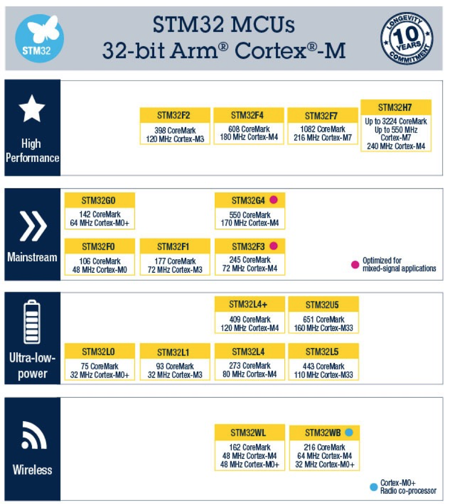

## ARM

ARM既指ARM公司，也指ARM处理器内核。

ARM公司是全球领先的半导体知识产权（IP）提供商，全世界超过95%的智能手机和平板电脑都采用ARM架构。ARM公司设计ARM内核，半导体厂商完善内核周边电路并生产芯片。

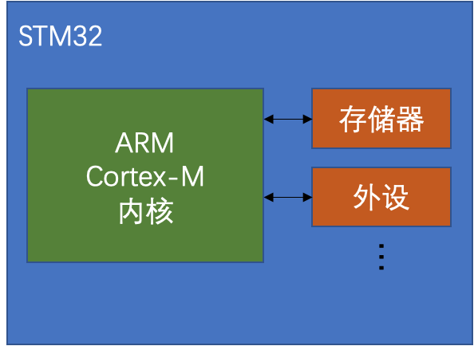

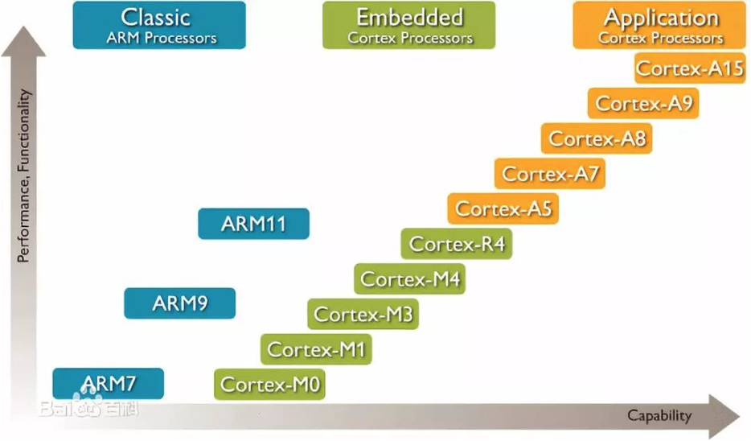

## 命名规则

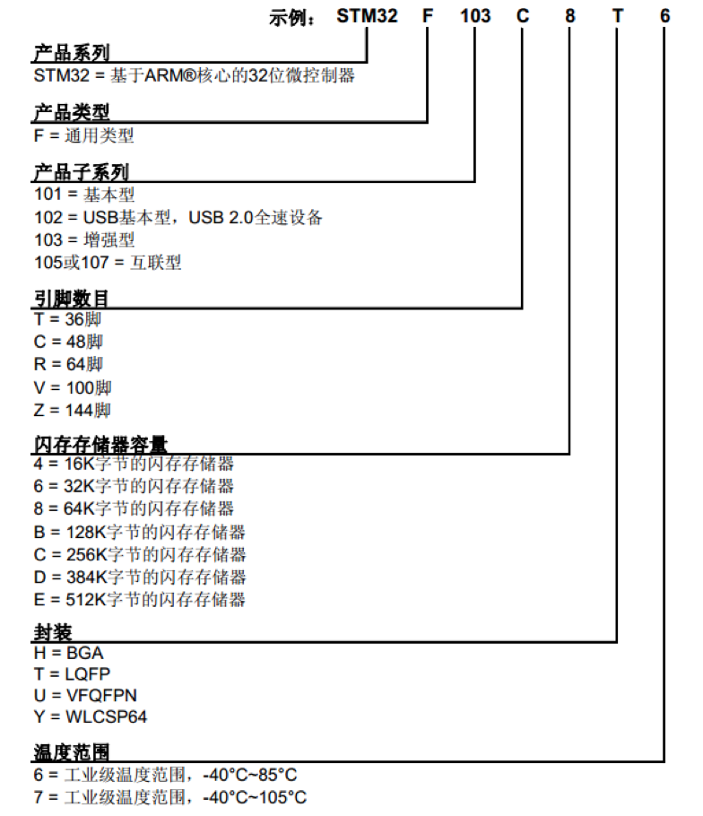

## 系统结构

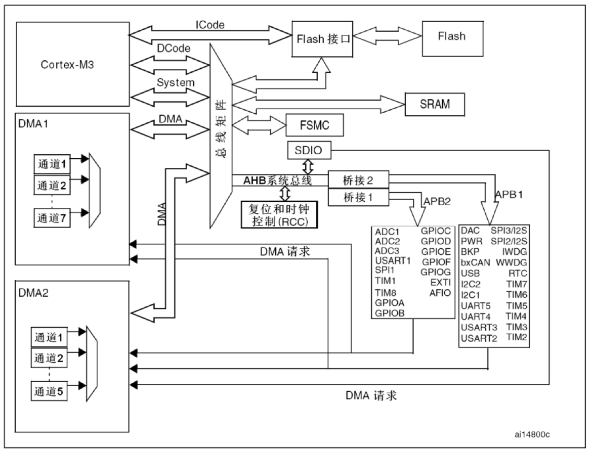

- RAM：主要用于临时数据存储，支持快速读写，用于程序运行时的动态数据存储
- ROM：主要用于存储程序代码和常量数据，具有非易失性

## 最小系统电路

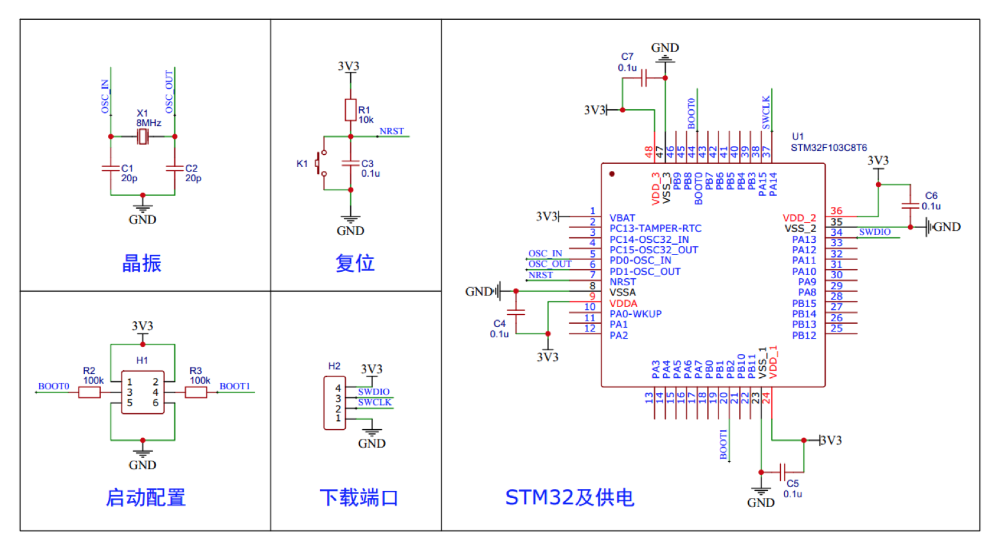

## 片上资源/外设

| 英文缩写 |        名称        | 英文缩写 |        名称        |
| :------: | :----------------: | :------: | :----------------: |
|   NVIC   | 嵌套向量中断控制器 |   CAN    |      CAN通信       |
| SysTick  |   系统滴答定时器   |   USB    |      USB通信       |
|   RCC    |   复位和时钟控制   |   RTC    |      实时时钟      |
|   GPIO   |      通用IO口      |   CRC    |      CRC校验       |
|   AFIO   |      复用IO口      |   PWR    |      电源控制      |
|   EXTI   |      外部中断      |   BKP    |     备份寄存器     |
|   TIM    |       定时器       |   IWDG   |     独立看门狗     |
|   ADC    |     模数转换器     |   WWDG   |     窗口看门狗     |
|   DMA    |    直接内存访问    |   DAC    |     数模转换器     |
|  USART   | 同步/异步串口通信  |   SDIO   |      SD卡接口      |
|   I2C    |      I2C通信       |   FSMC   | 可变静态存储控制器 |
|   SPI    |      SPI通信       | USB OTG  |    USB主机接口     |

## 启动配置

指定程序开始运行的位置，一般情况下是在 Flash程序存储器中开始执行 。

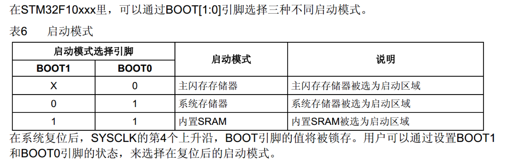

- 正常执行Flash闪存中的程序
- 用于串口下载程序
- 进行程序调试

## 工程架构

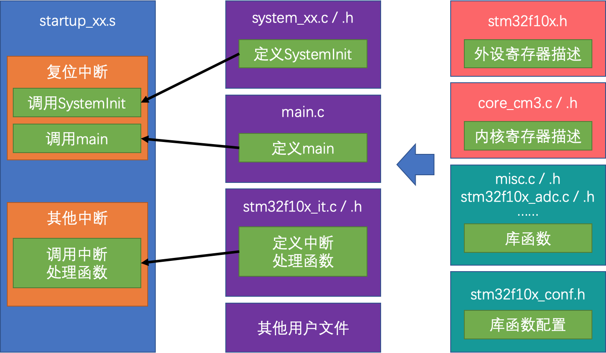

- Keil会自动生成两个文件夹（可删除）
	- Objects：存放编译过程中生成的目标文件
	- Listings：存放编译过程中生成的列表文件
- 常见的中间文件包括
	- 目标文件：`.o`文件，是编译器生成的中间目标文件
	- 列表文件：`.lst`文件，包含编译过程中的详细信息
	- 链接文件：`.map`文件，由链接器生成，包含符号链接信息
	- 可执行文件：`.hex`或`.elf`文件，是最终的可执行文件

**启动文件选择**

| 缩写  |        释义        | Flash容量 |       型号        |
| :---: | :----------------: | :-------: | :---------------: |
| LD_VL | 小容量产品超值系列 |  16~32K   |     STM32F100     |
| MD_VL | 中容量产品超值系列 |  64~128K  |     STM32F100     |
| HD_VL | 大容量产品超值系列 | 256~512K  |     STM32F100     |
|  LD   |     小容量产品     |  16~32K   | STM32F101/102/103 |
|  MD   |     中容量产品     |  64~128K  | STM32F101/102/103 |
|  HD   |     大容量产品     | 256~512K  | STM32F101/102/103 |
|  XL   |    加大容量产品    | 大于512K  | STM32F101/102/103 |
|  CL   |     互联型产品     |     -     |   STM32F105/107   |

**新建工程**

1. 建立工程文件夹，Keil中新建工程，选择型号
2. 工程文件夹里建立Start、Library、User等文件夹，复制固件库里面的文件到工程文件夹
3. 工程里对应建立Start、Library、User等同名称的分组，然后将文件夹内的文件添加到工程分组里
4. 工程选项，C/C++，Include Paths内声明所有包含头文件的文件夹
5. 工程选项，C/C++，Define内定义USE_STDPERIPH_DRIVER（库函数条件编译）
6. 工程选项，Debug，下拉列表选择对应调试器，Settings，Flash Download里勾选Reset and Run（避免下载后手动复位）

## 数据类型

|       关键字       | 位数 |         表示范围         | stdint关键字 | ST关键字 |
| :----------------: | :--: | :----------------------: | :----------: | :------: |
|        char        |  8   |        -128 ~ 127        |    int8_t    |    s8    |
|   unsigned char    |  8   |         0 ~ 255          |   uint8_t    |    u8    |
|       short        |  16  |      -32768 ~ 32767      |   int16_t    |   s16    |
|   unsigned short   |  16  |        0 ~ 65535         |   uint16_t   |   u16    |
|        int         |  32  | -2147483648 ~ 2147483647 |   int32_t    |   s32    |
|    unsigned int    |  32  |      0 ~ 4294967295      |   uint32_t   |   u32    |
|        long        |  32  | -2147483648 ~ 2147483647 |              |          |
|   unsigned long    |  32  |      0 ~ 4294967295      |              |          |
|     long long      |  64  |  -(2^64)/2 ~ (2^64)/2-1  |   int64_t    |          |
| unsigned long long |  64  |       0 ~ (2^64)-1       |   uint64_t   |          |
|       float        |  32  |     -3.4e38 ~ 3.4e38     |              |          |
|       double       |  64  |    -1.7e308 ~ 1.7e308    |              |          |

## 调试方式

- 串口调试：通过串口通信，将调试信息发送到电脑端，电脑使用串口助手显示调试信息
- 显示屏调试：直接将显示屏连接到单片机，将调试信息打印在显示屏上
- Keil调试模式：借助Keil软件的调试模式，可使用单步运行、设置断点、查看寄存器及变量等功能

# GPIO

## 简介

- GPIO（General Purpose Input Output）即通用输入输出口
- 可配置为8种输入输出模式
- 引脚电平：0V~3.3V，部分引脚可输入5V
- 输出模式下可控制端口输出高低电平，用以驱动LED、控制蜂鸣器、模拟通信协议输出时序等
- 输入模式下可读取端口的高低电平或电压，用于读取按键输入、外接模块电平信号输入、ADC电压采集、模拟通信协议接收数据等

注

1. 输入电压范围为0～5v，输出电压范围为0～3.3v
2. GPIO的输出速度可以限制输出引脚的最大反转速度，用于低功耗与稳定性

## 结构

**系统框图**

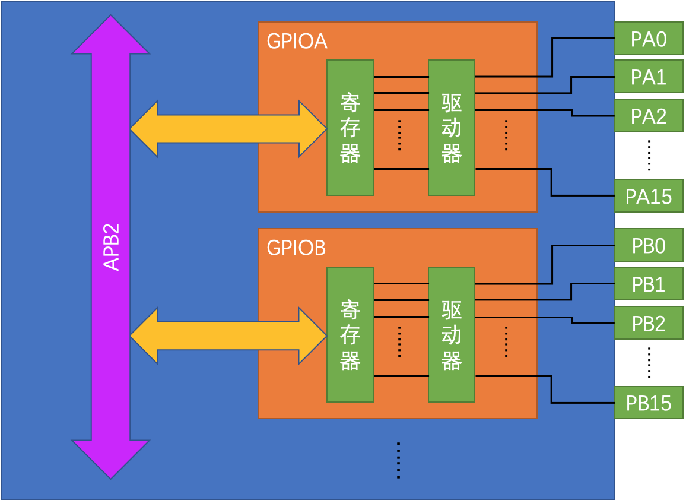

注

1. STM32中，所有的GPIO都是挂在在APB2外设总线上
2. 寄存器只有低16位有对应端口，高16位没有

**原理图**

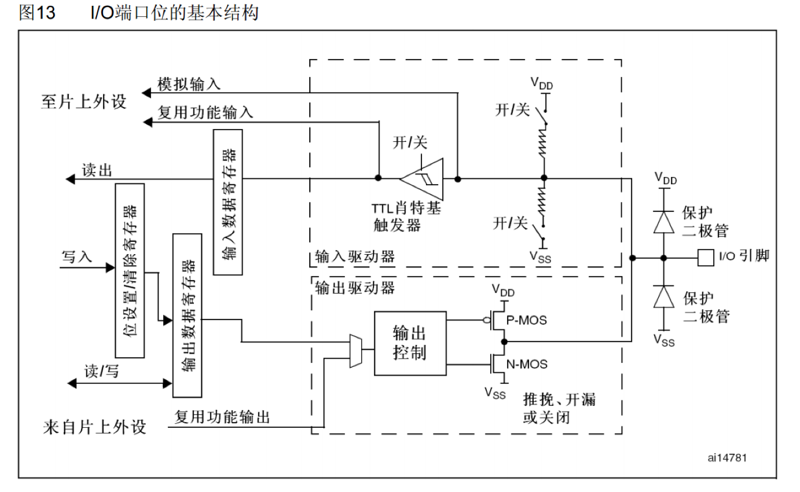

## GPIO模式

通过配置GPIO的端口配置寄存器，端口可以配置成以下8种模式

|   模式名称   |   性质   |                        特征                        |
| :----------: | :------: | :------------------------------------------------: |
|   浮空输入   | 数字输入 |      可读取引脚电平，若引脚悬空，则电平不确定      |
|   上拉输入   | 数字输入 | 可读取引脚电平，内部连接上拉电阻，悬空时默认高电平 |
|   下拉输入   | 数字输入 | 可读取引脚电平，内部连接下拉电阻，悬空时默认低电平 |
|   模拟输入   | 模拟输入 |           GPIO无效，引脚直接接入内部ADC            |
|   开漏输出   | 数字输出 |    可输出引脚电平，高电平为高阻态，低电平接VSS     |
|   推挽输出   | 数字输出 |      可输出引脚电平，高电平接VDD，低电平接VSS      |
| 复用开漏输出 | 数字输出 |    由片上外设控制，高电平为高阻态，低电平接VSS     |
| 复用推挽输出 | 数字输出 |      由片上外设控制，高电平接VDD，低电平接VSS      |

注

1. 一个端口只能有一个输出，但可以有多个输入，因此输出模式下输入仍有效

### 浮空/上拉/下拉输入

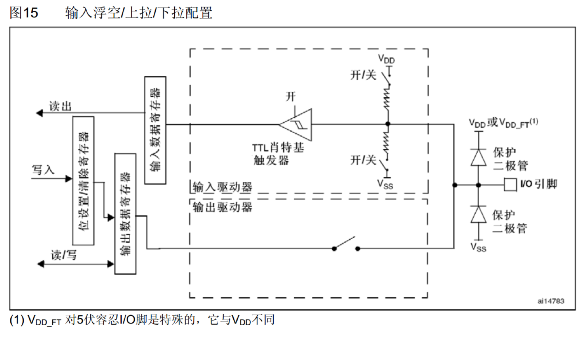

注

1. 如果外部模块默认输出低电平，选择下拉输入，反之选择上拉输入，一般默认上拉输入
2. 浮空输入由于没有默认电平，输入会受噪声干扰，不断跳变
3. 若不确定外部输出或功率非常小，就选择浮空输入

### 模拟输入

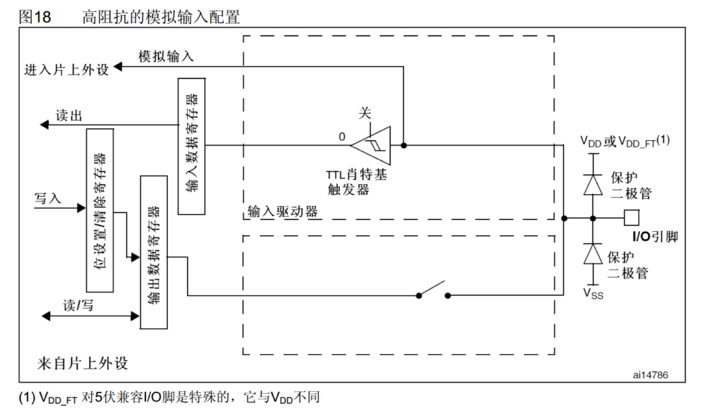

注

1. 模拟输入模式是ADC模数转换器的专属配置
2. 推挽输出模式下，STM32对I/O口有绝对的控制权

### 开漏/推挽输出

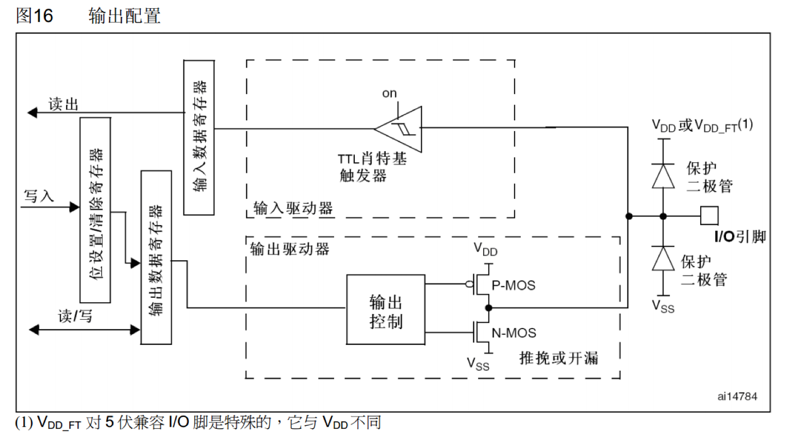

注

1. 开漏输出模式下，P-MOS无效，只有低电平有驱动能力，高电平没有驱动能力，常用作通信协议的驱动方式，同时还可以配合外部5v电源来兼容5v电平的设备

### 复用开漏/推挽输出

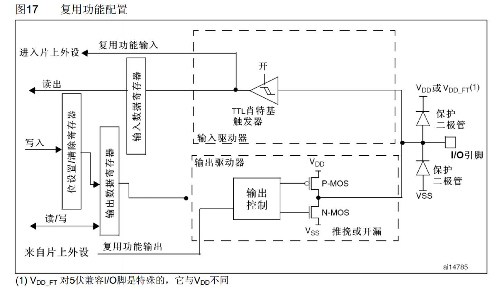

# AFIO

- AFIO主要用于引脚复用功能的选择和重定义
- 在STM32中，AFIO主要完成两个任务：复用功能引脚重映射、中断引脚选择

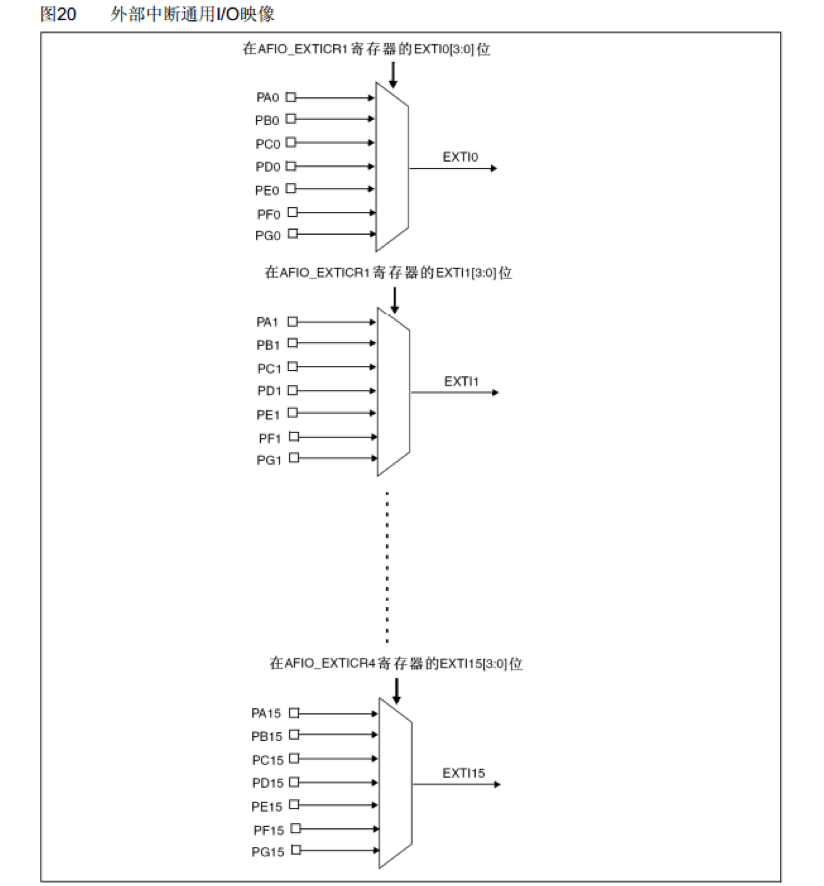

# 中断

## 简介

- 中断：在主程序运行过程中，出现了特定的中断触发条件（中断源），使得CPU暂停当前正在运行的程序，转而去处理中断程序，处理完成后又返回原来被暂停的位置继续运行
- 中断优先级：当有多个中断源同时申请中断时，CPU会根据中断源的轻重缓急进行裁决，优先响应更加紧急的中断源
- 中断嵌套：当一个中断程序正在运行时，又有新的更高优先级的中断源申请中断，CPU再次暂停当前中断程序，转而去处理新的中断程序，处理完成后依次进行返回
- STM32中，中断优先级为0~15，值越低，中断优先级越高

**中断执行流程**

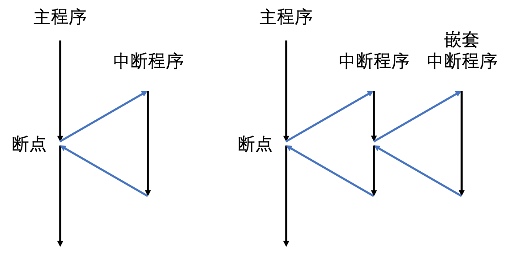

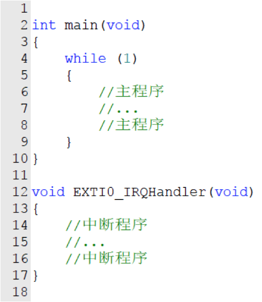

注

1. 一般来说，中断处理函数由硬件自动调用
2. 中断函数要简短快速，不要操作与主程序可能产生冲突的硬件

**STM32中断**

- 68个可屏蔽的中断通道（中断源），包含EXTI、TIM、ADC、USART、SPI、I2C、RTC等多个外设
- 使用NVIC统一管理中断，每个中断通道都拥有16个可编程的优先等级，可对优先级进行分组，进一步设置抢占优先级和响应优先级
- STM32中断分为内核中断（如复位）和外设中断

## NVIC

嵌套中断向量控制器，在STM32中用来统一分配和管理中断，属于内核外设。

**基本结构**

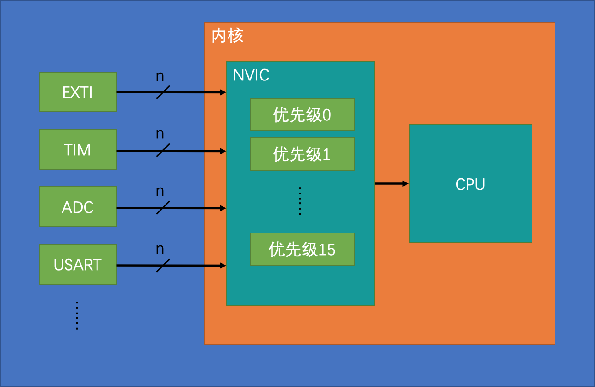

**NVIC优先级分组**

- NVIC的中断优先级由优先级寄存器的4位（0~15）决定，这4位可以进行切分，分为高n位的抢占优先级和低4-n位的响应优先级
- 抢占优先级高的可以中断嵌套，响应优先级高的可以优先排队，抢占优先级和响应优先级均相同的按中断号排队

| 分组方式 |   抢占优先级    |   响应优先级    |
| :------: | :-------------: | :-------------: |
|  分组0   |  0位，取值为0   | 4位，取值为0~15 |
|  分组1   | 1位，取值为0~1  | 3位，取值为0~7  |
|  分组2   | 2位，取值为0~3  | 2位，取值为0~3  |
|  分组3   | 3位，取值为0~7  | 1位，取值为0~1  |
|  分组4   | 4位，取值为0~15 |  0位，取值为0   |

# EXTI

## 简介

- EXTI（Extern Interrupt），即外部中断
- EXTI可以监测指定GPIO口的电平信号，当其指定的GPIO口产生电平变化时，EXTI将立即向NVIC发出中断申请，经过NVIC裁决后即可中断CPU主程序，使CPU执行EXTI对应的中断程序
- 支持的触发方式：上升沿/下降沿/双边沿/软件触发
- 支持的GPIO口：所有GPIO口，但相同GPIO_Pin共用一个中断，如PA1、PB1，只能选其中一个
- 通道数：16个GPIO_Pin，外加PVD输出、RTC闹钟、USB唤醒、以太网唤醒
- 触发响应方式：中断响应/事件响应

注

1. 中断响应为正常中断，事件响应不会触发中断，而是触发其他外设的操作

## 结构

**基本结构**

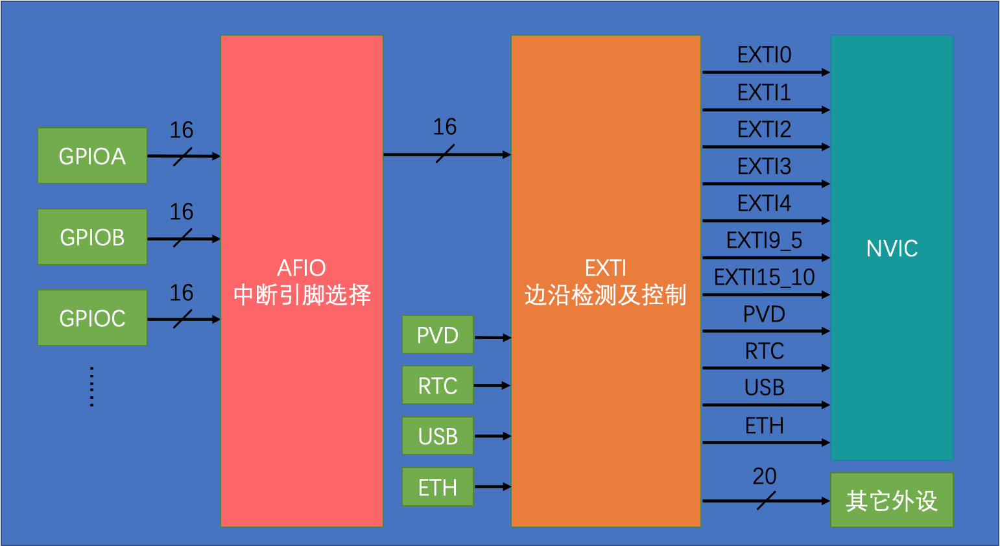

**EXTI框图**

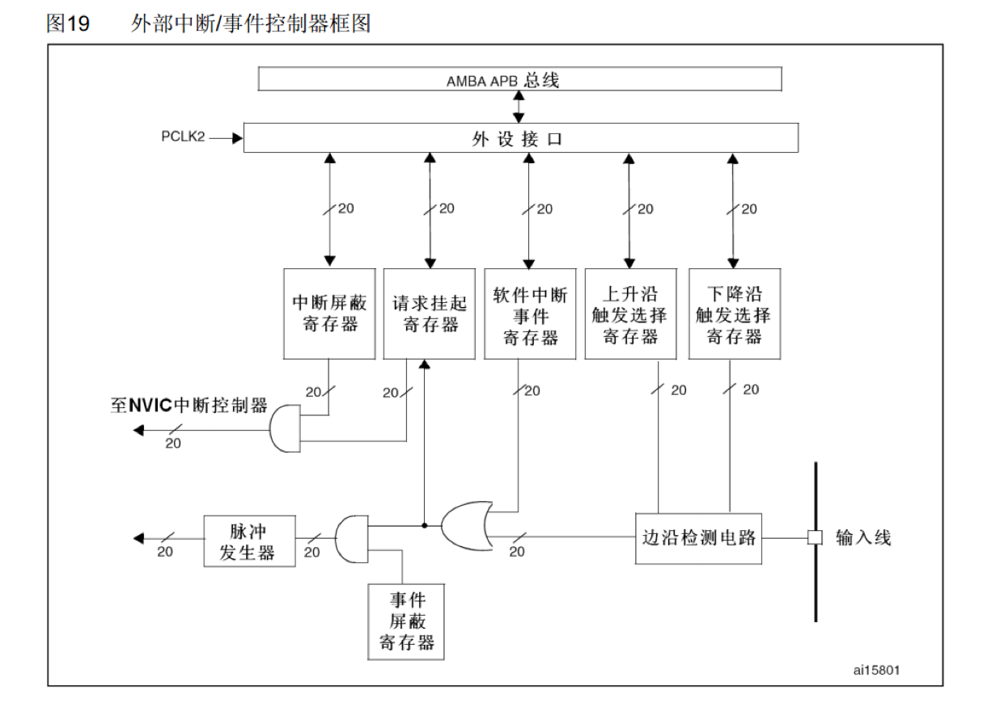

注

1. EXIT5\~9触发同一个中断函数，EXIT10\~15触发同一个中断函数

# TIM

## 简介

- TIM（Timer），即定时器
- 定时器可以对输入的时钟进行计数，并在计数值达到设定值时触发中断
- 16位计数器、预分频器、自动重装寄存器的时基单元，在72MHz计数时钟下可以实现最大59.65s的定时
- 不仅具备基本的定时中断功能，而且还包含内外时钟源选择、输入捕获、输出比较、编码器接口、主从触发模式等多种功能
- 根据复杂度和应用场景分为了高级定时器、通用定时器、基本定时器三种类型

注

1. 定时器支持级联模式，即一个定时器的输出作为另一个定时器的输入，可扩大计时时间

## 定时器类型

|    类型    |          编号          | 总线 |                             功能                             |
| :--------: | :--------------------: | ---- | :----------------------------------------------------------: |
| 高级定时器 |       TIM1、TIM8       | APB2 | 拥有通用定时器全部功能，并额外具有重复计数器、死区生成、互补输出、刹车输入等功能 |
| 通用定时器 | TIM2、TIM3、TIM4、TIM5 | APB1 | 拥有基本定时器全部功能，并额外具有内外时钟源选择、输入捕获、输出比较、编码器接口、主从触发模式等功能 |
| 基本定时器 |       TIM6、TIM7       | APB1 |              拥有定时中断、主模式触发DAC的功能               |

### 基本定时器

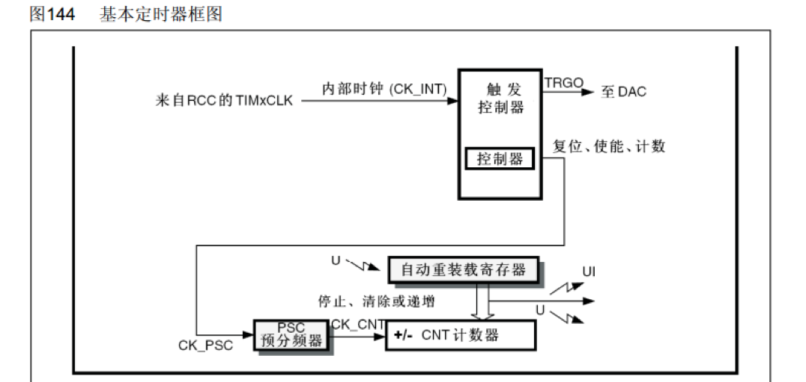

注

1. 预分频器、计数器和自动重装寄存器构成了基本的计数计时电路，也被称为时基单元
2. 预分频器对输入频率（基准时钟）进行分频，实际分频系数 = 预频器系数（16位） + 1，输出频率 = 输入频率 / 实际分频系数
3. 计数器对预频器之后的计数时钟进行计数，计数时钟每来一个上升沿计数器值+1，也为16位
4. 自动重装寄存器也为16位，值为固定，当计数值 = 自动重装值时，产生中断信号，并清零计数值重新计数

### 通用定时器

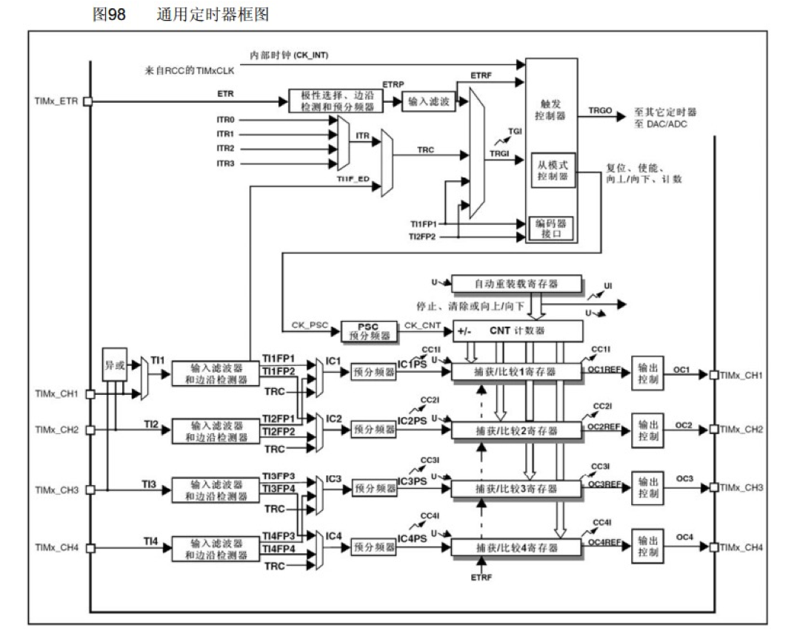

注

1. 除了支持向上计数模式，还支持向下计数模式和中央对齐模式
2. 基本定时器只能选择内部时钟，而通用计数器还可以选择外部时钟
	-  外部时钟模式2：ETR 
	-  外部时钟模式1：TRGI，可以实现定时器级联

### 高级定时器

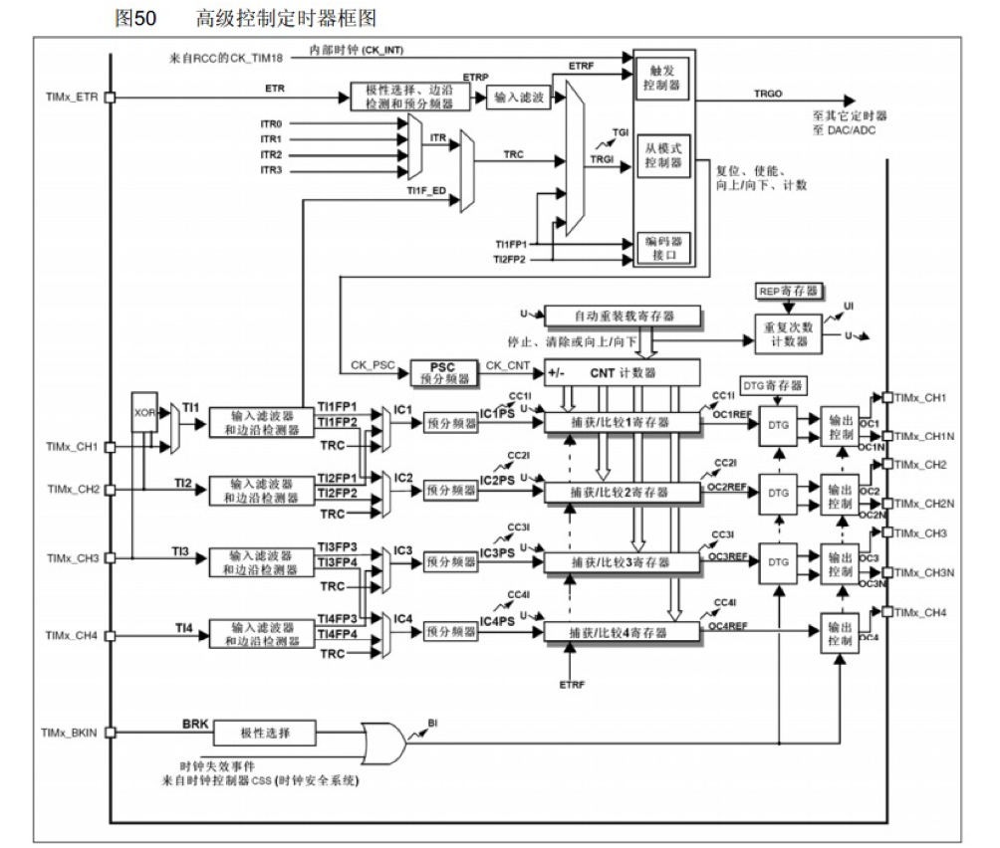

## 定时中断

**基本结构**

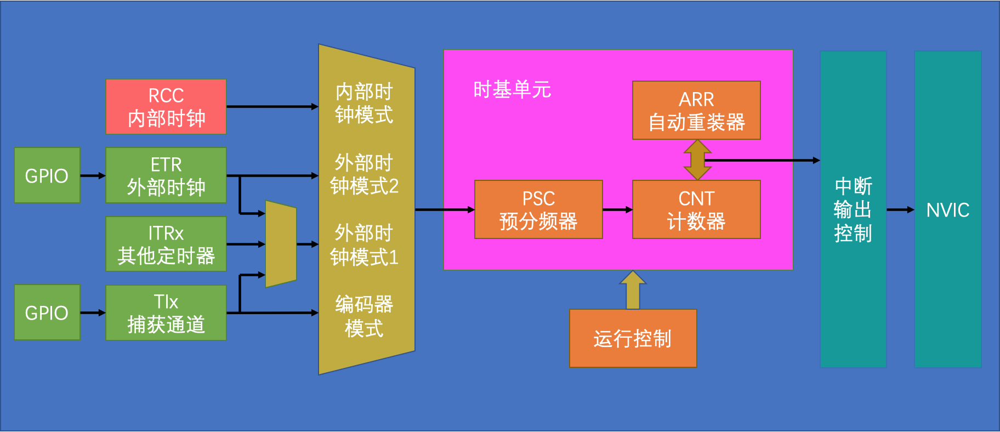

**预分频器时序**

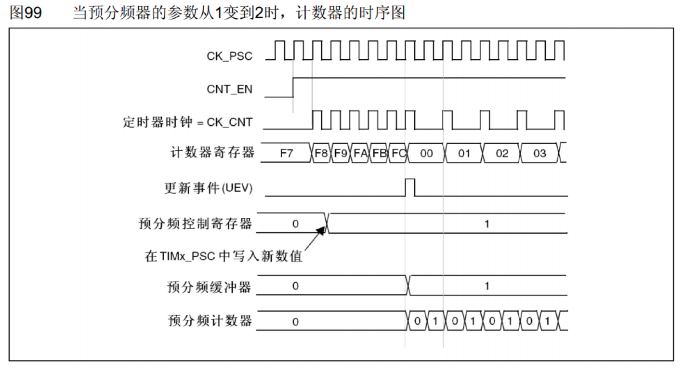

- 计数器计数频率：CK_CNT = CK_PSC / (PSC + 1)
- 计数到一半时改变了分频值，变化并不会立刻生效，而是等本次计数周期结束时产生更新事件，预分频寄存器的值才会被传递到预分频缓冲器中，而后生效

**计数器时序**

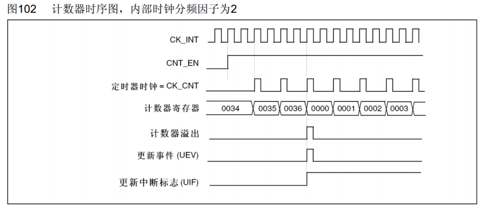

- 计数器溢出频率：CK_CNT_OV = CK_CNT / (ARR + 1)= CK_PSC / (PSC + 1) / (ARR + 1)
- UIF置1后就会申请中断，需要在中断程序中手动清零
- 通过设置ARPE位，可以选择是否使用预装功能，即有无缓冲寄存器

**计数器无预装时序**

- 直接更新

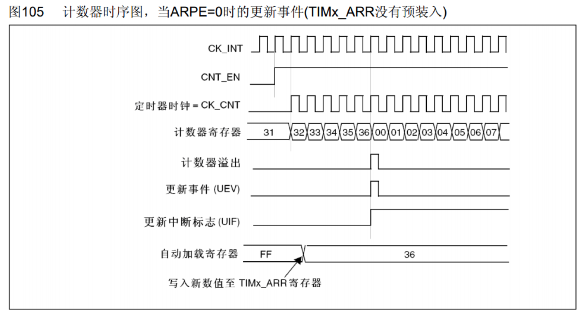

**计数器有预装时序**

- 待本次周期完成后，才更新
- 让值的变化和更新事件同步发生，防止在运行途中更改造成延迟清零

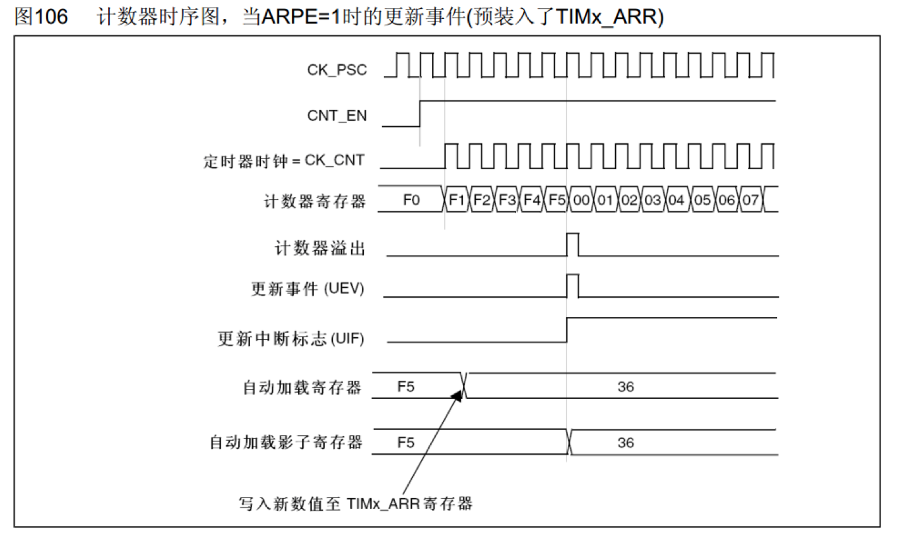

## RCC时钟树

- 用来产生配置时钟，并把配制好的时钟发送到各个外设的系统
- 时钟是所有外设的基础，所以时钟也是最先需要配置的东西
- 外部石英振荡器比内部的RC振荡器更加稳定

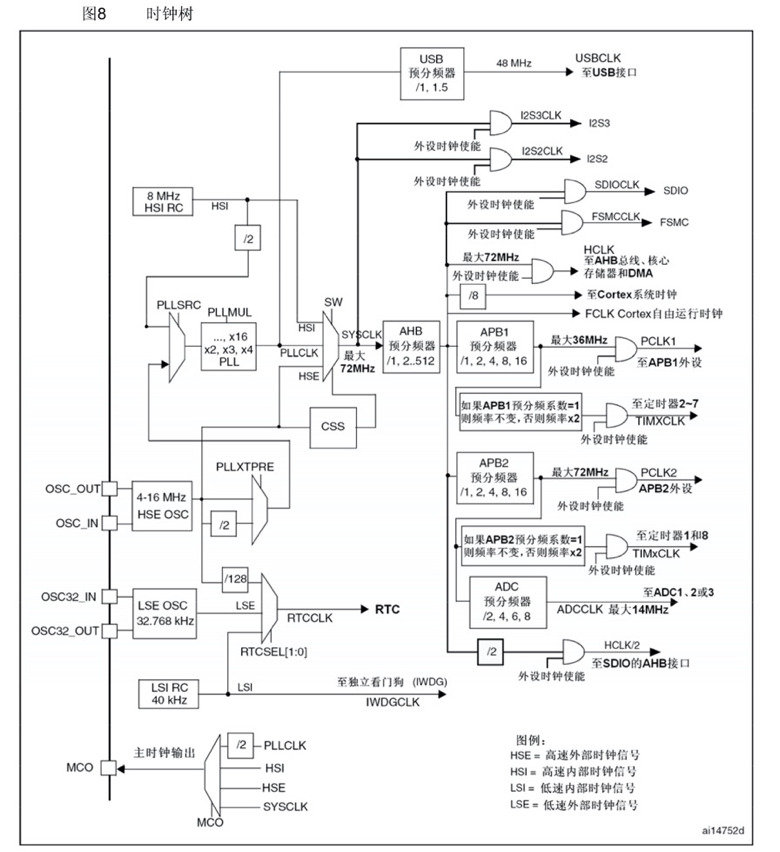

## 实例

### 定时器定时中断

```c
/* Timer.c */

#include "stm32f10x.h"                 											 

uint16_t Num;

/**
  * 函    数：定时中断初始化
  * 参    数：无
  * 返 回 值：无
  */
void Timer_Init(void)
{
	/*开启时钟*/
	RCC_APB1PeriphClockCmd(RCC_APB1Periph_TIM2, ENABLE);						//开启TIM2的时钟
	
	/*配置时钟源*/
	TIM_InternalClockConfig(TIM2);																	//选择TIM2为内部时钟，若不调用此函数，TIM默认也为内部时钟
	
	/*时基单元初始化*/
	TIM_TimeBaseInitTypeDef TIM_TimeBaseInitStructure;							//定义结构体变量
	TIM_TimeBaseInitStructure.TIM_ClockDivision = TIM_CKD_DIV1;			//时钟分频，选择不分频，此参数用于配置滤波器时钟，不影响时基单元功能
	TIM_TimeBaseInitStructure.TIM_CounterMode = TIM_CounterMode_Up;	//计数器模式，选择向上计数
	TIM_TimeBaseInitStructure.TIM_Period = 10000 - 1;								//计数周期，即ARR的值
	TIM_TimeBaseInitStructure.TIM_Prescaler = 7200 - 1;							//预分频器，即PSC的值
	TIM_TimeBaseInitStructure.TIM_RepetitionCounter = 0;						//重复计数器，高级定时器才会用到
	TIM_TimeBaseInit(TIM2, &TIM_TimeBaseInitStructure);							//将结构体变量交给TIM_TimeBaseInit，配置TIM2的时基单元	
	
	/*中断输出配置*/
	TIM_ClearFlag(TIM2, TIM_FLAG_Update);														//清除定时器更新标志位
  //TIM_TimeBaseInit函数末尾，手动产生了更新事件
  //若不清除此标志位，则开启中断后，会立刻进入一次中断
  //如果不介意此问题，则不清除此标志位也可
	
	TIM_ITConfig(TIM2, TIM_IT_Update, ENABLE);											//开启TIM2的更新中断
	
	/*NVIC中断分组*/
	NVIC_PriorityGroupConfig(NVIC_PriorityGroup_2);									//配置NVIC为分组2
  //即抢占优先级范围：0~3，响应优先级范围：0~3
  //此分组配置在整个工程中仅需调用一次
  //若有多个中断，可以把此代码放在main函数内，while循环之前
  //若调用多次配置分组的代码，则后执行的配置会覆盖先执行的配置
	
	/*NVIC配置*/
	NVIC_InitTypeDef NVIC_InitStructure;														//定义结构体变量
	NVIC_InitStructure.NVIC_IRQChannel = TIM2_IRQn;									//选择配置NVIC的TIM2线
	NVIC_InitStructure.NVIC_IRQChannelCmd = ENABLE;									//指定NVIC线路使能
	NVIC_InitStructure.NVIC_IRQChannelPreemptionPriority = 2;				//指定NVIC线路的抢占优先级为2
	NVIC_InitStructure.NVIC_IRQChannelSubPriority = 1;							//指定NVIC线路的响应优先级为1
	NVIC_Init(&NVIC_InitStructure);																	//将结构体变量交给NVIC_Init，配置NVIC外设
	
	/*TIM使能*/
	TIM_Cmd(TIM2, ENABLE);																					//使能TIM2，定时器开始运行
}

/**
  * 函    数：TIM2中断函数
  * 参    数：无
  * 返 回 值：无
  * 注意事项：此函数为中断函数，无需调用，中断触发后自动执行
  *           函数名为预留的指定名称，可以从启动文件复制
  *           请确保函数名正确，不能有任何差异，否则中断函数将不能进入
  */
void TIM2_IRQHandler(void)
{
	if (TIM_GetITStatus(TIM2, TIM_IT_Update) == SET)	//判断是否是TIM2的更新事件触发的中断
	{
		Num ++;																					//Num变量自增，用于测试定时中断
		TIM_ClearITPendingBit(TIM2, TIM_IT_Update);			//清除TIM2更新事件的中断标志位
    //中断标志位必须清除
    //否则中断将连续不断地触发，导致主程序卡死
	}
}
```

```c
/* main.c */

#include "stm32f10x.h"                  				// Device header
#include "Delay.h"
#include "OLED.h"
#include "Timer.h"

extern uint16_t Num;														//定义在定时器中断里自增的变量

int main(void)
{
	/*模块初始化*/
	OLED_Init();																	//OLED初始化
	Timer_Init();																	//定时中断初始化
	
	/*显示静态字符串*/
	OLED_ShowString(1, 1, "Num:");								//1行1列显示字符串Num:
	
	while (1)
	{
		OLED_ShowNum(1, 5, Num, 5);									//不断刷新显示Num变量
	}
}
```

### 定时器外部时钟

```c
/* Timer.c */

#include "stm32f10x.h"                 											 

uint16_t Num;

/**
  * 函    数：定时中断初始化
  * 参    数：无
  * 返 回 值：无
  */
void Timer_Init(void)
{
	/*开启时钟*/
	RCC_APB1PeriphClockCmd(RCC_APB1Periph_TIM2, ENABLE);						//开启TIM2的时钟
	RCC_APB2PeriphClockCmd(RCC_APB2Periph_GPIOA, ENABLE);						//开启GPIOA的时钟
	
	
	/*GPIO初始化*/
	GPIO_InitTypeDef GPIO_InitStructure;
	GPIO_InitStructure.GPIO_Mode = GPIO_Mode_IPU;
	GPIO_InitStructure.GPIO_Pin = GPIO_Pin_0;
	GPIO_InitStructure.GPIO_Speed = GPIO_Speed_50MHz;
	GPIO_Init(GPIOA, &GPIO_InitStructure);													//将PA0引脚初始化为上拉输入
	
	/*外部时钟配置*/
	TIM_ETRClockMode2Config(TIM2, TIM_ExtTRGPSC_OFF, TIM_ExtTRGPolarity_NonInverted, 0x0F);
  //选择外部时钟模式2，时钟从TIM_ETR引脚输入
  //注意TIM2的ETR引脚固定为PA0，无法随意更改（引脚定义表中）
  //最后一个滤波器参数加到最大0x0F，可滤除时钟信号抖动
	
	
	/*时基单元初始化*/
	TIM_TimeBaseInitTypeDef TIM_TimeBaseInitStructure;							//定义结构体变量
	TIM_TimeBaseInitStructure.TIM_ClockDivision = TIM_CKD_DIV1;			//时钟分频，选择不分频，此参数用于配置滤波器时钟，不影响时基单元功能
	TIM_TimeBaseInitStructure.TIM_CounterMode = TIM_CounterMode_Up;	//计数器模式，选择向上计数
	TIM_TimeBaseInitStructure.TIM_Period = 10 - 1;									//计数周期，即ARR的值
	TIM_TimeBaseInitStructure.TIM_Prescaler = 1 - 1;								//预分频器，即PSC的值
	TIM_TimeBaseInitStructure.TIM_RepetitionCounter = 0;						//重复计数器，高级定时器才会用到
	TIM_TimeBaseInit(TIM2, &TIM_TimeBaseInitStructure);							//将结构体变量交给TIM_TimeBaseInit，配置TIM2的时基单元	
	
	/*中断输出配置*/
	TIM_ClearFlag(TIM2, TIM_FLAG_Update);														//清除定时器更新标志位
  //TIM_TimeBaseInit函数末尾，手动产生了更新事件
  //若不清除此标志位，则开启中断后，会立刻进入一次中断
  //如果不介意此问题，则不清除此标志位也可
	
	TIM_ITConfig(TIM2, TIM_IT_Update, ENABLE);											//开启TIM2的更新中断
	
	/*NVIC中断分组*/
	NVIC_PriorityGroupConfig(NVIC_PriorityGroup_2);									//配置NVIC为分组2
  //即抢占优先级范围：0~3，响应优先级范围：0~3
  //此分组配置在整个工程中仅需调用一次
  //若有多个中断，可以把此代码放在main函数内，while循环之前
  //若调用多次配置分组的代码，则后执行的配置会覆盖先执行的配置
	
	/*NVIC配置*/
	NVIC_InitTypeDef NVIC_InitStructure;														//定义结构体变量
	NVIC_InitStructure.NVIC_IRQChannel = TIM2_IRQn;									//选择配置NVIC的TIM2线
	NVIC_InitStructure.NVIC_IRQChannelCmd = ENABLE;									//指定NVIC线路使能
	NVIC_InitStructure.NVIC_IRQChannelPreemptionPriority = 2;				//指定NVIC线路的抢占优先级为2
	NVIC_InitStructure.NVIC_IRQChannelSubPriority = 1;							//指定NVIC线路的响应优先级为1
	NVIC_Init(&NVIC_InitStructure);																	//将结构体变量交给NVIC_Init，配置NVIC外设
	
	/*TIM使能*/
	TIM_Cmd(TIM2, ENABLE);																					//使能TIM2，定时器开始运行
}

/**
  * 函    数：TIM2中断函数
  * 参    数：无
  * 返 回 值：无
  * 注意事项：此函数为中断函数，无需调用，中断触发后自动执行
  *           函数名为预留的指定名称，可以从启动文件复制
  *           请确保函数名正确，不能有任何差异，否则中断函数将不能进入
  */
void TIM2_IRQHandler(void)
{
	if (TIM_GetITStatus(TIM2, TIM_IT_Update) == SET)				//判断是否是TIM2的更新事件触发的中断
	{
		Num ++;																								//Num变量自增，用于测试定时中断
		TIM_ClearITPendingBit(TIM2, TIM_IT_Update);						//清除TIM2更新事件的中断标志位
    //中断标志位必须清除
    //否则中断将连续不断地触发，导致主程序卡死
	}
}
```

```c
/* main.c */

#include "stm32f10x.h"                  					// Device header
#include "Delay.h"
#include "OLED.h"
#include "Timer.h"

extern uint16_t Num;															//定义在定时器中断里自增的变量

int main(void)
{
	/*模块初始化*/
	OLED_Init();																		//OLED初始化
	Timer_Init();																		//定时中断初始化
	
	/*显示静态字符串*/
	OLED_ShowString(1, 1, "Num:");									//1行1列显示字符串Num:
	OLED_ShowString(2, 1, "CNT:");									//2行1列显示字符串CNT:
	
	while (1)
	{
		OLED_ShowNum(1, 5, Num, 5);										//不断刷新显示Num变量
		OLED_ShowNum(2, 5, Timer_GetCounter(), 5);		//不断刷新显示CNT的值
	}
}
```

### 定时器实现非阻塞式程序

- 将原本需要阻塞的代码变为非阻塞式的，可以保证主循环的快速执行，让每部分功能都能得到及时响应
- 通过定时器中断实现


注

1. 在定时器中断（1ms）中需要确保执行的中断程序不应执行太久，否则出现中断重叠现象，可以考虑减少中断程序执行时间或减小定时器中断触发频率

```c
/* timer.c */

#include "stm32f10x.h"                 

void Timer_Init(void)					
{
	RCC_APB1PeriphClockCmd(RCC_APB1Periph_TIM2, ENABLE); 														// 开启时钟

	TIM_InternalClockConfig(TIM2);
	
	TIM_TimeBaseInitTypeDef TIM_TimeBaseInitStructure;
	TIM_TimeBaseInitStructure.TIM_ClockDivision          =  TIM_CKD_DIV1;
	TIM_TimeBaseInitStructure.TIM_CounterMode            =  TIM_CounterMode_Up;
	TIM_TimeBaseInitStructure.TIM_Period                 =  1000 - 1; 							// 1ms
	TIM_TimeBaseInitStructure.TIM_Prescaler              =  72 - 1;
	TIM_TimeBaseInitStructure.TIM_RepetitionCounter      =  0;
	TIM_TimeBaseInit(TIM2, &TIM_TimeBaseInitStructure);
	
	TIM_ClearFlag(TIM2, TIM_FLAG_Update);
	TIM_ITConfig(TIM2, TIM_IT_Update, ENABLE);
	
	NVIC_PriorityGroupConfig(NVIC_PriorityGroup_2);												
	
	NVIC_InitTypeDef NVIC_InitStructure;
	NVIC_InitStructure.NVIC_IRQChannel                   =  TIM2_IRQn;
	NVIC_InitStructure.NVIC_IRQChannelCmd                =  ENABLE;
	NVIC_InitStructure.NVIC_IRQChannelPreemptionPriority =  2;
	NVIC_InitStructure.NVIC_IRQChannelSubPriority        =  1;
	NVIC_Init(&NVIC_InitStructure);																				  				// 中断初始化
	
	TIM_Cmd(TIM2, ENABLE);			
}
```

```c
/* key.c */

#include "stm32f10x.h"                 
#include "Delay.h"

uint8_t Key_Num;

void Key_Init(void)											 												// 初始化按键					
{
	RCC_APB2PeriphClockCmd(RCC_APB2Periph_GPIOB, ENABLE);
	
	GPIO_InitTypeDef GPIO_InitStructure;
	GPIO_InitStructure.GPIO_Mode  = GPIO_Mode_IPU;
	GPIO_InitStructure.GPIO_Pin   = GPIO_Pin_1 | GPIO_Pin_11;
	GPIO_InitStructure.GPIO_Speed = GPIO_Speed_50MHz;
	GPIO_Init(GPIOB, &GPIO_InitStructure);
}

uint8_t Key_GetNum(void)																				// 获取按键值
{
	uint8_t Temp;
	if (Key_Num)
	{
		Temp    = Key_Num;
		Key_Num = 0;
		return Temp;
	}
	return 0;
}

uint8_t Key_GetState(void)																			// 获取按键状态
{
	if (GPIO_ReadInputDataBit(GPIOB, GPIO_Pin_1)  == 0)
	{
		return 1;
	}
	if (GPIO_ReadInputDataBit(GPIOB, GPIO_Pin_11) == 0)
	{
		return 2;
	}
	return 0;
}

void Key_Tick(void)																							// 定时中断实现按键扫描
{
	static uint8_t Count;
	static uint8_t CurrState, PrevState;
	
	Count ++;
	if (Count >= 20)																							// 20ms扫描一次	
	{
		Count     = 0;
		
		PrevState = CurrState;
		CurrState = Key_GetState();
		
		if (CurrState == 0 && PrevState != 0)												// 按键松开
		{
			Key_Num = PrevState;
		}
	}
}
```

```c
/* led.c */

#include "stm32f10x.h"                  

uint8_t LED1_Mode;
uint8_t LED2_Mode;

uint16_t LED1_Count;
uint16_t LED2_Count;

void LED_Init(void)																							// 初始化LED
{
	RCC_APB2PeriphClockCmd(RCC_APB2Periph_GPIOA, ENABLE);
	
	GPIO_InitTypeDef GPIO_InitStructure;
	GPIO_InitStructure.GPIO_Mode = GPIO_Mode_Out_PP;
	GPIO_InitStructure.GPIO_Pin = GPIO_Pin_1 | GPIO_Pin_2;
	GPIO_InitStructure.GPIO_Speed = GPIO_Speed_50MHz;
	GPIO_Init(GPIOA, &GPIO_InitStructure);
	
	GPIO_SetBits(GPIOA, GPIO_Pin_1 | GPIO_Pin_2);
}

void LED1_SetMode(uint8_t Mode)																	// 设置LED1的模式
{
	if (Mode != LED1_Mode)
	{
		LED1_Mode = Mode;
		LED1_Count = 0;
	}
}

void LED2_SetMode(uint8_t Mode)
{
	if (Mode != LED2_Mode)
	{
		LED2_Mode = Mode;
		LED2_Count = 0;
	}
}

void LED1_ON(void)																							// 打开LED1
{
	GPIO_ResetBits(GPIOA, GPIO_Pin_1);
}

void LED1_OFF(void)																							// 关闭LED1
{
	GPIO_SetBits(GPIOA, GPIO_Pin_1);
}

void LED2_ON(void)
{
	GPIO_ResetBits(GPIOA, GPIO_Pin_2);
}

void LED2_OFF(void)
{
	GPIO_SetBits(GPIOA, GPIO_Pin_2);
}

void LED_Tick(void)																							// LED的定时器中断服务程序	
{
	if (LED1_Mode == 0)
	{
		LED1_OFF();
	}
	else if (LED1_Mode == 1)
	{
		LED1_ON();
	}
	else if (LED1_Mode == 2)
	{
		LED1_Count ++;
		LED1_Count %= 1000;
		
		if (LED1_Count < 500)
		{
			LED1_ON();
		}
		else
		{
			LED1_OFF();
		}
	}
	else if (LED1_Mode == 3)
	{
		LED1_Count ++;
		LED1_Count %= 100;
		
		if (LED1_Count < 50)
		{
			LED1_ON();
		}
		else
		{
			LED1_OFF();
		}
	}
	else if (LED1_Mode == 4)
	{
		LED1_Count ++;
		LED1_Count %= 1000;
		
		if (LED1_Count < 100)
		{
			LED1_ON();
		}
		else
		{
			LED1_OFF();
		}
	}
	
	
	if (LED2_Mode == 0)
	{
		LED2_OFF();
	}
	else if (LED2_Mode == 1)
	{
		LED2_ON();
	}
	else if (LED2_Mode == 2)
	{
		LED2_Count ++;
		LED2_Count %= 1000;
		
		if (LED2_Count < 500)
		{
			LED2_ON();
		}
		else
		{
			LED2_OFF();
		}
	}
	else if (LED2_Mode == 3)
	{
		LED2_Count ++;
		LED2_Count %= 100;
		
		if (LED2_Count < 50)
		{
			LED2_ON();
		}
		else
		{
			LED2_OFF();
		}
	}
	else if (LED2_Mode == 4)
	{
		LED2_Count ++;
		LED2_Count %= 1000;
		
		if (LED2_Count < 100)
		{
			LED2_ON();
		}
		else
		{
			LED2_OFF();
		}
	}
}
```

```c
/* main.c */

#include "stm32f10x.h"                  
#include "Delay.h"
#include "OLED.h"
#include "LED.h"
#include "Key.h"
#include "Timer.h"

uint8_t KeyNum;
uint8_t LED1Mode;
uint8_t LED2Mode;

uint16_t i;

int main(void)
{
	OLED_Init();
	LED_Init();
	Key_Init();
	Timer_Init();
	
	OLED_ShowString(1, 1, "i:");
	OLED_ShowString(2, 1, "LED1Mode:");
	OLED_ShowString(3, 1, "LED2Mode:");
	
	while (1)
	{
		KeyNum = Key_GetNum();
		
		if (KeyNum == 1)
		{
			LED1Mode ++;
			LED1Mode %= 5;
			LED1_SetMode(LED1Mode);
		}
		if (KeyNum == 2)
		{
			LED2Mode ++;
			LED2Mode %= 5;
			LED2_SetMode(LED2Mode);
		}
		
		OLED_ShowNum(1, 3, i ++, 5);
		OLED_ShowNum(2, 10, LED1Mode, 1);
		OLED_ShowNum(3, 10, LED2Mode, 1);
	}
}

/*
 * 函数：实现定时器中断服务函数
 * 目的：用于按键扫描和LED控制
 * 注意：定时器中断服务函数中不要使用延时函数，执行时间过长会导致中断重叠
*/
void TIM2_IRQHandler(void)
{
	if (TIM_GetITStatus(TIM2, TIM_IT_Update) == SET)
	{
		Key_Tick();
		LED_Tick();
		TIM_ClearITPendingBit(TIM2, TIM_IT_Update);
	}
}
```

# OC

## 简介

- OC（Output Compare），即输出比较
- 输出比较可以通过比较CNT与CCR寄存器值的关系，来对输出电平进行置1、置0或翻转的操作，用于输出一定频率和占空比的PWM波形
- 每个高级定时器和通用定时器都拥有4个输出比较通道，共用一个CNT寄存器
- 高级定时器的前3个通道额外拥有死区生成和互补输出的功能

## 结构

**输出比较通道(通用)**

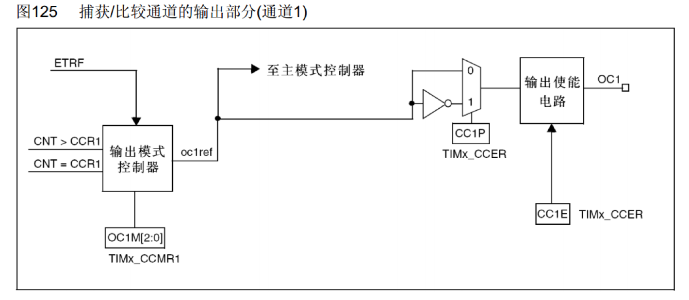

**输出比较通道(高级)**

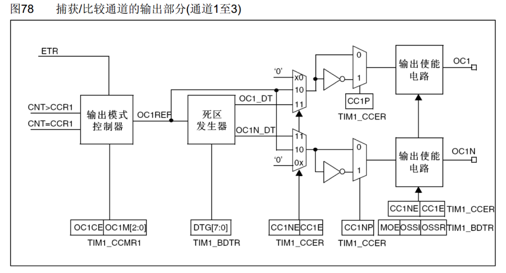

## 输出比较模式

|       模式       |                             描述                             |
| :--------------: | :----------------------------------------------------------: |
|       冻结       |                  CNT=CCR时，REF保持为原状态                  |
| 匹配时置有效电平 |                   CNT=CCR时，REF置有效电平                   |
| 匹配时置无效电平 |                   CNT=CCR时，REF置无效电平                   |
|  匹配时电平翻转  |                    CNT=CCR时，REF电平翻转                    |
|  强制为无效电平  |               CNT与CCR无效，REF强制为无效电平                |
|  强制为有效电平  |               CNT与CCR无效，REF强制为有效电平                |
|     PWM模式1     | 向上计数：CNT<CCR时，REF置有效电平，CNT≥CCR时，REF置无效电平  向下计数：CNT>CCR时，REF置无效电平，CNT≤CCR时，REF置有效电平 |
|     PWM模式2     | 向上计数：CNT<CCR时，REF置无效电平，CNT≥CCR时，REF置有效电平  向下计数：CNT>CCR时，REF置有效电平，CNT≤CCR时，REF置无效电平 |

注

1. 冻结模式维持暂停时刻的状态，保持不变
2. 匹配时电平翻转方便输出一个占空比为50%的PWM波形
3. 强制输出模式允许在暂停波形输出期间，保持低电平或高电平
4. PWM1和PWM2用来输出频率和占空比都可调的PWM波形，两者输出波形为取反关系

# PWM

## 简介

- PWM（Pulse Width Modulation），即脉冲宽度调制，数字输出信号
- 在具有惯性的系统中，可以通过对一系列脉冲的宽度进行调制，来等效地获得所需要的模拟参量，常应用于电机控速等领域
- PWM参数
  - 频率 = 1 / T~S~
  - 占空比 = T~ON~ / T~S~
  - 分辨率 = 占空比变化步距

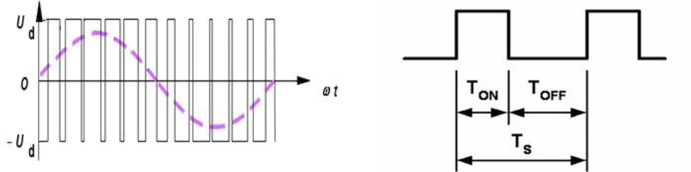

注

1. PWM的频率越快，等效模拟的信号就越平稳，但性能开销就越大，一般为几KHz到几十KHz
2. 占空比决定了PWM等效出来的模拟电压的大小，一般为线性关系
3. 分辨率为占空比变化的细粒程度

## 基本结构

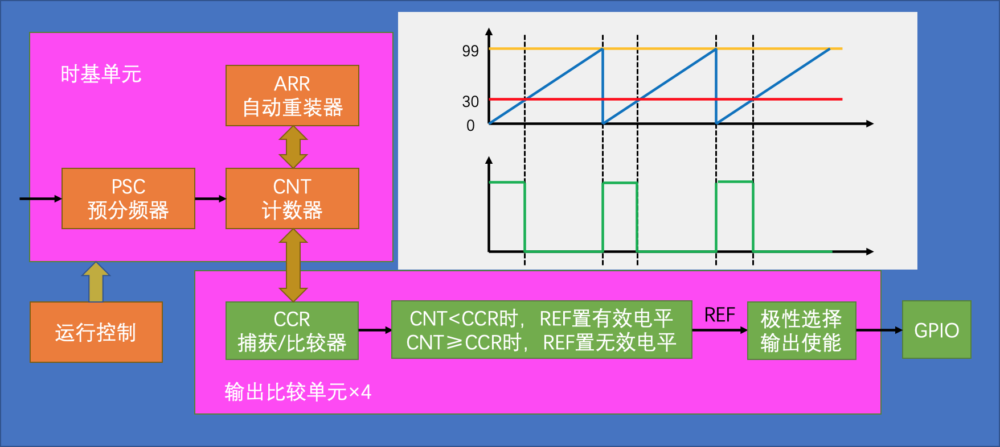

注

1. 通过比较CNT与CCR的值，来控制输出高低电平
2. 可以使用一个定时器，来输出多个不同的通道的PWM
2. 对同一个时钟而言，由于不同通道共用一个计数器，所以它们频率必须一样，而各自的占空比可以通过各自的CCR来设定

**参数计算**

- PWM频率： Freq = CK_PSC / (PSC + 1) / (ARR + 1)，即计数器的更新频率
- PWM占空比： Duty = CCR / (ARR + 1)
- PWM分辨率： Reso = 1 / (ARR + 1)，越小越好

## 实例

**LED呼吸灯**

```c
/* PWM.C */

#include "stm32f10x.h"                  												// Device header

/**
  * 函    数：PWM初始化
  * 参    数：无
  * 返 回 值：无
  */
void PWM_Init(void)
{
	/*开启时钟*/
	RCC_APB1PeriphClockCmd(RCC_APB1Periph_TIM2, ENABLE);				//开启TIM2的时钟
	RCC_APB2PeriphClockCmd(RCC_APB2Periph_GPIOA, ENABLE);				//开启GPIOA的时钟
	
	/*GPIO重映射*/
	// 当默认复用功能冲突时，可以将冲突的复用功能重映射到其他引脚（引脚定义表重定义功能）
	// 如果引脚定义表重定义功能中无法找到，则不能更改外设复用的GPIO
//	RCC_APB2PeriphClockCmd(RCC_APB2Periph_AFIO, ENABLE);			//开启AFIO的时钟，重映射必须先开启AFIO的时钟
//	GPIO_PinRemapConfig(GPIO_PartialRemap1_TIM2, ENABLE);			//将TIM2的引脚部分重映射，具体的映射方案需查看参考手册
//	GPIO_PinRemapConfig(GPIO_Remap_SWJ_JTAGDisable, ENABLE);	//将PA15的默认JTAG引脚失能，作为普通GPIO引脚使用
// 注意如果将调试端口全部失能，再此下载程序时只能通过串口方式
	
	/*GPIO初始化*/
	GPIO_InitTypeDef GPIO_InitStructure;
	GPIO_InitStructure.GPIO_Mode = GPIO_Mode_AF_PP;
	GPIO_InitStructure.GPIO_Pin = GPIO_Pin_0;										// 重定义引脚GPIO_Pin_15;
	GPIO_InitStructure.GPIO_Speed = GPIO_Speed_50MHz;
	GPIO_Init(GPIOA, &GPIO_InitStructure);											//将PA0引脚初始化为复用推挽输出	
	//受外设控制的引脚，均需要配置为复用模式，这里是受TIM2的CH1通道		
	
	/*配置时钟源*/
	TIM_InternalClockConfig(TIM2);															//选择TIM2为内部时钟，若不调用此函数，TIM默认也为内部时钟
	
	/*时基单元初始化*/
	TIM_TimeBaseInitTypeDef TIM_TimeBaseInitStructure;							//定义结构体变量
	TIM_TimeBaseInitStructure.TIM_ClockDivision = TIM_CKD_DIV1;     //时钟分频，选择不分频，此参数用于配置滤波器时钟，不影响时基单元功能
	TIM_TimeBaseInitStructure.TIM_CounterMode = TIM_CounterMode_Up; //计数器模式，选择向上计数
	TIM_TimeBaseInitStructure.TIM_Period = 100 - 1;									//计数周期，即ARR的值
	TIM_TimeBaseInitStructure.TIM_Prescaler = 720 - 1;							//预分频器，即PSC的值
	TIM_TimeBaseInitStructure.TIM_RepetitionCounter = 0;            //重复计数器，高级定时器才会用到
	TIM_TimeBaseInit(TIM2, &TIM_TimeBaseInitStructure);             //将结构体变量交给TIM_TimeBaseInit，配置TIM2的时基单元
	
	/*输出比较初始化*/
	TIM_OCInitTypeDef TIM_OCInitStructure;													//定义结构体变量
	TIM_OCStructInit(&TIM_OCInitStructure);													//结构体初始化，若结构体没有完整赋值
  //则最好执行此函数，给结构体所有成员都赋一个默认值
  //避免结构体初值不确定的问题
	TIM_OCInitStructure.TIM_OCMode = TIM_OCMode_PWM1;								//输出比较模式，选择PWM模式1
	TIM_OCInitStructure.TIM_OCPolarity = TIM_OCPolarity_High;				//输出极性，选择为高，若选择极性为低，则输出高低电平取反
	TIM_OCInitStructure.TIM_OutputState = TIM_OutputState_Enable;		//输出使能
	TIM_OCInitStructure.TIM_Pulse = 0;															//初始的CCR值 16位
	TIM_OC1Init(TIM2, &TIM_OCInitStructure);												//将结构体变量交给TIM_OC1Init，配置TIM2的输出比较通道1
	// TIM2的通道1引脚借用了PA0引脚（引脚定义表默认复用功能）
	
	/*TIM使能*/
	TIM_Cmd(TIM2, ENABLE);																					//使能TIM2，定时器开始运行
}

/**
  * 函    数：PWM设置通道1的CCR
  * 参    数：Compare 要写入的CCR的值，范围：0~100
  * 返 回 值：无
  * 注意事项：CCR和ARR共同决定占空比，此函数仅设置CCR的值，并不直接是占空比
  *           占空比Duty = CCR / (ARR + 1)
  */
void PWM_SetCompare1(uint16_t Compare)
{
	TIM_SetCompare1(TIM2, Compare);		//设置CCR1的值
}
```

```c
/* main.C */

#include "stm32f10x.h"              
#include "Delay.h"
#include "OLED.h"
#include "PWM.h"

uint8_t i;											//定义for循环的变量

int main(void)
{
	/*模块初始化*/
	OLED_Init();									//OLED初始化
	PWM_Init();										//PWM初始化
	
	while (1)
	{
		for (i = 0; i <= 100; i++)
		{
			PWM_SetCompare1(i);				//依次将定时器的CCR寄存器设置为0~100，PWM占空比逐渐增大，LED逐渐变亮
			Delay_ms(10);							//延时10ms
		}
		for (i = 0; i <= 100; i++)
		{
			PWM_SetCompare1(100 - i);	//依次将定时器的CCR寄存器设置为100~0，PWM占空比逐渐减小，LED逐渐变暗
			Delay_ms(10);							//延时10ms
		}
	}
}
```

# IC

## 简介

- IC（Input Capture）输入捕获
- 输入捕获模式下，当通道输入引脚出现指定电平跳变时，当前CNT的值写入到CCR中，可用于测量PWM波形的频率、占空比、脉冲间隔、电平持续时间等参数
- 每个高级定时器和通用定时器都拥有4个输入捕获通道
- 可配置为PWMI模式，同时测量频率和占空比
- 可配合主从触发模式，实现硬件全自动测量

注

1. 对同一个定时器而言，四个输入捕获和输出比较通道共用四个CCR寄存器，因此输入捕获和输出比较不能同时使用

**频率测量**

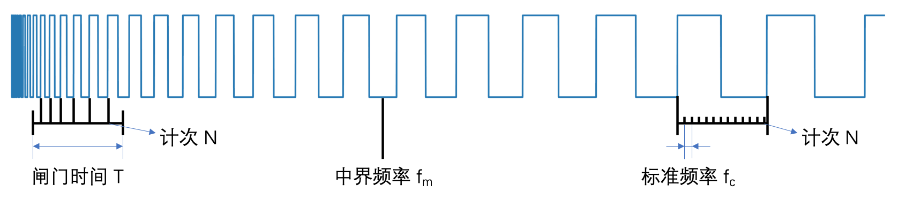

- 测频法：在闸门时间T内，对上升沿计次，得到N，则频率
$$
f_x = N / T
$$
- 测周法：两个上升沿内，以标准频率f\~c\~计次，得到N ，则频率
$$
f_x = f_c / N
$$
- 中界频率：测频法与测周法误差相等的频率点
$$
f_m = \sqrt{(f_c / T)}
$$

注

1. 测频法适合高频信号，更新慢，测量结果为一段时间的平均值
2. 测周法适合低频信号，更新快，受噪声波动更大

**输入捕获通道**

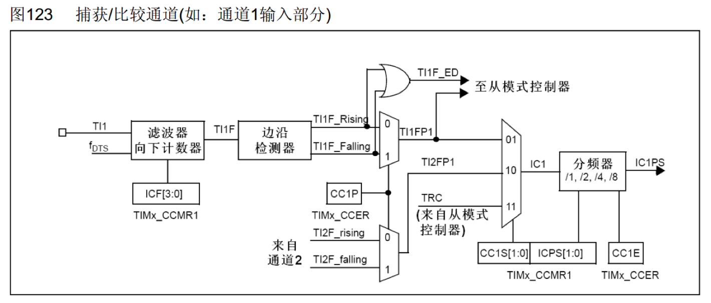

注

1. 可以进行交叉连接
2. 每次将CNT的值转运到CCR时，会发生一个捕获事件，可以产生中断
3. 利用测周法，每次信号跳变时通过CCR捕获CNT的值，相当于N，而F/~c/~就是CNT的驱动时钟
4. 每次捕获时需要将CNT清零，可以通过主从触发模式执行
5. 对于滤波器配置，只能连续N个值都为高电平，输出才是高电平，达到滤波效果。因此采样频率越低，采样个数N越大，滤波效果越好
6. 实际应用中，如果波形噪声较大，可设置IC1F为较大值，实现噪声过滤

**主从触发模式**

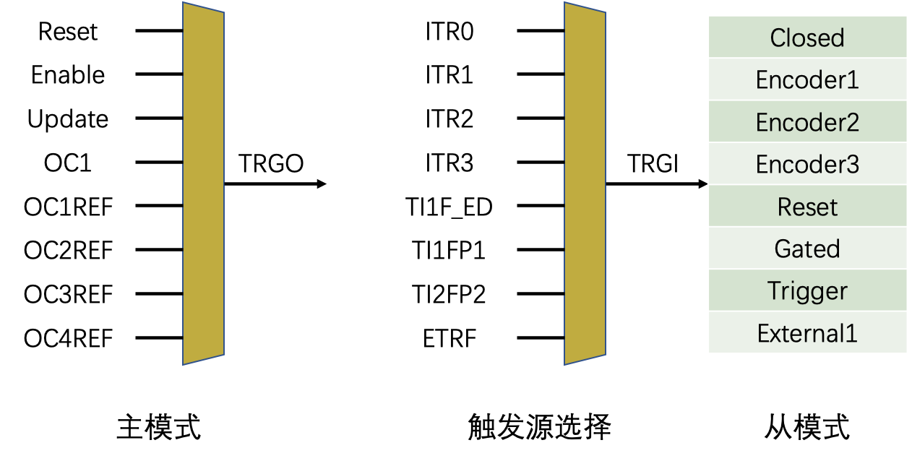

- 主模式：将定时器内部的信号映射到TRGO引脚，用于触发别的外设
- 从模式：接收其他信号来控制自身定时器的运行
- 触发源选择：选择从模式的触发源

例如可以通过TI1FP1信号自动触发从模式，来实现Reset，从模式自动清零CNT，实现硬件自动全测量。

## 结构

**输入捕获基本结构**

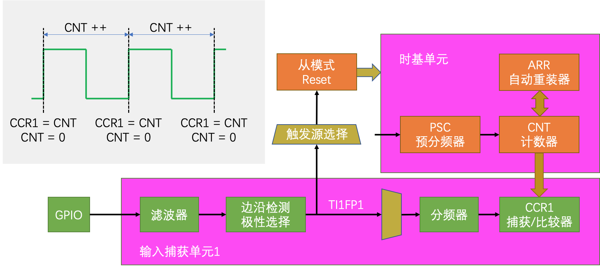

注

1. 整个电路自动测量，无需占用任何资源
2. 由于CNT为16位，若信号频率太低，CNT的值可能溢出
3. 若想使用从模式触发自动清零CNT，就只能使用通道1和通道2
4. 对于通道3和通道4，只能开启捕获中断，在中断中自动清零，但比较消耗资源
5. 只能测量频率

**PWMI基本结构**

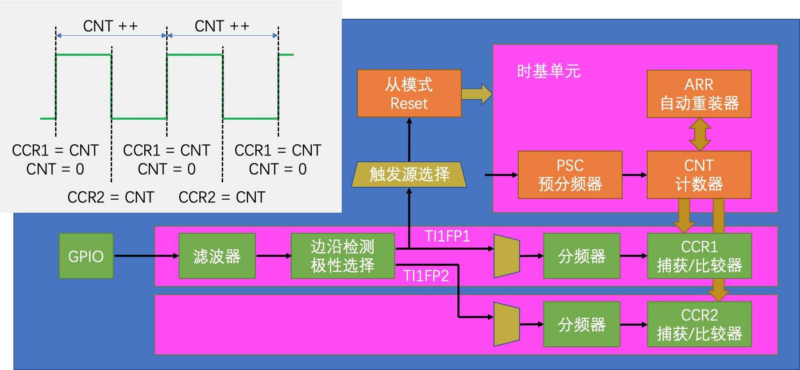

注

1. 可以把一个引脚的输入，同时映射到两个捕获单元
2. 可以同时测量频率和占空比，占空比即CCR2/CCR1
3. 既可以两个引脚来实现也可以一个引脚来实现

## 实例

**输入捕获测频率（测周法）**

```c
/* PWMC.*/

#include "stm32f10x.h"                  

/**
  * 函    数：PWM初始化
  * 参    数：无
  * 返 回 值：无
  */
void PWM_Init(void)
{
	/*开启时钟*/
	RCC_APB1PeriphClockCmd(RCC_APB1Periph_TIM2, ENABLE);						//开启TIM2的时钟
	RCC_APB2PeriphClockCmd(RCC_APB2Periph_GPIOA, ENABLE);						//开启GPIOA的时钟
	
	/*GPIO重映射*/
//	RCC_APB2PeriphClockCmd(RCC_APB2Periph_AFIO, ENABLE);					//开启AFIO的时钟，重映射必须先开启AFIO的时钟
//	GPIO_PinRemapConfig(GPIO_PartialRemap1_TIM2, ENABLE);					//将TIM2的引脚部分重映射，具体的映射方案需查看参考手册
//	GPIO_PinRemapConfig(GPIO_Remap_SWJ_JTAGDisable, ENABLE);			//将JTAG引脚失能，作为普通GPIO引脚使用
	
	/*GPIO初始化*/
	GPIO_InitTypeDef GPIO_InitStructure;
	GPIO_InitStructure.GPIO_Mode = GPIO_Mode_AF_PP;
	GPIO_InitStructure.GPIO_Pin = GPIO_Pin_0;		//GPIO_Pin_15;
	GPIO_InitStructure.GPIO_Speed = GPIO_Speed_50MHz;
	GPIO_Init(GPIOA, &GPIO_InitStructure);													//将PA0引脚初始化为复用推挽输出	
														
	
	/*配置时钟源*/
	TIM_InternalClockConfig(TIM2);	
	
	/*时基单元初始化*/
	TIM_TimeBaseInitTypeDef TIM_TimeBaseInitStructure;							//定义结构体变量
	TIM_TimeBaseInitStructure.TIM_ClockDivision = TIM_CKD_DIV1;     //时钟分频，选择不分频，此参数用于配置滤波器时钟，不影响时基单元功能
	TIM_TimeBaseInitStructure.TIM_CounterMode = TIM_CounterMode_Up; //计数器模式，选择向上计数
	TIM_TimeBaseInitStructure.TIM_Period = 100 - 1;									//计数周期，即ARR的值
	TIM_TimeBaseInitStructure.TIM_Prescaler = 720 - 1;							//预分频器，即PSC的值
	TIM_TimeBaseInitStructure.TIM_RepetitionCounter = 0;            //重复计数器，高级定时器才会用到
	TIM_TimeBaseInit(TIM2, &TIM_TimeBaseInitStructure);             //将结构体变量交给TIM_TimeBaseInit，配置TIM2的时基单元
	
	/*输出比较初始化*/
	TIM_OCInitTypeDef TIM_OCInitStructure;													//定义结构体变量
	TIM_OCStructInit(&TIM_OCInitStructure);													//结构体初始化，若结构体没有完整赋值
  //则最好执行此函数，给结构体所有成员都赋一个默认值
  //避免结构体初值不确定的问题
	TIM_OCInitStructure.TIM_OCMode = TIM_OCMode_PWM1;								//输出比较模式，选择PWM模式1
	TIM_OCInitStructure.TIM_OCPolarity = TIM_OCPolarity_High;				//输出极性，选择为高，若选择极性为低，则输出高低电平取反
	TIM_OCInitStructure.TIM_OutputState = TIM_OutputState_Enable;		//输出使能
	TIM_OCInitStructure.TIM_Pulse = 0;															//初始的CCR值
	TIM_OC1Init(TIM2, &TIM_OCInitStructure);												//将结构体变量交给TIM_OC1Init，配置TIM2的输出比较通道1
	
	/*TIM使能*/
	TIM_Cmd(TIM2, ENABLE);																					//使能TIM2，定时器开始运行
}

/**
  * 函    数：PWM设置CCR
  * 参    数：Compare 要写入的CCR的值，范围：0~100
  * 返 回 值：无
  * 注意事项：CCR和ARR共同决定占空比，此函数仅设置CCR的值，并不直接是占空比
  *           占空比Duty = CCR / (ARR + 1)
  */
void PWM_SetCompare1(uint16_t Compare)
{
	TIM_SetCompare1(TIM2, Compare);																			//设置CCR1的值
}

/**
  * 函    数：PWM设置PSC
  * 参    数：Prescaler 要写入的PSC的值，范围：0~65535
  * 返 回 值：无
  * 注意事项：PSC和ARR共同决定频率，此函数仅设置PSC的值，并不直接是频率
  *           频率Freq = CK_PSC / (PSC + 1) / (ARR + 1)
  */
void PWM_SetPrescaler(uint16_t Prescaler)
{
TIM_PrescalerConfig(TIM2, Prescaler, TIM_PSCReloadMode_Immediate);		//设置PSC的值
}
```

```c
/* IC.c */

#include "stm32f10x.h"                

/**
  * 函    数：输入捕获初始化
  * 参    数：无
  * 返 回 值：无
  */
void IC_Init(void)
{
	/*开启时钟*/
	RCC_APB1PeriphClockCmd(RCC_APB1Periph_TIM3, ENABLE);						//开启TIM3的时钟
	RCC_APB2PeriphClockCmd(RCC_APB2Periph_GPIOA, ENABLE);						//开启GPIOA的时钟
	
	/*GPIO初始化*/
	GPIO_InitTypeDef GPIO_InitStructure;
	GPIO_InitStructure.GPIO_Mode = GPIO_Mode_IPU;
	GPIO_InitStructure.GPIO_Pin = GPIO_Pin_6;
	GPIO_InitStructure.GPIO_Speed = GPIO_Speed_50MHz;
	GPIO_Init(GPIOA, &GPIO_InitStructure);													//将PA6引脚初始化为上拉输入
	
	/*配置时钟源*/
	TIM_InternalClockConfig(TIM3);																	//选择TIM3为内部时钟，若不调用此函数，TIM默认也为内部时钟
	
	/*时基单元初始化*/
	TIM_TimeBaseInitTypeDef TIM_TimeBaseInitStructure;							//定义结构体变量
	TIM_TimeBaseInitStructure.TIM_ClockDivision = TIM_CKD_DIV1;     //时钟分频，选择不分频，此参数用于配置滤波器时钟，不影响时基单元功能
	TIM_TimeBaseInitStructure.TIM_CounterMode = TIM_CounterMode_Up; //计数器模式，选择向上计数
	TIM_TimeBaseInitStructure.TIM_Period = 65536 - 1;               //计数周期，即ARR的值,防止溢出，所能测量最低频率为 1M/56635 = 15Hz
	// 频率上限为 1M / 允许误差的倒数
	TIM_TimeBaseInitStructure.TIM_Prescaler = 72 - 1;               //预分频器，即PSC的值
	TIM_TimeBaseInitStructure.TIM_RepetitionCounter = 0;            //重复计数器，高级定时器才会用到
	TIM_TimeBaseInit(TIM3, &TIM_TimeBaseInitStructure);             //将结构体变量交给TIM_TimeBaseInit，配置TIM3的时基单元
	
	/*输入捕获初始化*/
	TIM_ICInitTypeDef TIM_ICInitStructure;													//定义结构体变量
	TIM_ICInitStructure.TIM_Channel = TIM_Channel_1;								//选择配置定时器通道1
	TIM_ICInitStructure.TIM_ICFilter = 0xF;													//输入滤波器参数，可以过滤信号抖动
	TIM_ICInitStructure.TIM_ICPolarity = TIM_ICPolarity_Rising;			//极性，选择为上升沿触发捕获
	TIM_ICInitStructure.TIM_ICPrescaler = TIM_ICPSC_DIV1;						//捕获预分频，选择不分频，每次信号都触发捕获
	TIM_ICInitStructure.TIM_ICSelection = TIM_ICSelection_DirectTI;	//输入信号交叉，选择直通，不交叉
	TIM_ICInit(TIM3, &TIM_ICInitStructure);													//将结构体变量交给TIM_ICInit，配置TIM3的输入捕获通道
	
	/*选择触发源及从模式*/
	TIM_SelectInputTrigger(TIM3, TIM_TS_TI1FP1);										//触发源选择TI1FP1
	TIM_SelectSlaveMode(TIM3, TIM_SlaveMode_Reset);									//从模式选择复位
	//即TI1产生上升沿时，会触发CNT归零

	/*TIM使能*/
	TIM_Cmd(TIM3, ENABLE);																					//使能TIM3，定时器开始运行
}

/**
  * 函    数：获取输入捕获的频率
  * 参    数：无
  * 返 回 值：捕获得到的频率
  */
uint32_t IC_GetFreq(void)
{
	return 1000000 / (TIM_GetCapture1(TIM3) + 1);										// 测周法得到频率fx = fc / N，这里不执行+1的操作也可
}
```

```c
/* main.c */

#include "stm32f10x.h"                  
#include "Delay.h"
#include "OLED.h"
#include "PWM.h"
#include "IC.h"

int main(void)
{
	/*模块初始化*/
	OLED_Init();															//OLED初始化
	PWM_Init();																//PWM初始化
	IC_Init();																//输入捕获初始化
	
	/*显示静态字符串*/
	OLED_ShowString(1, 1, "Freq:00000Hz");		//1行1列显示字符串Freq:00000Hz
	
	/*使用PWM模块提供输入捕获的测试信号*/
	PWM_SetPrescaler(720 - 1);								//PWM频率Freq = 72M / (PSC + 1) / 100
	PWM_SetCompare1(50);											//PWM占空比Duty = CCR / 100
	
	while (1)
	{
		OLED_ShowNum(1, 6, IC_GetFreq(), 5);		//不断刷新显示输入捕获测得的频率
	}
}
```

** PWMI测频率与占空比**

```c
/* PWM.c */
// 同上
```

```c
/* IC.c */

#include "stm32f10x.h"                 

/**
  * 函    数：输入捕获初始化
  * 参    数：无
  * 返 回 值：无
  */
void IC_Init(void)
{
	/*开启时钟*/
	RCC_APB1PeriphClockCmd(RCC_APB1Periph_TIM3, ENABLE);						//开启TIM3的时钟
	RCC_APB2PeriphClockCmd(RCC_APB2Periph_GPIOA, ENABLE);						//开启GPIOA的时钟
	
	/*GPIO初始化*/
	GPIO_InitTypeDef GPIO_InitStructure;
	GPIO_InitStructure.GPIO_Mode = GPIO_Mode_IPU;
	GPIO_InitStructure.GPIO_Pin = GPIO_Pin_6;
	GPIO_InitStructure.GPIO_Speed = GPIO_Speed_50MHz;
	GPIO_Init(GPIOA, &GPIO_InitStructure);													//将PA6引脚初始化为上拉输入
	
	/*配置时钟源*/
	TIM_InternalClockConfig(TIM3);																	//选择TIM3为内部时钟，若不调用此函数，TIM默认也为内部时钟
	
	/*时基单元初始化*/
	TIM_TimeBaseInitTypeDef TIM_TimeBaseInitStructure;							//定义结构体变量
	TIM_TimeBaseInitStructure.TIM_ClockDivision = TIM_CKD_DIV1;     //时钟分频，选择不分频，此参数用于配置滤波器时钟，不影响时基单元功能
	TIM_TimeBaseInitStructure.TIM_CounterMode = TIM_CounterMode_Up; //计数器模式，选择向上计数
	TIM_TimeBaseInitStructure.TIM_Period = 65536 - 1;               //计数周期，即ARR的值
	TIM_TimeBaseInitStructure.TIM_Prescaler = 72 - 1;               //预分频器，即PSC的值
	TIM_TimeBaseInitStructure.TIM_RepetitionCounter = 0;            //重复计数器，高级定时器才会用到
	TIM_TimeBaseInit(TIM3, &TIM_TimeBaseInitStructure);             //将结构体变量交给TIM_TimeBaseInit，配置TIM3的时基单元
	
	/*PWMI模式初始化*/
	TIM_ICInitTypeDef TIM_ICInitStructure;													//定义结构体变量
	TIM_ICInitStructure.TIM_Channel = TIM_Channel_1;								//选择配置定时器通道1
	TIM_ICInitStructure.TIM_ICFilter = 0xF;													//输入滤波器参数，可以过滤信号抖动
	TIM_ICInitStructure.TIM_ICPolarity = TIM_ICPolarity_Rising;			//极性，选择为上升沿触发捕获
	TIM_ICInitStructure.TIM_ICPrescaler = TIM_ICPSC_DIV1;						//捕获预分频，选择不分频，每次信号都触发捕获
	TIM_ICInitStructure.TIM_ICSelection = TIM_ICSelection_DirectTI;	//输入信号交叉，选择直通，不交叉
	TIM_PWMIConfig(TIM3, &TIM_ICInitStructure);											//将结构体变量交给TIM_PWMIConfig，配置TIM3的输入捕获通道
	//此函数同时会把另一个通道配置为相反的配置，实现PWMI模式

	/*选择触发源及从模式*/
	TIM_SelectInputTrigger(TIM3, TIM_TS_TI1FP1);										//触发源选择TI1FP1
	TIM_SelectSlaveMode(TIM3, TIM_SlaveMode_Reset);									//从模式选择复位
  //即TI1产生上升沿时，会触发CNT归零
	
	/*TIM使能*/
	TIM_Cmd(TIM3, ENABLE);																					//使能TIM3，定时器开始运行
}

/**
  * 函    数：获取输入捕获的频率
  * 参    数：无
  * 返 回 值：捕获得到的频率
  */
uint32_t IC_GetFreq(void)
{
	return 1000000 / (TIM_GetCapture1(TIM3) + 1);										//测周法得到频率fx = fc / N，这里不执行+1的操作也可
}

/**
  * 函    数：获取输入捕获的占空比
  * 参    数：无
  * 返 回 值：捕获得到的占空比
  */
uint32_t IC_GetDuty(void)
{
	return (TIM_GetCapture2(TIM3) + 1) * 100 / (TIM_GetCapture1(TIM3) + 1);	//占空比Duty = CCR2 / CCR1 * 100，这里不执行+1的操作也可
}
```

```c
/* main.c */

#include "stm32f10x.h"                  
#include "Delay.h"
#include "OLED.h"
#include "PWM.h"
#include "IC.h"

int main(void)
{
	/*模块初始化*/
	OLED_Init();			
	PWM_Init();			
	IC_Init();			
	
	/*显示静态字符串*/
	OLED_ShowString(1, 1, "Freq:00000Hz");		
	OLED_ShowString(2, 1, "Duty:00%");			
	
	/*使用PWM模块提供输入捕获的测试信号*/
	PWM_SetPrescaler(720 - 1);									//PWM频率Freq = 72M / (PSC + 1) / 100
	PWM_SetCompare1(50);												//PWM占空比Duty = CCR / 100
	
	while (1)
	{
		OLED_ShowNum(1, 6, IC_GetFreq(), 5);			//不断刷新显示输入捕获测得的频率
		OLED_ShowNum(2, 6, IC_GetDuty(), 2);			//不断刷新显示输入捕获测得的占空比
	}
}
```

# 编码器接口

## 简介

- Encoder Interface 编码器接口
- 编码器接口可接收增量（正交）编码器的信号，根据编码器旋转产生的正交信号脉冲，自动控制CNT自增或自减，从而指示编码器的位置、旋转方向和旋转速度
- 每个高级定时器和通用定时器都拥有1个编码器接口
- 两个输入引脚借用了输入捕获的通道1和通道2，3、4无法接编码器

注

1. 当中断函数（仅进行加减操作）频繁触发时，可以使用编码器接口来减缓CPU资源，此时计数器受编码器控制
2. 编码器接口相当于一个带方向控制的时钟，同时控制着CNT的计数时钟和计数方向
3. 不仅能自增计次，还能自减计次
4. 编码器测速实际就是测频法测正交脉冲的频率

**正交编码器**

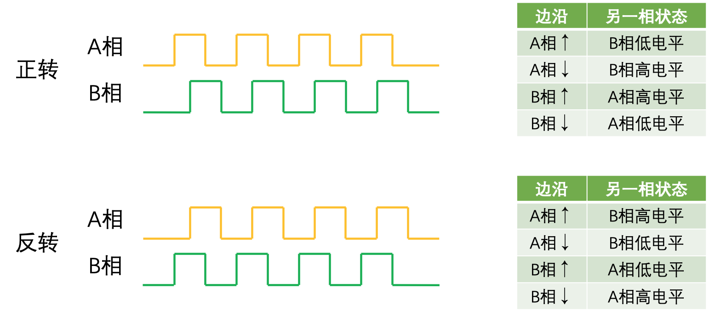

注

1. 任意一相的信号的频率可以计算速度，但无法单独用来计算方向，还需另一相信号辅助
2. 计数的方向由另一相的高低电平来判断
3. 正交信号精度更高、抗噪更好

**工作模式**

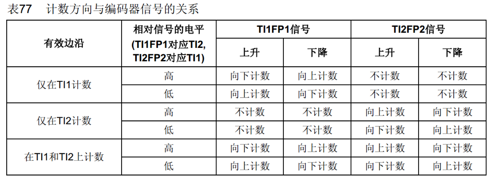

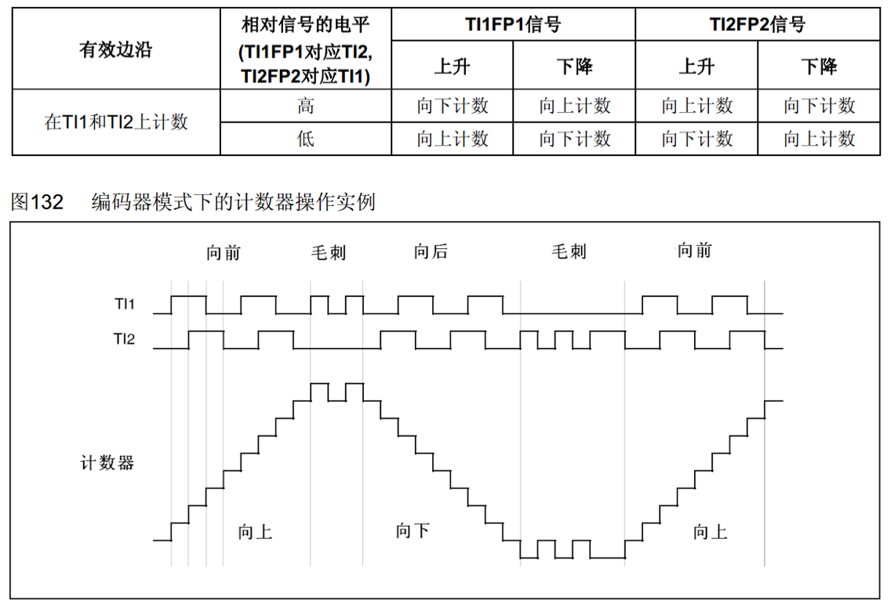

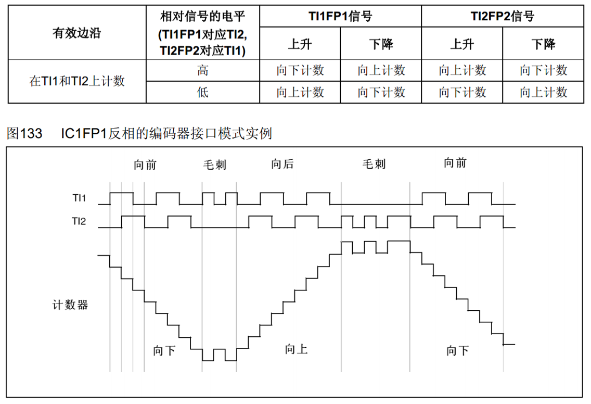

注

1. TIM1和TIM2同时计数时频率更高，精度更高
2. 正转的状态都向上计数，反转的状态都向下计数 
3. 过滤噪声（毛刺）

## 结构

**编码器接口基本结构**

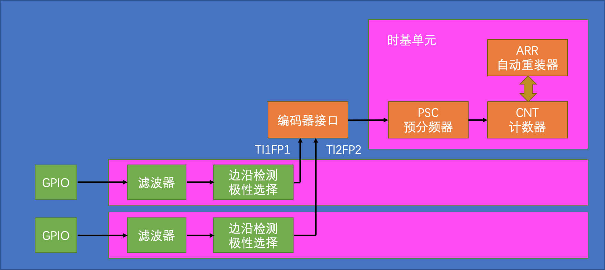

注

1. 通过极性选择，可以把任意一引脚反相，从而实现反转计数方向

## 实例

**编码器接口测速**

```c
/* Encoder*/

#include "stm32f10x.h"          

/**
  * 函    数：编码器初始化
  * 参    数：无
  * 返 回 值：无
  */
void Encoder_Init(void)
{
	/*开启时钟*/
	RCC_APB1PeriphClockCmd(RCC_APB1Periph_TIM3, ENABLE);						//开启TIM3的时钟
	RCC_APB2PeriphClockCmd(RCC_APB2Periph_GPIOA, ENABLE);						//开启GPIOA的时钟
	
	/*GPIO初始化*/
	GPIO_InitTypeDef GPIO_InitStructure;
	GPIO_InitStructure.GPIO_Mode = GPIO_Mode_IPU;
	GPIO_InitStructure.GPIO_Pin = GPIO_Pin_6 | GPIO_Pin_7;
	GPIO_InitStructure.GPIO_Speed = GPIO_Speed_50MHz;
	GPIO_Init(GPIOA, &GPIO_InitStructure);													//将PA6和PA7引脚初始化为上拉输入
	
	/*时基单元初始化*/
	TIM_TimeBaseInitTypeDef TIM_TimeBaseInitStructure;							//定义结构体变量
	TIM_TimeBaseInitStructure.TIM_ClockDivision = TIM_CKD_DIV1;     //时钟分频，选择不分频，此参数用于配置滤波器时钟，不影响时基单元功能
	TIM_TimeBaseInitStructure.TIM_CounterMode = TIM_CounterMode_Up; //计数器模式，选择向上计数
	TIM_TimeBaseInitStructure.TIM_Period = 65536 - 1;               //计数周期，即ARR的值
	TIM_TimeBaseInitStructure.TIM_Prescaler = 1 - 1;                //预分频器，即PSC的值，一般不分频
	TIM_TimeBaseInitStructure.TIM_RepetitionCounter = 0;            //重复计数器，高级定时器才会用到
	TIM_TimeBaseInit(TIM3, &TIM_TimeBaseInitStructure);             //将结构体变量交给TIM_TimeBaseInit，配置TIM3的时基单元
	
	/*输入捕获初始化*/
	TIM_ICInitTypeDef TIM_ICInitStructure;													//定义结构体变量
	TIM_ICStructInit(&TIM_ICInitStructure);													//结构体初始化，若结构体没有完整赋值
  //则最好执行此函数，给结构体所有成员都赋一个默认值
  //避免结构体初值不确定的问题
	TIM_ICInitStructure.TIM_Channel = TIM_Channel_1;								//选择配置定时器通道1
	TIM_ICInitStructure.TIM_ICFilter = 0xF;													//输入滤波器参数，可以过滤信号抖动
	TIM_ICInit(TIM3, &TIM_ICInitStructure);													//将结构体变量交给TIM_ICInit，配置TIM3的输入捕获通道
	TIM_ICInitStructure.TIM_Channel = TIM_Channel_2;								//选择配置定时器通道2
	TIM_ICInitStructure.TIM_ICFilter = 0xF;													//输入滤波器参数，可以过滤信号抖动
	TIM_ICInit(TIM3, &TIM_ICInitStructure);													//将结构体变量交给TIM_ICInit，配置TIM3的输入捕获通道
	
	/*编码器接口配置*/
	TIM_EncoderInterfaceConfig(TIM3, TIM_EncoderMode_TI12, TIM_ICPolarity_Rising, TIM_ICPolarity_Rising);
  //配置编码器模式以及两个输入通道是否反相
  //注意此时参数的Rising和Falling已经不代表上升沿和下降沿了，而是代表是否反相
  //如果要实现极性反转只需改变一个即可
  //此函数必须在输入捕获初始化之后进行，否则输入捕获的配置会覆盖此函数的部分配置
	
	/*TIM使能*/
	TIM_Cmd(TIM3, ENABLE);			//使能TIM3，定时器开始运行
}

/**
  * 函    数：获取编码器的增量值
  * 参    数：无
  * 返 回 值：自上此调用此函数后，编码器的增量值
  */
int16_t Encoder_Get(void)
{
	/*使用Temp变量作为中继，目的是返回CNT后将其清零*/
	int16_t Temp;
	Temp = TIM_GetCounter(TIM3);
	TIM_SetCounter(TIM3, 0);
	return Temp;
}

```

```c
/* Timer.c */

#include "stm32f10x.h"               

/**
  * 函    数：定时中断初始化
  * 参    数：无
  * 返 回 值：无
  */
void Timer_Init(void)
{
	/*开启时钟*/
	RCC_APB1PeriphClockCmd(RCC_APB1Periph_TIM2, ENABLE);							//开启TIM2的时钟
	
	/*配置时钟源*/
	TIM_InternalClockConfig(TIM2);	
	
	/*时基单元初始化*/
	TIM_TimeBaseInitTypeDef TIM_TimeBaseInitStructure;			
	TIM_TimeBaseInitStructure.TIM_ClockDivision = TIM_CKD_DIV1;				//时钟分频，选择不分频，此参数用于配置滤波器时钟，不影响时基单元功能
	TIM_TimeBaseInitStructure.TIM_CounterMode = TIM_CounterMode_Up;		//计数器模式，选择向上计数
	TIM_TimeBaseInitStructure.TIM_Period = 10000 - 1;									//计数周期，即ARR的值
	TIM_TimeBaseInitStructure.TIM_Prescaler = 7200 - 1;								//预分频器，即PSC的值
	TIM_TimeBaseInitStructure.TIM_RepetitionCounter = 0;							//重复计数器，高级定时器才会用到
	TIM_TimeBaseInit(TIM2, &TIM_TimeBaseInitStructure);								//将结构体变量交给TIM_TimeBaseInit，配置TIM2的时基单元	
	
	/*中断输出配置*/
	TIM_ClearFlag(TIM2, TIM_FLAG_Update);															//清除定时器更新标志位

	TIM_ITConfig(TIM2, TIM_IT_Update, ENABLE);												//开启TIM2的更新中断
	
	/*NVIC中断分组*/
	NVIC_PriorityGroupConfig(NVIC_PriorityGroup_2);										//配置NVIC为分组2
  //即抢占优先级范围：0~3，响应优先级范围：0~3
  //此分组配置在整个工程中仅需调用一次
  //若有多个中断，可以把此代码放在main函数内，while循环之前
  //若调用多次配置分组的代码，则后执行的配置会覆盖先执行的配置
	
	/*NVIC配置*/
	NVIC_InitTypeDef NVIC_InitStructure;															//定义结构体变量
	NVIC_InitStructure.NVIC_IRQChannel = TIM2_IRQn;										//选择配置NVIC的TIM2线
	NVIC_InitStructure.NVIC_IRQChannelCmd = ENABLE;										//指定NVIC线路使能
	NVIC_InitStructure.NVIC_IRQChannelPreemptionPriority = 2;					//指定NVIC线路的抢占优先级为2
	NVIC_InitStructure.NVIC_IRQChannelSubPriority = 1;								//指定NVIC线路的响应优先级为1
	NVIC_Init(&NVIC_InitStructure);								
	
	/*TIM使能*/
	TIM_Cmd(TIM2, ENABLE);																						//使能TIM2，定时器开始运行
}
```

```c
/* main.c */

#include "stm32f10x.h"                  
#include "Delay.h"
#include "OLED.h"
#include "Timer.h"
#include "Encoder.h"

int16_t Speed;													//定义速度变量

int main(void)
{
	/*模块初始化*/
	OLED_Init();													//OLED初始化
	Timer_Init();													//定时器初始化
	Encoder_Init();												//编码器初始化
	
	/*显示静态字符串*/
	OLED_ShowString(1, 1, "Speed:");			//1行1列显示字符串Speed:
	
	while (1)
	{
		OLED_ShowSignedNum(1, 7, Speed, 5);	//不断刷新显示编码器测得的最新速度
	}
}

/**
  * 函    数：TIM2中断函数
  * 参    数：无
  * 返 回 值：无
  * 注意事项：此函数为中断函数，无需调用，中断触发后自动执行
  *           函数名为预留的指定名称，可以从启动文件复制
  *           请确保函数名正确，不能有任何差异，否则中断函数将不能进入
  */
void TIM2_IRQHandler(void)
{
	if (TIM_GetITStatus(TIM2, TIM_IT_Update) == SET)		//判断是否是TIM2的更新事件触发的中断
	{
		Speed = Encoder_Get();														//每隔固定时间段读取一次编码器计数增量值，即为速度值
		TIM_ClearITPendingBit(TIM2, TIM_IT_Update);				//清除TIM2更新事件的中断标志位
    //中断标志位必须清除
    //否则中断将连续不断地触发，导致主程序卡死
	}
}
```

# ADC

## 简介 

- ADC（Analog-Digital Converter）模拟-数字转换器
- ADC可以将引脚上连续变化的模拟电压转换为内存中存储的数字变量，建立模拟电路到数字电路的桥梁
- 12位逐次逼近型ADC，1us转换时间（1MHz）
	- 分辨率：多少位来表示，位数越高，量化结果越精细，对应分辨率就越高
	- 转换时间：AD转化产生结果所需时间
- 输入电压范围：0\~3.3V，转换结果范围：0\~4095
- 18个输入通道，可测量16个外部和2个内部信号源
- 规则组和注入组两个转换单元
- 模拟看门狗自动监测输入电压范围

注

1. DAC，即数字模拟转换器，可以将数字量转为模拟电压，主要用于波形生成等领域
2. PWM也可以实现数字量到模拟量，针对于大功率应用场景，使用PWM更有效
3. 如果AD值在判断阈值附近来回跳变，可以使用迟滞比较的方法，即高于上阈值开启，低于下阈值关闭
4. 如果AD跳变大，也可以采用滤波的方式来使其变平滑，如取平均值

**逐次逼近型ADC**

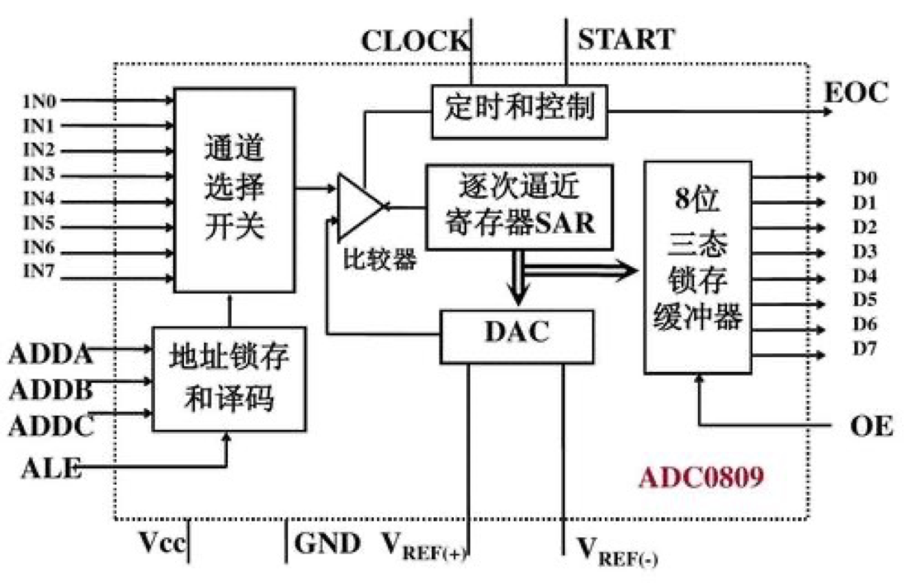

注

1. 未知编码的电压与已知DAC编码的电压进行大小比较，逐步调整
2. 常使用二分法进行比较，即对二进制从高位到低位依次判断是1还是0，对8位ADC需判断8次，对12位ADC需判断12次

**输入通道**

|  通道  |     ADC1     | ADC2 | ADC3 |
| :----: | :----------: | :--: | :--: |
| 通道0  |     PA0      | PA0  | PA0  |
| 通道1  |     PA1      | PA1  | PA1  |
| 通道2  |     PA2      | PA2  | PA2  |
| 通道3  |     PA3      | PA3  | PA3  |
| 通道4  |     PA4      | PA4  | PF6  |
| 通道5  |     PA5      | PA5  | PF7  |
| 通道6  |     PA6      | PA6  | PF8  |
| 通道7  |     PA7      | PA7  | PF9  |
| 通道8  |     PB0      | PB0  | PF10 |
| 通道9  |     PB1      | PB1  |      |
| 通道10 |     PC0      | PC0  | PC0  |
| 通道11 |     PC1      | PC1  | PC1  |
| 通道12 |     PC2      | PC2  | PC2  |
| 通道13 |     PC3      | PC3  | PC3  |
| 通道14 |     PC4      | PC4  |      |
| 通道15 |     PC5      | PC5  |      |
| 通道16 |  温度传感器  |      |      |
| 通道17 | 内部参考电压 |      |      |

注

1. 双ADC可以配置交叉模式等，提高通道采样率

**触发控制**

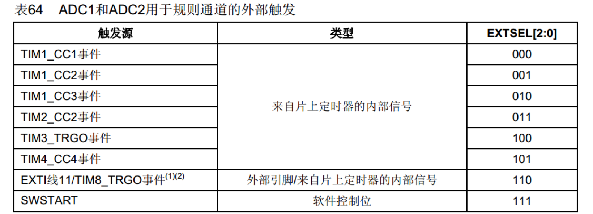

**数据对齐**

- 数据右对齐

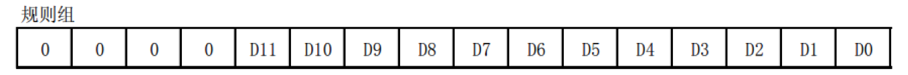

- 数据左对齐

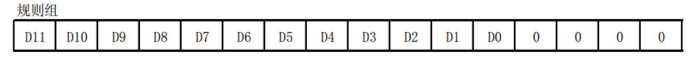

注

1. AD为12位，数据寄存器为16位，所以需进行对齐操作
2. 一般使用右对齐，可直接读取结果

**转换时间**

- AD转换的步骤：采样，保持，量化，编码
- STM32 ADC的总转换时间为

$$
T_{CONV}= 采样时间 + 12.5个ADC周期（量化编码所花费的时间）
$$

例如：当ADCCLK=14MHz，采样时间为1.5个ADC周期，T~CONV~ = 1.5 + 12.5 = 14个ADC周期 = 1μs

注

1. 采样时间越大，越能避免一些毛刺信号的干扰，但相应的转换时间延长

**校准**

- ADC有一个内置自校准模式。校准可大幅减小因内部电容器组的变化而造成的准精度误差。校准期间，在每个电容器上都会计算出一个误差修正码(数字值)，这个码用于消除在随后的转换中每个电容器上产生的误差
- 建议在每次上电后执行一次校准
- 启动校准前， ADC必须处于关电状态超过至少两个ADC时钟周期

## 结构

**框图**

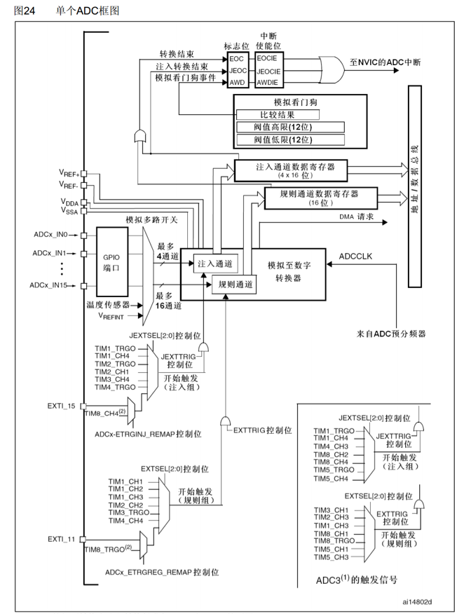

注

1. 可以同时选中多个通道，并且分成了两个组
	- 规则组：一次性最多选中16个通道 ，但只有一个数据寄存器，容易被覆盖
	- 注入组：一次性最多可选中4个通道，并且有四个数据寄存器，无需担心数据覆盖问题
2. 触发方式
	- 软件触发：调用函数
	- 硬件触发：如定时器、外部中断引脚等
3. 对于ADC预分频器，为防止超最大频率限制，只能选择6分频和8分频
4. 模拟看门狗对检测值超出阈值时可以产生中断

**基本结构**

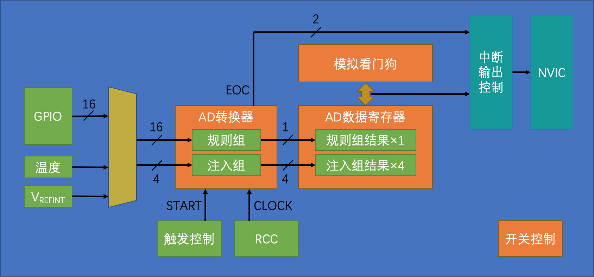

## 转换模式

**单次转换，非扫描模式**

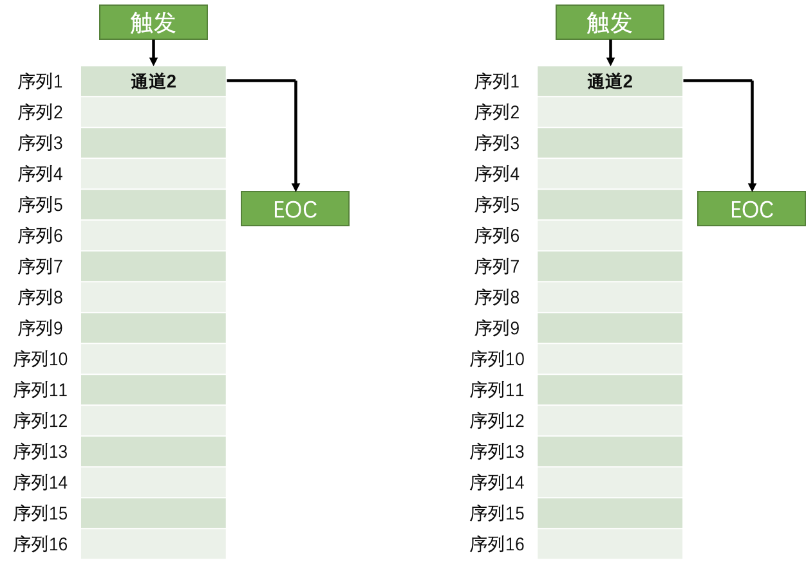

注

1. 每触发一次，转换结束后，就会停下来，下次转换还需再触发

**连续转换，非扫描模式**

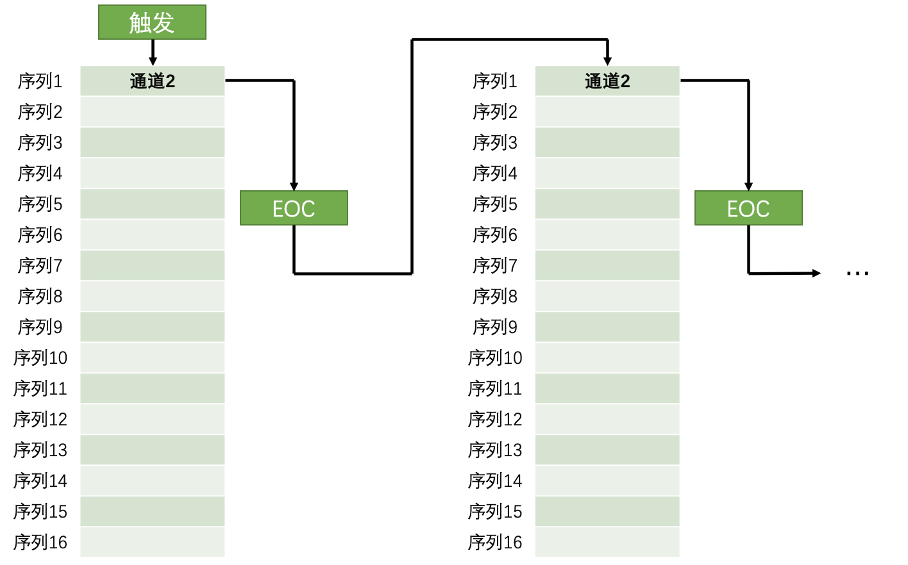

注

1. 一次转换结束后不会停止，而是立刻开始下一轮的转换，因此只需触发一次

**单次转换，扫描模式**

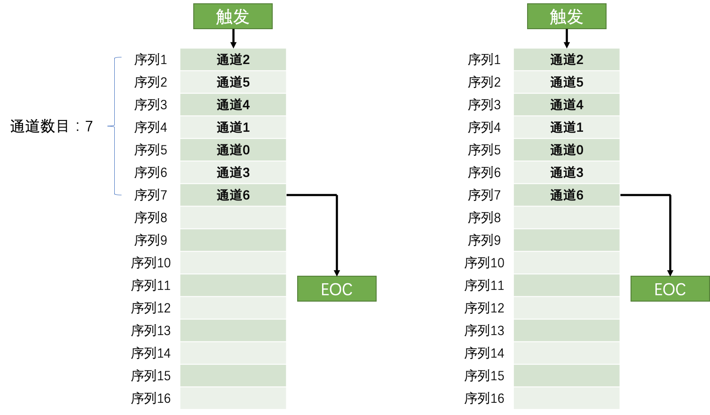

注

1. 通道可以任意指定，可重复
2. 依次对序列中通道进行转换，转换结束后均存在寄存器中，需防止数据被覆盖
3. 只有整个列表都转换完成才会产生中断

**连续转换，扫描模式**

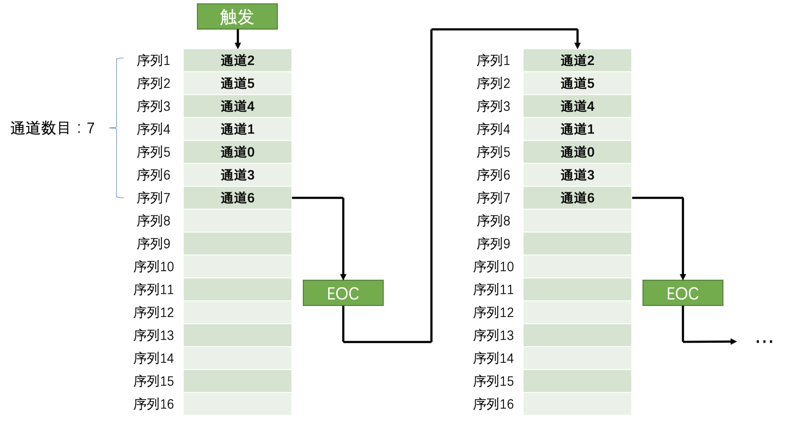

注

1. 还有一种为间隔模式，不按顺序去序列，而是间隔地取

## 实例

### AD单通道

```c
/* AD.c */

#include "stm32f10x.h"               

/**
  * 函    数：AD初始化
  * 参    数：无
  * 返 回 值：无
  */
void AD_Init(void)
{
	/*开启时钟*/
	RCC_APB2PeriphClockCmd(RCC_APB2Periph_ADC1, ENABLE);			//开启ADC1的时钟
	RCC_APB2PeriphClockCmd(RCC_APB2Periph_GPIOA, ENABLE);			//开启GPIOA的时钟
	
	/*设置ADC时钟*/
	RCC_ADCCLKConfig(RCC_PCLK2_Div6);													//选择时钟6分频，ADCCLK = 72MHz / 6 = 12MHz
	
	/*GPIO初始化*/
	GPIO_InitTypeDef GPIO_InitStructure;
	GPIO_InitStructure.GPIO_Mode = GPIO_Mode_AIN;
	GPIO_InitStructure.GPIO_Pin = GPIO_Pin_0;
	GPIO_InitStructure.GPIO_Speed = GPIO_Speed_50MHz;
	GPIO_Init(GPIOA, &GPIO_InitStructure);										//将PA0引脚初始化为模拟输入
	
	/*规则组通道配置*/
	ADC_RegularChannelConfig(ADC1, ADC_Channel_0, 1, ADC_SampleTime_55Cycles5);		//规则组序列1的位置，配置为通道0 规则组范围：1~16
	
	/*ADC初始化*/
	ADC_InitTypeDef ADC_InitStructure;											//定义结构体变量
	ADC_InitStructure.ADC_Mode = ADC_Mode_Independent;			//模式，选择独立模式，即单独使用ADC1
	ADC_InitStructure.ADC_DataAlign = ADC_DataAlign_Right;	//数据对齐，选择右对齐
	ADC_InitStructure.ADC_ExternalTrigConv = ADC_ExternalTrigConv_None;	//外部触发，使用软件触发，不需要外部触发
	ADC_InitStructure.ADC_ContinuousConvMode = DISABLE;			//连续转换，失能，每转换一次规则组序列后停止
	ADC_InitStructure.ADC_ScanConvMode = DISABLE;						//扫描模式，失能，只转换规则组的序列1这一个位置
	ADC_InitStructure.ADC_NbrOfChannel = 1;									//通道数，为1，仅在扫描模式下，才需要指定大于1的数，在非扫描模式下，只能是1
	ADC_Init(ADC1, &ADC_InitStructure);											//将结构体变量交给ADC_Init，配置ADC1
	
	/*ADC使能*/
	ADC_Cmd(ADC1, ENABLE);																	//使能ADC1，ADC开始运行
	
	/*ADC校准*/
	ADC_ResetCalibration(ADC1);															//固定流程，内部有电路会自动执行校准
	while (ADC_GetResetCalibrationStatus(ADC1) == SET);
	ADC_StartCalibration(ADC1);
	while (ADC_GetCalibrationStatus(ADC1) == SET);
}

/**
  * 函    数：获取AD转换的值
  * 参    数：无
  * 返 回 值：AD转换的值，范围：0~4095
  */
uint16_t AD_GetValue(void)
{
	ADC_SoftwareStartConvCmd(ADC1, ENABLE);										//软件触发AD转换一次
	while (ADC_GetFlagStatus(ADC1, ADC_FLAG_EOC) == RESET);		//等待EOC标志位，即等待AD转换结束
	return ADC_GetConversionValue(ADC1);											//读数据寄存器，得到AD转换的结果,读取后寄存器值自动清除EOC标志位
} 
```

```c
/* main.c */

#include "stm32f10x.h"              
#include "Delay.h"
#include "OLED.h"
#include "AD.h"

uint16_t ADValue;			//定义AD值变量
float Voltage;				//定义电压变量

int main(void)
{
	/*模块初始化*/
	OLED_Init();				//OLED初始化
	AD_Init();					//AD初始化
	
	/*显示静态字符串*/
	OLED_ShowString(1, 1, "ADValue:");
	OLED_ShowString(2, 1, "Voltage:0.00V");
	
	while (1)
	{
		ADValue = AD_GetValue();																	//获取AD转换的值
		Voltage = (float)ADValue / 4095 * 3.3;										//将AD值线性变换到0~3.3的范围，表示电压
		
		OLED_ShowNum(1, 9, ADValue, 4);														//显示AD值
		OLED_ShowNum(2, 9, Voltage, 1);														//显示电压值的整数部分
		OLED_ShowNum(2, 11, (uint16_t)(Voltage * 100) % 100, 2);	//显示电压值的小数部分
		
		Delay_ms(100);																						//延时100ms，手动增加一些转换的间隔时间
	}
}
```

### AD多通道

```c
/* AD.c */

#include "stm32f10x.h"                

/**
  * 函    数：AD初始化
  * 参    数：无
  * 返 回 值：无
  */
void AD_Init(void)
{
	/*开启时钟*/
	RCC_APB2PeriphClockCmd(RCC_APB2Periph_ADC1, ENABLE);		//开启ADC1的时钟
	RCC_APB2PeriphClockCmd(RCC_APB2Periph_GPIOA, ENABLE);		//开启GPIOA的时钟
	
	/*设置ADC时钟*/
	RCC_ADCCLKConfig(RCC_PCLK2_Div6);												//选择时钟6分频，ADCCLK = 72MHz / 6 = 12MHz
	
	/*GPIO初始化*/
	GPIO_InitTypeDef GPIO_InitStructure;
	GPIO_InitStructure.GPIO_Mode = GPIO_Mode_AIN;
	GPIO_InitStructure.GPIO_Pin = GPIO_Pin_0 | GPIO_Pin_1 | GPIO_Pin_2 | GPIO_Pin_3;
	GPIO_InitStructure.GPIO_Speed = GPIO_Speed_50MHz;
	GPIO_Init(GPIOA, &GPIO_InitStructure);									//将PA0、PA1、PA2和PA3引脚初始化为模拟输入
	
	/*不在此处配置规则组序列，而是在每次AD转换前配置，这样可以灵活更改AD转换的通道*/
	
	/*ADC初始化*/
	ADC_InitTypeDef ADC_InitStructure;												//定义结构体变量
	ADC_InitStructure.ADC_Mode = ADC_Mode_Independent;				//模式，选择独立模式，即单独使用ADC1
	ADC_InitStructure.ADC_DataAlign = ADC_DataAlign_Right;		//数据对齐，选择右对齐
	ADC_InitStructure.ADC_ExternalTrigConv = ADC_ExternalTrigConv_None;	//外部触发，使用软件触发，不需要外部触发
	ADC_InitStructure.ADC_ContinuousConvMode = DISABLE;				//连续转换，失能，每转换一次规则组序列后停止
	ADC_InitStructure.ADC_ScanConvMode = DISABLE;							//扫描模式，失能，只转换规则组的序列1这一个位置
	ADC_InitStructure.ADC_NbrOfChannel = 1;										//通道数，为1，仅在扫描模式下，才需要指定大于1的数，在非扫描模式下，只能是1
	ADC_Init(ADC1, &ADC_InitStructure);												//将结构体变量交给ADC_Init，配置ADC1
	
	/*ADC使能*/
	ADC_Cmd(ADC1, ENABLE);																		//使能ADC1，ADC开始运行
	
	/*ADC校准*/
	ADC_ResetCalibration(ADC1);																//固定流程，内部有电路会自动执行校准
	while (ADC_GetResetCalibrationStatus(ADC1) == SET);
	ADC_StartCalibration(ADC1);
	while (ADC_GetCalibrationStatus(ADC1) == SET);
}

/**
  * 函    数：获取AD转换的值
  * 参    数：ADC_Channel 指定AD转换的通道，范围：ADC_Channel_x，其中x可以是0/1/2/3
  * 返 回 值：AD转换的值，范围：0~4095
  */
uint16_t AD_GetValue(uint8_t ADC_Channel)
{
	ADC_RegularChannelConfig(ADC1, ADC_Channel, 1, ADC_SampleTime_55Cycles5);	//在每次转换前，根据函数形参灵活更改规则组的通道1
	ADC_SoftwareStartConvCmd(ADC1, ENABLE);																		//软件触发AD转换一次
	while (ADC_GetFlagStatus(ADC1, ADC_FLAG_EOC) == RESET);										//等待EOC标志位，即等待AD转换结束
	return ADC_GetConversionValue(ADC1);																			//读数据寄存器，得到AD转换的结果
}
```

```c
/* main.c */

#include "stm32f10x.h"                  
#include "Delay.h"
#include "OLED.h"
#include "AD.h"

uint16_t AD0, AD1, AD2, AD3;						//定义AD值变量

int main(void)
{
	/*模块初始化*/
	OLED_Init();													//OLED初始化
	AD_Init();														//AD初始化
	
	/*显示静态字符串*/
	OLED_ShowString(1, 1, "AD0:");
	OLED_ShowString(2, 1, "AD1:");
	OLED_ShowString(3, 1, "AD2:");
	OLED_ShowString(4, 1, "AD3:");
	
	while (1)
	{
		AD0 = AD_GetValue(ADC_Channel_0);		//单次启动ADC，转换通道0
		AD1 = AD_GetValue(ADC_Channel_1);		//单次启动ADC，转换通道1
		AD2 = AD_GetValue(ADC_Channel_2);		//单次启动ADC，转换通道2
		AD3 = AD_GetValue(ADC_Channel_3);		//单次启动ADC，转换通道3
		
		OLED_ShowNum(1, 5, AD0, 4);					//显示通道0的转换结果AD0
		OLED_ShowNum(2, 5, AD1, 4);					//显示通道1的转换结果AD1
		OLED_ShowNum(3, 5, AD2, 4);					//显示通道2的转换结果AD2
		OLED_ShowNum(4, 5, AD3, 4);					//显示通道3的转换结果AD3
		
		Delay_ms(100);											//延时100ms，手动增加一些转换的间隔时间
	}
}
```

# DMA

## 简介

- DMA（Direct Memory Access）直接存储器存取
- DMA可以提供外设和存储器或者存储器和存储器之间的高速数据传输，无须CPU干预，节省了CPU的资源
- 12个独立可配置的通道： DMA1（7个通道）， DMA2（5个通道）
- 每个通道都支持软件触发和特定的硬件触发

注

1. 存储器到存储器的转运无需考虑时机，一般使用软件触发
2. 外设到存储器的转运一般需考虑特定时机，一般使用硬件触发
3. 要使用某个硬件的触发源，就要使用它连接的通道，不能随意使用

**存储器映像**

| 类型 | 起始地址 | 存储器      | 用途  |
| :-: | :----------: | :-------------: | :----------------: |
| ROM | 0x0800 0000  | 程序存储器Flash | 存储C语言编译后的程序代码        |
| ROM | 0x1FFF F000  | 系统存储器      | 存储BootLoader，用于串口下载     |
| ROM | 0x1FFF F800  | 选项字节        | 存储一些独立于程序代码的配置参数 |
| RAM | 0x2000 0000  | 运行内存SRAM    | 存储运行过程中的临时变量         |
| RAM | 0x4000 0000  | 外设寄存器      | 存储各个外设的配置参数           |
| RAM | 0xE000 0000  | 内核外设寄存器  | 存储内核各个外设的配置参数       |

**DMA请求**

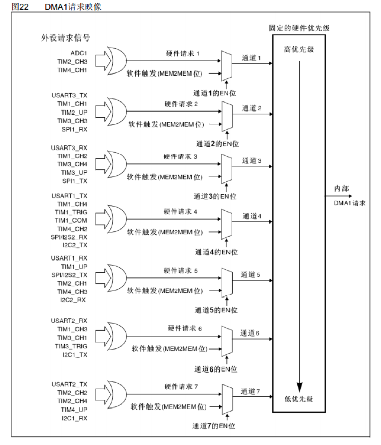

注

1. 每个通道可以选择硬件触发还是软件触发
2. 每个通道的硬件触发源不同且固定，而软件触发可以自定义选择

**数据宽度与对齐**

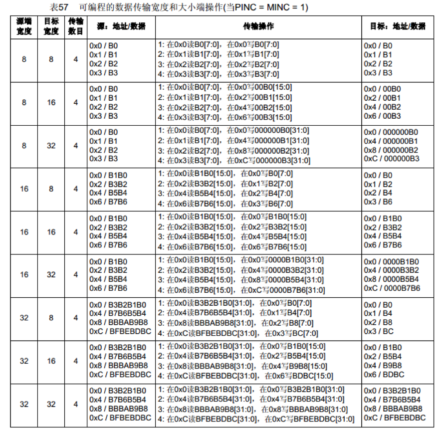

注

1. 如果源端数据位比目的数据为小，则在目的端高位补0
2. 如果源端数据位比目的数据为大，则在目的端只写入源端数据低位

**数据转运+DMA**

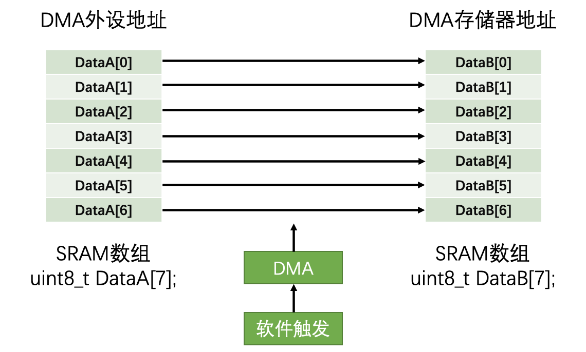

注

1. DataA的数据并不会消失

**ADC扫描模式+DMA**

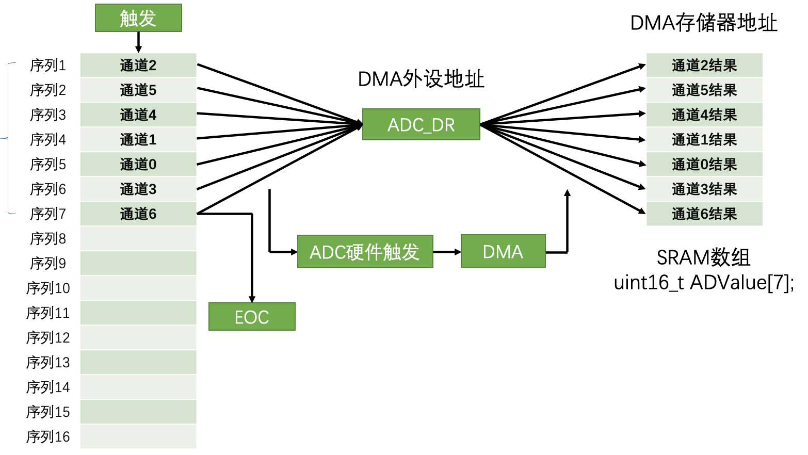

注

1. 是否自动重装要看ADC是否连续转换

## 结构

**框图**

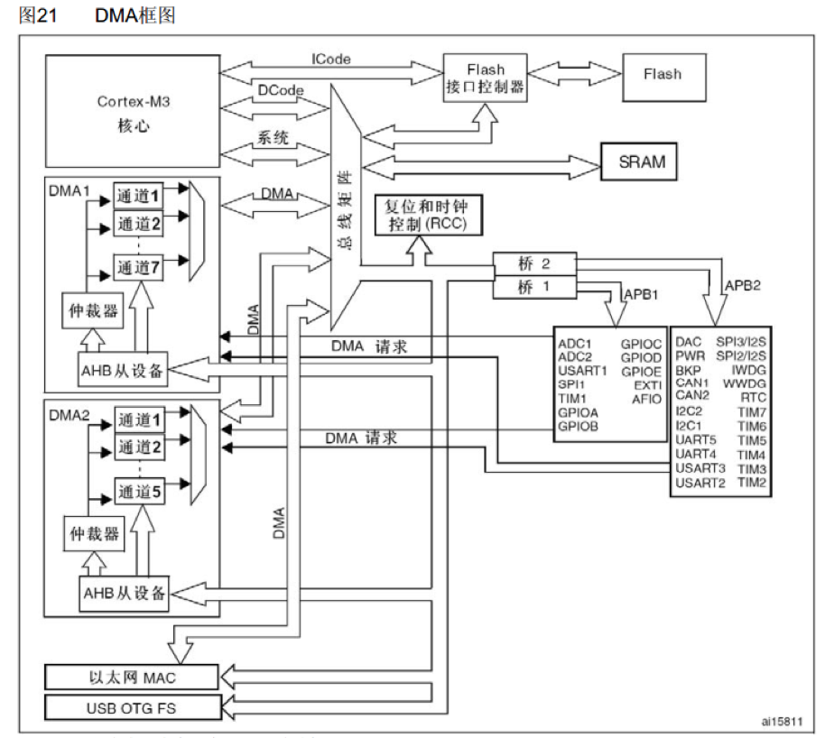

注

1. 寄存器是一种特殊的存储器，可以控制硬件，是连接软件和硬件的桥梁，软件读写寄存器就相当于控制硬件的执行
2. DMA既是总线矩阵的主动单元，可以读写各种存储器，也是AHB总线上的被动单元
3. DMA内部的多个通道，可以进行独立地数据转运，由仲裁器调度各个通道，防止产生冲突

**基本结构**

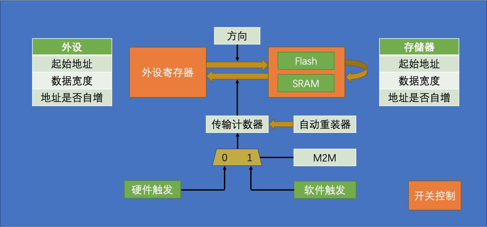

注

1. 由于Flash一般为只读，所以DMA不可以进行SRAM到Flash，或者Flash到Flash的转运操作
2. 传输寄存器表明转运次数，为自减寄存器，每转运一次计数器的值减1，减到0之后就不会进行转运，同时之前自增的地址也会回到起始地址，以便开启新一轮的转运
3. 自动重装寄存器作用为，当传输寄存器值为0时，是否要自动恢复到最初的值，如果重装就是循环模式，与ADC的连续模式相照应
4. 触发模式
	- 软件触发：以最快速度连续不断地触发DMA，不可与循环模式同时使用，适用于存储器到存储器的转运
	- 硬件触发：与外设有关的转运，一般需要一定的时机，如ADC转换完成
5. 必须要先关闭DMA，再写传输计数器
6. 含中断

## 实例

### DMA数据转运

```c
/* DMA.c*/

#include "stm32f10x.h"                 

uint16_t MyDMA_Size;																						//定义全局变量，用于记住Init函数的Size，供Transfer函数使用

/**
  * 函    数：DMA初始化
  * 参    数：AddrA 原数组的首地址
  * 参    数：AddrB 目的数组的首地址
  * 参    数：Size 转运的数据大小（转运次数）
  * 返 回 值：无
  */
void MyDMA_Init(uint32_t AddrA, uint32_t AddrB, uint16_t Size)
{
	MyDMA_Size = Size;																						//将Size写入到全局变量，记住参数Size
	
	/*开启时钟*/
	RCC_AHBPeriphClockCmd(RCC_AHBPeriph_DMA1, ENABLE);						//开启DMA的时钟
	
	/*DMA初始化*/
	DMA_InitTypeDef DMA_InitStructure;														//定义结构体变量
	DMA_InitStructure.DMA_PeripheralBaseAddr = AddrA;							//外设基地址，给定形参AddrA
	DMA_InitStructure.DMA_PeripheralDataSize = DMA_PeripheralDataSize_Byte;	//外设数据宽度，选择字节
	DMA_InitStructure.DMA_PeripheralInc = DMA_PeripheralInc_Enable;					//外设地址自增，选择使能
	DMA_InitStructure.DMA_MemoryBaseAddr = AddrB;														//存储器基地址，给定形参AddrB
	DMA_InitStructure.DMA_MemoryDataSize = DMA_MemoryDataSize_Byte;					//存储器数据宽度，选择字节
	DMA_InitStructure.DMA_MemoryInc = DMA_MemoryInc_Enable;									//存储器地址自增，选择使能
	DMA_InitStructure.DMA_DIR = DMA_DIR_PeripheralSRC;											//数据传输方向，选择由外设到存储器
	DMA_InitStructure.DMA_BufferSize = Size;																//转运的数据大小（转运次数）
	DMA_InitStructure.DMA_Mode = DMA_Mode_Normal;														//模式，选择正常模式，不自动重装
	DMA_InitStructure.DMA_M2M = DMA_M2M_Enable;															//存储器到存储器，即使用软件触发，选择使能
	DMA_InitStructure.DMA_Priority = DMA_Priority_Medium;										//优先级，用于多通道时转运，这里选择中等
	DMA_Init(DMA1_Channel1, &DMA_InitStructure);														//将结构体变量交给DMA_Init，配置DMA1的通道1，软件触发时可任意选择
	
	/*DMA使能*/
	DMA_Cmd(DMA1_Channel1, DISABLE);																				//这里先不给使能，初始化后不会立刻工作，等后续调用Transfer后，再开始
}

/**
  * 函    数：启动DMA数据转运
  * 参    数：无
  * 返 回 值：无
  */
void MyDMA_Transfer(void)
{
	DMA_Cmd(DMA1_Channel1, DISABLE);										//DMA失能，在写入传输计数器之前，需要DMA暂停工作
	DMA_SetCurrDataCounter(DMA1_Channel1, MyDMA_Size);	//写入传输计数器，指定将要转运的次数
	DMA_Cmd(DMA1_Channel1, ENABLE);											//DMA使能，开始工作
	
	while (DMA_GetFlagStatus(DMA1_FLAG_TC1) == RESET);	//等待DMA工作完成
	DMA_ClearFlag(DMA1_FLAG_TC1);												//清除工作完成标志位
}
```

```c
/* main.c */

#include "stm32f10x.h"                  
#include "Delay.h"
#include "OLED.h"
#include "MyDMA.h"

uint8_t DataA[] = {0x01, 0x02, 0x03, 0x04};					//定义测试数组DataA，为数据源
uint8_t DataB[] = {0, 0, 0, 0};											//定义测试数组DataB，为数据目的地

int main(void)
{
	/*模块初始化*/
	OLED_Init();				//OLED初始化
	
	MyDMA_Init((uint32_t)DataA, (uint32_t)DataB, 4);	//DMA初始化，把源数组和目的数组的地址传入
	
	/*显示静态字符串*/
	OLED_ShowString(1, 1, "DataA");
	OLED_ShowString(3, 1, "DataB");
	
	/*显示数组的首地址*/
	OLED_ShowHexNum(1, 8, (uint32_t)DataA, 8);
	OLED_ShowHexNum(3, 8, (uint32_t)DataB, 8);
		
	while (1)
	{
		DataA[0] ++;																		//变换测试数据
		DataA[1] ++;
		DataA[2] ++;
		DataA[3] ++;
		
		OLED_ShowHexNum(2, 1, DataA[0], 2);							//显示数组DataA
		OLED_ShowHexNum(2, 4, DataA[1], 2);
		OLED_ShowHexNum(2, 7, DataA[2], 2);
		OLED_ShowHexNum(2, 10, DataA[3], 2);
		OLED_ShowHexNum(4, 1, DataB[0], 2);							//显示数组DataB
		OLED_ShowHexNum(4, 4, DataB[1], 2);
		OLED_ShowHexNum(4, 7, DataB[2], 2);
		OLED_ShowHexNum(4, 10, DataB[3], 2);
		
		Delay_ms(1000);																	//延时1s，观察转运前的现象
		
		MyDMA_Transfer();																//使用DMA转运数组，从DataA转运到DataB
		
		OLED_ShowHexNum(2, 1, DataA[0], 2);							//显示数组DataA
		OLED_ShowHexNum(2, 4, DataA[1], 2);
		OLED_ShowHexNum(2, 7, DataA[2], 2);
		OLED_ShowHexNum(2, 10, DataA[3], 2);
		OLED_ShowHexNum(4, 1, DataB[0], 2);							//显示数组DataB
		OLED_ShowHexNum(4, 4, DataB[1], 2);
		OLED_ShowHexNum(4, 7, DataB[2], 2);
		OLED_ShowHexNum(4, 10, DataB[3], 2);

		Delay_ms(1000);																	//延时1s，观察转运后的现象
	}
}
```

### DMA+AD多通道

```c
/* AD+DMA.c*/

#include "stm32f10x.h"          

uint16_t AD_Value[4];						//定义用于存放AD转换结果的全局数组

/**
  * 函    数：AD初始化
  * 参    数：无
  * 返 回 值：无
  */
void AD_Init(void)
{
	/*开启时钟*/
	RCC_APB2PeriphClockCmd(RCC_APB2Periph_ADC1, ENABLE);	//开启ADC1的时钟
	RCC_APB2PeriphClockCmd(RCC_APB2Periph_GPIOA, ENABLE);	//开启GPIOA的时钟
	RCC_AHBPeriphClockCmd(RCC_AHBPeriph_DMA1, ENABLE);		//开启DMA1的时钟
	
	/*设置ADC时钟*/
	RCC_ADCCLKConfig(RCC_PCLK2_Div6);											//选择时钟6分频，ADCCLK = 72MHz / 6 = 12MHz
	
	/*GPIO初始化*/
	GPIO_InitTypeDef GPIO_InitStructure;
	GPIO_InitStructure.GPIO_Mode = GPIO_Mode_AIN;
	GPIO_InitStructure.GPIO_Pin = GPIO_Pin_0 | GPIO_Pin_1 | GPIO_Pin_2 | GPIO_Pin_3;
	GPIO_InitStructure.GPIO_Speed = GPIO_Speed_50MHz;
	GPIO_Init(GPIOA, &GPIO_InitStructure);									//将PA0、PA1、PA2和PA3引脚初始化为模拟输入
	
	/*规则组通道配置*/
	ADC_RegularChannelConfig(ADC1, ADC_Channel_0, 1, ADC_SampleTime_55Cycles5);	//规则组序列1的位置，配置为通道0
	ADC_RegularChannelConfig(ADC1, ADC_Channel_1, 2, ADC_SampleTime_55Cycles5);	//规则组序列2的位置，配置为通道1
	ADC_RegularChannelConfig(ADC1, ADC_Channel_2, 3, ADC_SampleTime_55Cycles5);	//规则组序列3的位置，配置为通道2
	ADC_RegularChannelConfig(ADC1, ADC_Channel_3, 4, ADC_SampleTime_55Cycles5);	//规则组序列4的位置，配置为通道3
	
	/*ADC初始化*/
	ADC_InitTypeDef ADC_InitStructure;																		//定义结构体变量
	ADC_InitStructure.ADC_Mode = ADC_Mode_Independent;										//模式，选择独立模式，即单独使用ADC1
	ADC_InitStructure.ADC_DataAlign = ADC_DataAlign_Right;								//数据对齐，选择右对齐
	ADC_InitStructure.ADC_ExternalTrigConv = ADC_ExternalTrigConv_None;		//外部触发，使用软件触发，不需要外部触发
	ADC_InitStructure.ADC_ContinuousConvMode = ENABLE;										//连续转换，使能，每转换一次规则组序列后立刻开始下一次转换
	ADC_InitStructure.ADC_ScanConvMode = ENABLE;													//扫描模式，使能，扫描规则组的序列，扫描数量由ADC_NbrOfChannel确定
	ADC_InitStructure.ADC_NbrOfChannel = 4;																//通道数，为4，扫描规则组的前4个通道
	ADC_Init(ADC1, &ADC_InitStructure);																		//将结构体变量交给ADC_Init，配置ADC1
	
	/*DMA初始化*/
	DMA_InitTypeDef DMA_InitStructure;																		//定义结构体变量
	DMA_InitStructure.DMA_PeripheralBaseAddr = (uint32_t)&ADC1->DR;				//外设基地址，即ADC1的DR地址
	DMA_InitStructure.DMA_PeripheralDataSize = DMA_PeripheralDataSize_HalfWord;	//外设数据宽度，选择半字，对应16为的ADC数据寄存器
	DMA_InitStructure.DMA_PeripheralInc = DMA_PeripheralInc_Disable;			//外设地址自增，选择失能，始终以ADC数据寄存器为源
	DMA_InitStructure.DMA_MemoryBaseAddr = (uint32_t)AD_Value;						//存储器基地址，给定存放AD转换结果的全局数组AD_Value
	DMA_InitStructure.DMA_MemoryDataSize = DMA_MemoryDataSize_HalfWord;		//存储器数据宽度，选择半字，与源数据宽度对应
	DMA_InitStructure.DMA_MemoryInc = DMA_MemoryInc_Enable;								//存储器地址自增，选择使能，每次转运后，数组移到下一个位置
	DMA_InitStructure.DMA_DIR = DMA_DIR_PeripheralSRC;										//数据传输方向，选择由外设到存储器，ADC数据寄存器转到数组
	DMA_InitStructure.DMA_BufferSize = 4;																	//转运的数据大小（转运次数），与ADC通道数一致
	DMA_InitStructure.DMA_Mode = DMA_Mode_Circular;												//模式，选择循环模式，与ADC的连续转换一致
	DMA_InitStructure.DMA_M2M = DMA_M2M_Disable;													//存储器到存储器，选择失能，硬件触发，数据由ADC外设触发转运到存储器
	DMA_InitStructure.DMA_Priority = DMA_Priority_Medium;									//优先级，选择中等
	DMA_Init(DMA1_Channel1, &DMA_InitStructure);													//将结构体变量交给DMA_Init，配置DMA1的通道1
	
	/*DMA和ADC使能*/
	DMA_Cmd(DMA1_Channel1, ENABLE);							//DMA1的通道1使能
	ADC_DMACmd(ADC1, ENABLE);										//ADC1触发DMA1（固定）的信号使能
	ADC_Cmd(ADC1, ENABLE);											//ADC1使能
	
	/*ADC校准*/
	ADC_ResetCalibration(ADC1);									//固定流程，内部有电路会自动执行校准
	while (ADC_GetResetCalibrationStatus(ADC1) == SET);
	ADC_StartCalibration(ADC1);
	while (ADC_GetCalibrationStatus(ADC1) == SET);
	
	/*ADC触发*/
	ADC_SoftwareStartConvCmd(ADC1, ENABLE);			//软件触发ADC开始工作，由于ADC处于连续转换模式，故触发一次后ADC就可以一直连续不断地工作
}
```

```c
/* main.c */

#include "stm32f10x.h"                
#include "Delay.h"
#include "OLED.h"
#include "AD.h"

int main(void)
{
	/*模块初始化*/
	OLED_Init();				//OLED初始化
	AD_Init();					//AD初始化
	
	/*显示静态字符串*/
	OLED_ShowString(1, 1, "AD0:");
	OLED_ShowString(2, 1, "AD1:");
	OLED_ShowString(3, 1, "AD2:");
	OLED_ShowString(4, 1, "AD3:");
	
	while (1)
	{
		OLED_ShowNum(1, 5, AD_Value[0], 4);		//显示转换结果第0个数据
		OLED_ShowNum(2, 5, AD_Value[1], 4);		//显示转换结果第1个数据
		OLED_ShowNum(3, 5, AD_Value[2], 4);		//显示转换结果第2个数据
		OLED_ShowNum(4, 5, AD_Value[3], 4);		//显示转换结果第3个数据
		
		Delay_ms(100);												//延时100ms，手动增加一些转换的间隔时间
	}
}
```

# 通信接口

## 简介

- 通信的目的：将一个设备的数据传送到另一个设备，扩展硬件系统
- 通信协议：制定通信的规则，通信双方按照协议规则进行数据收发

| 名称  |         引脚         |  双工  | 时钟 | 电平 |  设备  |
| :---: | :------------------: | :----: | :--: | :--: | :----: |
| USART |        TX、RX        | 全双工 | 异步 | 单端 | 点对点 |
|  I2C  |       SCL、SDA       | 半双工 | 同步 | 单端 | 多设备 |
|  SPI  | SCLK、MOSI、MISO、CS | 全双工 | 同步 | 单端 | 多设备 |
|  CAN  |     CAN_H、CAN_L     | 半双工 | 异步 | 差分 | 多设备 |
|  USB  |        DP、DM        | 半双工 | 异步 | 差分 | 点对点 |

注

1.  一般来说，全双工的通信一般都有两根通信线，如USART、SPI
2.  同步通信一般在时钟信号的指引下进行采样，而异步通信需双方约定采样频率，并进行采样对齐
3.  单端通信的高低电平都是对GNG的电压差，所以单端通信的设备需要共地
4.  差分信号可以极大地提高抗干扰特性，所以一般差分信号传输速度和距离都很高

## 串口通信

- 串口是一种应用十分广泛的通讯接口，串口成本低、容易使用、通信线路简单，可实现两个设备的互相通信
- 单片机的串口可以使单片机与单片机、单片机与电脑、单片机与各式各样的模块互相通信，极大地扩展了单片机的应用范围，增强了单片机系统的硬件实力

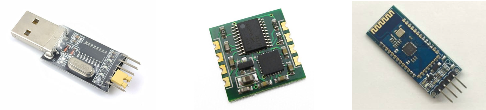

注

1. 串口中只能发送二进制/十六进制的数据，若要发送字符，则需要一个映射表，如ASCII表

**硬件电路**

- 简单双向串口通信有两根通信线（发送端TX和接收端RX）
- TX与RX要交叉连接
- 当只需单向的数据传输时，可以只接一根通信线，此时变为单工
- 当电平标准不一致时，需要加电平转换芯片


注

1. 串口通信时，TX、RX和GND必须互连，VCC可以单独供电

**电平标准**

- 电平标准是数据1和数据0的表达方式，是传输线缆中人为规定的电压与数据的对应关系，串口常用的电平标准有如下三种
	- TTL电平：+3.3V或+5V表示1，0V表示0
	- RS232电平：-3\~-15V表示1，+3\~+15V表示0，抗干扰较大
	- RS485电平：两线压差+2\~+6V表示1，-2\~-6V表示0（差分信号）

**串口参数及时序**

- 波特率：串口通信的速率
- 起始位：标志一个数据帧的开始，固定为低电平
- 数据位：数据帧的有效载荷，1为高电平，0为低电平，低位先行
- 校验位：用于数据验证，根据数据位计算得来
- 停止位：用于数据帧间隔，固定为高电平

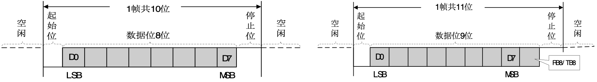

注

1. 串口中，每一个字节（8位）都装载在一个数据帧里，由起始位、数据位和停止位组成，还可以在数据位最后加一个奇偶校验位
2. 由于为异步通信，发送和接收需要约定好传输的速率，即波特率，在二进制调制下，一个码元就是一个bit
3. 串口空闲状态为高电平
4. 奇偶校验不能检验出偶数个错误，无法纠错

**串口时序**

- TX引脚输出定时反转的高低电平，RX引脚定时读取引脚的高低电平
- 打包好的数据帧一次输出在TX引脚，另一段RX引脚一次接收

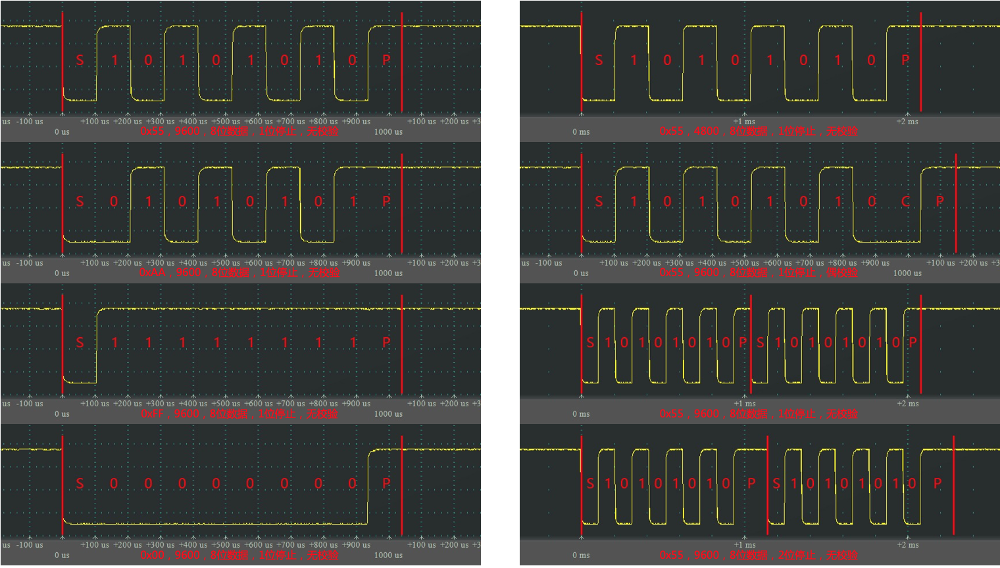

# RS232

## 引言

**UART存在的问题**

- 电气接口不统一：UART只是对信号的时序进行了定义，而未定义接口的电气特性，UART通信时一般直接使用处理器使用的电平，即TTL电平，但不同的处理器使用的电平存在差异， 所以不同的处理器使用UART通信时一般不能直接相连，一般还需要在处理器外部去添加电路对信号的电平进行转换
- 抗干扰能力差：UART一般直接使用TTL信号来表示0和1， 但TTL信号的抗干扰能力较差，数据在传输过程中很容易出错
- 通信距离极短：因为TTL信号的抗干扰能力较差，所以其通信距离也很短，一般只能用于一个电路板上的两个不芯片之间的通信

## 简介

RS232协议是基于串行通讯的电器标准，该标准规定采用一个标准的连接器，连接器每个引脚的作用以及信号的电平加以规定。

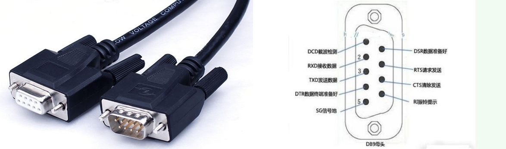

- 该标准规定采用一个25引脚的DB-25连接器，后续简化成DB-9连接器
- 现在工业控制的RS-232接口一般只使用RXD、TXD、GND三条线
- 该标准规定逻辑1的电平为-5V到-15V，逻辑0的电平为+5V 到+15V
- 选用该电气标准的目的在于提高抗干扰能力，增大通信距离，其传送距离一般可达15m

## 存在的问题

- 接口的信号电平值较高，易损坏接口电路的芯片，又与TTL电平不兼容，所以需要使用电平转换芯片才能与TTL电路连接
- 通信速度较低
- 易产生共模干扰，抗噪声干扰性弱
- 传输距离较短（15m）

# RS485

## 简介

- 该标准的通信网络能在远距离条件下以及电子噪声大的环境下有效传输信号
- 该标准允许连接多个收发器，即具有多站能力，可以利用单一的RS485接口方便地建立起一个设备网络

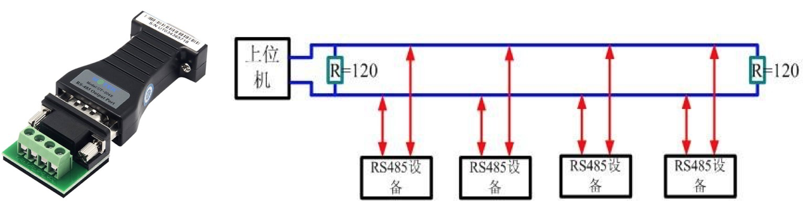

- RS485采用两线制，在同一总线上可以同时存在多个节点
- 数据的发送和接收都要使用这对差分信号线，采用半双工的方式工作
- 采用差分信号进行数据传输，两线间的电压差为+2v到+6v表示逻辑1，两线间的电压差为-2v到-6v表示逻辑0
- 使用差分信号能有效地减少噪声信号的干扰，延长通信距离，RS485的通信距离可以达到1500m

## 优势

- RS485接口信号的电平比RS232降低了，所以不易损坏接口电路的芯片，且该电平与TTL电平兼容，可方便地与TTL电路连接
- 通信速度快
- 抗噪声干扰性强
- 传输距离较远（1500m）
- 可实现多节点组网

# USART

## 简介

- USART（Universal Synchronous/Asynchronous Receiver/Transmitter）通用同步/异步收发器
- USART是STM32内部集成的硬件外设，可根据数据寄存器的一个字节数据自动生成数据帧时序，从TX引脚发送出去，也可自动接收RX引脚的数据帧时序，拼接为一个字节数据，存放在数据寄存器里
- 自带波特率发生器，最高达4.5Mbits/s，本质为分频器
- 可配置数据位长度（8/9）、停止位长度（0.5/1/1.5/2）
- 可选校验位（无校验/奇校验/偶校验）
- 支持同步模式、硬件流控制、DMA、智能卡、IrDA、LIN

**数据帧**

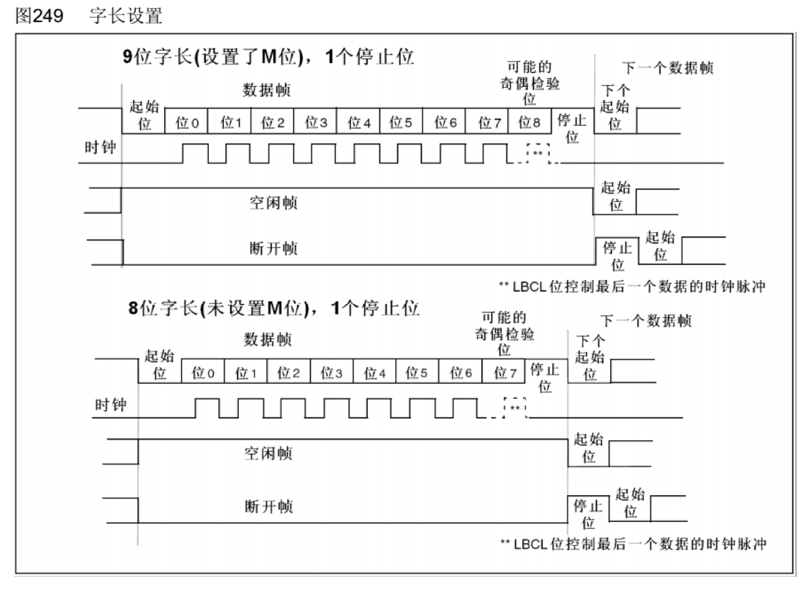

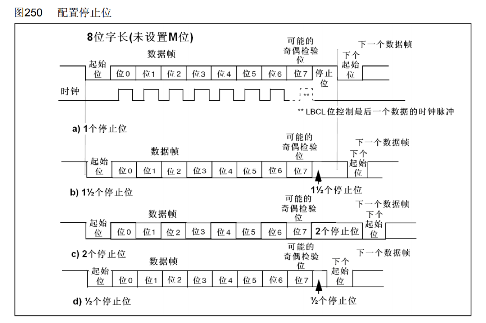

注

1. 一般选择数据位8位，无校验位，停止位1位

**起始位侦测**

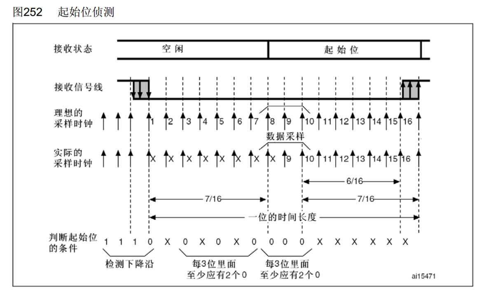

**数据采样**

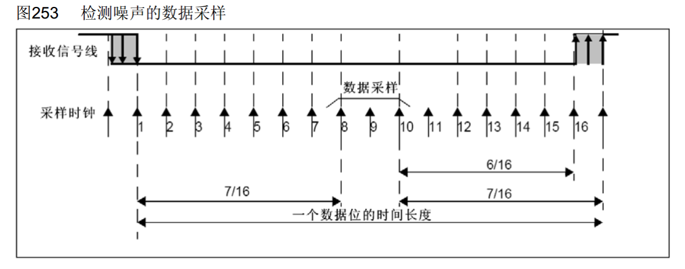

**波特率发生器**

- 发送器和接收器的波特率由波特率寄存器BRR里的DIV确定，分为整数部分和小数部分
- 计算公式：波特率 = f~PCLK2/1~ / (16 * DIV)

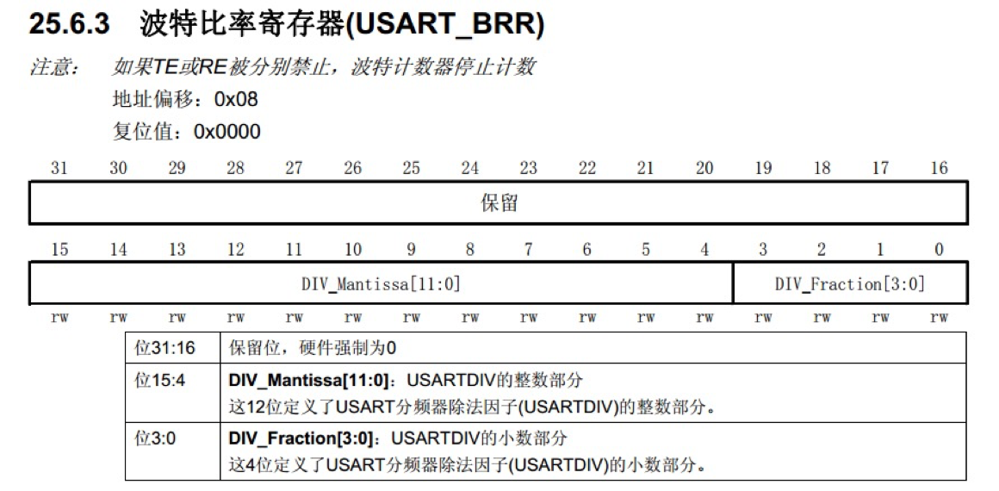

## 结构

**框图**

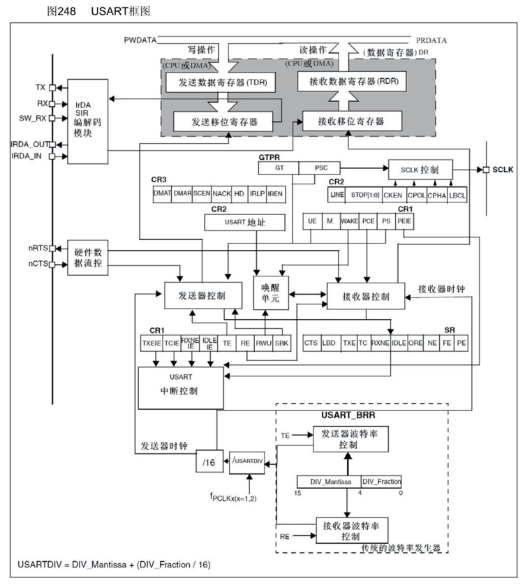

注

1. TDR负责发送数据，只写；RDR负责接收数据，只读
2. 数据从TDR转移到发送移位寄存器，然后发送移位寄存器在发送器控制下，一位一位地把数据输出到TX引脚，直到发送完成，TDR中的数据才会转移到发送移位寄存器
3. 数据从RX引脚通向接收移位寄存器，在接收器的控制下，一位一位读取RX电平，当完成后会转移到RDR中
4. 同步功能较常用的异步而言只是多了个时钟输出，但无时钟输入
5. 当接收设备来不及处理发送方的数据时，为了避免数据丢弃或覆盖，可以使用硬件流控制，来控制发送方发送速率
6. 唤醒单元可以实现多设备通信的功能

**基本结构**

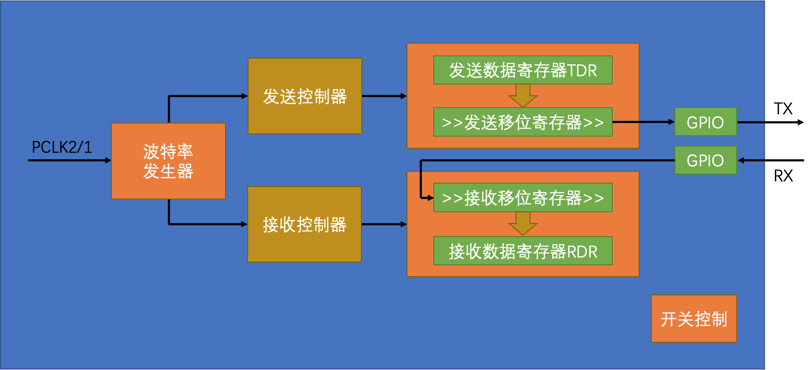

注

1. 只要接收到一个字节数据，RXNE标志位就会被硬件自动设置
2. 每次接收到一个字节数据时，都会触发一次中断，中断服务函数会处理一个字节的数据

## 数据模式

- HEX模式/十六进制模式/二进制模式：以原始数据的形式显示
- 文本模式/字符模式：以原始数据编码后的形式显示

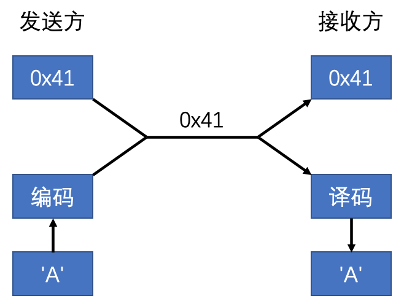

注

1. 常见编码，可以通过keil配置编码方式（ C/C++ Misc控制 `--no-multibyte-chars` ），同时接收方也需选择对应编码方式进行解码
	- ASCII：主要用于英文字符，简单高效，但只能表示128个字符
	- GBK：主要用于中文字符，支持简体中文和繁体中文，但仅限于中文环境
	- UTF-8：是一种通用的编码方式，支持所有语言和字符集，具有广泛的适用性和兼容性	
2. 线路中必须传输原始数据，而不能是编码前的数据

## 数据包

- 由于每次接收一帧数据就会触发中断，所以针对连续多个数据，需要使用数据包的形式
- 数据包的任务就是，把属于同一批的数据进行打包和分割，方便接收方进行识别

### HEX数据包

- 固定包长，含包头包尾

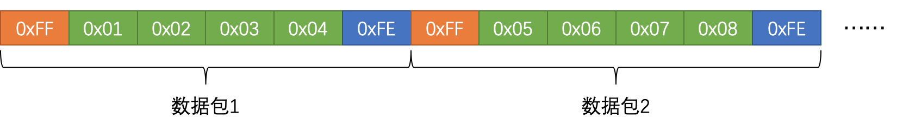

- 可变包长，含包头包尾

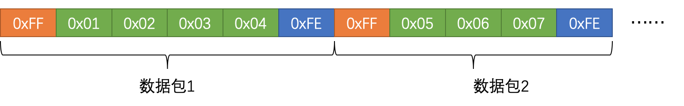

注

1. 传输直接，解析数据非常简单，适合于原始数据之间的交互
2. 灵活性不足，容易出现数据和包头包尾重复的情况
3. 如果数据会出现和包头包尾重复的情况，最好选固定包长
4. 传输的数据类型可以任意

### 文本数据包

- 固定包长，含包头包尾

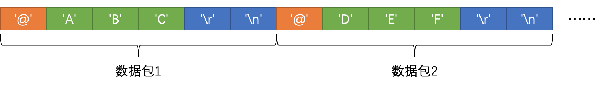

- 可变包长，含包头包尾

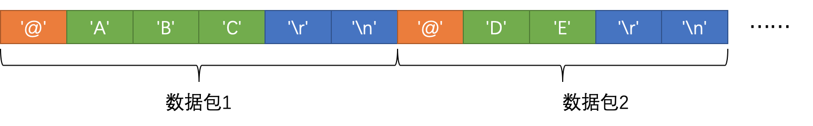

注

1. 数据直观易理解，非常灵活，适合人机交互的场合
2. 解析效率低
3. 基本不用担心数据和包头包尾重复的问题

### HEX数据包接收

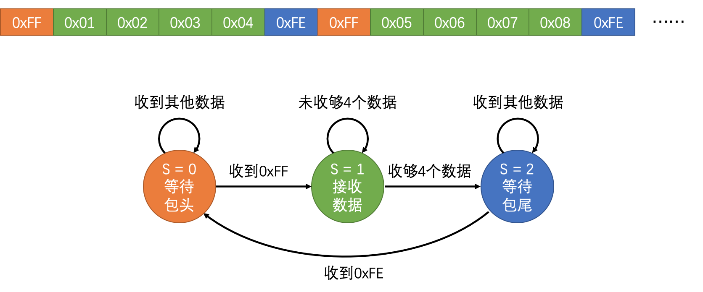

注

1. 通过状态机的方法来接受一个数据包
2. 步骤
	- 根据项目要求定义状态
	- 各个状态什么情况下会进行转移、如何转移
	- 根据绘制好的状态图进行转移  

### 文本数据包接收

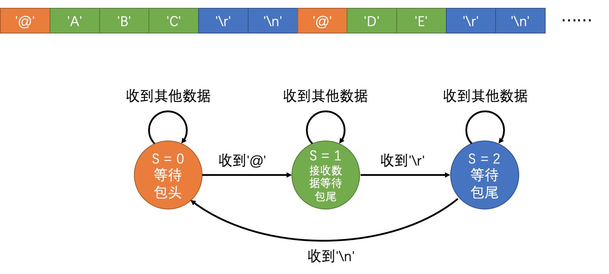

## 实例

### 串口发送

```c
/* Serial.c */

#include "stm32f10x.h"           
#include <stdio.h>
#include <stdarg.h>

/**
  * 函    数：串口初始化
  * 参    数：无
  * 返 回 值：无
  */
void Serial_Init(void)
{
	/*开启时钟*/
	RCC_APB2PeriphClockCmd(RCC_APB2Periph_USART1, ENABLE);			//开启USART1的时钟
	RCC_APB2PeriphClockCmd(RCC_APB2Periph_GPIOA, ENABLE);				//开启GPIOA的时钟
	
	/*GPIO初始化*/
	GPIO_InitTypeDef GPIO_InitStructure;
	GPIO_InitStructure.GPIO_Mode = GPIO_Mode_AF_PP;
	GPIO_InitStructure.GPIO_Pin = GPIO_Pin_9;
	GPIO_InitStructure.GPIO_Speed = GPIO_Speed_50MHz;
	GPIO_Init(GPIOA, &GPIO_InitStructure);											//将PA9引脚初始化为复用推挽输出
	
	/*USART初始化*/
	USART_InitTypeDef USART_InitStructure;											//定义结构体变量
	USART_InitStructure.USART_BaudRate = 9600;									//波特率
	USART_InitStructure.USART_HardwareFlowControl = USART_HardwareFlowControl_None;	//硬件流控制，不需要
	USART_InitStructure.USART_Mode = USART_Mode_Tx;							//模式，选择为发送模式
	USART_InitStructure.USART_Parity = USART_Parity_No;					//奇偶校验，不需要
	USART_InitStructure.USART_StopBits = USART_StopBits_1;			//停止位，选择1位
	USART_InitStructure.USART_WordLength = USART_WordLength_8b;	//字长，选择8位
	USART_Init(USART1, &USART_InitStructure);										//将结构体变量交给USART_Init，配置USART1
	
	/*USART使能*/
	USART_Cmd(USART1, ENABLE);																	//使能USART1，串口开始运行
}

/**
  * 函    数：串口发送一个字节
  * 参    数：Byte 要发送的一个字节
  * 返 回 值：无
  */
void Serial_SendByte(uint8_t Byte)
{
	USART_SendData(USART1, Byte);																	//将字节数据写入数据寄存器，写入后USART自动生成时序波形
	while (USART_GetFlagStatus(USART1, USART_FLAG_TXE) == RESET);	//等TDR数据转移到寄存器
	/*下次写入数据寄存器会自动清除发送完成标志位，故此循环后，无需清除标志位*/
}

/**
  * 函    数：串口发送一个数组
  * 参    数：Array 要发送数组的首地址
  * 参    数：Length 要发送数组的长度
  * 返 回 值：无
  */
void Serial_SendArray(uint8_t *Array, uint16_t Length)
{
	uint16_t i;
	for (i = 0; i < Length; i ++)		//遍历数组
	{
		Serial_SendByte(Array[i]);		//依次调用Serial_SendByte发送每个字节数据
	}
}

/**
  * 函    数：串口发送一个字符串
  * 参    数：String 要发送字符串的首地址
  * 返 回 值：无
  */
void Serial_SendString(char *String)
{
	uint8_t i;
	for (i = 0; String[i] != '\0'; i ++)	//遍历字符数组（字符串），遇到字符串结束标志位后停止
	{
		Serial_SendByte(String[i]);					//依次调用Serial_SendByte发送每个字节数据
	}
}

/**
  * 函    数：次方函数（内部使用）
  * 返 回 值：返回值等于X的Y次方
  */
uint32_t Serial_Pow(uint32_t X, uint32_t Y)
{
	uint32_t Result = 1;	//设置结果初值为1
	while (Y --)					//执行Y次
	{
		Result *= X;				//将X累乘到结果
	}
	return Result;
}

/**
  * 函    数：串口发送数字
  * 参    数：Number 要发送的数字，范围：0~4294967295
  * 参    数：Length 要发送数字的长度，范围：0~10
  * 返 回 值：无
  */
void Serial_SendNumber(uint32_t Number, uint8_t Length)
{
	uint8_t i;
	for (i = 0; i < Length; i ++)																						//根据数字长度遍历数字的每一位
	{
		Serial_SendByte(Number / Serial_Pow(10, Length - i - 1) % 10 + '0');	//依次调用Serial_SendByte发送每位数字
	}
}

/**
  * 函    数：使用printf需要重定向的底层函数
  * 参    数：保持原始格式即可，无需变动
  * 返 回 值：保持原始格式即可，无需变动
  */
int fputc(int ch, FILE *f)
{
	Serial_SendByte(ch);											//将printf的底层重定向到自己的发送字节函数
	return ch;
}

/**
  * 函    数：自己封装的prinf函数
  * 参    数：format 格式化字符串
  * 参    数：... 可变的参数列表
  * 返 回 值：无
  */
void Serial_Printf(char *format, ...)
{
	char String[100];									//定义字符数组
	va_list arg;											//定义可变参数列表数据类型的变量arg
	va_start(arg, format);						//从format开始，接收参数列表到arg变量
	vsprintf(String, format, arg);		//使用vsprintf打印格式化字符串和参数列表到字符数组中
	va_end(arg);											//结束变量arg
	Serial_SendString(String);				//串口发送字符数组（字符串）
}
```

```c
/* main.c */

#include "stm32f10x.h"             
#include "Delay.h"
#include "OLED.h"
#include "Serial.h"

int main(void)
{
	/*模块初始化*/
	OLED_Init();										//OLED初始化
	
	Serial_Init();									//串口初始化
	
	/*串口基本函数*/
	Serial_SendByte(0x41);					//串口发送一个字节数据0x41
	
	uint8_t MyArray[] = {0x42, 0x43, 0x44, 0x45};	
	Serial_SendArray(MyArray, 4);		//串口发送一个数组
	
	Serial_SendString("\r\nNum1=");		//串口发送字符串
	
	Serial_SendNumber(111, 3);				//串口发送数字
	
	/*下述3种方法可实现printf的效果*/
	
	/*方法1：直接重定向printf，但printf函数只有一个，USART2、3不能使用*/
	printf("\r\nNum2=%d", 222);			//串口发送printf打印的格式化字符串
	//需要重定向fputc函数，并在工程选项里勾选Use MicroLIB
	
	/*方法2：使用sprintf打印到字符数组，再用串口发送字符数组，此方法打印到字符数组，之后想怎么处理都可以，可在多处使用*/
	char String[100];											//定义字符数组
	sprintf(String, "\r\nNum3=%d", 333);	//使用sprintf，把格式化字符串打印到字符数组
	Serial_SendString(String);						//串口发送字符数组（字符串）
	
	/*方法3：将sprintf函数封装起来，实现专用的printf，此方法就是把方法2封装起来，更加简洁实用，可在多处使用*/
	Serial_Printf("\r\nNum4=%d", 444);		//串口打印字符串，使用自己封装的函数实现printf的效果
	Serial_Printf("\r\n");
	
	while (1)
	{
		
	}
}
```

### 串口收发

```c
/* Serial.c */

#include "stm32f10x.h"             
#include <stdio.h>
#include <stdarg.h>

uint8_t Serial_RxData;													//定义串口接收的数据变量
uint8_t Serial_RxFlag;													//定义串口接收的标志位变量

/**
  * 函    数：串口初始化
  * 参    数：无
  * 返 回 值：无
  */
void Serial_Init(void)
{
	/*开启时钟*/
	RCC_APB2PeriphClockCmd(RCC_APB2Periph_USART1, ENABLE);	//开启USART1的时钟
	RCC_APB2PeriphClockCmd(RCC_APB2Periph_GPIOA, ENABLE);		//开启GPIOA的时钟
	
	/*GPIO初始化*/
	GPIO_InitTypeDef GPIO_InitStructure;
	GPIO_InitStructure.GPIO_Mode = GPIO_Mode_AF_PP;
	GPIO_InitStructure.GPIO_Pin = GPIO_Pin_9;
	GPIO_InitStructure.GPIO_Speed = GPIO_Speed_50MHz;
	GPIO_Init(GPIOA, &GPIO_InitStructure);									//将PA9引脚初始化为复用推挽输出
	
	GPIO_InitStructure.GPIO_Mode = GPIO_Mode_IPU;
	GPIO_InitStructure.GPIO_Pin = GPIO_Pin_10;
	GPIO_InitStructure.GPIO_Speed = GPIO_Speed_50MHz;
	GPIO_Init(GPIOA, &GPIO_InitStructure);									//将PA10引脚初始化为上拉输入
	
	/*USART初始化*/
	USART_InitTypeDef USART_InitStructure;									//定义结构体变量
	USART_InitStructure.USART_BaudRate = 9600;							//波特率
	USART_InitStructure.USART_HardwareFlowControl = USART_HardwareFlowControl_None;	//硬件流控制，不需要
	USART_InitStructure.USART_Mode = USART_Mode_Tx | USART_Mode_Rx;	//模式，发送模式和接收模式均选择
	USART_InitStructure.USART_Parity = USART_Parity_No;			//奇偶校验，不需要
	USART_InitStructure.USART_StopBits = USART_StopBits_1;	//停止位，选择1位
	USART_InitStructure.USART_WordLength = USART_WordLength_8b;		//字长，选择8位
	USART_Init(USART1, &USART_InitStructure);								//将结构体变量交给USART_Init，配置USART1
	
	/*中断输出配置*/
	USART_ITConfig(USART1, USART_IT_RXNE, ENABLE);						//开启串口接收数据的中断
	
	/*NVIC中断分组*/
	NVIC_PriorityGroupConfig(NVIC_PriorityGroup_2);						//配置NVIC为分组2
	
	/*NVIC配置*/
	NVIC_InitTypeDef NVIC_InitStructure;											//定义结构体变量
	NVIC_InitStructure.NVIC_IRQChannel = USART1_IRQn;					//选择配置NVIC的USART1线
	NVIC_InitStructure.NVIC_IRQChannelCmd = ENABLE;						//指定NVIC线路使能
	NVIC_InitStructure.NVIC_IRQChannelPreemptionPriority = 1;	//指定NVIC线路的抢占优先级为1
	NVIC_InitStructure.NVIC_IRQChannelSubPriority = 1;				//指定NVIC线路的响应优先级为1
	NVIC_Init(&NVIC_InitStructure);														//将结构体变量交给NVIC_Init，配置NVIC外设
	
	/*USART使能*/
	USART_Cmd(USART1, ENABLE);																//使能USART1，串口开始运行
}

/**
  * 函    数：串口发送一个字节
  * 参    数：Byte 要发送的一个字节
  * 返 回 值：无
  */
void Serial_SendByte(uint8_t Byte)
{
	USART_SendData(USART1, Byte);																	// 将字节数据写入数据寄存器，写入后USART自动生成时序波形
	while (USART_GetFlagStatus(USART1, USART_FLAG_TXE) == RESET);	// 等待发送完成
	/*下次写入数据寄存器会自动清除发送完成标志位，故此循环后，无需清除标志位*/
}

/**
  * 函    数：获取串口接收标志位
  * 参    数：无
  * 返 回 值：串口接收标志位，范围：0~1，接收到数据后，标志位置1，读取后标志位自动清零
  */
uint8_t Serial_GetRxFlag(void)
{
	if (Serial_RxFlag == 1)				//如果标志位为1
	{
		Serial_RxFlag = 0;
		return 1;										//则返回1，并自动清零标志位
	}
	return 0;											//如果标志位为0，则返回0
}

/**
  * 函    数：获取串口接收的数据
  * 参    数：无
  * 返 回 值：接收的数据，范围：0~255
  */
uint8_t Serial_GetRxData(void)
{
	return Serial_RxData;																				//返回接收的数据变量
}

/**
  * 函    数：USART1中断函数
  * 参    数：无
  * 返 回 值：无
  * 注意事项：此函数为中断函数，无需调用，中断触发后自动执行
  *           函数名为预留的指定名称，可以从启动文件复制
  *           请确保函数名正确，不能有任何差异，否则中断函数将不能进入
  */
void USART1_IRQHandler(void)
{
	if (USART_GetITStatus(USART1, USART_IT_RXNE) == SET)			//判断是否是USART1的接收事件触发的中断
	{
		Serial_RxData = USART_ReceiveData(USART1);							//读取数据寄存器，存放在接收的数据变量
		Serial_RxFlag = 1;																			//置接收标志位变量为1
		USART_ClearITPendingBit(USART1, USART_IT_RXNE);					//清除USART1的RXNE标志位
    //读取数据寄存器会自动清除此标志位
    //如果已经读取了数据寄存器，也可以不执行此代码
	}
}
```

```c
/* main.c */

#include "stm32f10x.h"                 
#include "Delay.h"
#include "OLED.h"
#include "Serial.h"

uint8_t RxData;														//定义用于接收串口数据的变量

int main(void)
{
	/*模块初始化*/
	OLED_Init();														//OLED初始化
	Serial_Init();													//串口初始化
	
	/*显示静态字符串*/
	OLED_ShowString(1, 1, "RxData:");
	
	while (1)
	{
		if (Serial_GetRxFlag() == 1)					//检查串口接收数据的标志位
		{
			RxData = Serial_GetRxData();				//获取串口接收的数据
			Serial_SendByte(RxData);						//串口将收到的数据回传回去，用于测试
			OLED_ShowHexNum(1, 8, RxData, 2);		//显示串口接收的数据
		}
	}
}
```

### 收发HEX数据包

```c
/* Serial.c */

#include "stm32f10x.h"               
#include <stdio.h>
#include <stdarg.h>

uint8_t Serial_TxPacket[4];			//定义发送数据包数组，数据包格式：FF 01 02 03 04 FE
uint8_t Serial_RxPacket[4];			//定义接收数据包数组
uint8_t Serial_RxFlag;					//定义接收数据包标志位

/**
  * 函    数：串口初始化
  * 参    数：无
  * 返 回 值：无
  */
void Serial_Init(void)
{
	/*开启时钟*/
	RCC_APB2PeriphClockCmd(RCC_APB2Periph_USART1, ENABLE);			//开启USART1的时钟
	RCC_APB2PeriphClockCmd(RCC_APB2Periph_GPIOA, ENABLE);				//开启GPIOA的时钟
	
	/*GPIO初始化*/
	GPIO_InitTypeDef GPIO_InitStructure;
	GPIO_InitStructure.GPIO_Mode = GPIO_Mode_AF_PP;
	GPIO_InitStructure.GPIO_Pin = GPIO_Pin_9;
	GPIO_InitStructure.GPIO_Speed = GPIO_Speed_50MHz;
	GPIO_Init(GPIOA, &GPIO_InitStructure);											//将PA9引脚初始化为复用推挽输出
	
	GPIO_InitStructure.GPIO_Mode = GPIO_Mode_IPU;
	GPIO_InitStructure.GPIO_Pin = GPIO_Pin_10;
	GPIO_InitStructure.GPIO_Speed = GPIO_Speed_50MHz;
	GPIO_Init(GPIOA, &GPIO_InitStructure);											//将PA10引脚初始化为上拉输入
	
	/*USART初始化*/
	USART_InitTypeDef USART_InitStructure;											//定义结构体变量
	USART_InitStructure.USART_BaudRate = 9600;									//波特率
	USART_InitStructure.USART_HardwareFlowControl = USART_HardwareFlowControl_None;	//硬件流控制，不需要
	USART_InitStructure.USART_Mode = USART_Mode_Tx | USART_Mode_Rx;	//模式，发送模式和接收模式均选择
	USART_InitStructure.USART_Parity = USART_Parity_No;						//奇偶校验，不需要
	USART_InitStructure.USART_StopBits = USART_StopBits_1;				//停止位，选择1位
	USART_InitStructure.USART_WordLength = USART_WordLength_8b;		//字长，选择8位
	USART_Init(USART1, &USART_InitStructure);											//将结构体变量交给USART_Init，配置USART1
	
	/*中断输出配置*/
	USART_ITConfig(USART1, USART_IT_RXNE, ENABLE);									//开启串口接收数据的中断
	
	/*NVIC中断分组*/
	NVIC_PriorityGroupConfig(NVIC_PriorityGroup_2);									//配置NVIC为分组2
	
	/*NVIC配置*/
	NVIC_InitTypeDef NVIC_InitStructure;														//定义结构体变量
	NVIC_InitStructure.NVIC_IRQChannel = USART1_IRQn;								//选择配置NVIC的USART1线
	NVIC_InitStructure.NVIC_IRQChannelCmd = ENABLE;									//指定NVIC线路使能
	NVIC_InitStructure.NVIC_IRQChannelPreemptionPriority = 1;				//指定NVIC线路的抢占优先级为1
	NVIC_InitStructure.NVIC_IRQChannelSubPriority = 1;							//指定NVIC线路的响应优先级为1
	NVIC_Init(&NVIC_InitStructure);																	//将结构体变量交给NVIC_Init，配置NVIC外设
	
	/*USART使能*/
	USART_Cmd(USART1, ENABLE);																			//使能USART1，串口开始运行
}

/**
  * 函    数：串口发送一个字节
  * 参    数：Byte 要发送的一个字节
  * 返 回 值：无
  */
void Serial_SendByte(uint8_t Byte)
{
	USART_SendData(USART1, Byte);																	//将字节数据写入数据寄存器，写入后USART自动生成时序波形
	while (USART_GetFlagStatus(USART1, USART_FLAG_TXE) == RESET);	//等待发送完成
	/*下次写入数据寄存器会自动清除发送完成标志位，故此循环后，无需清除标志位*/
}

/**
  * 函    数：串口发送一个数组
  * 参    数：Array 要发送数组的首地址
  * 参    数：Length 要发送数组的长度
  * 返 回 值：无
  */
void Serial_SendArray(uint8_t *Array, uint16_t Length)
{
	uint16_t i;
	for (i = 0; i < Length; i ++)		//遍历数组
	{
		Serial_SendByte(Array[i]);		//依次调用Serial_SendByte发送每个字节数据
	}
}

/**
  * 函    数：串口发送一个字符串
  * 参    数：String 要发送字符串的首地址
  * 返 回 值：无
  */
void Serial_SendString(char *String)
{
	uint8_t i;
	for (i = 0; String[i] != '\0'; i ++)	//遍历字符数组（字符串），遇到字符串结束标志位后停止
	{
		Serial_SendByte(String[i]);					//依次调用Serial_SendByte发送每个字节数据
	}
}

/**
  * 函    数：次方函数（内部使用）
  * 返 回 值：返回值等于X的Y次方
  */
uint32_t Serial_Pow(uint32_t X, uint32_t Y)
{
	uint32_t Result = 1;		//设置结果初值为1
	while (Y --)						//执行Y次
	{
		Result *= X;					//将X累乘到结果
	}
	return Result;
}

/**
  * 函    数：串口发送数字
  * 参    数：Number 要发送的数字，范围：0~4294967295
  * 参    数：Length 要发送数字的长度，范围：0~10
  * 返 回 值：无
  */
void Serial_SendNumber(uint32_t Number, uint8_t Length)
{
	uint8_t i;
	for (i = 0; i < Length; i ++)																						//根据数字长度遍历数字的每一位
	{
		Serial_SendByte(Number / Serial_Pow(10, Length - i - 1) % 10 + '0');	//依次调用Serial_SendByte发送每位数字
	}
}

/**
  * 函    数：使用printf需要重定向的底层函数
  * 参    数：保持原始格式即可，无需变动
  * 返 回 值：保持原始格式即可，无需变动
  */
int fputc(int ch, FILE *f)
{
	Serial_SendByte(ch);			//将printf的底层重定向到自己的发送字节函数
	return ch;
}

/**
  * 函    数：自己封装的prinf函数
  * 参    数：format 格式化字符串
  * 参    数：... 可变的参数列表
  * 返 回 值：无
  */
void Serial_Printf(char *format, ...)
{
	char String[100];											//定义字符数组
	va_list arg;													//定义可变参数列表数据类型的变量arg
	va_start(arg, format);								//从format开始，接收参数列表到arg变量
	vsprintf(String, format, arg);				//使用vsprintf打印格式化字符串和参数列表到字符数组中
	va_end(arg);													//结束变量arg
	Serial_SendString(String);						//串口发送字符数组（字符串）
}

/**
  * 函    数：串口发送数据包
  * 参    数：无
  * 返 回 值：无
  * 说    明：调用此函数后，Serial_TxPacket数组的内容将加上包头（FF）包尾（FE）后，作为数据包发送出去
  */
void Serial_SendPacket(void)
{
	Serial_SendByte(0xFF);
	Serial_SendArray(Serial_TxPacket, 4);
	Serial_SendByte(0xFE);
}

/**
  * 函    数：获取串口接收数据包标志位
  * 参    数：无
  * 返 回 值：串口接收数据包标志位，范围：0~1，接收到数据包后，标志位置1，读取后标志位自动清零
  */
uint8_t Serial_GetRxFlag(void)
{
	if (Serial_RxFlag == 1)				//如果标志位为1
	{
		Serial_RxFlag = 0;
		return 1;										//则返回1，并自动清零标志位
	}
	return 0;											//如果标志位为0，则返回0
}

/**
  * 函    数：USART1中断函数
  * 参    数：无
  * 返 回 值：无
  * 注意事项：此函数为中断函数，无需调用，中断触发后自动执行
  *           函数名为预留的指定名称，可以从启动文件复制
  *           请确保函数名正确，不能有任何差异，否则中断函数将不能进入
  */
void USART1_IRQHandler(void)
{
	static uint8_t RxState = 0;																//定义表示当前状态机状态的静态变量
	static uint8_t pRxPacket = 0;															//定义表示当前接收数据位置的静态变量
	if (USART_GetITStatus(USART1, USART_IT_RXNE) == SET)			//判断是否是USART1的接收事件触发的中断
	{
		uint8_t RxData = USART_ReceiveData(USART1);							//读取数据寄存器，存放在接收的数据变量
		
		/*使用状态机的思路，依次处理数据包的不同部分*/
		
		/*当前状态为0，接收数据包包头*/
		if (RxState == 0)
		{
			if (RxData == 0xFF)																		//如果数据确实是包头
			{
				RxState = 1;																				//置下一个状态
				pRxPacket = 0;																			//数据包的位置归零
			}
		}
		/*当前状态为1，接收数据包数据*/
		else if (RxState == 1)
		{
			Serial_RxPacket[pRxPacket] = RxData;									//将数据存入数据包数组的指定位置
			pRxPacket ++;																					//数据包的位置自增
			if (pRxPacket >= 4)																		//如果收够4个数据
			{
				RxState = 2;																				//置下一个状态
			}
		}
		/*当前状态为2，接收数据包包尾*/
		else if (RxState == 2)
		{
			if (RxData == 0xFE)																		//如果数据确实是包尾部
			{
				RxState = 0;																				//状态归0
				Serial_RxFlag = 1;																	//接收数据包标志位置1，成功接收一个数据包
			}
		}
		
		USART_ClearITPendingBit(USART1, USART_IT_RXNE);					//清除中断标志位
	}
}
```

```c
/* main.c */

#include "stm32f10x.h"                
#include "Delay.h"
#include "OLED.h"
#include "Serial.h"
#include "Key.h"

uint8_t KeyNum;								//定义用于接收按键键码的变量

int main(void)
{
	/*模块初始化*/
	OLED_Init();								//OLED初始化
	Key_Init();									//按键初始化
	Serial_Init();							//串口初始化
	
	/*显示静态字符串*/
	OLED_ShowString(1, 1, "TxPacket");
	OLED_ShowString(3, 1, "RxPacket");
	
	/*设置发送数据包数组的初始值，用于测试*/
	Serial_TxPacket[0] = 0x01;
	Serial_TxPacket[1] = 0x02;
	Serial_TxPacket[2] = 0x03;
	Serial_TxPacket[3] = 0x04;
	
	while (1)
	{
		KeyNum = Key_GetNum();			//获取按键键码
		if (KeyNum == 1)						//按键1按下
		{
			Serial_TxPacket[0] ++;		//测试数据自增
			Serial_TxPacket[1] ++;
			Serial_TxPacket[2] ++;
			Serial_TxPacket[3] ++;
			
			Serial_SendPacket();			//串口发送数据包Serial_TxPacket
			
			OLED_ShowHexNum(2, 1, Serial_TxPacket[0], 2);				//显示发送的数据包
			OLED_ShowHexNum(2, 4, Serial_TxPacket[1], 2);
			OLED_ShowHexNum(2, 7, Serial_TxPacket[2], 2);
			OLED_ShowHexNum(2, 10, Serial_TxPacket[3], 2);
		}
		
		if (Serial_GetRxFlag() == 1)													//如果接收到数据包，可能读取数据错位
		{
			OLED_ShowHexNum(4, 1, Serial_RxPacket[0], 2);				//显示接收的数据包
			OLED_ShowHexNum(4, 4, Serial_RxPacket[1], 2);
			OLED_ShowHexNum(4, 7, Serial_RxPacket[2], 2);
			OLED_ShowHexNum(4, 10, Serial_RxPacket[3], 2);
		}
	}
}
```

### 收发文本数据包

```c
/* Serial.c */

#include "stm32f10x.h"         
#include <stdio.h>
#include <stdarg.h>

char Serial_RxPacket[100];							//定义接收数据包数组，数据包格式"@MSG\r\n"
uint8_t Serial_RxFlag;									//定义接收数据包标志位

/**
  * 函    数：串口初始化
  * 参    数：无
  * 返 回 值：无
  */
void Serial_Init(void)
{
	/*开启时钟*/
	RCC_APB2PeriphClockCmd(RCC_APB2Periph_USART1, ENABLE);		//开启USART1的时钟
	RCC_APB2PeriphClockCmd(RCC_APB2Periph_GPIOA, ENABLE);			//开启GPIOA的时钟
	
	/*GPIO初始化*/
	GPIO_InitTypeDef GPIO_InitStructure;
	GPIO_InitStructure.GPIO_Mode = GPIO_Mode_AF_PP;
	GPIO_InitStructure.GPIO_Pin = GPIO_Pin_9;
	GPIO_InitStructure.GPIO_Speed = GPIO_Speed_50MHz;
	GPIO_Init(GPIOA, &GPIO_InitStructure);										//将PA9引脚初始化为复用推挽输出
	
	GPIO_InitStructure.GPIO_Mode = GPIO_Mode_IPU;
	GPIO_InitStructure.GPIO_Pin = GPIO_Pin_10;
	GPIO_InitStructure.GPIO_Speed = GPIO_Speed_50MHz;
	GPIO_Init(GPIOA, &GPIO_InitStructure);										//将PA10引脚初始化为上拉输入
	
	/*USART初始化*/
	USART_InitTypeDef USART_InitStructure;									//定义结构体变量
	USART_InitStructure.USART_BaudRate = 9600;							//波特率
	USART_InitStructure.USART_HardwareFlowControl = USART_HardwareFlowControl_None;	//硬件流控制，不需要
	USART_InitStructure.USART_Mode = USART_Mode_Tx | USART_Mode_Rx;	//模式，发送模式和接收模式均选择
	USART_InitStructure.USART_Parity = USART_Parity_No;			//奇偶校验，不需要
	USART_InitStructure.USART_StopBits = USART_StopBits_1;	//停止位，选择1位
	USART_InitStructure.USART_WordLength = USART_WordLength_8b;			//字长，选择8位
	USART_Init(USART1, &USART_InitStructure);								//将结构体变量交给USART_Init，配置USART1
	
	/*中断输出配置*/
	USART_ITConfig(USART1, USART_IT_RXNE, ENABLE);					//开启串口接收数据的中断
	
	/*NVIC中断分组*/
	NVIC_PriorityGroupConfig(NVIC_PriorityGroup_2);						//配置NVIC为分组2
	
	/*NVIC配置*/
	NVIC_InitTypeDef NVIC_InitStructure;											//定义结构体变量
	NVIC_InitStructure.NVIC_IRQChannel = USART1_IRQn;					//选择配置NVIC的USART1线
	NVIC_InitStructure.NVIC_IRQChannelCmd = ENABLE;						//指定NVIC线路使能
	NVIC_InitStructure.NVIC_IRQChannelPreemptionPriority = 1;	//指定NVIC线路的抢占优先级为1
	NVIC_InitStructure.NVIC_IRQChannelSubPriority = 1;				//指定NVIC线路的响应优先级为1
	NVIC_Init(&NVIC_InitStructure);														//将结构体变量交给NVIC_Init，配置NVIC外设
	
	/*USART使能*/
	USART_Cmd(USART1, ENABLE);																//使能USART1，串口开始运行
}

/**
  * 函    数：串口发送一个字节
  * 参    数：Byte 要发送的一个字节
  * 返 回 值：无
  */
void Serial_SendByte(uint8_t Byte)
{
	USART_SendData(USART1, Byte);																	//将字节数据写入数据寄存器，写入后USART自动生成时序波形
	while (USART_GetFlagStatus(USART1, USART_FLAG_TXE) == RESET);	//等待发送完成
	/*下次写入数据寄存器会自动清除发送完成标志位，故此循环后，无需清除标志位*/
}

/**
  * 函    数：串口发送一个数组
  * 参    数：Array 要发送数组的首地址
  * 参    数：Length 要发送数组的长度
  * 返 回 值：无
  */
void Serial_SendArray(uint8_t *Array, uint16_t Length)
{
	uint16_t i;
	for (i = 0; i < Length; i ++)		//遍历数组
	{
		Serial_SendByte(Array[i]);		//依次调用Serial_SendByte发送每个字节数据
	}
}

/**
  * 函    数：串口发送一个字符串
  * 参    数：String 要发送字符串的首地址
  * 返 回 值：无
  */
void Serial_SendString(char *String)
{
	uint8_t i;
	for (i = 0; String[i] != '\0'; i ++)	//遍历字符数组（字符串），遇到字符串结束标志位后停止
	{
		Serial_SendByte(String[i]);					//依次调用Serial_SendByte发送每个字节数据
	}
}

/**
  * 函    数：次方函数（内部使用）
  * 返 回 值：返回值等于X的Y次方
  */
uint32_t Serial_Pow(uint32_t X, uint32_t Y)
{
	uint32_t Result = 1;	//设置结果初值为1
	while (Y --)					//执行Y次
	{
		Result *= X;				//将X累乘到结果
	}
	return Result;
}

/**
  * 函    数：串口发送数字
  * 参    数：Number 要发送的数字，范围：0~4294967295
  * 参    数：Length 要发送数字的长度，范围：0~10
  * 返 回 值：无
  */
void Serial_SendNumber(uint32_t Number, uint8_t Length)
{
	uint8_t i;
	for (i = 0; i < Length; i ++)																						//根据数字长度遍历数字的每一位
	{
		Serial_SendByte(Number / Serial_Pow(10, Length - i - 1) % 10 + '0');	//依次调用Serial_SendByte发送每位数字
	}
}

/**
  * 函    数：使用printf需要重定向的底层函数
  * 参    数：保持原始格式即可，无需变动
  * 返 回 值：保持原始格式即可，无需变动
  */
int fputc(int ch, FILE *f)
{
	Serial_SendByte(ch);			//将printf的底层重定向到自己的发送字节函数
	return ch;
}

/**
  * 函    数：自己封装的prinf函数
  * 参    数：format 格式化字符串
  * 参    数：... 可变的参数列表
  * 返 回 值：无
  */
void Serial_Printf(char *format, ...)
{
	char String[100];									//定义字符数组
	va_list arg;											//定义可变参数列表数据类型的变量arg
	va_start(arg, format);						//从format开始，接收参数列表到arg变量
	vsprintf(String, format, arg);		//使用vsprintf打印格式化字符串和参数列表到字符数组中
	va_end(arg);											//结束变量arg
	Serial_SendString(String);				//串口发送字符数组（字符串）
}

/**
  * 函    数：USART1中断函数
  * 参    数：无
  * 返 回 值：无
  * 注意事项：此函数为中断函数，无需调用，中断触发后自动执行
  *           函数名为预留的指定名称，可以从启动文件复制
  *           请确保函数名正确，不能有任何差异，否则中断函数将不能进入
  */
void USART1_IRQHandler(void)
{
	static uint8_t RxState = 0;														//定义表示当前状态机状态的静态变量
	static uint8_t pRxPacket = 0;													//定义表示当前接收数据位置的静态变量
	if (USART_GetITStatus(USART1, USART_IT_RXNE) == SET)	//判断是否是USART1的接收事件触发的中断
	{
		uint8_t RxData = USART_ReceiveData(USART1);					//读取数据寄存器，存放在接收的数据变量
		
		/*使用状态机的思路，依次处理数据包的不同部分*/
		
		/*当前状态为0，接收数据包包头*/
		if (RxState == 0)
		{
			if (RxData == '@' && Serial_RxFlag == 0)					//如果数据确实是包头，并且上一个数据包已处理完毕
			{
				RxState = 1;																		//置下一个状态
				pRxPacket = 0;																	//数据包的位置归零
			}
		}
		/*当前状态为1，接收数据包数据，同时判断是否接收到了第一个包尾*/
		else if (RxState == 1)
		{
			if (RxData == '\r')																//如果收到第一个包尾
			{
				RxState = 2;																		//置下一个状态
			}
			else																							//接收到了正常的数据
			{
				Serial_RxPacket[pRxPacket] = RxData;						//将数据存入数据包数组的指定位置
				pRxPacket ++;																		//数据包的位置自增
			}
		}
		/*当前状态为2，接收数据包第二个包尾*/
		else if (RxState == 2)
		{
			if (RxData == '\n')																//如果收到第二个包尾
			{
				RxState = 0;																		//状态归0
				Serial_RxPacket[pRxPacket] = '\0';							//将收到的字符数据包添加一个字符串结束标志
				Serial_RxFlag = 1;															//接收数据包标志位置1，成功接收一个数据包
			}
		}
		
		USART_ClearITPendingBit(USART1, USART_IT_RXNE);			//清除中断标志位
	}
}
```

```c
/* main.c */

#include "stm32f10x.h"                 
#include "Delay.h"
#include "OLED.h"
#include "Serial.h"
#include "LED.h"
#include "string.h"

int main(void)
{
	/*模块初始化*/
	OLED_Init();		
	LED_Init();		
	Serial_Init();		
	
	/*显示静态字符串*/
	OLED_ShowString(1, 1, "TxPacket");
	OLED_ShowString(3, 1, "RxPacket");
	
	while (1)
	{
		if (Serial_RxFlag == 1)														//如果接收到数据包
		{
			OLED_ShowString(4, 1, "                ");
			OLED_ShowString(4, 1, Serial_RxPacket);					//OLED清除指定位置，并显示接收到的数据包
			
			/*将收到的数据包与预设的指令对比，以此决定将要执行的操作*/
			if (strcmp(Serial_RxPacket, "LED_ON") == 0)			//如果收到LED_ON指令
			{
				LED1_ON();																		//点亮LED
				Serial_SendString("LED_ON_OK\r\n");						//串口回传一个字符串LED_ON_OK
				OLED_ShowString(2, 1, "                ");
				OLED_ShowString(2, 1, "LED_ON_OK");						//OLED清除指定位置，并显示LED_ON_OK
			}
			else if (strcmp(Serial_RxPacket, "LED_OFF") == 0)	//如果收到LED_OFF指令
			{
				LED1_OFF();																			//熄灭LED
				Serial_SendString("LED_OFF_OK\r\n");						//串口回传一个字符串LED_OFF_OK
				OLED_ShowString(2, 1, "                ");
				OLED_ShowString(2, 1, "LED_OFF_OK");						//OLED清除指定位置，并显示LED_OFF_OK
			}
			else																							//上述所有条件均不满足，即收到了未知指令
			{
				Serial_SendString("ERROR_COMMAND\r\n");					//串口回传一个字符串ERROR_COMMAND
				OLED_ShowString(2, 1, "                ");
				OLED_ShowString(2, 1, "ERROR_COMMAND");					//OLED清除指定位置，并显示ERROR_COMMAND
			}
			Serial_RxFlag = 0;																//处理完成后，需要将接收数据包标志位清零，否则将无法接收后续数据包，避免读取数据错位
		}
	}
}
```

# I2C

## 简介

- I2C（Inter IC Bus）是由Philips公司开发的一种通用数据总线
- 两根通信线：SCL（Serial Clock）、SDA（Serial Data）
- 同步，半双工
- 带数据应答
- 支持总线挂载多设备（一主多从、多主多从）

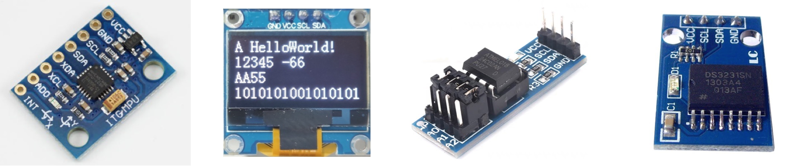

注

1. 异步传输对传输时间要求高，非常依赖硬件外设的支持；同步传输可以暂停传输，极大地降低单片机对硬件电路的支持
2. USART在传输过程中始终有一条信号线空闲，导致资源的浪费
3. 一主多从模式下，I2C总线上只有一个主设备（Master），但可以连接多个从设备（Slave）。每个从设备都有一个唯一的地址（通常是7位或10位），主设备通过地址来选择与之通信的从设备
4. 多主多从模式下，总线上可以有多个主设备和多个从设备。在这种模式下，任何时刻只能有一个主设备控制总线

**硬件电路**

- 所有I2C设备的SCL连在一起，SDA连在一起
- 设备的SCL和SDA均要配置成开漏输出模式
- SCL和SDA各添加一个上拉电阻，阻值一般为4.7KΩ左右

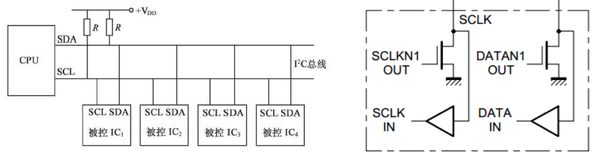

注

1. 主机任何时候都完全掌控SCL线；空闲状态下，主机可以主动发起对SDA的控制，只有从机发送数据和从机应答数据的时候，主机才会转交SDA的控制权给从机
2. 从机任何时刻都只能被动读取SCL的数据；对SDA数据线，从机不允许主动发起对SDA的控制
3. 为了避免总线没协调好（主从同时输出相反的高、低电平）出现电源短路问题，禁止所有设备输出强上拉的高电平，采用外置弱上拉加开漏输出的电路结构
4. 只要有任意一设备输出低电平，总线就处于低电平；只有所有的设备都输出高电平，总线才处于高电平
5. SCL和SDA由外挂的上拉电阻拉高至高电平
6. 同一条I2C总线中，挂载的每个设备地址必须不一样，如果地址相同可以改变地址可变部分（通过引脚灵活切换）

## 时序基本单元

**起始终止**

- 起始条件：SCL高电平期间，SDA从高电平切换到低电平，SCL随后变为低电平
- 终止条件：SCL由点电平转为高电平，在SCL高电平期间，SDA从低电平切换到高电平

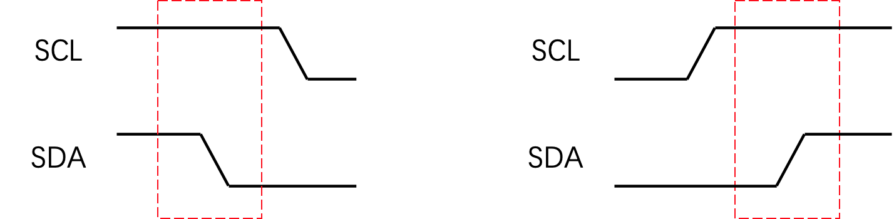

注

1. 默认状态下，SCL和SDA均为高电平
2. 每个时序单元的SCL都是以低电平开始，低电平结束
3. 一个完整的数据帧总是以起始条件开始、终止条件结束，并且起始和终止都由主机产生

**发送**

发送一个字节：SCL低电平期间，主机将数据位依次放到SDA线上（高位先行），然后释放SCL（拉高），从机将在SCL高电平期间读取数据位，所以SCL高电平期间SDA不允许有数据变化，依次循环上述过程8次，即可发送一个字节。


注

1. 即SCL低电平变换数据，高电平读出数据

**接收**

接收一个字节：SCL低电平期间，从机将数据位依次放到SDA线上（高位先行），然后释放SCL，主机将在SCL高电平期间读取数据位，所以SCL高电平期间SDA不允许有数据变化，依次循环上述过程8次，即可接收一个字节（主机在接收之前，需要释放SDA）。


**应答**

- 接收应答：主机在发送完一个字节之后，在下一个时钟接收一位数据，判断从机是否应答，数据0表示应答，数据1表示非应答（主机在接收之前，需要释放SDA）
- 发送应答：主机在接收完一个字节之后，在下一个时钟发送一位数据，数据0表示应答，从机继续发送数据，数据1表示非应答，从机停止发送数据


## I2C时序

**指定地址写**

- 对于指定设备（Slave Address），在指定地址（Reg Address）下，写入指定数据（Data）

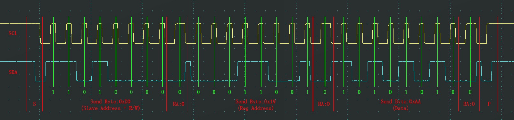

注

1. 起始时序后必须是发送一个字节的时序，字节内容必须是`从机地址+读写位`，用于确认通信对象和读写方式（0为写，1为读）
2. 写入一字节数据后，地址指针自动+1

**当前地址读**

- 对于指定设备（Slave Address），在当前地址指针指示的地址下，读取从机数据（Data）

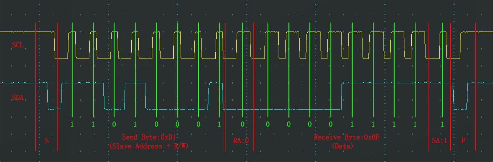

注

1. 不能指定地址读，一般地址为上一个地址的自增

**指定地址读**

- 对于指定设备（Slave Address），在指定地址（Reg Address）下，读取从机数据（Data）

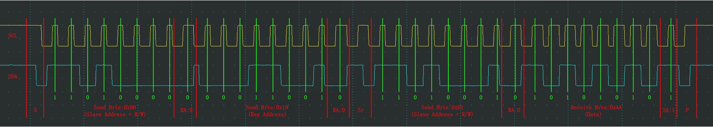

注

1. 指定地址写前部分+不指定地址读，即起始+指定地址+重复起始+读

## I2C外设

- STM32内部集成了硬件I2C收发电路，可以由硬件自动执行时钟生成、起始终止条件生成、应答位收发、数据收发等功能，减轻CPU的负担
- 支持多主机模型
- 支持7位/10位地址模式
- 支持不同的通讯速度，标准速度(高达100 kHz)，快速(高达400 kHz)
- 支持DMA
- 兼容SMBus协议

注

1. `11110`开头的地址作为10位地址模式的标识位不会出现在7位地址模式下
2. 硬件操作I2C更波形标准，但由于为同步通信，所以软件模拟的不标准的波形也不影响

**主机发送**

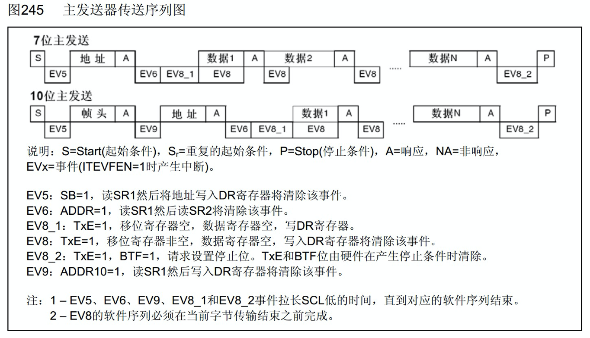

**主机接收**

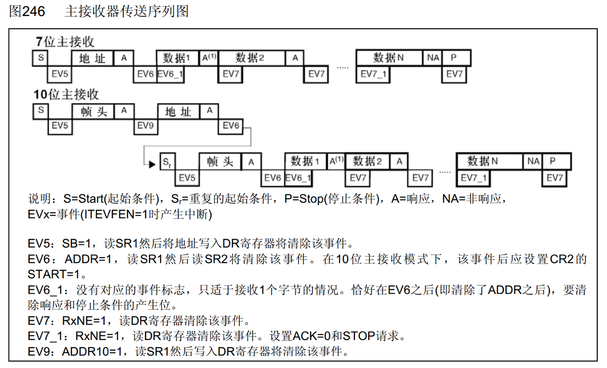

## 结构

**框图**

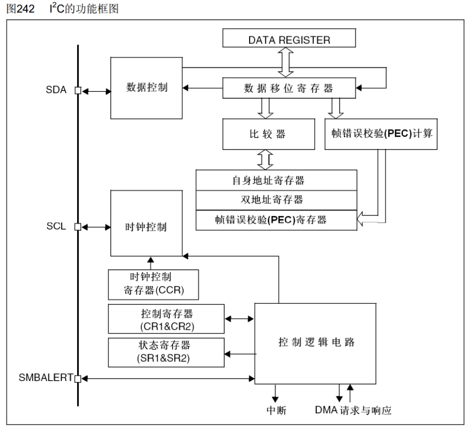

注

1. 数据寄存器和移位寄存器原理同USART
2. 具有中断功能

**基本结构**

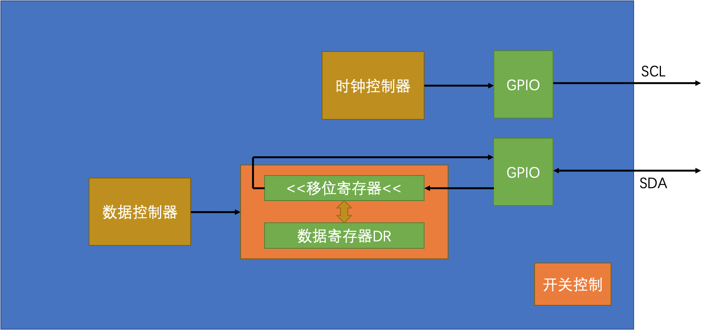

注

1. 两个GPIO需要配置为复用开漏输出模式

# SPI

## 简介

- SPI（Serial Peripheral Interface）是由Motorola公司开发的一种通用数据总线
- 四根通信线：SCK（Serial Clock）、MOSI（Master Output Slave Input）、MISO（Master Input Slave Output）、SS（Slave Select）
- 同步，全双工
- 支持总线挂载多设备（一主多从）

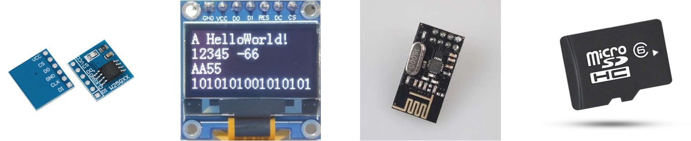

注

1. 由于I2C开漏外加上拉电阻使得通信高电平的驱动能力较弱，导致上升沿耗时较长，限制了最大通信速度（100-400KHz）,而SPI传输速率一般较高（80MHz左右）
2. SPI仅支持一主多从，不支持多主机，没有应答机制

**硬件电路**

- 所有SPI设备的SCK、MOSI、MISO分别连在一起
- 主机另外引出多条SS控制线，分别接到各从机的SS引脚
- 输出引脚配置为推挽输出，输入引脚配置为浮空或上拉输入

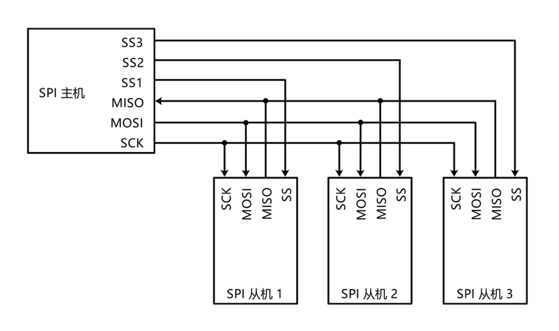

注

1. 有几个从机就有几根SS信号线，SS低电平有效，主机同一时间只能置一个SS为低电平
2. 对于单端信号，GND需要共地
3. 当从机SS引脚为高电平时（未被选中），其引脚MISO必须为高阻态（引脚断开，不输出任何电平），避免冲突，在SS为低电平时，MISO才允许变为推挽输出

**移位示意图**

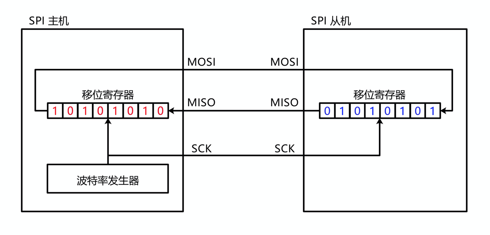

注

1. 波特率发生器上升沿所有移位寄存器向左移动一位，通过MOSI/MISO输出；波特率发生器下降沿，采样输入到移位寄存器的最低位
2. SPI的数据收发都是基于字节交换进行的
3. SPI在只执行发送或接收的时候，会存在资源浪费
4. SPI为高位优先传输

## 时序基本单元

**起始终止**

- 起始条件：SS从高电平切换到低电平
- 终止条件：SS从低电平切换到高电平


注

1. SS低电平期间表示正在通信

**交换一个字节（模式0）**

- CPOL=0：空闲状态时，SCK为低电平
- CPHA=0：SCK第一个边沿移入数据，第二个边沿移出数据
- 上升沿进行采样


注

1. 输入前需先将数据进行移出

**交换一个字节（模式1）**

- CPOL=0：空闲状态时，SCK为低电平
- CPHA=1：SCK第一个边沿移出数据，第二个边沿移入数据
- 下降沿进行采样


**交换一个字节（模式2）**

- CPOL=1：空闲状态时，SCK为高电平
- CPHA=0：SCK第一个边沿移入数据，第二个边沿移出数据
- 下降沿进行采样


**交换一个字节（模式3）**

- CPOL=1：空闲状态时，SCK为高电平
- CPHA=1：SCK第一个边沿移出数据，第二个边沿移入数据
- 上升沿进行采样


## 时序

**发送指令**

- 向SS指定的设备，发送指令（0x06）

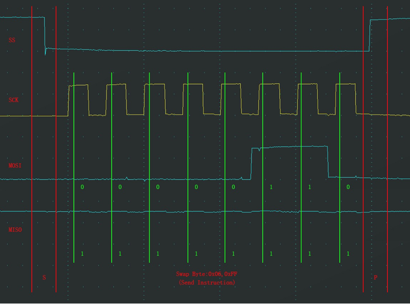

注

1. 与I2C读写寄存器模型不同的是，SPI采用的是指令码+读写数据的模型
2. 起始信号后跟一个指令码（不同型号外设指令码个数与数值不同）用来指导从机完成相应的功能

**指定地址写**

- 向SS指定的设备，发送写指令（0x02），随后在指定地址（Address[23:0]）下，写入指定数据（Data）

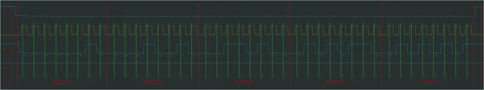

注

1. SPI中有跟I2C相同的地址指针，每读写一个字节，指针自动加1
2. 写数据期间，MISO处于“挂机”状态

**指定地址读**

- 向SS指定的设备，发送读指令（0x03），随后在指定地址（Address[23:0]）下，读取从机数据（Data）

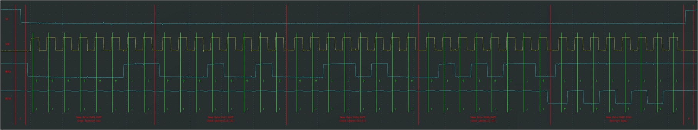

注

1. 读数据期间，MOSI处于“挂机”状态

## SPI外设

- STM32内部集成了硬件SPI收发电路，可以由硬件自动执行时钟生成、数据收发等功能，减轻CPU的负担
- 可配置8位/16位数据帧、高位先行/低位先行
- 时钟频率： f~PCLK~ / (2, 4, 8, 16, 32, 64, 128, 256)
- 可配置为主/从模式
- 可精简为半双工/单工通信
- 支持DMA
- 兼容I2S协议

注

1. 默认为8位、高位先行

**主模式全双工连续传输**

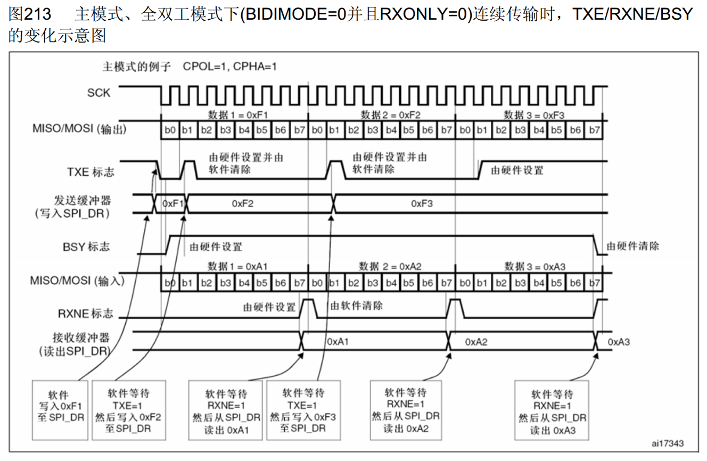

注

1. 读数据时，移位寄存器的数据会自动转入RDR，覆盖原有数据，所以要及时读出RDR
2. 一旦TXE=1，就会把下一个数据写入到TDR中
3. 对软件配合要求高，产生对应标志位后要及时进行处理
4. 传输字节之间没有空隙

**非连续传输**

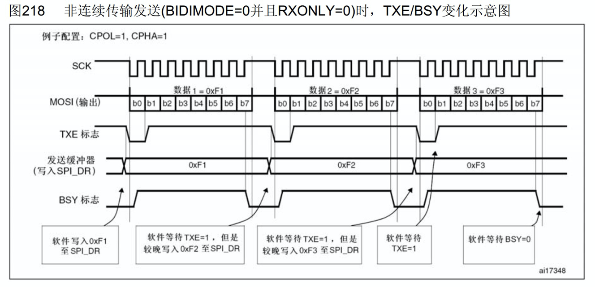

注

1. TXE=1后，等把第一个数据读出来之后，再写入下一个字节数据
2. MOSI会产生间隙，拖慢了整体数据传输的速度

## 结构

**框图**

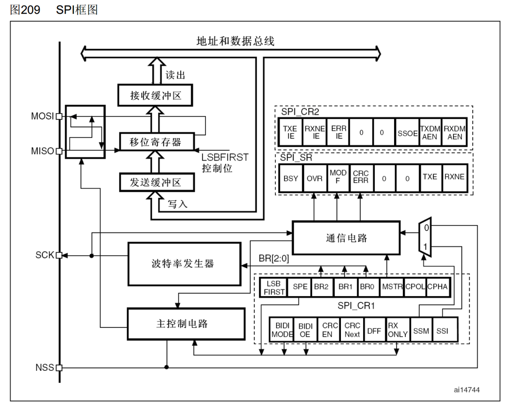

注

1. STM32既可以做主机，也可以做从机
2. 数据寄存器和移位寄存器共同实现了传输连续的数据流

**基本结构**

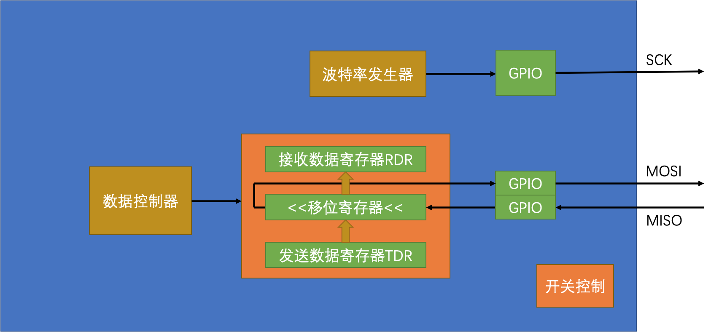

注

1. TDR数据整体转入移位寄存器时置TXE标志位；移位寄存器数据整体移入RDR时置RXEN标志位
2. 一主多从模式下，使用GPIO模拟SS较好

# CAN

## 简介

- CAN总线（Controller Area Network Bus）控制器局域网总线
- CAN总线是由BOSCH公司开发的一种简洁易用、传输速度快、易扩展、可靠性高的串行通信总线，广泛应用于汽车、嵌入式、工业控制等领域
- CAN总线特征
  - 两根通信线（CAN_H、CAN_L），线路少
  - 差分信号通信，抗干扰能力强
  - 高速CAN（ISO11898）：125k\~1Mbps, <40m
  - 低速CAN（ISO11519）：10k\~125kbps, <1km
  - 异步，无需时钟线，通信速率由设备各自约定
  - 半双工，可挂载多设备，多设备同时发送数据时通过仲裁判断先后顺序
  - 高位先行  
  - 11位/29位报文ID，用于区分消息功能，同时决定优先级，越小越高
  - 可配置1~8字节的有效载荷
  - 可实现广播式和请求式两种传输方式
  - 应答、CRC校验、位填充、位同步、错误处理等特性

注

1. 请求式下，发送方不会主动发送数据，而是先请求，后发送

**主流通信协议**

| 名称 |        引脚         |  双工  | 时钟 | 电平 |  设备  |           应用场景           |
| :--: | :-----------------: | :----: | :--: | :--: | :----: | :--------------------------: |
| UART |       TX、RX        | 全双工 | 异步 | 单端 | 点对点 |       两个设备互相通信       |
| I2C  |      SCL、SDA       | 半双工 | 同步 | 单端 | 多设备 |     一个主控外挂多个模块     |
| SPI  | SCK、MOSI、MISO、SS | 全双工 | 同步 | 单端 | 多设备 | 一个主控外挂多个模块（高速） |
| CAN  |    CAN_H、CAN_L     | 半双工 | 异步 | 差分 | 多设备 |       多个主控互相通信       |

**硬件电路**

- 每个设备通过CAN收发器挂载在CAN总线网络上
- CAN控制器引出的TX和RX与CAN收发器相连，CAN收发器引出的CAN_H和CAN_L分别与总线的CAN_H和CAN_L相连
- 高速CAN使用闭环网络，CAN_H和CAN_L两端添加120Ω的终端电阻
- 低速CAN使用开环网络，CAN_H和CAN_L其中一端添加2.2kΩ的终端电阻

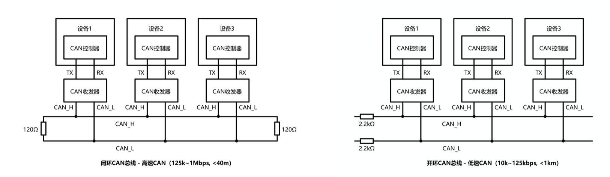

注

1. CAN收发器主要实现电平转换、输出驱动和输入采样等功能
2. CAN总线默认状态为高电平

**电平标准**

- CAN总线采用差分信号，即两线电压差（VCAN_H-VCAN_L）传输数据位
- 高速CAN规定
  - 电压差为0V时表示逻辑1（隐性电平）
  - 电压差为2V时表示逻辑0（显性电平）
- 低速CAN规定
  - 电压差为-1.5V时表示逻辑1（隐性电平）
  - 电压差为3V时表示逻辑0（显性电平）

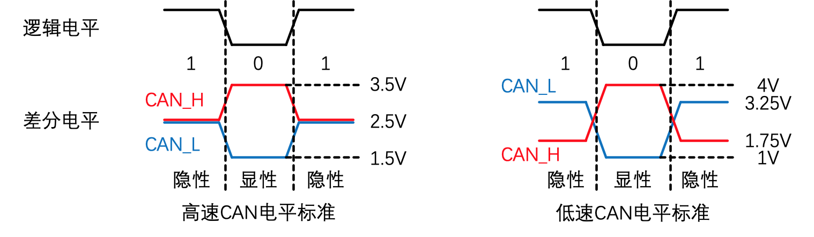

**物理层特性**

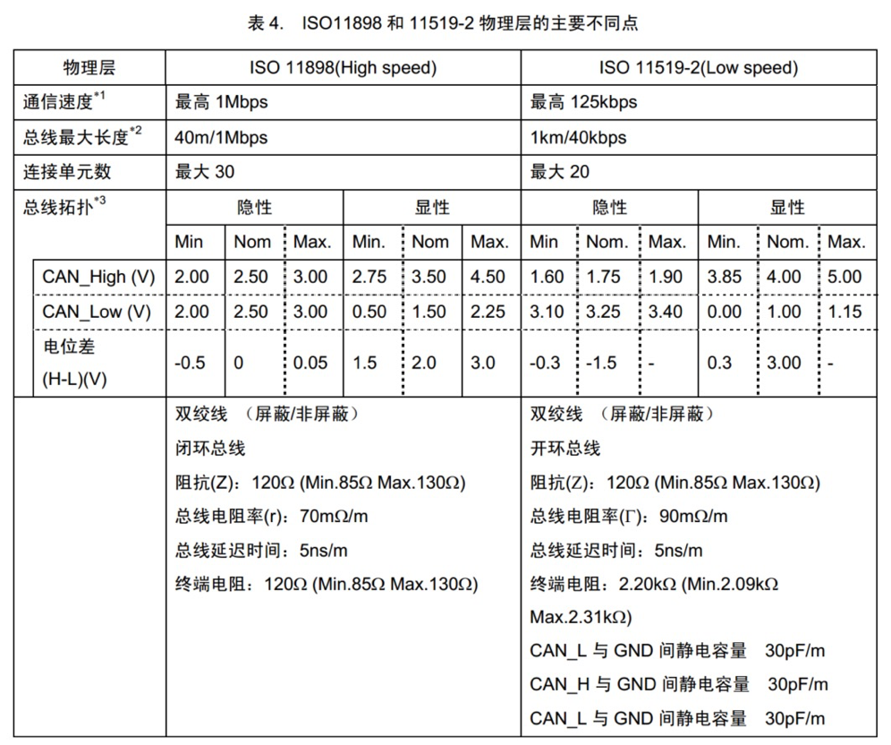

## 总线帧格式

- CAN协议规定了以下5种类型的帧

| 帧类型 |                  用途                  |
| :----: | :------------------------------------: |
| 数据帧 |     发送设备主动发送数据（广播式）     |
| 遥控帧 |     接收设备主动请求数据（请求式）     |
| 错误帧 | 某个设备检测出错误时向其他设备通知错误 |
| 过载帧 |     接收设备通知其尚未做好接收准备     |
| 帧间隔 |  用于将数据帧及遥控帧与前面的帧分离开  |

**数据帧**

- SOF（Start of Frame）：帧起始，表示后面一段波形为传输的数据位
- ID（Identify）：标识符，区分功能，同时决定优先级
- RTR（Remote Transmission Request ）：远程请求位，区分数据帧和遥控帧，类似于读写
- IDE（Identifier Extension）：扩展标志位，区分标准格式和扩展格式
- SRR（Substitute Remote Request）：替代RTR，协议升级时留下的无意义位
- r0/r1（Reserve）：保留位，为后续协议升级留下空间
- DLC（Data Length Code）：数据长度，指示数据段有几个字节
- Data：数据段的1~8个字节有效数据
- CRC（Cyclic Redundancy Check）：循环冗余校验，校验数据是否正确
- ACK（Acknowledgement）：应答位，判断数据有没有被接收方接收
- CRC/ACK界定符：为应答位前后发送方和接收方释放总线留下时间
- EOF（End of Frame ）：帧结束，表示数据位已经传输完毕

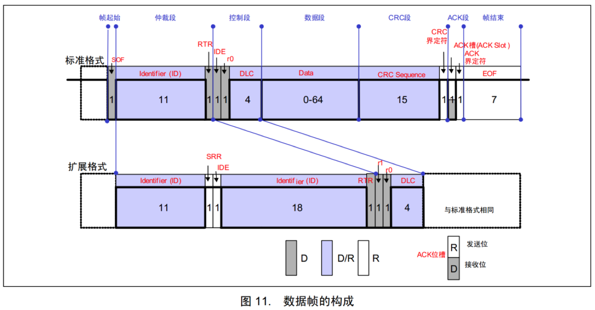

注

1. 扩展格式增加了ID位数，能承载更多种类的ID
2. 应答夹在发送的过程中

**遥控帧**

- 遥控帧无数据段，RTR为隐性电平1，其他部分与数据帧相同

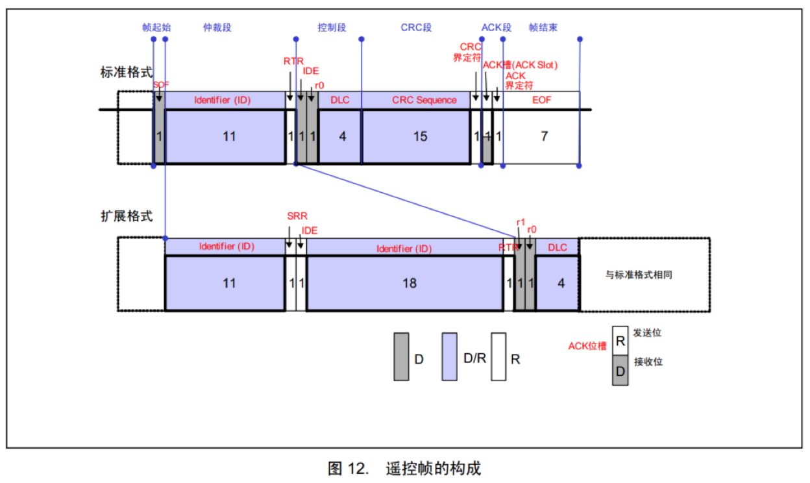

注

1. 通过广播的形式发送遥控帧，如果其中某个设备有对应ID数据，就会在通过数据帧，广播出来
2. 遥控帧适用偶尔使用的数据，如果数据使用频率高，则不适合使用遥控帧

**错误帧**

- 总线上所有设备都会监督总线的数据，一旦发现“位错误”或“填充错误”或“CRC错误”或“格式错误”或“应答错误” ，这些设备便会发出错误帧来破坏数据，同时终止当前的发送设备

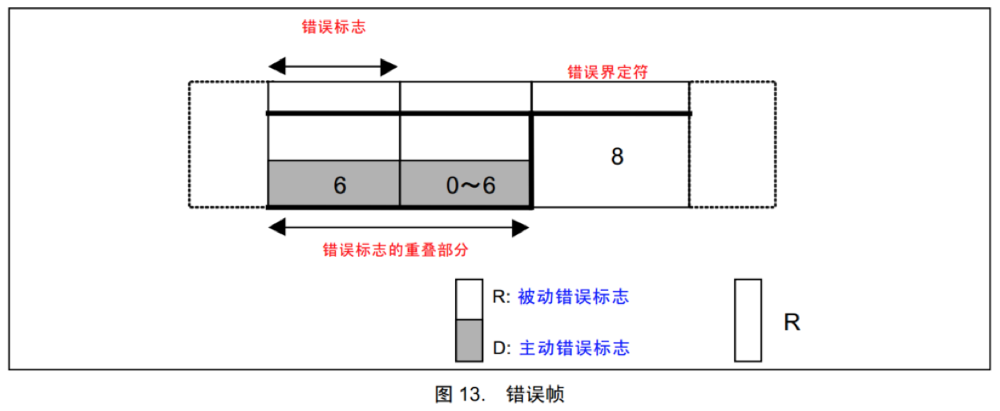

注

1. 设备默认处于主动错误状态，设备检测出错误时，会连发6个显性位，其他设备检测到该错误，就会抛弃这个数据
2. 主动错误产生频繁，设备进入被动错误状态，设备检测出错误时，会连发6个隐性位，不破坏别的设备所发的数据，但是会破坏自己发的数据

**过载帧**

- 当接收方收到大量数据而无法处理时，其可以发出过载帧，延缓发送方的数据发送，以平衡总线负载，避免数据丢失

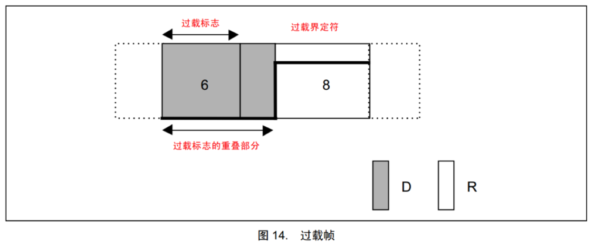

**帧间隔**

- 将数据帧和遥控帧与前面的帧分离开

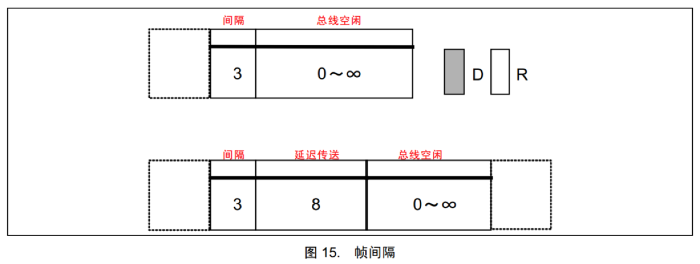

**位填充**

- 位填充规则：发送方每发送5个相同电平后，自动追加一个相反电平的填充位，接收方检测到填充位时，会自动移除填充位，恢复原始数据
- 例如
  - 即将发送    ： 100000110     10000011110         0111111111110
  - 实际发送    ： 1000001110   1000001111100     011111011111010
  - 实际接收    ： 1000001110   1000001111100     011111011111010
  - 移除填充后： 100000110     10000011110          0111111111110
- 位填充作用
  - 增加波形的定时信息，利于接收方执行“再同步”，防止波形长时间无变化，导致接收方不能精确掌握数据采样时机
  - 将正常数据流与“错误帧”和“过载帧”区分开，标志“错误帧”和“过载帧”的特异性
  - 保持CAN总线在发送正常数据流时的活跃状态，防止被误认为总线空闲

**波形实例**

- 标准数据帧，报文ID为0x555，数据长度1字节，数据内容为0xAA

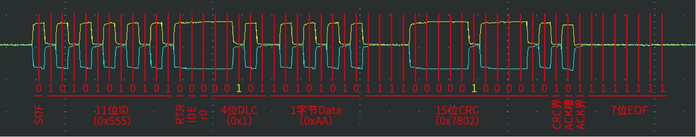

- 标准数据帧，报文ID为0x666，数据长度2字节，数据内容为0x12, 0x34

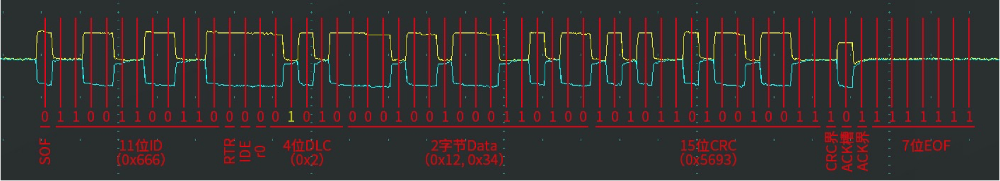

- 扩展数据帧，报文ID为0x0789ABCD，数据长度1字节，数据内容为0x56

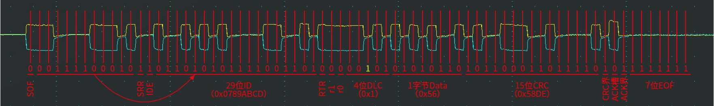

- 标准遥控帧，报文ID为0x088，数据长度1字节，无数据内容

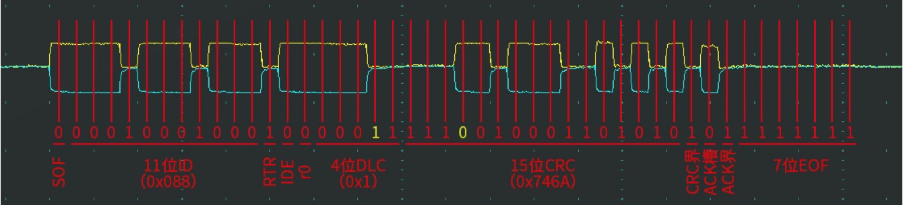

## 接收采样

- CAN总线没有时钟线，总线上的所有设备通过约定波特率的方式确定每一个数据位的时长
- 发送方以约定的位时长每隔固定时间输出一个数据位
- 接收方以约定的位时长每隔固定时间采样总线的电平，输入一个数据位
- 理想状态下，接收方能依次采样到发送方发出的每个数据位，且采样点位于数据位中心附近

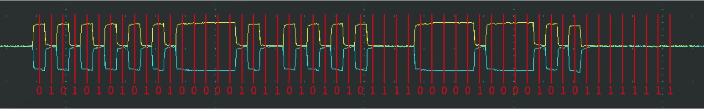

- 接收方以约定的位时长进行采样，但是采样点没有对齐数据位中心附近

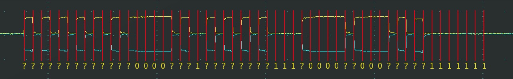

- 接收方刚开始采样正确，但是时钟有误差，随着误差积累，采样点逐渐偏离

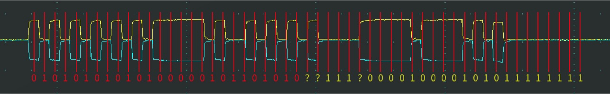

**位时序**

- 为了灵活调整每个采样点的位置，使采样点对齐数据位中心附近，CAN总线对每一个数据位的时长进行了更细的划分，分为同步段（SS）、传播时间段（PTS）、相位缓冲段1（PBS1）和相位缓冲段2（PBS2），每个段又由若干个最小时间单位（Tq）构成

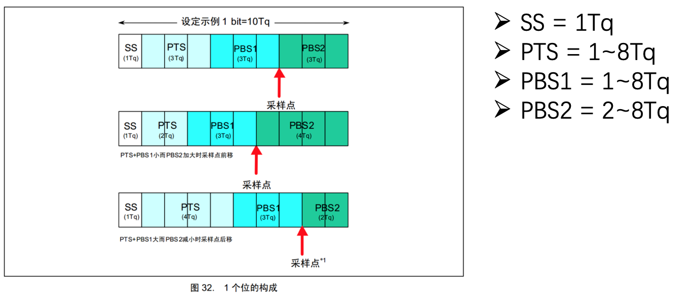

**硬同步**

- 初始位置同步，对齐波形初始位置
- 每个设备都有一个位时序计时周期，当某个设备（发送方）率先发送报文，其他所有设备（接收方）收到SOF的下降沿时，接收方会将自己的位时序计时周期拨到SS段的位置，与发送方的位时序计时周期保持同步
- 硬同步只在帧的第一个下降沿（SOF下降沿）有效
- 经过硬同步后，若发送方和接收方的时钟没有误差，则后续所有数据位的采样点必然都会对齐数据位中心附近

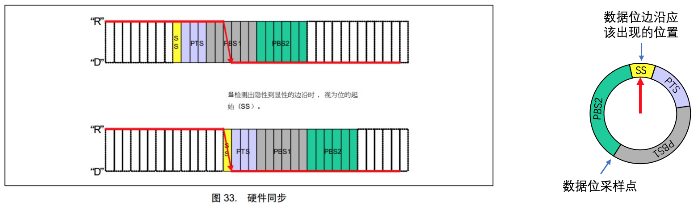

**再同步**

- 补偿误差
- 若发送方或接收方的时钟有误差，随着误差积累，数据位边沿逐渐偏离SS段，则此时接收方根据再同步补偿宽度值（SJW）通过加长PBS1段，或缩短PBS2段，以调整同步
- 再同步可以发生在第一个下降沿之后的每个数据位跳变边沿

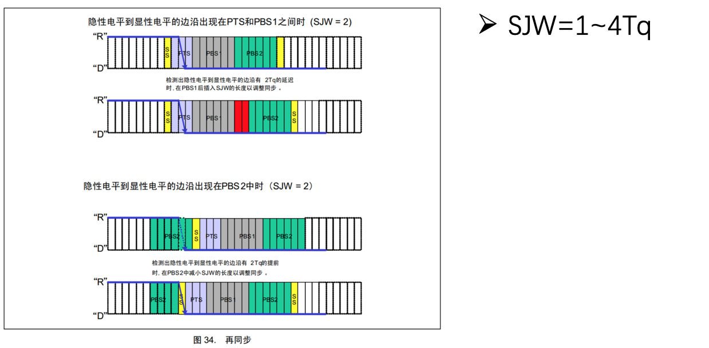

## 资源分配

- CAN总线只有一对差分信号线，同一时间只能有一个设备操作总线发送数据，若多个设备同时有发送需求，该如何分配总线资源？
- 解决问题的思路：制定资源分配规则，依次满足多个设备的发送需求，确保同一时间只有一个设备操作总线

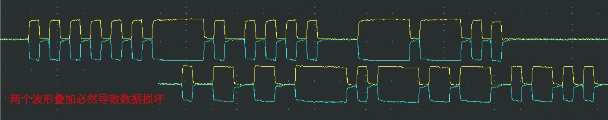

**先占先得（响应优先级）**

- 若当前已经有设备正在操作总线发送数据帧/遥控帧，则其他任何设备不能再同时发送数据帧/遥控帧（可以发送错误帧/过载帧破坏当前数据）
- 任何设备检测到连续11个隐性电平，即认为总线空闲，只有在总线空闲时，设备才能发送数据帧/遥控帧
- 一旦有设备正在发送数据帧/遥控帧，总线就会变为活跃状态，必然不会出现连续11个隐性电平，其他设备自然也不会破坏当前发送
- 若总线活跃状态其他设备有发送需求，则需要等待总线变为空闲，才能执行发送需求

**非破坏性仲裁（抢占优先级）**

- 若多个设备的发送需求同时到来或因等待而同时到来，则CAN总线协议会根据ID号（仲裁段）进行非破坏性仲裁，ID号小的（优先级高）取到总线控制权，ID号大的（优先级低）仲裁失利后将转入接收状态，等待下一次总线空闲时再尝试发送
- 实现非破坏性仲裁需要两个要求
  - 线与特性：总线上任何一个设备发送显性电平0时，总线就会呈现显性电平0状态，只有当所有设备都发送隐性电平1时，总线才呈现隐性电平1状态
  - 回读机制：每个设备发出一个数据位后，都会读回总线当前的电平状态，以确认自己发出的电平是否被真实地发送出去了，根据线与特性，发出0读回必然是0，发出1读回不一定是1

**非破坏性仲裁过程**

- 数据位从前到后依次比较，出现差异且数据位为1的设备仲裁失利

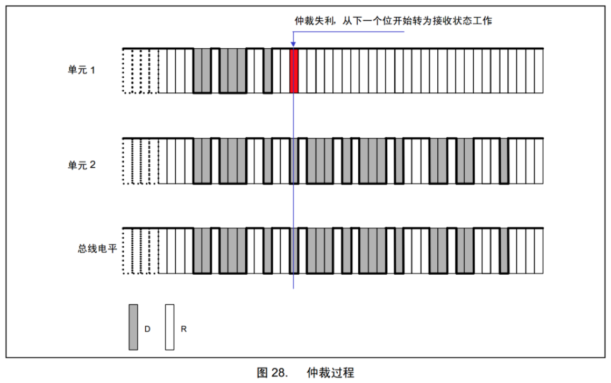

**数据帧和遥控帧的优先级**

- 数据帧和遥控帧ID号一样时，数据帧的优先级高于遥控帧

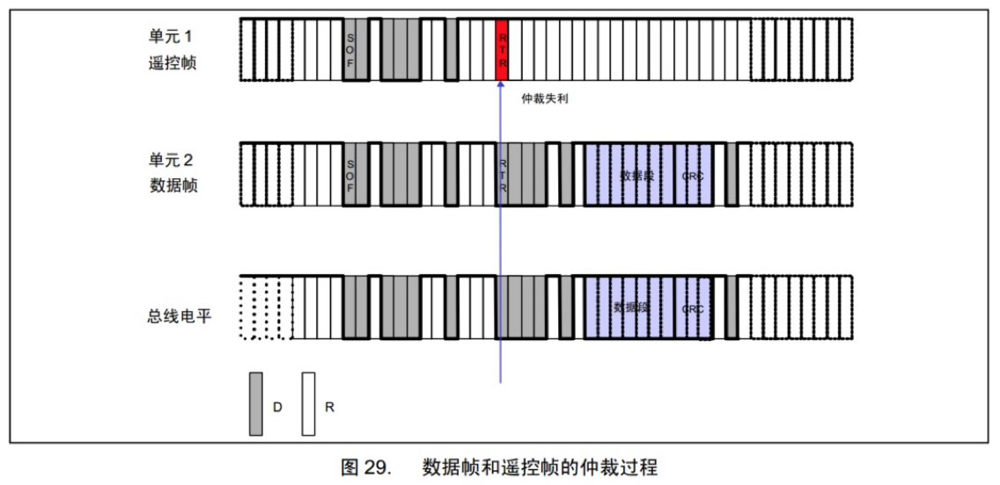

**标准格式和扩展格式的优先级**

- 标准格式11位ID号和扩展格式29位ID号的高11位一样时，标准格式的优先级高于扩展格式（SRR必须始终为1，以保证此要求）

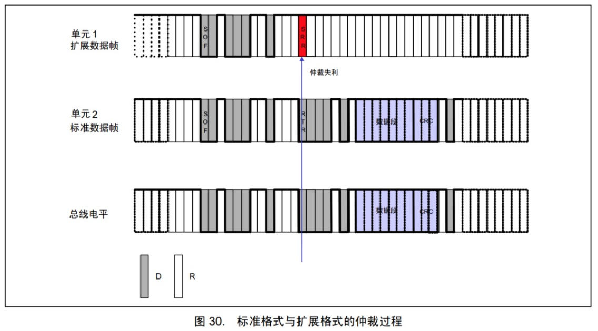

## 错误处理

当某个设备检测到总线的帧传输出错时，可以主动发送错误帧，通知每个设备丢掉该错误帧。

**错误类型**

- 错误共有5种： 位错误、填充错误、CRC错误、格式错误、应答错误

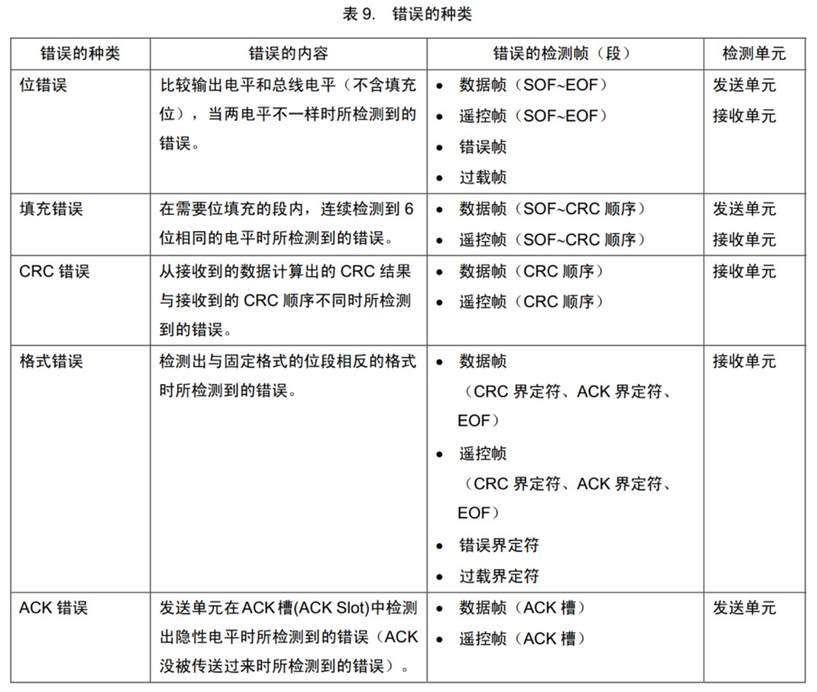

**错误状态**

- 主动错误状态的设备正常参与通信并在检测到错误时发出主动错误帧
- 被动错误状态的设备正常参与通信但检测到错误时只能发出被动错误帧
- 总线关闭状态的设备不能参与通信
- 每个设备内部管理一个TEC和REC，根据TEC和REC的值确定自己的状态

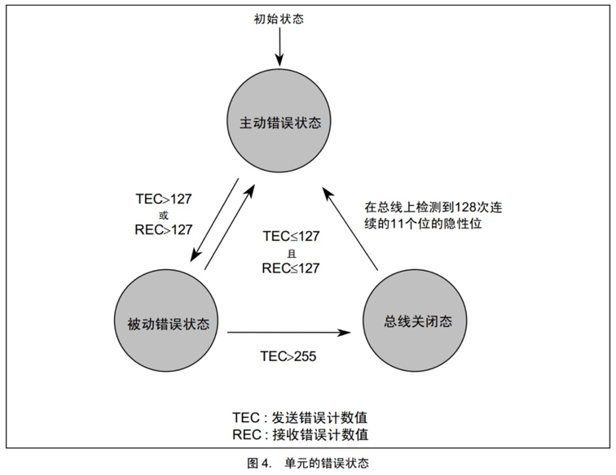

**错误计数器**

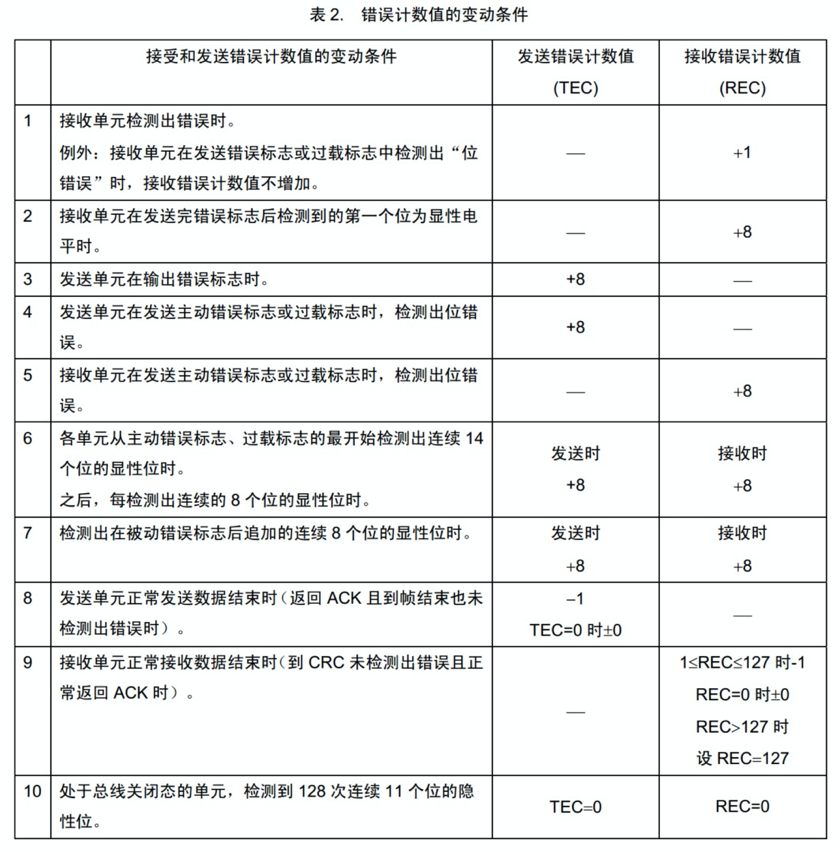

**波形示例**

- 设备处于主动错误状态，发送标准数据帧，正常传输

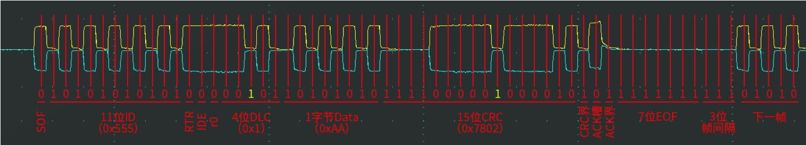

- 设备处于主动错误状态，发送标准数据帧，检测到ACK错误

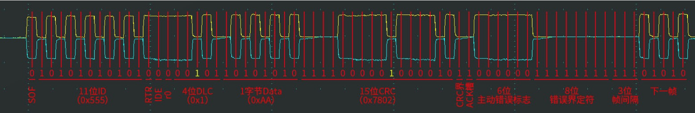

- 设备处于被动错误状态，发送标准数据帧，检测到ACK错误

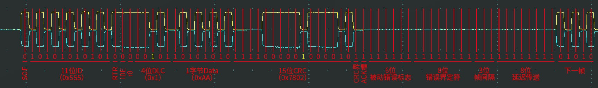

## CAN外设

- STM32内置bxCAN外设（CAN控制器），支持CAN2.0A和2.0B，可以自动发送CAN报文和按照过滤器自动接收指定CAN报文，程序只需处理报文数据而无需关注总线的电平细节
- 波特率最高可达1兆位/秒
- 3个可配置优先级的发送邮箱
- 2个3级深度的接收FIFO
- 14个过滤器组（互联型28个）
- 时间触发通信、自动离线恢复、自动唤醒、禁止自动重传、接收FIFO溢出处理方式可配置、发送优先级可配置、双CAN模式

**CAN网拓扑结构**

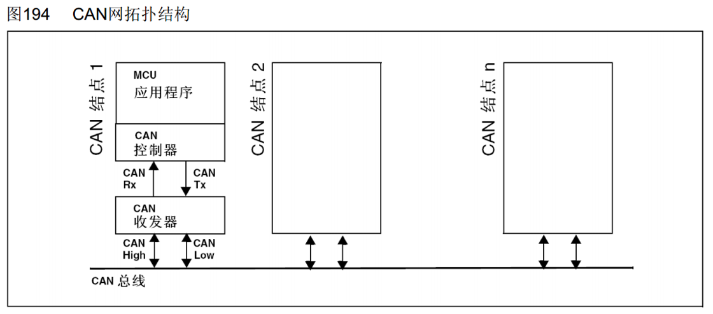

**框图**

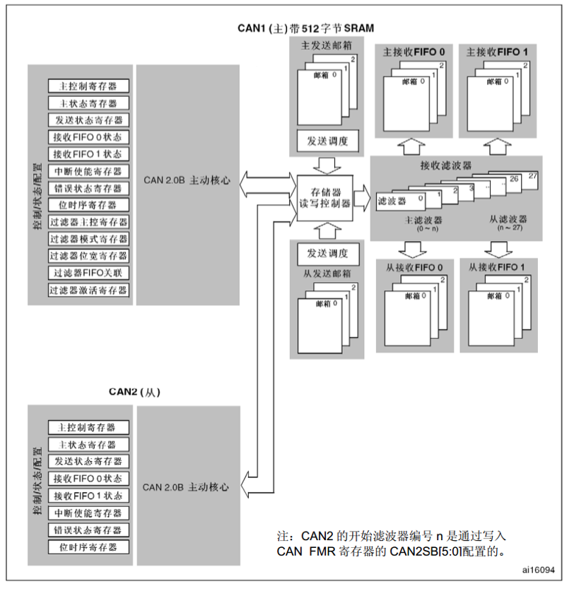

**基本结构**

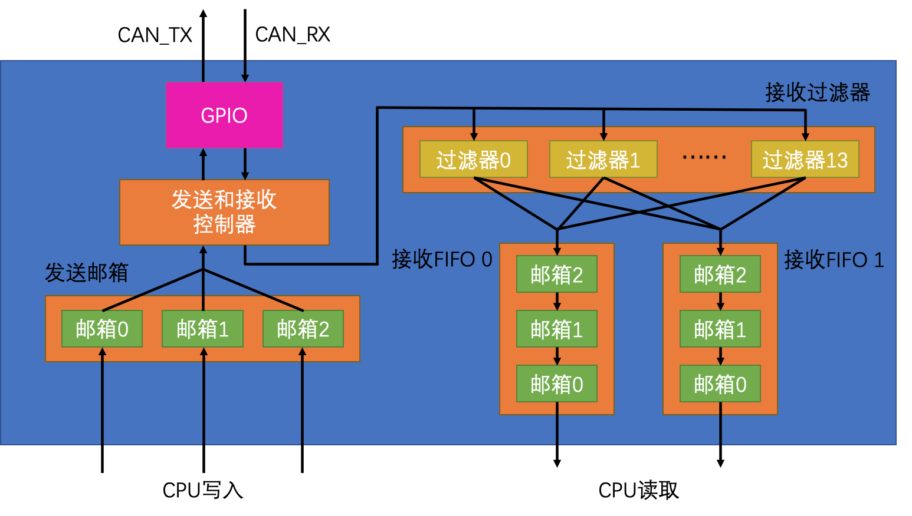

**发送过程**

- 基本流程：选择一个空置邮箱→写入报文 →请求发送

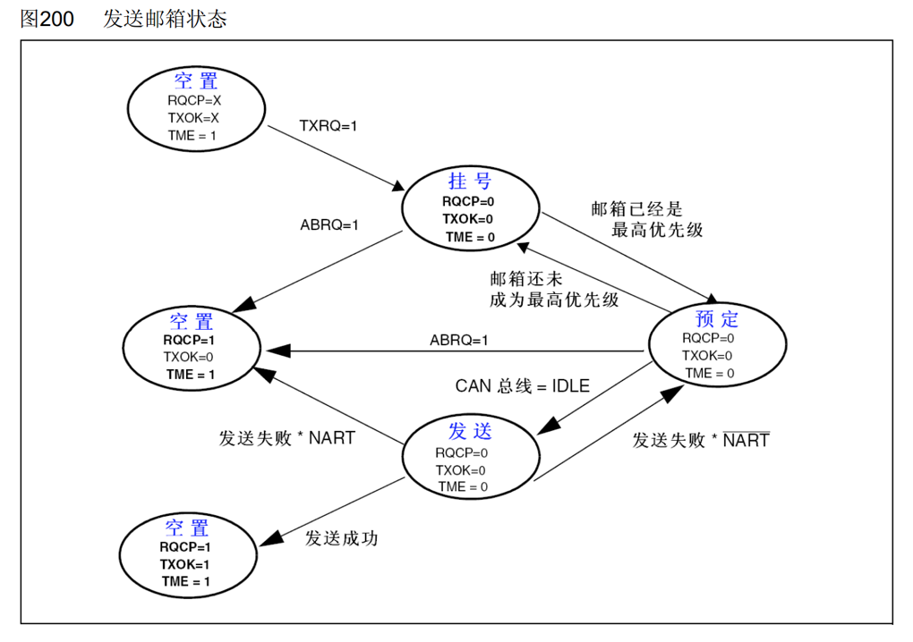

**接收过程**

- 基本流程：接收到一个报文→匹配过滤器后进入FIFO 0或FIFO 1→CPU读取

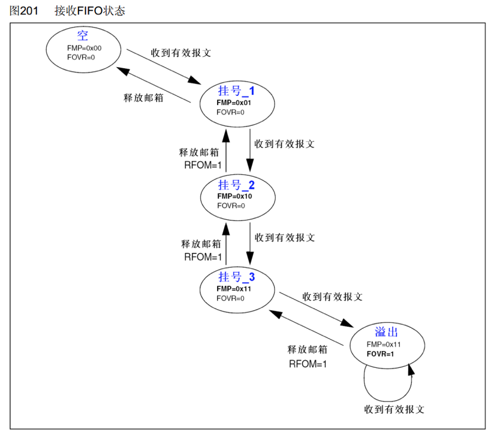

**发送和接收配置位**

- NART：置1，关闭自动重传，CAN报文只被发送1次，不管发送的结果如何（成功、出错或仲裁丢失）；置0，自动重传，CAN硬件在发送报文失败时会一直自动重传直到发送成功
- TXFP：置1，优先级由发送请求的顺序来决定，先请求的先发送；置0，优先级由报文标识符来决定，标识符值小的先发送（标识符值相等时，邮箱号小的报文先发送）
- RFLM：置1，接收FIFO锁定，FIFO溢出时，新收到的报文会被丢弃；置0，禁用FIFO锁定，FIFO溢出时，FIFO中最后收到的报文被新报文覆盖

**标识符过滤器**

- 每个过滤器的核心由两个32位寄存器组成：R1[31:0]和R2[31:0]
- FSCx：位宽设置，置0，16位；置1，32位
- FBMx：模式设置，置0，屏蔽模式；置1，列表模式
- FFAx：关联设置，置0，FIFO 0；置1，FIFO 1
- FACTx：激活设置，置0，禁用；置1，启用

**测试模式**

- 静默模式：用于分析CAN总线的活动，不会对总线造成影响
- 环回模式：用于自测试，同时发送的报文可以在CAN_TX引脚上检测到
- 环回静默模式：用于热自测试，自测的同时不会影响CAN总线

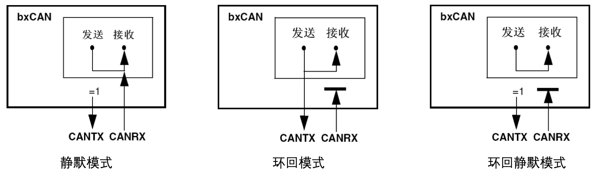

**工作模式**

- 初始化模式：用于配置CAN外设，禁止报文的接收和发送
- 正常模式：配置CAN外设后进入正常模式，以便正常接收和发送报文
- 睡眠模式：低功耗，CAN外设时钟停止，可使用软件唤醒或者硬件自动唤醒
- AWUM：置1，自动唤醒，一旦检测到CAN总线活动，硬件就自动清零SLEEP，唤醒CAN外设；置0，手动唤醒，软件清零SLEEP，唤醒CAN外设

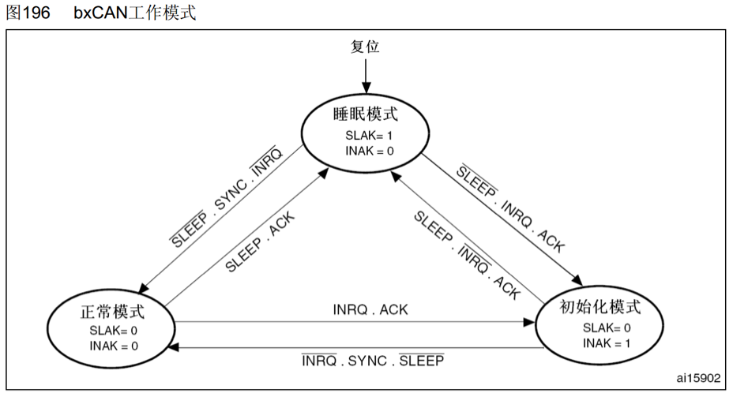

**位时间特性**

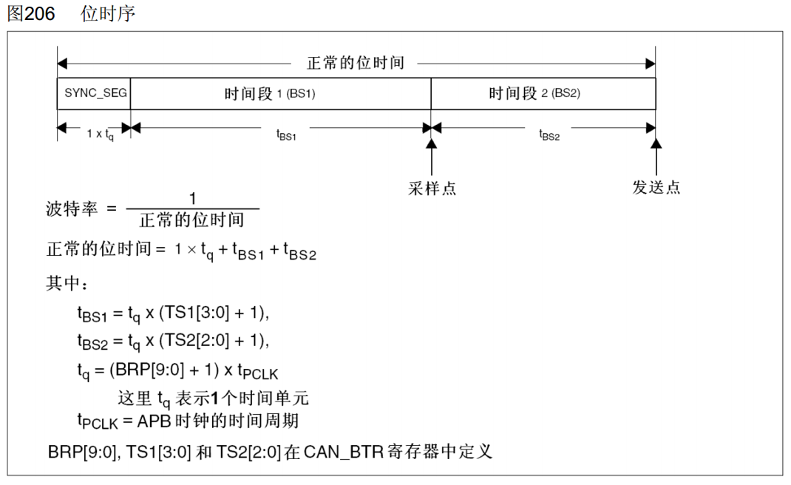

- SS = 1Tq
- BS1 = 1\~16Tq
- BS2 = 1\~8Tq
- SJW=1\~4Tq

**中断**

- CAN外设占用4个专用的中断向量
- 发送中断：发送邮箱空时产生
- FIFO 0中断：收到一个报文/FIFO 0满/FIFO 0溢出时产生
- FIFO 1中断：收到一个报文/FIFO 1满/FIFO 1溢出时产生
- 状态改变错误中断：出错/唤醒/进入睡眠时产生

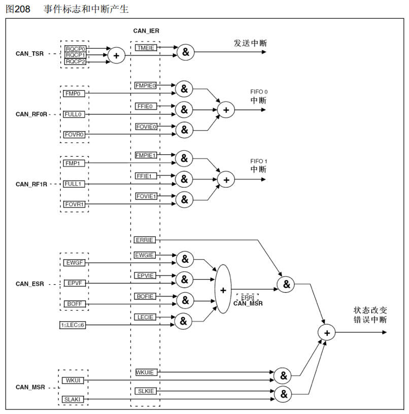

**时间触发通信**

- TTCM：置1，开启时间触发通信功能；置0，关闭时间触发通信功能
- CAN外设内置一个16位的计数器，用于记录时间戳
- TTCM置1后，该计数器在每个CAN位的时间自增一次，溢出后归零
- 每个发送邮箱和接收FIFO都有一个TIME[15:0]寄存器，发送帧SOF时，硬件捕获计数器值到发送邮箱的TIME寄存器，接收帧SOF时，硬件捕获计数器值到接收FIFO的TIME寄存器
- 发送邮箱可配置TGT位，捕获计数器值的同时，也把此值写入到数据帧数据段的最后两个字节，为了使用此功能，DLC必须设置为8

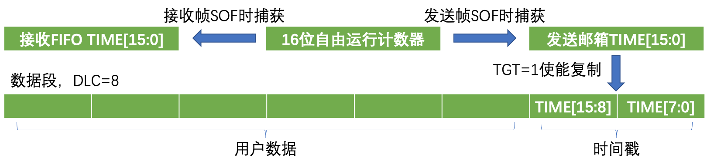

**错误处理和离线恢复**

- TEC和REC根据错误的情况增加或减少
- ABOM：置1，开启离线自动恢复，进入离线状态后，就自动开启恢复过程；置0，关闭离线自动恢复，软件必须先请求进入然后再退出初始化模式，随后恢复过程才被开启

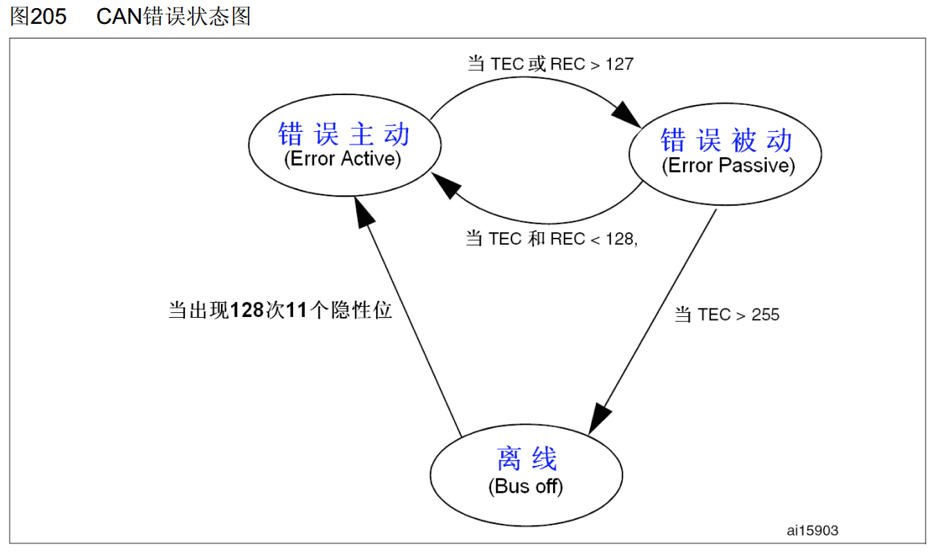

## CAN-FD

CAN-FD是传统CAN的升级版，主要改进了传输速率和数据域长度，以满足现代汽车和工业应用中对高带宽和大数据量传输的需求。

尽管CAN-FD向下兼容传统CAN帧，但传统CAN设备无法完全识别CAN-FD帧的高速数据段。

# BKP

## 简介

- BKP（Backup Registers）备份寄存器
- BKP可用于存储用户应用程序数据。当VDD（2.0\~3.6V）电源被切断，他们仍然由VBAT（1.8~3.6V）维持供电。当系统在待机模式下被唤醒，或系统复位或电源复位时，他们也不会被复位
- TAMPER引脚产生的侵入事件将所有备份寄存器内容清除
- RTC引脚输出RTC校准时钟、RTC闹钟脉冲或者秒脉冲
- 存储RTC时钟校准寄存器
- 用户数据存储容量
  - 20字节（中容量和小容量）
  -  84字节（大容量和互联型）

注

1. 使用时需要接备用电源
2. 由于BKP本质为RAM存储器，如果备用电源断电，则BKP中的数据清零

## 结构

**基本结构**

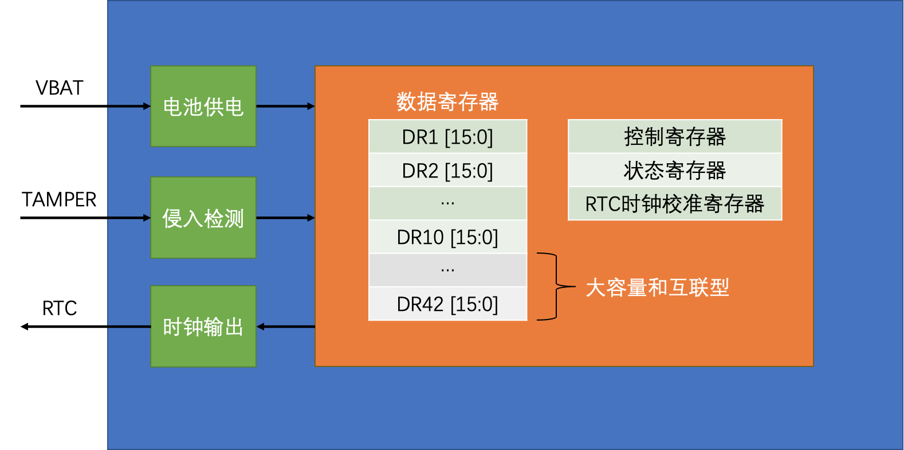

注

1. 当VDD主电源掉电时，后备区域仍可以由VBAT的备用电池供电；当VDD主电源上电时，后备区域供电会由VBAT切换为VDD， BKP就位于后备区域

## 实例

**读写备份寄存器**

```c
/* main.c */

#include "stm32f10x.h"                 
#include "Delay.h"
#include "OLED.h"
#include "Key.h"

uint8_t KeyNum;																						//定义用于接收按键键码的变量

uint16_t ArrayWrite[] = {0x1234, 0x5678};									//定义要写入数据的测试数组
uint16_t ArrayRead[2];																		//定义要读取数据的测试数组

int main(void)
{
	/*模块初始化*/
	OLED_Init();																						//OLED初始化
	Key_Init();																							//按键初始化
	
	/*显示静态字符串*/
	OLED_ShowString(1, 1, "W:");
	OLED_ShowString(2, 1, "R:");
	
	/*开启时钟*/
	RCC_APB1PeriphClockCmd(RCC_APB1Periph_PWR, ENABLE);			//开启PWR的时钟
	RCC_APB1PeriphClockCmd(RCC_APB1Periph_BKP, ENABLE);			//开启BKP的时钟
	
	/*备份寄存器访问使能*/
	PWR_BackupAccessCmd(ENABLE);														//使用PWR开启对备份寄存器的访问
	
	while (1)
	{
		KeyNum = Key_GetNum();									
		
		if (KeyNum == 1)			
		{
			ArrayWrite[0] ++;																		//测试数据自增
			ArrayWrite[1] ++;
			
			BKP_WriteBackupRegister(BKP_DR1, ArrayWrite[0]);		//写入测试数据到备份寄存器
			BKP_WriteBackupRegister(BKP_DR2, ArrayWrite[1]);
			
			OLED_ShowHexNum(1, 3, ArrayWrite[0], 4);						//显示写入的测试数据
			OLED_ShowHexNum(1, 8, ArrayWrite[1], 4);
		}
		
		ArrayRead[0] = BKP_ReadBackupRegister(BKP_DR1);				//读取备份寄存器的数据
		ArrayRead[1] = BKP_ReadBackupRegister(BKP_DR2);
		
		OLED_ShowHexNum(2, 3, ArrayRead[0], 4);								//显示读取的备份寄存器数据
		OLED_ShowHexNum(2, 8, ArrayRead[1], 4);
	}
}
```

# RTC

## 简介

- RTC（Real Time Clock）实时时钟
- RTC是一个独立的定时器，可为系统提供时钟和日历的功能
- RTC和时钟配置系统处于后备区域，系统复位时数据不清零，VDD（2.0\~3.6V）断电后可借助VBAT（1.8\~3.6V）供电继续走时
- 32位的可编程计数器，可对应Unix时间戳的秒计数器
- 20位的可编程预分频器，可适配不同频率的输入时钟
- 可选择三种RTC时钟源
  -  HSE时钟除以128（通常为8MHz/128）
  -  LSE振荡器时钟（通常为32.768KHz）
  -  LSI振荡器时钟（40KHz）

注

1. 高速时钟一般供内部程序和主要外设使用，低速时钟一般用于RTC、看门狗等使用
2. 32768KHz是专供RTC使用的，通过15位计数器产生溢出信号，从而实现1Hz
3. 如果要选择掉电走时，必须选择32768KHz时钟，因为其掉电（VDD）仍运行

**RTC操作注意事项**

- 执行以下操作将使能对BKP和RTC的访问
  - 设置RCC_APB1ENR的PWREN和BKPEN，使能PWR和BKP时钟
  - 设置PWR_CR的DBP，使能对BKP和RTC的访问
- 若在读取RTC寄存器时，RTC的APB1接口曾经处于禁止状态，则软件首先必须等待RTC_CRL寄存器中的RSF位（寄存器同步标志）被硬件置1
- 必须设置RTC_CRL寄存器中的CNF位，使RTC进入配置模式后，才能写入RTC_PRL、RTC_CNT、RTC_ALR寄存器
- 对RTC任何寄存器的写操作，都必须在前一次写操作结束后进行。可以通过查询RTC_CR寄存器中的RTOFF状态位，判断RTC寄存器是否处于更新中。仅当RTOFF状态位是1时，才可以写入RTC寄存器

**Unix时间戳**

- Unix 时间戳（Unix Timestamp）定义为从UTC/GMT的1970年1月1日0时0分0秒开始所经过的秒数，不考虑闰秒
- 时间戳存储在一个秒计数器中，秒计数器为32位/64位的整型变量
- 世界上所有时区的秒计数器相同，不同时区通过添加偏移来得到当地时间


注

1. 简化了硬件电路
2. 方便计算时间间隔
3. 方便存储

**UTC/GMT**

- GMT（Greenwich Mean Time）格林尼治标准时间是一种以地球自转为基础的时间计量系统。它将地球自转一周的时间间隔等分为24小时，以此确定计时标准
- UTC（Universal Time Coordinated）协调世界时是一种以原子钟为基础的时间计量系统。它规定铯133原子基态的两个超精细能级间在零磁场下跃迁辐射9,192,631,770周所持续的时间为1秒。当原子钟计时一天的时间与地球自转一周的时间相差超过0.9秒时，UTC会执行闰秒来保证其计时与地球自转的协调一致

注

1. GMT存在误差，每天并不是固定24小时；UTC误差小，上千万年才误差一秒

**时间戳转换**

- C语言的time.h模块提供了时间获取和时间戳转换的相关函数，可以方便地进行秒计数器、日期时间和字符串之间的转换

|                             函数                             |                  作用                  |
| :----------------------------------------------------------: | :------------------------------------: |
|                    time_t time(time_t*);                     |              获取系统时钟              |
|              struct tm* gmtime(const time_t*);               | 秒计数器转换为日期时间（格林尼治时间） |
|             struct tm* localtime(const time_t*);             |   秒计数器转换为日期时间（当地时间）   |
|                  time_t mktime(struct tm*);                  |   日期时间转换为秒计数器（当地时间）   |
|                 char* ctime(const time_t\*);                 |    秒计数器转换为字符串（默认格式）    |
|              char\* asctime(const struct tm\*);              |    日期时间转换为字符串（默认格式）    |
| size_t strftime(char\*, size_t, const  char\*, const struct tm*); |   日期时间转换为字符串（自定义格式）   |

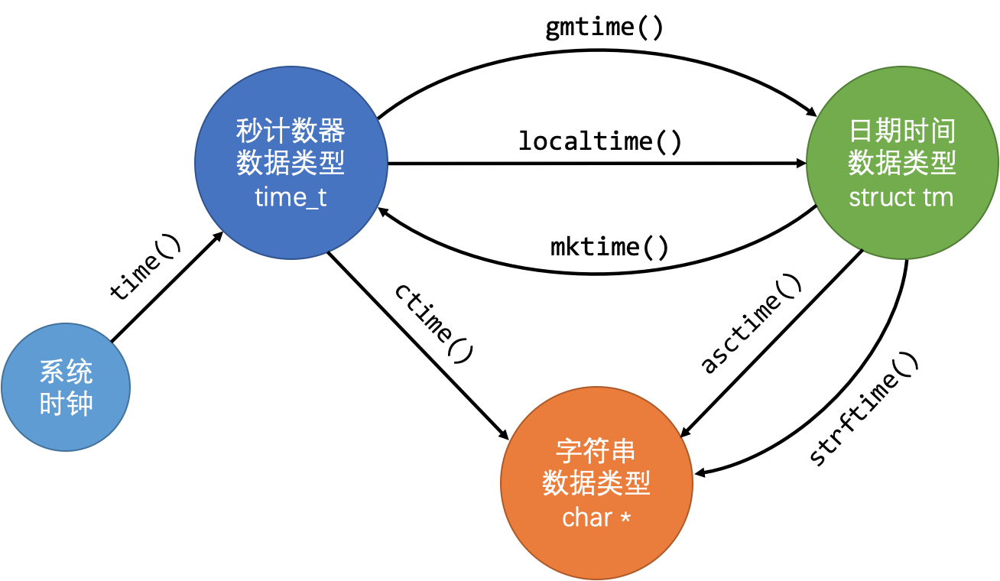

## 结构

**框图**

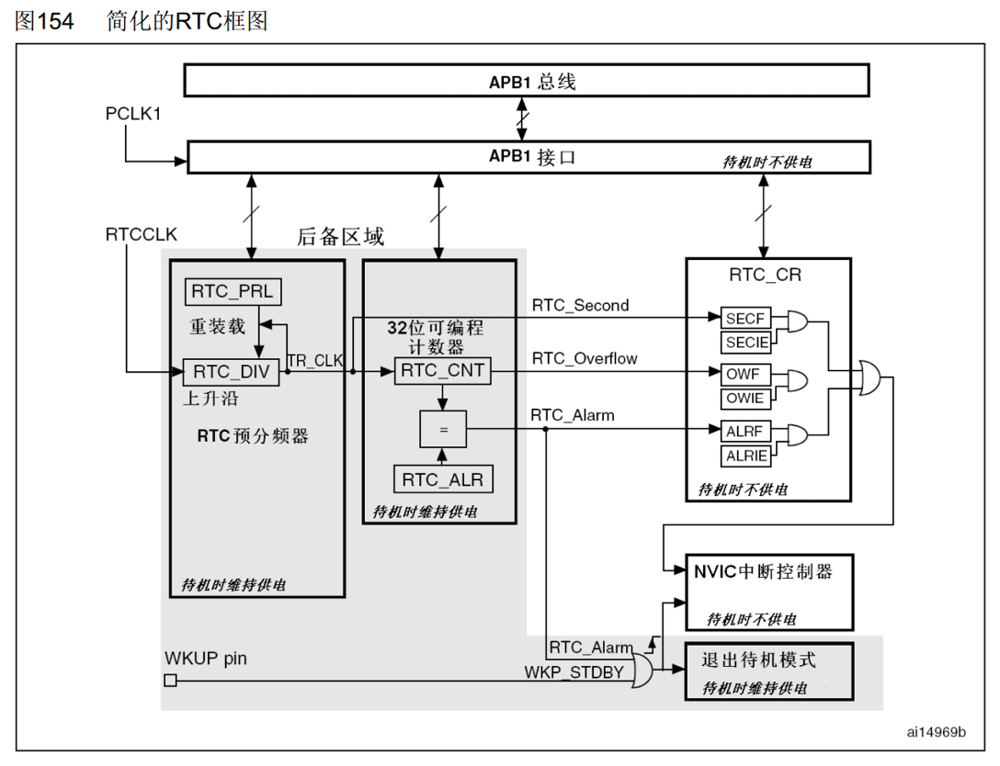

注

1. RTC_CONT可以看成Unix的时间戳的秒计数器，通过其可以获取时间（时间戳）
2. 当RTC_CONT = RTC_ALR时，可以产生中断，从而实现定时功能，同时还可以让主机退出待机模式
3. RTC_ALR是定值，如果要实现周期性闹钟，需要重复改写RTC_ALR
4. 中断
	- 秒中断：每秒产生一次中断
	- 溢出中断：RTC_CONT溢出时产生中断
	- 闹钟中断： RTC_CONT = RTC_ALR，产生中断
5. DIV在自减范围内，每自减一轮（减到0），CNT秒数加1，可以实现对秒数更细致的划分

**基本结构**

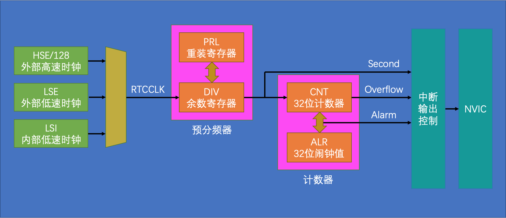

## 实例

**实时时钟**

```c
/* RTC.c */

#include "stm32f10x.h"                  								// Device header
#include <time.h>

uint16_t MyRTC_Time[] = {2023, 1, 1, 23, 59, 55};				//定义全局的时间数组，数组内容分别为年、月、日、时、分、秒

/**
  * 函    数：RTC初始化
  * 参    数：无
  * 返 回 值：无
  */
void MyRTC_Init(void)
{
	/*开启时钟*/
	RCC_APB1PeriphClockCmd(RCC_APB1Periph_PWR, ENABLE);		//开启PWR的时钟
	RCC_APB1PeriphClockCmd(RCC_APB1Periph_BKP, ENABLE);		//开启BKP的时钟
	
	/*备份寄存器访问使能*/
	PWR_BackupAccessCmd(ENABLE);													//使用PWR开启对备份寄存器的访问
	
	if (BKP_ReadBackupRegister(BKP_DR1) != 0xA5A5)				//通过写入备份寄存器的标志位，判断RTC是否是第一次配置
  //if成立则执行第一次的RTC配置
	{
		RCC_LSEConfig(RCC_LSE_ON);													//开启LSE时钟
		while (RCC_GetFlagStatus(RCC_FLAG_LSERDY) != SET);	//等待LSE准备就绪
		
		RCC_RTCCLKConfig(RCC_RTCCLKSource_LSE);							//选择RTCCLK来源为LSE
		RCC_RTCCLKCmd(ENABLE);															//RTCCLK使能
		
		RTC_WaitForSynchro();																//等待同步
		RTC_WaitForLastTask();															//等待上一次操作完成
		
		RTC_SetPrescaler(32768 - 1);												//设置RTC预分频器，预分频后的计数频率为1Hz
		RTC_WaitForLastTask();															//等待上一次操作完成
		
		MyRTC_SetTime();																		//设置时间，调用此函数，全局数组里时间值刷新到RTC硬件电路
		
		BKP_WriteBackupRegister(BKP_DR1, 0xA5A5);						//在备份寄存器写入自己规定的标志位，用于判断RTC是不是第一次执行配置
	}
	else																									//RTC不是第一次配置
	{
		RTC_WaitForSynchro();																//等待同步
		RTC_WaitForLastTask();															//等待上一次操作完成
	}
}

//如果LSE无法起振导致程序卡死在初始化函数中
//可将初始化函数替换为下述代码，使用LSI当作RTCCLK
//LSI无法由备用电源供电，故主电源掉电时，RTC走时会暂停
/* 
void MyRTC_Init(void)
{
	RCC_APB1PeriphClockCmd(RCC_APB1Periph_PWR, ENABLE);
	RCC_APB1PeriphClockCmd(RCC_APB1Periph_BKP, ENABLE);
	
	PWR_BackupAccessCmd(ENABLE);
	
	if (BKP_ReadBackupRegister(BKP_DR1) != 0xA5A5)
	{
		RCC_LSICmd(ENABLE);
		while (RCC_GetFlagStatus(RCC_FLAG_LSIRDY) != SET);
		
		RCC_RTCCLKConfig(RCC_RTCCLKSource_LSI);
		RCC_RTCCLKCmd(ENABLE);
		
		RTC_WaitForSynchro();
		RTC_WaitForLastTask();
		
		RTC_SetPrescaler(40000 - 1);
		RTC_WaitForLastTask();
		
		MyRTC_SetTime();
		
		BKP_WriteBackupRegister(BKP_DR1, 0xA5A5);
	}
	else
	{
		RCC_LSICmd(ENABLE);				//即使不是第一次配置，也需要再次开启LSI时钟
		while (RCC_GetFlagStatus(RCC_FLAG_LSIRDY) != SET);
		
		RCC_RTCCLKConfig(RCC_RTCCLKSource_LSI);
		RCC_RTCCLKCmd(ENABLE);
		
		RTC_WaitForSynchro();
		RTC_WaitForLastTask();
	}
}*/

/**
  * 函    数：RTC设置时间
  * 参    数：无
  * 返 回 值：无
  * 说    明：调用此函数后，全局数组里时间值将刷新到RTC硬件电路
  */
void MyRTC_SetTime(void)
{
	time_t time_cnt;																	//定义秒计数器数据类型
	struct tm time_date;															//定义日期时间数据类型
	
	time_date.tm_year = MyRTC_Time[0] - 1900;					//将数组的时间赋值给日期时间结构体
	time_date.tm_mon = MyRTC_Time[1] - 1;
	time_date.tm_mday = MyRTC_Time[2];
	time_date.tm_hour = MyRTC_Time[3];
	time_date.tm_min = MyRTC_Time[4];
	time_date.tm_sec = MyRTC_Time[5];
	
	time_cnt = mktime(&time_date) - 8 * 60 * 60;			//调用mktime函数，将日期时间转换为秒计数器格式
  //- 8 * 60 * 60为东八区的时区调整
	
	RTC_SetCounter(time_cnt);													//将秒计数器写入到RTC的CNT中
	RTC_WaitForLastTask();														//等待上一次操作完成
}

/**
  * 函    数：RTC读取时间
  * 参    数：无
  * 返 回 值：无
  * 说    明：调用此函数后，RTC硬件电路里时间值将刷新到全局数组
  */
void MyRTC_ReadTime(void)
{
	time_t time_cnt;															//定义秒计数器数据类型
	struct tm time_date;													//定义日期时间数据类型
	
	time_cnt = RTC_GetCounter() + 8 * 60 * 60;		//读取RTC的CNT，获取当前的秒计数器
  //+ 8 * 60 * 60为东八区的时区调整
	
	time_date = *localtime(&time_cnt);						//使用localtime函数，将秒计数器转换为日期时间格式
	
	MyRTC_Time[0] = time_date.tm_year + 1900;			//将日期时间结构体赋值给数组的时间
	MyRTC_Time[1] = time_date.tm_mon + 1;
	MyRTC_Time[2] = time_date.tm_mday;
	MyRTC_Time[3] = time_date.tm_hour;
	MyRTC_Time[4] = time_date.tm_min;
	MyRTC_Time[5] = time_date.tm_sec;
}
```

```c
/* main.c */

#include "stm32f10x.h"                  
#include "Delay.h"
#include "OLED.h"
#include "MyRTC.h"

int main(void)
{
	/*模块初始化*/
	OLED_Init();		
	MyRTC_Init();		
	
	/*显示静态字符串*/
	OLED_ShowString(1, 1, "Date:XXXX-XX-XX");
	OLED_ShowString(2, 1, "Time:XX:XX:XX");
	OLED_ShowString(3, 1, "CNT :");
	OLED_ShowString(4, 1, "DIV :");
	
	while (1)
	{
		MyRTC_ReadTime();														//RTC读取时间，最新的时间存储到MyRTC_Time数组中
		
		OLED_ShowNum(1, 6, MyRTC_Time[0], 4);				//显示MyRTC_Time数组中的时间值，年
		OLED_ShowNum(1, 11, MyRTC_Time[1], 2);			//月
		OLED_ShowNum(1, 14, MyRTC_Time[2], 2);			//日
		OLED_ShowNum(2, 6, MyRTC_Time[3], 2);				//时
		OLED_ShowNum(2, 9, MyRTC_Time[4], 2);				//分
		OLED_ShowNum(2, 12, MyRTC_Time[5], 2);			//秒
		
		OLED_ShowNum(3, 6, RTC_GetCounter(), 10);		//显示32位的秒计数器
		OLED_ShowNum(4, 6, RTC_GetDivider(), 10);		//显示余数寄存器
	}
}
```

# PWR

## 简介

- PWR（Power Control）电源控制
- PWR负责管理STM32内部的电源供电部分，可以实现可编程电压监测器和低功耗模式的功能
- 可编程电压监测器（PVD）可以监控VDD电源电压，当VDD下降到PVD阀值以下或上升到PVD阀值之上时，PVD会触发中断，用于执行紧急关闭任务
- 低功耗模式包括睡眠模式（Sleep）、停机模式（Stop）和待机模式（Standby），可在系统空闲时，降低STM32的功耗，延长设备使用时间

注

1. 低功耗模式需要考虑关闭哪些硬件、保留哪些硬件以及如何去唤醒
2. 关闭越多的硬件，设备越省电，唤醒就越麻烦
3. 使用待机模式省电，一定要将外部耗电电路关闭，否则无法做到真正的省电

**上电复位和掉电复位**

- 当电压过低时，主机产生复位，防止意外操作

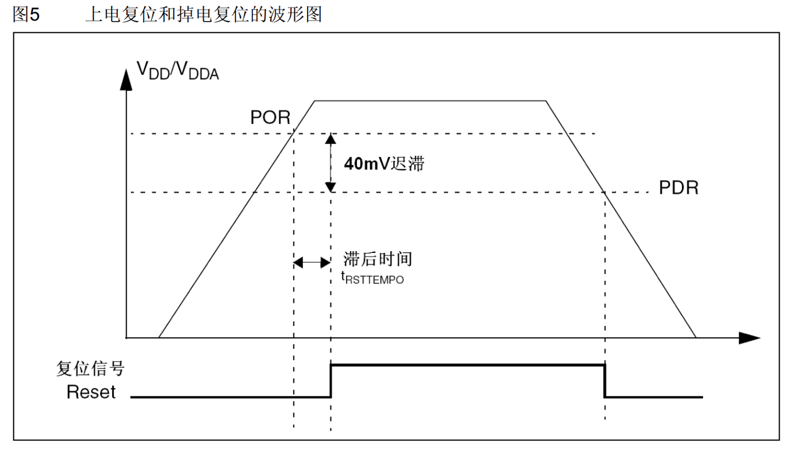

**可编程电压监测器**

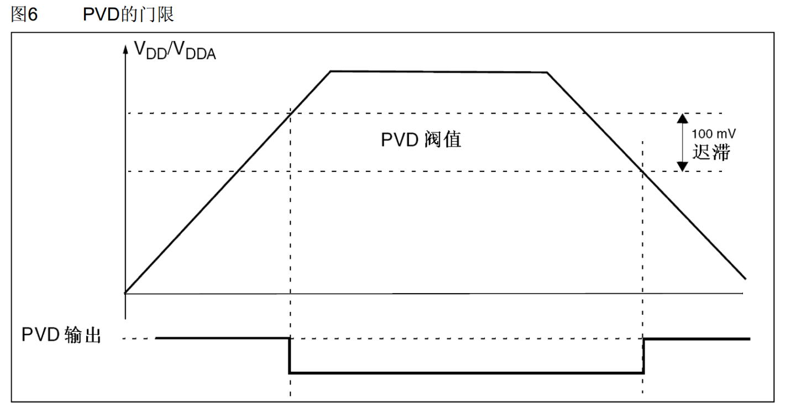

注

1. 可调节阈值电压

**低功耗模式**

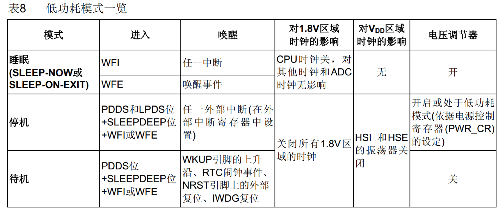

注

1. 从上到下，关闭的电路越来越多，越来越省电，越来越难唤醒
2. 电压调节器控制着1.8V区域
3. 关闭时钟，所有的运算和涉及时序的操作都会暂停，但寄存器中数据会维持；关闭电源就是电路直接断电，电路运算和数据都会丢失
4. `WFI`指令进入睡眠，通过使用任意中断来唤醒，`WFE`指令唤醒的条件是事件
5. 睡眠模式下，仅CPU无法运行
6. 停止模式下，不仅CPU无法运行，其他外设与高速时钟也暂停运行，但寄存器中的数据不丢失
7. 待机模式下，CPU、外设、高速时钟、寄存器均关闭，但RTC、独立看门狗仍可正常运行

**模式选择**

- 执行WFI（Wait For Interrupt）或者WFE（Wait For Event）指令后，STM32进入低功耗模式

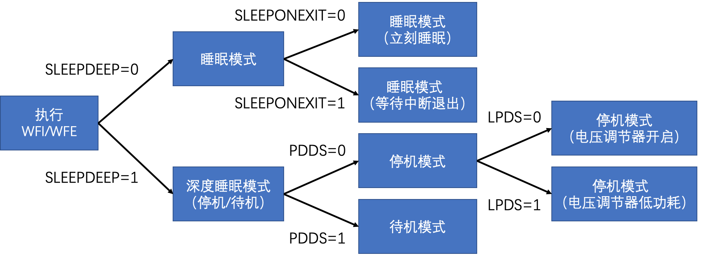

## 结构

**电源框图**

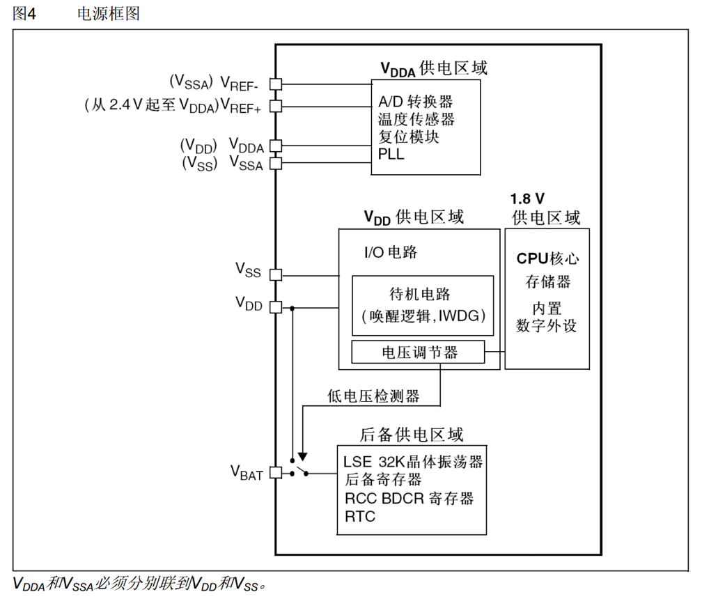

注

1. VDDA：模拟供电，主要负责模拟部分的供电，如AD转换器、温湿度传感器等
2. VDD：数字供电，如I/O电路，CPU核心（1.8V）、存储器（1.8V）等
3. VBAT：后备供电，如RTC、LSE晶体振荡器、后备寄存器等

## 低功耗模式

**睡眠模式**

- 执行完WFI/WFE指令后，STM32进入睡眠模式，程序暂停运行，唤醒后程序从暂停的地方继续运行
- SLEEPONEXIT位决定STM32执行完WFI或WFE后，是立刻进入睡眠，还是等STM32从最低优先级的中断处理程序中退出时进入睡眠
- 在睡眠模式下，所有的I/O引脚都保持它们在运行模式时的状态
- WFI指令进入睡眠模式，可被任意一个NVIC响应的中断唤醒
- WFE指令进入睡眠模式，可被唤醒事件唤醒

**停止模式**

- 执行完WFI/WFE指令后，STM32进入停止模式，程序暂停运行，唤醒后程序从暂停的地方继续运行
- 1.8V供电区域的所有时钟都被停止，PLL、HSI和HSE被禁止，SRAM和寄存器内容被保留下来
- 在停止模式下，所有的I/O引脚都保持它们在运行模式时的状态
- 当一个中断或唤醒事件导致退出停止模式时，HSI被选为系统时钟
- 当电压调节器处于低功耗模式下，系统从停止模式退出时，会有一段额外的启动延时
- WFI指令进入停止模式，可被任意一个EXTI中断唤醒
- WFE指令进入停止模式，可被任意一个EXTI事件唤醒

**待机模式**

- 执行完WFI/WFE指令后，STM32进入待机模式，唤醒后程序从头开始运行
- 整个1.8V供电区域被断电，PLL、HSI和HSE也被断电，SRAM和寄存器内容丢失，只有备份的寄存器和待机电路维持供电
- 在待机模式下，所有的I/O引脚变为高阻态（浮空输入）
- WKUP引脚的上升沿、RTC闹钟事件的上升沿、NRST引脚上外部复位、IWDG复位退出待机模式

## 实例

### 修改主频

```c
/* system_stm32f10x.c */

...
#if defined (STM32F10X_LD_VL) || (defined STM32F10X_MD_VL) || (defined STM32F10X_HD_VL)
/* #define SYSCLK_FREQ_HSE    HSE_VALUE */
 #define SYSCLK_FREQ_24MHz  24000000
#else
/* #define SYSCLK_FREQ_HSE    HSE_VALUE */
/* #define SYSCLK_FREQ_24MHz  24000000 */ 
#define SYSCLK_FREQ_36MHz  36000000
/* #define SYSCLK_FREQ_48MHz  48000000 */
/* #define SYSCLK_FREQ_56MHz  56000000 */
/* #define SYSCLK_FREQ_72MHz  72000000 */
#endif
...

```

```c
/* main.c */

#include "stm32f10x.h"                 
#include "Delay.h"
#include "OLED.h"

int main(void)
{
	OLED_Init();														//OLED初始化
	
	OLED_ShowString(1, 1, "SYSCLK:");				//显示静态字符串
	OLED_ShowNum(1, 8, SystemCoreClock, 8);	//显示SystemCoreClock变量
	//SystemCoreClock的值表示当前的系统主频频率
	
	while (1)
	{
		OLED_ShowString(2, 1, "Running");	//闪烁Running，指示当前主循环运行的快慢
		Delay_ms(500);
		OLED_ShowString(2, 1, "       ");
		Delay_ms(500);
	}
}
```

### 睡眠模式

```c
/* main.c */

#include "stm32f10x.h"                
#include "Delay.h"
#include "OLED.h"
#include "Serial.h"

uint8_t RxData;													//定义用于接收串口数据的变量

int main(void)
{
	OLED_Init();													//OLED初始化
	OLED_ShowString(1, 1, "RxData:");			//显示静态字符串
	
	Serial_Init();												//串口初始化
	
	while (1)
	{
		if (Serial_GetRxFlag() == 1)				//检查串口接收数据的标志位
		{
			RxData = Serial_GetRxData();			//获取串口接收的数据
			Serial_SendByte(RxData);					//串口将收到的数据回传回去，用于测试
			OLED_ShowHexNum(1, 8, RxData, 2);	//显示串口接收的数据
		}
		
		OLED_ShowString(2, 1, "Running");		//OLED闪烁Running，指示当前主循环正在运行
		Delay_ms(100);
		OLED_ShowString(2, 1, "       ");
		Delay_ms(100);
		
		__WFI();														//执行WFI指令，CPU睡眠，并等待中断唤醒
	}
}
```

### 停止模式

```c
/* main.c */
#include "stm32f10x.h"                  								// Device header
#include "Delay.h"
#include "OLED.h"
#include "CountSensor.h"

int main(void)
{
	/*模块初始化*/
	OLED_Init();																					//OLED初始化
	CountSensor_Init();																		//计数传感器初始化
	
	/*开启时钟*/
	RCC_APB1PeriphClockCmd(RCC_APB1Periph_PWR, ENABLE);		//开启PWR的时钟
  //停止模式和待机模式一定要记得开启
	
	/*显示静态字符串*/
	OLED_ShowString(1, 1, "Count:");
	
	while (1)
	{
		OLED_ShowNum(1, 7, CountSensor_Get(), 5);						//OLED不断刷新显示CountSensor_Get的返回值
		
		OLED_ShowString(2, 1, "Running");										//OLED闪烁Running，指示当前主循环正在运行
		Delay_ms(100);
		OLED_ShowString(2, 1, "       ");
		Delay_ms(100);
		
		PWR_EnterSTOPMode(PWR_Regulator_ON, PWR_STOPEntry_WFI);	//STM32进入停止模式，并等待中断唤醒
		SystemInit();																						//唤醒后，要重新配置时钟
	}
}
```

### 待机模式

```c
/* main.c */

#include "stm32f10x.h"                  									// Device header
#include "Delay.h"
#include "OLED.h"
#include "MyRTC.h"

int main(void)
{
	/*模块初始化*/
	OLED_Init();		
	MyRTC_Init();		
	
	/*开启时钟*/
	RCC_APB1PeriphClockCmd(RCC_APB1Periph_PWR, ENABLE);			//开启PWR的时钟
  //停止模式和待机模式一定要记得开启
	
	/*显示静态字符串*/
	OLED_ShowString(1, 1, "CNT :");
	OLED_ShowString(2, 1, "ALR :");
	OLED_ShowString(3, 1, "ALRF:");
	
	/*使能WKUP引脚*/
	PWR_WakeUpPinCmd(ENABLE);																//使能位于PA0的WKUP引脚，WKUP引脚上升沿唤醒待机模式
	
	/*设定闹钟*/
	uint32_t Alarm = RTC_GetCounter() + 10;									//闹钟为唤醒后当前时间的后10s
	RTC_SetAlarm(Alarm);																		//写入闹钟值到RTC的ALR寄存器
	OLED_ShowNum(2, 6, Alarm, 10);													//显示闹钟值
	
	while (1)
	{
		OLED_ShowNum(1, 6, RTC_GetCounter(), 10);									//显示32位的秒计数器
		OLED_ShowNum(3, 6, RTC_GetFlagStatus(RTC_FLAG_ALR), 1);		//显示闹钟标志位
		
		OLED_ShowString(4, 1, "Running");													//OLED闪烁Running，指示当前主循环正在运行
		Delay_ms(100);
		OLED_ShowString(4, 1, "       ");
		Delay_ms(100);
		
		OLED_ShowString(4, 9, "STANDBY");													//OLED闪烁STANDBY，指示即将进入待机模式
		Delay_ms(1000);
		OLED_ShowString(4, 9, "       ");
		Delay_ms(100);
		
		OLED_Clear();																							//OLED清屏，模拟关闭外部所有的耗电设备，以达到极度省电
		
		PWR_EnterSTANDBYMode();																		//STM32进入停止模式，并等待指定的唤醒事件（WKUP上升沿或RTC闹钟）
		/*待机模式唤醒后，程序会重头开始运行*/
	}
}
```

# WDG

## 简介

- WDG（Watchdog）看门狗
- 看门狗可以监控程序的运行状态，当程序因为设计漏洞、硬件故障、电磁干扰等原因，出现卡死或跑飞现象时，看门狗能及时复位程序，避免程序陷入长时间的罢工状态，保证系统的可靠性和安全性
- 看门狗本质上是一个定时器，当指定时间范围内，程序没有执行喂狗（重置计数器）操作时，看门狗硬件电路就自动产生复位信号
- STM32内置两个看门狗
  - 独立看门狗（IWDG）：独立工作，对时间精度要求较低
  - 窗口看门狗（WWDG）：要求看门狗在精确计时窗口起作用

注

1. 独立看门狗只要求最晚时间，而窗口看门狗要求在一定范围内喂狗，早了晚了都不行
2. 看门狗使用自减运行，减少到0后直接复位
3. 需要在自减到0前，主动重装，即喂狗
4. 系统复位后，看门狗总是处于关闭状态，当看门狗开启后，不再被关闭，除非发生复位

## IWDG

**IWDG框图**

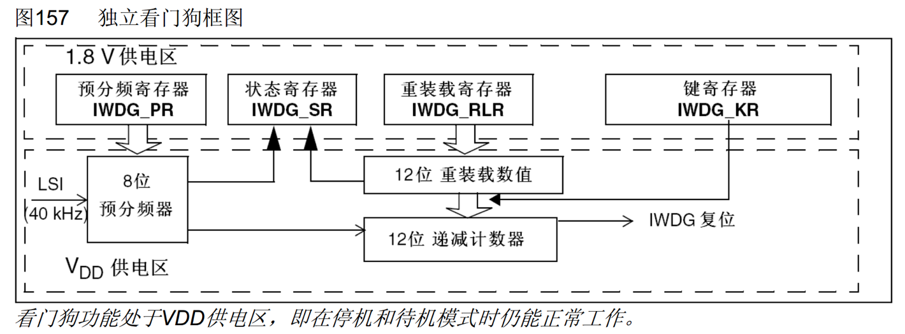

**IWDG键寄存器**

- 键寄存器本质上是控制寄存器，用于控制硬件电路的工作
- 在可能存在干扰的情况下，一般通过在整个键寄存器写入特定值来代替控制寄存器写入一位的功能，以降低硬件电路受到干扰的概率

|  写入键寄存器的值  |                  作用                  |
| :----------------: | :------------------------------------: |
|       0xCCCC       |             启用独立看门狗             |
|       0xAAAA       | IWDG_RLR中的值重新加载到计数器（喂狗） |
|       0x5555       |     解除IWDG_PR和IWDG_RLR的写保护      |
| 0x5555之外的其他值 |     启用IWDG_PR和IWDG_RLR的写保护      |

注

1. 相比单独地通过位控制，通过指令来控制的抗干扰能力更强

**IWDG超时时间**

- 超时时间：T~IWDG~ = T~LSI~ × PR预分频系数 × (RL + 1)
- 其中：T~LSI~ = 1 / F~LSI~ = 1/40k

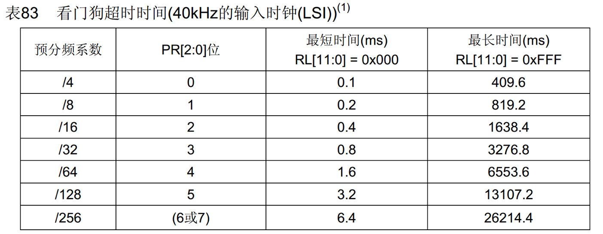

## WWDG

**WWDG框图** 

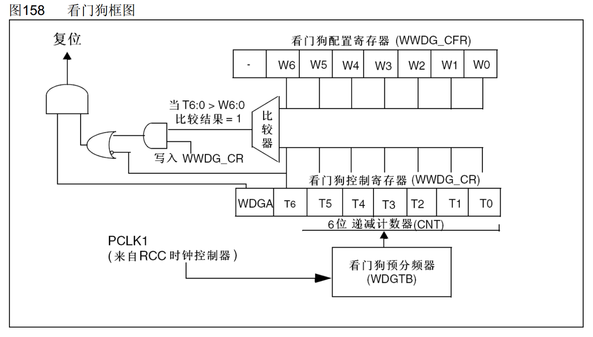

注

1. T6 = 0 ，代表溢出，产生复位信号

**WWDG工作特性**

- 递减计数器T[6:0]的值小于0x40时，WWDG产生复位
- 递减计数器T[6:0]在窗口W[6:0]外被重新装载时，WWDG产生复位
- 递减计数器T[6:0]等于0x40时可以产生早期唤醒中断（EWI），用于重装载计数器以避免WWDG复位
- 定期写入WWDG_CR寄存器（喂狗）以避免WWDG复位

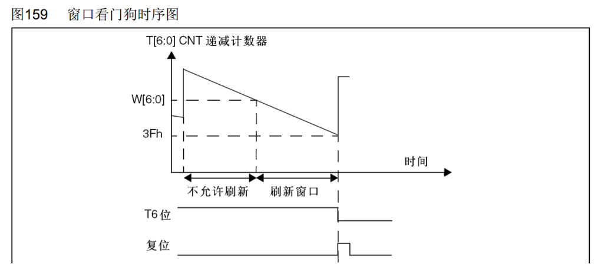

**WWDG超时时间**

- 超时时间：T~WWDG~ = T~PCLK1~ × 4096 × WDGTB预分频系数 × (T[5:0] + 1)
- 窗口时间：T~WIN~ = T~PCLK1~ × 4096 × WDGTB预分频系数 × (T[5:0] - W[5:0])
- 其中：T~PCLK1~ = 1 / F~PCLK1~ = 1/36M

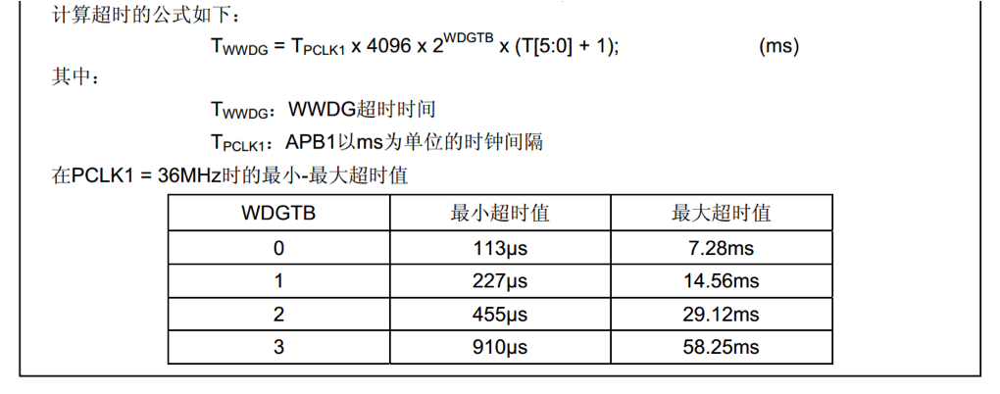

注

1. 喂狗即不能太早，也不能太晚

## 对比

|            |        IWDG独立看门狗        |           WWDG窗口看门狗            |
| :--------: | :--------------------------: | :---------------------------------: |
|    复位    |        计数器减到0后         | 计数器T[5:0]减到0后、过早重装计数器 |
|    中断    |              无              |            早期唤醒中断             |
|   时钟源   |         LSI（40KHz）         |           PCLK1（36MHz）            |
| 预分频系数 |    4、8、32、64、128、256    |             1、2、4、8              |
|   计数器   |             12位             |           6位（有效计数）           |
|  超时时间  |       0.1ms~26214.4ms        |            113us~58.25ms            |
|  喂狗方式  | 写入键寄存器，重装固定值RLR  |   直接写入计数器，写多少重装多少    |
|  防误操作  |       键寄存器和写保护       |                 无                  |
|    用途    | 独立工作，对时间精度要求较低 |   要求看门狗在精确计时窗口起作用    |

## 实例

### 独立看门狗

```c
/* main.c */

#include "stm32f10x.h"                  								// Device header
#include "Delay.h"
#include "OLED.h"
#include "Key.h"

int main(void)
{
	/*模块初始化*/
	OLED_Init();						
	Key_Init();							
	
	/*显示静态字符串*/
	OLED_ShowString(1, 1, "IWDG TEST");
	
	/*判断复位信号来源*/
	if (RCC_GetFlagStatus(RCC_FLAG_IWDGRST) == SET)				//如果是独立看门狗复位
	{
		OLED_ShowString(2, 1, "IWDGRST");										//OLED闪烁IWDGRST字符串
		Delay_ms(500);
		OLED_ShowString(2, 1, "       ");
		Delay_ms(100);
		
		RCC_ClearFlag();																			//清除标志位
	}
	else																										//否则，即为其他复位
	{
		OLED_ShowString(3, 1, "RST");													//OLED闪烁RST字符串
		Delay_ms(500);
		OLED_ShowString(3, 1, "   ");
		Delay_ms(100);
	}
	
	/*IWDG初始化*/
	IWDG_WriteAccessCmd(IWDG_WriteAccess_Enable);						//独立看门狗写使能
	IWDG_SetPrescaler(IWDG_Prescaler_16);										//设置预分频为16
	IWDG_SetReload(2499);																		//设置重装值为2499，独立看门狗的超时时间为1000ms
	IWDG_ReloadCounter();																		//重装计数器，喂狗
	IWDG_Enable();																					//独立看门狗使能
	
	while (1)
	{
		Key_GetNum();																					//调用阻塞式的按键扫描函数，模拟主循环卡死
		
		IWDG_ReloadCounter();																	//重装计数器，喂狗
		
		OLED_ShowString(4, 1, "FEED");												//OLED闪烁FEED字符串
		Delay_ms(200);																				//喂狗间隔为200+600=800ms
		OLED_ShowString(4, 1, "    ");
		Delay_ms(600);
	}
}
```

### 窗口看门狗

```c
/* main.c */

#include "stm32f10x.h"                
#include "Delay.h"
#include "OLED.h"
#include "Key.h"

int main(void)
{
	/*模块初始化*/
	OLED_Init();				
	Key_Init();							
	
	/*显示静态字符串*/
	OLED_ShowString(1, 1, "WWDG TEST");
	
	/*判断复位信号来源*/
	if (RCC_GetFlagStatus(RCC_FLAG_WWDGRST) == SET)			//如果是窗口看门狗复位
	{
		OLED_ShowString(2, 1, "WWDGRST");									//OLED闪烁WWDGRST字符串
		Delay_ms(500);
		OLED_ShowString(2, 1, "       ");
		Delay_ms(100);
		
		RCC_ClearFlag();																	//清除标志位
	}
	else																								//否则，即为其他复位
	{
		OLED_ShowString(3, 1, "RST");											//OLED闪烁RST字符串
		Delay_ms(500);
		OLED_ShowString(3, 1, "   ");
		Delay_ms(100);
	}
	
	/*开启时钟*/
	RCC_APB1PeriphClockCmd(RCC_APB1Periph_WWDG, ENABLE);		//开启WWDG的时钟
	
	/*WWDG初始化*/
	WWDG_SetPrescaler(WWDG_Prescaler_8);										//设置预分频为8
	WWDG_SetWindowValue(0x40 | 21);													//设置窗口值，窗口时间为30ms
	WWDG_Enable(0x40 | 54);																	//使能并第一次喂狗，超时时间为50ms
	
	while (1)
	{
		Key_GetNum();																						//调用阻塞式的按键扫描函数，模拟主循环卡死
		
		OLED_ShowString(4, 1, "FEED");													//OLED闪烁FEED字符串
		Delay_ms(20);																						//喂狗间隔为20+20=40ms
		OLED_ShowString(4, 1, "    ");
		Delay_ms(20);
		
		WWDG_SetCounter(0x40 | 54);															//重装计数器，喂狗
	}
}
```

# FLASH

## 简介

- STM32F1系列的FLASH包含程序存储器、系统存储器和选项字节三个部分，通过闪存存储器接口（外设）可以对程序存储器和选项字节进行擦除和编程
- 读写FLASH的用途
  - 利用程序存储器的剩余空间来保存掉电不丢失的用户数据
  - 通过在程序中编程（IAP），实现程序的自我更新
- 在线编程（In-Circuit Programming – ICP）用于更新程序存储器的全部内容，它通过JTAG、SWD协议或系统加载程序（Bootloader）下载程序
- 在程序中编程（In-Application Programming – IAP）可以使用微控制器支持的任一种通信接口下载程序

**闪存模块组织**

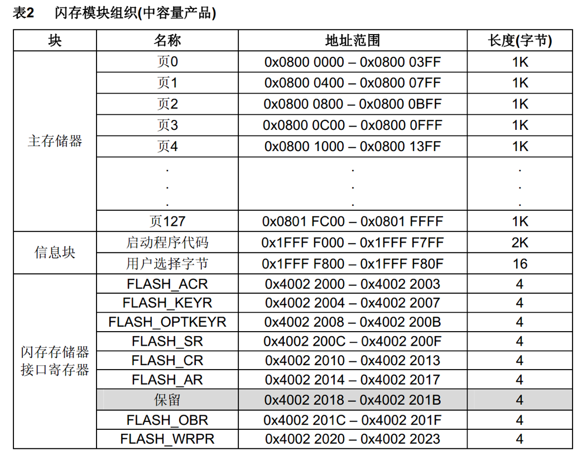

注

1. 闪存存储器接口寄存器本质为寄存器，进行控制闪存，不属于闪存
2. 分页是为了更好地管理闪存
3. 任何读写闪存的操作都会使CPU暂停，直到此次闪存编程结束
4. 如果程序中有需要频繁执行且对时间要求严格的中断函数，要慎用内部闪存
5. 如果指定地址没有擦除，则不会执行编程

**基本结构**

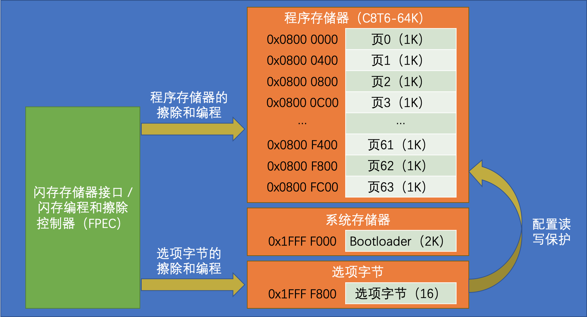

注

1. 系统存储器无法进行擦除和编程

**FLASH解锁**

- FPEC共有三个键值
  - RDPRT键 = 0x000000A5
  - KEY1 = 0x45670123
  - KEY2 = 0xCDEF89AB
- 解锁
  - 复位后，FPEC被保护，不能写入FLASH_CR
  - 在FLASH_KEYR先写入KEY1，再写入KEY2，解锁
  - 错误的操作序列会在下次复位前锁死FPEC和FLASH_CR
- 加锁
  - 设置FLASH_CR中的LOCK位锁住FPEC和FLASH_CR

**使用指针访问存储器**

- 使用指针读指定地址下的存储器

`uint16_t Data = *((__IO uint16_t *)(0x08000000));`

- 使用指针写指定地址下的存储器

`*((__IO uint16_t *)(0x08000000)) = 0x1234;`

- 其中

`#define  __IO  volatile`

注

1. `volatile`表示为易变的数据类型，告诉编译器不开启优化，原封不动地执行，防止出错，如无意义加减变量、多线程更改变量、读写与硬件相关的存储器等
2. 读取寄存器无需解锁，写入时需要解锁

## 程序存储器编程

**写入数据**

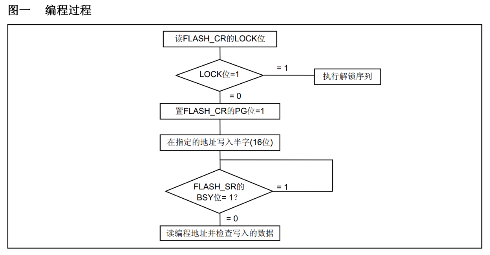

**程序存储器页擦除**

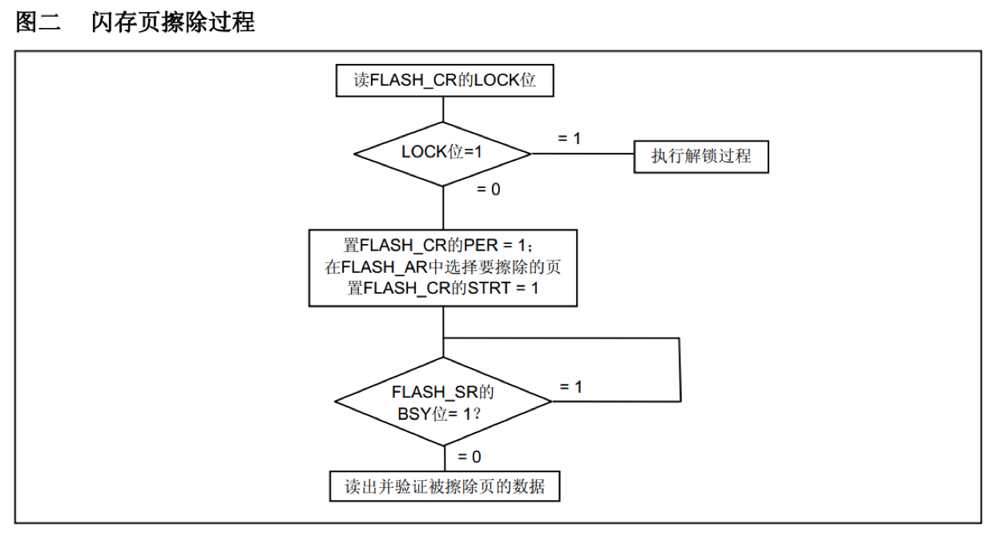

**程序存储器全擦除**

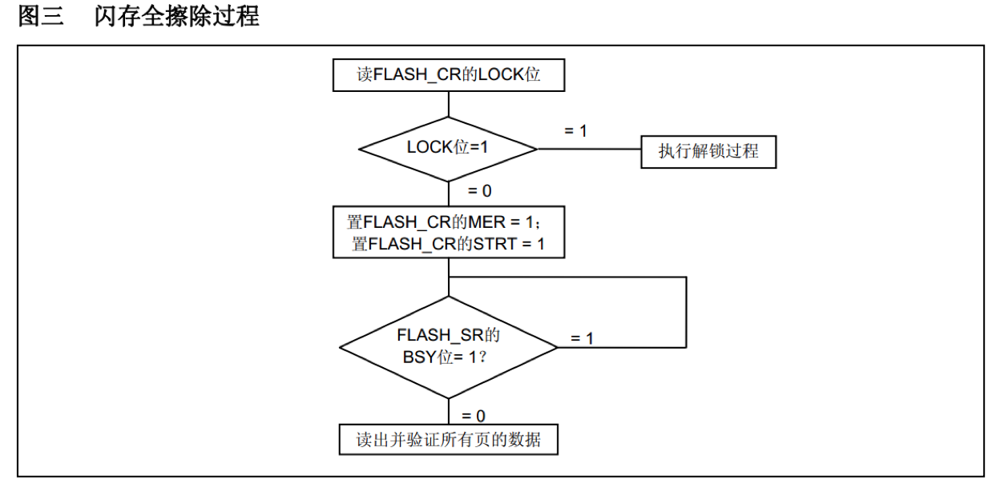

## 选项字节

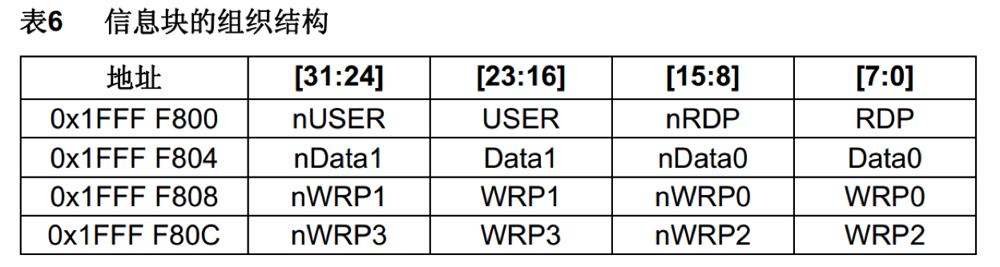

- RDP：写入RDPRT键（0x000000A5）后解除读保护
- USER：配置硬件看门狗和进入停机/待机模式是否产生复位
- Data0/1：用户可自定义使用
- WRP0/1/2/3：配置写保护，每一个位对应保护4个存储页（中容量）

注

1. 对于写入的×××要与n×××互为反码的关系，否则写入无效

**选项字节编程**

1. 检查FLASH_SR的BSY位，以确认没有其他正在进行的编程操作
2. 解锁FLASH_CR的OPTWRE位
3. 设置FLASH_CR的OPTPG位为1
4. 写入要编程的半字到指定的地址
5. 等待BSY位变为0
6. 读出写入的地址并验证数据

**选项字节擦除**

1. 检查FLASH_SR的BSY位，以确认没有其他正在进行的闪存操作
2. 解锁FLASH_CR的OPTWRE位
3. 设置FLASH_CR的OPTER位为1
4. 设置FLASH_CR的STRT位为1
5. 等待BSY位变为0
6. 读出被擦除的选择字节并做验证

## 器件电子签名

- 电子签名存放在闪存存储器模块的系统存储区域，包含的芯片识别信息在出厂时编写，不可更改，使用指针读指定地址下的存储器可获取电子签名
- 闪存容量寄存器
  - 基地址：0x1FFF F7E0
  - 大小：16位
- 产品唯一身份标识寄存器
  - 基地址： 0x1FFF F7E8
  - 大小：96位

## 实例

### 读写内部FLASH

```c
/* flash.c */

#include "stm32f10x.h"           

/**
  * 函    数：FLASH读取一个32位的字
  * 参    数：Address 要读取数据的字地址
  * 返 回 值：指定地址下的数据
  */
uint32_t MyFLASH_ReadWord(uint32_t Address)
{
	return *((__IO uint32_t *)(Address));				//使用指针访问指定地址下的数据并返回
}

/**
  * 函    数：FLASH读取一个16位的半字
  * 参    数：Address 要读取数据的半字地址
  * 返 回 值：指定地址下的数据
  */
uint16_t MyFLASH_ReadHalfWord(uint32_t Address)
{
	return *((__IO uint16_t *)(Address));				//使用指针访问指定地址下的数据并返回
}

/**
  * 函    数：FLASH读取一个8位的字节
  * 参    数：Address 要读取数据的字节地址
  * 返 回 值：指定地址下的数据
  */
uint8_t MyFLASH_ReadByte(uint32_t Address)
{
	return *((__IO uint8_t *)(Address));				//使用指针访问指定地址下的数据并返回
}

/**
  * 函    数：FLASH全擦除
  * 参    数：无
  * 返 回 值：无
  * 说    明：调用此函数后，FLASH的所有页都会被擦除，包括程序文件本身，擦除后，程序将不复存在
  */
void MyFLASH_EraseAllPages(void)
{
	FLASH_Unlock();													//解锁
	FLASH_EraseAllPages();									//全擦除
	FLASH_Lock();														//加锁
}

/**
  * 函    数：FLASH页擦除
  * 参    数：PageAddress 要擦除页的页地址
  * 返 回 值：无
  */
void MyFLASH_ErasePage(uint32_t PageAddress)
{
	FLASH_Unlock();													//解锁
	FLASH_ErasePage(PageAddress);						//页擦除
	FLASH_Lock();														//加锁
}

/**
  * 函    数：FLASH编程字
  * 参    数：Address 要写入数据的字地址
  * 参    数：Data 要写入的32位数据
  * 返 回 值：无
  */
void MyFLASH_ProgramWord(uint32_t Address, uint32_t Data)
{
	FLASH_Unlock();													//解锁
	FLASH_ProgramWord(Address, Data);				//编程字
	FLASH_Lock();														//加锁
}

/**
  * 函    数：FLASH编程半字
  * 参    数：Address 要写入数据的半字地址
  * 参    数：Data 要写入的16位数据
  * 返 回 值：无
  */
void MyFLASH_ProgramHalfWord(uint32_t Address, uint16_t Data)
{
	FLASH_Unlock();													//解锁
	FLASH_ProgramHalfWord(Address, Data);		//编程半字
	FLASH_Lock();														//加锁
}
```

```c
/* store.c */

#include "stm32f10x.h"                  
#include "MyFLASH.h"

#define STORE_START_ADDRESS		0x0800FC00		//存储的起始地址
#define STORE_COUNT				512								//存储数据的个数

uint16_t Store_Data[STORE_COUNT];						//定义SRAM数组

/**
  * 函    数：参数存储模块初始化
  * 参    数：无
  * 返 回 值：无
  */
void Store_Init(void)
{
	/*判断是不是第一次使用*/
	if (MyFLASH_ReadHalfWord(STORE_START_ADDRESS) != 0xA5A5)		//读取第一个半字的标志位，if成立，则执行第一次使用的初始化
	{
		MyFLASH_ErasePage(STORE_START_ADDRESS);										//擦除指定页
		MyFLASH_ProgramHalfWord(STORE_START_ADDRESS, 0xA5A5);			//在第一个半字写入自己规定的标志位，用于判断是不是第一次使用
		for (uint16_t i = 1; i < STORE_COUNT; i ++)								//循环STORE_COUNT次，除了第一个标志位
		{
			MyFLASH_ProgramHalfWord(STORE_START_ADDRESS + i * 2, 0x0000);		//除了标志位的有效数据全部清0
		}
	}
	
	/*上电时，将闪存数据加载回SRAM数组，实现SRAM数组的掉电不丢失*/
	for (uint16_t i = 0; i < STORE_COUNT; i ++)															//循环STORE_COUNT次，包括第一个标志位
	{
		Store_Data[i] = MyFLASH_ReadHalfWord(STORE_START_ADDRESS + i * 2);		//将闪存的数据加载回SRAM数组
	}
}

/**
  * 函    数：参数存储模块保存数据到闪存
  * 参    数：无
  * 返 回 值：无
  */
void Store_Save(void)
{
	MyFLASH_ErasePage(STORE_START_ADDRESS);																	//擦除指定页
	for (uint16_t i = 0; i < STORE_COUNT; i ++)															//循环STORE_COUNT次，包括第一个标志位
	{
		MyFLASH_ProgramHalfWord(STORE_START_ADDRESS + i * 2, Store_Data[i]);	//将SRAM数组的数据备份保存到闪存
	}
}

/**
  * 函    数：参数存储模块将所有有效数据清0
  * 参    数：无
  * 返 回 值：无
  */
void Store_Clear(void)
{
	for (uint16_t i = 1; i < STORE_COUNT; i ++)			//循环STORE_COUNT次，除了第一个标志位
	{
		Store_Data[i] = 0x0000;												//SRAM数组有效数据清0
	}
	Store_Save();																		//保存数据到闪存
}
```

```c
/* main.c */

#include "stm32f10x.h"                 
#include "Delay.h"
#include "OLED.h"
#include "Store.h"
#include "Key.h"

uint8_t KeyNum;									//定义用于接收按键键码的变量

int main(void)
{
	/*模块初始化*/
	OLED_Init();									//OLED初始化
	Key_Init();										//按键初始化
	Store_Init();									//参数存储模块初始化，在上电的时候将闪存的数据加载回Store_Data，实现掉电不丢失
	
	/*显示静态字符串*/
	OLED_ShowString(1, 1, "Flag:");
	OLED_ShowString(2, 1, "Data:");
	
	while (1)
	{
		KeyNum = Key_GetNum();			//获取按键键码
		
		if (KeyNum == 1)						//按键1按下
		{
			Store_Data[1] ++;					//变换测试数据
			Store_Data[2] += 2;
			Store_Data[3] += 3;
			Store_Data[4] += 4;
			Store_Save();							//将Store_Data的数据备份保存到闪存，实现掉电不丢失
		}
		
		if (KeyNum == 2)						//按键2按下
		{
			Store_Clear();						//将Store_Data的数据全部清0
		}
		
		OLED_ShowHexNum(1, 6, Store_Data[0], 4);	//显示Store_Data的第一位标志位
		OLED_ShowHexNum(3, 1, Store_Data[1], 4);	//显示Store_Data的有效存储数据
		OLED_ShowHexNum(3, 6, Store_Data[2], 4);
		OLED_ShowHexNum(4, 1, Store_Data[3], 4);
		OLED_ShowHexNum(4, 6, Store_Data[4], 4);
	}
}
```

### 读取芯片ID

```c
/* main.c */

#include "stm32f10x.h"                  
#include "Delay.h"
#include "OLED.h"

int main(void)
{
	OLED_Init();						
	
	OLED_ShowString(1, 1, "F_SIZE:");															//显示静态字符串
	OLED_ShowHexNum(1, 8, *((__IO uint16_t *)(0x1FFFF7E0)), 4);		//使用指针读取指定地址下的闪存容量寄存器
	
	OLED_ShowString(2, 1, "U_ID:");																//显示静态字符串
	OLED_ShowHexNum(2, 6, *((__IO uint16_t *)(0x1FFFF7E8)), 4);		//使用指针读取指定地址下的产品唯一身份标识寄存器
	OLED_ShowHexNum(2, 11, *((__IO uint16_t *)(0x1FFFF7E8 + 0x02)), 4);
	OLED_ShowHexNum(3, 1, *((__IO uint32_t *)(0x1FFFF7E8 + 0x04)), 8);
	OLED_ShowHexNum(4, 1, *((__IO uint32_t *)(0x1FFFF7E8 + 0x08)), 8);
	while (1)
	{
	}
}
```

# OLED

- OLED（Organic Light Emitting Diode）：有机发光二极管
- OLED显示屏：性能优异的新型显示屏，具有功耗低、相应速度快、宽视角、轻薄柔韧等特点
- 0.96寸OLED模块：小巧玲珑、占用接口少、简单易用，是电子设计中非常常见的显示屏模块
- 供电：3\~5.5V，通信协议：I2C/SPI，分辨率：128*64

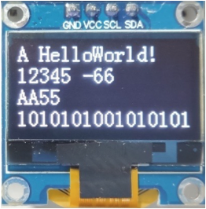

**硬件电路**

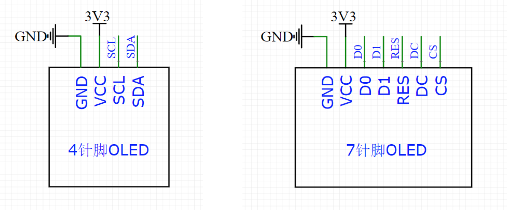

**驱动函数**

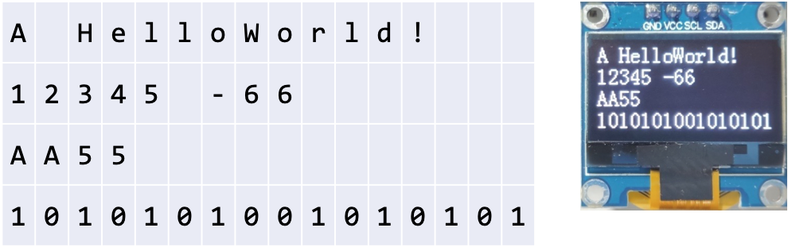

|                  函数                  |         作用         |
| :------------------------------------: | :------------------: |
|              OLED_Init();              |        初始化        |
|             OLED_Clear();              |         清屏         |
|       OLED_ShowChar(1, 1, 'A');        |     显示一个字符     |
| OLED_ShowString(1, 3,  "HelloWorld!"); |      显示字符串      |
|     OLED_ShowNum(2, 1, 12345, 5);      |    显示十进制数字    |
|   OLED_ShowSignedNum(2, 7, -66, 2);    | 显示有符号十进制数字 |
|   OLED_ShowHexNum(3, 1, 0xAA55, 4);    |   显示十六进制数字   |
|   OLED_ShowBinNum(4, 1, 0xAA55, 16);   |    显示二进制数字    |

**OLED实例**

```c
/* (4)OLED.c */

#include "stm32f10x.h"
#include "OLED_Font.h"

/*引脚配置*/
#define OLED_W_SCL(x)		GPIO_WriteBit(GPIOB, GPIO_Pin_8, (BitAction)(x))
#define OLED_W_SDA(x)		GPIO_WriteBit(GPIOB, GPIO_Pin_9, (BitAction)(x))

/*引脚初始化*/
void OLED_I2C_Init(void)
{
	RCC_APB2PeriphClockCmd(RCC_APB2Periph_GPIOB, ENABLE);
	
	GPIO_InitTypeDef GPIO_InitStructure;
 	GPIO_InitStructure.GPIO_Mode = GPIO_Mode_Out_OD;
	GPIO_InitStructure.GPIO_Speed = GPIO_Speed_50MHz;
	GPIO_InitStructure.GPIO_Pin = GPIO_Pin_8;
 	GPIO_Init(GPIOB, &GPIO_InitStructure);
	GPIO_InitStructure.GPIO_Pin = GPIO_Pin_9;
 	GPIO_Init(GPIOB, &GPIO_InitStructure);
	
	OLED_W_SCL(1);
	OLED_W_SDA(1);
}

/**
  * @brief  I2C开始
  * @param  无
  * @retval 无
  */
void OLED_I2C_Start(void)
{
	OLED_W_SDA(1);
	OLED_W_SCL(1);
	OLED_W_SDA(0);
	OLED_W_SCL(0);
}

/**
  * @brief  I2C停止
  * @param  无
  * @retval 无
  */
void OLED_I2C_Stop(void)
{
	OLED_W_SDA(0);
	OLED_W_SCL(1);
	OLED_W_SDA(1);
}

/**
  * @brief  I2C发送一个字节
  * @param  Byte 要发送的一个字节
  * @retval 无
  */
void OLED_I2C_SendByte(uint8_t Byte)
{
	uint8_t i;
	for (i = 0; i < 8; i++)
	{
		OLED_W_SDA(!!(Byte & (0x80 >> i)));
		OLED_W_SCL(1);
		OLED_W_SCL(0);
	}
	OLED_W_SCL(1);							//额外的一个时钟，不处理应答信号
	OLED_W_SCL(0);
}

/**
  * @brief  OLED写命令
  * @param  Command 要写入的命令
  * @retval 无
  */
void OLED_WriteCommand(uint8_t Command)
{
	OLED_I2C_Start();
	OLED_I2C_SendByte(0x78);		//从机地址
	OLED_I2C_SendByte(0x00);		//写命令
	OLED_I2C_SendByte(Command); 
	OLED_I2C_Stop();
}

/**
  * @brief  OLED写数据
  * @param  Data 要写入的数据
  * @retval 无
  */
void OLED_WriteData(uint8_t Data)
{
	OLED_I2C_Start();
	OLED_I2C_SendByte(0x78);		//从机地址
	OLED_I2C_SendByte(0x40);		//写数据
	OLED_I2C_SendByte(Data);
	OLED_I2C_Stop();
}

/**
  * @brief  OLED设置光标位置
  * @param  Y 以左上角为原点，向下方向的坐标，范围：0~7
  * @param  X 以左上角为原点，向右方向的坐标，范围：0~127
  * @retval 无
  */
void OLED_SetCursor(uint8_t Y, uint8_t X)
{
	OLED_WriteCommand(0xB0 | Y);									//设置Y位置
	OLED_WriteCommand(0x10 | ((X & 0xF0) >> 4));	//设置X位置高4位
	OLED_WriteCommand(0x00 | (X & 0x0F));					//设置X位置低4位
}

/**
  * @brief  OLED清屏
  * @param  无
  * @retval 无
  */
void OLED_Clear(void)
{  
	uint8_t i, j;
	for (j = 0; j < 8; j++)
	{
		OLED_SetCursor(j, 0);
		for(i = 0; i < 128; i++)
		{
			OLED_WriteData(0x00);
		}
	}
}

/**
  * @brief  OLED显示一个字符
  * @param  Line 行位置，范围：1~4
  * @param  Column 列位置，范围：1~16
  * @param  Char 要显示的一个字符，范围：ASCII可见字符
  * @retval 无
  */
void OLED_ShowChar(uint8_t Line, uint8_t Column, char Char)
{      	
	uint8_t i;
	OLED_SetCursor((Line - 1) * 2, (Column - 1) * 8);				//设置光标位置在上半部分
	for (i = 0; i < 8; i++)
	{
		OLED_WriteData(OLED_F8x16[Char - ' '][i]);						//显示上半部分内容
	}
	OLED_SetCursor((Line - 1) * 2 + 1, (Column - 1) * 8);		//设置光标位置在下半部分
	for (i = 0; i < 8; i++)
	{
		OLED_WriteData(OLED_F8x16[Char - ' '][i + 8]);				//显示下半部分内容
	}
}

/**
  * @brief  OLED显示字符串
  * @param  Line 起始行位置，范围：1~4
  * @param  Column 起始列位置，范围：1~16
  * @param  String 要显示的字符串，范围：ASCII可见字符
  * @retval 无
  */
void OLED_ShowString(uint8_t Line, uint8_t Column, char *String)
{
	uint8_t i;
	for (i = 0; String[i] != '\0'; i++)
	{
		OLED_ShowChar(Line, Column + i, String[i]);
	}
}

/**
  * @brief  OLED次方函数
  * @retval 返回值等于X的Y次方
  */
uint32_t OLED_Pow(uint32_t X, uint32_t Y)
{
	uint32_t Result = 1;
	while (Y--)
	{
		Result *= X;
	}
	return Result;
}

/**
  * @brief  OLED显示数字（十进制，正数）
  * @param  Line 起始行位置，范围：1~4
  * @param  Column 起始列位置，范围：1~16
  * @param  Number 要显示的数字，范围：0~4294967295
  * @param  Length 要显示数字的长度，范围：1~10
  * @retval 无
  */
void OLED_ShowNum(uint8_t Line, uint8_t Column, uint32_t Number, uint8_t Length)
{
	uint8_t i;
	for (i = 0; i < Length; i++)							
	{
		OLED_ShowChar(Line, Column + i, Number / OLED_Pow(10, Length - i - 1) % 10 + '0');
	}
}

/**
  * @brief  OLED显示数字（十进制，带符号数）
  * @param  Line 起始行位置，范围：1~4
  * @param  Column 起始列位置，范围：1~16
  * @param  Number 要显示的数字，范围：-2147483648~2147483647
  * @param  Length 要显示数字的长度，范围：1~10
  * @retval 无
  */
void OLED_ShowSignedNum(uint8_t Line, uint8_t Column, int32_t Number, uint8_t Length)
{
	uint8_t i;
	uint32_t Number1;
	if (Number >= 0)
	{
		OLED_ShowChar(Line, Column, '+');
		Number1 = Number;
	}
	else
	{
		OLED_ShowChar(Line, Column, '-');
		Number1 = -Number;
	}
	for (i = 0; i < Length; i++)							
	{
		OLED_ShowChar(Line, Column + i + 1, Number1 / OLED_Pow(10, Length - i - 1) % 10 + '0');
	}
}

/**
  * @brief  OLED显示数字（十六进制，正数）
  * @param  Line 起始行位置，范围：1~4
  * @param  Column 起始列位置，范围：1~16
  * @param  Number 要显示的数字，范围：0~0xFFFFFFFF
  * @param  Length 要显示数字的长度，范围：1~8
  * @retval 无
  */
void OLED_ShowHexNum(uint8_t Line, uint8_t Column, uint32_t Number, uint8_t Length)
{
	uint8_t i, SingleNumber;
	for (i = 0; i < Length; i++)							
	{
		SingleNumber = Number / OLED_Pow(16, Length - i - 1) % 16;
		if (SingleNumber < 10)
		{
			OLED_ShowChar(Line, Column + i, SingleNumber + '0');
		}
		else
		{
			OLED_ShowChar(Line, Column + i, SingleNumber - 10 + 'A');
		}
	}
}

/**
  * @brief  OLED显示数字（二进制，正数）
  * @param  Line 起始行位置，范围：1~4
  * @param  Column 起始列位置，范围：1~16
  * @param  Number 要显示的数字，范围：0~1111 1111 1111 1111
  * @param  Length 要显示数字的长度，范围：1~16
  * @retval 无
  */
void OLED_ShowBinNum(uint8_t Line, uint8_t Column, uint32_t Number, uint8_t Length)
{
	uint8_t i;
	for (i = 0; i < Length; i++)							
	{
		OLED_ShowChar(Line, Column + i, Number / OLED_Pow(2, Length - i - 1) % 2 + '0');
	}
}

/**
  * @brief  OLED初始化
  * @param  无
  * @retval 无
  */
void OLED_Init(void)
{
	uint32_t i, j;
	
	for (i = 0; i < 1000; i++)			//上电延时
	{
		for (j = 0; j < 1000; j++);
	}
	
	OLED_I2C_Init();					//端口初始化
	
	OLED_WriteCommand(0xAE);	//关闭显示
	
	OLED_WriteCommand(0xD5);	//设置显示时钟分频比/振荡器频率
	OLED_WriteCommand(0x80);
	
	OLED_WriteCommand(0xA8);	//设置多路复用率
	OLED_WriteCommand(0x3F);
	
	OLED_WriteCommand(0xD3);	//设置显示偏移
	OLED_WriteCommand(0x00);
	
	OLED_WriteCommand(0x40);	//设置显示开始行
	
	OLED_WriteCommand(0xA1);	//设置左右方向，0xA1正常 0xA0左右反置
	
	OLED_WriteCommand(0xC8);	//设置上下方向，0xC8正常 0xC0上下反置

	OLED_WriteCommand(0xDA);	//设置COM引脚硬件配置
	OLED_WriteCommand(0x12);
	
	OLED_WriteCommand(0x81);	//设置对比度控制
	OLED_WriteCommand(0xCF);

	OLED_WriteCommand(0xD9);	//设置预充电周期
	OLED_WriteCommand(0xF1);

	OLED_WriteCommand(0xDB);	//设置VCOMH取消选择级别
	OLED_WriteCommand(0x30);

	OLED_WriteCommand(0xA4);	//设置整个显示打开/关闭

	OLED_WriteCommand(0xA6);	//设置正常/倒转显示

	OLED_WriteCommand(0x8D);	//设置充电泵
	OLED_WriteCommand(0x14);

	OLED_WriteCommand(0xAF);	//开启显示
		
	OLED_Clear();							//OLED清屏
}
```

```c
/* main.c */

#include "stm32f10x.h"                  // Device header
#include "Delay.h"
#include "OLED.h"

int main(void)
{
	/*模块初始化*/
	OLED_Init();															//OLED初始化
	
	/*OLED显示*/
	OLED_ShowChar(1, 1, 'A');									//1行1列显示字符A
	
	OLED_ShowString(1, 3, "HelloWorld!");			//1行3列显示字符串HelloWorld!
	
	OLED_ShowNum(2, 1, 12345, 5);							//2行1列显示十进制数字12345，长度为5
	
	OLED_ShowSignedNum(2, 7, -66, 2);					//2行7列显示有符号十进制数字-66，长度为2
	
	//C语言无法直接写出二进制数字，故需要用十六进制表示
	
	OLED_ShowHexNum(3, 1, 0xAA55, 4);					//3行1列显示十六进制数字0xA5A5，长度为4
	
	OLED_ShowBinNum(4, 1, 0xAA55, 16);				//4行1列显示二进制数字0xA5A5，长度为16
	
	while (1)
	{
		
	}
}
```

# LED

发光二极管，正向通电点亮，反向通电不亮。

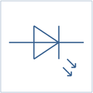

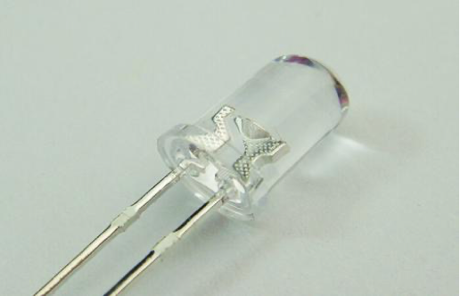

**led点灯实例**

```c
#include "stm32f10x.h"                  								// Device header
#include "Delay.h"

int main(void)
{
	/*开启时钟*/
	RCC_APB2PeriphClockCmd(RCC_APB2Periph_GPIOA, ENABLE);	//开启GPIOA的时钟
	//使用各个外设前必须开启时钟，否则对外设的操作无效
	
	/*GPIO初始化*/
	GPIO_InitTypeDef GPIO_InitStructure;									//定义结构体变量
	
	GPIO_InitStructure.GPIO_Mode = GPIO_Mode_Out_PP;			//GPIO模式，赋值为推挽输出模式
	GPIO_InitStructure.GPIO_Pin = GPIO_Pin_0;							//GPIO引脚，赋值为第0号引脚
	GPIO_InitStructure.GPIO_Speed = GPIO_Speed_50MHz;			//GPIO速度，赋值为50MHz
	
	GPIO_Init(GPIOA, &GPIO_InitStructure);								//将赋值后的构体变量传递给GPIO_Init函数
	//函数内部会自动根据结构体的参数配置相应寄存器
	//实现GPIOA的初始化
	
	while (1)
	{
		/*设置PA0引脚的高低电平，实现LED闪烁，下面展示3种方法*/
		
		/*方法1：GPIO_ResetBits设置低电平，GPIO_SetBits设置高电平*/
		GPIO_ResetBits(GPIOA, GPIO_Pin_0);									//将PA0引脚设置为低电平
		Delay_ms(500);																			//延时500ms
		GPIO_SetBits(GPIOA, GPIO_Pin_0);										//将PA0引脚设置为高电平
		Delay_ms(500);																			//延时500ms
		
		/*方法2：GPIO_WriteBit设置低/高电平，由Bit_RESET/Bit_SET指定*/
		GPIO_WriteBit(GPIOA, GPIO_Pin_0, Bit_RESET);				//将PA0引脚设置为低电平
		Delay_ms(500);																			//延时500ms
		GPIO_WriteBit(GPIOA, GPIO_Pin_0, Bit_SET);					//将PA0引脚设置为高电平
		Delay_ms(500);																			//延时500ms
		
		/*方法3：GPIO_WriteBit设置低/高电平，由数据0/1指定，数据需要强转为BitAction类型*/
    // 可以同时对16个端口进行写入操作
		GPIO_WriteBit(GPIOA, GPIO_Pin_0, (BitAction)0);			//将PA0引脚设置为低电平
		Delay_ms(500);																			//延时500ms
		GPIO_WriteBit(GPIOA, GPIO_Pin_0, (BitAction)1);			//将PA0引脚设置为高电平
		Delay_ms(500);																			//延时500ms
	}
}
```

**流水灯实例**

```c
#include "stm32f10x.h"                  									// Device header
#include "Delay.h"

int main(void)
{
	/*开启时钟*/
	RCC_APB2PeriphClockCmd(RCC_APB2Periph_GPIOA, ENABLE);		//开启GPIOA的时钟
														
	
	/*GPIO初始化*/
	GPIO_InitTypeDef GPIO_InitStructure;										//定义结构体变量
	
	GPIO_InitStructure.GPIO_Mode = GPIO_Mode_Out_PP;				//GPIO模式，赋值为推挽输出模式
	GPIO_InitStructure.GPIO_Pin = GPIO_Pin_All;							//GPIO引脚，赋值为所有引脚
	GPIO_InitStructure.GPIO_Speed = GPIO_Speed_50MHz;				//GPIO速度，赋值为50MHz
	
	GPIO_Init(GPIOA, &GPIO_InitStructure);									//将赋值后的构体变量传递给GPIO_Init函数
				
	while (1)
	{
		/*使用GPIO_Write，同时设置GPIOA所有引脚的高低电平，实现LED流水灯*/
		GPIO_Write(GPIOA, ~0x0001);				//0000 0000 0000 0001，PA0引脚为低电平，其他引脚均为高电平，注意数据有按位取反
		Delay_ms(100);										//延时100ms
		GPIO_Write(GPIOA, ~0x0002);				//0000 0000 0000 0010，PA1引脚为低电平，其他引脚均为高电平
		Delay_ms(100);										//延时100ms
		GPIO_Write(GPIOA, ~0x0004);				//0000 0000 0000 0100，PA2引脚为低电平，其他引脚均为高电平
		Delay_ms(100);										//延时100ms
		GPIO_Write(GPIOA, ~0x0008);				//0000 0000 0000 1000，PA3引脚为低电平，其他引脚均为高电平
		Delay_ms(100);										//延时100ms
		GPIO_Write(GPIOA, ~0x0010);				//0000 0000 0001 0000，PA4引脚为低电平，其他引脚均为高电平
		Delay_ms(100);										//延时100ms
		GPIO_Write(GPIOA, ~0x0020);				//0000 0000 0010 0000，PA5引脚为低电平，其他引脚均为高电平
		Delay_ms(100);										//延时100ms
		GPIO_Write(GPIOA, ~0x0040);				//0000 0000 0100 0000，PA6引脚为低电平，其他引脚均为高电平
		Delay_ms(100);										//延时100ms
		GPIO_Write(GPIOA, ~0x0080);				//0000 0000 1000 0000，PA7引脚为低电平，其他引脚均为高电平
		Delay_ms(100);										//延时100ms
	}
}
```

# 蜂鸣器

- 有源蜂鸣器：内部自带振荡源，将正负极接上直流电压即可持续发声，频率固定
- 无源蜂鸣器：内部不带振荡源，需要控制器提供振荡脉冲才可发声，调整提供振荡脉冲的频率，可发出不同频率的声音

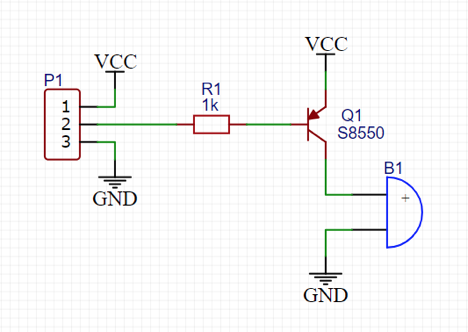

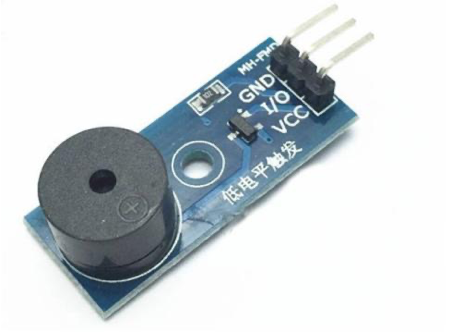

**蜂鸣器实例**

```c
#include "stm32f10x.h"                  									// Device header
#include "Delay.h"

int main(void)
{
	/*开启时钟*/
	RCC_APB2PeriphClockCmd(RCC_APB2Periph_GPIOB, ENABLE);		//开启GPIOB的时钟
	
	/*GPIO初始化*/
	GPIO_InitTypeDef GPIO_InitStructure;										//定义结构体变量
	
	GPIO_InitStructure.GPIO_Mode = GPIO_Mode_Out_PP;				//GPIO模式，赋值为推挽输出模式
	GPIO_InitStructure.GPIO_Pin = GPIO_Pin_12;							//GPIO引脚，赋值为第12号引脚
	GPIO_InitStructure.GPIO_Speed = GPIO_Speed_50MHz;				//GPIO速度，赋值为50MHz
	
	GPIO_Init(GPIOB, &GPIO_InitStructure);									//将赋值后的构体变量传递给GPIO_Init函数
	
	while (1)
	{
		GPIO_ResetBits(GPIOB, GPIO_Pin_12);					//将PB12引脚设置为低电平，蜂鸣器鸣叫
		Delay_ms(100);							
		GPIO_SetBits(GPIOB, GPIO_Pin_12);						//将PB12引脚设置为高电平，蜂鸣器停止
		Delay_ms(100);							
		GPIO_ResetBits(GPIOB, GPIO_Pin_12);					//将PB12引脚设置为低电平，蜂鸣器鸣叫
		Delay_ms(100);							
		GPIO_SetBits(GPIOB, GPIO_Pin_12);						//将PB12引脚设置为高电平，蜂鸣器停止
		Delay_ms(700);							
	}
}
```

# 按键

常见的输入设备，按下导通，松手断开。

- 按键抖动：由于按键内部使用的是机械式弹簧片来进行通断的，所以在按下和松手的瞬间会伴随有一连串的抖动

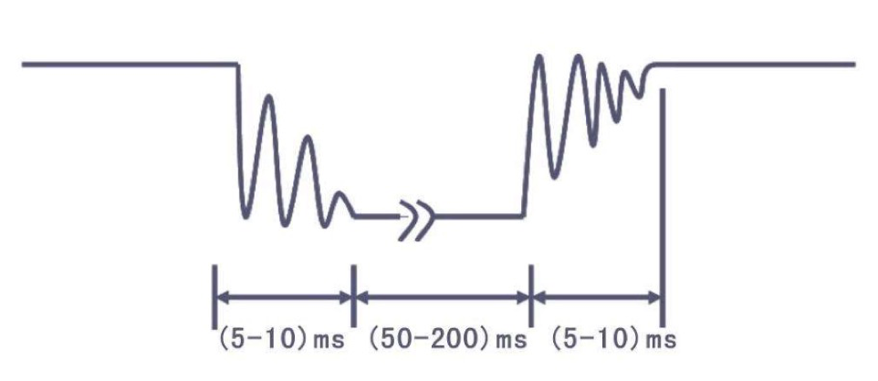

**按键实例**

```c
/* Key.c */

#include "stm32f10x.h"                 									 	// Device header
#include "Delay.h"

/**
  * 函    数：按键初始化
  * 参    数：无
  * 返 回 值：无
  */
void Key_Init(void)
{
	/*开启时钟*/
	RCC_APB2PeriphClockCmd(RCC_APB2Periph_GPIOB, ENABLE);		//开启GPIOB的时钟
	
	/*GPIO初始化*/
	GPIO_InitTypeDef GPIO_InitStructure;
	GPIO_InitStructure.GPIO_Mode = GPIO_Mode_IPU;
	GPIO_InitStructure.GPIO_Pin = GPIO_Pin_1 | GPIO_Pin_11;
	GPIO_InitStructure.GPIO_Speed = GPIO_Speed_50MHz;
	GPIO_Init(GPIOB, &GPIO_InitStructure);									//将PB1和PB11引脚初始化为上拉输入
}

/**
  * 函    数：按键获取键码
  * 参    数：无
  * 返 回 值：按下按键的键码值，范围：0~2，返回0代表没有按键按下
  * 注意事项：此函数是阻塞式操作，当按键按住不放时，函数会卡住，直到按键松手
  */
uint8_t Key_GetNum(void)
{
	uint8_t KeyNum = 0;																				//定义变量，默认键码值为0
	
	if (GPIO_ReadInputDataBit(GPIOB, GPIO_Pin_1) == 0)				//读PB1输入寄存器的状态，如果为0，则代表按键1按下
	{
		Delay_ms(20);																						//延时消抖
		while (GPIO_ReadInputDataBit(GPIOB, GPIO_Pin_1) == 0);	//等待按键松手
		Delay_ms(20);																						//延时消抖
		KeyNum = 1;																							//置键码为1
	}
	
	if (GPIO_ReadInputDataBit(GPIOB, GPIO_Pin_11) == 0)				//读PB11输入寄存器的状态，如果为0，则代表按键2按下
	{
		Delay_ms(20);																						//延时消抖
		while (GPIO_ReadInputDataBit(GPIOB, GPIO_Pin_11) == 0);	//等待按键松手
		Delay_ms(20);																						//延时消抖
		KeyNum = 2;																							//置键码为2
	}
	
	return KeyNum;																						//返回键码值，如果没有按键按下，所有if都不成立，则键码为默认值0
}
```

```c
/* main.c */

#include "stm32f10x.h"          // Device header
#include "Delay.h"
#include "LED.h"
#include "Key.h"

uint8_t KeyNum;									//定义用于接收按键键码的变量

int main(void)
{
	/*模块初始化*/
	LED_Init();										//LED初始化
	Key_Init();										//按键初始化
	
	while (1)
	{
		KeyNum = Key_GetNum();			//获取按键键码
		
		if (KeyNum == 1)						//按键1按下
		{
			LED1_Turn();							//LED1翻转
		}
		
		if (KeyNum == 2)						//按键2按下
		{
			LED2_Turn();							//LED2翻转
		}
	}
}
```

# 可变电阻模块

传感器元件（光敏电阻/热敏电阻/红外接收管等）的电阻会随外界模拟量的变化而变化，通过与定值电阻分压即可得到模拟电压输出，再通过电压比较器进行二值化即可得到数字电压输出。

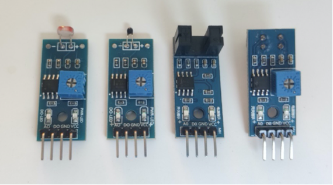

**光敏电阻实例**

```c
/* LightSensor.c */

#include "stm32f10x.h"                 									  // Device header

/**
  * 函    数：光敏传感器初始化
  * 参    数：无
  * 返 回 值：无
  */
void LightSensor_Init(void)
{
	/*开启时钟*/
	RCC_APB2PeriphClockCmd(RCC_APB2Periph_GPIOB, ENABLE);		//开启GPIOB的时钟
	
	/*GPIO初始化*/
	GPIO_InitTypeDef GPIO_InitStructure;
	GPIO_InitStructure.GPIO_Mode = GPIO_Mode_IPU;
	GPIO_InitStructure.GPIO_Pin = GPIO_Pin_13;
	GPIO_InitStructure.GPIO_Speed = GPIO_Speed_50MHz;
	GPIO_Init(GPIOB, &GPIO_InitStructure);									//将PB13引脚初始化为上拉输入
}

/**
  * 函    数：获取当前光敏传感器输出的高低电平
  * 参    数：无
  * 返 回 值：光敏传感器输出的高低电平，范围：0/1
  */
uint8_t LightSensor_Get(void)
{
	return GPIO_ReadInputDataBit(GPIOB, GPIO_Pin_13);				//返回PB13输入寄存器的状态
}
```

```c
/* main.c */

#include "stm32f10x.h"                  // Device header
#include "Delay.h"
#include "Buzzer.h"
#include "LightSensor.h"

int main(void)
{
	/*模块初始化*/
	Buzzer_Init();												//蜂鸣器初始化
	LightSensor_Init();										//光敏传感器初始化
	
	while (1)
	{
		if (LightSensor_Get() == 1)					//如果当前光敏输出1
		{
			Buzzer_ON();											//蜂鸣器开启
		}
		else																//否则
		{
			Buzzer_OFF();											//蜂鸣器关闭
		}
	}
}
```

**红外接收管计数实例**

```c
/* CountSensor.c */

#include "stm32f10x.h"              								    			// Device header

uint16_t CountSensor_Count;																		//全局变量，用于计数

/**
  * 函    数：计数传感器初始化
  * 参    数：无
  * 返 回 值：无
  */
void CountSensor_Init(void)
{
	/*开启时钟*/
	RCC_APB2PeriphClockCmd(RCC_APB2Periph_GPIOB, ENABLE);				//开启GPIOB的时钟
	RCC_APB2PeriphClockCmd(RCC_APB2Periph_AFIO, ENABLE);				//开启AFIO的时钟，外部中断必须开启AFIO的时钟
	// RCC用来管理内核外的外设，NVIC属于内核外设，无需开启时钟
	// EXIT也无需开启时钟
	
	/*GPIO初始化*/
	GPIO_InitTypeDef GPIO_InitStructure;
	GPIO_InitStructure.GPIO_Mode = GPIO_Mode_IPU;
	GPIO_InitStructure.GPIO_Pin = GPIO_Pin_14;
	GPIO_InitStructure.GPIO_Speed = GPIO_Speed_50MHz;
	GPIO_Init(GPIOB, &GPIO_InitStructure);											//将PB14引脚初始化为上拉输入
	
	/*AFIO选择中断引脚*/
	GPIO_EXTILineConfig(GPIO_PortSourceGPIOB, GPIO_PinSource14);//将外部中断的14号线映射到GPIOB，即选择PB14为外部中断引脚
	
	/*EXTI初始化*/
	EXTI_InitTypeDef EXTI_InitStructure;												//定义结构体变量
	EXTI_InitStructure.EXTI_Line = EXTI_Line14;									//选择配置外部中断的14号线
	EXTI_InitStructure.EXTI_LineCmd = ENABLE;										//指定外部中断线使能
	EXTI_InitStructure.EXTI_Mode = EXTI_Mode_Interrupt;					//指定外部中断线为中断模式
	EXTI_InitStructure.EXTI_Trigger = EXTI_Trigger_Falling;			//指定外部中断线为下降沿触发
	EXTI_Init(&EXTI_InitStructure);															//将结构体变量交给EXTI_Init，配置EXTI外设
	
	/*NVIC中断分组*/
	NVIC_PriorityGroupConfig(NVIC_PriorityGroup_2);							//配置NVIC为分组2
	//即抢占优先级范围：0~3，响应优先级范围：0~3
	//此分组配置在整个工程中仅需调用一次
	//若有多个中断，可以把此代码放在main函数内，while循环之前
	//若调用多次配置分组的代码，则后执行的配置会覆盖先执行的配置
	
	/*NVIC配置*/
	NVIC_InitTypeDef NVIC_InitStructure;												//定义结构体变量
	NVIC_InitStructure.NVIC_IRQChannel = EXTI15_10_IRQn;				//选择配置NVIC的EXTI15_10线
	NVIC_InitStructure.NVIC_IRQChannelCmd = ENABLE;							//指定NVIC线路使能
	NVIC_InitStructure.NVIC_IRQChannelPreemptionPriority = 1;		//指定NVIC线路的抢占优先级为1
	NVIC_InitStructure.NVIC_IRQChannelSubPriority = 1;					//指定NVIC线路的响应优先级为1
	NVIC_Init(&NVIC_InitStructure);															//将结构体变量交给NVIC_Init，配置NVIC外设
}

/**
  * 函    数：获取计数传感器的计数值
  * 参    数：无
  * 返 回 值：计数值，范围：0~65535
  */
uint16_t CountSensor_Get(void)
{
	return CountSensor_Count;
}

/**
  * 函    数：EXTI15_10外部中断函数
  * 参    数：无
  * 返 回 值：无
  * 注意事项：此函数为中断函数，无需调用，中断触发后自动执行
  *           函数名为预留的指定名称，可以从启动文件复制
  *           请确保函数名正确，不能有任何差异，否则中断函数将不能进入
  */
void EXTI15_10_IRQHandler(void)
{
	if (EXTI_GetITStatus(EXTI_Line14) == SET)								//判断是否是外部中断14号线触发的中断
	{
		/*如果出现数据乱跳的现象，可再次判断引脚电平，以避免抖动*/
		if (GPIO_ReadInputDataBit(GPIOB, GPIO_Pin_14) == 0)
		{
			CountSensor_Count ++;																//计数值自增一次
		}
		EXTI_ClearITPendingBit(EXTI_Line14);									//清除外部中断14号线的中断标志位
																													//中断标志位必须清除
																													//否则中断将连续不断地触发，导致主程序卡死
	}
}
```

```c
/*main.c*/

#include "stm32f10x.h"               					   // Device header
#include "Delay.h"
#include "OLED.h"
#include "CountSensor.h"

int main(void)
{
	/*模块初始化*/
	OLED_Init();																	//OLED初始化
	CountSensor_Init();														//计数传感器初始化
	
	/*显示静态字符串*/
	OLED_ShowString(1, 1, "Count:");							//1行1列显示字符串Count:
	
	while (1)
	{
		OLED_ShowNum(1, 7, CountSensor_Get(), 5);		//OLED不断刷新显示CountSensor_Get的返回值
	}
}
```

# 旋转编码器

- 旋转编码器：用来测量位置、速度或旋转方向的装置，当其旋转轴旋转时，其输出端可以输出与旋转速度和方向对应的方波信号，读取方波信号的频率和相位信息即可得知旋转轴的速度和方向
- 类型：机械触点式/霍尔传感器式/光栅式

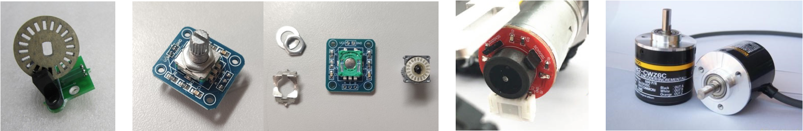

**旋转编码器实例**

```c
/* Encoder.c */

#include "stm32f10x.h"                  											// Device header

int16_t Encoder_Count;																				//全局变量，用于计数旋转编码器的增量值

/**
  * 函    数：旋转编码器初始化
  * 参    数：无
  * 返 回 值：无
  */
void Encoder_Init(void)
{
	/*开启时钟*/
	RCC_APB2PeriphClockCmd(RCC_APB2Periph_GPIOB, ENABLE);				//开启GPIOB的时钟
	RCC_APB2PeriphClockCmd(RCC_APB2Periph_AFIO, ENABLE);				//开启AFIO的时钟，外部中断必须开启AFIO的时钟
	
	/*GPIO初始化*/
	GPIO_InitTypeDef GPIO_InitStructure;
	GPIO_InitStructure.GPIO_Mode = GPIO_Mode_IPU;
	GPIO_InitStructure.GPIO_Pin = GPIO_Pin_0 | GPIO_Pin_1;
	GPIO_InitStructure.GPIO_Speed = GPIO_Speed_50MHz;
	GPIO_Init(GPIOB, &GPIO_InitStructure);											//将PB0和PB1引脚初始化为上拉输入
	
	/*AFIO选择中断引脚*/
	GPIO_EXTILineConfig(GPIO_PortSourceGPIOB, GPIO_PinSource0);	//将外部中断的0号线映射到GPIOB，即选择PB0为外部中断引脚
	GPIO_EXTILineConfig(GPIO_PortSourceGPIOB, GPIO_PinSource1);	//将外部中断的1号线映射到GPIOB，即选择PB1为外部中断引脚
	
	/*EXTI初始化*/
	EXTI_InitTypeDef EXTI_InitStructure;												//定义结构体变量
	EXTI_InitStructure.EXTI_Line = EXTI_Line0 | EXTI_Line1;			//选择配置外部中断的0号线和1号线
EXTI_InitStructure.EXTI_LineCmd = ENABLE;											//指定外部中断线使能
	EXTI_InitStructure.EXTI_Mode = EXTI_Mode_Interrupt;					//指定外部中断线为中断模式
	EXTI_InitStructure.EXTI_Trigger = EXTI_Trigger_Falling;			//指定外部中断线为下降沿触发
	EXTI_Init(&EXTI_InitStructure);															//将结构体变量交给EXTI_Init，配置EXTI外设
	
	/*NVIC中断分组*/
	NVIC_PriorityGroupConfig(NVIC_PriorityGroup_2);							//配置NVIC为分组2
  //即抢占优先级范围：0~3，响应优先级范围：0~3
  //此分组配置在整个工程中仅需调用一次
  //若有多个中断，可以把此代码放在main函数内，while循环之前
  //若调用多次配置分组的代码，则后执行的配置会覆盖先执行的配置
	
	/*NVIC配置*/
	NVIC_InitTypeDef NVIC_InitStructure;												//定义结构体变量
	NVIC_InitStructure.NVIC_IRQChannel = EXTI0_IRQn;						//选择配置NVIC的EXTI0线
	NVIC_InitStructure.NVIC_IRQChannelCmd = ENABLE;							//指定NVIC线路使能
	NVIC_InitStructure.NVIC_IRQChannelPreemptionPriority = 1;		//指定NVIC线路的抢占优先级为1
	NVIC_InitStructure.NVIC_IRQChannelSubPriority = 1;					//指定NVIC线路的响应优先级为1
	NVIC_Init(&NVIC_InitStructure);															//将结构体变量交给NVIC_Init，配置NVIC外设

	NVIC_InitStructure.NVIC_IRQChannel = EXTI1_IRQn;						//选择配置NVIC的EXTI1线
	NVIC_InitStructure.NVIC_IRQChannelCmd = ENABLE;							//指定NVIC线路使能
	NVIC_InitStructure.NVIC_IRQChannelPreemptionPriority = 1;		//指定NVIC线路的抢占优先级为1
	NVIC_InitStructure.NVIC_IRQChannelSubPriority = 2;					//指定NVIC线路的响应优先级为2
	NVIC_Init(&NVIC_InitStructure);															//将结构体变量交给NVIC_Init，配置NVIC外设
}

/**
  * 函    数：旋转编码器获取增量值
  * 参    数：无
  * 返 回 值：自上此调用此函数后，旋转编码器的增量值
  */
int16_t Encoder_Get(void)
{
	/*使用Temp变量作为中继，目的是返回Encoder_Count后将其清零*/
	/*在这里，也可以直接返回Encoder_Count
	  但这样就不是获取增量值的操作方法了
	  也可以实现功能，只是思路不一样*/
	int16_t Temp;
	Temp = Encoder_Count;
	Encoder_Count = 0;
	return Temp;
}

/**
  * 函    数：EXTI0外部中断函数
  * 参    数：无
  * 返 回 值：无
  * 注意事项：此函数为中断函数，无需调用，中断触发后自动执行
  *           函数名为预留的指定名称，可以从启动文件复制
  *           请确保函数名正确，不能有任何差异，否则中断函数将不能进入
  */
void EXTI0_IRQHandler(void)
{
	if (EXTI_GetITStatus(EXTI_Line0) == SET)									//判断是否是外部中断0号线触发的中断
	{
		/*如果出现数据乱跳的现象，可再次判断引脚电平，以避免抖动*/
		if (GPIO_ReadInputDataBit(GPIOB, GPIO_Pin_0) == 0)
		{
			if (GPIO_ReadInputDataBit(GPIOB, GPIO_Pin_1) == 0)		//PB0的下降沿触发中断，此时检测另一相PB1的电平，目的是判断旋转方向
			{
				Encoder_Count --;																		//此方向定义为反转，计数变量自减
			}
		}
		EXTI_ClearITPendingBit(EXTI_Line0);											//清除外部中断0号线的中断标志位
	}
}

/**
  * 函    数：EXTI1外部中断函数
  * 参    数：无
  * 返 回 值：无
  * 注意事项：此函数为中断函数，无需调用，中断触发后自动执行
  *           函数名为预留的指定名称，可以从启动文件复制
  *           请确保函数名正确，不能有任何差异，否则中断函数将不能进入
  */
void EXTI1_IRQHandler(void)
{
	if (EXTI_GetITStatus(EXTI_Line1) == SET)									//判断是否是外部中断1号线触发的中断
	{
		/*如果出现数据乱跳的现象，可再次判断引脚电平，以避免抖动*/
		if (GPIO_ReadInputDataBit(GPIOB, GPIO_Pin_1) == 0)
		{
			if (GPIO_ReadInputDataBit(GPIOB, GPIO_Pin_0) == 0)		//PB1的下降沿触发中断，此时检测另一相PB0的电平，目的是判断旋转方向
			{
				Encoder_Count ++;																		//此方向定义为正转，计数变量自增
			}
		}
		EXTI_ClearITPendingBit(EXTI_Line1);											//清除外部中断1号线的中断标志位
	}
}
```

```c
/* main.c */

#include "stm32f10x.h"                  // Device header
#include "Delay.h"
#include "OLED.h"
#include "Encoder.h"

int16_t Num;														//定义待被旋转编码器调节的变量

int main(void)
{
	/*模块初始化*/
	OLED_Init();													//OLED初始化
	Encoder_Init();												//旋转编码器初始化
	
	/*显示静态字符串*/
	OLED_ShowString(1, 1, "Num:");				//1行1列显示字符串Num:
	
	while (1)
	{
		Num += Encoder_Get();								//获取自上此调用此函数后，旋转编码器的增量值，并将增量值加到Num上
		OLED_ShowSignedNum(1, 5, Num, 5);		//显示Num
	}
}
```

# 舵机

- 舵机是一种根据输入PWM信号占空比来控制输出角度的装置
- 输入PWM信号要求：周期为20ms，高电平宽度为0.5ms~2.5ms

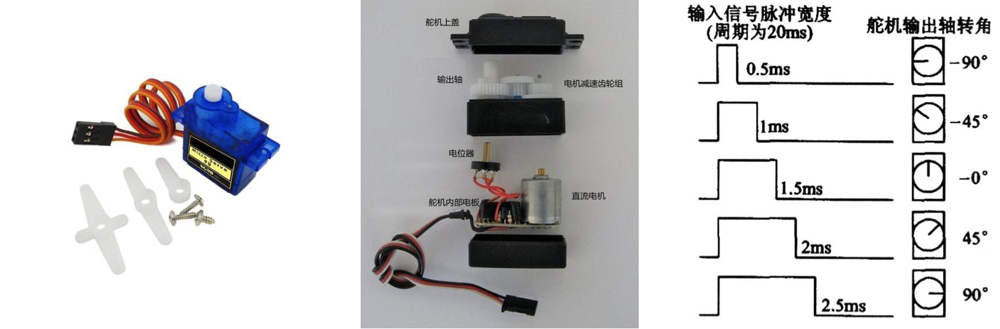

注

1. 对于舵机，尽量单独供电

**pwm控制舵机实例**

```c
/* PWM.C */

#include "stm32f10x.h"                  

/**
  * 函    数：PWM初始化
  * 参    数：无
  * 返 回 值：无
  */
void PWM_Init(void)
{
	/*开启时钟*/
	RCC_APB1PeriphClockCmd(RCC_APB1Periph_TIM2, ENABLE);							//开启TIM2的时钟
	RCC_APB2PeriphClockCmd(RCC_APB2Periph_GPIOA, ENABLE);							//开启GPIOA的时钟
	
	/*GPIO初始化*/
	GPIO_InitTypeDef GPIO_InitStructure;
	GPIO_InitStructure.GPIO_Mode = GPIO_Mode_AF_PP;
	GPIO_InitStructure.GPIO_Pin = GPIO_Pin_1;
	GPIO_InitStructure.GPIO_Speed = GPIO_Speed_50MHz;
	GPIO_Init(GPIOA, &GPIO_InitStructure);													//将PA1引脚初始化为复用推挽输出	
  //受外设控制的引脚，均需要配置为复用模式
	
	/*配置时钟源*/
	TIM_InternalClockConfig(TIM2);																	//选择TIM2为内部时钟，若不调用此函数，TIM默认也为内部时钟
	
	/*时基单元初始化*/
	TIM_TimeBaseInitTypeDef TIM_TimeBaseInitStructure;							//定义结构体变量
	TIM_TimeBaseInitStructure.TIM_ClockDivision = TIM_CKD_DIV1;     //时钟分频，选择不分频，此参数用于配置滤波器时钟，不影响时基单元功能
	TIM_TimeBaseInitStructure.TIM_CounterMode = TIM_CounterMode_Up; //计数器模式，选择向上计数
	TIM_TimeBaseInitStructure.TIM_Period = 20000 - 1;								//计数周期，即ARR的值
	TIM_TimeBaseInitStructure.TIM_Prescaler = 72 - 1;								//预分频器，即PSC的值
	TIM_TimeBaseInitStructure.TIM_RepetitionCounter = 0;            //重复计数器，高级定时器才会用到
	TIM_TimeBaseInit(TIM2, &TIM_TimeBaseInitStructure);             //将结构体变量交给TIM_TimeBaseInit，配置TIM2的时基单元
	
	/*输出比较初始化*/ 
	TIM_OCInitTypeDef TIM_OCInitStructure;													//定义结构体变量
	TIM_OCStructInit(&TIM_OCInitStructure);                         //结构体初始化，若结构体没有完整赋值
	                                                                //则最好执行此函数，给结构体所有成员都赋一个默认值
	                                                                //避免结构体初值不确定的问题
	TIM_OCInitStructure.TIM_OCMode = TIM_OCMode_PWM1;               //输出比较模式，选择PWM模式1
	TIM_OCInitStructure.TIM_OCPolarity = TIM_OCPolarity_High;       //输出极性，选择为高，若选择极性为低，则输出高低电平取反
	TIM_OCInitStructure.TIM_OutputState = TIM_OutputState_Enable;   //输出使能
	TIM_OCInitStructure.TIM_Pulse = 0;															//初始的CCR值
	TIM_OC2Init(TIM2, &TIM_OCInitStructure);                        //将结构体变量交给TIM_OC2Init，配置TIM2的输出比较通道2
	
	/*TIM使能*/
	TIM_Cmd(TIM2, ENABLE);			//使能TIM2，定时器开始运行
}

/**
  * 函    数：PWM设置CCR
  * 参    数：Compare 要写入的CCR的值，范围：0~100
  * 返 回 值：无
  * 注意事项：CCR和ARR共同决定占空比，此函数仅设置CCR的值，并不直接是占空比
  *           占空比Duty = CCR / (ARR + 1)
  */
void PWM_SetCompare2(uint16_t Compare)
{
	TIM_SetCompare2(TIM2, Compare);																		//设置CCR2的值
}
```

```c
/* servo.c */

#include "stm32f10x.h"                  
#include "PWM.h"

/**
  * 函    数：舵机初始化
  * 参    数：无
  * 返 回 值：无
  */
void Servo_Init(void)
{
	PWM_Init();																						//初始化舵机的底层PWM
}

/**
  * 函    数：舵机设置角度
  * 参    数：Angle 要设置的舵机角度，范围：0~180
  * 返 回 值：无
  */
void Servo_SetAngle(float Angle)
{
	PWM_SetCompare2(Angle / 180 * 2000 + 500);						//设置占空比
	//将角度线性变换，对应到舵机要求的占空比范围上
}
```

```c
/* main.c */

#include "stm32f10x.h"                  // Device header
#include "Delay.h"
#include "OLED.h"
#include "Servo.h"
#include "Key.h"

uint8_t KeyNum;													//定义用于接收键码的变量
float Angle;														//定义角度变量

int main(void)
{
	/*模块初始化*/
	OLED_Init();													//OLED初始化
	Servo_Init();													//舵机初始化
	Key_Init();														//按键初始化
	
	/*显示静态字符串*/
	OLED_ShowString(1, 1, "Angle:");			//1行1列显示字符串Angle:
	
	while (1)
	{
		KeyNum = Key_GetNum();							//获取按键键码
		if (KeyNum == 1)										//按键1按下
		{
			Angle += 30;											//角度变量自增30
			if (Angle > 180)									//角度变量超过180后
			{
				Angle = 0;											//角度变量归零
			}
		}
		Servo_SetAngle(Angle);							//设置舵机的角度为角度变量
		OLED_ShowNum(1, 7, Angle, 3);				//OLED显示角度变量
	}
}
```

# 直流电机及驱动

- 直流电机是一种将电能转换为机械能的装置，有两个电极，当电极正接时，电机正转，当电极反接时，电机反转
- 直流电机属于大功率器件，GPIO口无法直接驱动，需要配合电机驱动电路来操作
- TB6612是一款双路H桥型的直流电机驱动芯片，可以驱动两个直流电机并且控制其转速和方向

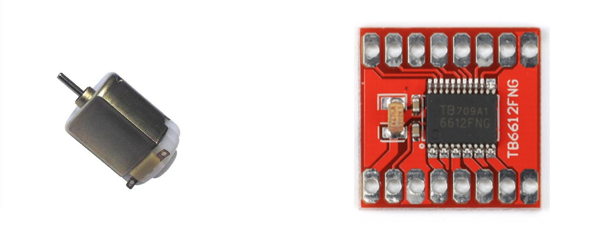

注

1. 针对于驱动而言，PWM高低决定是否转，PWM频率足够快则能够稳定地转，转速取决于PWM占空比

**pwm直流电机实例**

```c
/* PWM.C */

#include "stm32f10x.h"                  

/**
  * 函    数：PWM初始化
  * 参    数：无
  * 返 回 值：无
  */
void PWM_Init(void)
{
	/*开启时钟*/
	RCC_APB1PeriphClockCmd(RCC_APB1Periph_TIM2, ENABLE);						//开启TIM2的时钟
	RCC_APB2PeriphClockCmd(RCC_APB2Periph_GPIOA, ENABLE);						//开启GPIOA的时钟
			
	/*GPIO初始化*/
	GPIO_InitTypeDef GPIO_InitStructure;
	GPIO_InitStructure.GPIO_Mode = GPIO_Mode_AF_PP;
	GPIO_InitStructure.GPIO_Pin = GPIO_Pin_2;
	GPIO_InitStructure.GPIO_Speed = GPIO_Speed_50MHz;
	GPIO_Init(GPIOA, &GPIO_InitStructure);													//将PA2引脚初始化为复用推挽输出	
  //受外设控制的引脚，均需要配置为复用模式
	
	/*配置时钟源*/
		TIM_InternalClockConfig(TIM2);																//选择TIM2为内部时钟，若不调用此函数，TIM默认也为内部时钟
	
	/*时基单元初始化*/
	TIM_TimeBaseInitTypeDef TIM_TimeBaseInitStructure;							//定义结构体变量
	TIM_TimeBaseInitStructure.TIM_ClockDivision = TIM_CKD_DIV1;     //时钟分频，选择不分频，此参数用于配置滤波器时钟，不影响时基单元功能
	TIM_TimeBaseInitStructure.TIM_CounterMode = TIM_CounterMode_Up; //计数器模式，选择向上计数
	TIM_TimeBaseInitStructure.TIM_Period = 100 - 1;                 //计数周期，即ARR的值
	TIM_TimeBaseInitStructure.TIM_Prescaler = 36 - 1;               //预分频器，即PSC的值
	TIM_TimeBaseInitStructure.TIM_RepetitionCounter = 0;            //重复计数器，高级定时器才会用到
	TIM_TimeBaseInit(TIM2, &TIM_TimeBaseInitStructure);             //将结构体变量交给TIM_TimeBaseInit，配置TIM2的时基单元
	
	/*输出比较初始化*/ 
	TIM_OCInitTypeDef TIM_OCInitStructure;													//定义结构体变量
	TIM_OCStructInit(&TIM_OCInitStructure);                         //结构体初始化，若结构体没有完整赋值
	                                                                //则最好执行此函数，给结构体所有成员都赋一个默认值
	                                                                //避免结构体初值不确定的问题
	TIM_OCInitStructure.TIM_OCMode = TIM_OCMode_PWM1;               //输出比较模式，选择PWM模式1
	TIM_OCInitStructure.TIM_OCPolarity = TIM_OCPolarity_High;       //输出极性，选择为高，若选择极性为低，则输出高低电平取反
	TIM_OCInitStructure.TIM_OutputState = TIM_OutputState_Enable;   //输出使能
	TIM_OCInitStructure.TIM_Pulse = 0;															//初始的CCR值
	TIM_OC3Init(TIM2, &TIM_OCInitStructure);                        //将结构体变量交给TIM_OC3Init，配置TIM2的输出比较通道3
	
	/*TIM使能*/
	TIM_Cmd(TIM2, ENABLE);			//使能TIM2，定时器开始运行
}

/**
  * 函    数：PWM设置CCR
  * 参    数：Compare 要写入的CCR的值，范围：0~100
  * 返 回 值：无
  * 注意事项：CCR和ARR共同决定占空比，此函数仅设置CCR的值，并不直接是占空比
  *           占空比Duty = CCR / (ARR + 1)
  */
void PWM_SetCompare3(uint16_t Compare)
{
	TIM_SetCompare3(TIM2, Compare);																	//设置CCR3的值
}
```

```C
/* Motor.c */

#include "stm32f10x.h"                 
#include "PWM.h"

/**
  * 函    数：直流电机初始化
  * 参    数：无
  * 返 回 值：无
  */
void Motor_Init(void)
{
	/*开启时钟*/
	RCC_APB2PeriphClockCmd(RCC_APB2Periph_GPIOA, ENABLE);				//开启GPIOA的时钟
	
	GPIO_InitTypeDef GPIO_InitStructure;
	GPIO_InitStructure.GPIO_Mode = GPIO_Mode_Out_PP;
	GPIO_InitStructure.GPIO_Pin = GPIO_Pin_4 | GPIO_Pin_5;
	GPIO_InitStructure.GPIO_Speed = GPIO_Speed_50MHz;
	GPIO_Init(GPIOA, &GPIO_InitStructure);											//将PA4和PA5引脚初始化为推挽输出	
	
	PWM_Init();																									//初始化直流电机的底层PWM
}

/**
  * 函    数：直流电机设置速度
  * 参    数：Speed 要设置的速度，范围：-100~100
  * 返 回 值：无
  */
void Motor_SetSpeed(int8_t Speed)
{
	if (Speed >= 0)																							//如果设置正转的速度值
	{
		GPIO_SetBits(GPIOA, GPIO_Pin_4);													//PA4置高电平
		GPIO_ResetBits(GPIOA, GPIO_Pin_5);												//PA5置低电平，设置方向为正转
		PWM_SetCompare3(Speed);																		//PWM设置为速度值
	}
	else																												//否则，即设置反转的速度值
	{
		GPIO_ResetBits(GPIOA, GPIO_Pin_4);												//PA4置低电平
		GPIO_SetBits(GPIOA, GPIO_Pin_5);													//PA5置高电平，设置方向为反转
		PWM_SetCompare3(-Speed);																	//PWM设置为负的速度值，因为此时速度值为负数，而PWM只能给正数
	}
}

```

```C
/* main.c */

#include "stm32f10x.h"                 
#include "Delay.h"
#include "OLED.h"
#include "Motor.h"
#include "Key.h"

uint8_t KeyNum;													//定义用于接收按键键码的变量
int8_t Speed;														//定义速度变量

int main(void)
{
	/*模块初始化*/
	OLED_Init();													//OLED初始化
	Motor_Init();													//直流电机初始化
	Key_Init();														//按键初始化
	
	/*显示静态字符串*/
	OLED_ShowString(1, 1, "Speed:");			//1行1列显示字符串Speed:
	
	while (1)
	{
		KeyNum = Key_GetNum();							//获取按键键码
		if (KeyNum == 1)										//按键1按下
		{
			Speed += 20;											//速度变量自增20
			if (Speed > 100)									//速度变量超过100后
			{
				Speed = -100;										//速度变量变为-100
        //此操作会让电机旋转方向突然改变，可能会因供电不足而导致单片机复位
        //若出现了此现象，则应避免使用这样的操作
			}
		}
		Motor_SetSpeed(Speed);							//设置直流电机的速度为速度变量
		OLED_ShowSignedNum(1, 7, Speed, 3);	//OLED显示速度变量
	}
}
```

# MPU6050

- MPU6050是一个6轴姿态传感器，可以测量芯片自身X、Y、Z轴的加速度、角速度参数，通过数据融合，可进一步得到姿态角，常应用于平衡车、飞行器等需要检测自身姿态的场景
- 3轴加速度计（Accelerometer）：测量X、Y、Z轴的加速度
- 3轴陀螺仪传感器（Gyroscope）：测量X、Y、Z轴的角速度

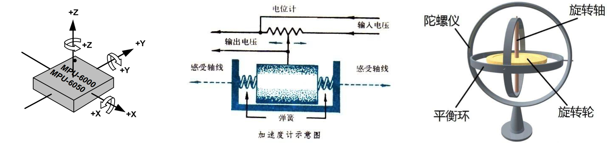

- 16位ADC采集传感器的模拟信号，量化范围：-32768\~32767
- 加速度计满量程选择：±2、±4、±8、±16（g）
- 陀螺仪满量程选择： ±250、±500、±1000、±2000（°/sec）
- 可配置的数字低通滤波器
- 可配置的时钟源
- 可配置的采样分频
- I2C从机地址
	- 1101000（AD0=0）
	- 1101001（AD0=1）

**硬件电路**

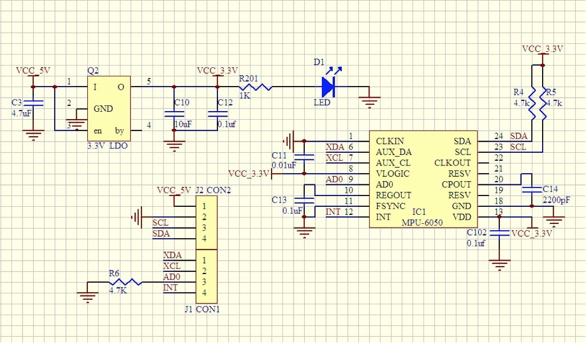

|   引脚   |      功能       |
| :------: | :-------------: |
| VCC、GND |      电源       |
| SCL、SDA |   I2C通信引脚   |
| XCL、XDA | 扩展I2C通信引脚 |
|   AD0    | 从机地址最低位  |
|   INT    |  中断信号输出   |

**MPU6050框图**

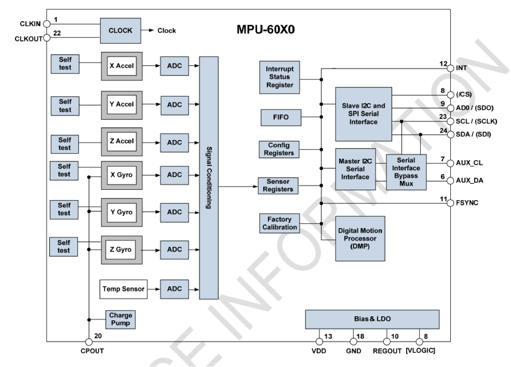

**软件IC读写**

普通GPIO实现，不受硬件资源限制。

```c
/* IC.c */

#include "stm32f10x.h"                  
#include "Delay.h"

/*引脚配置层*/

/**
  * 函    数：I2C写SCL引脚电平
  * 参    数：BitValue 协议层传入的当前需要写入SCL的电平，范围0~1
  * 返 回 值：无
  * 注意事项：此函数需要用户实现内容，当BitValue为0时，需要置SCL为低电平，当BitValue为1时，需要置SCL为高电平
  */
void MyI2C_W_SCL(uint8_t BitValue)
{
	GPIO_WriteBit(GPIOB, GPIO_Pin_10, (BitAction)BitValue);		//根据BitValue，设置SCL引脚的电平
	Delay_us(10);																							//延时10us，防止时序频率超过要求
}

/**
  * 函    数：I2C写SDA引脚电平
  * 参    数：BitValue 协议层传入的当前需要写入SDA的电平，范围0~1
  * 返 回 值：无
  * 注意事项：此函数需要用户实现内容，当BitValue为0时，需要置SDA为低电平，当BitValue为1时，需要置SDA为高电平
  */
void MyI2C_W_SDA(uint8_t BitValue)
{
	GPIO_WriteBit(GPIOB, GPIO_Pin_11, (BitAction)BitValue);		//根据BitValue，设置SDA引脚的电平，BitValue要实现非0即1的特性
	Delay_us(10);																							//延时10us，防止时序频率超过要求
}

/**
  * 函    数：I2C读SDA引脚电平
  * 参    数：无
  * 返 回 值：协议层需要得到的当前SDA的电平，范围0~1
  * 注意事项：此函数需要用户实现内容，当前SDA为低电平时，返回0，当前SDA为高电平时，返回1
  */
uint8_t MyI2C_R_SDA(void)
{
	uint8_t BitValue;
	BitValue = GPIO_ReadInputDataBit(GPIOB, GPIO_Pin_11);		//读取SDA电平
	Delay_us(10);																						//延时10us，防止时序频率超过要求
	return BitValue;																				//返回SDA电平
}

/**
  * 函    数：I2C初始化
  * 参    数：无
  * 返 回 值：无
  * 注意事项：此函数需要用户实现内容，实现SCL和SDA引脚的初始化
  */
void MyI2C_Init(void)
{
	/*开启时钟*/
	RCC_APB2PeriphClockCmd(RCC_APB2Periph_GPIOB, ENABLE);				//开启GPIOB的时钟
	
	/*GPIO初始化*/
	GPIO_InitTypeDef GPIO_InitStructure;
	GPIO_InitStructure.GPIO_Mode = GPIO_Mode_Out_OD;
	GPIO_InitStructure.GPIO_Pin = GPIO_Pin_10 | GPIO_Pin_11;
	GPIO_InitStructure.GPIO_Speed = GPIO_Speed_50MHz;
	GPIO_Init(GPIOB, &GPIO_InitStructure);											//将PB10和PB11引脚初始化为开漏输出
	
	/*设置默认电平*/
	GPIO_SetBits(GPIOB, GPIO_Pin_10 | GPIO_Pin_11);							//设置PB10和PB11引脚初始化后默认为高电平（释放总线状态）
}

/*协议层*/

/**
  * 函    数：I2C起始
  * 参    数：无
  * 返 回 值：无
  */
void MyI2C_Start(void)
{
	MyI2C_W_SDA(1);							//释放SDA，确保SDA为高电平
	MyI2C_W_SCL(1);							//释放SCL，确保SCL为高电平
	MyI2C_W_SDA(0);							//在SCL高电平期间，拉低SDA，产生起始信号
	MyI2C_W_SCL(0);							//起始后把SCL也拉低，即为了占用总线，也为了方便总线时序的拼接
}

/**
  * 函    数：I2C终止
  * 参    数：无
  * 返 回 值：无
  */
void MyI2C_Stop(void)
{
	MyI2C_W_SDA(0);							//拉低SDA，确保SDA为低电平
	MyI2C_W_SCL(1);							//释放SCL，使SCL呈现高电平
	MyI2C_W_SDA(1);							//在SCL高电平期间，释放SDA，产生终止信号
}

/**
  * 函    数：I2C发送一个字节
  * 参    数：Byte 要发送的一个字节数据，范围：0x00~0xFF
  * 返 回 值：无
  */
void MyI2C_SendByte(uint8_t Byte)
{
	uint8_t i;
	for (i = 0; i < 8; i ++)									//循环8次，主机依次发送数据的每一位
	{
		/*两个!可以对数据进行两次逻辑取反，作用是把非0值统一转换为1，即：!!(0) = 0，!!(非0) = 1*/
		MyI2C_W_SDA(!!(Byte & (0x80 >> i)));		//使用掩码的方式取出Byte的指定一位数据并写入到SDA线
		MyI2C_W_SCL(1);													//释放SCL，从机在SCL高电平期间读取SDA
		MyI2C_W_SCL(0);													//拉低SCL，主机开始发送下一位数据
	}
}

/**
  * 函    数：I2C接收一个字节
  * 参    数：无
  * 返 回 值：接收到的一个字节数据，范围：0x00~0xFF
  */
uint8_t MyI2C_ReceiveByte(void)
{
	uint8_t i, Byte = 0x00;								//定义接收的数据，并赋初值0x00，此处必须赋初值0x00，后面会用到
	MyI2C_W_SDA(1);												//接收前，主机先确保释放SDA，避免干扰从机的数据发送
	for (i = 0; i < 8; i ++)							//循环8次，主机依次接收数据的每一位
	{
		MyI2C_W_SCL(1);											//释放SCL，主机机在SCL高电平期间读取SDA
		if (MyI2C_R_SDA()){Byte |= (0x80 >> i);}	//读取SDA数据，并存储到Byte变量
																				//当SDA为1时，置变量指定位为1，当SDA为0时，不做处理，指定位为默认的初值0
		MyI2C_W_SCL(0);											//拉低SCL，从机在SCL低电平期间写入SDA
	}
	return Byte;													//返回接收到的一个字节数据
}

/**
  * 函    数：I2C发送应答位
  * 参    数：Byte 要发送的应答位，范围：0~1，0表示应答，1表示非应答
  * 返 回 值：无
  */
void MyI2C_SendAck(uint8_t AckBit)
{
	MyI2C_W_SDA(AckBit);										//主机把应答位数据放到SDA线
	MyI2C_W_SCL(1);													//释放SCL，从机在SCL高电平期间，读取应答位
	MyI2C_W_SCL(0);													//拉低SCL，开始下一个时序模块
}

/**
  * 函    数：I2C接收应答位
  * 参    数：无
  * 返 回 值：接收到的应答位，范围：0~1，0表示应答，1表示非应答
  */
uint8_t MyI2C_ReceiveAck(void)
{
	uint8_t AckBit;												//定义应答位变量
	MyI2C_W_SDA(1);												//接收前，主机先确保释放SDA，避免干扰从机的数据发送
	MyI2C_W_SCL(1);												//释放SCL，主机机在SCL高电平期间读取SDA
	AckBit = MyI2C_R_SDA();								//将应答位存储到变量里
	MyI2C_W_SCL(0);												//拉低SCL，开始下一个时序模块
	return AckBit;												//返回定义应答位变量
}
```

```c
/* MPU6050.c */

#include "stm32f10x.h"                  
#include "MyI2C.h"
#include "MPU6050_Reg.h"

#define MPU6050_ADDRESS		0xD0						//MPU6050的I2C从机地址

/**
  * 函    数：MPU6050写寄存器
  * 参    数：RegAddress 寄存器地址，范围：参考MPU6050手册的寄存器描述
  * 参    数：Data 要写入寄存器的数据，范围：0x00~0xFF
  * 返 回 值：无
  */
void MPU6050_WriteReg(uint8_t RegAddress, uint8_t Data)
{
	MyI2C_Start();														//I2C起始
	MyI2C_SendByte(MPU6050_ADDRESS);					//发送从机地址，读写位为0，表示即将写入
	MyI2C_ReceiveAck();												//接收应答
	MyI2C_SendByte(RegAddress);								//发送寄存器地址
	MyI2C_ReceiveAck();												//接收应答
	MyI2C_SendByte(Data);											//发送要写入寄存器的数据
	MyI2C_ReceiveAck();												//接收应答
	MyI2C_Stop();															//I2C终止
}

/**
  * 函    数：MPU6050读寄存器
  * 参    数：RegAddress 寄存器地址，范围：参考MPU6050手册的寄存器描述
  * 返 回 值：读取寄存器的数据，范围：0x00~0xFF
  */
uint8_t MPU6050_ReadReg(uint8_t RegAddress)
{
	uint8_t Data;
	
	MyI2C_Start();													//I2C起始
	MyI2C_SendByte(MPU6050_ADDRESS);				//发送从机地址，读写位为0，表示即将写入
	MyI2C_ReceiveAck();											//接收应答
	MyI2C_SendByte(RegAddress);							//发送寄存器地址
	MyI2C_ReceiveAck();											//接收应答
	
	MyI2C_Start();													//I2C重复起始
	MyI2C_SendByte(MPU6050_ADDRESS | 0x01);	//发送从机地址，读写位为1，表示即将读取
	MyI2C_ReceiveAck();											//接收应答
	Data = MyI2C_ReceiveByte();							//接收指定寄存器的数据
	MyI2C_SendAck(1);												//发送应答，给从机非应答，终止从机的数据输出
	MyI2C_Stop();														//I2C终止
	
	return Data;
}

/**
  * 函    数：MPU6050初始化
  * 参    数：无
  * 返 回 值：无
  */
void MPU6050_Init(void)
{
	MyI2C_Init();																		//先初始化底层的I2C
	
	/*MPU6050寄存器初始化，需要对照MPU6050手册的寄存器描述配置，此处仅配置了部分重要的寄存器*/
	MPU6050_WriteReg(MPU6050_PWR_MGMT_1, 0x01);			//电源管理寄存器1，取消睡眠模式，选择时钟源为X轴陀螺仪
	MPU6050_WriteReg(MPU6050_PWR_MGMT_2, 0x00);			//电源管理寄存器2，保持默认值0，所有轴均不待机
	MPU6050_WriteReg(MPU6050_SMPLRT_DIV, 0x09);			//采样率分频寄存器，配置采样率
	MPU6050_WriteReg(MPU6050_CONFIG, 0x06);					//配置寄存器，配置DLPF
	MPU6050_WriteReg(MPU6050_GYRO_CONFIG, 0x18);		//陀螺仪配置寄存器，选择满量程为±2000°/s
	MPU6050_WriteReg(MPU6050_ACCEL_CONFIG, 0x18);		//加速度计配置寄存器，选择满量程为±16g
}

/**
  * 函    数：MPU6050获取ID号
  * 参    数：无
  * 返 回 值：MPU6050的ID号
  */
uint8_t MPU6050_GetID(void)
{
	return MPU6050_ReadReg(MPU6050_WHO_AM_I);					//返回WHO_AM_I寄存器的值
}

/**
  * 函    数：MPU6050获取数据
  * 参    数：AccX AccY AccZ 加速度计X、Y、Z轴的数据，使用输出参数的形式返回，范围：-32768~32767
  * 参    数：GyroX GyroY GyroZ 陀螺仪X、Y、Z轴的数据，使用输出参数的形式返回，范围：-32768~32767
  * 返 回 值：无
  */
void MPU6050_GetData(int16_t *AccX, int16_t *AccY, int16_t *AccZ, 
						int16_t *GyroX, int16_t *GyroY, int16_t *GyroZ)
{
	uint8_t DataH, DataL;															//定义数据高8位和低8位的变量
	
	DataH = MPU6050_ReadReg(MPU6050_ACCEL_XOUT_H);		//读取加速度计X轴的高8位数据
	DataL = MPU6050_ReadReg(MPU6050_ACCEL_XOUT_L);		//读取加速度计X轴的低8位数据
	*AccX = (DataH << 8) | DataL;											//数据拼接，通过输出参数返回
	
	DataH = MPU6050_ReadReg(MPU6050_ACCEL_YOUT_H);		//读取加速度计Y轴的高8位数据
	DataL = MPU6050_ReadReg(MPU6050_ACCEL_YOUT_L);		//读取加速度计Y轴的低8位数据
	*AccY = (DataH << 8) | DataL;											//数据拼接，通过输出参数返回
	
	DataH = MPU6050_ReadReg(MPU6050_ACCEL_ZOUT_H);		//读取加速度计Z轴的高8位数据
	DataL = MPU6050_ReadReg(MPU6050_ACCEL_ZOUT_L);		//读取加速度计Z轴的低8位数据
	*AccZ = (DataH << 8) | DataL;											//数据拼接，通过输出参数返回
	
	DataH = MPU6050_ReadReg(MPU6050_GYRO_XOUT_H);			//读取陀螺仪X轴的高8位数据
	DataL = MPU6050_ReadReg(MPU6050_GYRO_XOUT_L);			//读取陀螺仪X轴的低8位数据
	*GyroX = (DataH << 8) | DataL;										//数据拼接，通过输出参数返回
	
	DataH = MPU6050_ReadReg(MPU6050_GYRO_YOUT_H);			//读取陀螺仪Y轴的高8位数据
	DataL = MPU6050_ReadReg(MPU6050_GYRO_YOUT_L);			//读取陀螺仪Y轴的低8位数据
	*GyroY = (DataH << 8) | DataL;										//数据拼接，通过输出参数返回
	
	DataH = MPU6050_ReadReg(MPU6050_GYRO_ZOUT_H);			//读取陀螺仪Z轴的高8位数据
	DataL = MPU6050_ReadReg(MPU6050_GYRO_ZOUT_L);			//读取陀螺仪Z轴的低8位数据
	*GyroZ = (DataH << 8) | DataL;										//数据拼接，通过输出参数返回
}
```

```c
/* main.c */

#include "stm32f10x.h"                  
#include "Delay.h"
#include "OLED.h"
#include "MPU6050.h"

uint8_t ID;																						//定义用于存放ID号的变量
int16_t AX, AY, AZ, GX, GY, GZ;												//定义用于存放各个数据的变量

int main(void)
{
	/*模块初始化*/
	OLED_Init();																				//OLED初始化
	MPU6050_Init();																			//MPU6050初始化
	
	/*显示ID号*/
	OLED_ShowString(1, 1, "ID:");												//显示静态字符串
	ID = MPU6050_GetID();																//获取MPU6050的ID号
	OLED_ShowHexNum(1, 4, ID, 2);												//OLED显示ID号
	
	while (1)
	{
		MPU6050_GetData(&AX, &AY, &AZ, &GX, &GY, &GZ);		//获取MPU6050的数据
		OLED_ShowSignedNum(2, 1, AX, 5);									//OLED显示数据
		OLED_ShowSignedNum(3, 1, AY, 5);
		OLED_ShowSignedNum(4, 1, AZ, 5);
		OLED_ShowSignedNum(2, 8, GX, 5);
		OLED_ShowSignedNum(3, 8, GY, 5);
		OLED_ShowSignedNum(4, 8, GZ, 5);
	}
}
```

**硬件IC读写**

```c
/* MPU6050.c */

#include "stm32f10x.h"                 
#include "MPU6050_Reg.h"

#define MPU6050_ADDRESS		0xD0												//MPU6050的I2C从机地址

/**
  * 函    数：MPU6050等待事件
  * 参    数：同I2C_CheckEvent
  * 返 回 值：无
  */
void MPU6050_WaitEvent(I2C_TypeDef* I2Cx, uint32_t I2C_EVENT)
{
	uint32_t Timeout;
	Timeout = 10000;																		//给定超时计数时间
	while (I2C_CheckEvent(I2Cx, I2C_EVENT) != SUCCESS)	//循环等待指定事件
	{
		Timeout --;																				//等待时，计数值自减
		if (Timeout == 0)																	//自减到0后，等待超时
		{
			/*超时的错误处理代码，可以添加到此处*/
			break;																					//跳出等待，不等了
		}
	}
}

/**
  * 函    数：MPU6050写寄存器
  * 参    数：RegAddress 寄存器地址，范围：参考MPU6050手册的寄存器描述
  * 参    数：Data 要写入寄存器的数据，范围：0x00~0xFF
  * 返 回 值：无
  */
void MPU6050_WriteReg(uint8_t RegAddress, uint8_t Data)
{
	I2C_GenerateSTART(I2C2, ENABLE);																			//硬件I2C生成起始条件
	MPU6050_WaitEvent(I2C2, I2C_EVENT_MASTER_MODE_SELECT);								//等待EV5
	
	I2C_Send7bitAddress(I2C2, MPU6050_ADDRESS, I2C_Direction_Transmitter);//硬件I2C发送从机地址，方向为发送
	MPU6050_WaitEvent(I2C2, I2C_EVENT_MASTER_TRANSMITTER_MODE_SELECTED);	//等待EV6
	
	I2C_SendData(I2C2, RegAddress);																				//硬件I2C发送寄存器地址
	MPU6050_WaitEvent(I2C2, I2C_EVENT_MASTER_BYTE_TRANSMITTING);					//等待EV8
	
	I2C_SendData(I2C2, Data);																							//硬件I2C发送数据
	MPU6050_WaitEvent(I2C2, I2C_EVENT_MASTER_BYTE_TRANSMITTED);						//等待EV8_2
	
	I2C_GenerateSTOP(I2C2, ENABLE);																				//硬件I2C生成终止条件
}

/**
  * 函    数：MPU6050读（一个字节）寄存器
  * 参    数：RegAddress 寄存器地址，范围：参考MPU6050手册的寄存器描述
  * 返 回 值：读取寄存器的数据，范围：0x00~0xFF
  */
uint8_t MPU6050_ReadReg(uint8_t RegAddress)
{
	uint8_t Data;
	
	I2C_GenerateSTART(I2C2, ENABLE);																				//硬件I2C生成起始条件
	MPU6050_WaitEvent(I2C2, I2C_EVENT_MASTER_MODE_SELECT);									//等待EV5
	
	I2C_Send7bitAddress(I2C2, MPU6050_ADDRESS, I2C_Direction_Transmitter);	//硬件I2C发送从机地址，方向为发送
	MPU6050_WaitEvent(I2C2, I2C_EVENT_MASTER_TRANSMITTER_MODE_SELECTED);		//等待EV6
	
	I2C_SendData(I2C2, RegAddress);																					//硬件I2C发送寄存器地址
	MPU6050_WaitEvent(I2C2, I2C_EVENT_MASTER_BYTE_TRANSMITTED);							//等待EV8_2
	
	I2C_GenerateSTART(I2C2, ENABLE);																				//硬件I2C生成重复起始条件
	MPU6050_WaitEvent(I2C2, I2C_EVENT_MASTER_MODE_SELECT);									//等待EV5
	
	I2C_Send7bitAddress(I2C2, MPU6050_ADDRESS, I2C_Direction_Receiver);			//硬件I2C发送从机地址，方向为接收
	MPU6050_WaitEvent(I2C2, I2C_EVENT_MASTER_RECEIVER_MODE_SELECTED);				//等待EV6
	
	I2C_AcknowledgeConfig(I2C2, DISABLE);											//在接收最后一个字节之前提前将应答失能
	I2C_GenerateSTOP(I2C2, ENABLE);														//在接收最后一个字节之前提前申请停止条件
	
	MPU6050_WaitEvent(I2C2, I2C_EVENT_MASTER_BYTE_RECEIVED);	//等待EV7
	Data = I2C_ReceiveData(I2C2);															//接收数据寄存器
	
	I2C_AcknowledgeConfig(I2C2, ENABLE);											//将应答恢复为使能，为了不影响后续可能产生的读取多字节操作
	return Data;
}

/**
  * 函    数：MPU6050初始化
  * 参    数：无
  * 返 回 值：无
  */
void MPU6050_Init(void)
{
	/*开启时钟*/
	RCC_APB1PeriphClockCmd(RCC_APB1Periph_I2C2, ENABLE);		//开启I2C2的时钟
	RCC_APB2PeriphClockCmd(RCC_APB2Periph_GPIOB, ENABLE);		//开启GPIOB的时钟
	
	/*GPIO初始化*/
	GPIO_InitTypeDef GPIO_InitStructure;
	GPIO_InitStructure.GPIO_Mode = GPIO_Mode_AF_OD;
	GPIO_InitStructure.GPIO_Pin = GPIO_Pin_10 | GPIO_Pin_11;
	GPIO_InitStructure.GPIO_Speed = GPIO_Speed_50MHz;
	GPIO_Init(GPIOB, &GPIO_InitStructure);									//将PB10和PB11引脚初始化为复用开漏输出
	
	/*I2C初始化*/
	I2C_InitTypeDef I2C_InitStructure;											//定义结构体变量
	I2C_InitStructure.I2C_Mode = I2C_Mode_I2C;							//模式，选择为I2C模式
	I2C_InitStructure.I2C_ClockSpeed = 50000;								//时钟速度，选择为50KHz 100KHz以内为标准速度
	I2C_InitStructure.I2C_DutyCycle = I2C_DutyCycle_2;			//时钟占空比，选择Tlow/Thigh = 2，主要用于100KHz以上的快速传输中，保证低电平时有足够时间改变电平
	I2C_InitStructure.I2C_Ack = I2C_Ack_Enable;							//应答，选择使能
	I2C_InitStructure.I2C_AcknowledgedAddress = I2C_AcknowledgedAddress_7bit;	//应答地址，选择7位，从机模式下才有效
	I2C_InitStructure.I2C_OwnAddress1 = 0x00;								//自身地址，从机模式下才有效
	I2C_Init(I2C2, &I2C_InitStructure);											//将结构体变量交给I2C_Init，配置I2C2
	
	/*I2C使能*/
	I2C_Cmd(I2C2, ENABLE);																	//使能I2C2，开始运行
	
	/*MPU6050寄存器初始化，需要对照MPU6050手册的寄存器描述配置，此处仅配置了部分重要的寄存器*/
	MPU6050_WriteReg(MPU6050_PWR_MGMT_1, 0x01);							//电源管理寄存器1，取消睡眠模式，选择时钟源为X轴陀螺仪
	MPU6050_WriteReg(MPU6050_PWR_MGMT_2, 0x00);							//电源管理寄存器2，保持默认值0，所有轴均不待机
	MPU6050_WriteReg(MPU6050_SMPLRT_DIV, 0x09);							//采样率分频寄存器，配置采样率
	MPU6050_WriteReg(MPU6050_CONFIG, 0x06);									//配置寄存器，配置DLPF
	MPU6050_WriteReg(MPU6050_GYRO_CONFIG, 0x18);						//陀螺仪配置寄存器，选择满量程为±2000°/s
	MPU6050_WriteReg(MPU6050_ACCEL_CONFIG, 0x18);						//加速度计配置寄存器，选择满量程为±16g
}


/**
  * 函    数：MPU6050获取ID号
  * 参    数：无
  * 返 回 值：MPU6050的ID号
  */
uint8_t MPU6050_GetID(void)
{
	return MPU6050_ReadReg(MPU6050_WHO_AM_I);					//返回WHO_AM_I寄存器的值
}

/**
  * 函    数：MPU6050获取数据
  * 参    数：AccX AccY AccZ 加速度计X、Y、Z轴的数据，使用输出参数的形式返回，范围：-32768~32767
  * 参    数：GyroX GyroY GyroZ 陀螺仪X、Y、Z轴的数据，使用输出参数的形式返回，范围：-32768~32767
  * 返 回 值：无
  */
void MPU6050_GetData(int16_t *AccX, int16_t *AccY, int16_t *AccZ, 
						int16_t *GyroX, int16_t *GyroY, int16_t *GyroZ)
{
	uint8_t DataH, DataL;															//定义数据高8位和低8位的变量
	
	DataH = MPU6050_ReadReg(MPU6050_ACCEL_XOUT_H);		//读取加速度计X轴的高8位数据
	DataL = MPU6050_ReadReg(MPU6050_ACCEL_XOUT_L);		//读取加速度计X轴的低8位数据
	*AccX = (DataH << 8) | DataL;											//数据拼接，通过输出参数返回
	
	DataH = MPU6050_ReadReg(MPU6050_ACCEL_YOUT_H);		//读取加速度计Y轴的高8位数据
	DataL = MPU6050_ReadReg(MPU6050_ACCEL_YOUT_L);		//读取加速度计Y轴的低8位数据
	*AccY = (DataH << 8) | DataL;											//数据拼接，通过输出参数返回
	
	DataH = MPU6050_ReadReg(MPU6050_ACCEL_ZOUT_H);		//读取加速度计Z轴的高8位数据
	DataL = MPU6050_ReadReg(MPU6050_ACCEL_ZOUT_L);		//读取加速度计Z轴的低8位数据
	*AccZ = (DataH << 8) | DataL;											//数据拼接，通过输出参数返回
	
	DataH = MPU6050_ReadReg(MPU6050_GYRO_XOUT_H);		//读取陀螺仪X轴的高8位数据
	DataL = MPU6050_ReadReg(MPU6050_GYRO_XOUT_L);		//读取陀螺仪X轴的低8位数据
	*GyroX = (DataH << 8) | DataL;									//数据拼接，通过输出参数返回
	
	DataH = MPU6050_ReadReg(MPU6050_GYRO_YOUT_H);		//读取陀螺仪Y轴的高8位数据
	DataL = MPU6050_ReadReg(MPU6050_GYRO_YOUT_L);		//读取陀螺仪Y轴的低8位数据
	*GyroY = (DataH << 8) | DataL;									//数据拼接，通过输出参数返回
	
	DataH = MPU6050_ReadReg(MPU6050_GYRO_ZOUT_H);		//读取陀螺仪Z轴的高8位数据
	DataL = MPU6050_ReadReg(MPU6050_GYRO_ZOUT_L);		//读取陀螺仪Z轴的低8位数据
	*GyroZ = (DataH << 8) | DataL;									//数据拼接，通过输出参数返回
}
```

```c
/* mian.c */
//同上
```

# W25Q64

- W25Qxx系列是一种低成本、小型化、使用简单的非易失性存储器，常应用于数据存储、字库存储、固件程序存储等场景
- 存储介质：Nor Flash（闪存）
- 时钟频率：80MHz / 160MHz (Dual SPI) / 320MHz (Quad SPI)
- 存储容量（24位地址）
  - W25Q40：	  4Mbit / 512KByte
  - W25Q80：	  8Mbit / 1MByte
  - W25Q16：	  16Mbit / 2MByte
  - W25Q32：	  32Mbit / 4MByte
  - W25Q64：	  64Mbit / 8MByte
  - W25Q128：  128Mbit / 16MByte
  - W25Q256：  256Mbit / 32MByte

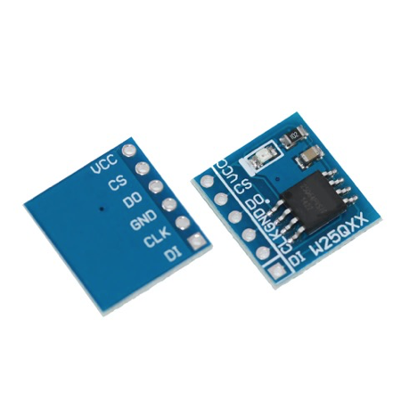

**硬件电路**

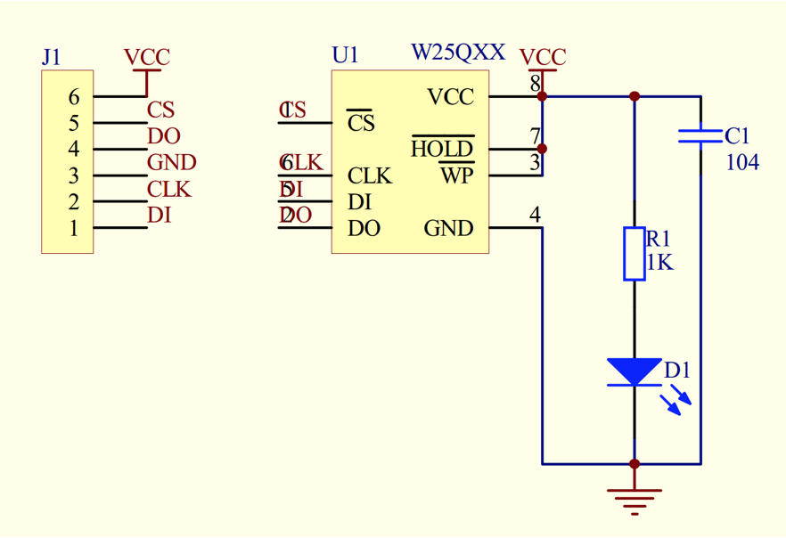

|    引脚    |        功能         |
| :--------: | :-----------------: |
|  VCC、GND  |  电源（2.7~3.6V）   |
|  CS（SS）  |       SPI片选       |
| CLK（SCK） |       SPI时钟       |
| DI（MOSI） | SPI主机输出从机输入 |
| DO（MISO） | SPI主机输入从机输出 |
|     WP     |       写保护        |
|    HOLD    |      数据保持       |

**框图**

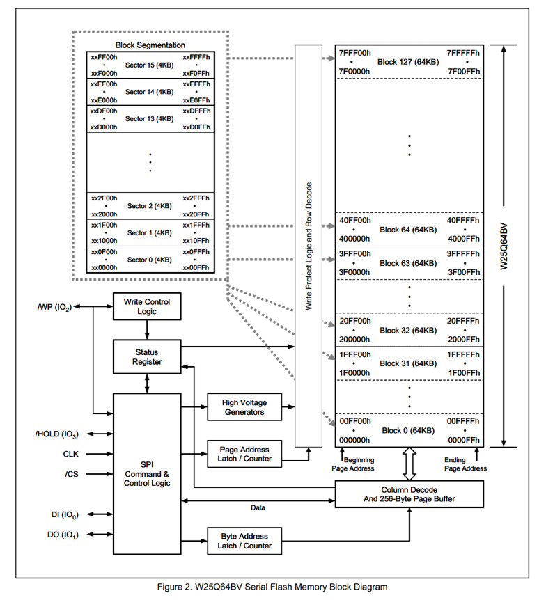

注

1. 存储地址被划分为块，块被划分为扇区，扇区被划分为页
2. 由于SPI速率高，为了同步，需要有一个页缓存区（256字节）

**Flash操作注意事项**

- 写入操作时
  - 写入操作前，必须先进行写使能
  - 每个数据位只能由1改写为0，不能由0改写为1
  - 写入数据前必须先擦除，擦除后，所有数据位变为1
  - 擦除必须按最小擦除单元进行
  - 连续写入多字节时，最多写入一页的数据，超过页尾位置的数据，会回到页首覆盖写入
  - 写入操作结束后，芯片进入忙状态，不响应新的读写操作
- 读取操作时
  - 直接调用读取时序，无需使能，无需额外操作，没有页的限制，读取操作结束后不会进入忙状态，但不能在忙状态时读取

注

1. 最小擦除单元为按扇区进行擦除，无法单独擦除某一字节

**软件SPI读写**

```c
/* SPI.c */

#include "stm32f10x.h" 

/*引脚配置层*/

/**
  * 函    数：SPI写SS引脚电平
  * 参    数：BitValue 协议层传入的当前需要写入SS的电平，范围0~1
  * 返 回 值：无
  * 注意事项：此函数需要用户实现内容，当BitValue为0时，需要置SS为低电平，当BitValue为1时，需要置SS为高电平
  */
void MySPI_W_SS(uint8_t BitValue)
{
	GPIO_WriteBit(GPIOA, GPIO_Pin_4, (BitAction)BitValue);				//根据BitValue，设置SS引脚的电平
}

/**
  * 函    数：SPI写SCK引脚电平
  * 参    数：BitValue 协议层传入的当前需要写入SCK的电平，范围0~1
  * 返 回 值：无
  * 注意事项：此函数需要用户实现内容，当BitValue为0时，需要置SCK为低电平，当BitValue为1时，需要置SCK为高电平
  */
void MySPI_W_SCK(uint8_t BitValue)
{
	GPIO_WriteBit(GPIOA, GPIO_Pin_5, (BitAction)BitValue);				//根据BitValue，设置SCK引脚的电平
}

/**
  * 函    数：SPI写MOSI引脚电平
  * 参    数：BitValue 协议层传入的当前需要写入MOSI的电平，范围0~1
  * 返 回 值：无
  * 注意事项：此函数需要用户实现内容，当BitValue为0时，需要置MOSI为低电平，当BitValue为1时，需要置MOSI为高电平
  */
void MySPI_W_MOSI(uint8_t BitValue)
{
	GPIO_WriteBit(GPIOA, GPIO_Pin_7, (BitAction)BitValue);				//根据BitValue，设置MOSI引脚的电平，BitValue要实现非0即1的特性
}

/**
  * 函    数：I2C读MISO引脚电平
  * 参    数：无
  * 返 回 值：协议层需要得到的当前MISO的电平，范围0~1
  * 注意事项：此函数需要用户实现内容，当前MISO为低电平时，返回0，当前MISO为高电平时，返回1
  */
uint8_t MySPI_R_MISO(void)
{
	return GPIO_ReadInputDataBit(GPIOA, GPIO_Pin_6);							//读取MISO电平并返回
}

/**
  * 函    数：SPI初始化
  * 参    数：无
  * 返 回 值：无
  * 注意事项：此函数需要用户实现内容，实现SS、SCK、MOSI和MISO引脚的初始化
  */
void MySPI_Init(void)
{
	/*开启时钟*/
	RCC_APB2PeriphClockCmd(RCC_APB2Periph_GPIOA, ENABLE);					//开启GPIOA的时钟
	
	/*GPIO初始化*/
	GPIO_InitTypeDef GPIO_InitStructure;
	GPIO_InitStructure.GPIO_Mode = GPIO_Mode_Out_PP;
	GPIO_InitStructure.GPIO_Pin = GPIO_Pin_4 | GPIO_Pin_5 | GPIO_Pin_7;
	GPIO_InitStructure.GPIO_Speed = GPIO_Speed_50MHz;
	GPIO_Init(GPIOA, &GPIO_InitStructure);												//将PA4、PA5和PA7引脚初始化为推挽输出
	
	GPIO_InitStructure.GPIO_Mode = GPIO_Mode_IPU;
	GPIO_InitStructure.GPIO_Pin = GPIO_Pin_6;
	GPIO_InitStructure.GPIO_Speed = GPIO_Speed_50MHz;
	GPIO_Init(GPIOA, &GPIO_InitStructure);												//将PA6引脚初始化为上拉输入
	
	/*设置默认电平*/
	MySPI_W_SS(1);																								//SS默认高电平
	MySPI_W_SCK(0);																								//SCK默认低电平
}

/*协议层*/

/**
  * 函    数：SPI起始
  * 参    数：无
  * 返 回 值：无
  */
void MySPI_Start(void)
{
	MySPI_W_SS(0);									//拉低SS，开始时序
}

/**
  * 函    数：SPI终止
  * 参    数：无
  * 返 回 值：无
  */
void MySPI_Stop(void)
{
	MySPI_W_SS(1);									//拉高SS，终止时序
}

/**
  * 函    数：SPI交换传输一个字节，使用SPI模式0
  * 参    数：ByteSend 要发送的一个字节
  * 返 回 值：接收的一个字节
  */
uint8_t MySPI_SwapByte(uint8_t ByteSend)
{
	uint8_t i, ByteReceive = 0x00;												//定义接收的数据，并赋初值0x00，此处必须赋初值0x00，后面会用到
	
	for (i = 0; i < 8; i ++)															//循环8次，依次交换每一位数据
	{
		/*两个!可以对数据进行两次逻辑取反，作用是把非0值统一转换为1，即：!!(0) = 0，!!(非0) = 1*/
		MySPI_W_MOSI(!!(ByteSend & (0x80 >> i)));					//使用掩码的方式取出ByteSend的指定一位数据并写入到MOSI线
		MySPI_W_SCK(1);																		//拉高SCK，上升沿采样数据
		if (MySPI_R_MISO()){ByteReceive |= (0x80 >> i);}	//读取MISO数据，并存储到Byte变量
		//当MISO为1时，置变量指定位为1，当MISO为0时，不做处理，指定位为默认的初值0
		MySPI_W_SCK(0);																		//拉低SCK，下降沿移出数据
	}
	
	return ByteReceive;																	//返回接收到的一个字节数据
}
```

```c
/* W25Q64.c */

#include "stm32f10x.h"                 
#include "MySPI.h"
#include "W25Q64_Ins.h"

/**
  * 函    数：W25Q64初始化
  * 参    数：无
  * 返 回 值：无
  */
void W25Q64_Init(void)
{
	MySPI_Init();																//先初始化底层的SPI
}

/**
  * 函    数：W25Q64读取ID号
  * 参    数：MID 工厂ID，使用输出参数的形式返回
  * 参    数：DID 设备ID，使用输出参数的形式返回
  * 返 回 值：无
  */
void W25Q64_ReadID(uint8_t *MID, uint16_t *DID)
{
	MySPI_Start();															//SPI起始
	MySPI_SwapByte(W25Q64_JEDEC_ID);						//交换发送读取ID的指令
	*MID = MySPI_SwapByte(W25Q64_DUMMY_BYTE);		//交换接收MID，通过输出参数返回
	*DID = MySPI_SwapByte(W25Q64_DUMMY_BYTE);		//交换接收DID高8位
	*DID <<= 8;																	//高8位移到高位
	*DID |= MySPI_SwapByte(W25Q64_DUMMY_BYTE);	//或上交换接收DID的低8位，通过输出参数返回
	MySPI_Stop();																//SPI终止
}

/**
  * 函    数：W25Q64写使能
  * 参    数：无
  * 返 回 值：无
  */
void W25Q64_WriteEnable(void)
{
	MySPI_Start();													//SPI起始
	MySPI_SwapByte(W25Q64_WRITE_ENABLE);		//交换发送写使能的指令
	MySPI_Stop();														//SPI终止
}

/**
  * 函    数：W25Q64等待忙
  * 参    数：无
  * 返 回 值：无
  */
void W25Q64_WaitBusy(void)
{
	uint32_t Timeout;
	MySPI_Start();																							//SPI起始
	MySPI_SwapByte(W25Q64_READ_STATUS_REGISTER_1);							//交换发送读状态寄存器1的指令
	Timeout = 100000;																						//给定超时计数时间
	while ((MySPI_SwapByte(W25Q64_DUMMY_BYTE) & 0x01) == 0x01)	//循环等待忙标志位
	{
		Timeout --;																								//等待时，计数值自减
		if (Timeout == 0)																					//自减到0后，等待超时
		{
			/*超时的错误处理代码，可以添加到此处*/
			break;																									//跳出等待，不等了
		}
	}
	MySPI_Stop();																								//SPI终止
}

/**
  * 函    数：W25Q64页编程
  * 参    数：Address 页编程的起始地址，范围：0x000000~0x7FFFFF
  * 参    数：DataArray	用于写入数据的数组
  * 参    数：Count 要写入数据的数量，范围：0~256
  * 返 回 值：无
  * 注意事项：写入的地址范围不能跨页
  */
void W25Q64_PageProgram(uint32_t Address, uint8_t *DataArray, uint16_t Count)
{
	uint16_t i;
	
	W25Q64_WriteEnable();												//写使能
	
	MySPI_Start();															//SPI起始
	MySPI_SwapByte(W25Q64_PAGE_PROGRAM);				//交换发送页编程的指令
	MySPI_SwapByte(Address >> 16);							//交换发送地址23~16位
	MySPI_SwapByte(Address >> 8);								//交换发送地址15~8位
	MySPI_SwapByte(Address);										//交换发送地址7~0位
	for (i = 0; i < Count; i ++)								//循环Count次
	{
		MySPI_SwapByte(DataArray[i]);							//依次在起始地址后写入数据
	}
	MySPI_Stop();																//SPI终止
	
	W25Q64_WaitBusy();													//等待忙
}

/**
  * 函    数：W25Q64扇区擦除（4KB）
  * 参    数：Address 指定扇区的地址，范围：0x000000~0x7FFFFF
  * 返 回 值：无
  */
void W25Q64_SectorErase(uint32_t Address)
{
	W25Q64_WriteEnable();												//写使能
	
	MySPI_Start();															//SPI起始
	MySPI_SwapByte(W25Q64_SECTOR_ERASE_4KB);		//交换发送扇区擦除的指令
	MySPI_SwapByte(Address >> 16);							//交换发送地址23~16位
	MySPI_SwapByte(Address >> 8);								//交换发送地址15~8位
	MySPI_SwapByte(Address);										//交换发送地址7~0位
	MySPI_Stop();																//SPI终止
	
	W25Q64_WaitBusy();													//等待忙
}

/**
  * 函    数：W25Q64读取数据
  * 参    数：Address 读取数据的起始地址，范围：0x000000~0x7FFFFF
  * 参    数：DataArray 用于接收读取数据的数组，通过输出参数返回
  * 参    数：Count 要读取数据的数量，范围：0~0x800000
  * 返 回 值：无
  */
void W25Q64_ReadData(uint32_t Address, uint8_t *DataArray, uint32_t Count)
{
	uint32_t i;
	MySPI_Start();																				//SPI起始
	MySPI_SwapByte(W25Q64_READ_DATA);											//交换发送读取数据的指令
	MySPI_SwapByte(Address >> 16);												//交换发送地址23~16位
	MySPI_SwapByte(Address >> 8);													//交换发送地址15~8位
	MySPI_SwapByte(Address);															//交换发送地址7~0位
	for (i = 0; i < Count; i ++)													//循环Count次
	{
		DataArray[i] = MySPI_SwapByte(W25Q64_DUMMY_BYTE);		//依次在起始地址后读取数据
	}
	MySPI_Stop();																					//SPI终止
}
```

```c
/* main.c */

#include "stm32f10x.h"                 
#include "Delay.h"
#include "OLED.h"
#include "W25Q64.h"

uint8_t MID;																			//定义用于存放MID号的变量
uint16_t DID;																			//定义用于存放DID号的变量

uint8_t ArrayWrite[] = {0x01, 0x02, 0x03, 0x04};	//定义要写入数据的测试数组
uint8_t ArrayRead[4];															//定义要读取数据的测试数组

int main(void)
{
	/*模块初始化*/
	OLED_Init();																		//OLED初始化
	W25Q64_Init();																	//W25Q64初始化
	
	/*显示静态字符串*/
	OLED_ShowString(1, 1, "MID:   DID:");
	OLED_ShowString(2, 1, "W:");
	OLED_ShowString(3, 1, "R:");
	
	/*显示ID号*/
	W25Q64_ReadID(&MID, &DID);											//获取W25Q64的ID号
	OLED_ShowHexNum(1, 5, MID, 2);									//显示MID
	OLED_ShowHexNum(1, 12, DID, 4);									//显示DID
	
	/*W25Q64功能函数测试*/
	W25Q64_SectorErase(0x000000);										//扇区擦除
	W25Q64_PageProgram(0x000000, ArrayWrite, 4);		//将写入数据的测试数组写入到W25Q64中
	
	W25Q64_ReadData(0x000000, ArrayRead, 4);				//读取刚写入的测试数据到读取数据的测试数组中
	
	/*显示数据*/
	OLED_ShowHexNum(2, 3, ArrayWrite[0], 2);				//显示写入数据的测试数组
	OLED_ShowHexNum(2, 6, ArrayWrite[1], 2);
	OLED_ShowHexNum(2, 9, ArrayWrite[2], 2);
	OLED_ShowHexNum(2, 12, ArrayWrite[3], 2);
	
	OLED_ShowHexNum(3, 3, ArrayRead[0], 2);					//显示读取数据的测试数组
	OLED_ShowHexNum(3, 6, ArrayRead[1], 2);
	OLED_ShowHexNum(3, 9, ArrayRead[2], 2);
	OLED_ShowHexNum(3, 12, ArrayRead[3], 2);
	
	while (1)
	{
		
	}
}
```

**硬件SPI读写**

```c
/* SPI.c */

#include "stm32f10x.h"                  

/**
  * 函    数：SPI写SS引脚电平，SS仍由软件模拟
  * 参    数：BitValue 协议层传入的当前需要写入SS的电平，范围0~1
  * 返 回 值：无
  * 注意事项：此函数需要用户实现内容，当BitValue为0时，需要置SS为低电平，当BitValue为1时，需要置SS为高电平
  */
void MySPI_W_SS(uint8_t BitValue)
{
	GPIO_WriteBit(GPIOA, GPIO_Pin_4, (BitAction)BitValue);				//根据BitValue，设置SS引脚的电平
}

/**
  * 函    数：SPI初始化
  * 参    数：无
  * 返 回 值：无
  */
void MySPI_Init(void)
{
	/*开启时钟*/
	RCC_APB2PeriphClockCmd(RCC_APB2Periph_GPIOA, ENABLE);					//开启GPIOA的时钟
	RCC_APB2PeriphClockCmd(RCC_APB2Periph_SPI1, ENABLE);					//开启SPI1的时钟
	
	/*GPIO初始化*/
	GPIO_InitTypeDef GPIO_InitStructure;
	GPIO_InitStructure.GPIO_Mode = GPIO_Mode_Out_PP;
	GPIO_InitStructure.GPIO_Pin = GPIO_Pin_4;
	GPIO_InitStructure.GPIO_Speed = GPIO_Speed_50MHz;
	GPIO_Init(GPIOA, &GPIO_InitStructure);												//将PA4引脚初始化为推挽输出
	
	GPIO_InitStructure.GPIO_Mode = GPIO_Mode_AF_PP;
	GPIO_InitStructure.GPIO_Pin = GPIO_Pin_5 | GPIO_Pin_7;
	GPIO_InitStructure.GPIO_Speed = GPIO_Speed_50MHz;
	GPIO_Init(GPIOA, &GPIO_InitStructure);												//将PA5和PA7引脚初始化为复用推挽输出
	
	GPIO_InitStructure.GPIO_Mode = GPIO_Mode_IPU;
	GPIO_InitStructure.GPIO_Pin = GPIO_Pin_6;
	GPIO_InitStructure.GPIO_Speed = GPIO_Speed_50MHz;
	GPIO_Init(GPIOA, &GPIO_InitStructure);												//将PA6引脚初始化为上拉输入
	
	/*SPI初始化*/
	SPI_InitTypeDef SPI_InitStructure;														//定义结构体变量
	SPI_InitStructure.SPI_Mode = SPI_Mode_Master;									//模式，选择为SPI主模式
	SPI_InitStructure.SPI_Direction = SPI_Direction_2Lines_FullDuplex;		//方向，选择2线全双工
	SPI_InitStructure.SPI_DataSize = SPI_DataSize_8b;							//数据宽度，选择为8位
	SPI_InitStructure.SPI_FirstBit = SPI_FirstBit_MSB;						//先行位，选择高位先行
	SPI_InitStructure.SPI_BaudRatePrescaler = SPI_BaudRatePrescaler_128;	//波特率分频，选择128分频
	SPI_InitStructure.SPI_CPOL = SPI_CPOL_Low;				//SPI极性，选择低极性
	SPI_InitStructure.SPI_CPHA = SPI_CPHA_1Edge;			//SPI相位，选择第一个时钟边沿采样，极性和相位决定选择SPI模式0
	SPI_InitStructure.SPI_NSS = SPI_NSS_Soft;					//NSS，选择由软件控制
	SPI_InitStructure.SPI_CRCPolynomial = 7;					//CRC多项式，暂时用不到，给默认值7
	SPI_Init(SPI1, &SPI_InitStructure);								//将结构体变量交给SPI_Init，配置SPI1
	
	/*SPI使能*/
	SPI_Cmd(SPI1, ENABLE);														//使能SPI1，开始运行
	
	/*设置默认电平*/
	MySPI_W_SS(1);																		//SS默认高电平
}

/**
  * 函    数：SPI起始
  * 参    数：无
  * 返 回 值：无
  */
void MySPI_Start(void)
{
	MySPI_W_SS(0);																		//拉低SS，开始时序
}

/**
  * 函    数：SPI终止
  * 参    数：无
  * 返 回 值：无
  */
void MySPI_Stop(void)
{
	MySPI_W_SS(1);																		//拉高SS，终止时序
}

/**
  * 函    数：SPI交换传输一个字节，使用SPI模式0
  * 参    数：ByteSend 要发送的一个字节
  * 返 回 值：接收的一个字节
  */
uint8_t MySPI_SwapByte(uint8_t ByteSend)
{
	while (SPI_I2S_GetFlagStatus(SPI1, SPI_I2S_FLAG_TXE) != SET);	//等待发送数据寄存器空
	
	SPI_I2S_SendData(SPI1, ByteSend);															//写入数据到发送数据寄存器，开始产生时序
	
	while (SPI_I2S_GetFlagStatus(SPI1, SPI_I2S_FLAG_RXNE) != SET);//等待接收数据寄存器非空
	
	return SPI_I2S_ReceiveData(SPI1);															//读取接收到的数据并返回
}
```

```c
/* W25Q64.c */
//同上
```

```c
/* main.c */
//同上
```
