<font size = 6>System Programming for Linux</font>

[toc]

# 虚拟地址

虚拟地址空间用来加载程序数据，对应着一段连续的内存地址，起始位置为0，不是物理内存的0地址。

虚拟地址空间的大小由操作系统决定，32位的操作系统虚拟地址空间的大小为 2$^{32}$ 字节，也就是4G。当运行磁盘上一个可执行程序, 就会得到一个进程，内核会给每一个运行的进程创建一块属于自己的虚拟地址空间，并将应用程序数据装载到虚拟地址空间对应的地址上。

进程在运行过程中，程序内部所有的指令都是通过CPU处理完成的，CPU只进行数据运算并不具备数据存储的能力，其处理的数据都加载自物理内存，可以通过CPU中的内存管理单元MMU从进程的虚拟地址空间中映射到物理内存。

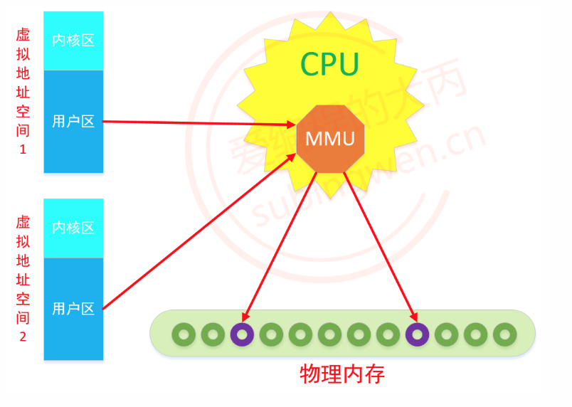

## 存在意义

**若直接采用物理地址**


- 每个进程的地址不隔离，有安全风险
- 内存效率低
- 进程中数据的地址不确定，每次都会发生变化

**有了虚拟地址空间之后**

虚拟地址空间就是一个中间层，将程序和物理内存隔离开来。程序中访问的内存地址不再是实际的物理内存地址，而是一个虚拟地址，由操作系统将这个虚拟地址映射到适当的物理内存地址上。这样，只要操作系统处理好虚拟地址到物理内存地址的映射，就可以保证不同的程序最终访问的内存地址位于不同的区域，彼此没有重叠，就可以达到内存地址空间隔离的效果。

## 分区

从操作系统层级上，虚拟地址空间主要分为内核区和用户区。

**内核区**

- 不允许应用程序读写内核区域的内容或直接调用内核代码定义的函数
- 内核总是驻留在内存中，是操作系统的一部分
- 系统中所有进程对应的虚拟地址空间的内核区都会映射到同一块物理内存上（系统内核只有一个）

**用户区**

- 存储用户程序运行中用到的各种数据

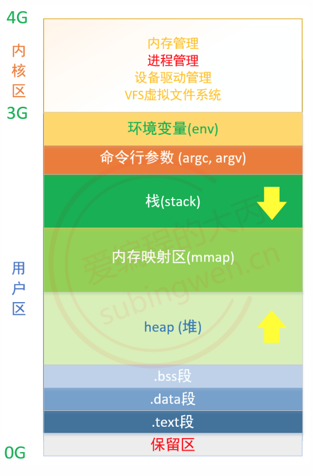

- 保留区：位于虚拟地址空间的最底部，未赋予物理地址。任何对它的引用都是非法的，程序中的空指针（NULL）指向的就是这块内存地址
- .text段：代码段也称正文段或文本段，通常用于存放程序的执行代码(即CPU执行的机器指令)，代码段一般情况下是只读的
- .data段：数据段通常用于存放程序中已初始化且初值不为0的全局变量和静态变量。数据段属于静态内存分配(静态存储区)，可读可写
- .bss段：未初始化以及初始为0的全局变量和静态变量，操作系统会将这些未初始化变量初始化为0
- 堆(heap)：用于存放进程运行时动态分配的内存
  - 堆中内容是匿名的，不能按名字直接访问，只能通过指针间接访问
  - 堆向高地址扩展，是不连续的内存区域。这是由于系统用链表来存储空闲内存地址，自然不连续，而链表从低地址向高地址遍历
- 内存映射区(mmap)：作为内存映射区加载磁盘文件，或者加载程序运作过程中需要调用的动态库
- 栈(stack)：存储函数内部声明的非静态局部变量，函数参数，函数返回地址等信息，栈内存由编译器自动分配释放。栈地址“向下生长”，分配的内存是连续的
- 命令行参数：存储进程执行的时候传递给main()函数的参数argc、argv
- 环境变量：存储和进程相关的环境变量，如工作路径、进程所有者等信息

# 文件描述符

## 文件描述符

在Linux操作系统中的一切都被抽象成了文件，对这些文件的读写都需要通过文件描述符来完成。当在进程中打开一个现有文件或者创建一个新文件时，内核向该进程返回一个文件描述符，用于对应这个打开/新建的文件。这些文件描述符都存储在内核为每个进程维护的一个文件描述符表中。

文件描述符这一概念往往只适用于UNIX、Linux这样的操作系统。fd只是钥匙，通过它找到内核里的真实对象，所有IO操作本质都是“用户态 ↔ 内核态 ↔ 设备”的数据拷贝流程。

标准C库的文件IO函数使用的文件指针FILE*在Linux中也需要通过文件描述符的辅助才能完成读写操作。FILE其实是一个结构体，其内部有一个成员就是文件描述符。

一个文件文件描述符对应两块内存，一块内存是读缓冲区，一块内存是写缓冲区。

- 读数据:：通过文件描述符将内存中的数据读出,，这块内存称之为读缓冲区
- 写数据：通过文件描述符将数据写入到某块内存中，这块内存称之为写缓冲区

## 文件描述符表

启动一个进程就会得到一个对应的虚拟地址空间，在内核区有专门用于进程管理的模块。Linux的进程控制块（PCB）本质是一个叫做task_struct的结构体，里边包括管理进程所需的各种信息，其中有一个结构体叫做file ，将它叫做文件描述符表，里边有一个整形索引表，用于存储文件描述符。

内核为每一个进程维护了一个文件描述符表，索引表中的值都是从0开始的，所以在不同的进程中即使会看到相同的文件描述符，但是它们指向的不一定是同一个磁盘文件。

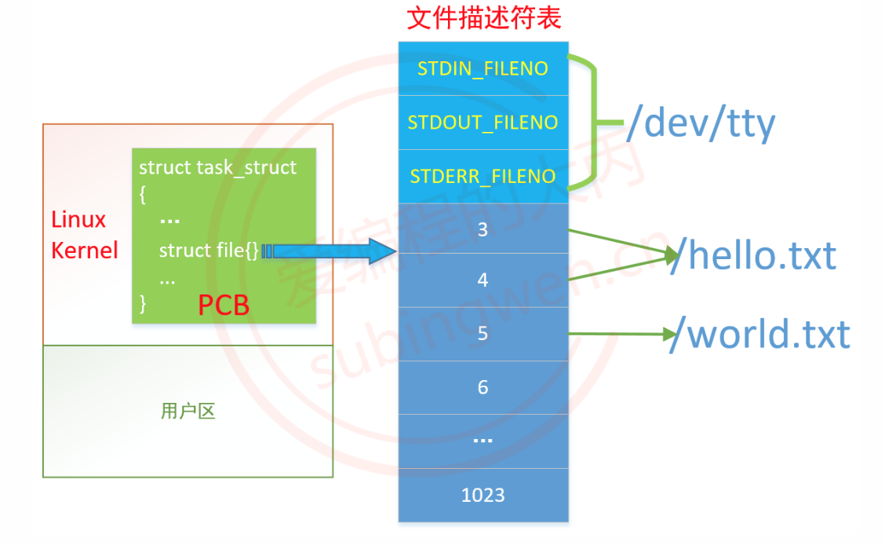

**打开的最大文件数**

每一个进程对应的文件描述符表能够存储的打开的文件数是有限制的，默认为1024个，这个默认值是可以修改的。

**默认分配的文件描述符**

当一个进程被启动之后，内核PCB的文件描述符表中就已经分配了三个文件描述符，这三个文件描述符对应的都是当前启动这个进程的终端文件

- STDIN_FILENO：标准输入，宏值为0
- STDOUT_FILENO：标准输出，宏值为1
- STDERR_FILENO：标准错误，宏值为2

注

1. 这三个默认分配的文件描述符是可以通过close()函数关闭掉

**给新打开的文件分配文件描述符**

因为进程启动之后，文件描述符表中的0,1,2就被分配出去了，因此从3开始分配。

在进程中每打开一个文件，就会给这个文件分配一个新的文件描述符，打开的新文件会关联文件描述符表中最小的没有被占用的文件描述符。一个进程中不同的文件描述符打开的磁盘文件可能是同一个。每个进程文件描述符表中的文件描述符值是唯一的，不会重复。

注

1. Linux中用户操作的每个终端都被视作一个设备文件, 当前操作的终端文件可以使用 /dev/tty表示

# 系统文件I/O

每个系统都有自己的专属函数，称其为系统函数。系统函数并不是内核函数，因为内核函数是不允许用户使用的，而系统函数充当了二者之间的桥梁，这样用户就可以间接的完成某些内核操作了。

**真实流程**

用户缓冲(~8KB)⇔内核 page cache(很大)⇔磁盘

## open/close

### open

打开磁盘文件，如果文件不存在，还可以自动创建。

```c
#include <sys/types.h>
#include <sys/stat.h>
#include <fcntl.h>

/*
open是一个系统函数, 只能在linux系统中使用, windows不支持
fopen是标准c库函数, 一般都可以跨平台使用
*/

/*
* 参数:
- pathname: 被打开的文件的文件名
- flags: 使用什么方式打开指定的文件
	- 访问模式（必须选一个）
		- O_RDONLY: 以只读方式打开文件
		- O_WRONLY: 以只写方式打开文件
		- O_RDWR:   以读写方式打开文件
	- 其他可选属性（用｜组合）
		- O_CREAT: 如果文件不存在, 创建该文件, 如果文件存在什么也不做
		- O_EXCL: 与 O_CREAT 一起使用，若文件已存在则报错返回-1（如果不添加这个属性，不会返回-1）
		- O_TRUNC: 如果文件已存在且可写，则清空内容
		- O_APPEND: 新数据追加到文件尾部, 不会覆盖文件的原来内容
		- O_NONBLOCK: 非阻塞模式，读不到数据立即返回，写满立即返回
		- O_SYNC: 每次 write 都同步到磁盘，数据 + 元数据都同步，很慢但安全，默认为异步写入
		- O_DSYNC: 只同步数据，不一定同步元数据(文件的属性信息)，比 O_SYNC 快
		- O_CLOEXEC: 当执行 exec() 时自动关闭该 fd
		- O_DIRECTORY: 只能打开目录，否则报错
- mode: 在创建新文件的时候才需指定这个参数的值，用于指定新文件的权限，这是一个八进制的整数，最大值为0777，创建的新文件对应的最终实际权限, 计算公式: (mode & ~umask)

* 返回值:
- 成功: 返回内核分配的文件描述符, 这个值被记录在内核的文件描述符表中，这是一个大于0的整数
- 失败: -1
*/

// 打开一个已经存在的磁盘文件
int open(const char *pathname, int flags);
// 打开磁盘文件, 如果文件不存在, 就会自动创建
int open(const char *pathname, int flags, mode_t mode);
```

### close

释放打开的对应的文件描述符。

```c
#include <unistd.h>

/*
* 参数:
- fd: 文件描述符, 是open() 函数的返回值

* 返回值:
- 成功: 0
- 失败: -1
*/

int close(int fd);
```

### 举例

> 文件状态判断

```c
#include <stdio.h>
#include <stdlib.h>
#include <unistd.h>
#include <string.h>
#include <fcntl.h>

int main()
{
    // 创建新文件之前, 先检测是否存在
    // 文件存在创建失败, 返回-1, 文件不存在创建成功, 返回分配的文件描述符
    int fd = open("./new.txt", O_CREAT|O_EXCL|O_RDWR);
    if(fd == -1)
    {
        printf("创建文件失败, 已经存在了, fd: %d\n", fd);
    }
    else
    {
        printf("创建新文件成功, fd: %d\n", fd);
    }

    close(fd);
    return 0;
}
```

```shell
$ gcc open1.c 
$ ./a.out 
创建文件失败, 已经存在了, fd: -1
```

## read/write

### read

用于读取文件内部数据，在通过 open 打开文件的时候需要指定读权限。

```c
#include <unistd.h>

/*
* 参数:
- fd: 文件描述符, open() 函数的返回值
- buf: 传出参数, 指向一块有效的内存, 用于存储从文件中读出的数据
- count: buf指针指向的内存的大小, 指定可以存储的最大字节数

* 返回值:
- 大于0: 从文件中读出的字节数，读文件成功
- 等于0: 代表文件读完了，读文件成功
- -1: 读文件失败了
*/

ssize_t read(int fd, void *buf, size_t count);
```

注

1. 传出参数: 类似于返回值，将变量地址传递给函数，函数调用完毕，地址中就有数据了

### write

用于将数据写入到文件内部，在通过 open 打开文件的时候需要指定写权限。

```c
#include <unistd.h>

/*
* 参数:
- fd: 文件描述符, open() 函数的返回值
- buf: 指向一块有效的内存地址, 里边有要写入到磁盘文件中的数据
- count: 要往磁盘文件中写入的字节数, 一般情况下就是buf字符串的长度, strlen(buf)

* 返回值:
- 大于0: 成功写入到磁盘文件中的字节数
- -1: 写文件失败了
*/
ssize_t write(int fd, const void *buf, size_t count);
```

### 文件拷贝

```c
#include <stdio.h>
#include <stdlib.h>
#include <unistd.h>
#include <string.h>
#include <fcntl.h>

int main()
{
    // 1. 打开存在的文件english.txt, 读这个文件
    int fd1 = open("./english.txt", O_RDONLY);
    if(fd1 == -1)
    {
        perror("open-readfile");
        return -1;
    }

    // 2. 打开不存在的文件, 将其创建出来, 将从english.txt读出的内容写入这个文件中
    int fd2 = open("copy.txt", O_APPEND|O_WRONLY|O_CREAT, 0775);
    if(fd2 == -1)
    {
        perror("open-writefile");
        return -1;
    }

    // 3. 循环读文件, 循环写文件
    char buf[4096];
    int len = -1;
    while( (len = read(fd1, buf, sizeof(buf))) > 0 )
    {
        // 将读到的数据写入到另一个文件中
        write(fd2, buf, len); 
    }
    // 4. 关闭文件
    close(fd1);
    close(fd2);

    return 0;
}
```

## lseek

既可以通过这个函数移动文件指针, 也可以通过这个函数进行文件的拓展。

```c
#include <sys/types.h>
#include <unistd.h>

/*
* 参数:
- fd: 文件描述符, open() 函数的返回值
- offset: 偏移量，需要和第三个参数配合使用
- whence: 通过这个参数指定函数实现什么样的功能
	- SEEK_SET: 从文件头部开始偏移 offset 个字节
	- SEEK_CUR: 从当前文件指针的位置向后偏移offset个字节
	- SEEK_END: 从文件尾部向后偏移offset个字节

* 返回值:
- 成功: 文件指针从头部开始计算总的偏移量
- 失败: -1
*/

off_t lseek(int fd, off_t offset, int whence);
```

### 移动文件指针

通过对 lseek 函数第三个参数的设置，该函数可以实现如下几个功能。

```c
// 文件指针移动到文件头部
lseek(fd, 0, SEEK_SET);

// 得到当前文件指针的位置
lseek(fd, 0, SEEK_CUR); 

// 得到文件总大小
lseek(fd, 0, SEEK_END);
```

### 文件拓展

假设使用一个下载软件进行一个大文件下载，但是磁盘很紧张，如果不能马上将文件下载到本地，磁盘空间就可能被其他文件占用了，导致下载软件下载的文件无处存放。那么这个文件怎么解决呢？

可以在开始下载的时候先进行文件拓展，将一些字符写入到目标文件中，让拓展的文件和即将被下载的文件一样大，这样磁盘空间就被成功抢到手，软件就可以慢悠悠的下载对应的文件了。

使用 lseek 函数进行文件拓展必须要满足下述条件：

- 文件指针必须要偏移到文件尾部之后， 多出来的就需要被填充的部分
- 文件拓展之后，必须要使用 write()函数进行一次写操作（写什么都可以）

**举例**

> 拓展文件大小

```c
#include <stdio.h>
#include <fcntl.h>
#include <unistd.h>

int main()
{
    int fd = open("hello.txt", O_RDWR);
    if(fd == -1)
    {
        perror("open");
        return -1;
    }

    // 文件拓展, 一共增加了 1001 个字节
    lseek(fd, 1000, SEEK_END);
    write(fd, " ", 1);
        
    close(fd);
    return 0;
}
```

```shell
# 编译程序 
$ gcc lseek.c

# 查看目录文件信息
$ ll
-rwxrwxr-x 1 robin robin 8808 May  6  2019 a.out*
-rwxrwxr-x 1 robin robin 1013 May  6  2019 hello.txt*
-rw-rw-r-- 1 robin robin  299 May  6  2019 lseek.c

# 执行程序, 拓展文件
$ ./a.out 

# 在查看目录文件信息
$ ll
-rwxrwxr-x 1 robin robin 8808 May  6  2019 a.out*
-rwxrwxr-x 1 robin robin 2014 Jan 30 17:39 hello.txt*   # 大小从 1013 -> 2014, 拓展了1001字节
-rw-rw-r-- 1 robin robin  299 May  6  2019 lseek.c
```

## truncate/ftruncate

truncate/ftruncate 这两个函数的功能是一样的，可以对文件进行拓展也可以截断文件。使用这两个函数拓展文件比使用lseek要简单。

```c
#include <unistd.h>
#include <sys/types.h>

/*
* 参数:
- path: 要拓展/截断的文件的文件名
- fd: 文件描述符, open() 得到的
- length: 文件的最终大小
	- 文件原来size > length，文件被截断, 尾部多余的部分被删除, 文件最终长度为length
	- 文件原来size < length，文件被拓展, 文件最终长度为length

* 返回值:
- 成功: 0
- 失败: -1
*/

int truncate(const char *path, off_t length); 
int ftruncate(int fd, off_t length);
```

注

1. 不管是使用这两个函数还是使用 lseek() 函数拓展文件，文件尾部填充的字符都是 0

## perror

errno是一个全局变量，只要调用的Linux系统函数有异常（返回-1）, 错误对应的错误号就会被设置给这个全局变量。这个错误号存储在系统的两个头文件中

- `/usr/include/asm-generic/errno-base.h`
- `/usr/include/asm-generic/errno.h`

得到错误号，去查询对应的头文件是非常不方便的，我们可以通过 perror 函数将错误号对应的描述信息打印出来。

```c
#include <stdio.h>

/*
* 参数:
- s: 自己指定这个字符串的值就可以, 指定什么就会原样输出, 除此之外还会输出错误号对应的描述信息
*/

void perror(const char *s);	
```

**举例**

```c
#include <stdio.h>
#include <fcntl.h>
#include <unistd.h>

int main()
{
    int fd = open("hello.txt", O_RDWR|O_EXCL|O_CREAT, 0777);
    if(fd == -1)
    {
        perror("open");
        return -1;
    }
        
    close(fd);
    return 0;
}
```

```shell
$ gcc open.c
$ ./a.out 
open: File exists	# 通过 perror 输出的错误信息
```

# 文件属性信息

## stat/lstat 函数

stat/lstat 函数的功能和 stat 命令的功能是一样的, 这两个函数的区别在于处理软链接文件的方式上

- `lstat()`: 得到的是软连接文件本身的属性信息
- `stat()`: 得到的是软链接文件关联的文件的属性信息

```c
#include <sys/types.h>
#include <sys/stat.h>
#include <unistd.h>

/*
* 参数:
- pathname: 文件名, 要获取这个文件的属性信息
- buf: 传出参数, 文件的信息被写入到了这块内存中

* 返回值:
- 成功: 0
- 失败: -1
*/

int stat(const char *pathname, struct stat *buf);
int lstat(const char *pathname, struct stat *buf);
```

stat 结构体原型

```c
struct stat {
    dev_t          st_dev;        	// 文件的设备编号
    ino_t           st_ino;        	// inode节点
    mode_t      st_mode;      		// 文件的类型和存取的权限, 16位整形数  -> 常用
    nlink_t        st_nlink;     	// 连到该文件的硬连接数目，刚建立的文件值为1
    uid_t           st_uid;       	// 用户ID
    gid_t           st_gid;       	// 组ID
    dev_t          st_rdev;      	// (设备类型)若此文件为设备文件，则为其设备编号
    off_t            st_size;      	// 文件字节数(文件大小)
    blksize_t     st_blksize;   	// IO块大小(文件系统的I/O缓冲区大小)
    blkcnt_t      st_blocks;    	// block的块数
    time_t         st_atime;     	// 最后一次访问时间
    time_t         st_mtime;     	// 最后一次修改时间(文件内容)
    time_t         st_ctime;     	// 最后一次改变时间(指属性)
};
```

**获取文件类型**

文件的类型信息存储在 struct stat 结构体的 st_mode 成员中, 它是一个 mode_t 类型, 本质上是一个16位的整数。Linux API中为我们提供了相关的宏函数，通过对应的宏函数可以直接判断出文件是不是某种类型。

```c
// m 对应的就是结构体成员 st_mode
// 宏函数返回值: 是对应的类型返回-> 1, 不是对应类型返回0

S_ISREG(m)  is it a regular file?	- 普通文件
S_ISDIR(m)  directory?				- 目录
S_ISCHR(m)  character device?		- 字符设备
S_ISBLK(m)  block device?			- 块设备
S_ISFIFO(m) FIFO (named pipe)?		- 管道
S_ISLNK(m)  symbolic link?			- 软连接
S_ISSOCK(m) socket?					- 本地套接字文件
```

**获取文件权限**

用户对文件的操作权限也存储在 struct stat 结构体的st_mode成员中, 在这个16位的整数中不同用户的权限存储位置如下。

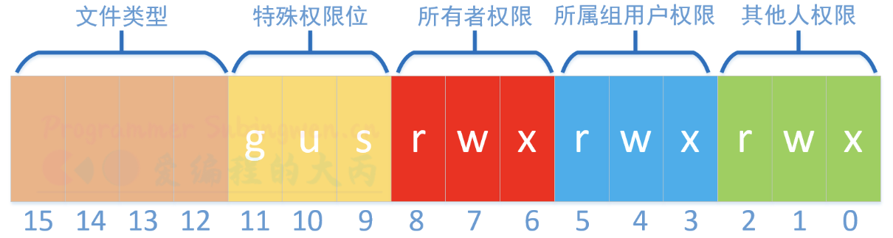

对应用于判定的宏如下。

```shell
关于变量 st_mode (16位整数):
○ 0-2 bit -- 其他人权限
	- S_IROTH    00004  读权限   100
	- S_IWOTH    00002  写权限   010
	- S_IXOTH    00001  执行权限  001
	- S_IRWXO    00007  掩码, 过滤 st_mode中除其他人权限以外的信息
○ 3-5 bit -- 所属组权限
	- S_IRGRP    00040  读权限
	- S_IWGRP    00020  写权限
	- S_IXGRP    00010  执行权限
	- S_IRWXG    00070  掩码, 过滤 st_mode中除所属组权限以外的信息
○ 6-8 bit -- 文件所有者权限
	- S_IRUSR    00400    读权限
	- S_IWUSR    00200    写权限
	- S_IXUSR    00100    执行权限
	- S_IRWXU    00700    掩码, 过滤 st_mode中除文件所有者权限以外的信息
○ 12-15 bit -- 文件类型
	- S_IFSOCK   0140000 套接字
	- S_IFLNK    0120000 符号链接（软链接）
	- S_IFREG    0100000 普通文件
	- S_IFBLK    0060000 块设备
	- S_IFDIR    0040000 目录
	- S_IFCHR    0020000 字符设备
	- S_IFIFO    0010000 管道
	- S_IFMT     0170000 掩码,过滤 st_mode中除文件类型以外的信息
```

**举例**

> 模拟 `ls -l`

```c
#include <stdio.h>
#include <string.h>
#include <sys/types.h>
#include <sys/stat.h>
#include <stdlib.h>
#include <time.h>
#include <pwd.h>
#include <grp.h>


int main(int argc, char* argv[])
{
    if(argc < 2)
    {
        printf("./a.out filename\n");
        exit(1);
    }

    struct stat st;
    int ret = stat(argv[1], &st);
    if(ret == -1)
    {
        perror("stat");
        exit(1);
    }

    // 存储文件类型和访问权限
    char perms[11] = {0};
    // 判断文件类型
    switch(st.st_mode & S_IFMT)
    {
        case S_IFLNK:
            perms[0] = 'l';
            break;
        case S_IFDIR:
            perms[0] = 'd';
            break;
        case S_IFREG:
            perms[0] = '-';
            break;
        case S_IFBLK:
            perms[0] = 'b';
            break;
        case S_IFCHR:
            perms[0] = 'c';
            break;
        case S_IFSOCK:
            perms[0] = 's';
            break;
        case S_IFIFO:
            perms[0] = 'p';
            break;
        default:
            perms[0] = '?';
            break;
    }
    // 判断文件的访问权限
    // 文件所有者
    perms[1] = (st.st_mode & S_IRUSR) ? 'r' : '-';
    perms[2] = (st.st_mode & S_IWUSR) ? 'w' : '-';
    perms[3] = (st.st_mode & S_IXUSR) ? 'x' : '-';
    // 文件所属组
    perms[4] = (st.st_mode & S_IRGRP) ? 'r' : '-';
    perms[5] = (st.st_mode & S_IWGRP) ? 'w' : '-';
    perms[6] = (st.st_mode & S_IXGRP) ? 'x' : '-';
    // 其他人
    perms[7] = (st.st_mode & S_IROTH) ? 'r' : '-';
    perms[8] = (st.st_mode & S_IWOTH) ? 'w' : '-';
    perms[9] = (st.st_mode & S_IXOTH) ? 'x' : '-';

    // 硬链接计数
    int linkNum = st.st_nlink;
    // 文件所有者
    char* fileUser = getpwuid(st.st_uid)->pw_name;
    // 文件所属组
    char* fileGrp = getgrgid(st.st_gid)->gr_name;
    // 文件大小
    int fileSize = (int)st.st_size;
    // 修改时间
    char* time = ctime(&st.st_mtime);
    char mtime[512] = {0};
    strncpy(mtime, time, strlen(time)-1);

    char buf[1024];
    sprintf(buf, "%s  %d  %s  %s  %d  %s  %s", 
            perms, linkNum, fileUser, fileGrp, fileSize, mtime, argv[1]);

    printf("%s\n", buf);

    return 0;
}
```

# 文件描述符复制和重定向

## dup

复制文件描述符，返回一个最小的未使用 fd。

```c
#include <unistd.h>

/*
* 参数:
- oldfd: 要被复制的文件描述符

* 返回值:
- 成功: 返回一个最小的未使用 fd
- 失败: -1
*/

int dup(int oldfd);
```

被复制出的新文件描述符是独立于旧的文件描述符的，即使当旧的文件描述符被关闭了，复制出的新文件描述符还是可以继续使用。

**举例**

```c
#include <stdio.h>
#include <stdlib.h>
#include <unistd.h>
#include <string.h>
#include <fcntl.h>

int main()
{
    // 1. 创建一个新的磁盘文件
    int fd = open("./mytest.txt", O_RDWR|O_CREAT, 0664);
    if(fd == -1)
    {
        perror("open");
        exit(0);
    }
    printf("fd: %d\n", fd);

    // 写数据
    const char* pt = "你好, 世界......";
    // 写成功之后, 文件指针在文件尾部
    write(fd, pt, strlen(pt));


    // 复制这个文件描述符 fd
    int newfd = dup(fd);
    printf("newfd: %d\n", newfd);

    // 关闭旧的文件描述符
    close(fd);

    // 使用新的文件描述符继续写文件
    const char* ppt = "((((((((((((((((((((((骚年，你要相信光！！！))))))))))))))))))))))";
    write(newfd, ppt, strlen(ppt));
    close(newfd);

    return 0;
}
```

```shell
$ gcc open.c -o open
$ ./open 
fd: 3
newfd: 4
$ cat mytest.txt
你好, 世界......((((((((((((((((((((((骚年，你要相信光！！！)))))))))))))))))))))) 
```

## dup2

dup2() 函数是 dup() 函数的加强版，把一个文件描述符复制到指定编号的位置。

```c
#include <unistd.h>

/*
* 参数:
- oldfd: 目标文件描述符
- newfd: 待转移的文件描述符

* 返回值:
- 成功: 返回newfd
- 失败: -1
*/


// 假设参数 oldfd 对应磁盘文件 a.txt, newfd对应磁盘文件b.txt，调用dup2函数后，发生重定向，最终 oldfd 和 newfd 都指向了磁盘文件 a.txt
// 假设参数 oldfd 对应磁盘文件 a.txt, newfd不对应任何的磁盘文件（newfd 必须是一个大于等于0的整数，调用dup2函数后，发生复制，最终 oldfd 和 newfd 都指向了磁盘文件 a.txt

int dup2(int oldfd, int newfd);
```

**举例**

```c
#include <stdio.h>
#include <fcntl.h>
#include <unistd.h>

int main() {
    int fd = open("output.txt", O_WRONLY | O_CREAT | O_TRUNC, 0644);

    dup2(fd, 1);   // 把 stdout 重定向到文件
    close(fd);     // 可以关闭原 fd

    printf("Hello World\n");  // 会写入 output.txt

    return 0;
}
```

## fcntl

fcntl() 是一个变参函数, 并且是多功能函数。

```c
#include <unistd.h>
#include <fcntl.h>

/*
* 参数:
- fd: 要操作的文件描述符
- cmd: 通过该参数控制函数要实现什么功能
	- F_DUPFD: 复制一个已经存在的文件描述符
	- F_GETFL: 获取文件的状态标志
	- F_SETFL: 设置文件的状态标志

* 返回值:
- 成功
	- 参数 cmd = F_DUPFD：返回新的被分配的文件描述符
	- 参数 cmd = F_GETFL：返回文件的flag属性信息
- 失败: -1
*/

int fcntl(int fd, int cmd, ... );
```

注

1. 文件的状态标志指的是在使用 open() 函数打开文件的时候指定的 flags 属性, 也就是第二个参数
2. 不是所有的flag 属性都能被动态修改, 只能修改如下状态标志: O_APPEND, O_NONBLOCK, O_SYNC, O_ASYNC, O_RSYNC等

**举例**

> 复制文件描述符

```c
#include <stdio.h>
#include <stdlib.h>
#include <unistd.h>
#include <string.h>
#include <fcntl.h>

int main()
{
    // 1. 创建一个新的磁盘文件
    int fd = open("./mytest.txt", O_RDWR|O_CREAT, 0664);
    if(fd == -1)
    {
        perror("open");
        exit(0);
    }
    printf("fd: %d\n", fd);

    // 写数据
    const char* pt = "你好, 世界......";
    // 写成功之后, 文件指针在文件尾部
    write(fd, pt, strlen(pt));


    // 复制这个文件描述符 fd
    int newfd = fcntl(fd, F_DUPFD);
    printf("newfd: %d\n", newfd);

    // 关闭旧的文件描述符
    close(fd);

    // 使用新的文件描述符继续写文件
    const char* ppt = "((((((((((((((((((((((骚年，你要相信光！！！))))))))))))))))))))))";
    write(newfd, ppt, strlen(ppt));
    close(newfd);

    return 0;
}
```

> 设置文件状态标志

```c
// 写实例程序, 给文件描述符追加 O_APPEND
#include <stdio.h>
#include <stdlib.h>
#include <unistd.h>
#include <string.h>
#include <fcntl.h>

int main()
{
    // 1. 打开一个已经存在的磁盘文件
    int fd = open("./111.txt", O_RDWR);
    if(fd == -1)
    {
        perror("open");
        exit(0);
    }
    printf("fd: %d\n", fd);

    // 如果不想将数据写到文件头部, 可以给文件描述符追加一个O_APPEND属性
    // 通过fcntl获取文件描述符的 flag属性
    int flag = fcntl(fd, F_GETFL);
    // 给得到的flag追加 O_APPEND属性
    flag = flag | O_APPEND; // flag |= O_APPEND;
    // 重新将flag属性设置给文件描述符
    fcntl(fd, F_SETFL, flag);

    // 使用fd写文件, 添加的数据应该写到文件尾部
    const char* ppp = "((((((((((((((((((((((骚年，你要相信光！！！))))))))))))))))))))))";
    write(fd, ppp, strlen(ppp));
    close(fd);

    return 0;
}
```

# 目录的遍历

## opendir

在目录操作之前必须要先通过 opendir() 函数打开这个目录。

```c
#include <sys/types.h>
#include <dirent.h>

/*
* 参数:
- name: 要打开的目录的路径

* 返回值:
- 成功: 返回目录的实例
- 失败: NULL
*/

DIR *opendir(const char *name);
```

## readdir

目录打开之后，就可以通过 readdir() 函数遍历目录中的文件信息了。每调用一次这个函数就可以得到目录中的一个文件信息，当目录中的文件信息被全部遍历完毕会得到一个空对象。

```c
// 读目录
#include <dirent.h>

/*
* 参数:
- dirp: opendir() 函数的返回值

* 返回值:
- 成功: 返回文件的实例
- 失败: NULL
*/

struct dirent *readdir(DIR *dirp);
```

struct dirent 结构体原型如下。

```c
struct dirent {
    ino_t          d_ino;       /* 文件对应的inode编号, 定位文件存储在磁盘的那个数据块上 */
    off_t          d_off;       /* 文件在当前目录中的偏移量 */
    unsigned short d_reclen;    /* 文件名字的实际长度 */
    unsigned char  d_type;      /* 文件的类型, linux中有7中文件类型 */
    char           d_name[256]; /* 文件的名字 */
};

// 文件类型d_type 可使用的宏值
- DT_BLK：		块设备文件
- DT_CHR：		字符设备文件
- DT_DIR：		目录文件
- DT_FIFO ：		管道文件
- DT_LNK：		软连接文件
- DT_REG ：		普通文件
- DT_SOCK：		本地套接字文件
- DT_UNKNOWN：	无法识别的文件类型
```

## closedir

目录操作完毕之后, 需要通过 closedir()关闭通过opendir()得到的实例，释放资源。

```c
/*
* 参数:
- dirp: opendir() 函数的返回值

* 返回值:
- 成功: 0
- 失败: -1
*/

int closedir(DIR *dirp);
```

## 遍历目录

### 遍历单层目录

只遍历单层目录是不需要递归。

> 得到某个指定目录下 mp3 格式文件的个数

```c
#include <stdio.h>
#include <stdlib.h>
#include <unistd.h>
#include <string.h>
#include <dirent.h>

int main(int argc, char* argv[])
{
    // 1. 打开目录
    DIR* dir = opendir(argv[1]);
    if(dir == NULL)
    {
        perror("opendir");
        return -1;
    }

    // 2. 遍历当前目录中的文件
    int count = 0;
    while(1)
    {
        struct dirent* ptr = readdir(dir);
        if(ptr == NULL)
        {
            printf("目录读完了...\n");
            break;
        }
        // 读到了一个文件
        // 判断文件类型
        if(ptr->d_type == DT_REG)
        {
            char* p = strstr(ptr->d_name, ".mp3");
            if(p != NULL && *(p+4) == '\0')
            {
                count++;
                printf("file %d: %s\n", count, ptr->d_name);
            }
        }
    }

    printf("%s目录中mp3文件的个数: %d\n", argv[1], count);

    // 关闭目录
    closedir(dir);

    return 0;
}
```

### 遍历多层目录

Linux 的目录是树状结构，遍历每层目录的方式都是一样的，也就是说最简单的遍历方式是递归。

```c
#include <stdio.h>
#include <stdlib.h>
#include <unistd.h>
#include <string.h>
#include <dirent.h>

int getMp3Num(const char* path)
{
    // 1. 打开目录
    DIR* dir = opendir(path);
    if(dir == NULL)
    {
        perror("opendir");
        return 0;
    }
    // 2. 遍历当前目录
    struct dirent* ptr = NULL;
    int count = 0;
    while((ptr = readdir(dir)) != NULL)
    {
        // 如果是目录 . .. 跳过不处理
        if(strcmp(ptr->d_name, ".")==0 ||
           strcmp(ptr->d_name, "..") == 0)
        {
            continue;
        }
        // 假设读到的当前文件是目录
        if(ptr->d_type == DT_DIR)
        {
            // 目录
            char newPath[1024];
            sprintf(newPath, "%s/%s", path, ptr->d_name);
            // 读当前目录的子目录
            count += getMp3Num(newPath);
        }
        else if(ptr->d_type == DT_REG)
        {
            // 普通文件
            char* p = strstr(ptr->d_name, ".mp3");
            // 判断文件后缀是不是 .mp3
            if(p != NULL && *(p+4) == '\0')
            {
                count++;
                printf("%s/%s\n", path, ptr->d_name);
            }
        }
    }

    closedir(dir);
    return count;
}

int main(int argc, char* argv[])
{
    // ./a.out path
    if(argc < 2)
    {
        printf("./a.out path\n");
        return 0;
    }

    int num = getMp3Num(argv[1]);
    printf("%s 目录中mp3文件个数: %d\n", argv[1], num);

    return 0;
}
```

## scandir

scandir()函数只遍历指定目录，不进入到子目录中进行递归遍历。

```c
#include <dirent.h> 

/*
* 参数:
- dirp: 需要遍历的目录的名字
- namelist: 三级指针, 传出参数, 需要在指向的地址中存储遍历目录得到的所有文件的信息，在函数内部会给这个指针指向的地址分配内存，要注意在程序中释放内存
- filter: 函数指针, 指针指向的函数就是回调函数, 需要在自定义函数中指定如果过滤目录中的文件，满足条件要返回1, 否则返回 0；如果不对目录中的文件进行过滤, 该函数指针指定为NULL即可
- compar: 函数指针, 对过滤得到的文件进行排序, 可以使用提供的两种排序方式
	- alphasort: 根据文件名进行排序
	- versionsort: 根据版本进行排序

* 返回值:
- 成功: 返回找到的匹配成功的文件的个数
- 失败: -1
*/

int scandir(const char *dirp, struct dirent ***namelist,
              int (*filter)(const struct dirent *),
              int (*compar)(const struct dirent **, const struct dirent **));
```

**举例**

> 遍历指定目录下mp3格式文件个数和文件名

```c
#include <stdio.h>
#include <stdlib.h>
#include <unistd.h>
#include <string.h>
#include <dirent.h>

// 文件过滤函数
int isMp3(const struct dirent *ptr)
{
    if(ptr->d_type == DT_REG)
    {
        char* p = strstr(ptr->d_name, ".mp3");
        if(p != NULL && *(p+4) == '\0')
        {
            return 1;
        }
    }
    return 0;
}

int main(int argc, char* argv[])
{
    if(argc < 2)
    {
        printf("./a.out path\n");
        return 0;
    }
    struct dirent **namelist = NULL;
    // 指向的是一个指针数组
    // 组元素的个数就是遍历的目录中的文件个数
    // 数组的每个元素都是指针类型 struct dirent *, 指针指向的地址是有 scandir() 函数分配的, 因此在使用完毕之后需要释放内存
    int num = scandir(argv[1], &namelist, &isMp3, alphasort);
    for(int i=0; i<num; ++i)
    {
        printf("file %d: %s\n", i, namelist[i]->d_name);
        free(namelist[i]);
    }
    free(namelist);
    return 0;
}
```

# 进程

## 介绍

### 程序与进程

从严格意义上来讲，程序和进程是两个不同的概念

- 程序：磁盘上的可执行文件文件, 并且只占用磁盘上的空间
- 进程：被执行之后的程序叫做进程，不占用磁盘空间，需要消耗系统的内存，CPU资源

### 并发和并行

并发（Concurrency）和并行（Parallelism）都是指同时处理多个任务，但含义不同

- 并发：指在同一时间段内处理多个任务，任务之间通过快速切换执行，看起来像是同时进行，但在单核 CPU 上实际上是交替执行的
- 并行：指多个任务在同一时刻真正同时执行，通常依赖多核 CPU 或多个处理单元，每个任务在不同的核心上同时运行

### PCB

PCB——进程控制块（Processing Control Block），Linux内核的进程控制块本质上是一个叫做 task_struct 的结构体。在这个结构体中记录了进程运行相关的一些信息

> - 进程id：每一个进程都一个唯一的进程ID，类型为 pid_t, 本质是一个整形数
> - 进程的状态：进程有不同的状态, 状态是一直在变化的，有就绪、运行、挂起、停止等状态
> - 进程对应的虚拟地址空间的信息
> - 描述控制终端的信息，进程在哪个终端启动默认就和哪个终端绑定
> - 当前工作目录：默认情况下, 启动进程的目录就是当前的工作目录
> - umask掩码：在创建新文件的时候，通过这个掩码屏蔽某些用于对文件的操作权限
> - 文件描述符表：每个被分配的文件描述符都对应一个已经打开的磁盘文件
> - 和信号相关的信息：在Linux中 调用函数, 键盘快捷键, 执行shell命令等操作都会产生信号
> - 阻塞信号集：记录当前进程中阻塞哪些已产生的信号，使其不能被处理
> - 未决信号集：记录在当前进程中产生的哪些信号还没有被处理掉
> - 用户id和组id：当前进程属于哪个用户, 属于哪个用户组
> - 会话和进程组：多个进程的集合叫进程组，多个进程组的集合叫会话
> - 进程可以使用的资源上限：可以使用shell命令ulimit -a查看详细信息

## 进程创建

### 基本函数

Linux中进程ID为 pid_t 类型，其本质是一个正整数，PID为1的进程是Linux系统中创建的第一个进程。

**获取当前进程的进程ID(PID)**

```c
#include <sys/types.h>
#include <unistd.h>

pid_t getpid(void);
```

**获取当前进程的父进程 ID(PPID)**

```c
#include <sys/types.h>
#include <unistd.h>

pid_t getppid(void);
```

### fork

```c
#include <unistd.h>

pid_t fork(void);
```

如果在启动的进程中调用 `fork()` 函数，就会得到一个新的进程，习惯将其称之为子进程。子进程的地址空间是基于父进程的地址空间拷贝出来的，虽然是拷贝，但是两个地址空间中存储的信息不可能是完全相同的。

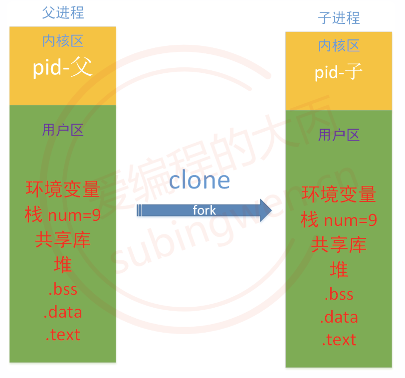

**相同点**

拷贝完成之后，两个地址空间中的用户区数据是相同的，包括

- 代码区：默认情况下父子进程地址空间中的源代码始终相同
- 全局数据区：父进程中的全局变量和变量值全部被拷贝一份放到了子进程地址空间
- 堆区：父进程中的堆区变量和变量值全部被拷贝一份放到了子进程地址空间中
- 动态库加载区（内存映射区）：父进程中数据信息被拷贝一份放到了子进程地址空间中
- 栈区：父进程中的栈区变量和变量值全部被拷贝一份放到了子进程地址空间中
- 环境变量：默认情况下，父子进程地址空间中的环境变量始终相同
- 文件描述符表: 父进程中被分配的文件描述符都会拷贝到子进程中，在子进程中可以使用它们打开对应的文件

**不同点**

- 父子进程各自的虚拟地址空间是相互独立的，不会互相干扰和影响
- 父子进程地址空间中代码区代码虽然相同，但是父子进程执行的代码逻辑可能是不同的
- 由于父子进程可能执行不同的代码逻辑，因此地址空间拷贝完成之后，全局数据区, 栈区, 堆区, 动态库加载区(内存映射区)数据会各自发生变化
- 内核区存储的父子进程ID是不同的
- 进程启动之后进入就绪态，运行需要争抢CPU时间片而且可能执行不同的业务逻辑，所以父子进程的状态可能是不同的
- fork() 调用成功之后，从一个虚拟地址空间变成了两个虚拟地址空间，会有两种返回值，父子进程的返回值是不同的，在程序中需要通过 fork() 的返回值来判断当前进程是子进程还是父进程
  - 父进程将该返回值标记为一个大于0的数（其实记录的是子进程的进程ID）
  - 子进程将该返回值标记 0

**举例**

```c
int main()
{
    // 在父进程中创建子进程
    pid_t pid = fork();
    printf("当前进程fork()的返回值: %d\n", pid);
    if(pid > 0)
    {
        // 父进程执行的逻辑
        printf("我是父进程, pid = %d\n", getpid());
    }
    else if(pid == 0)
    {
        // 子进程执行的逻辑
        printf("我是子进程, pid = %d, 我爹是: %d\n", getpid(), getppid());
    }
    else // pid == -1
    {
        // 创建子进程失败了
    }
    
    // 不加判断, 父子进程都会执行这个循环
    for(int i=0; i<5; ++i)
    {
        printf("%d\n", i);
    }
    
    return 0;
}
```

## 父子进程

### 进程执行位置

在父进程中成功创建了子进程，子进程就拥有父进程代码区的所有代码。父进程是从main()函数开始运行的，子进程是在父进程中调用 `fork()` 函数之后被创建, 子进程就从 `fork()` 之后开始向下执行代码。

在编写多进程程序的时候，一定要将代码想象成多份进行分析，因为直观上看代码就一份，但实际上数据是多份，并且多份数据中变量名都相同，但是他们的值却不一定相同。

### 循环创建子进程

> 在一个父进程中循环创建3个子进程

```c
#include <stdio.h>
#include <stdlib.h>
#include <unistd.h>
#include <string.h>

int main()
{
    for(int i=0; i<3; ++i)
    {
        pid_t pid = fork();
        printf("当前进程pid: %d\n", getpid());
    }

    return 0;
}
```

```shell
# 编译
$ gcc process_loop.c

# 执行❌
$ ./a.out
# 最终得到了 8个进程
当前进程pid: 18774     ------ 1
当前进程pid: 18774     ------ 1
当前进程pid: 18774     ------ 1
当前进程pid: 18777     ------ 2
当前进程pid: 18776     ------ 3
当前进程pid: 18776     ------ 3
当前进程pid: 18775     ------ 4
当前进程pid: 18775     ------ 4
当前进程pid: 18775     ------ 4
当前进程pid: 18778     ------ 5
当前进程pid: 18780     ------ 6
当前进程pid: 18779     ------ 7
当前进程pid: 18779     ------ 7
当前进程pid: 18781     ------ 8
```

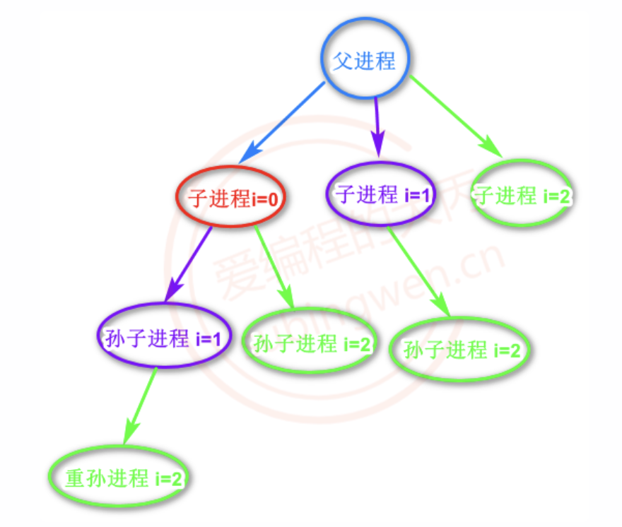

> 修改之后的代码

```c
#include <stdio.h>
#include <stdlib.h>
#include <unistd.h>
#include <string.h>

int main()
{
    pid_t pid;
    // 在循环中创建子进程
    for(int i=0; i<3; ++i)
    {
        pid = fork();
        if(pid == 0)
        {
            // 不让子进程执行循环, 直接跳出
            break;
        }
    }
    printf("当前进程pid: %d\n", getpid());

    return 0;
}
```

```shell
# 编译
$ gcc process_loop.c

# 执行✅
$ ./a.out
当前进程pid: 2727
当前进程pid: 2730
当前进程pid: 2729
当前进程pid: 2728
```

### 终端显示问题

在执行多进程程序的时候，经常会遇到下图中的问题，看似进程还没有执行完成，实际上终端是正常的，当通过键盘输入一些命令，终端也能接受输入并且输出相关信息。

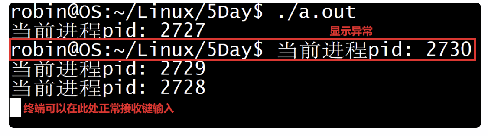

- a.out 进程启动之后，共创建了3个子进程，其实 a.out 也是有父进程的就是当前的终端
- 终端只能检测到 a.out 进程的状态，a.out执行期间终端切换到后台，a.out执行完毕之后终端切换回前台
- 当终端切换到前之后，a.out的子进程还没有执行完毕，当子进程输出的信息就显示到终端命令提示符的后边了，导致终端显示有问题，但是此时终端是可以接收键盘输入的，只是看起来不美观而已

想要解决这个问题，需要让所有子进程退出之后再退出父进程，比如在父进程代码中调用 sleep()

```c
pid_t pid = fork();
if(pid > 0)
{
    sleep(3);	// 让父进程睡一会儿
}
else if(pid == 0)
{
    // 子进程
}
```

### 进程数数

> 测试父子进程之间是否可以通过全局变量互动

```c
// number.c
#include <stdio.h>
#include <stdlib.h>
#include <unistd.h>
#include <string.h>

// 定义全局变量
int number = 10;

int main()
{
    printf("创建子进程之前 number = %d\n", number);

    pid_t pid = fork();
    // 父子进程都会执行这一行
    printf("当前进程fork()的返回值: %d\n", pid);

    //如果是父进程
    if(pid > 0)
    {
        printf("我是父进程, pid = %d, number = %d\n", getpid(), ++number);
        printf("父进程的父进程(终端进程), pid = %d\n", getppid());
        sleep(1);
    }
    else if(pid == 0)
    {
        // 子进程
        number += 100;
        printf("我是子进程, pid = %d, number = %d\n", getpid(), number);
        printf("子进程的父进程, pid = %d\n", getppid());
    }

    return 0;
}
```

```shell
$ gcc number.c
$ ./a.out 
创建子进程之前 number = 10
当前进程fork()的返回值: 3513
当前进程fork()的返回值: 0
我是子进程, pid = 3513, number = 110
子进程的父进程, pid = 3512

我是父进程, pid = 3512, number = 11	# 没有接着子进程的110继续数,父子进程各玩各的,测试失败了
父进程的父进程(终端进程), pid = 2175
```

通过验证得到结论：两个进程中是不能通过全局变量实现数据交互的，因为每个进程都有自己的地址空间，两个同名全局变量存储在不同的虚拟地址空间中，二者没有任何关联性。如果要进行进程间通信需要使用：管道，共享内存，本地套接字，内存映射区，消息队列等方式。

## execl/execlp

需要通过现在运行的进程启动磁盘上的另一个可执行程序，这种情况下可以使用 `exec` 族函数。这些函数执行成功后不会返回，原有的用户区数据基本全部被新的进程替换掉了。只有调用失败了，才会返回一个 -1，从原程序的调用点接着往下执行。

```c
#include <unistd.h>

extern char **environ;
int execl(const char *path, const char *arg, ...
          /* (char  *) NULL */);
int execlp(const char *file, const char *arg, ...
           /* (char  *) NULL */);
int execle(const char *path, const char *arg, ...
           /*, (char *) NULL, char * const envp[] */);
int execv(const char *path, char *const argv[]);
int execvp(const char *file, char *const argv[]);
int execvpe(const char *file, char *const argv[],
            char *const envp[]);
```

### execl

可用于执行任意一个可执行程序，需要通过指定的文件路径才能找到这个可执行程序。

```c
#include <unistd.h>

// 变参函数
/*
* 参数:
- path: 要启动的可执行程序的路径, 推荐使用绝对路径
- arg: 启动的进程的名字, 可以随意指定, 一般和要启动的可执行程序名相同
- ... : 要执行的命令需要的参数，可以写多个，最后以 NULL 结尾，表示参数指定完

* 返回值:
- 成功: 无返回值
- 失败: -1
*/

int execl(const char *path, const char *arg, ...);
```

### execlp

常用于执行已经设置了环境变量的可执行程序，函数中的 p 就是 path，也是说这个函数会自动搜索系统的环境变量PATH，因此使用这个函数执行可执行程序不需要指定路径，只需要指定出名字即可。

 ```c
 #include <unistd.h>
 
 /*
 * 参数:
 - file: 可执行程序的名字
 	- 在环境变量PATH中，可执行程序可以不加路径
 	- 没有在环境变量PATH中, 可执行程序需要指定绝对路径
 - arg: 启动的进程的名字, 可以随意指定, 一般和要启动的可执行程序名相同
 - ... : 要执行的命令需要的参数，可以写多个，最后以 NULL 结尾，表示参数指定完
 
 * 返回值:
 - 成功: 无返回值
 - 失败: -1
 */
 
 int execlp(const char *file, const char *arg, ...);
 ```

### 举例

关于 `exec` 族函数，一般不会在进程中直接调用，如果直接调用这个进程的代码区代码被替换也就不能按照原来的流程工作了。一般在调用这些函数的时候都会先创建一个子进程，在子进程中调用 `exec` 族函数，子进程的用户区数据被替换掉开始执行新的程序中的代码逻辑，但是父进程不受任何影响仍然可以继续正常工作。

```c
#include <stdio.h>
#include <stdlib.h>
#include <unistd.h>
#include <string.h>


int main()
{
    // 创建子进程
    pid_t pid = fork();
    // 在子进程中执行磁盘上的可执行程序
    if(pid == 0)
    {
        // 磁盘上的可执行程序 /bin/ps
#if 1
        execl("/bin/ps", "title", "aux", NULL);
        // 也可以这么写
        // execl("/bin/ps", "title", "a", "u", "x", NULL);  
#else
        // execlp("ps", "title", "aux", NULL);
        // 也可以这么写
        // execl("ps", "title", "a", "u", "x", NULL);
#endif
        // 如果成功当前子进程的代码区别 ps中的代码区代码替换
        // 下面的所有代码都不会执行
        // 如果函数调用失败了,才会继续执行下面的代码
        perror("execl");
        printf("++++++++++++++++++++++++\n");
        printf("++++++++++++++++++++++++\n");
        printf("++++++++++++++++++++++++\n");
        printf("++++++++++++++++++++++++\n");
        printf("++++++++++++++++++++++++\n");
        printf("++++++++++++++++++++++++\n");
    }
    else if(pid > 0)
    {
        printf("我是父进程.....\n");
    }

    return 0;
}
```


## 结束进程

如果想要直接退出某个进程可以在程序的任何位置调用exit()或者_exit()函数。函数的参数相当于退出码, 如果参数值为 0 程序退出之后的状态码就是0, 如果是100退出的状态码就是100。

```c
// 专门退出进程的函数, 在任何位置调用都可以
// 标准C库函数
#include <stdlib.h>
void exit(int status);

// Linux的系统函数
// 可以这么理解, 在linux中 exit() 函数 封装了 _exit()
#include <unistd.h>
void _exit(int status);
```

## 孤儿进程

父子进程同时运行，但是父进程由于某种原因先退出了，子进程还在运行，这时候这个子进程就可以被称之为孤儿进程。

操作系统当检测到某一个进程变成了孤儿进程，这时候系统中就会有一个固定的进程领养这个孤儿进程。如果使用Linux没有桌面终端，这个领养孤儿进程的进程就是 init 进程（PID=1），如果有桌面终端，这个领养孤儿进程就是桌面进程。

在子进程退出的时候, 进程中的用户区可以自己释放, 但是进程内核区的PCB资源自己无法释放，必须要由父进程来释放子进程的PCB资源，孤儿进程被领养之后，这件事干爹就可以代劳了，这样可以避免系统资源的浪费。

下面这段代码就可以得到一个孤儿进程。

```c
int main()
{
    // 创建子进程
    pid_t pid = fork();

    // 父进程
    if(pid > 0)
    {
        printf("我是父进程, pid=%d\n", getpid());
    }
    else if(pid == 0)
    {
        sleep(1);	// 强迫子进程睡眠1s, 这个期间, 父进程退出, 当前进程变成了孤儿进程
        // 子进程
        printf("我是子进程, pid=%d, 父进程ID: %d\n", getpid(), getppid());
    }
    return 0;
}
```

```shell
$ ./a.out 
我是父进程, pid=22459
我是子进程, pid=22460, 父进程ID: 1		# 父进程向退出, 子进程变成孤儿进程, 子进程被1号进程回收
```

## 僵尸进程

父进程正常运行, 子进程先与父进程结束, 子进程无法释放自己的PCB资源, 需要父进程来做这个件事儿, 但是如果父进程也不管, 这时候子进程就变成了僵尸进程。

僵尸进程不能将它看成是一个正常的进程，这个进程已经死亡了，用户区资源已经被释放了，只是还占用着一些内核资源（PCB），僵尸进程的出现是由于这个已死亡的进程的父进程不作为造成的。

下面的代码就可以得到一个僵尸进程。

```c
int main()
{
    pid_t pid;
    // 创建子进程
    for(int i=0; i<5; ++i)
    {
        pid = fork();
        if(pid == 0)
        {
            break;
        }
    }

    // 父进程
    if(pid > 0)
    {
        // 需要保证父进程一直在运行
        // 一直运行不退出, 并且也做回收, 就会出现僵尸进程
        while(1)
        {
            printf("我是父进程, pid=%d\n", getpid());
            sleep(1);
        }
    }
    else if(pid == 0)
    {
        // 子进程, 执行这句代码之后, 子进程退出了
        printf("我是子进程, pid=%d, 父进程ID: %d\n", getpid(), getppid());
    }
    return 0;
}
```

```shell
# ps aux 查看进程信息
# Z+ --> 这个进程是僵尸进程, defunct, 表示进程已经死亡
robin     22598  0.0  0.0   4352   624 pts/2    S+   10:11   0:00 ./app
robin     22599  0.0  0.0      0     0 pts/2    Z+   10:11   0:00 [app] <defunct> # 子进程
robin     22600  0.0  0.0      0     0 pts/2    Z+   10:11   0:00 [app] <defunct> # 子进程
robin     22601  0.0  0.0      0     0 pts/2    Z+   10:11   0:00 [app] <defunct> # 子进程
robin     22602  0.0  0.0      0     0 pts/2    Z+   10:11   0:00 [app] <defunct> # 子进程
robin     22603  0.0  0.0      0     0 pts/2    Z+   10:11   0:00 [app] <defunct> # 子进程
```

注

1. 消灭僵尸进程的一种方法是，杀死这个僵尸进程的父进程，这样僵尸进程（转为孤儿进程）的资源就被系统回收了。通过kill -9 僵尸进程PID的方式是不能消灭僵尸进程的，这个命令只对活着的进程有效

## 进程回收

为了避免僵尸进程的产生，一般会在父进程中进行子进程的资源回收，回收方式有两种，一种是阻塞方式wait()，一种是非阻塞方式waitpid()。

### wait

这是个阻塞函数，如果没有子进程退出，函数会一直阻塞等待，当检测到子进程退出了, 该函数阻塞解除回收子进程资源。这个函数被调用一次，只能回收一个子进程的资源，如果有多个子进程需要资源回收，函数需要被调用多次。

```c
#include <sys/wait.h>

/*
* 参数:
- status: 传出参数，通过传递出的信息判断回收的进程是怎么退出的，如果不需要该信息可以指定为 NULL，取出整形变量中的数据需要使用一些宏函数
	- WIFEXITED(status): 返回1, 进程是正常退出的
	- WEXITSTATUS(status)：得到进程退出时候的状态码，相当于 return 后边的数值, 或者 exit()函数的参数
	- WIFSIGNALED(status): 返回1, 进程是被信号杀死了
	- WTERMSIG(status): 获得进程是被哪个信号杀死的，会得到信号的编号

* 返回值:
- >0: 返回被回收的子进程的进程ID
- -1: 
	- 没有子进程，函数的阻塞会自动解除, 返回-1
	- 回收子进程资源的时候出现了异常
*/

pid_t wait(int *status);
```

> 通过 wait() 回收子进程资源

```c
// wait 函数回收子进程资源
#include <sys/wait.h>

int main()
{
    pid_t pid;
    // 创建子进程
    for(int i=0; i<5; ++i)
    {
        pid = fork();
        if(pid == 0)
        {
            break;
        }
    }

    // 父进程
    if(pid > 0)
    {
        // 需要保证父进程一直在运行
        while(1)
        {
            // 回收子进程的资源
            // 子进程由多个, 需要循环回收子进程资源
            pid_t ret = wait(NULL);
            if(ret > 0)
            {
                printf("成功回收了子进程资源, 子进程PID: %d\n", ret);
            }
            else
            {
                printf("回收失败, 或者是已经没有子进程了...\n");
                break;
            }
            printf("我是父进程, pid=%d\n", getpid());
        }
    }
    else if(pid == 0)
    {
        // 子进程, 执行这句代码之后, 子进程退出了
        printf("我是子进程, pid=%d, 父进程ID: %d\n", getpid(), getppid());
    }
    return 0;
}
```

### waitpid

waitpid() 函数可以看做是 wait() 函数的升级版，通过该函数可以控制回收子进程资源的方式是阻塞还是非阻塞，另外还可以通过该函数精确指定回收某个或者某一类或者是全部子进程资源。

```c
#include <sys/wait.h>

/*
* 参数:
-pid:
	-1：回收所有的子进程资源, 和 wait()是一样的，并不是一次性就可以回收多个, 也是需要循环回收
	- 大于0：指定回收某一个进程的资源 ，pid是要回收的子进程的进程ID
	- 0：回收当前进程组的所有子进程ID
	- 小于 -1：pid 的绝对值代表进程组ID，表示要回收这个进程组的所有子进程资源
- status: 和wait的参数是一样的
- options: 控制函数是阻塞还是非阻塞
	- 0: 函数是行为是阻塞的，和wait一样
	- WNOHANG: 函数是行为是非阻塞的

* 返回值:
- 0: 函数是非阻塞的, 并且子进程还在运行
- >0: 返回被回收的子进程的进程ID
- -1: 
	- 没有子进程，函数的阻塞会自动解除, 返回-1
	- 回收子进程资源的时候出现了异常
*/

pid_t waitpid(pid_t pid, int *status, int options);
```

> 通过 waitpid() 阻塞式回收当前子进程资源

```c
#include <sys/wait.h>

int main()
{
    pid_t pid;
    // 创建子进程
    for(int i=0; i<5; ++i)
    {
        pid = fork();
        if(pid == 0)
        {
            break;
        }
    }

    // 父进程
    if(pid > 0)
    {
        // 需要保证父进程一直在运行
        while(1)
        {
            // 回收子进程的资源
            // 子进程由多个, 需要循环回收子进程资源
            int status;
            pid_t ret = waitpid(-1, &status, 0);  // == wait(NULL);
            if(ret > 0)
            {
                printf("成功回收了子进程资源, 子进程PID: %d\n", ret);
                                // 判断进程是不是正常退出
                if(WIFEXITED(status))
                {
                    printf("子进程退出时候的状态码: %d\n", WEXITSTATUS(status));
                }
                if(WIFSIGNALED(status))
                {
                    printf("子进程是被这个信号杀死的: %d\n", WTERMSIG(status));
                }
            }
            else
            {
                printf("回收失败, 或者是已经没有子进程了...\n");
                break;
            }
            printf("我是父进程, pid=%d\n", getpid());
        }
    }
    else if(pid == 0)
    {
        // 子进程, 执行这句代码之后, 子进程退出了
        printf("===我是子进程, pid=%d, 父进程ID: %d\n", getpid(), getppid());
    }
    return 0;
}
```

> 通过 waitpid() 非阻塞式回收当前子进程资源

```shell
#include <sys/wait.h>

int main()
{
    pid_t pid;
    // 创建子进程
    for(int i=0; i<5; ++i)
    {
        pid = fork();
        if(pid == 0)
        {
            break;
        }
    }

    // 父进程
    if(pid > 0)
    {
        // 需要保证父进程一直在运行
        while(1)
        {
            // 回收子进程的资源
            // 子进程由多个, 需要循环回收子进程资源
            // 子进程退出了就回收, 
            // 没退出就不回收, 返回0
            int status;
            pid_t ret = waitpid(-1, &status, WNOHANG);  // 非阻塞
            if(ret > 0)
            {
                printf("成功回收了子进程资源, 子进程PID: %d\n", ret);
                // 判断进程是不是正常退出
                if(WIFEXITED(status))
                {
                    printf("子进程退出时候的状态码: %d\n", WEXITSTATUS(status));
                }
                if(WIFSIGNALED(status))
                {
                    printf("子进程是被这个信号杀死的: %d\n", WTERMSIG(status));
                }
            }
            else if(ret == 0)
            {
                printf("子进程还没有退出, 不做任何处理...\n");
            }
            else
            {
                printf("回收失败, 或者是已经没有子进程了...\n");
                break;
            }
            printf("我是父进程, pid=%d\n", getpid());
        }
    }
    else if(pid == 0)
    {
        // 子进程, 执行这句代码之后, 子进程退出了
        printf("===我是子进程, pid=%d, 父进程ID: %d\n", getpid(), getppid());
    }
    return 0;
}
```

## 进程组

### 介绍

多个进程的集合就是进程组，这个组中必须有一个组长，组长就是进程组中的第一个进程，组长以外的都是普通的成员，每个进程组都有一个唯一的组ID，进程组的ID和组长的PID是一样的。

进程组中的成员是可以转移的，如果当前进程组中的成员被转移到了其他的组，或者进制中的所有进程都退出了，那么这个进程组也就不存在了。如果进程组中组长死了，但是当前进程组中有其他进程，那么这个进程组还是继续存在的，同时改变组ID。通常用于把具有某种关系的进程组织在一起，以便统一管理，例如发送信号或进行作业控制。

- PID（Process ID）：进程自身的唯一标识
- PGID（Process Group ID）：进程所属进程组的 ID

一个进程组中的所有进程 PGID 相同，PGID 等于组长进程的 PID。

### 系统函数

**getpgrp**

```c
getpgrp();				// 获取当前进程组 PGID
getpgid(pid_t pid);		// 获取指定的进程所在的进程组 PGID
```

**setpgid**

```c
/*
* 参数:
- pid: 某个进程的进程ID
- pgid: 某个进程组的组ID
	- 如果pgid对应的进程组存在: pid对应的进程会移动到这个组中, pgid不变
	- 如果pgid对应的进程组不存在: 会创建一个新的进程组, 并且 pgid = pid, 当前进程就是组长了

* 返回值:
- 成功: 0
- 失败: -1
*/

// 把进程加入某个进程组或创建新的进程组
int setpgid(pid_t pid, pid_t pgid);		
```

## 会话

### 介绍

会话（Session）是一个或多个进程组的集合，通常对应一次用户登录或一个终端控制环境。

创建会话的进程称为会话组长，且SID=PID，可以控制终端。一个会话中可以有前台进程组（可以读取终端输入）和后台进程组（无法读取终端输入）。

### 系统函数

**getsid**

```c
// 获取某个进程所属的会话ID
pid_t getsid(pid_t pid);
```

**setsid**

```c
// 创建新的会话，当前进程成为会话首进程，脱离当前控制终端，同时创建新的进程组
pid_t setsid(void);
```

注

1. 当前进程如果是组长进程，则函数调用失败
2. 一般先fork()创建子进程，终止父进程，让子进程调用这个函数

## 守护进程

守护进程（Daemon Process）是 Linux 中的后台服务进程，它是一个生存期较长的进程，通常独立于控制终端并且周期性地执行某种任务或等待处理某些发生的事件。

**标准流程**

1. 创建子进程, 让父进程退出
	- 因为父进程有可能是组长进程，不符合条件，也没有什么利用价值，退出即可
	- 子进程没有任何职务, 目的是让子进程最终变成一个会话, 最终就会得到守护进程
2. 通过子进程创建新的会话，调用函数 setsid()，脱离控制终端, 变成守护进程
3. 改变当前进程的工作目录 (可选项)
	- 某些文件系统可以被卸载, 比如U盘，进程如果在这些目录中运行，运行期间这些设备被卸载了，运行的进程也就不能正常工作了
	- 修改当前进程的工作目录需要调用函数 chdir()

```c
int chdir(const char *path);
```

4. 重新设置文件的掩码 (可选项)
	- 设置掩码需要使用函数 umask()

```c
mode_t umask(mode_t mask);
```

5. 关闭/重定向文件描述符 (可选)
	- 因为进程通过调用 setsid() 已经脱离了当前终端, 因此关联的文件描述符也就没用了, 可以关闭

```c
close(STDIN_FILENO);
close(STDOUT_FILENO);
close(STDERR_FILENO);
```

6. 重定向文件描述符(可选)
	- 改变文件描述符关联的默认文件, 让他们指向一个特殊的文件/dev/null，只要把数据扔到这个特殊的设备文件中, 数据被被销毁了

```c
int fd = open("/dev/null", O_RDWR);

dup2(fd, STDIN_FILENO);
dup2(fd, STDOUT_FILENO);
dup2(fd, STDERR_FILENO);
```

7. 根据实际需求在守护进程中执行某些特定的操作

**应用**

> 创建守护进程，每2s获取一次系统时间

```c
#include <stdio.h>
#include <stdlib.h>
#include <unistd.h>
#include <string.h>
#include <sys/stat.h>
#include <fcntl.h>
#include <signal.h>
#include <sys/time.h>
#include <time.h>

// 信号的处理动作
void writeFile(int num)
{
    // 得到系统时间
    time_t seconds = time(NULL);
    // 时间转换, 总秒数 -> 可以识别的时间字符串
    struct tm* loc = localtime(&seconds);
    // sprintf();
    char* curtime = asctime(loc); // 自带换行
    int fd = open("./time+++++++.log", O_WRONLY|O_CREAT|O_APPEND, 0664);
    write(fd, curtime, strlen(curtime));
    close(fd);
}

int main()
{
    // 1. 创建子进程, 杀死父进程
    pid_t pid = fork();
    if(pid > 0)
    {
        // 父进程
        exit(0); // kill(getpid(), 9); raise(9); abort();
    }

    // 2. 子进程, 将其变成会话, 脱离当前终端
    setsid();

    // 3. 修改进程的工作目录, 修改到一个不能被修改和删除的目录中 /home/robin
    chdir("/home/robin");

    // 4. 设置掩码, 在进程中创建文件的时候这个掩码就起作用了
    umask(022);

    // 5. 重定向和终端关联的文件描述符 -> /dev/null
    int fd = open("/dev/null", O_RDWR);
    dup2(fd, STDIN_FILENO);
    dup2(fd, STDOUT_FILENO);
    dup2(fd, STDERR_FILENO);

    // 5. 委托内核捕捉并处理将来发生的信号-SIGALRM(14)
    struct sigaction act;
    act.sa_flags = 0;
    act.sa_handler = &writeFile;
    sigemptyset(&act.sa_mask);
    sigaction(SIGALRM, &act, NULL);

    // 6. 设置定时器
    struct itimerval val;
    val.it_value.tv_sec = 2;
    val.it_value.tv_usec = 0;
    val.it_interval.tv_sec = 2;
    val.it_interval.tv_usec = 0;
    setitimer(ITIMER_REAL, &val, NULL);

    while(1)
    {
        sleep(100);
    }

    return 0;
}
```

## IPC

|           IPC(InterProcess Communication)方式           |                     主要特点                     |    是否需要同步    |                常见同步方式                 |
| :--------------------------: | :----------------------------------------------: | :----------------: | :-----------------------------------------: |
|       匿名管道 (Pipe)      | 只能用于有亲缘关系的进程（如父子进程），单向通信 |        需要        | 内核自动保证读写顺序；通过阻塞读写实现同步  |
|     命名管道 (FIFO)      |             可以用于无亲缘关系的进程             |        需要        |      读写阻塞机制；进程间约定读写顺序       |
| 消息队列 (Message Queue) |          以消息为单位通信，支持消息类型          | 一般不需要额外同步 | 内核管理队列顺序，发送/接收操作本身是同步点 |
|     内存映射 (mmap)      |              文件或匿名映射共享内存              |        需要        |            信号量、mutex、futex             |
| 共享内存 (Shared Memory) |       速度最快，多个进程直接访问同一块内存       |    需要    |           信号量、互斥锁、读写锁            |
|      信号 (Signal)       |            异步通知机制，如 SIGINT             |   不用于数据同步   |               仅用于事件通知                |
|    信号量 (Semaphore)    |                 本身就是同步机制                 |      用于同步      |           P/V 操作（wait/signal）           |
|     Socket (套接字)      |              支持本地或网络进程通信              |        需要        |  阻塞 I/O、select/poll/epoll 或应用层协议   |

注

1. 管道本质是内核维护的字节流缓冲区，管道写数据≤ `PIPE_BUF`(4k一般)，写入是原子的，超过 `PIPE_BUF`时，可能发生数据交叉；读出数据不会破坏，只是读取顺序不可控
2. 消息队列入队、出队是原子的，数据不会混乱，只是顺序不确定

# 管道

## 介绍

管道的是进程间通信（IPC）的一种方式，管道的本质就是内核中的一块内存(或叫内核缓冲区)，这块缓冲区中的数据存储在一个环形队列中，因为管道在内核里边，因此不能直接对其进行任何操作。

**特点**

- 管道对应的内核缓冲区大小是固定的，默认为4k（也就是队列最大能存储4k数据）
- 管道分为两部分：读端和写端（队列的两端），数据从写端进入管道，从读端流出管道
- 管道中的数据只能读一次，做一次读操作之后数据也就没有了（读数据相当于出队列）
- 管道是单工的：数据只能单向流动, 数据从写端流向读端
- 对管道的操作（读、写）默认是阻塞的
  - 读管道：管道中没有数据，读操作被阻塞，当管道中有数据之后阻塞才能解除
  - 写管道：管道被写满了，写数据的操作被阻塞，当管道变为不满的状态，写阻塞解除

管道在内核中, 不能直接对其进行操作，内核中管道的两端分别对应两个文件描述符，通过写端的文件描述符把数据写入到管道中，通过读端的文件描述符将数据从管道中读出来。读写管道的函数就是Linux中的文件IO函数。

```c
// 读管道
ssize_t read(int fd, void *buf, size_t count);
// 写管道的函数
ssize_t write(int fd, const void *buf, size_t count);
```

管道是独立于任何进程的，并且充当了两个进程用于数据通信的载体，只要两个进程能够得到同一个管道的入口和出口（读端和写端的文件描述符），那么他们之间就可以通过管道进行数据的交互。

## 匿名管道

**创建匿名管道**

匿名管道是管道的一种，既然是匿名也就是说这个管道没有名字，但其本质是不变的，就是位于内核中的一块内存，匿名管道拥有上面介绍的管道的所有特性，但是匿名管道只能实现有血缘关系的进程间通信，如：父子进程、兄弟进程、爷孙进程、叔侄进程。

```c
#include <unistd.h>

/*
* 参数:
- 传出参数，需要传递一个整形数组的地址，数组大小为 2，也就是说最终会传出两个元素
	- pipefd[0]: 对应管道读端的文件描述符，通过它可以将数据从管道中读出
	- pipefd[1]: 对应管道写端的文件描述符，通过它可以将数据写入到管道中

* 返回值:
- 成功: 0
- 失败: -1
*/

// 创建一个匿名的管道, 得到两个可用的文件描述符
int pipe(int pipefd[2]);
```

**进程间通信**

使用匿名管道只能够实现有血缘关系的进程间通信。

> 进程通信举例

```c
// 管道的数据是单向流动的
// 操作管道的是两个进程, 进程A读管道, 需要关闭管道的写端, 进程B写管道, 需要关闭管道的读端
// 如果不做上述的操作, 会对程序的结果造成一些影响, 对管道的操作无法结束
#include <fcntl.h>
#include <unistd.h>
#include <sys/wait.h>

int main()
{
    // 1. 创建匿名管道, 得到两个文件描述符
    int fd[2];
    int ret = pipe(fd);
    if(ret == -1)
    {
        perror("pipe");
        exit(0);
    }
    // 2. 创建子进程 -> 能够操作管道的文件描述符被复制到子进程中
    pid_t pid = fork();
    if(pid == 0)
    {
        // 关闭读端
        close(fd[0]);
        // 3. 在子进程中执行 execlp("ps", "ps", "aux", NULL);
        // 在子进程中完成输出的重定向, 原来输出到终端现在要写管道
        // 进程打印数据默认输出到终端, 终端对应的文件描述符: stdout_fileno
        // 标准输出 重定向到 管道的写端
        dup2(fd[1], STDOUT_FILENO);
        execlp("ps", "ps", "aux", NULL);
        perror("execlp");
    }

    // 4. 父进程读管道
    else if(pid > 0)
    {
        // 关闭管道的写端
        close(fd[1]);
        // 5. 父进程打印读到的数据信息
        char buf[4096];
        // 读管道
        // 如果管道中没有数据, read会阻塞
        // 有数据之后, read解除阻塞, 直接读数据
        // 需要循环读数据, 管道是有容量的, 写满之后就不写了
        // 数据被读走之后, 继续写管道, 那么就需要再继续读数据
        while(1)
        {
            memset(buf, 0, sizeof(buf));
            int len = read(fd[0], buf, sizeof(buf));
            if(len == 0)
            {
                // 管道的写端关闭了, 如果管道中没有数据, 管道读端不会阻塞
                // 没数据直接返回0, 如果有数据, 将数据读出, 数据读完之后返回0
                break;
            }
            printf("%s, len = %d\n", buf, len);
        }
        close(fd[0]);

        // 回收子进程资源
        wait(NULL);
    }
    return 0;
}
```

注

1. 在使用管道进行进程间通信，必须要保证数据在管道中的单向流动
2. 为了避免两个进程都读管道，但是可能其中某个进程由于读不到数据而阻塞的情况，可以关闭进程中用不到的那一端的文件描述符，这样数据就只能单向的从一端流向另外一端了


## 命名管道

**创建命名管道**

命名管道(FIFO)拥有管道的所有特性，其在磁盘上有实体文件, 文件类型为p ，文件大小永远为0，因为命名管道也是将数据存储到内存的缓冲区中，打开这个磁盘上的管道文件就可以得到操作命名管道的文件描述符，通过文件描述符读写管道存储在内核中的数据。

使用命名管道既可以进行有血缘关系的进程间通信，也可以进行没有血缘关系的进程间通信。创建有名管道的方式有两种，一种是通过命令，一种是通过函数。

- 通过命令

```shell
$ mkfifo <有名管道的名字>
```

- 通过函数

```c
#include <sys/types.h>
#include <sys/stat.h>

/*
* 参数:
- pathname: 要创建的有名管道的名字
- mode: 文件的操作权限,同open()的第三个参数一个作用，(mode & ~umask)

* 返回值:
- 成功: 0
- 失败: -1
*/

// int open(const char *pathname, int flags, mode_t mode);
int mkfifo(const char *pathname, mode_t mode);
```

**进程间通信**

不管是有血缘关系还是没有血缘关系，使用有名管道实现进程间通信的方式是相同的，就是在两个进程中分别以读、写的方式打开磁盘上的管道文件，得到用于读管道、写管道的文件描述符，就可以调用对应的read()、write()函数进行读写操作了。

> 写端

```c
#include <fcntl.h>
#include <sys/stat.h>
#include <unistd.h>
int main()
{
    // 1. 创建有名管道文件
    int ret = mkfifo("./testfifo", 0664);
    if(ret == -1)
    {
        perror("mkfifo");
        exit(0);
    }
    printf("管道文件创建成功...\n");

    // 2. 打开管道文件
    // 因为要写管道, 所有打开方式, 应该指定为 O_WRONLY
    // 如果先打开写端, 读端还没有打开, open函数会阻塞, 当读端也打开之后, open解除阻塞
    int wfd = open("./testfifo", O_WRONLY);
    if(wfd == -1)
    {
        perror("open");
        exit(0);
    }
    printf("以只写的方式打开文件成功...\n");

    // 3. 循环写管道
    int i = 0;
    while(i<100)
    {
        char buf[1024];
        sprintf(buf, "hello, fifo, 我在写管道...%d\n", i);
        write(wfd, buf, strlen(buf));
        i++;
        sleep(1);
    }
    close(wfd);

    return 0;
}
```

> 读端

```c
#include <fcntl.h>
#include <sys/stat.h>
#include <unistd.h>

int main()
{
    // 1. 打开管道文件
    // 因为要read管道, so打开方式, 应该指定为 O_RDONLY
    // 如果只打开了读端, 写端还没有打开, open阻塞, 当写端被打开, 阻塞就解除了
    int rfd = open("./testfifo", O_RDONLY);
    if(rfd == -1)
    {
        perror("open");
        exit(0);
    }
    printf("以只读的方式打开文件成功...\n");

    // 2. 循环读管道
    while(1)
    {
        char buf[1024];
        memset(buf, 0, sizeof(buf));
        // 读是阻塞的, 如果管道中没有数据, read自动阻塞
        // 有数据解除阻塞, 继续读数据
        int len = read(rfd, buf, sizeof(buf));
        printf("读出的数据: %s\n", buf);
        if(len == 0)
        {
            // 写端关闭了, read解除阻塞返回0
            printf("管道的写端已经关闭, 拜拜...\n");
            break;
        }

    }
    close(rfd);

    return 0;
}
```

注

1. 有名管道操作通过 open() 操作得到读写管道的文件描述符，如果只是读端打开了或者只是写端打开了，进程会阻塞在这里不会向下执行，直到在另一个进程中将管道的对端打开，当前进程的阻塞也就解除了


## 管道的读写行为

管道不管是命名的还是匿名的，在进行读写的时候，它们表现出的行为是一致的

- 读管道
  - 写端没有关闭 (操作管道写端的文件描述符没有被关闭)
    - 如果管道中没有数据 ==> 读阻塞, 如果管道中被写入了数据, 阻塞解除
    - 如果管道中有数据 ==> 不阻塞，管道中的数据被读完了, 再继续读管道还会阻塞
  - 写端已经关闭了 (没有可用的文件描述符可以写管道了)
    - 管道中没有数据 ==> 读端解除阻塞, read函数返回0
    - 管道中有数据 ==> read先将数据读出, 数据读完之后返回0, 不会阻塞了
- 写管道
  - 读端没有关闭
    - 如果管道有存储的空间, 一直写数据
    - 如果管道写满了, 写操作就阻塞, 当读端将管道数据读走了, 解除阻塞继续写
  - 读端关闭了，管道破裂(异常), 进程直接退出

管道的两端默认是阻塞的，管道的读写两端的非阻塞操作是相同的，下面的代码中将匿名的读端设置为了非阻塞。

```c
// 通过fcntl 修改就可以, 一般情况下不建议修改
// 管道操作对应两个文件描述符, 分别是管道的读端 和 写端

// 1. 获取读端的文件描述符的flag属性
int flag = fcntl(fd[0], F_GETFL);
// 2. 添加非阻塞属性到 flag中
flag |= O_NONBLOCK;
// 3. 将新的flag属性设置给读端的文件描述符
fcntl(fd[0], F_SETFL, flag);
// 4. 非阻塞读管道
char buf[4096];
read(fd[0], buf, sizeof(buf));
```

# 消息队列

## 介绍

多个进程可以通过消息队列发送和接收消息，从而实现数据交换。消息队列是内核维护的一个队列（FIFO），每个消息都包含一个消息类型（type）和消息数据（data），不同进程可以通过消息类型来读取不同的消息。

**特点**

- 消息是有类型的
- 内核负责管理消息顺序
3. 读操作会将数据从队列中读出

## 创建/打开消息队列

**msgget**

用于创建或打开消息队列。

```c
#include <sys/types.h>
#include <sys/ipc.h>
#include <sys/msg.h>

/*
* 参数:
- key: 通过这个key创建或打开一个消息队列
- msgflg: 消息队列的属性
	- IPC_CREAT: 如果不存在则创建
	- IPC_EXCL: 与 IPC_CREAT 一起使用，检测是否已存在

* 返回值:
- 成功: 返回消息队列ID
- 失败: -1
*/

int msgget(key_t key, int msgflg);
```

## 发送和接收消息

### msgsnd

发送消息到消息队列。

```c
#include <sys/types.h>
#include <sys/ipc.h>
#include <sys/msg.h>

/*
* 参数:
- msqid: 消息队列ID
- msgp: 要发送的消息结构体，必须以 long 类型开头
- msgsz: 消息数据大小，不包含mtype
- msgflg: 操作方式
	- 0: 默认阻塞
	- IPC_NOWAIT: 非阻塞发送

* 返回值:
- 成功: 0
- 失败: -1
*/

int msgsnd(int msqid, const void *msgp, size_t msgsz, int msgflg);
```

消息结构体示例

```c
struct msgbuf
{
    long mtype;     // 消息类型
    char mtext[128];// 消息内容
};
```

### msgrcv

从消息队列接收消息。

```c
/*
* 参数:
- msqid: 消息队列ID
- msgp: 接收消息的结构体
- msgsz: 消息大小
- msgtyp: 指定接收的消息类型
- msgflg: 操作方式
	- 0: 默认阻塞
	- IPC_NOWAIT: 非阻塞接收

* 返回值:
- 成功: 返回接收的字节数
- 失败: -1
*/

ssize_t msgrcv(int msqid, void *msgp, size_t msgsz, long msgtyp, int msgflg);
```

## 删除消息队列

**msgctl**

用于获取、设置或删除消息队列。

```c
/*
* 参数:
- msqid: 消息队列ID
- cmd: 操作
	- IPC_STAT: 获取消息队列状态
	- IPC_SET: 设置消息队列属性
	- IPC_RMID: 删除消息队列
- buf: 结构体信息
*/

int msgctl(int msqid, int cmd, struct msqid_ds *buf);
```

## 进程间通信

> 发送消息的进程

```c
#include <stdio.h>
#include <sys/msg.h>
#include <string.h>

struct msgbuf
{
    long mtype;
    char mtext[128];
};

int main()
{
    int msgid = msgget(1000, IPC_CREAT | 0664);

    struct msgbuf msg;
    msg.mtype = 1;

    strcpy(msg.mtext, "hello message queue");

    msgsnd(msgid, &msg, sizeof(msg.mtext), 0);

    return 0;
}
```

> 接收消息的进程

```c
#include <stdio.h>
#include <sys/msg.h>

struct msgbuf
{
    long mtype;
    char mtext[128];
};

int main()
{
    int msgid = msgget(1000, 0);

    struct msgbuf msg;

    msgrcv(msgid, &msg, sizeof(msg.mtext), 1, 0);

    printf("接收到消息: %s\n", msg.mtext);

    return 0;
}
```

# 内存映射

## 介绍

如果想要实现进程间通信，也可以创建一块内存映射区，和管道不同的是：管道对应的内存空间在内核中，而内存映射区对应的内存空间在进程的用户区，也就是说进程间通信使用的内存映射区不是一块，而是在每个进程内部都有一块。

由于每个进程的地址空间是独立的，各个进程之间也不能直接访问对方的内存映射区，需要通信的进程需要将各自的内存映射区和同一个磁盘文件进行映射，这样进程之间就可以通过磁盘文件这个唯一的桥梁完成数据的交互了。

使用内存映射区既可以进程有血缘关系的进程间通信也可以进程没有血缘关系的进程间通信。

## 创建释放内存映射区

**创建内存映射区**

```c
#include <sys/mman.h>

/*
* 参数:
- addr: 从动态库加载区的什么位置开始创建内存映射区，一般指定为NULL, 委托内核分配
- length: 创建的内存映射区的大小（字节），实际上这个大小是按照4k的整数倍去分配的，必须要 > 0
- prot: 对内存映射区的操作权限
	- PROT_READ: 读内存映射区
	- PROT_WRITE: 写内存映射区
	- 如果要对映射区有读写权限: PROT_READ | PROT_WRITE
- flags:
	- MAP_SHARED: 多个进程可以共享数据，进行映射区数据同步
	- MAP_PRIVATE: 映射区数据是私有的，不能同步给其他进程
	- MAP_ANONYMOUS: 匿名映射（不关联文件）,fd须为-1，创建一块不对应任何文件的内存
- fd: 文件描述符, 对应一个打开的磁盘文件，内存映射区通过这个文件描述符和磁盘文件建立关联，内存映射区创建成功之后, 关闭这个文件描述符不会影响进程间通信
- offset: 磁盘文件的偏移量，偏移量必须是页大小的整数倍, 写0代表不偏移

* 返回值:
- 成功: 返回一个内存映射区的起始地址
- 失败: MAP_FAILED
*/

// 把文件或匿名内存映射到进程地址空间，使程序可以像访问内存一样访问文件或共享内存
void *mmap(void *addr, size_t length, int prot, int flags, int fd, off_t offset);
```

**释放内存映射区**

```c
/*
* 参数:
- addr: mmap()的返回值, 创建的内存映射区的起始地址
- length: 和mmap()第二个参数相同即可

* 返回值:
- 成功: 0
- 失败: -1
*/

int munmap(void *addr, size_t length);
```

## 进程间通信

操作内存映射区和操作管道是不一样的，得到内存映射区之后是直接对内存地址进行操作，管道是通过文件描述符读写队列中的数据，管道的读写是阻塞的，内存映射区的读写是非阻塞的。

**有血缘关系**

由于创建子进程会发生虚拟地址空间的复制，那么在父进程中创建的内存映射区也会被复制到子进程中，这样在子进程里边就可以直接使用这块内存映射区了。

>有血缘关系的进程通信

```c
#include <sys/mman.h>
#include <fcntl.h>

int main()
{
    // 1. 打开一个磁盘文件
    int fd = open("./english.txt", O_RDWR);
    // 2. 创建内存映射区
    void* ptr = mmap(NULL, 4096, PROT_READ|PROT_WRITE,
                     MAP_SHARED, fd, 0);
    if(ptr == MAP_FAILED)
    {
        perror("mmap");
        exit(0);
    }

    // 3. 创建子进程
    pid_t pid = fork();
    if(pid > 0)
    {
        // 父进程, 写数据
        const char* pt = "我是你爹, 你是我儿子吗???";
        memcpy(ptr, pt, strlen(pt)+1);
    }
    else if(pid == 0)
    {
        // 子进程, 读数据
        usleep(1);	// 内存映射区不阻塞, 为了让子进程读出数据
        printf("从映射区读出的数据: %s\n", (char*)ptr);
    }

    // 释放内存映射区
    munmap(ptr, 4000);

    return 0;
}
```

**没有血缘关系**

对于没有血缘关系的进程间通信，需要在每个进程中分别创建内存映射区，同时这些进程的内存映射区必须要关联相同的磁盘文件，才能实现进程间通信。

> 进程A

```c
#include <stdio.h>
#include <stdlib.h>
#include <unistd.h>
#include <string.h>
#include <sys/mman.h>
#include <fcntl.h>

int main()
{
    // 1. 打开一个磁盘文件
    int fd = open("./english.txt", O_RDWR);
    // 2. 创建内存映射区
    void* ptr = mmap(NULL, 4096, PROT_READ|PROT_WRITE,
                     MAP_SHARED, fd, 0);
    if(ptr == MAP_FAILED)
    {
        perror("mmap");
        exit(0);
    }
    
    const char* pt = "==================我是你爹, 你是我儿子吗???****************";
    memcpy(ptr, pt, strlen(pt)+1);

    // 释放内存映射区
    munmap(ptr, 4096);

    return 0;
}
```

> 进程B

```c
#include <stdio.h>
#include <stdlib.h>
#include <unistd.h>
#include <string.h>
#include <sys/mman.h>
#include <fcntl.h>

int main()
{
    // 1. 打开一个磁盘文件
    int fd = open("./english.txt", O_RDWR);
    // 2. 创建内存映射区
    void* ptr = mmap(NULL, 4096, PROT_READ|PROT_WRITE,
                     MAP_SHARED, fd, 0);
    if(ptr == MAP_FAILED)
    {
        perror("mmap");
        exit(0);
    }

    // 读内存映射区
    printf("从映射区读出的数据: %s\n", (char*)ptr);

    // 释放内存映射区
    munmap(ptr, 4096);

    return 0;
}
```

## 拷贝文件

使用内存映射区除了可以实现进程间通信，也可以进行文件的拷贝。

> 文件拷贝

```c
#include <stdio.h>
#include <stdlib.h>
#include <unistd.h>
#include <string.h>
#include <fcntl.h>
#include <sys/mman.h>

int main()
{
    // 1. 打开一个操盘文件english.txt得到文件描述符
    int fd = open("./english.txt", O_RDWR);
    // 计算文件大小
    int size = lseek(fd, 0, SEEK_END);

    // 2. 创建内存映射区和english.txt进行关联, 得到映射区起始地址
    void* ptrA = mmap(NULL, size, PROT_READ|PROT_WRITE, MAP_SHARED, fd, 0);
    if(ptrA == MAP_FAILED)
    {
        perror("mmap");
        exit(0);
    }

    // 3. 创建一个新文件, 存储拷贝的数据
    int fd1 = open("./copy.txt", O_RDWR|O_CREAT, 0664);
    // 拓展这个新文件
    ftruncate(fd1, size);

    // 4. 创建一个映射区和新文件进行关联, 得到映射区的起始地址second
    void* ptrB = mmap(NULL, size, PROT_READ|PROT_WRITE, MAP_SHARED, fd1, 0);
    if(ptrB == MAP_FAILED)
    {
        perror("mmap----");
        exit(0);
    }
    // 5. 使用memcpy拷贝映射区数据
    // 这两个指针指向两块内存, 都是内存映射区
    // 指针指向有效的内存, 拷贝的是内存中的数据
    memcpy(ptrB, ptrA, size);

    // 6. 释放内存映射区
    munmap(ptrA, size);
    munmap(ptrB, size);
    close(fd);
    close(fd1);

    return 0;
}
```

# 共享内存

## 介绍

共享内存不同于内存映射区，它不属于任何进程，并且不受进程生命周期的影响。使用共享之前需要让进程和共享内存进行关联，得到共享内存的起始地址之后就可以直接进行读写操作了，进程也可以和这块共享内存解除关联, 解除关联之后就不能操作这块共享内存了。

在所有进程间通信的方式中共享内存的效率是最高的。共享内存操作默认不阻塞，如果多个进程同时读写共享内存，可能出现数据混乱，需要借助其他机制来保证进程间的数据同步，如信号量。

## 创建/打开共享内存

**shmget**

创建或打开一个共享内存。

```c
#include <sys/ipc.h>
#include <sys/shm.h>

/*
* 参数:
- key: 类型 key_t 是个整形数, 通过这个key可以创建或者打开一块共享内存，该参数的值一定要大于0
- size: 创建共享内存的时候, 指定共享内存的大小，如果是打开一块存在的共享内存, size是没有意义的
- shmflg：创建共享内存的时候指定的属性
	- IPC_CREAT: 创建新的共享内存，需要指定对共享内存的操作权限，比如IPC_CREAT | 0664
	- IPC_EXCL: 检测共享内存是否存在，必须和 IPC_CREAT一起使用

* 返回值:
- 成功: 共享内存创建或者打开成功返回标识共享内存的唯一的ID
- 失败: -1，若使用IPC_EXCL，则表示共享内存已创建
*/

int shmget(key_t key, size_t size, int shmflg);
```

> 举例

```c
// 场景1：创建一块大小为4k的共享内存
shmget(100, 4096, IPC_CREAT|0664);

// 场景2：创建一块大小为4k的共享内存, 并且检测是否存在
// 如果共享内存已经存在, 共享内存创建失败, 返回-1, 可以perror() 打印错误信息
shmget(100, 4096, IPC_CREAT|0664|IPC_EXCL);

// 场景3：打开一块已经存在的共享内存
// 函数参数虽然指定了大小和IPC_CREAT, 但是都不起作用, 因为共享内存已经存在, 只能打开, 参数4096也没有意义
shmget(100, 4096, IPC_CREAT|0664);
shmget(100, 0, 0);

// 场景4：打开一块共享内存, 如果不存在就创建
shmget(100, 4096, IPC_CREAT|0664);
```

**ftok**

shmget() 函数的第一个参数是一个大于0的正整数，如果不想自己指定可以通过 ftok()函数直接生成这个key值。

```c
#include <sys/types.h>
#include <sys/ipc.h>

/*
* 参数:
- pathname: 当前操作系统中一个存在的文件路径，如.
- proj_id: 这个参数只用到了int中的一个字节, 传参的时候要将其作为 char 进行操作，取值范围: 1-255

* 返回值:
- 成功: 返回一个可用于创建、打开共享内存的key值
- 失败: -1
*/

// 将两个参数作为种子, 生成一个 key_t 类型的数值
key_t ftok(const char *pathname, int proj_id);
```

> 举例

```c
// 根据路径生成一个key_t
key_t key = ftok("/home/robin", 'a');
// 创建或打开共享内存
shmget(key, 4096, IPC_CREATE|0664);
```

## 关联和解除关联

**shmat**

创建/打开共享内存之后还必须和共享内存进行关联，这样才能得到共享内存的起始地址，通过得到的内存地址进行数据的读写操作。

```c
/*
* 参数:
- shmid: 要操作的共享内存的ID, 是 shmget() 函数的返回值
- shmaddr: 共享内存的起始地址, 用户不知道, 需要让内核指定, 写NULL
- shmflg: 和共享内存关联的对共享内存的操作权限
	- SHM_RDONLY: 读权限, 只能读共享内存中的数据
	- SHM_RND: 地址向下取整到页边界
	- 0: 默认读写权限

* 返回值:
- 成功: 返回值共享内存的起始地址
- 失败: (void *) -1
*/

void *shmat(int shmid, const void *shmaddr, int shmflg);
```

**shmdt**

当进程不需要再操作共享内存，可以让进程和共享内存解除关联，如果没有执行该操作，进程退出之后，结束的进程和共享内存的关联也就自动解除了。

```c
/*
* 参数:
- shmid: 要操作的共享内存的ID, 是 shmget() 函数的返回值

* 返回值:
- 成功: 0
- 失败: -1
*/

int shmdt(const void *shmaddr);
```

## 删除共享内存

**shmctl**

shmctl() 函数是一个多功能函数，可以设置、获取共享内存的状态也可以将共享内存标记为删除状态。当共享内存被标记为删除状态之后，并不会马上被删除，直到所有的进程全部和共享内存解除关联，共享内存才会被删除。因为通过shmctl()函数只是能够标记删除共享内存，所以在程序中多次调用该操作是没有关系的。

```c
/*
* 参数:
- shmid: 要操作的共享内存的ID, 是 shmget() 函数的返回值
- cmd: 要做的操作
	- IPC_STAT: 得到当前共享内存的状态
	- IPC_SET: 设置共享内存的状态
	- IPC_RMID: 标记共享内存要被删除了
- buf:
	- cmd==IPC_STAT, 作为传出参数, 会得到共享内存的相关属性信息
	- cmd==IPC_SET, 作为传入参, 将用户的自定义属性设置到共享内存中
	- cmd==IPC_RMID, buf就没意义了, 这时候buf指定为NULL即可

* 返回值:
- 成功: 0>=
- 失败: -1
*/

int shmctl(int shmid, int cmd, struct shmid_ds *buf);
```

参数 struct shmid_ds 结构体原型。 

```c
struct shmid_ds {
	struct ipc_perm shm_perm;    /* Ownership and permissions */
	size_t          shm_segsz;   /* Size of segment (bytes) */
	time_t          shm_atime;   /* Last attach time */
	time_t          shm_dtime;   /* Last detach time */
	time_t          shm_ctime;   /* Last change time */
	pid_t           shm_cpid;    /* PID of creator */
	pid_t           shm_lpid;    /* PID of last shmat(2)/shmdt(2) */
    // 引用计数, 多少个进程和共享内存进行了关联
	shmatt_t        shm_nattch;  /* 记录了有多少个进程和当前共享内存进行了管联 */
	...
};
```

通过shmctl()得知，共享内存的信息是存储到一个叫做struct shmid_ds的结构体中，其中有一个非常重要的成员叫 shm_nattch，在这个成员变量里边记录着当前共享内存关联的进程的个数，将其称之为引用计数。当共享内存被标记为删除状态，并且这个引用计数变为0之后共享内存才会被真正的被删除掉。

当共享内存被标记为删除状态之后，共享内存的状态也会发生变化，共享内存内部维护的key从一个正整数变为0，其属性从公共的变为私有的。这里的私有是指只有已经关联成功的进程才允许继续访问共享内存，不再允许新的进程和这块共享内存进行关联了。

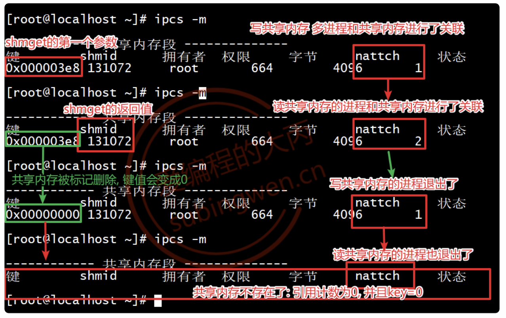

**相关命令**

ipcs

```shell
ipcs [option]	# 查看 IPC 资源，
-m				# 查看共享内存
-s				# 查看信号量
-q				# 查看消息队列
-i				# 查看详细信息
```

ipcrm

```shell
ipcrm [option]	# 删除 IPC 资源
-m				# 删除共享内存
-s				# 删除信号量
-q				# 删除消息队列
```

## 进程间通信

> 写共享内存的进程

```c
#include <stdio.h>
#include <sys/shm.h>
#include <string.h>

int main()
{
    // 1. 创建共享内存, 大小为4k
    int shmid = shmget(1000, 4096, IPC_CREAT|0664);
    if(shmid == -1)
    {
        perror("shmget error");
        return -1;
    }

    // 2. 当前进程和共享内存关联
    void* ptr = shmat(shmid, NULL, 0);
    if(ptr == (void *) -1)
    {
        perror("shmat error");
        return -1;
    }

    // 3. 写共享内存
    const char* p = "hello, world, 共享内存真香...";
    memcpy(ptr, p, strlen(p)+1);

    // 阻塞程序
    printf("按任意键继续, 删除共享内存\n");
    getchar();

    shmdt(ptr);

    // 删除共享内存
    shmctl(shmid, IPC_RMID, NULL);
    printf("共享内存已经被删除...\n");

    return 0;
}
```

> 读共享内存的进程

```c
#include <stdio.h>
#include <sys/shm.h>
#include <string.h>

int main()
{
    // 1. 打开共享内存, 大小为4k
    int shmid = shmget(1000, 0, 0);
    if(shmid == -1)
    {
        perror("shmget error");
        return -1;
    }

    // 2. 当前进程和共享内存关联
    void* ptr = shmat(shmid, NULL, 0);
    if(ptr == (void *) -1)
    {
        perror("shmat error");
        return -1;
    }

    // 3. 读共享内存
    printf("共享内存数据: %s\n", (char*)ptr);

    // 阻塞程序
    printf("按任意键继续, 删除共享内存\n");
    getchar();

    shmdt(ptr);

    // 删除共享内存
    shmctl(shmid, IPC_RMID, NULL);
    printf("共享内存已经被删除...\n");

    return 0;
}
```

## 内存映射和共享内存的区别

- 实现进程间通信的方式
  - 内存映射区: 位于每个进程的虚拟地址空间中, 并且需要关联同一个磁盘文件才能实现进程间数据通信
  - 共享内存: 多个进程只需要一块共享内存就够了，共享内存不属于进程，需要和进程关联才能使用
- 效率
  - 内存映射区: 需要内存和文件之间的数据同步，效率低
  - 共享内存: 直接对内存操作，效率高

- 生命周期
  - 内存映射区：进程退出, 内存映射区也就没有了
  - 共享内存：进程退出对共享内存没有影响，调用相关函数/命令/ 关机才能删除共享内存

- 数据的完整性 -> 突发状态下数据能不能被保存下来（比如: 突然断电）
  - 内存映射区：可以完整的保存数据, 内存映射区数据会同步到磁盘文件
  - 共享内存：数据存储在物理内存中, 断电之后系统关闭, 内存数据也就丢失了


# 信号

## 介绍

Linux中的信号是一种消息处理机制，它本质上是一个整数，不同的信号对应不同的值。

在Linux中的很多常规操作中都会有相关的信号

> - 通过键盘操作产生了信号：用户按下Ctrl-C，这个键盘输入产生一个硬件中断，使用这个快捷键会产生信号, 这个信号会杀死对应的某个进程
> - 通过shell命令产生了信号：通过kill命令终止某一个进程，kill -9 进程PID
> - 通过函数调用产生了信号：如果CPU当前正在执行这个进程的代码调用，比如函数 sleep()，进程收到相关的信号，被迫挂起
> - 通过对硬件进行非法访问产生了信号：正在运行的程序访问了非法内存，发生段错误，进程退出

信号也可以实现进程间通信，但是信号能传递的数据量很少，不能满足大部分需求，另外信号的优先级很高，并且它对应的处理动作是回调完成的，它会打乱程序原有的处理流程，影响到最终的处理结果，因此不建议使用信号进行进程间通信。

**信号编号**

通过 kill -l 命令可以察看系统定义的信号列表

```shell
$ kill -l
 1) SIGHUP       2) SIGINT       3) SIGQUIT      4) SIGILL       5) SIGTRAP
 6) SIGABRT      7) SIGBUS       8) SIGFPE       9) SIGKILL     10) SIGUSR1
11) SIGSEGV     12) SIGUSR2     13) SIGPIPE     14) SIGALRM     15) SIGTERM
16) SIGSTKFLT   17) SIGCHLD     18) SIGCONT     19) SIGSTOP     20) SIGTSTP
21) SIGTTIN     22) SIGTTOU     23) SIGURG      24) SIGXCPU     25) SIGXFSZ
26) SIGVTALRM   27) SIGPROF     28) SIGWINCH    29) SIGIO       30) SIGPWR
31) SIGSYS      34) SIGRTMIN    35) SIGRTMIN+1  36) SIGRTMIN+2  37) SIGRTMIN+3
38) SIGRTMIN+4  39) SIGRTMIN+5  40) SIGRTMIN+6  41) SIGRTMIN+7  42) SIGRTMIN+8
43) SIGRTMIN+9  44) SIGRTMIN+10 45) SIGRTMIN+11 46) SIGRTMIN+12 47) SIGRTMIN+13
48) SIGRTMIN+14 49) SIGRTMIN+15 50) SIGRTMAX-14 51) SIGRTMAX-13 52) SIGRTMAX-12
53) SIGRTMAX-11 54) SIGRTMAX-10 55) SIGRTMAX-9  56) SIGRTMAX-8  57) SIGRTMAX-7
58) SIGRTMAX-6  59) SIGRTMAX-5  60) SIGRTMAX-4  61) SIGRTMAX-3  62) SIGRTMAX-2
63) SIGRTMAX-1  64) SIGRTMAX
```

| 编号  |        信号         |                        对应事件                        |         默认动作         |
| :---: | :-----------------: | :----------------------------------------------------: | :----------------------: |
|   1   |       SIGHUP        | 用户退出shell时，由该shell启动的所有进程将收到这个信号 |         终止进程         |
|   2   |       SIGINT        |   当用户按下 `<Ctrl+C>` 时，终端向运行程序发送该信号   |         终止进程         |
|   3   |       SIGQUIT       |               用户按下 `<Ctrl+\>` 时产生               | 终止进程并产生 core 文件 |
|   4   |       SIGILL        |               CPU检测到进程执行非法指令                | 终止进程并产生 core 文件 |
|   5   |       SIGTRAP       |                断点指令或 trap 指令产生                | 终止进程并产生 core 文件 |
|   6   |       SIGABRT       |                调用 `abort()` 函数产生                 | 终止进程并产生 core 文件 |
|   7   |       SIGBUS        |             非法访问内存地址或内存对齐错误             | 终止进程并产生 core 文件 |
|   8   |       SIGFPE        |                 算术错误，如除0或溢出                  | 终止进程并产生 core 文件 |
|   9   |       SIGKILL       |          强制终止进程，不能被捕获、阻塞或忽略          |         终止进程         |
|  10   |       SIGUSR1       |                     用户自定义信号                     |         终止进程         |
|  11   |       SIGSEGV       |                 无效内存访问（段错误）                 | 终止进程并产生 core 文件 |
|  12   |       SIGUSR2       |                     用户自定义信号                     |         终止进程         |
|  13   |       SIGPIPE       |                 向没有读端的管道写数据                 |         终止进程         |
|  14   |       SIGALRM       |             定时器超时，由 `alarm()` 设置              |         终止进程         |
|  15   |       SIGTERM       |           终止进程信号，默认 `kill` 命令发送           |         终止进程         |
|  16   |      SIGSTKFLT      |              早期 Linux 信号（兼容保留）               |         终止进程         |
|  17   |       SIGCHLD       |                子进程结束时发送给父进程                |           忽略           |
|  18   |       SIGCONT       |               如果进程已停止，则继续运行               |        继续/忽略         |
|  19   |       SIGSTOP       |             停止进程执行，不能被捕获或忽略             |         停止进程         |
|  20   |       SIGTSTP       |              终端停止信号，按 `<Ctrl+Z>`               |         暂停进程         |
|  21   |       SIGTTIN       |                  后台进程读取终端输入                  |         暂停进程         |
|  22   |       SIGTTOU       |                 后台进程向终端输出数据                 |         暂停进程         |
|  23   |       SIGURG        |                  套接字有紧急数据到达                  |           忽略           |
|  24   |       SIGXCPU       |                    进程CPU时间超限                     |         终止进程         |
|  25   |       SIGXFSZ       |                    文件大小超过限制                    |         终止进程         |
|  26   |      SIGVTALRM      |          虚拟定时器超时（只计算用户CPU时间）           |         终止进程         |
|  27   |       SIGPROF       |         Profiling 定时器超时（CPU + 系统时间）         |         终止进程         |
|  28   |      SIGWINCH       |                    终端窗口大小改变                    |           忽略           |
|  29   |        SIGIO        |                     异步IO事件发生                     |           忽略           |
|  30   |       SIGPWR        |                     电源故障或关机                     |         终止进程         |
|  31   |       SIGSYS        |                      无效系统调用                      | 终止进程并产生 core 文件 |
| 34~64 | SIGRTMIN ~ SIGRTMAX |              Linux实时信号，可自定义用途               |         终止进程         |

对产生的信号有五种默认处理动作，分别是

> - Term：信号将进程终止
> - Ign：信号产生之后默认被忽略了
> - Core：信号将进程终止, 并且生成一个core文件(一般用于gdb调试)
> - Stop：信号会暂停进程的运行
> - Cont：信号会让暂停的进程继续运行

注

1. 9号信号和19号信号不能被捕捉、阻塞和忽略

**信号的状态**

Linux中的信号有三种状态，分别为：产生、未决、递达。

- 产生：键盘输入、函数调用、执行shell命令, 对硬件进行非法访问都会产生信号
- 未决：信号产生了, 但是这个信号还没有被处理掉, 这个期间信号的状态称之为未决状态
- 递达：信号被处理了(被某个进程处理掉)

**信号分类**

- 标准信号（1-31）使用位图记录，因此相同信号只能存在一次
- 实时信号（34-64）使用队列存储，因此可以排队并按顺序处理，同时可以携带数据

## 产生信号

###  kill/raise/abort

**kill**

发送指定的信号到指定的进程。

```c
#include <sys/types.h>
#include <signal.h>

/*
* 参数:
- pid
	- pid > 0	向指定进程发送信号
	- pid = 0	向当前进程组发送信号
	- pid = -1	向所有有权限的进程发送信号
	- pid < -1	向指定进程组发送信号
- sig: 要发送的信号

* 返回值:
- 成功: 0
- 失败: -1
*/

int kill(pid_t pid, int sig);
```

**raise**

给当前进程发送指定的信号。

```c
#include <signal.h>

/*
* 参数:
- sig: 要发送的信号

* 返回值:
- 成功: 0
- 失败: 非0
*/

int raise(int sig);
```

**abort**

给当前进程发送一个固定信号 (SIGABRT)，默认行为终止进程并生成 core 文件。

```c
#include <stdlib.h>

void abort(void);
```

### 定时器

**alarm**

只能进行单次定时，定时完成发射出一个信号。

```c
#include <unistd.h>

/*
* 参数:
- seconds: 倒计时seconds秒, 倒计时完成发送一个信号 SIGALRM , 当前进程会收到这个信号，默认的处理动作是中断当前进程

* 返回值:
- >0: 还剩多少秒
- 0: 倒计时完成，信号被发出
*/

unsigned int alarm(unsigned int seconds);
```

> 检测当前计算机1s内能数多少个数

```c
#include <stdio.h>
#include <stdlib.h>
#include <unistd.h>
#include <string.h>

int main()
{
    // 1. 设置一个定时器, 定时1s
    alarm(1);	// 1s之后会发出一个信号, 这个信号将中断当前进程
    int i = 0;
    while(1)
    {
        printf("%d\n", i++);
    }
    return 0;
}
```

```shell
# 直接通过终端输出
$ time ./a.out
real    0m1.013s		# 实际数数用的总时间
user    0m0.060s		# 用户区代码使用的时间
sys     0m0.324s		# 内核区使用的时间

# real = user + sys + 消耗的时间(频繁地从用户区和内核区进程切换)
```

注

1. 文件 I/O 操作通常需要进行用户区 ↔ 内核区的来回切换

**setitimer**

可以进行周期性定时，每触发一次定时器就会发射出一个信号。

```c
#include <sys/time.h>

/*
* 参数:
- which: 定时器使用什么样的计时法则, 不同的计时法则发出的信号不同
	- ITIMER_REAL: 自然计时法，发出的信号为SIGALRM，自然计时法时间 = real time
	- ITIMER_VIRTUAL: 只计算程序在用户区运行使用的时间，发射的信号为 SIGVTALRM
	- ITIMER_PROF: 只计算内核运行使用的时间, 发出的信号为SIGPROF
- new_value: 给定时器设置的定时信息, 传入参数
- old_value: 上一次给定时器设置的定时信息, 传出参数，如果不需要这个信息, 指定为NULL

* 返回值:
- 成功: 0
- 失败: -1
*/

int setitimer(int which, const struct itimerval *new_value, 
              struct itimerval *old_value);
```

itimerval结构体。

```c
struct itimerval {
	struct timeval it_interval; /* 周期间隔 */
	struct timeval it_value;    /* 第一次触发定时器的时长 */
};

// 总时间时间 = tv_sec + tv_usec
struct timeval {
	time_t      tv_sec;         /* 秒 */
	suseconds_t tv_usec;        /* 微妙 */
};
```

## 信号集

### 阻塞/未决信号集

在PCB中有两个非常重要的信号集。一个称之为阻塞信号集，另一个称之为未决信号集。这两个信号集体现在内核中就是两张表。但是操作系统不允许直接对这两个信号集进行任何操作，而是需要自定义另外一个集合，借助信号集操作函数来对PCB中的这两个信号集进行修改。

- 信号的未决是一种状态，指的是从信号的产生到信号被处理前的这一段时间
- 信号的阻塞是一个开关动作，指的是阻止信号被处理，但不是阻止信号产生

一般情况下信号的阻塞只是暂时的，只是为了防止信号打断某些敏感的操作。

阻塞信号集和未决信号集都使用 `sigset_t` 位图结构表示，每一位对应一个信号，通过标位的值来标记当前信号在信号集中的状态。

- 在阻塞信号集中
  - 默认情况下没有信号是被阻塞的, 因此信号对应的标志位的值为 0
  - 如果某个信号被设置为了阻塞状态, 这个信号对应的标志位 被设置为 1
- 在未决信号集中
  - 如果这个信号被阻塞了, 不能处理, 这个信号对应的标志位被设置为1
  - 如果这个信号的阻塞被解除了, 未决信号集中的这个信号马上就被处理了, 这个信号对应的标志位值变为0
  - 如果这个信号没有阻塞, 信号产生之后直接被处理, 因此不会在未决信号集中做任何记录

### 信号集函数

因为用户是不能直接操作内核中的阻塞信号集和未决信号集的，必须要调用系统函数，关于阻塞信号集可以通过系统函数进行读写操作，未决信号集只能对其进行读操作。

**sigprocmask**

读/写阻塞信号集。

```c
#include <signal.h>

/*
* 参数:
- how:
	- SIG_BLOCK: 将参数 set 集合中的数据追加到阻塞信号集中
	- SIG_UNBLOCK: 将参数 set 集合中的信号在阻塞信号集中解除阻塞
	- SIG_SETMASK: 使用参 set 集合中的数据覆盖内核的阻塞信号集数据
- oldset: 通过这个参数将设置之前的阻塞信号集数据传出，如果不需要可以指定为NULL

* 返回值:
- 成功: 0
- 失败: -1
*/

int sigprocmask(int how, const sigset_t *set, sigset_t *oldset);
```

对sigset_t这种类型的数据进行初始化需要调用一些相关的操作函数。

```c
#include <signal.h>

// 将set集合中所有的标志位设置为0
int sigemptyset(sigset_t *set);
// 将set集合中所有的标志位设置为1
int sigfillset(sigset_t *set);
// 将set集合中某一个信号(signum)对应的标志位设置为1
int sigaddset(sigset_t *set, int signum);
// 将set集合中某一个信号(signum)对应的标志位设置为0
int sigdelset(sigset_t *set, int signum);
// 判断某个信号在集合中对应的标志位到底是0还是1, 如果是0返回0, 如果是1返回1
int sigismember(const sigset_t *set, int signum);
```

**sigpending**

未决信号集不需要程序猿修改, 如果设置了某个信号阻塞, 当这个信号产生之后, 内核会将这个信号的未决状态记录到未决信号集中，当阻塞的信号被解除阻塞, 未决信号集中的信号随之被处理, 内核再次修改未决信号集将该信号的状态修改为递达状态（标志位置0）。因此，写未决信号集的动作都是内核做的。

```c
#include <signal.h>

/*
* 参数:
- set: 传出参数，用于保存未决信号集

* 返回值:
- 成功: 0
- 失败: -1
*/

// 获取当前进程的未决信号集
int sigpending(sigset_t *set);
```

**举例**

> 读写阻塞信号集并查看未决信号集

```c
#include <stdio.h>
#include <stdlib.h>
#include <unistd.h>
#include <string.h>
#include <signal.h>

int main()
{
    // 1. 初始化信号集
    sigset_t myset;
    sigemptyset(&myset);
    // 设置阻塞的信号
    sigaddset(&myset, SIGINT);  // 2
    sigaddset(&myset, SIGQUIT); // 3
    sigaddset(&myset, SIGKILL); // 9 测试不能被阻塞

    // 2. 将初始化的信号集中的数据设置给内核
    sigset_t old;
    sigprocmask(SIG_BLOCK, &myset, &old);

    // 3. 让进程一直运行, 在当前进程中产生对应的信号
    int i = 0;
    while(1)
    {
        // 4. 读内核的未决信号集
        sigset_t curset;
        sigpending(&curset);
        // 遍历这个信号集
        for(int i=1; i<32; ++i)
        {
            int ret = sigismember(&curset, i);
            printf("%d", ret);
        }
        printf("\n");
        sleep(1);
        i++;
        if(i==10)
        {
            // 解除阻塞, 重新设置阻塞信号集
            //sigprocmask(SIG_UNBLOCK, &myset, NULL);
            sigprocmask(SIG_SETMASK, &old, NULL);
        }
    }
    return 0;
}
```

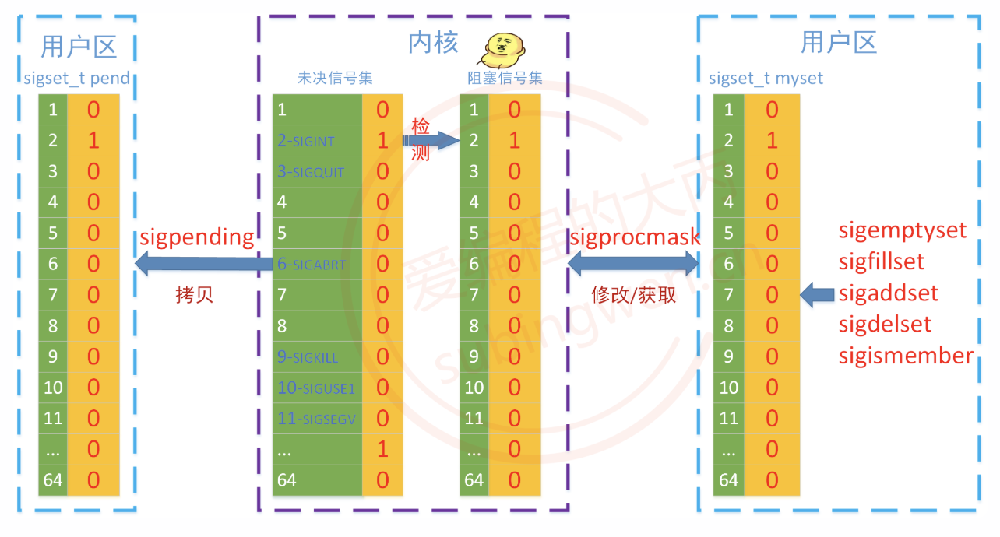

## 信号捕捉

Linux中的每个信号产生之后都会有对应的默认处理行为，如果想要忽略这个信号或者修改某些信号的默认行为就需要在程序中捕捉该信号。

### signal

使用 signal() 函数可以捕捉进程中产生的信号，并且修改捕捉到的函数的行为，这个信号的自定义处理动作是一个回调函数，内核通过 signal() 得到这个回调函数的地址，在信号产生之后该函数会被内核调用。

```c
#include <signal.h>

/*
* 参数:
- signum: 需要捕捉的信号
- handler: 信号捕捉到之后的处理动作, 这是一个函数指针

* 返回值:
- 成功: 0
- 失败: -1
*/

// 在信号产生之前, 提供一个注册函数, 用来捕捉信号
// 内核调用回调函数的时候, 会给它传递一个实参，这个实参的值就是捕捉的那个信号值
sighandler_t signal(int signum, void (*sighandler_t)(int));   
```

> 使用 signal() 函数来捕捉定时器产生的信号 SIGALRM

```c
#include <stdio.h>
#include <stdlib.h>
#include <unistd.h>
#include <string.h>
#include <sys/time.h>
#include <signal.h>

// 定时器信号的处理动作
void doing(int arg)
{
    printf("当前捕捉到的信号是: %d\n", arg);
    // 打印当前的时间
}

int main()
{
    // 注册要捕捉哪一个信号, 执行什么样的处理动作
    signal(SIGALRM, &doing);
    // 1. 调用定时器函数设置定时器函数
    struct itimerval newact;
    // 3s之后发出第一个定时器信号, 之后每隔1s发出一个定时器信号
    newact.it_value.tv_sec = 3;
    newact.it_value.tv_usec = 0;
    newact.it_interval.tv_sec = 1;
    newact.it_interval.tv_usec = 0;
    // 这个函数也不是阻塞函数, 函数调用成功, 倒计时开始
    // 倒计时过程中程序是继续运行的
    setitimer(ITIMER_REAL, &newact, NULL);
    // 编写一个业务处理, 阻止当前进程自己结束, 让当前进程被发出的信号杀死
    while(1)
    {
    }

    return 0;
}
```

### sigaction

igaction() 函数和 signal() 函数的功能是一样的，sigaction() 可以看做是 signal() 函数是加强版，函数参数更多更复杂，函数功能也更强一些。

```c
#include <signal.h>

/*
* 参数:
- signum: 要捕捉的信号
- act: 捕捉到信号之后的处理动作
- oldact: 上一次调用该函数进行信号捕捉设置的信号处理动作, 该参数一般指定为NULL

* 返回值:
- 成功: 0
- 失败: -1
*/

int sigaction(int signum, const struct sigaction *act, struct sigaction *oldact);
```

sigaction结构体。

```c
struct sigaction {
	void     (*sa_handler)(int);    // 函数指针，指向的函数就是捕捉到的信号的处理动作
	void     (*sa_sigaction)(int, siginfo_t *, void *);	// 函数指针，指向的函数就是捕捉到的信号的处理动作
	sigset_t   sa_mask;             // 在信号处理函数执行期间, 临时屏蔽某些信号，NULL表示屏蔽当前捕捉信号
	int        sa_flags;	        //0：使用 sa_handler (一般情况下使用这个)；SA_SIGINFO：使用 sa_sigaction (使用信号传递数据==进程间通信)
};
```

> 捕捉多个信号

```c
#include <stdio.h>
#include <stdlib.h>
#include <unistd.h>
#include <string.h>
#include <signal.h>

// 信号的处理动作
void callback(int num)
{
    printf("当前捕捉的信号: %d\n", num);
}

int main()
{
    // 1. 初始化信号集
    sigset_t myset;
    sigemptyset(&myset);
    // 设置阻塞的信号
    sigaddset(&myset, SIGINT);  // 2
    sigaddset(&myset, SIGQUIT); // 3
    sigaddset(&myset, SIGKILL); // 9 测试不能被阻塞

    // 当阻塞的信号被解除阻塞, 该信号就可以被捕捉到了
    // 如果信号被捕捉到之后, 马上就被处理掉了 --> 递达状态
    struct sigaction act;
    act.sa_handler = &callback;
    act.sa_flags = 0;
    sigemptyset(&act.sa_mask);
    sigaction(SIGINT, &act, NULL);
    // 和sigint的处理动作相同
    sigaction(SIGQUIT, &act, NULL);
    sigaction(SIGKILL, &act, NULL);

    // 2. 将初始化的信号集中的数据设置给内核
    sigset_t old;
    sigprocmask(SIG_BLOCK, &myset, &old);

    // 3. 让进程一直运行, 在当前进程中产生对应的信号
    int i = 0;
    while(1)
    {
        // 4. 读内核的未决信号集
        sigset_t curset;
        sigpending(&curset);
        // 遍历这个信号集
        for(int i=1; i<32; ++i)
        {
            int ret = sigismember(&curset, i);
            printf("%d", ret);
        }
        printf("\n");
        sleep(1);
        i++;
        if(i==10)
        {
            // 解除阻塞, 重新设置阻塞信号集
            //sigprocmask(SIG_UNBLOCK, &myset, NULL);
            sigprocmask(SIG_SETMASK, &old, NULL);
        }
    }
    return 0;
}
```

## SIGCHLD 信号

当子进程退出、暂停、从暂停回复运行的时候，在子进程中会产生一个SIGCHLD信号，并将其发送给父进程，但是父进程收到这个信号之后默认就忽略了。可以在父进程中对这个信号加以利用，基于这个信号来回收子进程的资源，因此需要在父进程中捕捉子进程发送过来的这个信号。

>  基于信号回收子进程资源

```c
#include <stdio.h>
#include <stdlib.h>
#include <unistd.h>
#include <string.h>
#include <sys/wait.h>
#include <signal.h>

// 回收子进程处理函数
void recycle(int num)
{
    printf("捕捉到的信号是: %d\n", num);
    while(1)
    {
        // 如果是阻塞回收, 就回不到另外一个处理逻辑上去了
        pid_t pid = waitpid(-1, NULL, WNOHANG);
        if(pid > 0)
        {
            printf("child died, pid = %d\n", pid);
        }
        else if(pid == 0)
        {
            // 没有死亡的子进程, 直接退出当前循环
            break;
        }
        else if(pid == -1)
        {
            printf("所有子进程都回收完毕了, 拜拜...\n");
            break;
        }
    }
}


int main()
{
    // 设置sigchld信号阻塞，防止产生僵尸进程
    sigset_t myset;
    sigemptyset(&myset);
    sigaddset(&myset, SIGCHLD);
    sigprocmask(SIG_BLOCK, &myset, NULL);

    // 循环创建多个子进程
    pid_t pid;
    for(int i=0; i<20; ++i)
    {
        pid = fork();
        if(pid == 0)
        {
            break;
        }
    }

    if(pid == 0)
    {
        printf("我是子进程, pid = %d\n", getpid());
    }
    else if(pid > 0)
    {
        printf("我是父进程, pid = %d\n", getpid());
        // 注册信号捕捉, 捕捉sigchld
        struct sigaction act;
        act.sa_flags  = 0;
        act.sa_handler = recycle;
        sigemptyset(&act.sa_mask);
        sigaction(SIGCHLD, &act, NULL);

        // 解除sigcld信号的阻塞
        sigprocmask(SIG_UNBLOCK, &myset, NULL);
        while(1)
        {
            sleep(100);
        }
    }
    return 0;
}
```

# 信号量

## 介绍

信号量用于控制多个进程对共享资源的访问。信号量本质是一个计数器，通过对计数器的操作来控制资源访问。

信号量主要解决多个进程同时访问共享资源时的数据同步问题。

信号量提供两个核心操作，如果信号量小于0，就会阻塞等待。

- P 操作（wait）  → 申请资源，信号量值-1
- V 操作（signal）→ 释放资源，信号量值+1

## 创建/打开信号量集合

**semget**

用于创建或获取信号量集合。

```c
#include <sys/types.h>
#include <sys/ipc.h>
#include <sys/sem.h>

/*
* 参数:
- key: IPC key
- nsems: 信号量个数
- semflg: 属性
	- IPC_CREAT
	- IPC_EXCL

* 返回值:
- 成功: 返回信号量ID
- 失败: -1
*/

int semget(key_t key, int nsems, int semflg);
```

## 设置信号量集合

**semctl**

```c
#include <sys/types.h>
#include <sys/ipc.h>
#include <sys/sem.h>

/*
* 参数:
- semid: 要操作的信号量集合ID，是 semget() 函数的返回值
- semnum: 指定操作的信号量编号（第几个信号量），从 0 开始
- cmd: 要执行的控制命令
    - GETVAL: 获取某个信号量的当前值
    - SETVAL: 设置某个信号量的值（常用于初始化信号量）
    - GETPID: 获取最后一次执行 semop() 的进程PID
    - GETNCNT: 获取等待该信号量增加的进程数
    - GETZCNT: 获取等待该信号量为0的进程数
    - IPC_STAT: 获取信号量集合状态信息
    - IPC_SET: 设置IPC权限等属性
    - IPC_RMID: 删除整个信号量集合
- ...: 根据 cmd 不同含义不同
    - cmd == SETVAL: 传入信号量初始值
    - cmd == IPC_STAT: 传出参数，获取信号量状态
    - cmd == IPC_SET: 传入参数，设置信号量属性
    - cmd == IPC_RMID:不使用，通常写 0

* 返回值:
- 成功:
    - GETVAL: 返回信号量当前值
    - 其他操作返回: 0
- 失败: -1
*/

int semctl(int semid, int semnum, int cmd, ...);
```

## 信号量操作

**semop**

用于执行P/V 操作。

```c
#include <sys/sem.h>

/*
* 参数:
- semid: 信号量ID
- sops: 操作结构体，用于描述要执行的信号量操作
- nsops: 要执行的操作数量（即 sops 数组元素个数）

* 返回值:
- 成功: 返回 0
- 失败: 返回 -1
*/

int semop(int semid, struct sembuf *sops, size_t nsops);
```

操作结构体

```c
struct sembuf
{
    unsigned short sem_num; // 创建信号量编号，从0开始
    short sem_op;           // 对信号量执行的操作，>0 V操作，<0 P操作
    short sem_flg;          // 标志，0 默认阻塞，IPC_NOWAIT	非阻塞操作，SEM_UNDO 进程退出时自动恢复信号量
};
```

**P 操作（申请资源）**

```c
struct sembuf p = {num, -1, 0};
semop(semid, &p, 1);
```

**V 操作（释放资源）**

```c
struct sembuf v = {num, +1, 0};
semop(semid, &v, 1);
```

## 同步示例

严格的写一次、读一次的同步。

> 头文件

```c
#ifndef COMMON_H
#define COMMON_H

#include <sys/types.h>
#include <sys/ipc.h>
#include <sys/shm.h>
#include <sys/sem.h>

#define SHM_KEY 0x1234
#define SEM_KEY 0x5678
#define SHM_SIZE 4096

// System V semctl 第4个参数需要用到这个联合体
union semun {
    int val;
    struct semid_ds *buf;
    unsigned short *array;
};

// P操作
static int sem_p(int semid, int sem_num)
{
    struct sembuf op;
    op.sem_num = sem_num;
    op.sem_op = -1;
    op.sem_flg = 0;
    return semop(semid, &op, 1);
}

// V操作
static int sem_v(int semid, int sem_num)
{
    struct sembuf op;
    op.sem_num = sem_num;
    op.sem_op = 1;
    op.sem_flg = 0;
    return semop(semid, &op, 1);
}

#endif
```

>  写进程

```c
#include <stdio.h>
#include <stdlib.h>
#include <string.h>
#include <unistd.h>
#include "common.h"

int main(void)
{
    // 1. 创建共享内存
    int shmid = shmget(SHM_KEY, SHM_SIZE, IPC_CREAT | 0664);
    if (shmid == -1) {
        perror("shmget");
        return 1;
    }

    // 2. 创建2个信号量
    int semid = semget(SEM_KEY, 2, IPC_CREAT | 0664);
    if (semid == -1) {
        perror("semget");
        return 1;
    }

    // 3. 初始化信号量
    union semun arg;
    arg.val = 1;  // sem[0] = 可写
    if (semctl(semid, 0, SETVAL, arg) == -1) {
        perror("semctl SETVAL sem[0]");
        return 1;
    }

    arg.val = 0;  // sem[1] = 可读
    if (semctl(semid, 1, SETVAL, arg) == -1) {
        perror("semctl SETVAL sem[1]");
        return 1;
    }

    // 4. 关联共享内存
    char *ptr = (char *)shmat(shmid, NULL, 0);
    if (ptr == (void *)-1) {
        perror("shmat");
        return 1;
    }

    for (int i = 0; i < 5; i++) {
        // P(可写)
        if (sem_p(semid, 0) == -1) {
            perror("sem_p write");
            break;
        }

        // 写共享内存
        snprintf(ptr, SHM_SIZE, "这是第 %d 次写入的数据，pid=%d", i + 1, getpid());
        printf("writer: 写入 -> %s\n", ptr);

        // V(可读)
        if (sem_v(semid, 1) == -1) {
            perror("sem_v read");
            break;
        }

        sleep(1);
    }

    // 写一个结束标志
    if (sem_p(semid, 0) == 0) {
        snprintf(ptr, SHM_SIZE, "quit");
        sem_v(semid, 1);
    }

    shmdt(ptr);
    return 0;
}
```

> 读进程

```c
#include <stdio.h>
#include <stdlib.h>
#include <string.h>
#include "common.h"

int main(void)
{
    // 1. 打开共享内存
    int shmid = shmget(SHM_KEY, SHM_SIZE, 0664);
    if (shmid == -1) {
        perror("shmget");
        return 1;
    }

    // 2. 打开信号量集合
    int semid = semget(SEM_KEY, 2, 0664);
    if (semid == -1) {
        perror("semget");
        return 1;
    }

    // 3. 关联共享内存
    char *ptr = (char *)shmat(shmid, NULL, 0);
    if (ptr == (void *)-1) {
        perror("shmat");
        return 1;
    }

    while (1) {
        // P(可读)
        if (sem_p(semid, 1) == -1) {
            perror("sem_p read");
            break;
        }

        // 读共享内存
        printf("reader: 读取 <- %s\n", ptr);

        if (strcmp(ptr, "quit") == 0) {
            // 结束前把可写放回去，避免别的进程永久阻塞
            sem_v(semid, 0);
            break;
        }

        // V(可写)
        if (sem_v(semid, 0) == -1) {
            perror("sem_v write");
            break;
        }
    }

    shmdt(ptr);
    return 0;
}
```

> 清理程序

```c
#include <stdio.h>
#include "common.h"

int main(void)
{
    int shmid = shmget(SHM_KEY, SHM_SIZE, 0664);
    if (shmid != -1) {
        if (shmctl(shmid, IPC_RMID, NULL) == -1) {
            perror("shmctl");
        } else {
            printf("共享内存已删除\n");
        }
    }

    int semid = semget(SEM_KEY, 2, 0664);
    if (semid != -1) {
        if (semctl(semid, 0, IPC_RMID) == -1) {
            perror("semctl IPC_RMID");
        } else {
            printf("信号量已删除\n");
        }
    }

    return 0;
}
```

# 线程

## 介绍

线程是轻量级的进程（LWP：light weight process），在Linux环境下线程的本质仍是进程，一个地址空间中可以划分出多个线程，在有效的资源基础上，能够抢更多的CPU时间片。

进程是资源分配的最小单位，线程是操作系统调度执行的最小单位。

**区别**

- 进程有自己独立的地址空间，而多个线程共用同一个地址空间
- 线程更加节省系统资源，效率更高
- 每个线程都有属于自己的栈区, 寄存器(内核中管理的)
- 线程共享代码段、堆区、全局数据区、打开的文件(文件描述符表)
- CPU的调度和切换: 线程的上下文切换比进程要快的多
- 上下文切换：线程更加廉价，启动速度更快，退出也快，对系统资源的冲击小。

在处理多任务程序的时候使用多线程比使用多进程要更有优势，但是线程并不是越多越好

- 文件IO对CPU是使用率不高，因此可以分时复用CPU时间片，线程的个数 = 2 * CPU核心数 (效率最高)
- 处理复杂的算法(主要是CPU进行运算，压力大)，线程的个数 = CPU的核心数 (效率最高)

## 创建线程

每一个线程都有一个唯一的线程ID，ID类型为pthread_t，linux下这个ID是一个无符号长整形数。

**pthread_self**

```c
pthread_t pthread_self(void);	// 返回当前线程的线程ID
```

**pthread_create**

在一个进程中调用线程创建函数，就可得到一个子线程，和进程不同，需要给每一个创建出的线程指定一个处理函数，否则这个线程无法工作。

```c
#include <pthread.h>

/*
* 参数:
- thread: 传出参数，是无符号长整形数，线程创建成功, 会将线程ID写入到这个指针指向的内存中
- attr: 线程的属性, 一般情况下使用默认属性即可, 写NULL
- start_routine: 函数指针，创建出的子线程的处理动作，也就是该函数在子线程中执行
- arg: 作为实参传递到 start_routine 指针指向的函数内部

* 返回值:
- 成功: 0
- 失败: 返回对应的错误号
*/

int pthread_create(pthread_t *thread, const pthread_attr_t *attr,
                   void *(*start_routine) (void *), void *arg);
```

**举例**

> 创建子线程

```c
#include <stdio.h>
#include <stdlib.h>
#include <unistd.h>
#include <string.h>
#include <pthread.h>

// 子线程的处理代码
void* working(void* arg)
{
    printf("我是子线程, 线程ID: %ld\n", pthread_self());
    for(int i=0; i<9; ++i)
    {
        printf("child == i: = %d\n", i);
    }
    return NULL;
}

int main()
{
    // 1. 创建一个子线程
    pthread_t tid;
    pthread_create(&tid, NULL, &working, NULL);

    printf("子线程创建成功, 线程ID: %ld\n", tid);
    // 2. 子线程不会执行下边的代码, 主线程执行
    printf("我是主线程, 线程ID: %ld\n", pthread_self());
    for(int i=0; i<3; ++i)
    {
        printf("i = %d\n", i);
    }
    
    // 休息, 休息一会儿...
    // sleep(1);
    
    return 0;
}
```

```shell
$ gcc pthread_create.c -l pthread
$ ./a.out 
子线程创建成功, 线程ID: 139712560109312
我是主线程, 线程ID: 139712568477440
i = 0
i = 1
i = 2
```

注

1. 虚拟地址空间的生命周期和主线程是一样的，与子线程无关，主线程退出，子线程就一并被销毁了

## 线程退出

在编写多线程程序的时候，如果想要让线程退出，但是不会导致虚拟地址空间的释放（针对于主线程），可以调用线程库中的线程退出函数，只要调用该函数当前线程就马上退出了，并且再有其他线程的情况下不会导致虚拟地址空间被释放，不管是在子线程或者主线程中都可以使用。

**pthread_exit**

```c
#include <pthread.h>

/*
* 参数:
- retval: 线程退出的时候携带的数据，当前子线程的主线程会得到该数据。如果不需要使用，指定为NULL
*/

void pthread_exit(void *retval);
```

**举例**

> 主线程不释放虚拟地址

```c
#include <stdio.h>
#include <stdlib.h>
#include <unistd.h>
#include <string.h>
#include <pthread.h>

// 子线程的处理代码
void* working(void* arg)
{
    sleep(1);
    printf("我是子线程, 线程ID: %ld\n", pthread_self());
    for(int i=0; i<9; ++i)
    {
        if(i==6)
        {
            pthread_exit(NULL);	// 直接退出子线程
        } 
        printf("child == i: = %d\n", i);
    }
    return NULL;
}

int main()
{
    // 1. 创建一个子线程
    pthread_t tid;
    pthread_create(&tid, NULL, working, NULL);

    printf("子线程创建成功, 线程ID: %ld\n", tid);
    // 2. 子线程不会执行下边的代码, 主线程执行
    printf("我是主线程, 线程ID: %ld\n", pthread_self());
    for(int i=0; i<3; ++i)
    {
        printf("i = %d\n", i);
    }

    // 主线程调用退出函数退出, 地址空间不会被释放
    pthread_exit(NULL);
    
    return 0;
}
```

## 线程回收

线程和进程一样，子线程退出的时候其内核资源主要由主线程回收，线程库中提供的线程回收函叫做pthread_join()，这个函数是一个阻塞函数，如果还有子线程在运行，调用该函数就会阻塞，子线程退出函数解除阻塞进行资源的回收，函数被调用一次，只能回收一个子线程，如果有多个子线程则需要循环进行回收。

另外通过线程回收函数还可以获取到子线程退出时传递出来的数据。

**pthread_join**

```c
#include <pthread.h>

/*
* 参数:
- thread: 要被回收的子线程的线程ID
- retval: 二级指针, 指向一级指针的地址, 传出参数, 这个一级指针中指向了 pthread_exit() 传递出的数据，如果不需要这个参数，可以指定为NULL

* 返回值:
- 成功: 0
- 失败: 返回对应的错误号
*/

int pthread_join(pthread_t thread, void **retval);
```

**使用子线程栈**

```c
// pthread_join.c
#include <stdio.h>
#include <stdlib.h>
#include <unistd.h>
#include <string.h>
#include <pthread.h>

// 定义结构
struct Persion
{
    int id;
    char name[36];
    int age;
};

// 子线程的处理代码
void* working(void* arg)
{
    printf("我是子线程, 线程ID: %ld\n", pthread_self());
    for(int i=0; i<9; ++i)
    {
        printf("child == i: = %d\n", i);
        if(i == 6)
        {
            struct Persion p;
            p.age  =12;
            strcpy(p.name, "tom");
            p.id = 100;
            // 该函数的参数将这个地址传递给了主线程的pthread_join()
            pthread_exit(&p);
        }
    }
    return NULL;	// 代码执行不到这个位置就退出了
}

int main()
{
    // 1. 创建一个子线程
    pthread_t tid;
    pthread_create(&tid, NULL, working, NULL);

    printf("子线程创建成功, 线程ID: %ld\n", tid);
    // 2. 子线程不会执行下边的代码, 主线程执行
    printf("我是主线程, 线程ID: %ld\n", pthread_self());
    for(int i=0; i<3; ++i)
    {
        printf("i = %d\n", i);
    }

    // 阻塞等待子线程退出
    void* ptr = NULL;
    // ptr是一个传出参数, 在函数内部让这个指针指向一块有效内存
    // 这个内存地址就是pthread_exit() 参数指向的内存
    pthread_join(tid, &ptr);
    // 打印信息
    struct Persion* pp = (struct Persion*)ptr;
    printf("子线程返回数据: name: %s, age: %d, id: %d\n", pp->name, pp->age, pp->id);
    printf("子线程资源被成功回收...\n");
    
    return 0;
}
```

```shell
# 编译代码
$ gcc pthread_join.c -l pthread
# 执行程序
$ ./a.out 
子线程创建成功, 线程ID: 140652794640128
我是主线程, 线程ID: 140652803008256
i = 0
i = 1
i = 2
我是子线程, 线程ID: 140652794640128
child == i: = 0
child == i: = 1
child == i: = 2
child == i: = 3
child == i: = 4
child == i: = 5
child == i: = 6
子线程返回数据: name: , age: 0, id: 0		❌
子线程资源被成功回收...
```

注

1. 如果多个线程共用同一个虚拟地址空间，每个线程在栈区都有一块属于自己的内存，当线程退出，线程在栈区的内存也就被回收了，因此随着子线程的退出，写入到栈区的数据也就被释放了
2. 位于同一虚拟地址空间中的线程，虽然不能共享栈区数据，但是可以共享全局数据区和堆区数据，因此在子线程退出的时候可以将传出数据存储到全局变量、静态变量或者堆内存中


**使用堆区**

```c
// pthread_join.c
#include <stdio.h>
#include <stdlib.h>
#include <unistd.h>
#include <string.h>
#include <pthread.h>

// 定义结构
struct Persion
{
    int id;
    char name[36];
    int age;
};

// 子线程的处理代码
void* working(void* arg)
{
    printf("我是子线程, 线程ID: %ld\n", pthread_self());
    for(int i=0; i<9; ++i)
    {
        printf("child == i: = %d\n", i);
        if(i == 6)
        {
            struct Persion* p;
            p->age  =12;
            strcpy(p->name, "tom");
            p->id = 100;
            // 该函数的参数将这个地址传递给了主线程的pthread_join()
            pthread_exit(p);
        }
    }
    return NULL;	// 代码执行不到这个位置就退出了
}

int main()
{
    // 1. 创建一个子线程
    pthread_t tid;
    pthread_create(&tid, NULL, &working, NULL);

    printf("子线程创建成功, 线程ID: %ld\n", tid);
    // 2. 子线程不会执行下边的代码, 主线程执行
    printf("我是主线程, 线程ID: %ld\n", pthread_self());
    for(int i=0; i<3; ++i)
    {
        printf("i = %d\n", i);
    }

    // 阻塞等待子线程退出
    void* ptr = NULL;
    // ptr是一个传出参数, 在函数内部让这个指针指向一块有效内存
    // 这个内存地址就是pthread_exit() 参数指向的内存
    pthread_join(tid, &ptr);
    // 打印信息
    struct Persion* pp = (struct Persion*)ptr;
    printf("子线程返回数据: name: %s, age: %d, id: %d\n", pp->name, pp->age, pp->id);
    printf("子线程资源被成功回收...\n");
    
    return 0;
}
```

```shell
# 编译代码
$ gcc pthread_join.c -l pthread
# 执行程序
$ ./a.out 
子线程创建成功, 线程ID: 140652794640128
我是主线程, 线程ID: 140652803008256
i = 0
i = 1
i = 2
我是子线程, 线程ID: 140652794640128
child == i: = 0
child == i: = 1
child == i: = 2
child == i: = 3
child == i: = 4
child == i: = 5
child == i: = 6
子线程返回数据: Tom: , age: 12, id: 100		✅
子线程资源被成功回收...
```

**使用全局变量**

```c
#include <stdio.h>
#include <stdlib.h>
#include <unistd.h>
#include <string.h>
#include <pthread.h>

// 定义结构
struct Persion
{
    int id;
    char name[36];
    int age;
};

struct Persion p;	// 定义全局变量

// 子线程的处理代码
void* working(void* arg)
{
    printf("我是子线程, 线程ID: %ld\n", pthread_self());
    for(int i=0; i<9; ++i)
    {
        printf("child == i: = %d\n", i);
        if(i == 6)
        {
            // 使用全局变量
            p.age  =12;
            strcpy(p.name, "tom");
            p.id = 100;
            // 该函数的参数将这个地址传递给了主线程的pthread_join()
            pthread_exit(&p);
        }
    }
    return NULL;
}

int main()
{
    // 1. 创建一个子线程
    pthread_t tid;
    pthread_create(&tid, NULL, working, NULL);

    printf("子线程创建成功, 线程ID: %ld\n", tid);
    // 2. 子线程不会执行下边的代码, 主线程执行
    printf("我是主线程, 线程ID: %ld\n", pthread_self());
    for(int i=0; i<3; ++i)
    {
        printf("i = %d\n", i);
    }

    // 阻塞等待子线程退出
    void* ptr = NULL;
    // ptr是一个传出参数, 在函数内部让这个指针指向一块有效内存
    // 这个内存地址就是pthread_exit() 参数指向的内存
    pthread_join(tid, &ptr);
    // 打印信息
    struct Persion* pp = (struct Persion*)ptr;
    printf("name: %s, age: %d, id: %d\n", pp->name, pp->age, pp->id);
    printf("子线程资源被成功回收...\n");
    
    return 0;
}
```

**使用主线程栈**

虽然每个线程都有属于自己的栈区空间，但是位于同一个地址空间的多个线程是可以相互访问对方的栈空间上的数据的。由于很多情况下还需要在主线程中回收子线程资源，所以主线程一般都是最后退出，基于这个原因在下面的程序中将子线程返回的数据保存到了主线程的栈区内存中。

```c
#include <stdio.h>
#include <stdlib.h>
#include <unistd.h>
#include <string.h>
#include <pthread.h>

// 定义结构
struct Persion
{
    int id;
    char name[36];
    int age;
};


// 子线程的处理代码
void* working(void* arg)
{
    struct Persion* p = (struct Persion*)arg;
    printf("我是子线程, 线程ID: %ld\n", pthread_self());
    for(int i=0; i<9; ++i)
    {
        printf("child == i: = %d\n", i);
        if(i == 6)
        {
            // 使用主线程的栈内存
            p->age  =12;
            strcpy(p->name, "tom");
            p->id = 100;
            // 该函数的参数将这个地址传递给了主线程的pthread_join()
            pthread_exit(p);
        }
    }
    return NULL;
}

int main()
{
    // 1. 创建一个子线程
    pthread_t tid;

    struct Persion p;
    // 主线程的栈内存传递给子线程
    pthread_create(&tid, NULL, working, &p);

    printf("子线程创建成功, 线程ID: %ld\n", tid);
    // 2. 子线程不会执行下边的代码, 主线程执行
    printf("我是主线程, 线程ID: %ld\n", pthread_self());
    for(int i=0; i<3; ++i)
    {
        printf("i = %d\n", i);
    }

    // 阻塞等待子线程退出
    void* ptr = NULL;
    // ptr是一个传出参数, 在函数内部让这个指针指向一块有效内存
    // 这个内存地址就是pthread_exit() 参数指向的内存
    pthread_join(tid, &ptr);
    // 打印信息
    printf("name: %s, age: %d, id: %d\n", p.name, p.age, p.id);
    printf("子线程资源被成功回收...\n");
    
    return 0;
}
```

## 线程分离

在某些情况下，程序中的主线程有属于自己的业务处理流程，如果让主线程负责子线程的资源回收，调用pthread_join()只要子线程不退出主线程就会一直被阻塞，主要线程的任务也就不能被执行了。

在线程库函数中提供了线程分离函数pthread_detach()，调用这个函数之后指定的子线程就可以和主线程分离，当子线程退出的时候，其占用的内核资源就被系统的其他进程接管并回收了。线程分离之后在主线程中使用pthread_join()就回收不到子线程资源了。

**pthread_detach**

```c
#include <pthread.h>

/*
* 参数:
- thread: 子线程的线程ID

* 返回值:
- 成功: 0
- 失败: 返回对应的错误号
*/

// 主线程就和这个子线程分离了，子线程自动被回收资源
int pthread_detach(pthread_t thread);
```

**举例**

> 分离子线程

```c
#include <stdio.h>
#include <stdlib.h>
#include <unistd.h>
#include <string.h>
#include <pthread.h>

// 子线程的处理代码
void* working(void* arg)
{
    printf("我是子线程, 线程ID: %ld\n", pthread_self());
    for(int i=0; i<9; ++i)
    {
        printf("child == i: = %d\n", i);
    }
    return NULL;
}

int main()
{
    // 1. 创建一个子线程
    pthread_t tid;
    pthread_create(&tid, NULL, working, NULL);

    printf("子线程创建成功, 线程ID: %ld\n", tid);
    // 2. 子线程不会执行下边的代码, 主线程执行
    printf("我是主线程, 线程ID: %ld\n", pthread_self());
    for(int i=0; i<3; ++i)
    {
        printf("i = %d\n", i);
    }

    // 设置子线程和主线程分离
    pthread_detach(tid);

    // 让主线程自己退出即可
    pthread_exit(NULL);
    
    return 0;
}
```

注

1. 调用pthread_detach()之后，再调用pthread_join()就会报错

## 线程取消

线程取消就是在某些特定情况下在一个线程中杀死另一个线程。使用这个函数杀死一个线程需要分两步

1. 在线程A中调用线程取消函数pthread_cancel，指定杀死线程B，这时候线程B是死不了的
2. 在线程B中进程一次系统调用（从用户区切换到内核区），否则线程B可以一直运行

**pthread_cancel**

```c
#include <pthread.h>

/*
* 参数:
- thread: 子线程的线程ID

* 返回值:
- 成功: 0
- 失败: 返回对应的错误号
*/

int pthread_cancel(pthread_t thread);
```

**举例**

> 取消子线程

```c
#include <stdio.h>
#include <stdlib.h>
#include <unistd.h>
#include <string.h>
#include <pthread.h>

// 子线程的处理代码
void* working(void* arg)
{
    int j=0;
    for(int i=0; i<9; ++i)
    {
        j++;
    }
    // 这个函数会调用系统函数, 因此这是个间接的系统调用
    printf("我是子线程, 线程ID: %ld\n", pthread_self());
    for(int i=0; i<9; ++i)
    {
        printf(" child i: %d\n", i);
    }

    return NULL;
}

int main()
{
    // 1. 创建一个子线程
    pthread_t tid;
    pthread_create(&tid, NULL, working, NULL);

    printf("子线程创建成功, 线程ID: %ld\n", tid);
    // 2. 子线程不会执行下边的代码, 主线程执行
    printf("我是主线程, 线程ID: %ld\n", pthread_self());
    for(int i=0; i<3; ++i)
    {
        printf("i = %d\n", i);
    }

    // 杀死子线程, 如果子线程中做系统调用, 子线程就结束了
    pthread_cancel(tid);

    // 让主线程自己退出即可
    pthread_exit(NULL);
    
    return 0;
}
```

注

1. 关于系统调用有两种方式
	- 直接调用Linux系统函数
	- 调用标准C库函数，为了实现某些功能，在Linux平台下标准C库函数会调用相关的系统函数

## 线程比较

在Linux中线程ID本质就是一个无符号长整形，因此可以直接使用比较操作符比较两个线程的ID，但是线程库是可以跨平台使用的，在某些平台上 pthread_t可能不是一个单纯的整形，这中情况下比较两个线程的ID必须要使用比较函数。

**pthread_equal**

```c
#include <pthread.h>

/*
* 参数:
- t1 和 t2 是要比较的线程的线程ID
* 返回值:
- 不相等: 0
- 相等: 非0
*/

int pthread_equal(pthread_t t1, pthread_t t2);
```

## 线程同步

所谓的同步并不是多个线程同时对内存(共享资源)进行访问，而是按照先后顺序依次进行的。

**问题引入**

```c
#include <stdio.h>
#include <unistd.h>
#include <stdlib.h>
#include <sys/types.h>
#include <sys/stat.h>
#include <string.h>
#include <pthread.h>

#define MAX 50
// 全局变量
int number;

// 线程处理函数
void* funcA_num(void* arg)
{
    for(int i=0; i<MAX; ++i)
    {
        int cur = number;
        cur++;
        usleep(10);
        number = cur;
        printf("Thread A, id = %lu, number = %d\n", pthread_self(), number);
    }

    return NULL;
}

void* funcB_num(void* arg)
{
    for(int i=0; i<MAX; ++i)
    {
        int cur = number;
        cur++;
        number = cur;
        printf("Thread B, id = %lu, number = %d\n", pthread_self(), number);
        usleep(5);
    }

    return NULL;
}

int main(int argc, const char* argv[])
{
    pthread_t p1, p2;

    // 创建两个子线程
    pthread_create(&p1, NULL, funcA_num, NULL);
    pthread_create(&p2, NULL, funcB_num, NULL);

    // 阻塞，资源回收
    pthread_join(p1, NULL);
    pthread_join(p2, NULL);

    return 0;
}
```

```shell
$ ./a.out 
...
Thread A, id = 140504482117376, number = 57
Thread A, id = 140504482117376, number = 58
Thread A, id = 140504482117376, number = 59
Thread A, id = 140504482117376, number = 60
Thread A, id = 140504482117376, number = 61
robin@OS:~/abc/b$ 
```

可以看出虽然每个线程内部循环了50次每次数一个数，但是最终没有数到100，通过输出的结果可以看到，有些数字被重复数了多次，其原因就是没有对线程进行同步处理，每次数据没有及时得到更新，CPU没来得及写进内存，造成了数据的混乱。

**同步方式**

对于多个线程访问共享资源出现数据混乱的问题，需要进行线程同步。常用的线程同步方式有：互斥锁、读写锁、自旋锁、条件变量、信号量以及原子操作。

| 同步方式 | 适用场景 |
| :------: | :----------: |
| 互斥锁 | 临界区保护 |
| 读写锁 | 读多写少 |
| 自旋锁 | 短时间锁 |
| 条件变量 | 线程等待事件 |
| 信号量 | 资源计数控制 |
| 原子操作 | 简单变量操作 |

注

1. 锁一般与共享资源/临界区数量有关，用于保护共享数据
2. 条件变量一般与条件种类有关，用于线程等待某个条件成立
3. 信号量一般与可用资源数量有关，用于控制并发访问数量

**共享资源与临界区**

所谓的共享资源就是多个线程共同访问的变量，这些变量通常为全局数据区变量或者堆区变量，这些变量对应的共享资源也被称之为临界资源。

找到临界资源之后，再找和临界资源相关的上下文代码，这样就得到了一个代码块，这个代码块可以称之为临界区。确定好临界区（临界区越小越好）之后，就可以进行线程同步了，线程同步的大致处理思路是

1. 在临界区代码的上边，添加加锁函数，对临界区加锁
2. 在临界区代码的下边，添加解锁函数，对临界区解锁

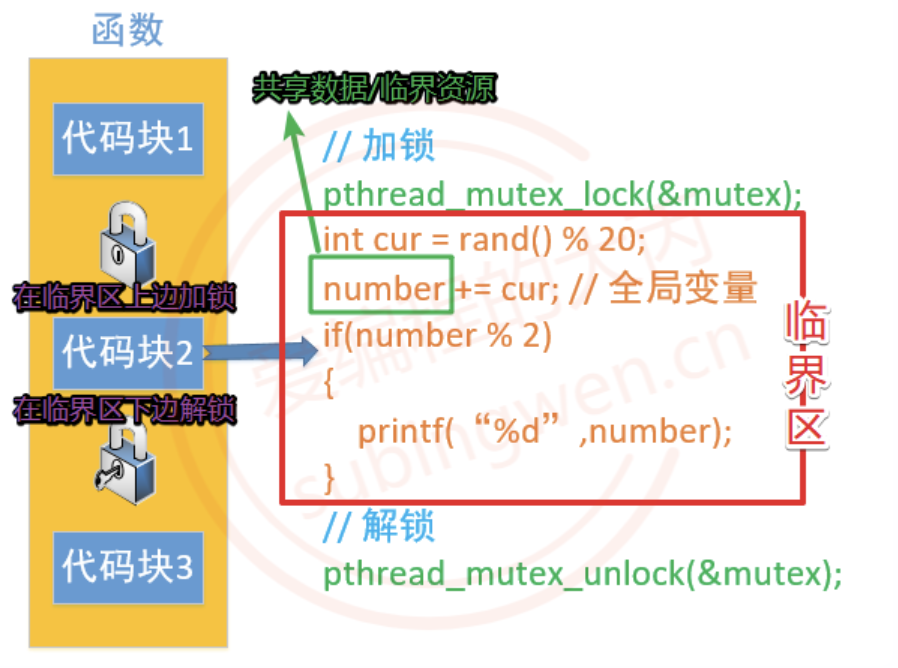

注

1. 涉及共享资源的读和写才需要同步

# 互斥锁

## 介绍

互斥锁是线程同步最常用的一种方式，通过互斥锁可以锁定一个代码块, 被锁定的这个代码块, 所有的线程只能顺序执行，这样多线程访问共享资源数据混乱的问题就可以被解决了，需要付出的代价就是执行效率的降低，因为默认临界区多个线程是可以并行处理的，现在只能串行处理。

在Linux中互斥锁的类型为`pthread_mutex_t`，创建一个这种类型的变量就得到了一把互斥锁。

```c
pthread_mutex_t  mutex;
```

在创建的锁对象中保存了当前这把锁的状态信息：锁定还是打开，如果是锁定状态还记录了给这把锁加锁的线程信息（线程ID）。一个互斥锁变量只能被一个线程锁定，被锁定之后其他线程再对互斥锁变量加锁就会被阻塞，直到这把互斥锁被解锁，被阻塞的线程才能被解除阻塞。一般情况下，每一个共享资源对应一个把互斥锁，锁的个数和线程的个数无关。

## 常见函数

**pthread_mutex_init**

初始化互斥锁。

```c
/*
* 参数:
- mutex: 互斥锁变量的地址
- attr: 互斥锁的属性, 一般使用默认属性即可, 这个参数指定为NULL

* 返回值:
- 成功: 0
- 失败: 返回对应的错误号
*/

// restrict是一个关键字, 用来修饰指针, 只有这个关键字修饰的指针可以访问指向的内存地址, 其他指针是不行的
int pthread_mutex_init(pthread_mutex_t *restrict mutex,
           const pthread_mutexattr_t *restrict attr);
```

**pthread_mutex_destroy**

释放互斥锁资源。

```c
/*
* 参数:
- mutex: 互斥锁变量的地址

* 返回值:
- 成功: 0
- 失败: 返回对应的错误号
*/

int pthread_mutex_destroy(pthread_mutex_t *mutex);
```

**pthread_mutex_lock**

首先会判断参数 mutex 互斥锁中的状态是不是锁定状态

- 没有被锁定，这个线程可以加锁成功，这个这个锁中会记录是哪个线程加锁成功了
- 如果被锁定了, 其他线程加锁就失败了, 这些线程都会阻塞在这把锁上
- 当这把锁被解开之后, 这些阻塞在锁上的线程就解除阻塞了，并且这些线程是通过竞争的方式对这把锁加锁，没抢到锁的线程继续阻塞

```c
// 同上
int pthread_mutex_lock(pthread_mutex_t *mutex);
```

**pthread_mutex_trylock**

对互斥锁变量尝试加锁

- 如果这把锁没有被锁定是打开的，线程加锁成功
- 如果锁变量被锁住了，调用这个函数加锁的线程，不会被阻塞，加锁失败直接返回错误号

```c
// 同上
int pthread_mutex_trylock(pthread_mutex_t *mutex);
```

**pthread_mutex_unlock**

不是所有的线程都可以对互斥锁解锁，哪个线程加的锁, 哪个线程才能解锁成功。

```c
// 同上
int pthread_mutex_unlock(pthread_mutex_t *mutex);
```

## 应用

> 使用互斥锁进行同步

```c
#include <stdio.h>
#include <unistd.h>
#include <stdlib.h>
#include <sys/types.h>
#include <sys/stat.h>
#include <string.h>
#include <pthread.h>

#define MAX 100
// 全局变量
int number;

// 创建一把互斥锁
// 全局变量, 多个线程共享
pthread_mutex_t mutex;

// 线程处理函数
void* funcA_num(void* arg)
{
    for(int i=0; i<MAX; ++i)
    {
        pthread_mutex_lock(&mutex);
        int cur = number;
        cur++;
        usleep(10);
        number = cur;
        pthread_mutex_unlock(&mutex);
        printf("Thread A, id = %lu, number = %d\n", pthread_self(), number);
    }

    return NULL;
}

void* funcB_num(void* arg)
{
    for(int i=0; i<MAX; ++i)
    {
        pthread_mutex_lock(&mutex);
        int cur = number;
        cur++;
        number = cur;
        pthread_mutex_unlock(&mutex);
        printf("Thread B, id = %lu, number = %d\n", pthread_self(), number);
        usleep(5);
    }

    return NULL;
}

int main(int argc, const char* argv[])
{
    pthread_t p1, p2;

    // 初始化互斥锁
    pthread_mutex_init(&mutex, NULL);

    // 创建两个子线程
    pthread_create(&p1, NULL, funcA_num, NULL);
    pthread_create(&p2, NULL, funcB_num, NULL);

    // 阻塞，资源回收
    pthread_join(p1, NULL);
    pthread_join(p2, NULL);

    // 销毁互斥锁
    // 线程销毁之后, 再去释放互斥锁
    pthread_mutex_destroy(&mutex);

    return 0;
}
```

## 死锁

当多个线程访问共享资源, 需要加锁, 如果锁使用不当, 就会造成死锁这种现象。如果线程死锁造成的后果是所有的线程都被阻塞，并且线程的阻塞是无法解开的（因为可以解锁的线程也被阻塞了）。

造成死锁的场景有如下几种

- 加锁之后忘记解锁
- 重复加锁, 造成死锁
- 在程序中有多个共享资源, 因此有很多把锁，随意加锁，导致相互被阻塞

在使用多线程编程的时候，如何避免死锁

- 避免多次锁定, 多检查
- 对共享资源访问完毕之后, 一定要解锁，或者在加锁的使用 trylock
- 如果程序中有多把锁, 可以控制对锁的访问顺序(顺序访问共享资源，但在有些情况下是做不到的)，另外也可以在对其他互斥锁做加锁操作之前，先释放当前线程拥有的互斥锁
- 项目程序中可以引入一些专门用于死锁检测的模块

# 读写锁

## 介绍

读写锁是互斥锁的升级版，在做读操作的时候可以提高程序的执行效率，如果所有的线程都是做读操作, 那么读是并行的，但是写操作是串行的。

读写锁的类型为`pthread_rwlock_t`，有了类型之后就可以创建一把互斥锁了

```c
pthread_rwlock_t rwlock
```

读写锁的使用方式也互斥锁的使用方式是完全相同的：找共享资源, 确定临界区，在临界区的开始位置加锁（读锁/写锁），临界区的结束位置解锁。

因为通过一把读写锁可以锁定读或者写操作，下面介绍一下关于读写锁的特点

- 使用读写锁的读锁锁定了临界区，线程对临界区的访问是并行的，读锁是共享的
- 使用读写锁的写锁锁定了临界区，线程对临界区的访问是串行的，写锁是独占的
- 使用读写锁分别对两个临界区加了读锁和写锁，两个线程要同时访问者两个临界区，访问写锁临界区的线程继续运行，访问读锁临界区的线程阻塞，因为写锁比读锁的优先级高

如果说程序中所有的线程都对共享资源做写操作，使用读写锁没有优势，和互斥锁是一样的，如果说程序中所有的线程都对共享资源有写也有读操作，并且对共享资源读的操作越多，读写锁更有优势。

## 常见函数

**pthread_rwlock_init**

初始化读写锁。

```c
#include <pthread.h>

/*
* 参数:
- rwlock: 读写锁的地址，传出参数
- attr: 读写锁的属性, 一般使用默认属性即可, 这个参数指定为NULL

* 返回值:
- 成功: 0
- 失败: 返回对应的错误号
*/

int pthread_rwlock_init(pthread_rwlock_t *restrict rwlock,
           const pthread_rwlockattr_t *restrict attr);
```

**pthread_rwlock_destroy**

释放读写锁占用的系统资源。

```c
/*
* 参数:
- rwlock: 读写锁的地址，传出参数

* 返回值:
- 成功: 0
- 失败: 返回对应的错误号
*/

int pthread_rwlock_destroy(pthread_rwlock_t *rwlock);
```

**pthread_rwlock_rdlock**

在程序中对读写锁加读锁, 锁定的是读操作。调用这个函数，如果读写锁是打开的，那么加锁成功；如果读写锁已经锁定了读操作，调用这个函数依然可以加锁成功，因为读锁是共享的；如果读写锁已经锁定了写操作，调用这个函数的线程会被阻塞。

```c
int pthread_rwlock_rdlock(pthread_rwlock_t *rwlock);
```

**pthread_rwlock_tryrdlock**

这个函数可以有效的避免死锁，如果读写锁已经锁定了写操作，调用这个函数加锁失败，对应的线程不会被阻塞；其他情况同`pthread_rwlock_rdlock`。

```c
int pthread_rwlock_tryrdlock(pthread_rwlock_t *rwlock);
```

**pthread_rwlock_wrlock**

在程序中对读写锁加写锁, 锁定的是写操作。调用这个函数，如果读写锁是打开的，那么加锁成功；如果读写锁已经锁定了读操作或者锁定了写操作，调用这个函数的线程会被阻塞。

```c
int pthread_rwlock_wrlock(pthread_rwlock_t *rwlock);
```

**pthread_rwlock_trywrlock**

这个函数可以有效的避免死锁，如果读写锁已经锁定了读操作或者锁定了写操作，调用这个函数加锁失败，但是线程不会阻塞；其他情况同`pthread_rwlock_wrlock`。

```c
int pthread_rwlock_trywrlock(pthread_rwlock_t *rwlock);
```

**pthread_rwlock_unlock**

解锁, 不管锁定了读还是写都可用解锁。

```c
int pthread_rwlock_unlock(pthread_rwlock_t *rwlock);
```

## 应用

> 使用互斥锁进行同步

```c
#include <stdio.h>
#include <stdlib.h>
#include <unistd.h>
#include <string.h>
#include <pthread.h>

// 全局变量
int number = 0;

// 定义读写锁
pthread_rwlock_t rwlock;

// 写的线程的处理函数
void* writeNum(void* arg)
{
    while(1)
    {
        pthread_rwlock_wrlock(&rwlock);
        int cur = number;
        cur ++;
        number = cur;
        printf("++写操作完毕, number : %d, tid = %ld\n", number, pthread_self());
        pthread_rwlock_unlock(&rwlock);
        // 添加sleep目的是要看到多个线程交替工作
        usleep(rand() % 100);
    }

    return NULL;
}

// 读线程的处理函数
// 多个线程可以如果处理动作相同, 可以使用相同的处理函数
// 每个线程中的栈资源是独享
void* readNum(void* arg)
{
    while(1)
    {
        pthread_rwlock_rdlock(&rwlock);
        printf("--全局变量number = %d, tid = %ld\n", number, pthread_self());
        pthread_rwlock_unlock(&rwlock);
        usleep(rand() % 100);
    }
    return NULL;
}

int main()
{
    // 初始化读写锁
    pthread_rwlock_init(&rwlock, NULL);

    // 3个写线程, 5个读的线程
    pthread_t wtid[3];
    pthread_t rtid[5];
    for(int i=0; i<3; ++i)
    {
        pthread_create(&wtid[i], NULL, writeNum, NULL);
    }

    for(int i=0; i<5; ++i)
    {
        pthread_create(&rtid[i], NULL, readNum, NULL);
    }

    // 释放资源
    for(int i=0; i<3; ++i)
    {
        pthread_join(wtid[i], NULL);
    }

    for(int i=0; i<5; ++i)
    {
        pthread_join(rtid[i], NULL);
    }

    // 销毁读写锁
    pthread_rwlock_destroy(&rwlock);

    return 0;
}
```

# 自旋锁

## 介绍

与互斥锁不同的是，当线程尝试获取自旋锁失败时不会进入阻塞状态，而是会不断循环检测锁的状态，这种循环检测的行为称为 自旋。

在 Linux 中自旋锁的类型为pthread_spinlock_t，创建变量即可得到一把自旋锁。

```c
pthread_spinlock_t spinlock;
```

当一个线程获得自旋锁后，其它线程再次尝试加锁时不会阻塞，而是不断轮询直到锁被释放。

自旋锁通过不断循环检测锁状态来获取锁，避免线程阻塞和上下文切换，但可能会浪费 CPU 资源，因此适用于临界区执行时间非常短的场景。

**什么时候使用自旋锁**

适合场景

- 锁持有时间非常短
- 临界区代码很少
- 多核CPU环境

不适合

- 锁竞争激烈
- 临界区较大
- 单核CPU

## 常见函数

**pthread_spin_init**

初始化自旋锁。

```c
/*
* 参数:
- lock: 自旋锁变量地址
- pshared: 指定自旋锁的作用范围
	- 0：线程之间共享
	- 非0：进程之间共享

* 返回值:
- 成功: 0
- 失败: 返回对应错误号
*/

int pthread_spin_init(pthread_spinlock_t *lock, int pshared);
```

**pthread_spin_destroy**

销毁自旋锁，释放资源。

```c
/*
* 参数:
- lock: 自旋锁变量地址

* 返回值:
- 成功: 0
- 失败: 返回对应错误号
*/

int pthread_spin_destroy(pthread_spinlock_t *lock);
```

**pthread_spin_lock**

对自旋锁加锁。

- 如果锁没有被占用，加锁成功
- 如果锁已经被占用，线程不会阻塞，线程会一直循环检测锁状态，直到锁被释放

```c
int pthread_spin_lock(pthread_spinlock_t *lock);
```

**pthread_spin_trylock**

尝试对自旋锁加锁。

- 如果锁空闲，加锁成功
- 如果锁被占用，立即返回错误，不会自旋等待

```c
int pthread_spin_trylock(pthread_spinlock_t *lock);
```

**pthread_spin_unlock**

解锁自旋锁。

```c
int pthread_spin_unlock(pthread_spinlock_t *lock);
```

## 应用

> 使用自旋锁进行线程同步

```c
#include <stdio.h>
#include <pthread.h>
#include <unistd.h>

#define MAX 100000

int number = 0;

// 定义自旋锁
pthread_spinlock_t spinlock;

// 线程处理函数
void* addNum(void* arg)
{
    for(int i = 0; i < MAX; ++i)
    {
        pthread_spin_lock(&spinlock);

        int cur = number;
        cur++;
        number = cur;

        pthread_spin_unlock(&spinlock);
    }

    return NULL;
}

int main()
{
    pthread_t tid1, tid2;

    // 初始化自旋锁
    pthread_spin_init(&spinlock, 0);

    pthread_create(&tid1, NULL, addNum, NULL);
    pthread_create(&tid2, NULL, addNum, NULL);

    pthread_join(tid1, NULL);
    pthread_join(tid2, NULL);

    printf("number = %d\n", number);

    // 销毁自旋锁
    pthread_spin_destroy(&spinlock);

    return 0;
}
```

# 条件变量

## 介绍

严格意义上来说，条件变量的主要作用不是处理线程同步，而是进行线程的阻塞。如果在多线程程序中只使用条件变量无法实现线程的同步, 必须要配合互斥锁来使用。

条件变量只有在满足指定条件下才会阻塞线程，如果条件不满足，多个线程可以同时进入临界区，同时读写临界资源，这种情况下还是会出现共享资源中数据的混乱。

一般情况下条件变量用于处理生产者和消费者模型，并且和互斥锁配合使用。条件变量类型对应的类型为`pthread_cond_t`，这样就可以定义一个条件变量类型的变量了。

```c
pthread_cond_t cond;
```

被条件变量阻塞的线程的线程信息会被记录到这个变量中，以便在解除阻塞的时候使用。

## 常见函数

**pthread_cond_init**

初始化条件变量。

```c
#include <pthread.h>

/*
* 参数:
- cond: 条件变量的地址
- attr: 条件变量属性, 一般使用默认属性, 指定为NULL

* 返回值:
- 成功: 0
- 失败: 返回对应错误号
*/

int pthread_cond_init(pthread_cond_t *restrict cond,
      const pthread_condattr_t *restrict attr);
```

**pthread_cond_destroy**

销毁释放条件变量资源

```c
/*
* 参数:
- cond: 条件变量的地址

* 返回值:
- 成功: 0
- 失败: 返回对应错误号
*/

int pthread_cond_destroy(pthread_cond_t *cond);
```

**pthread_cond_wait**

线程阻塞函数, 哪个线程调用这个函数, 哪个线程就会被阻塞。


该函数在阻塞线程的时候，需要一个互斥锁参数，这个互斥锁主要功能是进行线程同步，让线程顺序进入临界区，避免出现数共享资源的数据混乱。该函数会对这个互斥锁做以下几件事情

- 在阻塞线程时候，如果线程已经对互斥锁mutex上锁，那么会将这把锁打开，这样做是为了避免死锁
- 当线程解除阻塞的时候，函数内部会帮助这个线程再次将这个mutex互斥锁锁上，继续向下访问临界区

```c
int pthread_cond_wait(pthread_cond_t *restrict cond, pthread_mutex_t *restrict mutex);
```

**pthread_cond_timedwait**

将线程阻塞一定的时间长度, 时间到达之后, 线程就解除阻塞了。

```c
int pthread_cond_timedwait( pthread_cond_t *restrict cond,
           					pthread_mutex_t *restrict mutex,
                            const struct timespec *restrict abstime);
```

timespec结构体表示的时间是从1971.1.1到某个时间点的时间, 总长度使用秒/纳秒表示。

```c
struct timespec {
	time_t tv_sec;      /* Seconds */
	long   tv_nsec;     /* Nanoseconds [0 .. 999999999] */
};
```

赋值方式。

```c
time_t mytim = time(NULL);				// 1970.1.1 0:0:0 到当前的总秒数
struct timespec tmsp;
tmsp.tv_nsec = 0;
tmsp.tv_sec = time(NULL) + 100;			// 线程阻塞100s
```

**pthread_cond_signal**

唤醒阻塞在条件变量上的线程, 至少有一个被解除阻塞。

```c
int pthread_cond_signal(pthread_cond_t *cond);
```

**pthread_cond_broadcast**

唤醒阻塞在条件变量上的线程, 被阻塞的线程全部解除阻塞。

```c
int pthread_cond_broadcast(pthread_cond_t *cond);
```

调用上面两个函数中的任意一个，都可以唤醒被pthread_cond_wait或者pthread_cond_timedwait阻塞的线程，区别就在于pthread_cond_signal是唤醒至少一个被阻塞的线程（总个数不定），pthread_cond_broadcast是唤醒所有被阻塞的线程。

## 应用

> 生产者消费者

```c
#include <stdio.h>
#include <stdlib.h>
#include <unistd.h>
#include <string.h>
#include <pthread.h>

// 链表的节点
struct Node
{
    int number;
    struct Node* next;
};

// 定义条件变量, 控制消费者线程
pthread_cond_t cond;
// 互斥锁变量
pthread_mutex_t mutex;
// 指向头结点的指针
struct Node * head = NULL;

// 生产者的回调函数
void* producer(void* arg)
{
    // 一直生产
    while(1)
    {
        pthread_mutex_lock(&mutex);
        // 创建一个链表的新节点
        struct Node* pnew = (struct Node*)malloc(sizeof(struct Node));
        // 节点初始化
        pnew->number = rand() % 1000;
        // 节点的连接, 添加到链表的头部, 新节点就新的头结点
        pnew->next = head;
        // head指针前移
        head = pnew;
        printf("+++producer, number = %d, tid = %ld\n", pnew->number, pthread_self());
        pthread_mutex_unlock(&mutex);

        // 生产了任务, 通知消费者消费
        pthread_cond_broadcast(&cond);

        // 生产慢一点
        sleep(rand() % 3);
    }
    return NULL;
}

// 消费者的回调函数
void* consumer(void* arg)
{
    while(1)
    {
        pthread_mutex_lock(&mutex);
        // 一直消费, 删除链表中的一个节点
        while(head == NULL)
        {
            // 任务队列, 也就是链表中已经没有节点可以消费了
            // 消费者线程需要阻塞
            // 线程加互斥锁成功, 但是线程阻塞在这行代码上, 锁还没解开
            // 其他线程在访问这把锁的时候也会阻塞, 生产者也会阻塞 ==> 死锁
            // 这函数会自动将线程拥有的锁解开
            pthread_cond_wait(&cond, &mutex);
            // 当消费者线程解除阻塞之后, 会自动将这把锁锁上
            // 这时候当前这个线程又重新拥有了这把互斥锁
        }
        // 取出链表的头结点, 将其删除
        struct Node* pnode = head;
        printf("--consumer: number: %d, tid = %ld\n", pnode->number, pthread_self());
        head  = pnode->next;
        free(pnode);
        pthread_mutex_unlock(&mutex);        

        sleep(rand() % 3);
    }
    return NULL;
}

int main()
{
    // 初始化条件变量
    pthread_cond_init(&cond, NULL);
    pthread_mutex_init(&mutex, NULL);

    // 创建5个生产者, 5个消费者
    pthread_t ptid[5];
    pthread_t ctid[5];
    for(int i=0; i<5; ++i)
    {
        pthread_create(&ptid[i], NULL, producer, NULL);
    }

    for(int i=0; i<5; ++i)
    {
        pthread_create(&ctid[i], NULL, consumer, NULL);
    }

    // 释放资源
    for(int i=0; i<5; ++i)
    {
        // 阻塞等待子线程退出
        pthread_join(ptid[i], NULL);
    }

    for(int i=0; i<5; ++i)
    {
        pthread_join(ctid[i], NULL);
    }

    // 销毁条件变量
    pthread_cond_destroy(&cond);
    pthread_mutex_destroy(&mutex);

    return 0;
}
```

# 信号量

## 介绍

信号量用在多线程多任务同步的，一个线程完成了某一个动作就通过信号量告诉别的线程，别的线程再进行某些动作。信号量不一定是锁定某一个资源，而是流程上的概念。

信号量主要阻塞线程，不能完全保证线程安全，如果要保证线程安全, 需要信号量和互斥锁一起使用。

信号的类型为`sem_t`，创建信号量。

```c
#include <semaphore.h>
sem_t sem;
```

## 常见函数

**sem_init**

初始化信号量。

```c
/*
* 参数:
- sem：信号量变量地址
- pshared：
	- 0：线程同步
	- 非0：进程同步
-value：初始化当前信号量拥有的资源数（>=0），如果资源数为0，线程就会被阻塞了


* 返回值:
- 成功: 0
- 失败: 返回对应错误号
*/

int sem_init(sem_t *sem, int pshared, unsigned int value);
```

**sem_destroy**

信号量删除。

```c
/*
* 参数:
- sem：信号量变量地址

* 返回值:
- 成功: 0
- 失败: 返回对应错误号
*/

int sem_destroy(sem_t *sem);
```

**sem_wait**

sem中的资源数>0，线程不会阻塞，线程会占用sem中的一个资源，因此资源数-1，直到sem中的资源数减为0时，资源被耗尽，因此线程也就被阻塞了。

```c
int sem_wait(sem_t *sem);
```

**sem_trywait**

当sem中的资源数减为0时，资源被耗尽，但是线程不会被阻塞，直接返回错误号，其他同sem_wait。

```c
int sem_trywait(sem_t *sem);
```

**sem_timedwait**

当sem中的资源数减为0时，资源被耗尽，线程被阻塞，当阻塞指定的时长之后，线程解除阻塞，其他同sem_wait。

```c
int sem_timedwait(sem_t *sem, const struct timespec *abs_timeout);
```

**sem_post**

给sem中的资源数+1。

```c
int sem_post(sem_t *sem);
```

**sem_getvalue**

查看sem中现在拥有的资源个数，通过第二个参数sval将数据传出。

```c
int sem_getvalue(sem_t *sem, int *sval);
```

## 应用

> 生产者消费者

```c
#include <stdio.h>
#include <stdlib.h>
#include <unistd.h>
#include <string.h>
#include <semaphore.h>
#include <pthread.h>

// 链表的节点
struct Node
{
    int number;
    struct Node* next;
};

// 生产者线程信号量
sem_t psem;
// 消费者线程信号量
sem_t csem;

// 互斥锁变量
pthread_mutex_t mutex;
// 指向头结点的指针
struct Node * head = NULL;

// 生产者的回调函数
void* producer(void* arg)
{
    // 一直生产
    while(1)
    {
        // 生产者拿一个信号灯
        sem_wait(&psem);
        // 加锁, 这句代码放到 sem_wait()上边, 有可能会造成死锁
        pthread_mutex_lock(&mutex);
        // 创建一个链表的新节点
        struct Node* pnew = (struct Node*)malloc(sizeof(struct Node));
        // 节点初始化
        pnew->number = rand() % 1000;
        // 节点的连接, 添加到链表的头部, 新节点就新的头结点
        pnew->next = head;
        // head指针前移
        head = pnew;
        printf("+++producer, number = %d, tid = %ld\n", pnew->number, pthread_self());
        pthread_mutex_unlock(&mutex);

        // 通知消费者消费
        sem_post(&csem);
        
        // 生产慢一点
        sleep(rand() % 3);
    }
    return NULL;
}

// 消费者的回调函数
void* consumer(void* arg)
{
    while(1)
    {
        sem_wait(&csem);
        pthread_mutex_lock(&mutex);
        struct Node* pnode = head;
        printf("--consumer: number: %d, tid = %ld\n", pnode->number, pthread_self());
        head  = pnode->next;
        // 取出链表的头结点, 将其删除
        free(pnode);
        pthread_mutex_unlock(&mutex);
        // 通知生产者生成, 给生产者加信号灯
        sem_post(&psem);

        sleep(rand() % 3);
    }
    return NULL;
}

int main()
{
    // 初始化信号量
    sem_init(&psem, 0, 5);  // 生成者线程一共有5个信号灯
    sem_init(&csem, 0, 0);  // 消费者线程一共有0个信号灯
    // 初始化互斥锁
    pthread_mutex_init(&mutex, NULL);

    // 创建5个生产者, 5个消费者
    pthread_t ptid[5];
    pthread_t ctid[5];
    for(int i=0; i<5; ++i)
    {
        pthread_create(&ptid[i], NULL, producer, NULL);
    }

    for(int i=0; i<5; ++i)
    {
        pthread_create(&ctid[i], NULL, consumer, NULL);
    }

    // 释放资源
    for(int i=0; i<5; ++i)
    {
        pthread_join(ptid[i], NULL);
    }

    for(int i=0; i<5; ++i)
    {
        pthread_join(ctid[i], NULL);
    }

    sem_destroy(&psem);
    sem_destroy(&csem);
    pthread_mutex_destroy(&mutex);

    return 0;
}
```

注

1. 信号量位于加锁外，否则会导致死锁

# 原子操作

## 介绍

原子操作是指不可被中断的操作，在执行过程中不会被线程切换打断，因此可以保证操作的完整性。原子操作通过CPU提供的不可中断指令保证数据操作的原子性，适用于简单共享变量的高效线程同步。

**原子操作的特点**

- 不需要加锁
- 不会被线程切换打断
- 效率比互斥锁高

注

1. 原子操作只能保证单个变量的操作安全
2. 不能保证复杂逻辑的安全

在 Linux / C 语言中，原子操作主要有两种方式

- GCC内建原子函数（\_\_sync / __atomic）
2. C11标准原子操作（stdatomic.h）

## 常见函数(GCC内建)

**__sync_fetch_and_add**

原子加法。

```c
/*
* 参数:
- ptr: 要操作的变量地址
- value: 要增加的值

* 返回值:
- 返回修改之前的值
*/

int __sync_fetch_and_add(int *ptr, int value);
```

**__sync_add_and_fetch**

原子加法（返回新值）。

```c
int __sync_add_and_fetch(int *ptr, int value);
```

**__sync_fetch_and_sub**

原子减法。

```c
int __sync_fetch_and_sub(int *ptr, int value);
```

**__sync_bool_compare_and_swap**

CAS（比较并交换）。

```c
/*
* 参数:
- ptr: 变量地址
- oldval: 期望值
- newval: 新值

* 返回值:
- true: 修改成功
- false: 修改失败
*/

bool __sync_bool_compare_and_swap(int *ptr, int oldval, int newval);
```

## 常见函数（C11标准）

定义原子变量。

```c
#include <stdatomic.h>
atomic_int x;
```

**atomic_fetch_add**

```c
int atomic_fetch_add(atomic_int *obj, int value);
```

**atomic_load**

读取原子变量。

```c
int atomic_load(atomic_int *obj);
```

**atomic_store**

写入原子变量。

```c
void atomic_store(atomic_int *obj, int value);
```

## 应用

> 使用原子操作实现线程安全计数

```
#include <stdio.h>
#include <pthread.h>
#include <stdatomic.h>

#define MAX 100000

atomic_int number = 0;

void* addNum(void* arg)
{
    for(int i = 0; i < MAX; ++i)
    {
        atomic_fetch_add(&number, 1);
    }
    return NULL;
}

int main()
{
    pthread_t tid1, tid2;

    pthread_create(&tid1, NULL, addNum, NULL);
    pthread_create(&tid2, NULL, addNum, NULL);

    pthread_join(tid1, NULL);
    pthread_join(tid2, NULL);

    printf("number = %d\n", atomic_load(&number));

    return 0;
}
```

注

1. 多步操作仍然需要锁
1. 原子操作适用于简单变量（计数器、标志位）

# 线程池

## 介绍

使用线程的时候就去创建一个线程，这样实现起来非常简便，但是就会有一个问题：如果并发的线程数量很多，并且每个线程都是执行一个时间很短的任务就结束了，这样频繁创建线程就会大大降低系统的效率，因为频繁创建线程和销毁线程需要时间。

线程池是一种多线程处理形式，处理过程中将任务添加到队列，然后在创建线程后自动启动这些任务。线程池线程都是后台线程，每个线程都使用默认的堆栈大小，以默认的优先级运行，并处于多线程单元中。

**实现原理**

线程池的组成主要分为3个部分，这三部分配合工作就可以得到一个完整的线程池

- 任务队列：存储需要处理的任务，由工作的线程来处理这些任务。通过线程池提供的API函数，将一个待处理的任务添加到任务队列，或者从任务队列中删除，已处理的任务会被从任务队列中删除
- 工作的线程：任务队列任务的消费者 ，N个。线程池中维护了一定数量的工作线程, 他们的作用是是不停的读任务队列, 从里边取出任务并处理。工作的线程相当于是任务队列的消费者角色，如果任务队列为空, 工作的线程将会被阻塞 (使用条件变量/信号量阻塞)，如果阻塞之后有了新的任务, 由生产者将阻塞解除, 工作线程开始工作
- 管理者线程：不处理任务队列中的任务，1个。它的任务是周期性的对任务队列中的任务数量以及处于忙状态的工作线程个数进行检测。当任务过多的时候, 可以适当的创建一些新的工作线程，当任务过少的时候, 可以适当的销毁一些工作的线程

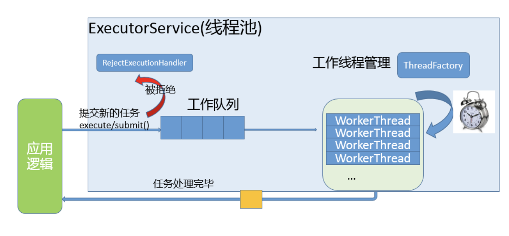

## C语言实现

`threadPool.h`

```c
#ifndef _THREADPOOL_H
#define _THREADPOOL_H

#define NUMBER 2        // 步长

// 线程池结构体
typedef struct ThreadPool ThreadPool;

// 创建线程池并初始化
ThreadPool *threadPoolCreate(int min, int max, int currentQueueSize);

// 销毁线程池
int threadPoolDestroy(ThreadPool* pool);

// 给线程池添加任务
void threadPoolAdd(ThreadPool* pool, void(*func)(void*), void* arg);

// 获取线程池中工作的线程的个数
int threadPoolBusyNum(ThreadPool* pool);

// 获取线程池中活着的线程的个数
int threadPoolAliveNum(ThreadPool* pool);

// 工作的线程(消费者线程)任务函数
void* worker(void* arg);
// 管理者线程任务函数
void* manager(void* arg);
// 单个线程退出
void threadExit(ThreadPool* pool);
#endif  // _THREADPOOL_H
```

`threadPool.c`

```c
#include<unistd.h>
#include<stdlib.h>
#include<stdio.h>
#include<string.h>
#include<pthread.h>
#include"threadPool.h"


// 任务结构体
typedef struct Task
{
    void (*function)(void* arg);
    void* arg;
}Task;

// 线程池结构体
typedef struct ThreadPool
{
    // 任务队列
    Task* taskQ;
    int queueCapacity;          // 容量
    int currentQueueSize;      // 当前任务个数
    int queueFront;            // 队头 -> 取数据
    int queueRear;             // 队尾 -> 放数据

    pthread_t managerID;    // 管理者线程ID
    pthread_t *threadIDs;   // 工作的线程ID
    int minNum;             // 最小线程数量
    int maxNum;             // 最大线程数量
    int busyNum;            // 忙的线程的个数
    int liveNum;            // 存活的线程的个数
    int exitNum;            // 要销毁的线程个数
    pthread_mutex_t mutexPool;  // 锁整个的线程池
    pthread_mutex_t mutexBusy;  // 锁busyNum变量
    pthread_cond_t isFull;     // 任务队列是不是满了
    pthread_cond_t isEmpty;    // 任务队列是不是空了

    int shutdown;           // 是不是要销毁线程池, 销毁为1, 不销毁为0
}ThreadPool;


ThreadPool* threadPoolCreate(int min, int max, int queueCapacity)
{
    // 初始化线程池
    ThreadPool* pool = (ThreadPool*)malloc(sizeof(ThreadPool));
    do 
    {
        if (pool == NULL)
        {
            printf("malloc threadpool fail...\n");
            break;
        }
        // 初始化工作线程
        pool->threadIDs = (pthread_t*)malloc(sizeof(pthread_t) * max);
        if (pool->threadIDs == NULL)
        {
            printf("malloc threadIDs fail...\n");
            break;
        }
        memset(pool->threadIDs, 0, sizeof(pthread_t) * max);
        pool->minNum = min;
        pool->maxNum = max;
        pool->busyNum = 0;
        pool->liveNum = min;    // 和最小个数相等
        pool->exitNum = 0;

        if (pthread_mutex_init(&pool->mutexPool, NULL) != 0 ||
            pthread_mutex_init(&pool->mutexBusy, NULL) != 0 ||
            pthread_cond_init(&pool->isEmpty, NULL) != 0 ||
            pthread_cond_init(&pool->isFull, NULL) != 0)
        {
            printf("mutex or condition init fail...\n");
            break;
        }

        // 初始化任务队列
        pool->taskQ = (Task*)malloc(sizeof(Task) * queueCapacity);
        pool->queueCapacity = queueCapacity;
        pool->currentQueueSize = 0;
        pool->queueFront = 0;
        pool->queueRear = 0;

        pool->shutdown = 0;

        // 创建线程
        pthread_create(&pool->managerID, NULL, manager, pool);
        for (int i = 0; i < min; ++i)
        {
            pthread_create(&pool->threadIDs[i], NULL, worker, pool);
        }
        return pool;
    } while (0);

    // 释放资源
    if (pool && pool->threadIDs) free(pool->threadIDs);
    if (pool && pool->taskQ) free(pool->taskQ);
    if (pool) free(pool);

    return NULL;
}


void* worker(void* arg)
{
    ThreadPool* pool = (ThreadPool*)arg;

    while (1)
    {
        pthread_mutex_lock(&pool->mutexPool);
        // 当前任务队列是否为空
        while (pool->currentQueueSize == 0 && !pool->shutdown)
        {
            // 阻塞工作线程
            pthread_cond_wait(&pool->isEmpty, &pool->mutexPool);

            // 判断是不是要销毁线程
            if (pool->exitNum > 0)
            {
                pool->exitNum--;
                if (pool->liveNum > pool->minNum)
                {
                    pool->liveNum--;
                    pthread_mutex_unlock(&pool->mutexPool);
                    threadExit(pool);
                }
            }
        }

        // 判断线程池是否被关闭了
        if (pool->shutdown)
        {
            pthread_mutex_unlock(&pool->mutexPool);
            threadExit(pool);
        }

        // 从任务队列中取出一个任务
        Task task;
        task.function = pool->taskQ[pool->queueFront].function;
        task.arg = pool->taskQ[pool->queueFront].arg;
        
        // 解锁
        pthread_cond_signal(&pool->isFull);
        pthread_mutex_unlock(&pool->mutexPool);

        printf("thread %ld start working...\n", pthread_self());
        pthread_mutex_lock(&pool->mutexBusy);
        pool->busyNum++;
        pthread_mutex_unlock(&pool->mutexBusy);
        task.function(task.arg);
        free(task.arg);
        task.arg = NULL;

        printf("thread %ld end working...\n", pthread_self());
        pthread_mutex_lock(&pool->mutexBusy);
        // 移动头结点
        pool->queueFront = (pool->queueFront + 1) % pool->queueCapacity;
        pool->currentQueueSize--;
        pool->busyNum--;
        pthread_mutex_unlock(&pool->mutexBusy);
    }
    return NULL;
}

void* manager(void* arg)
{
    ThreadPool* pool = (ThreadPool*)arg;
    while (!pool->shutdown)
    {
        // 每隔3s检测一次
        sleep(3);

        // 取出线程池中任务的数量和当前线程的数量
        pthread_mutex_lock(&pool->mutexPool);
        int currentQueueSize = pool->currentQueueSize;
        int liveNum = pool->liveNum;
        pthread_mutex_unlock(&pool->mutexPool);

        // 取出忙的线程的数量
        pthread_mutex_lock(&pool->mutexBusy);
        int busyNum = pool->busyNum;
        pthread_mutex_unlock(&pool->mutexBusy);

        // 添加线程
        // 任务的个数>存活的线程个数 && 存活的线程数<最大线程数
        if (currentQueueSize > liveNum && liveNum < pool->maxNum)
        {
            pthread_mutex_lock(&pool->mutexPool);
            int counter = 0;
            for (int i = 0; i < pool->maxNum && counter < NUMBER
                && pool->liveNum < pool->maxNum; ++i)
            {
                if (pool->threadIDs[i] == 0)
                {
                    pthread_create(&pool->threadIDs[i], NULL, worker, pool);
                    counter++;
                    pool->liveNum++;
                }
            }
            pthread_mutex_unlock(&pool->mutexPool);
        }
        // 销毁线程
        // 忙的线程*2 < 存活的线程数 && 存活的线程>最小线程数
        if (busyNum * 2 < liveNum && liveNum > pool->minNum)
        {
            pthread_mutex_lock(&pool->mutexPool);
            pool->exitNum = NUMBER;
            pthread_mutex_unlock(&pool->mutexPool);
            // 让工作的线程自杀
            for (int i = 0; i < NUMBER; ++i)
            {
                pthread_cond_signal(&pool->isEmpty);
            }
        }
    }
    return NULL;
}


void threadPoolAdd(ThreadPool* pool, void(*func)(void*), void* arg)
{
    pthread_mutex_lock(&pool->mutexPool);
    while (pool->currentQueueSize == pool->queueCapacity && !pool->shutdown)
    {
        // 阻塞生产者线程
        pthread_cond_wait(&pool->isFull, &pool->mutexPool);
    }
    if (pool->shutdown)
    {
        pthread_mutex_unlock(&pool->mutexPool);
        return;
    }
    // 添加任务
    pool->taskQ[pool->queueRear].function = func;
    pool->taskQ[pool->queueRear].arg = arg;
    pool->queueRear = (pool->queueRear + 1) % pool->queueCapacity;
    pool->currentQueueSize++;

    pthread_cond_signal(&pool->isEmpty);
    pthread_mutex_unlock(&pool->mutexPool);
}

int threadPoolBusyNum(ThreadPool* pool)
{
    pthread_mutex_lock(&pool->mutexBusy);
    int busyNum = pool->busyNum;
    pthread_mutex_unlock(&pool->mutexBusy);
    return busyNum;
}

int threadPoolAliveNum(ThreadPool* pool)
{
    pthread_mutex_lock(&pool->mutexPool);
    int aliveNum = pool->liveNum;
    pthread_mutex_unlock(&pool->mutexPool);
    return aliveNum;
}


int threadPoolDestroy(ThreadPool* pool)
{
    if (pool == NULL)
    {
        return -1;
    }

    // 关闭线程池
    pool->shutdown = 1;
    // 阻塞回收管理者线程
    pthread_join(pool->managerID, NULL);
    // 唤醒阻塞的工作线程
    for (int i = 0; i < pool->liveNum; ++i)
    {
        pthread_cond_signal(&pool->isEmpty);
    }
    
    // 释放堆内存
    if (pool->taskQ)
    {
        free(pool->taskQ);
    }
    if (pool->threadIDs)
    {
        // 此时不一定所有的线程都能来得及执行threadExit，可以加sleep确保都能够执行threadExit
        sleep(3);
        free(pool->threadIDs);

    }

    pthread_mutex_destroy(&pool->mutexPool);
    pthread_mutex_destroy(&pool->mutexBusy);
    pthread_cond_destroy(&pool->isEmpty);
    pthread_cond_destroy(&pool->isFull);

    free(pool);
    pool = NULL;

    return 0;
}


void threadExit(ThreadPool* pool)
{
    pthread_t tid = pthread_self();
    for (int i = 0; i < pool->maxNum; ++i)
    {
        if (pool->threadIDs[i] == tid)
        {
            pool->threadIDs[i] = 0;
            printf("threadExit() called, %ld exiting...\n", tid);
            break;
        }
    }
    pthread_exit(NULL);
}
```

`main.c`

```c
#include<stdlib.h>
#include<stdio.h>
#include<pthread.h>
#include"threadPool.h"

void taskFunc(void* arg)
{
    int* num = (int*)arg;	// 由线程池内部释放
    printf("thread %ld is working, number = %d\n",
    pthread_self(), *num);
    sleep(1);
}

int main()
{
    // 创建线程池
    ThreadPool* pool = threadPoolCreate(3, 10, 100);
    for (int i = 0; i < 100; ++i)
    {
        int* num = (int*)malloc(sizeof(int));
        *num = i + 100;
        threadPoolAdd(pool, taskFunc, num);
    }
    
    // 保证线程池中任务队列已处理完成
    sleep(30); 
    //销毁线程池
    threadPoolDestroy(pool);
    return 0;
}
```

```shell
$ gcc main.c threadPool.c -o main
$ ./main
```

## C++实现

**任务队列类**

`TaskQueue.hpp`

```cpp
#ifndef _TASKQUEUE_HPP_
#define _TASKQUEUE_HPP_

#include<pthread.h>
#include<queue>

// 定义任务结构体
using callback = void(*)(void*);
struct Task
{
    Task()
    {
        function = nullptr;
        arg = nullptr;
    }
    Task(callback f, void* arg)
    {
        function = f;
        this->arg = arg;
    }
    callback function;
    void* arg;
};

// 任务队列
class TaskQueue
{

private:
    pthread_mutex_t m_mutex;    // 互斥锁
    std::queue<Task> m_queue;   // 任务队列

public:
    TaskQueue();
    ~TaskQueue();

    // 添加任务
    void addTask(Task& task);
    void addTask(callback func, void* arg);

    // 取出一个任务
    Task takeTask();

    // 获取当前队列中任务个数
    inline int taskNumber()
    {
        return m_queue.size();
    }
};

#endif
```

`TaskQueue.cpp`

```cpp
#include "TaskQueue.hpp"

TaskQueue::TaskQueue()
{
    pthread_mutex_init(&m_mutex, NULL);
}

TaskQueue::~TaskQueue()
{
    pthread_mutex_destroy(&m_mutex);
}

void TaskQueue::addTask(Task& task)
{
    pthread_mutex_lock(&m_mutex);
    m_queue.push(task);
    pthread_mutex_unlock(&m_mutex);
}

void TaskQueue::addTask(callback func, void* arg)
{
    pthread_mutex_lock(&m_mutex);
    Task task;
    task.function = func;
    task.arg = arg;
    m_queue.push(task);
    pthread_mutex_unlock(&m_mutex);
}
// 如果队列函数循环则需要在完成任务队列函数后pop出任务队列头
// 否则任务数减小但任务函数仍在执行
Task TaskQueue::takeTask()
{
    Task t;
    pthread_mutex_lock(&m_mutex);
    if (m_queue.size() > 0)
    {
        t = m_queue.front();
        m_queue.pop();
    }
    pthread_mutex_unlock(&m_mutex);
    return t;
}
```

**线程池类**

`ThreadPool.hpp`

```cpp
#ifndef _THREADPOOL_HPP_
#define _THREADPOOL_HPP_
#include "TaskQueue.hpp"
class ThreadPool
{
public:
    ThreadPool(int min, int max);
    ~ThreadPool();

    // 添加任务
    void addTask(Task task);
    // 获取忙线程的个数
    int getBusyNumber();
    // 获取活着的线程个数
    int getAliveNumber();

private:
    // 工作的线程的任务函数
    static void* worker(void* arg);
    // 管理者线程的任务函数
    static void* manager(void* arg);
    void threadExit();

private:
    pthread_mutex_t m_lock;
    pthread_cond_t m_notEmpty;
    pthread_t* m_threadIDs;
    pthread_t m_managerID;
    TaskQueue* m_taskQ;
    int m_minNum;
    int m_maxNum;
    int m_busyNum;
    int m_aliveNum;
    int m_exitNum;
    bool m_shutdown = false;
};

#endif
```

`ThreadPool.cpp`

```cpp
#include <iostream>
#include <string.h>
#include <unistd.h>
#include <string>
#include "ThreadPool.hpp"

ThreadPool::ThreadPool(int minNum, int maxNum)
{
    // 实例化任务队列
    m_taskQ = new TaskQueue;
    do {
        // 初始化线程池
        this->m_minNum = minNum;
        this->m_maxNum = maxNum;
        this->m_busyNum = 0;
        this->m_aliveNum = minNum;

        // 根据线程的最大上限给线程数组分配内存
        this->m_threadIDs = new pthread_t[maxNum];
        if (m_threadIDs == nullptr)
        {
            std::cout << "malloc thread_t[] 失败...." << std::endl;;
            break;
        }
        // 初始化
        memset(m_threadIDs, 0, sizeof(pthread_t) * maxNum);
        // 初始化互斥锁,条件变量
        if (pthread_mutex_init(&m_lock, NULL) != 0 ||
            pthread_cond_init(&m_notEmpty, NULL) != 0)
        {
            std::cout << "init mutex or condition fail..." << std::endl;
            break;
        }

        /////////////////// 创建线程 //////////////////
        // 根据最小线程个数, 创建线程
        for (int i = 0; i < minNum; ++i)
        {
            pthread_create(&m_threadIDs[i], NULL, worker, this);
            std::cout << "创建子线程, ID: " << std::to_string(m_threadIDs[i]) << std::endl;
        }
        // 创建管理者线程, 1个
        pthread_create(&m_managerID, NULL, manager, this);
    } while (0);
}

ThreadPool::~ThreadPool()
{
    m_shutdown = 1;
    // 销毁管理者线程
    pthread_join(m_managerID, NULL);
    // 唤醒所有消费者线程
    for (int i = 0; i < m_aliveNum; ++i)
    {
        pthread_cond_signal(&m_notEmpty);
    }

    // 等待线程池中的线程处理完任务
    sleep(2);   
    if (m_taskQ) delete m_taskQ;
    if (m_threadIDs) delete[] m_threadIDs;
    pthread_mutex_destroy(&m_lock);
    pthread_cond_destroy(&m_notEmpty);
}

void ThreadPool::addTask(Task task)
{
    if (m_shutdown)
    {
        return;
    }
    // 添加任务，不需要加锁，任务队列中有锁
    m_taskQ->addTask(task);
    // 唤醒工作的线程
    pthread_cond_signal(&m_notEmpty);
}

int ThreadPool::getAliveNumber()
{
    int threadNum = 0;
    pthread_mutex_lock(&m_lock);
    threadNum = m_aliveNum;
    pthread_mutex_unlock(&m_lock);
    return threadNum;
}

int ThreadPool::getBusyNumber()
{
    int busyNum = 0;
    pthread_mutex_lock(&m_lock);
    busyNum = m_busyNum;
    pthread_mutex_unlock(&m_lock);
    return busyNum;
}


// 工作线程任务函数
void* ThreadPool::worker(void* arg)
{
    ThreadPool* pool = static_cast<ThreadPool*>(arg);
    // 一直不停的工作
    while (true)
    {
        // 访问任务队列(共享资源)加锁
        pthread_mutex_lock(&pool->m_lock);
        // 判断任务队列是否为空, 如果为空工作线程阻塞
        while (pool->m_taskQ->taskNumber() == 0 && !pool->m_shutdown)
        {
            std::cout << "thread " << std::to_string(pthread_self()) << " waiting..." << std::endl;
            // 阻塞线程
            pthread_cond_wait(&pool->m_notEmpty, &pool->m_lock);

            // 解除阻塞之后, 判断是否要销毁线程
            if (pool->m_exitNum > 0)
            {
                pool->m_exitNum--;
                if (pool->m_aliveNum > pool->m_minNum)
                {
                    pool->m_aliveNum--;
                    pthread_mutex_unlock(&pool->m_lock);
                    pool->threadExit();
                }
            }
        }
        // 判断线程池是否被关闭了
        if (pool->m_shutdown)
        {
            pthread_mutex_unlock(&pool->m_lock);
            pool->threadExit();
        }

        // 从任务队列中取出一个任务
        Task task = pool->m_taskQ->takeTask();
        // 工作的线程+1
        pool->m_busyNum++;
        // 线程池解锁
        pthread_mutex_unlock(&pool->m_lock);
        // 执行任务
        std::cout << "thread " << std::to_string(pthread_self()) << " start working..." << std::endl;
        task.function(task.arg);
        delete task.arg;
        task.arg = nullptr;

        // 任务处理结束
        std::cout << "thread " << std::to_string(pthread_self()) << " end working..." << std::endl;
        pthread_mutex_lock(&pool->m_lock);
        pool->m_busyNum--;
        pthread_mutex_unlock(&pool->m_lock);
    }

    return nullptr;
}


// 管理者线程任务函数
void* ThreadPool::manager(void* arg)
{
    ThreadPool* pool = static_cast<ThreadPool*>(arg);
    // 如果线程池没有关闭, 就一直检测
    while (!pool->m_shutdown)
    {
        // 每隔5s检测一次
        sleep(5);
        // 取出线程池中的任务数和线程数量
        //  取出工作的线程池数量
        pthread_mutex_lock(&pool->m_lock);
        int queueSize = pool->m_taskQ->taskNumber();
        int liveNum = pool->m_aliveNum;
        int busyNum = pool->m_busyNum;
        pthread_mutex_unlock(&pool->m_lock);

        // 创建线程
        const int NUMBER = 2;
        // 当前任务个数>存活的线程数 && 存活的线程数<最大线程个数
        if (queueSize > liveNum && liveNum < pool->m_maxNum)
        {
            // 线程池加锁
            pthread_mutex_lock(&pool->m_lock);
            int num = 0;
            for (int i = 0; i < pool->m_maxNum && num < NUMBER
                && pool->m_aliveNum < pool->m_maxNum; ++i)
            {
                if (pool->m_threadIDs[i] == 0)
                {
                    pthread_create(&pool->m_threadIDs[i], NULL, worker, pool);
                    num++;
                    pool->m_aliveNum++;
                }
            }
            pthread_mutex_unlock(&pool->m_lock);
        }

        // 销毁多余的线程
        // 忙线程*2 < 存活的线程数目 && 存活的线程数 > 最小线程数量
        if (busyNum * 2 < liveNum && liveNum > pool->m_minNum)
        {
            pthread_mutex_lock(&pool->m_lock);
            pool->m_exitNum = NUMBER;
            pthread_mutex_unlock(&pool->m_lock);
            for (int i = 0; i < NUMBER; ++i)
            {
                pthread_cond_signal(&pool->m_notEmpty);
            }
        }
    }
    return nullptr;
}

// 线程退出
void ThreadPool::threadExit()
{
    pthread_t tid = pthread_self();
    for (int i = 0; i < m_maxNum; ++i)
    {
        if (m_threadIDs[i] == tid)
        {
            std::cout << "threadExit() function: thread "
            << std::to_string(pthread_self()) << " exiting..." << std::endl;
            m_threadIDs[i] = 0;
            break;
        }
    }
    pthread_exit(NULL);
}
```

`main.cpp`

```cpp
#include<iostream>
#include "ThreadPool.hpp"
#include <unistd.h>

void taskFunc(void* arg)
{
    int* num = (int*)arg;
    std::cout << "thread " << pthread_self() << " is working, number = " << *num << std::endl;
    sleep(1);
}

int main()
{
    // 创建线程池
    ThreadPool pool = ThreadPool(3, 10);
    for (int i = 0; i < 100; ++i)
    {
        int* num = new int(i);
        pool.addTask(Task(taskFunc, num));
    }
    // 线程池调用析构函数自行消除
    sleep(30);
    return 0;
}
```

```shell
$ g++ main.cpp TaskQueue.cpp ThreadPool.cpp -o main
$ ./main
```

# 进程池

## 介绍

进程池是预先创建的一组子进程（通常3-10个），通过复用进程资源避免频繁创建进程的开销，所有子进程运行相同代码且属性一致，保持资源清洁。

**核心原理**

- 主进程通过算法（如轮询）或共享队列分配任务  
- 子进程通过IPC（如管道）与主进程通信  
- 每个进程独立内存空间，互不干扰

**区别**

|   对比维度   |                 线程池                 |                 进程池                 |
| :----------: | :------------------------------------: | :------------------------------------: |
| **并发模型** |           多线程（共享内存）           |           多进程（独立内存）           |
| **资源开销** |       低（线程创建、切换成本低）       |       高（进程创建、切换成本高）       |
| **数据共享** |     直接共享内存（需处理同步问题）     |     需通过 IPC（如队列、管道）通信     |
| **适用场景** | I/O 密集型任务（如网络请求、文件读写） | CPU 密集型任务（如数值计算、图像处理） |
|  **稳定性**  |      线程崩溃可能导致整个进程崩溃      |         进程崩溃不影响其他进程         |
| **并行能力** |              受限于全局锁              |     真正并行（多核 CPU 利用率高）      |
| **局限** |              复杂任务易死锁              | IPC通信成本高，不适合短时小任务 |

