<font size = 6>Network Programming for Linux</font>

[toc]

# socket

## 介绍

套接字就是一套网络通信的接口，使用这套接口就可以完成网络通信。与实现语言无关，可跨平台通信，与套接字相关的函数被包含在头文件`sys/socket.h`中。

Socket套接字其目的是将TCP/IP协议相关软件移植到UNIX类系统中。设计者开发了一个接口，以便应用程序能简单地调用该接口通信。这个接口不断完善，最终形成了Socket套接字。Linux系统采用了Socket套接字，因此，Socket接口就被广泛使用，到现在已经成为事实上的标准。

## 字节序

在各种计算机体系结构中，对于字节、字等的存储机制有所不同，因而引发了计算机通信领域中一个很重要的问题，即通信双方交流的信息单元（比特、字节、字、双字等等）应该以什么样的顺序进行传送。如果不达成一致的规则，通信双方将无法进行正确的编/译码从而导致通信失败。

字节序，顾名思义字节的顺序，就是大于一个字节类型的数据在内存中的存放顺序，也就是说对于单字符来说是没有字节序问题的，字符串是单字符的集合，因此字符串也没有字节序问题。

目前在各种体系的计算机中通常采用的字节存储机制主要有两种：Big-Endian 和 Little-Endian。

**Little-Endian**

主机字节序 (小端)，数据的低位字节存储到内存的低地址位， 数据的高位字节存储到内存的高地址位。PC机中数据的存储默认使用的是小端。

**Big-Endian**

网络字节序 (大端)，数据的低位字节存储到内存的高地址位，数据的高位字节存储到内存的低地址位。套接字通信过程中操作的数据都是大端存储的，包括接收/发送的数据、IP地址、端口。

**举例**

```c
// 有一个16进制的数, 有32位 (int): 0xab5c01ff
// 字节序, 最小的单位: 字节, int 有4个字节, 需要将其拆分为4份
                 内存低地址位                内存的高地址位
------------------------------------------------------------------------>
小端:         0xff        0x01        0x5c        0xab
大端:         0xab        0x5c        0x01        0xff
```

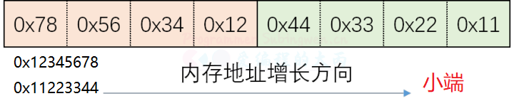

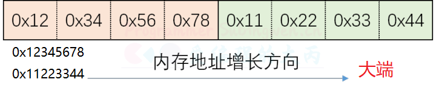

**API**

BSD Socket提供了封装好的转换接口，方便程序员使用。包括从主机字节序到网络字节序的转换函数：htons、htonl；从网络字节序到主机字节序的转换函数：ntohs、ntohl。

```c
#include <arpa/inet.h>
// u:unsigned
// 16: 16位, 32:32位
// h: host, 主机字节序
// n: net, 网络字节序
// s: short
// l: int

// 将一个短整形从主机字节序 -> 网络字节序
uint16_t htons(uint16_t hostshort);	
// 将一个整形从主机字节序 -> 网络字节序
uint32_t htonl(uint32_t hostlong);	

// 将一个短整形从网络字节序 -> 主机字节序
uint16_t ntohs(uint16_t netshort)
// 将一个整形从网络字节序 -> 主机字节序
uint32_t ntohl(uint32_t netlong);
```

虽然本地IP地址本质是一个整形数，但是在使用的过程中都是通过一个字符串来描述。

```c
/*
* 作用:
- 主机字节序的IP地址(字符串)转换为网络字节序(整形)

* 参数:
- af: 地址族协议
	- AF_INET: ipv4格式的ip地址
	- AF_INET6: ipv6格式的ip地址
- src: 传入参数, 对应要转换的点分十进制的ip地址: 192.168.1.100
- dst: 传出参数, 函数调用完成, 转换得到的大端整形IP被写入到这块内存中

* 返回值
- 成功: 1
- 失败: 0或者-1
*/

int inet_pton(int af, const char *src, void *dst); 
```

```c
#include <arpa/inet.h>

/*
* 作用:
- 将大端的整形数, 转换为小端的点分十进制的IP地址(字符串) 

* 参数:
- af: 地址族协议
	- AF_INET: ipv4格式的ip地址
	- AF_INET6: ipv6格式的ip地址
- src: 传入参数, 这个指针指向的内存中存储了大端的整形IP地址
- dst: 传出参数, 存储转换得到的小端的点分十进制的IP地址
- size: 修饰dst参数的, 标记dst指向的内存中最多可以存储多少个字节

* 返回值:
- 成功: 指针指向第三个参数对应的内存地址, 通过返回值也可以直接取出转换得到的IP字符串
- 失败: NULL
*/

const char *inet_ntop(int af, const void *src, char *dst, socklen_t size);
```

还有一组函数也能处理进程IP地址大小端的转换，但是只能处理ipv4的ip地址。

```c
// 点分十进制IP -> 大端整形
in_addr_t inet_addr (const char *cp);

// 大端整形 -> 点分十进制IP
char* inet_ntoa(struct in_addr in);
```

## 数据结构

**sockaddr**

用于socket通信的数据结构。

```c
struct sockaddr {
	sa_family_t sa_family;       // 地址族协议, ipv4
	char        sa_data[14];     // 端口(2字节) + IP地址(4字节) + 填充(8字节)
}
```

**sockaddr_in**

sockaddr难赋值，可以使用sockaddr_in来替代，最后进行类型转换即可。

```c
typedef unsigned short  uint16_t;
typedef unsigned int    uint32_t;
typedef uint16_t in_port_t;
typedef uint32_t in_addr_t;
typedef unsigned short int sa_family_t;
#define __SOCKADDR_COMMON_SIZE (sizeof (unsigned short int))

struct in_addr
{
    in_addr_t s_addr;
};  

// sizeof(struct sockaddr) == sizeof(struct sockaddr_in)
struct sockaddr_in
{
    sa_family_t sin_family;		/* 地址族协议: AF_INET */
    in_port_t sin_port;         /* 端口, 2字节-> 大端  */
    struct in_addr sin_addr;    /* IP地址, 4字节 -> 大端  */
    /* 填充 8字节 */
    unsigned char sin_zero[sizeof (struct sockaddr) - sizeof(sin_family) - sizeof (in_port_t) - sizeof (struct in_addr)];
};
```

## 套接字函数

使用套接字通信函数需要包含头文件<arpa/inet.h>，包含了这个头文件<sys/socket.h>就不用在包含了。

**socket**

```c
/*
* 作用:
- 创建一个套接字

* 参数:
- domain: 使用的地址族协议
	- AF_INET: 使用IPv4格式的ip地址
	- AF_INET6: 使用IPv6格式的ip地址
- type
	- SOCK_STREAM: 使用流式的传输协议
	- SOCK_DGRAM: 使用报式(报文)的传输协议
- protocol: 一般写0即可, 使用默认的协议
	- SOCK_STREAM: 流式传输默认使用的是tcp
	- SOCK_DGRAM: 报式传输默认使用的udp
	
* 返回值:
- 成功: 可用于套接字通信的文件描述符
- 失败: -1
*/

int socket(int domain, int type, int protocol);
```

**bind**

```c
/*
* 作用:
- 将文件描述符和本地的IP与端口进行绑定，须为大端

* 参数:
- sockfd: 监听的文件描述符, 通过socket()调用得到的返回值
- addr: 传入参数, 要绑定的IP和端口信息需要初始化到这个结构体中，IP和端口要转换为网络字节序
- addrlen: 参数addr指向的内存大小, sizeof(struct sockaddr)

* 返回值：
- 成功: 0
- 失败: -1
*/
   
int bind(int sockfd, const struct sockaddr *addr, socklen_t addrlen);
```

**listen**

```c
/*
* 作用:
- 给监听的套接字设置监听

* 参数:
- sockfd: 文件描述符, 可以通过调用socket()得到，在监听之前必须要绑定 bind()
- backlog: 同时能处理的最大连接要求，最大值为128 or 4096

* 返回值：
- 成功: 0
- 失败: -1
*/

int listen(int sockfd, int backlog);
```

**accept**

这个函数是一个阻塞函数，当没有新的客户端连接请求的时候，该函数阻塞。当检测到有新的客户端连接请求时，阻塞解除，新连接就建立了，得到的返回值也是一个文件描述符，基于这个文件描述符就可以和客户端通信了。

```c
/*
* 作用:
- 等待并接受客户端的连接请求, 建立新的连接, 会得到一个新的文件描述符(通信的)	

* 参数:
- sockfd: 监听的文件描述符
- addr: 传出参数, 里边存储了建立连接的客户端的地址信息
- addrlen: 传入传出参数，用于存储addr指向的内存大小

* 返回值：
- 成功: 得到一个文件描述符, 用于和建立连接的这个客户端通信
- 失败: -1
*/
	
int accept(int sockfd, struct sockaddr *addr, socklen_t *addrlen);
```

**read/recv**

如果连接没有断开，接收端接收不到数据，接收数据的函数会阻塞等待数据到达，数据到达后函数解除阻塞，开始接收数据。

当发送端断开连接，接收端无法接收到任何数据，但是这时候就不会阻塞了，函数直接返回0。

```c
/*
* 作用:
- 接收数据

* 参数:
- sockfd: 用于通信的文件描述符, accept() 函数的返回值
- buf: 指向一块有效内存, 用于存储接收是数据
- size: 参数buf指向的内存的容量
- flags: 特殊的属性, 一般不使用, 指定为 0

* 返回值:
- 大于0: 实际接收的字节数
- 等于0: 对方断开了连接
- -1: 接收数据失败了
*/

ssize_t read(int sockfd, void *buf, size_t size);
ssize_t recv(int sockfd, void *buf, size_t size, int flags);
```

**write/send**

```c
/*
* 作用:
- 发送数据的函数

* 参数:
- fd: 通信的文件描述符, accept() 函数的返回值
- buf: 传入参数, 要发送的字符串
- len: 要发送的字符串的长度
- flags: 特殊的属性, 一般不使用, 指定为 0

* 返回值：
- 大于0: 实际发送的字节数，和参数len是相等的
- -1: 发送数据失败了
*/

ssize_t write(int fd, const void *buf, size_t len);
ssize_t send(int fd, const void *buf, size_t len, int flags);
```

**connect**

```c
/*
* 作用:
- 成功连接服务器之后, 客户端会自动随机绑定一个端口

* 参数:
- sockfd: 通信的文件描述符, 通过调用socket()函数就得到了
- addr: 存储了要连接的服务器端的地址信息: iP和端口，这个IP和端口也需要转换为大端然后再赋值
- addrlen: addr指针指向的内存的大小 sizeof(struct sockaddr)

* 返回值：
- 连接成功: 0
- 连接失败: -1
*/

int connect(int sockfd, const struct sockaddr *addr, socklen_t addrlen);
```

**shutdown**

```c
/*
* 作用:
- 专门处理半关闭的函数，可以有选择的关闭读/写, close()函数只能关闭写操作

* 参数:
- sockfd: 要操作的文件描述符
- how:
	- SHUT_RD: 关闭文件描述符对应的读操作
	- SHUT_WR: 关闭文件描述符对应的写操作
	- SHUT_RDWR: 关闭文件描述符对应的读写操作

* 返回值：
- 连接成功: 0
- 连接失败: -1
*/

int shutdown(int sockfd, int how);
```

## TCP通信

TCP是一个面向连接的，安全的，流式传输协议，这个协议是一个传输层协议。

- 面向连接：是一个双向连接，通过三次握手完成，断开连接需要通过四次挥手完成
- 安全：tcp通信过程中，会对发送的每一数据包都会进行校验, 如果发现数据丢失, 会自动重传
- 流式传输：发送端和接收端处理数据的速度，数据的量都可以不一致

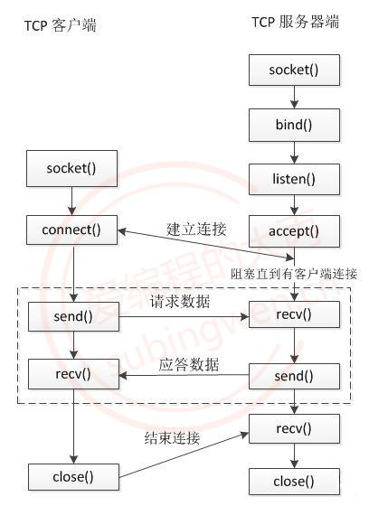

注

1. 客户端无需绑定固定端口

**服务器端通信流程**

1. 创建用于监听的套接字, 这个套接字是一个文件描述符

```c
int lfd = socket();
```

2. 将得到的监听的文件描述符和本地的 IP 端口进行绑定

```C
bind();
```

3. 设置监听(成功之后开始监听, 监听的是客户端的连接)

```c
listen();
```

4. 等待并接受客户端的连接请求, 建立新的连接, 会得到一个新的文件描述符(通信的)，没有新连接请求就阻塞

```c
int cfd = accept();
```

5. 通信，读写操作默认都是阻塞的

```c
// 接收数据
read(); / recv();
// 发送数据
write(); / send();
```

6. 断开连接, 关闭套接字

```c
close();
```

**客户端的通信流程**

在单线程的情况下客户端通信的文件描述符有一个，没有监听的文件描述符。

1. 创建一个通信的套接字

```c
int cfd = socket();
```

2. 连接服务器, 需要知道服务器绑定的IP和端口

```c
connect();
```

3. 通信

```c
// 接收数据
read(); / recv();
// 发送数据
write(); / send();
```

4. 断开连接, 关闭文件描述符(套接字)

```c
close();
```

## 文件描述符

在TCP的服务器端,，有两类文件描述符。

**监听的文件描述符**

- 只需要有一个
- 不负责和客户端通信，负责检测客户端的连接请求， 检测到之后调用accept就可以建立新的连接
- 客户端的连接请求会发送到服务器端监听的文件描述符的读缓冲区中
- 读缓冲区中有数据，说明有新的客户端连接
- 调用accept()函数，这个函数会检测监听文件描述符的读缓冲区
  - 检测不到数据，该函数阻塞
  - 如果检测到数据， 解除阻塞，新的连接建立

**通信的文件描述符**

- 负责和建立连接的客户端通信
- 如果有N个客户端和服务器建立了新的连接，通信的文件描述符就有N个，每个客户端和服务器都对应一个通信的文件描述符
- 客户端和服务器端都有通信的文件描述符
- 发送数据：调用函数 write() / send()，数据进入到内核中
  - 数据并没有被发送出去，而是将数据写入到了通信的文件描述符对应的写缓冲区中
  - 内核检测到通信的文件描述符写缓冲区中有数据，内核会将数据发送到网络中
  - 当写缓冲区满时，会陷入阻塞
- 接收数据: 调用的函数 read() / recv(), 从内核读数据
  - 数据如何进入到内核程序猿不需要处理，数据进入到通信的文件描述符的读缓冲区中
  - 内核检测到都缓冲区有数据，内核会将数据发送到内存中
  - 当读缓冲区空时，会陷入阻塞

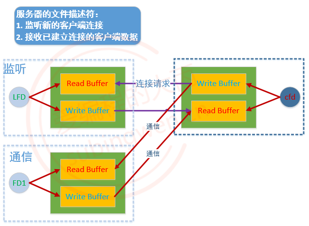

注

1. 真实流程：用户⇔内核 send buffer(~128KB)⇔网络

## 端口复用

在网络通信中，一个端口只能被一个进程使用，不能多个进程共用同一个端口。在进行套接字通信的时候，如果按顺序执行如下操作：先启动服务器程序，再启动客户端程序，然后关闭服务器进程，再退出客户端进程，最后再启动服务器进程，就会出如下的错误提示信息：bind error: Address already in use。

通过netstat查看TCP状态，发现上一个服务器进程其实还没有真正退出。因为服务器进程是主动断开连接的进程, 最后状态变成了 TIME_WAIT状态，这个进程会等待2msl(大约1分钟)才会退出，如果该进程不退出，其绑定的端口就不会释放，再次启动新的进程还是使用这个未释放的端口，端口被重复使用，就会提示bind error: Address already in use这个错误信息。

如果想要解决上述问题，就必须要设置端口复用。

**setsockopt**

```c
/*
* 作用:
- 这个函数是一个多功能函数, 可以设置套接字选项

* 参数:
- sockfd: 用于监听的文件描述符
- level：设置端口复用需要使用 SOL_SOCKET 宏
- optname：要设置什么属性（下边的两个宏都可以设置端口复用）
	- SO_REUSEADDR
	- SO_REUSEPORT
- optval：设置是去除端口复用属性还是设置端口复用属性，实际应该使用 int 型变量
	- 0：不设置
	- 1：设置
- optlen：optval指针指向的内存大小 sizeof(int)

* 返回值：
- 成功: 0
- 失败: -1
*/

int setsockopt(int sockfd, int level, int optname, const void *optval, socklen_t optlen);
```

**举例**

```c
// server.c
#include <stdio.h>
#include <ctype.h>
#include <unistd.h>
#include <stdlib.h>
#include <sys/types.h>
#include <sys/stat.h>
#include <string.h>
#include <arpa/inet.h>
#include <sys/socket.h>
#include <sys/select.h>

int main(int argc, const char* argv[])
{
    // 创建监听的套接字
    int lfd = socket(AF_INET, SOCK_STREAM, 0);
    if(lfd == -1)
    {
        perror("socket error");
        exit(1);
    }

    // 绑定
    struct sockaddr_in serv_addr;
    memset(&serv_addr, 0, sizeof(serv_addr));
    serv_addr.sin_family = AF_INET;
    serv_addr.sin_port = htons(9999);
    serv_addr.sin_addr.s_addr = htonl(INADDR_ANY);  // 本地多有的ＩＰ
    
    // 设置端口复用
    int opt = 1;
    setsockopt(lfd, SOL_SOCKET, SO_REUSEADDR, &opt, sizeof(opt));

    // 绑定端口
    int ret = bind(lfd, (struct sockaddr*)&serv_addr, sizeof(serv_addr));
    if(ret == -1)
    {
        perror("bind error");
        exit(1);
    }

    // 监听
    ret = listen(lfd, 64);
    if(ret == -1)
    {
        perror("listen error");
        exit(1);
    }
    ...
}
```

## 并发服务器

**TCP服务器端(1 to N)**

实现方案

> - 使用多进程
> - 使用多线程，较多进程更节省资源
> - 使用I/O多路复用，效率较低
> - 使用I/O多路复用+多线程

父进程

- 负责监听，处理客户端的连接请求，也就是在父进程中循环调用accept()函数
- 创建子进程：建立一个新的连接，就创建一个新的子进程，让这个子进程和对应的客户端通信
- 回收子进程资源：子进程退出回收其内核PCB资源，防止出现僵尸进程

子进程

- 负责通信，基于父进程建立新连接之后得到的文件描述符，和对应的客户端完成数据的接收和发送
- 发送数据：send() / write()
- 接收数据：recv() / read()

```c
/* server.c */
/* 使用多进程实现 */
#include <stdio.h>
#include <stdlib.h>
#include <unistd.h>
#include <string.h>
#include <arpa/inet.h>
#include <signal.h>
#include <sys/wait.h>
#include <errno.h>

// 信号处理函数
void callback(int num)
{
    while(1)
    {
        pid_t pid = waitpid(-1, NULL, WNOHANG);
        if(pid <= 0)
        {
            printf("子进程正在运行, 或者子进程被回收完毕了\n");
            break;
        }
        printf("child die, pid = %d\n", pid);
    }
}

int childWork(int cfd);
int main()
{
    // 1. 创建监听的套接字
    int lfd = socket(AF_INET, SOCK_STREAM, 0);
    if(lfd == -1)
    {
        perror("socket");
        exit(0);
    }

    // 2. 将socket()返回值和本地的IP端口绑定到一起
    struct sockaddr_in addr;
    addr.sin_family = AF_INET;
    addr.sin_port = htons(10000);   // 大端端口
    // INADDR_ANY代表本机的所有IP, 假设有三个网卡就有三个IP地址
    // 这个宏可以代表任意一个IP地址
    // 这个宏一般用于本地的绑定操作
    addr.sin_addr.s_addr = INADDR_ANY;  // 这个宏的值为0 == 0.0.0.0

    int ret = bind(lfd, (struct sockaddr*)&addr, sizeof(addr));
    if(ret == -1)
    {
        perror("bind");
        exit(0);
    }

    // 3. 设置监听
    ret = listen(lfd, 128);
    if(ret == -1)
    {
        perror("listen");
        exit(0);
    }

    // 注册信号的捕捉
    struct sigaction act;
    act.sa_flags = 0;
    act.sa_handler = callback;
    sigemptyset(&act.sa_mask);
    // 子进程退出之后会给父进程发送一个叫做SIGCHLD的信号
    sigaction(SIGCHLD, &act, NULL);

    // 接受多个客户端连接, 对需要循环调用 accept
    while(1)
    {
        // 4. 阻塞等待并接受客户端连接
        struct sockaddr_in cliaddr;
        int clilen = sizeof(cliaddr);
        int cfd = accept(lfd, (struct sockaddr*)&cliaddr, &clilen);
        if(cfd == -1)
        {
            if(errno == EINTR)
            {
                // accept调用被信号中断了, 解除阻塞, 返回了-1
                // 重新调用一次accept
                continue;
            }
            perror("accept");
            exit(0);
 
        }
        // 打印客户端的地址信息
        char ip[24] = {0};
        printf("客户端的IP地址: %s, 端口: %d\n",
               inet_ntop(AF_INET, &cliaddr.sin_addr.s_addr, ip, sizeof(ip)),
               ntohs(cliaddr.sin_port));
        // 新的连接已经建立了, 创建子进程, 让子进程和这个客户端通信
        pid_t pid = fork();
        if(pid == 0)
        {
            // 子进程 -> 和客户端通信
            // 通信的文件描述符cfd被拷贝到子进程中
            // 子进程不负责监听
            close(lfd);
            while(1)
            {
                int ret = childWork(cfd);
                if(ret <=0)
                {
                    break;
                }
            }
            // 退出子进程
            close(cfd);
            exit(0);
        }
        else if(pid > 0)
        {
            // 父进程不和客户端通信
            close(cfd);
        }
    }
    return 0;
}


// 5. 和客户端通信
int childWork(int cfd)
{

    // 接收数据
    char buf[1024];
    memset(buf, 0, sizeof(buf));
    int len = read(cfd, buf, sizeof(buf));
    if(len > 0)
    {
        printf("客户端say: %s\n", buf);
        write(cfd, buf, len);
    }
    else if(len  == 0)
    {
        printf("客户端断开了连接...\n");
    }
    else
    {
        perror("read");
    }

    return len;
}
```

主线程

- 负责监听，处理客户端的连接请求，也就是在父进程中循环调用accept()函数
- 创建子线程：建立一个新的连接，就创建一个新的子进程，让这个子进程和对应的客户端通信
- 回收子线程资源：由于回收需要调用阻塞函数，这样就会影响accept()，直接做线程分离即可

子线程

- 负责通信，基于主线程建立新连接之后得到的文件描述符，和对应的客户端完成数据的接收和发送
- 发送数据：send() / write()
- 接收数据：recv() / read()

```c
/* server.c */
/* 使用多线程实现 */
#include <stdio.h>
#include <stdlib.h>
#include <unistd.h>
#include <string.h>
#include <arpa/inet.h>
#include <pthread.h>

// 信息结构体,用于向子进程传递参数
struct SockInfo
{
    int fd;
    struct sockaddr_in addr;
};

struct SockInfo infos[512];

void* working(void* arg);

int main()
{
    // 1. 创建监听的套接字
    int lfd = socket(AF_INET, SOCK_STREAM, 0);
    if(lfd == -1)
    {
        perror("socket");
        exit(0);
    }

    // 2. 将socket()返回值和本地的IP端口绑定到一起
    struct sockaddr_in addr;
    addr.sin_family = AF_INET;
    addr.sin_port = htons(10000);   	// 大端端口
    // INADDR_ANY代表本机的所有IP, 假设有三个网卡就有三个IP地址
    // 这个宏可以代表本地IP地址
    addr.sin_addr.s_addr = INADDR_ANY;  // 这个宏的值为0 == 0.0.0.0
    //inet_pton(AF_INET, "192.168.237.131", &addr.sin_addr.s_addr);
    int ret = bind(lfd, (struct sockaddr*)&addr, sizeof(addr));
    if(ret == -1)
    {
        perror("bind");
        exit(0);
    }

    // 3. 设置监听
    ret = listen(lfd, 128);
    if(ret == -1)
    {
        perror("listen");
        exit(0);
    }

    // 初始化结构体数组
    int max = sizeof(infos) / sizeof(infos[0]);
    for(int i = 0; i < max; i++)
    {
        bzero(&infos[i], sizeof(infos[i]));
        infos[i].fd = -1;
    }

    // 4. 阻塞等待并接受客户端连接
    int clilen = sizeof(sockaddr_in);
    while(1)
    {
        struct SockInfo* pinfo;
        for (int i = 0; i < max ; ++i)      //找到当前空闲的结构体
        {
            if(infos[i].fd == -1)
            {
                pinfo = &infos[i];
                break;
            }
        }
        int cfd = accept(lfd, (struct sockaddr*)&pinfo->addr, &clilen);
        if(cfd == -1)
        {
            perror("accept");
            break;
        }
        pinfo->fd = cfd;            //保存通信文件描述符

        // 创建子线程 负责与客户端通信
        pthread_t tid;
        pthread_create(&tid, NULL, working, pinfo);  //执行子线程任务
        // 回收子线程资源
        //pthread_join(tid, NULL);         // 阻塞函数
        pthread_detach(tid);            // 子线程在结束时会自动释放所有资源
    }
    // 关闭监听文件描述符
    close(lfd);

    return 0;
}

void* working(void* arg)
{
    struct SockInfo* pinfo = (struct SockInfo*)arg; //获取传递信息
    // 打印客户端的地址信息 需将大端转为小端
    char ip[24] = {0};
    printf("客户端的IP地址: %s, 端口: %d\n",
           inet_ntop(AF_INET,&pinfo->addr.sin_addr.s_addr,ip, sizeof(ip)),
           ntohs(pinfo->addr.sin_port));

    // 5. 和客户端通信
    while(1)
    {
        // 接收数据
        char buf[1024];
        memset(buf, 0, sizeof(buf));

        int len = read(pinfo->fd, buf, sizeof(buf));
        if(len > 0)
        {
            printf("客户端say: %s\n", buf);
            write(pinfo->fd, buf, len);
        }
        else if(len  == 0)
        {
            printf("客户端断开了连接...\n");
            break;
        }
        else
        {
            perror("read");
            break;
        }
    }

    // 关闭文件描述符
    close(pinfo->fd);				//通信文件描述符
    pinfo->fd = -1;                 // 重置为-1

    return NULL;
}
```

**TCP客户端(1 to 1)**

```c
/* client.c */

#include <stdio.h>
#include <stdlib.h>
#include <unistd.h>
#include <string.h>
#include <arpa/inet.h>

int main()
{
    // 1. 创建通信的套接字
    int fd = socket(AF_INET, SOCK_STREAM, 0);
    if(fd == -1)
    {
        perror("socket");
        exit(0);
    }

    // 2. 连接服务器
    struct sockaddr_in addr;
    addr.sin_family = AF_INET;
    addr.sin_port = htons(10000);   // 大端端口
    inet_pton(AF_INET, "192.168.237.131", &addr.sin_addr.s_addr);

    int ret = connect(fd, (struct sockaddr*)&addr, sizeof(addr));
    if(ret == -1)
    {
        perror("connect");
        exit(0);
    }

    // 3. 和服务器端通信
    int number = 0;
    while(1)
    {
        // 发送数据
        char buf[1024];
        sprintf(buf, "你好, 服务器...%d\n", number++);
        write(fd, buf, strlen(buf)+1);
        
        // 接收数据
        memset(buf, 0, sizeof(buf));
        int len = read(fd, buf, sizeof(buf));
        if(len > 0)
        {
            printf("服务器say: %s\n", buf);
        }
        else if(len  == 0)
        {
            printf("服务器断开了连接...\n");
            break;
        }
        else
        {
            perror("read");
            break;
        }
        sleep(1);   // 每隔1s发送一条数据
    }

    // 关闭通信描述符
    close(fd);

    return 0;
}
```

## TCP粘包/拆包问题

### 介绍

TCP是传输层协议，它是一个面向连接的、安全的、流式传输协议。因为数据的传输是基于流的，并且客户端和服务器端的网速不一样，发送和接收的数据量也会不一致，所以发送端和接收端每次处理的数据的量、处理数据的频率是不对等的。

这种粘包/拆包问题是应用场景的问题，而不是TCP协议的问题。

服务器端如果想保证每次都能接收到客户端发送过来的这个不定长度的数据包，有几种解决方案

- 使用标准的应用层协议（比如：http、https）来封装要传输的不定长的数据包
- 在每条数据的尾部添加特殊字符, 如果遇到特殊字符, 代表当条数据接收完毕了
  - 有缺陷: 效率低, 需要一个字节一个字节接收, 接收一个字节判断一次, 判断是不是那个特殊字符串
- 在发送数据块之前, 在数据块最前边添加一个固定大小的数据头, 这时候数据由两部分组成：数据头+数据块
  - 数据头：存储当前数据包的总字节数，接收端先接收数据头，然后在根据数据头接收对应大小的字节
  - 数据块：当前数据包的内容

### 解决方案

通常使用添加包头的方式解决掉这个问题。关于数据包的包头大小可以根据自己的实际需求进行设定，无特殊需求，一般规定包头的固定大小为4个字节，用于存储当前数据块的总字节数。


**发送端**

对于发送端来说，数据的发送分为4步

- 根据待发送的数据长度N动态申请一块固定大小的内存：N+4（4是包头占用的字节数）
- 将待发送数据的总长度写入申请的内存的前四个字节中，此处需要将其转换为网络字节序（大端）
- 将待发送的数据拷贝到包头后边的地址空间中，将完整的数据包发送出去（字符串没有字节序问题）
- 释放申请的堆内存

由于发送端每次都需要将这个数据包完整的发送出去，因此可以设计一个发送函数，如果当前数据包中的数据没有发送完就让它一直发送。

```c
/*
- 函数描述: 发送指定的字节数
- 函数参数:
	- fd: 通信的文件描述符(套接字)
	- msg: 待发送的原始数据
	- size: 待发送的原始数据的总字节数
- 返回值: 
	- 函数调用成功: 发送的字节数
	- 发送失败: -1
*/
int writen(int fd, const char* msg, int size)
{
    const char* buf = msg;				// 常量指针，其指向不可更改，地址可修改
    int count = size;
    while (count > 0)
    {
        int len = send(fd, buf, count, 0);
        if (len == -1)
        {
            close(fd);
            return -1;
        }
        else if (len == 0)
        {
            continue;
        }
        buf += len;
        count -= len;
    }
    return size;
}
```

有了这个功能函数之后就可以发送带有包头的数据块了，具体处理动作如下。

```c
/*
- 函数描述: 发送带有数据头的数据包
- 函数参数:
	- cfd: 通信的文件描述符(套接字)
	- msg: 待发送的原始数据
	- len: 待发送的原始数据的总字节数
- 返回值: 
	- 函数调用成功: 发送的字节数
	- 发送失败: -1
*/
int sendMsg(int cfd, char* msg, int len)
{
   if(msg == NULL || len <= 0 || cfd <=0)
   {
       return -1;
   }
   // 申请内存空间: 数据长度 + 包头4字节(存储数据长度)
   char* data = (char*)malloc(len+4);
   int bigLen = htonl(len);
   memcpy(data, &bigLen, 4);
   memcpy(data+4, msg, len);
   // 发送数据
   int ret = writen(cfd, data, len+4);
   // 释放内存
   free(data);
   return ret;
}
```

**接收端**

接收端的处理步骤如下

- 首先接收4字节数据，并将其从网络字节序转换为主机字节序，这样就得到了即将要接收的数据的总长度
- 根据得到的长度申请固定大小的堆内存，用于存储待接收的数据
- 根据得到的数据块长度接收固定数目的数据保存到申请的堆内存中
- 处理接收的数据
- 释放存储数据的堆内存

从数据包头解析出要接收的数据长度之后，还需要将这个数据块完整的接收到本地才能进行后续的数据处理，因此需要编写一个接收数据的功能函数，保证能够得到一个完整的数据包数据。

```c
/*
- 函数描述: 接收指定的字节数
- 函数参数:
	- fd: 通信的文件描述符(套接字)
	- buf: 存储待接收数据的内存的起始地址
	- size: 指定要接收的字节数
- 返回值: 
    - 成功: 返回发送的字节数
    - 失败: 返回-1
*/
int readn(int fd, char* buf, int size)
{
    char* pt = buf;
    int count = size;
    while (count > 0)
    {
        int len = recv(fd, pt, count, 0);
        if (len == -1)
        {
            return -1;
        }
        else if (len == 0)			// 针对 size 可能过大的情形
        {
            return size - count;
        }
        pt += len;
        count -= len;
    }
    return size;
}
```

这个函数搞定之后，就可以轻松地接收带包头的数据块了，接收函数实现如下。

```c
/*
- 函数描述: 接收带数据头的数据包
- 函数参数:
	- cfd: 通信的文件描述符(套接字)
	- msg: 一级指针的地址，函数内部会给这个指针分配内存，用于存储待接收的数据，这块内存需要使用者释放
- 函数返回值: 
    - 成功: 返回接收的字节数
    - 失败: 返回-1
*/
int recvMsg(int cfd, char** msg)
{
    // 接收数据
    // 1. 读数据头
    int len = 0;
    readn(cfd, (char*)&len, 4);
    len = ntohl(len);
    printf("数据块大小: %d\n", len);

    // 根据读出的长度分配内存，+1 -> 这个字节存储\0
    char *buf = (char*)malloc(len+1);
    int ret = readn(cfd, buf, len);
    if(ret != len)
    {
        close(cfd);
        free(buf);
        return -1;
    }
    buf[len] = '\0';
    *msg = buf;

    return ret;
}
```

## 套接字通信类封装

### 基于C语言的封装

> 函数声明

```c
/////////////////////////////////////////////////// 
//////////////////// 服务器 ///////////////////////
///////////////////////////////////////////////////
int bindSocket(int lfd, unsigned short port);
int setListen(int lfd);
int acceptConn(int lfd, struct sockaddr_in *addr);

/////////////////////////////////////////////////// 
//////////////////// 客户端 ///////////////////////
///////////////////////////////////////////////////
int connectToHost(int fd, const char* ip, unsigned short port);

/////////////////////////////////////////////////// 
///////////////////// 共用 ////////////////////////
///////////////////////////////////////////////////
int createSocket();
int sendMsg(int fd, const char* msg);
int recvMsg(int fd, char* msg, int size);
int closeSocket(int fd);
int readn(int fd, char* buf, int size);
int writen(int fd, const char* msg, int size);
```

> 函数定义

```c
// 创建监套接字
int createSocket()
{
    int fd = socket(AF_INET, SOCK_STREAM, 0);
    if(fd == -1)
    {
        perror("socket");
        return -1;
    }
    printf("套接字创建成功, fd=%d\n", fd);
    return fd;
}

// 绑定本地的IP和端口
int bindSocket(int lfd, unsigned short port)
{
    struct sockaddr_in saddr;
    saddr.sin_family = AF_INET;
    saddr.sin_port = htons(port);
    saddr.sin_addr.s_addr = INADDR_ANY;  // 0 = 0.0.0.0
    int ret = bind(lfd, (struct sockaddr*)&saddr, sizeof(saddr));
    if(ret == -1)
    {
        perror("bind");
        return -1;
    }
    printf("套接字绑定成功, ip: %s, port: %d\n",
           inet_ntoa(saddr.sin_addr), port);
    return ret;
}

// 设置监听
int setListen(int lfd)
{
    int ret = listen(lfd, 128);
    if(ret == -1)
    {
        perror("listen");
        return -1;
    }
    printf("设置监听成功...\n");
    return ret;
}

// 阻塞并等待客户端的连接
int acceptConn(int lfd, struct sockaddr_in *addr)
{
    int cfd = -1;
    if(addr == NULL)
    {
        cfd = accept(lfd, NULL, NULL);
    }
    else
    {
        int addrlen = sizeof(struct sockaddr_in);
        cfd = accept(lfd, (struct sockaddr*)addr, &addrlen);
    }
    if(cfd == -1)
    {
        perror("accept");
        return -1;
    }       
    printf("成功和客户端建立连接...\n");
    return cfd; 
}

// 接收数据
int recvMsg(int cfd, char** msg)
{
    if(msg == NULL || cfd <= 0)
    {
        return -1;
    }
    // 接收数据
    // 1. 读数据头
    int len = 0;
    readn(cfd, (char*)&len, 4);
    len = ntohl(len);
    printf("数据块大小: %d\n", len);

    // 根据读出的长度分配内存
    char *buf = (char*)malloc(len+1);
    int ret = readn(cfd, buf, len);
    if(ret != len)
    {
        return -1;
    }
    buf[len] = '\0';
    *msg = buf;

    return ret;
}

// 发送数据
int sendMsg(int cfd, char* msg, int len)
{
   if(msg == NULL || len <= 0)
   {
       return -1;
   }
   // 申请内存空间: 数据长度 + 包头4字节(存储数据长度)
   char* data = (char*)malloc(len+4);
   int bigLen = htonl(len);
   memcpy(data, &bigLen, 4);
   memcpy(data+4, msg, len);
   // 发送数据
   int ret = writen(cfd, data, len+4);
   return ret;
}

// 连接服务器
int connectToHost(int fd, const char* ip, unsigned short port)
{
    // 2. 连接服务器IP port
    struct sockaddr_in saddr;
    saddr.sin_family = AF_INET;
    saddr.sin_port = htons(port);
    inet_pton(AF_INET, ip, &saddr.sin_addr.s_addr);
    int ret = connect(fd, (struct sockaddr*)&saddr, sizeof(saddr));
    if(ret == -1)
    {
        perror("connect");
        return -1;
    }
    printf("成功和服务器建立连接...\n");
    return ret;
}

// 关闭套接字
int closeSocket(int fd)
{
    int ret = close(fd);
    if(ret == -1)
    {
        perror("close");
    }
    return ret;
}

// 接收指定的字节数
// 函数调用成功返回 size
int readn(int fd, char* buf, int size)
{
    int nread = 0;
    int left = size;
    char* p = buf;

    while(left > 0)
    {
        if((nread = read(fd, p, left)) > 0)
        {
            p += nread;
            left -= nread;
        }
        else if(nread == -1)
        {
            return -1;
        }
    }
    return size;
}

// 发送指定的字节数
// 函数调用成功返回 size
int writen(int fd, const char* msg, int size)
{
    int left = size;
    int nwrite = 0;
    const char* p = msg;

    while(left > 0)
    {
        if((nwrite = write(fd, msg, left)) > 0)
        {
            p += nwrite;
            left -= nwrite;
        }
        else if(nwrite == -1)
        {
            return -1;
        }
    }
    return size;
}
```

### 基于C++的封装

**通信类**

> 类声明

```c++
class TcpSocket
{
public:
    TcpSocket();
    TcpSocket(int socket);
    ~TcpSocket();
    int connectToHost(string ip, unsigned short port);
    int sendMsg(string msg);
    string recvMsg();

private:
    int readn(char* buf, int size);
    int writen(const char* msg, int size);

private:
    int m_fd;	// 通信的套接字
};
```

> 类定义

```c++
TcpSocket::TcpSocket()
{
    m_fd = socket(AF_INET, SOCK_STREAM, 0);
}

TcpSocket::TcpSocket(int socket)
{
    m_fd = socket;
}

TcpSocket::~TcpSocket()
{
    if (m_fd > 0)
    {
        close(m_fd);
    }
}

int TcpSocket::connectToHost(string ip, unsigned short port)
{
    // 连接服务器IP port
    struct sockaddr_in saddr;
    saddr.sin_family = AF_INET;
    saddr.sin_port = htons(port);
    inet_pton(AF_INET, ip.data(), &saddr.sin_addr.s_addr);
    int ret = connect(m_fd, (struct sockaddr*)&saddr, sizeof(saddr));
    if (ret == -1)
    {
        perror("connect");
        return -1;
    }
    cout << "成功和服务器建立连接..." << endl;
    return ret;
}

int TcpSocket::sendMsg(string msg)
{
    // 申请内存空间: 数据长度 + 包头4字节(存储数据长度)
    char* data = new char[msg.size() + 4];
    int bigLen = htonl(msg.size());
    memcpy(data, &bigLen, 4);
    memcpy(data + 4, msg.data(), msg.size());
    // 发送数据
    int ret = writen(data, msg.size() + 4);
    delete[]data;
    return ret;
}

string TcpSocket::recvMsg()
{
    // 接收数据
    // 1. 读数据头
    int len = 0;
    readn((char*)&len, 4);
    len = ntohl(len);
    cout << "数据块大小: " << len << endl;

    // 根据读出的长度分配内存
    char* buf = new char[len + 1];
    int ret = readn(buf, len);
    if (ret != len)
    {
        return string();
    }
    buf[len] = '\0';
    string retStr(buf);
    delete[]buf;

    return retStr;
}

int TcpSocket::readn(char* buf, int size)
{
    int nread = 0;
    int left = size;
    char* p = buf;

    while (left > 0)
    {
        if ((nread = read(m_fd, p, left)) > 0)
        {
            p += nread;
            left -= nread;
        }
        else if (nread == -1)
        {
            return -1;
        }
    }
    return size;
}

int TcpSocket::writen(const char* msg, int size)
{
    int left = size;
    int nwrite = 0;
    const char* p = msg;

    while (left > 0)
    {
        if ((nwrite = write(m_fd, msg, left)) > 0)
        {
            p += nwrite;
            left -= nwrite;
        }
        else if (nwrite == -1)
        {
            return -1;
        }
    }
    return size;
}
```

> 测试

```c++
int main()
{
    // 1. 创建通信的套接字
    TcpSocket tcp;

    // 2. 连接服务器IP port
    int ret = tcp.connectToHost("192.168.237.131", 10000);
    if (ret == -1)
    {
        return -1;
    }

    // 3. 通信
    int fd1 = open("english.txt", O_RDONLY);
    int length = 0;
    char tmp[100];
    memset(tmp, 0, sizeof(tmp));
    while ((length = read(fd1, tmp, sizeof(tmp))) > 0)
    {
        // 发送数据
        tcp.sendMsg(string(tmp, length));

        cout << "send Msg: " << endl;
        cout << tmp << endl << endl << endl;
        memset(tmp, 0, sizeof(tmp));

        // 接收数据
        usleep(300);
    }

    sleep(10);

    return 0;
}
```

**服务器类**

> 类声明

```c++
class TcpServer
{
public:
    TcpServer();
    ~TcpServer();
    int setListen(unsigned short port);
    TcpSocket* acceptConn(struct sockaddr_in* addr = nullptr);

private:
    int m_fd;	// 监听的套接字
};
```

> 类定义

```c++
TcpServer::TcpServer()
{
    m_fd = socket(AF_INET, SOCK_STREAM, 0);
}

TcpServer::~TcpServer()
{
    close(m_fd);
}

int TcpServer::setListen(unsigned short port)
{
    struct sockaddr_in saddr;
    saddr.sin_family = AF_INET;
    saddr.sin_port = htons(port);
    saddr.sin_addr.s_addr = INADDR_ANY;  // 0 = 0.0.0.0
    int ret = bind(m_fd, (struct sockaddr*)&saddr, sizeof(saddr));
    if (ret == -1)
    {
        perror("bind");
        return -1;
    }
    cout << "套接字绑定成功, ip: "
        << inet_ntoa(saddr.sin_addr)
        << ", port: " << port << endl;

    ret = listen(m_fd, 128);
    if (ret == -1)
    {
        perror("listen");
        return -1;
    }
    cout << "设置监听成功..." << endl;

    return ret;
}

TcpSocket* TcpServer::acceptConn(sockaddr_in* addr)
{
    if (addr == NULL)
    {
        return nullptr;
    }

    socklen_t addrlen = sizeof(struct sockaddr_in);
    int cfd = accept(m_fd, (struct sockaddr*)addr, &addrlen);
    if (cfd == -1)
    {
        perror("accept");
        return nullptr;
    }
    printf("成功和客户端建立连接...\n");
    return new TcpSocket(cfd);
}
```

> 测试

```c++
struct SockInfo
{
    TcpServer* s;
    TcpSocket* tcp;
    struct sockaddr_in addr;
};

void* working(void* arg)
{
    struct SockInfo* pinfo = static_cast<struct SockInfo*>(arg);
    // 连接建立成功, 打印客户端的IP和端口信息
    char ip[32];
    printf("客户端的IP: %s, 端口: %d\n",
        inet_ntop(AF_INET, &pinfo->addr.sin_addr.s_addr, ip, sizeof(ip)),
        ntohs(pinfo->addr.sin_port));

    // 5. 通信
    while (1)
    {
        printf("接收数据: .....\n");
        string msg = pinfo->tcp->recvMsg();
        if (!msg.empty())
        {
            cout << msg << endl << endl << endl;
        }
        else
        {
            break;
        }
    }
    delete pinfo->tcp;
    delete pinfo;
    return nullptr;
}

int main()
{
    // 1. 创建监听的套接字
    TcpServer s;
    // 2. 绑定本地的IP port并设置监听
    s.setListen(10000);
    // 3. 阻塞并等待客户端的连接
    while (1)
    {
        SockInfo* info = new SockInfo;
        TcpSocket* tcp = s.acceptConn(&info->addr);
        if (tcp == nullptr)
        {
            cout << "重试...." << endl;
            continue;
        }
        // 创建子线程
        pthread_t tid;
        info->s = &s;
        info->tcp = tcp;

        pthread_create(&tid, NULL, working, info);
        pthread_detach(tid);
    }

    return 0;
}
```

## 心跳包

### 介绍

在网络连接中，通信双方定期发送一小段“我还活着”的数据包，用来检测连接是否仍然正常。

**作用**

网络连接（尤其是长连接，如 WebSocket / TCP）可能会假死

> - 物理断网（但系统还没察觉）
> - NAT/防火墙把空闲连接干掉
> - 对方程序崩溃但连接没及时关闭

心跳包的作用就是及时发现这些看似还在，其实已经断了的连接。

- 检测连接是否存活
- 防止连接被中间设备断开（KeepAlive）
- 快速发现异常并触发重连
- 维持长连接稳定性

**工作原理**

一般有两种模式

- 客户端定期发

  - 客户端：`ping`

  - 服务端：`pong`

- 服务端定期发

  - 服务端检查客户端是否还在线

注

1. 如果连续几次没有收到响应，则判定连接已断开 → 关闭连接 / 重连

### 举例

> client.c

```c
#include <stdio.h>
#include "socket.h"
#include <string.h>
#include <pthread.h>
#include <stdlib.h>
#include <unistd.h>

pthread_mutex_t mutex;
struct FdInfo
{
    int fd;
    int count;  // 记录有多少次没有收到服务器回复的心跳包数据
};

void* parseRecvMessage(void* arg)
{
    struct FdInfo* info = (struct FdInfo*)arg;
    while (1)
    {
        char* buffer;
        enum Type t;
        recvMessage(info->fd, &buffer, &t);
        if (buffer == NULL)
        {
            continue;
        }
        else
        {
            if (t == Heart)
            {
                printf("心跳包...%s\n", buffer);
                pthread_mutex_lock(&mutex);
                info->count = 0;
                pthread_mutex_unlock(&mutex);
            }
            else
            {
                printf("数据包: %s\n", buffer);
            }
            free(buffer);
        }
    }
    return NULL;
}

// 1. 发送心跳包数据
// 2. 检测心跳包, 看看能否收到服务器回复的数据
void* heartBeat(void* arg)
{
    struct FdInfo* info = (struct FdInfo*)arg;
    while (1)
    {
        pthread_mutex_lock(&mutex);
        info->count++;    // 默认没收到服务器回复的心跳包数据
        printf("fd = %d, count = %d\n", info->fd, info->count);
        if (info->count > 5)
        {
            // 客户端和服务器断开了连接
            printf("客户端和服务器断开了连接...\n");
            close(info->fd);
            // 释放套接字资源, 退出客户端程序
            exit(0);
        }
        pthread_mutex_unlock(&mutex);
        sendMessage(info->fd, "hello", 5, Heart);
        sleep(3);
    }
    return NULL;
}

int main()
{
    struct FdInfo info;
    unsigned short port = 8888;
    const char* ip = "127.0.0.1";
    info.fd = initSocket();
    info.count = 0;
    connectToHost(info.fd, port, ip);

    pthread_mutex_init(&mutex, NULL);

    // 创建接收数据的子线程
    pthread_t pid;
    pthread_create(&pid, NULL, parseRecvMessage, &info);

    // 添加心跳包子线程
    pthread_t pid1;
    pthread_create(&pid1, NULL, heartBeat, &info);


    while (1)
    {
        const char* data = "你好, 大丙....";
        // 发送数据
        sendMessage(info.fd, data, strlen(data), Message);
        sleep(2);
    }

    pthread_join(pid, NULL);
    pthread_join(pid1, NULL);
    pthread_mutex_destroy(&mutex);
    return 0;
}
```

> Server.c

```c
#include <stdio.h>
#include "socket.h"
#include <string.h>
#include <pthread.h>
#include "clientlist.h"
#include <stdlib.h>
#include <unistd.h>

pthread_mutex_t mutex;
struct FdInfo
{
    int fd;
    int count;  // 记录有多少次没有收到服务器回复的心跳包数据
};

void* parseRecvMessage(void* arg)
{
    struct ClientInfo* info = (struct ClientInfo*)arg;
    while (1)
    {
        char* buffer;
        enum Type t;
        int len = recvMessage(info->fd, &buffer, &t);
        if (buffer == NULL)
        {
            printf("fd = %d, 通信的子线程退出了...\n", info->fd);
            pthread_exit(NULL);
        }
        else
        {
            if (t == Heart)
            {
                printf("心跳包...%s\n", buffer);
                pthread_mutex_lock(&mutex);
                info->count = 0;
                pthread_mutex_unlock(&mutex);
                sendMessage(info->fd, buffer, len, Heart);
            }
            else
            {
                const char* pt = "愿世界和平...";
                printf("数据包: %s\n", buffer);
                sendMessage(info->fd, pt, strlen(pt), Message);
            }
            free(buffer);
        }
    }
    return NULL;
}

// 检测是否有超时的客户端心跳包
void* heartBeat(void* arg)
{
    struct ClientInfo* head = (struct ClientInfo*)arg;
    struct ClientInfo* p = NULL;
    while (1)
    {
        p = head->next;		// 轮询所有的客户端
        while (p)
        {
            pthread_mutex_lock(&mutex);
            p->count++;    // 默认没收到服务器回复的心跳包数据
            printf("fd = %d, count = %d\n", p->fd, p->count);
            if (p->count > 5)
            {
                // 客户端和服务器断开了连接
                printf("客户端 fd = %d 和服务器断开了连接...\n", p->fd);
                close(p->fd);
                // 释放套接字资源
                pthread_cancel(p->pid);
                removeNode(head, p->fd);
            }
            pthread_mutex_unlock(&mutex);
            p = p->next;
        }
        sleep(3);
    }
    return NULL;
}

int main()
{
    unsigned short port = 8888;
    int lfd = initSocket();
    setListen(lfd, port);
    // 创建链表
    struct ClientInfo* head = createList();
    pthread_mutex_init(&mutex, NULL);


    // 添加心跳包子线程
    pthread_t pid1;
    pthread_create(&pid1, NULL, heartBeat, head);


    while (1)
    {
        int sockfd = acceptConnect(lfd, NULL);
        if (sockfd == -1)
        {
            continue;
        }
        struct ClientInfo* node = prependNode(head, sockfd);
        // 创建接收数据的子线程
        pthread_create(&node->pid, NULL, parseRecvMessage, node);
        pthread_detach(node->pid);		// 线程分离，子线程资源自动回收
    }

    pthread_join(pid1, NULL);
    pthread_mutex_destroy(&mutex);
    close(lfd);
    return 0;
}
```

# UDP通信

## 介绍

UDP是一个面向无连接的、不安全的、报式传输层协议，其通信过程默认也是阻塞的。

- UDP通信不需要建立连接，因此不需要进行connect()操作
- UDP通信过程中，每次都需要指定数据接收端的IP和端口
- UDP不对收到的数据进行排序，在UDP报文的首部中并没有关于数据顺序的信息
- UDP对接收到的数据报不回复确认信息，发送端不知道数据是否被正确接收，也不会重发数据
- 如果发生了数据丢失，不存在丢一半的情况，而是当前这个数据包全部丢失了

## 通信流程

使用UDP进行通信，因为两端是对等的，并没有严格意义上的客户端和服务器端。

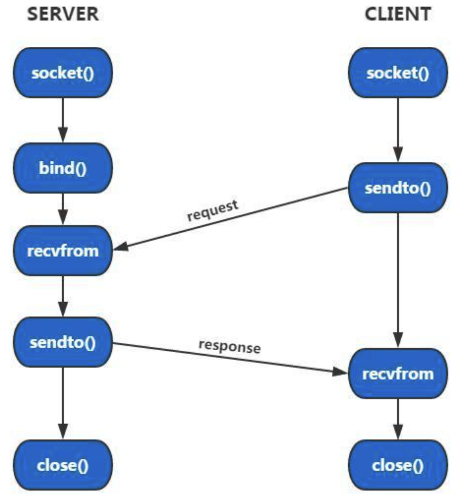

注

1. 在UDP通信过程中，接收数据的一方必须绑定一个固定的端口
2. 如果某一端不需要接收数据，这个绑定操作就可以省略不写了，通信的套接字会自动绑定一个随机端口

**接收端/服务器端**

1. 创建通信的套接字

```c
// 第二个参数是 SOCK_DGRAM, 第三个参数0表示使用报式协议中的udp
int fd = socket(AF_INET, SOCK_DGRAM, 0);
```

2. 使用通信的套接字和本地的IP和端口绑定，IP和端口需要转换为大端

```c
bind();
```

3. 通信

```c
// 接收数据
recvfrom();
// 发送数据
sendto();
```

4. 关闭套接字（文件描述符）

```c
close(fd);
```

**发送端/客户端**

1. 创建通信的套接字

```c
// 第二个参数是 SOCK_DGRAM, 第三个参数0表示使用报式协议中的udp
int fd = socket(AF_INET, SOCK_DGRAM, 0);
```

2. 通信

```c
// 接收数据
recvfrom();
// 发送数据
sendto();
```

3. 关闭套接字（文件描述符）

```c
close(fd);
```

## 通信函数

**recvfrom**

```c
/*
* 作用:
- 接收数据, 如果没有数据,该函数阻塞

* 参数:
- sockfd: 基于udp的通信的文件描述符
- buf: 指针指向的地址用来存储接收的数据
- len: buf指针指向的内存的容量, 最多能存储多少字节
- flags: 设置套接字属性，一般使用默认属性，指定为0即可
- src_addr: 发送数据的一端的地址信息，IP和端口都存储在这里边, 是大端存储的，如果这个参数中的信息对当前业务处理没有用处, 可以指定为NULL, 不保存这些信息
- addrlen: 传入的是src_addr参数指向的内存的大小, 传出的也是这块内存的大小，如果src_addr参数指定为NULL, 这个参数也指定为NULL即可

* 返回值：
- 大于0: 成功返回接收的字节数
- -1: 接收数据失败了
*/

ssize_t recvfrom(int sockfd, void *buf, size_t len, int flags,
                 struct sockaddr *src_addr, socklen_t *addrlen);
```

**sendto**

```c
/*
* 作用:
- 发送数据函数

* 参数:
- sockfd: 基于udp的通信的文件描述符
- buf: 这个指针指向的内存中存储了要发送的数据
- len: 要发送的数据的实际长度
- flags: 设置套接字属性，一般使用默认属性，指定为0即可
- dest_addr: 接收数据的一端对应的地址信息, 大端的IP和端口
- addrlen: 参数 dest_addr 指向的内存大小

* 返回值：
- 大于0: 实际发送的字节数
- -1: 发送数据失败了
*/

ssize_t sendto(int sockfd, const void *buf, size_t len, int flags,
               const struct sockaddr *dest_addr, socklen_t addrlen);
```

## 代码举例

> 接收端

```c
#include <stdio.h>
#include <stdlib.h>
#include <unistd.h>
#include <string.h>
#include <arpa/inet.h>

int main()
{
    // 1. 创建通信的套接字
    int fd = socket(AF_INET, SOCK_DGRAM, 0);
    if(fd == -1)
    {
        perror("socket");
        exit(0);
    }

    // 2. 通信的套接字和本地的IP与端口绑定
    struct sockaddr_in addr;
    addr.sin_family = AF_INET;
    addr.sin_port = htons(9999);    		// 大端
    addr.sin_addr.s_addr = INADDR_ANY;  	// 0.0.0.0
    int ret = bind(fd, (struct sockaddr*)&addr, sizeof(addr));	// 绑定固定IP和端口
    if(ret == -1)
    {
        perror("bind");
        exit(0);
    }

    char buf[1024];
    char ipbuf[64];
    struct sockaddr_in cliaddr;
    int len = sizeof(cliaddr);
    // 3. 通信
    while(1)
    {
        // 接收数据
        memset(buf, 0, sizeof(buf));
        int rlen = recvfrom(fd, buf, sizeof(buf), 0, (struct sockaddr*)&cliaddr, &len);
        printf("客户端的IP地址: %s, 端口: %d\n",
               inet_ntop(AF_INET, &cliaddr.sin_addr.s_addr, ipbuf, sizeof(ipbuf)),
               ntohs(cliaddr.sin_port));
        printf("客户端say: %s\n", buf);

        // 回复数据
        // 数据回复给了发送数据的客户端
        sendto(fd, buf, rlen, 0, (struct sockaddr*)&cliaddr, sizeof(cliaddr));
    }

    close(fd);

    return 0;
}
```

> 发送端

```c
#include <stdio.h>
#include <stdlib.h>
#include <unistd.h>
#include <string.h>
#include <arpa/inet.h>

int main()
{
    // 1. 创建通信的套接字
    int fd = socket(AF_INET, SOCK_DGRAM, 0);
    if(fd == -1)
    {
        perror("socket");
        exit(0);
    }
    
    // 初始化服务器地址信息
    struct sockaddr_in seraddr;
    seraddr.sin_family = AF_INET;
    seraddr.sin_port = htons(9999);    // 大端
    inet_pton(AF_INET, "192.168.1.100", &seraddr.sin_addr.s_addr);

    char buf[1024];
    char ipbuf[64];
    struct sockaddr_in cliaddr;
    int len = sizeof(cliaddr);
    int num = 0;
    // 2. 通信
    while(1)
    {
        sprintf(buf, "hello, udp %d....\n", num++);
        // 发送数据, 数据发送给了服务器
        sendto(fd, buf, strlen(buf)+1, 0, (struct sockaddr*)&seraddr, sizeof(seraddr));

        // 接收数据
        memset(buf, 0, sizeof(buf));
        recvfrom(fd, buf, sizeof(buf), 0, NULL, NULL);
        printf("服务器say: %s\n", buf);
        sleep(1);
    }

    close(fd);

    return 0;
}
```

注

1. 作为数据发送端，客户端不需要绑定固定端口，客户端使用的端口是随机绑定的


## 广播

### 介绍

广播的UDP的特性之一，通过广播可以向子网中多台计算机发送消息，并且子网中所有的计算机都可以接收到发送方发送的消息。每个广播消息都包含一个特殊的IP地址（主机标志部分的二进制全部为1 ）。 

广播分为两端，即数据发送端和数据接收端，通过广播的方式发送数据，发送端和接收端的关系是 1:N。

- 发送广播消息的一端，通过广播地址，可以将消息同时发送到局域网的多台主机上（数据接收端）
- 在发送广播消息的时候，必须要把数据发送到广播地址上
- 广播只能在局域网内使用，广域网是无法使用UDP进行广播的
- 只要发送端在发送广播消息，数据接收端就能收到广播消息，消息的接收是无法拒绝的，除非将接收端的进程关闭，就接收不到了

UDP的广播和日常生活中的广播是一样的，都是一种快速传播消息的方式，因此广播的开销很小。发送端使用一个广播地址，就可以将数据发送到多个接收数据的终端上，如果不使用广播，就需要进行多次发送才能将数据分别发送到不同的主机上。

**设置广播属性**

基于UDP虽然可以进行数据的广播，但是这个属性默认是关闭的，如果需要对数据进行广播，那么需要在广播端代码中开启广播属性，需要通过套接字选项函数进行设置。

```c
/*
* 作用:
- 这个函数是一个多功能函数, 可以设置套接字选项

* 参数:
- sockfd：进行UDP通信的文件描述符
- level: 套接字级别，需要设置为 SOL_SOCKET
- optname：选项名，此处要设置udp的广播属性，该参数需要指定为：SO_BROADCAST
- optval：如果是设置广播属性，该指针实际指向一块int类型的内存
	- 该整型值为0：关闭广播属性
	- 该整形值为1：打开广播属性
- optlen：optval指针指向的内存大小，即：sizeof(int)

* 返回值：
- 成功: 0
- 失败: -1
*/

int setsockopt(int sockfd, int level, int optname, const void *optval, socklen_t optlen);
```

### 通信流程

如果使用UDP在局域网范围内进行消息的广播，一般情况下广播端只发送数据，接收端只接受广播消息。因此在数据接收端需要绑定固定的端口，广播端则不需要手动绑定固定端口，自动随机绑定即可。

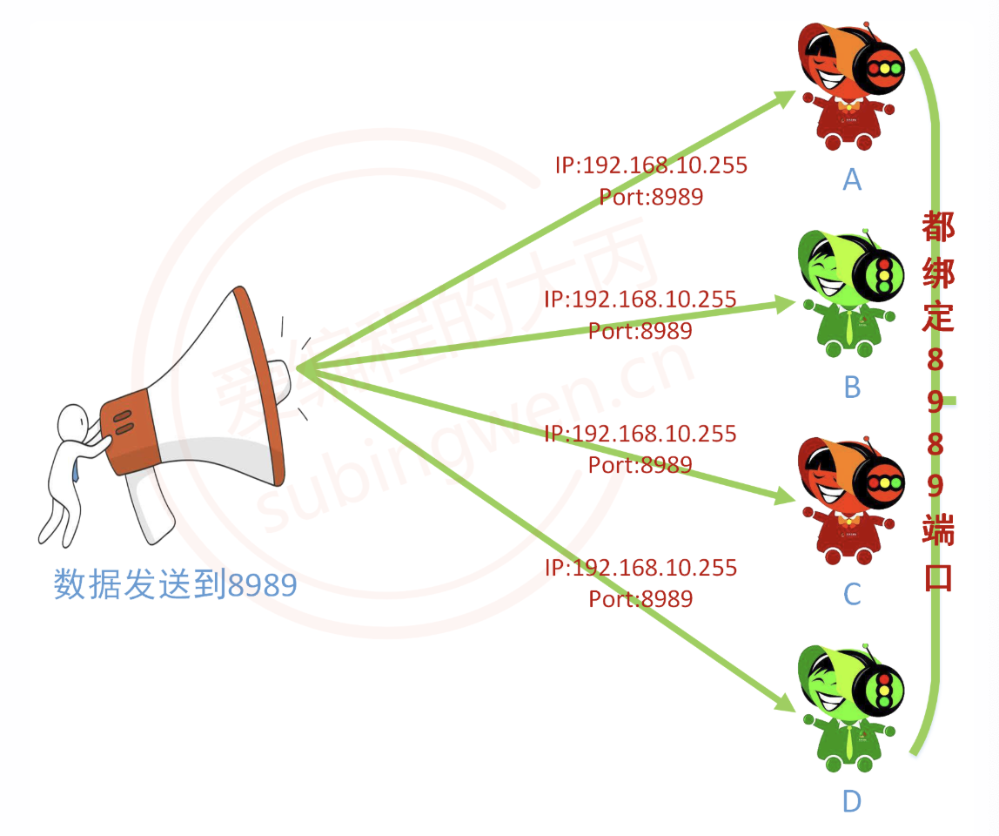

**发送端**

> 1. 创建通信的套接字
> 2. 主动发送数据不需要手动绑定固定端口（自动随机分配就可以了），因此直接设置广播属性
> 3. 使用广播地址发送广播数据到接收端绑定的固定端口上
> 4. 关闭套接字（文件描述符）

**接收端**

> 1. 创建通信的套接字
> 2. 因为是被动接收数据的一端，所以必须要绑定固定的端口和本地IP地址
> 3. 接收广播消息
> 4. 关闭套接字（文件描述符）

### 代码举例

> 广播端/发送端

```c
#include <stdio.h>
#include <stdlib.h>
#include <unistd.h>
#include <string.h>
#include <arpa/inet.h>

int main()
{
    // 1. 创建通信的套接字
    int fd = socket(AF_INET, SOCK_DGRAM, 0);
    if(fd == -1)
    {
        perror("socket");
        exit(0);
    }

    // 2. 设置广播属性
    int opt  = 1;
    setsockopt(fd, SOL_SOCKET, SO_BROADCAST, &opt, sizeof(opt));

    char buf[1024];
    struct sockaddr_in cliaddr;
    int len = sizeof(cliaddr);
    cliaddr.sin_family = AF_INET;
    cliaddr.sin_port = htons(9999); 	// 接收端需要绑定9999端口
    // 只要主机在237网段, 并且绑定了9999端口, 这个接收端就能收到广播消息
    inet_pton(AF_INET, "192.168.237.255", &cliaddr.sin_addr.s_addr);
    // 3. 通信
    int num = 0;
    while(1)
    {
        sprintf(buf, "hello, client...%d\n", num++);
        // 数据广播
        sendto(fd, buf, strlen(buf)+1, 0, (struct sockaddr*)&cliaddr, len);
        printf("发送的广播的数据: %s\n", buf);
        sleep(1);
    }

    close(fd);

    return 0;
}
```

> 接收端

```c
#include <stdio.h>
#include <stdlib.h>
#include <unistd.h>
#include <string.h>
#include <arpa/inet.h>

int main()
{
    // 1. 创建通信的套接字
    int fd = socket(AF_INET, SOCK_DGRAM, 0);
    if(fd == -1)
    {
        perror("socket");
        exit(0);
    }

    // 2. 通信的套接字和本地的IP与端口绑定
    struct sockaddr_in addr;
    addr.sin_family = AF_INET;
    addr.sin_port = htons(9999);    		// 大端
    addr.sin_addr.s_addr = INADDR_ANY;  	// 0.0.0.0
    int ret = bind(fd, (struct sockaddr*)&addr, sizeof(addr));	// 绑定
    if(ret == -1)
    {
        perror("bind");
        exit(0);
    }

    char buf[1024];
    // 3. 通信
    while(1)
    {
        // 接收广播消息
        memset(buf, 0, sizeof(buf));
        // 阻塞等待数据达到
        recvfrom(fd, buf, sizeof(buf), 0, NULL, NULL);
        printf("接收到的广播消息: %s\n", buf);
    }

    close(fd);

    return 0;
}
```

## 组播/多播

### 介绍

组播/多播也是UDP的特性之一，组播是主机间一对多的通讯模式，是一种允许一个或多个组播源发送同一报文到多个接收者的技术。组播源将一份报文发送到特定的组播地址，组播地址不同于单播地址，它并不属于特定某个主机，而是属于一组主机。一个组播地址表示一个群组，需要接收组播报文的接收者都加入这个群组。

- 广播只能在局域网访问内使用，组播既可以在局域网中使用，也可以用于广域网
- 在发送广播消息的时候，连接到局域网的客户端不管想不想都会接收到广播数据，组播可以控制发送端的消息能够被哪些接收端接收，更灵活和人性化
- 广播使用的是广播地址，组播需要使用组播地址
- 广播和组播属性默认都是关闭的，如果使用需要通过setsockopt()函数进行设置

**设置组播属性**

如果使用组播进行数据的传输，不管是消息发送端还是接收端，都需要进行相关的属性设置。

> 发送端

```c
/*
* 作用:
- 这个函数是一个多功能函数, 可以设置套接字选项

* 参数:
- sockfd：进行UDP通信的文件描述符
- level：套接字级别，设置组播属性需要将该参数指定为：IPPTOTO_IP
- optname: 套接字选项名，设置组播属性需要将该参数指定为：IP_MULTICAST_IF
- optval：设置组播属性，这个指针需要指向一个struct in_addr{} 类型的结构体地址，这个结构体地址用于存储组播地址，并且组播IP地址的存储方式是大端的
- optlen：optval指针指向的内存大小，即：sizeof(struct in_addr)

* 返回值：
- 成功: 0
- 失败: -1
*/

int setsockopt(int sockfd, int level, int optname, const void *optval, socklen_t optlen);
```

in_addr结构体。

```c
struct in_addr
{
    in_addr_t s_addr;	// unsigned int
}; 
```

> 接收端

因为一个组播地址表示一个群组，所以需要接收组播报文的接收者都加入这个群组。

```c
/*
* 作用:
- 这个函数是一个多功能函数, 可以设置套接字选项

* 参数:
- sockfd：基于udp的通信的套接字
- level：套接字级别，加入到多播组该参数需要指定为：IPPTOTO_IP
- optname：套接字选项名，加入到多播组该参数需要指定为：IP_ADD_MEMBERSHIP
- optval：加入到多播组，这个指针应该指向一个struct ip_mreqn{}类型的结构体地址
- optlen：optval指向的内存大小，即：sizeof(struct ip_mreqn)

* 返回值：
- 成功: 0
- 失败: -1
*/

int setsockopt(int sockfd, int level, int optname, const void *optval, socklen_t optlen);
```

ip_mreqn结构体。

```c
typedef unsigned int  uint32_t;
typedef uint32_t in_addr_t;
struct sockaddr_in addr;

struct in_addr
{
    in_addr_t s_addr;	// unsigned int
};

struct ip_mreqn
{
    struct in_addr imr_multiaddr;   // 组播地址
    struct in_addr imr_address;     // 本地地址
    int   imr_ifindex;              // 网卡的编号, 每个网卡都有一个编号
};
// 必须通过网卡名字才能得到网卡的编号: 可以通过 ifconfig 命令查看网卡名字
#include <net/if.h>
// 将网卡名转换为网卡的编号, 参数是网卡的名字, 比如: "ens33"
// 返回值就是网卡的编号
unsigned int if_nametoindex(const char *ifname);
```

### 通信流程

发送组播消息的一端需要将数据发送到组播地址和固定的端口上，想要接收组播消息的终端需要绑定对应的固定端口然后加入到组播的群组，最终就可以实现数据的共享。

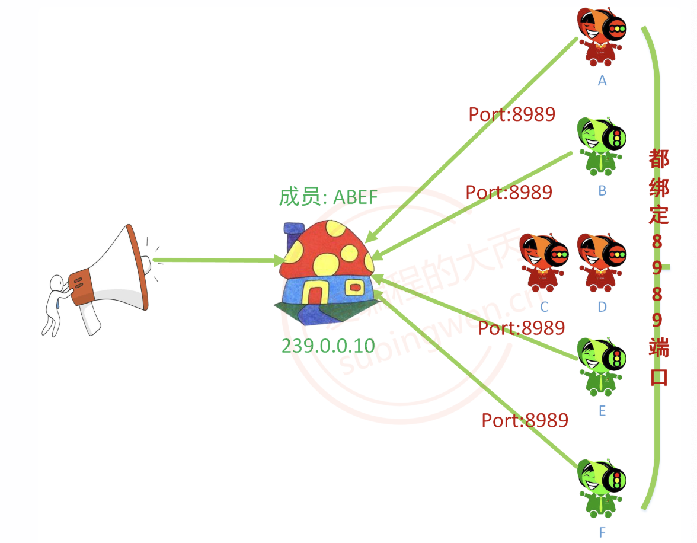

**发送端**

> 1. 创建通信的套接字
> 2. 主动发送数据的一端不需要手动绑定端口（自动随机分配就可以了），设置UDP组播属性
> 3. 使用组播地址发送组播消息到固定的端口（接收端需要绑定这个端口）
> 4. 关闭套接字（文件描述符）

**接收端**

> 1. 创建通信的套接字
> 2. 绑定固定的端口，发送端应该将数据发送到接收端绑定的端口上
> 3. 加入到组播的群组中，入群之后就可以接受组播消息了
> 4. 接收组播数据
> 5. 关闭套接字（文件描述符）

### 代码举例

> 发送端

```c
#include <stdio.h>
#include <stdlib.h>
#include <unistd.h>
#include <string.h>
#include <arpa/inet.h>

int main()
{
    // 1. 创建通信的套接字
    int fd = socket(AF_INET, SOCK_DGRAM, 0);
    if(fd == -1)
    {
        perror("socket");
        exit(0);
    }

    // 2. 设置组播属性
    struct in_addr opt;
    // 将组播地址初始化到这个结构体成员中即可
    inet_pton(AF_INET, "239.0.1.10", &opt.s_addr);
    setsockopt(fd, IPPROTO_IP, IP_MULTICAST_IF, &opt, sizeof(opt));

    char buf[1024];
    struct sockaddr_in cliaddr;
    int len = sizeof(cliaddr);
    cliaddr.sin_family = AF_INET;
    cliaddr.sin_port = htons(9999); // 接收端需要绑定9999端口
    // 发送组播消息, 需要使用组播地址, 和设置组播属性使用的组播地址一致就可以
    inet_pton(AF_INET, "239.0.1.10", &cliaddr.sin_addr.s_addr);
    // 3. 通信
    int num = 0;
    while(1)
    {
        sprintf(buf, "hello, client...%d\n", num++);
        // 数据广播
        sendto(fd, buf, strlen(buf)+1, 0, (struct sockaddr*)&cliaddr, len);
        printf("发送的组播的数据: %s\n", buf);
        sleep(1);
    }

    close(fd);

    return 0;
}
```

> 接收端

```c
#include <stdio.h>
#include <stdlib.h>
#include <unistd.h>
#include <string.h>
#include <arpa/inet.h>
#include <net/if.h>

int main()
{
    // 1. 创建通信的套接字
    int fd = socket(AF_INET, SOCK_DGRAM, 0);
    if(fd == -1)
    {
        perror("socket");
        exit(0);
    }

    // 2. 通信的套接字和本地的IP与端口绑定
    struct sockaddr_in addr;
    addr.sin_family = AF_INET;
    addr.sin_port = htons(9999);    // 大端
    addr.sin_addr.s_addr = INADDR_ANY;  // 0.0.0.0
    int ret = bind(fd, (struct sockaddr*)&addr, sizeof(addr));
    if(ret == -1)
    {
        perror("bind");
        exit(0);
    }

    // 3. 加入到多播组
    struct ip_mreqn opt;
    // 要加入到哪个多播组, 通过组播地址来区分
    inet_pton(AF_INET, "239.0.1.10", &opt.imr_multiaddr.s_addr);
    opt.imr_address.s_addr = INADDR_ANY;
    opt.imr_ifindex = if_nametoindex("ens33");
    setsockopt(fd, IPPROTO_IP, IP_ADD_MEMBERSHIP, &opt, sizeof(opt));

    char buf[1024];
    // 3. 通信
    while(1)
    {
        // 接收广播消息
        memset(buf, 0, sizeof(buf));
        // 阻塞等待数据达到
        recvfrom(fd, buf, sizeof(buf), 0, NULL, NULL);
        printf("接收到的组播消息: %s\n", buf);
    }

    close(fd);

    return 0;
}
```

# I/O 模型

## 介绍

I/O模型描述的是程序如何与操作系统协作，完成数据从内核到用户空间的读取过程（或反之写入）。

**涉及两个阶段**

- 数据准备（内核等待数据到达）
- 数据拷贝（内核 → 用户空间）

对于一个套接字上的输入操作，第一步通常涉及等待数据从网络中到达。当所等待数据到达时，它被复制到内核中的某个缓冲区。第二步就是把数据从内核缓冲区复制到应用进程缓冲区。

## 五种 I/O 模型

- 阻塞式 I/O
- 非阻塞式 I/O
- I/O 复用
- 信号驱动式 I/O
- 异步 I/O

### 阻塞式 I/O

调用后一直卡住，直到数据准备好并拷贝完成。

```tex
read() → 阻塞等待 → 数据准备好 → 拷贝 → 返回
```

**特点**

- 线程完全阻塞
- 实现简单
- 并发能力差

**适用场景**

- 简单程序
- 低并发系统


### 非阻塞式 I/O

不断询问“数据好了没。

```tex
read() → 立刻返回（没数据） → 再次read → … → 数据就绪 → 拷贝
```

**特点**

- 不阻塞
- 需要不断轮询（CPU开销大）

**问题**

- 忙轮询（busy loop），浪费CPU


### I/O 复用

一个线程同时监听多个连接，本质是用一个线程管理多个IO。

如果一个 Web 服务器没有 I/O 复用，那么每一个 Socket 连接都需要创建一个线程去处理。如果同时有几万个连接，那么就需要创建相同数量的线程。相比于多进程和多线程技术，I/O 复用不需要进程线程创建和切换的开销，系统开销更小。

```
select/epoll → 等待事件 → 某个socket就绪 → read()
```

**特点**

- 线程阻塞在等待事件，而不是具体IO
- 支持高并发
- 是现代网络服务器核心模型

**典型接口**

- select
- poll
- epoll

**适用场景**

- Web服务器
- 高并发网络程序（如 Nginx）


### 信号驱动 I/O

内核通过信号通知数据到了。

```tex
注册信号 → 数据就绪 → 内核发信号 → 处理函数中read()
```

**特点**

- 不需要轮询
- 编程复杂
- 实际用得较少


### 异步 I/O

真正的全程不管，完成后通知。

```tex
发起aio_read → 立即返回 → 内核完成所有操作 → 通知用户
```

**特点**

- 用户线程完全不阻塞
- 数据准备 + 拷贝都由内核完成


## I/O 模型比较

- 同步 I/O：将数据从内核缓冲区复制到应用进程缓冲区的阶段（第二阶段），应用进程会阻塞
- 异步 I/O：第二阶段应用进程不会阻塞

|    模型    |   是否阻塞   | 是否需要轮询 |  是否通知机制  | 并发能力 |
| :--------: | :----------: | :----------: | :------------: | :------: |
|   阻塞IO   |      是      |      否      |       否       |    低    |
|  非阻塞IO  |      否      |      是      |       否       |    低    |
|  多路复用  | 是（select） |      否      | 是（就绪通知） |    高    |
| 信号驱动IO |      否      |      否      |   是（信号）   |    中    |
|   异步IO   |      否      |      否      | 是（完成通知） |   很高   |


# 多路复用

IO多路复用(转接)，它是一种网络通信的手段（机制），通过这种方式可以同时监测多个文件描述符并且这个过程是阻塞的，一旦检测到有文件描述符就绪，程序的阻塞就会被解除，之后就可以基于这些（一个或多个）就绪的文件描述符进行通信了。

通过这种方式在单线程/进程的场景下也可以在服务器端实现并发。常见的IO多路转接方式有`select`、`poll`、`epoll`。

## select

### 介绍

select函数是跨平台的，Linux、Mac、Windows都是支持的。通过调用这个函数可以委托内核帮助我们检测若干个文件描述符的状态，即检测这些文件描述符对应的读写缓冲区的状态

- 读缓冲区：检测里边有没有数据，如果有数据该缓冲区对应的文件描述符就绪
- 写缓冲区：检测写缓冲区有没有容量写，如果有容量可以写，缓冲区对应的文件描述符就绪
- 读写异常：检测读写缓冲区是否有异常，如果有则该缓冲区对应的文件描述符就绪

委托检测的文件描述符被遍历检测完毕之后，已就绪的这些满足条件的文件描述符会通过`select()`的参数分3个集合传出，得到这几个集合之后就可以分情况依次处理了。

**select**

```c
#include <sys/select.h>
struct timeval {
    time_t      tv_sec;         /* seconds */
    suseconds_t tv_usec;        /* microseconds */
};

/*
* 参数:
- nfds：委托内核检测的这三个集合中最大的文件描述符+1
	- 内核需要线性遍历这些集合中的文件描述符，这个值是循环结束的条件，在Window中这个参数是无效的，指定为-1即可
- readfds：传入传出参数，文件描述符的集合, 内核只检测这个集合中文件描述符对应的读缓冲区
- writefds：传入传出参数，文件描述符的集合, 内核只检测这个集合中文件描述符对应的写缓冲区
	- 如果不需要使用这个参数可以指定为NULL
- exceptfds：传入传出参数，文件描述符的集合, 内核检测集合中文件描述符是否有异常状态
- timeout：超时时长，用来强制解除select()函数的阻塞的
	- NULL：函数检测不到就绪的文件描述符会一直阻塞
	- 等待固定时长（秒）：函数检测不到就绪的文件描述符，在指定时长之后强制解除阻塞，函数返回0

* 返回值：
- 大于0：成功，返回集合中已就绪的文件描述符的总个数
= 等于-1：函数调用失败
- 等于0：超时，没有检测到就绪的文件描述符
*/
int select(int nfds, fd_set *readfds, fd_set *writefds,
           fd_set *exceptfds, struct timeval * timeout);
```

**fd_set相关函数**

```c
// 将文件描述符fd从set集合中删除 == 将fd对应的标志位设置为0        
void FD_CLR(int fd, fd_set *set);
// 判断文件描述符fd是否在set集合中 == 读一下fd对应的标志位到底是0还是1
int  FD_ISSET(int fd, fd_set *set);
// 将文件描述符fd添加到set集合中 == 将fd对应的标志位设置为1
void FD_SET(int fd, fd_set *set);
// 将set集合中, 所有文件文件描述符对应的标志位设置为0, 集合中没有添加任何文件描述符
void FD_ZERO(fd_set *set);
```

**局限性**

- 待检测集合（第2、3、4个参数）需要频繁的在用户区和内核区之间进行数据的拷贝，效率低
- 内核对于select传递进来的待检测集合的检测方式是线性的
  - 如果集合内待检测的文件描述符很多，检测效率会比较低
  - 如果集合内待检测的文件描述符相对较少，检测效率会比较高
- 使用select能够检测的最大文件描述符个数有上限，默认是1024，这是在内核中被写死了的

### 原理

在select()函数中第2、3、4个参数都是fd_set类型，它表示一个文件描述符的集合，类似于信号集 sigset_t，这个类型的数据有128个字节，也就是1024个标志位，和内核中文件描述符表中的文件描述符个数是一样的。

```c
sizeof(fd_set) = 128 字节 * 8 = 1024 bit      // int [32]
```

这块内存中的每一个bit 和 文件描述符表中的每一个文件描述符是一一对应的关系，这样就可以使用最小的存储空间将要表达的意思描述出来了。

下图中的fd_set中存储了要委托内核检测读缓冲区的文件描述符集合。

- 如果集合中的标志位为0代表不检测这个文件描述符状态
- 如果集合中的标志位为1代表检测这个文件描述符状态

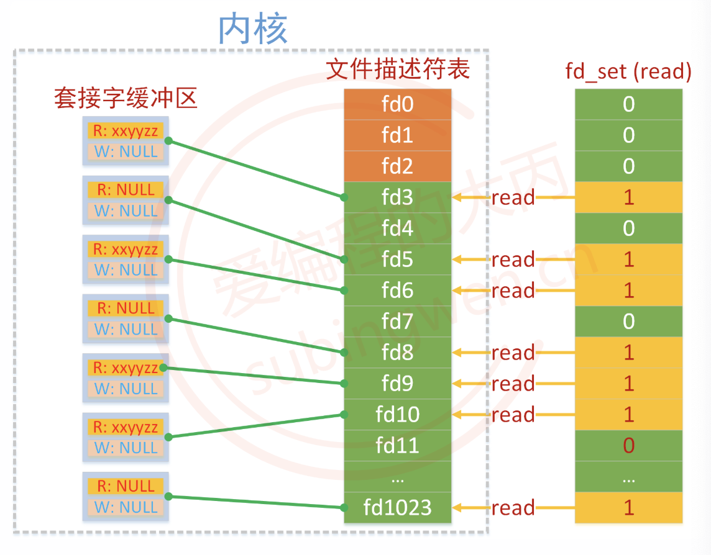

内核在遍历这个读集合的过程中，如果被检测的文件描述符对应的读缓冲区中没有数据，内核将修改这个文件描述符在读集合fd_set中对应的标志位改为0，如果有数据那么这个标志位的值不变，还是1。

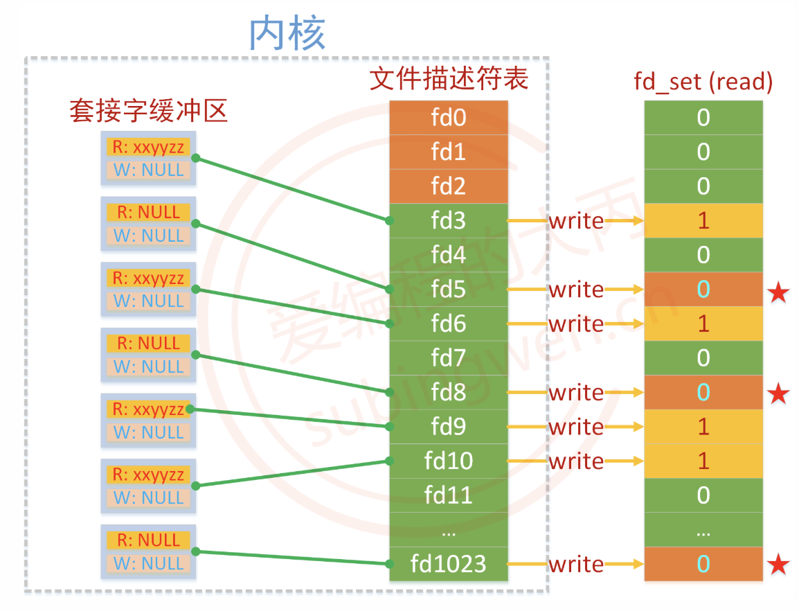

当select()函数解除阻塞之后，被内核修改过的读集合通过参数传出，此时集合中只要标志位的值为1，那么它对应的文件描述符肯定是就绪的，我们就可以基于这个文件描述符和客户端建立新连接或者通信了。

### 并发处理

**处理流程**

在服务器基于select实现并发，其处理流程如下

1. 创建监听的套接字 lfd = socket();
2. 将监听的套接字和本地的IP和端口绑定 bind()
3. 给监听的套接字设置监听 listen()
4. 创建一个文件描述符集合 fd_set，用于存储需要检测读事件的所有的文件描述符
	- 通过 FD_ZERO() 初始化
	- 通过 FD_SET() 将监听的文件描述符放入检测的读集合中
5. 循环调用select()，周期性的对所有的文件描述符进行检测
6. select() 解除阻塞返回，得到内核传出的满足条件的就绪的文件描述符集合
	- 通过FD_ISSET() 判断集合中的标志位是否为 1
	- 如果这个文件描述符是监听的文件描述符，调用 accept() 和客户端建立连接
		- 将得到的新的通信的文件描述符，通过FD_SET() 放入到检测集合中
	- 如果这个文件描述符是通信的文件描述符，调用通信函数和客户端通信
		- 如果客户端和服务器断开了连接，使用FD_CLR()将这个文件描述符从检测集合中删除
		- 如果没有断开连接，正常通信即可
7. 重复第6步

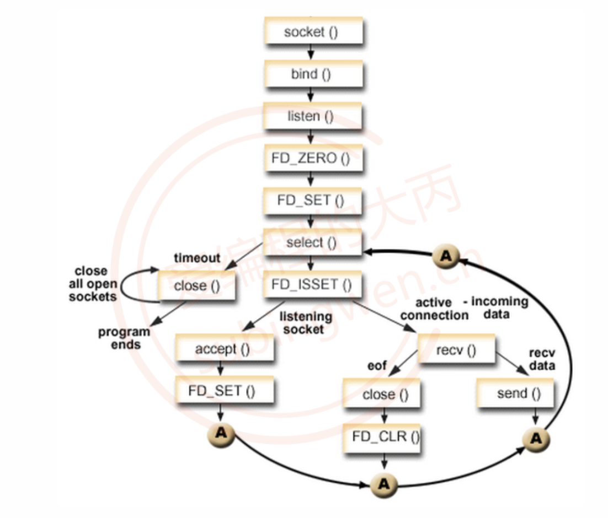

### 代码实例

**服务器端**

```c
#include <stdio.h>
#include <stdlib.h>
#include <unistd.h>
#include <string.h>
#include <arpa/inet.h>

int main()
{
    // 1. 创建监听的fd
    int lfd = socket(AF_INET, SOCK_STREAM, 0);

    // 2. 绑定
    struct sockaddr_in addr;
    addr.sin_family = AF_INET;
    addr.sin_port = htons(9999);
    addr.sin_addr.s_addr = INADDR_ANY;
    bind(lfd, (struct sockaddr*)&addr, sizeof(addr));

    // 3. 设置监听
    listen(lfd, 128);

    // 将监听的fd的状态检测委托给内核检测
    int maxfd = lfd;
    // 初始化检测的读集合
    fd_set rdset;
    fd_set rdtemp;
    // 清零
    FD_ZERO(&rdset);
    // 将监听的lfd设置到检测的读集合中
    FD_SET(lfd, &rdset);
    // 通过select委托内核检测读集合中的文件描述符状态, 检测read缓冲区有没有数据
    // 如果有数据, select解除阻塞返回
    // 应该让内核持续检测
    while(1)
    {
        // 默认阻塞
        // rdset 中是委托内核检测的所有的文件描述符
        rdtemp = rdset;
        int num = select(maxfd+1, &rdtemp, NULL, NULL, NULL);
        // rdset中的数据被内核改写了, 只保留了发生变化的文件描述的标志位上的1, 没变化的改为0
        // 只要rdset中的fd对应的标志位为1 -> 缓冲区有数据了
        // 判断
        // 有没有新连接
        if(FD_ISSET(lfd, &rdtemp))
        {
            // 接受连接请求, 这个调用不阻塞
            struct sockaddr_in cliaddr;
            int cliLen = sizeof(cliaddr);
            int cfd = accept(lfd, (struct sockaddr*)&cliaddr, &cliLen);

            // 得到了有效的文件描述符
            // 通信的文件描述符添加到读集合
            // 在下一轮select检测的时候, 就能得到缓冲区的状态
            FD_SET(cfd, &rdset);
            // 重置最大的文件描述符
            maxfd = cfd > maxfd ? cfd : maxfd;
        }

        // 没有新连接, 通信
        for(int i=0; i<maxfd+1; ++i)
        {
			// 判断从监听的文件描述符之后到maxfd这个范围内的文件描述符是否读缓冲区有数据
            if(i != lfd && FD_ISSET(i, &rdtemp))
            {
                // 接收数据
                char buf[10] = {0};
                // 一次只能接收10个字节, 客户端一次发送100个字节
                // 一次是接收不完的, 文件描述符对应的读缓冲区中还有数据
                // 下一轮select检测的时候, 内核还会标记这个文件描述符缓冲区有数据 -> 再读一次
                // 	循环会一直持续, 知道缓冲区数据被读完位置
                int len = read(i, buf, sizeof(buf));
                if(len == 0)
                {
                    printf("客户端关闭了连接...\n");
                    // 将检测的文件描述符从读集合中删除
                    FD_CLR(i, &rdset);
                    close(i);
                }
                else if(len > 0)
                {
                    // 收到了数据
                    // 发送数据
                    write(i, buf, strlen(buf)+1);
                }
                else
                {
                    // 异常
                    perror("read");
                }
            }
        }
    }

    return 0;
}
```

**客户端**

```c
#include <stdio.h>
#include <stdlib.h>
#include <unistd.h>
#include <string.h>
#include <arpa/inet.h>

int main()
{
    // 1. 创建用于通信的套接字
    int fd = socket(AF_INET, SOCK_STREAM, 0);
    if(fd == -1)
    {
        perror("socket");
        exit(0);
    }

    // 2. 连接服务器
    struct sockaddr_in addr;
    addr.sin_family = AF_INET;     // ipv4
    addr.sin_port = htons(9999);   // 服务器监听的端口, 字节序应该是网络字节序
    inet_pton(AF_INET, "127.0.0.1", &addr.sin_addr.s_addr);
    int ret = connect(fd, (struct sockaddr*)&addr, sizeof(addr));
    if(ret == -1)
    {
        perror("connect");
        exit(0);
    }

    // 通信
    while(1)
    {
        // 读数据
        char recvBuf[1024];
        // 写数据
        // sprintf(recvBuf, "data: %d\n", i++);
        fgets(recvBuf, sizeof(recvBuf), stdin);
        write(fd, recvBuf, strlen(recvBuf)+1);
        // 如果客户端没有发送数据, 默认阻塞
        read(fd, recvBuf, sizeof(recvBuf));
        printf("recv buf: %s\n", recvBuf);
        sleep(1);
    }

    // 释放资源
    close(fd); 

    return 0;
}
```

## poll

### 介绍

poll的机制与select类似

- 内核对应文件描述符的检测也是以线性的方式进行轮询，根据描述符的状态进行处理
- poll和select检测的文件描述符集合会在检测过程中频繁的进行用户区和内核区的拷贝，它的开销随着文件描述符数量的增加而线性增大，从而效率也会越来越低
- select检测的文件描述符个数上限是1024，poll没有最大文件描述符数量的限制
- select可以跨平台使用，poll只能在Linux平台使用

**poll**

```c
#include <poll.h>
// 每个委托poll检测的fd都对应这样一个结构体
struct pollfd {
    int   fd;         /* 委托内核检测的文件描述符 */
    short events;     /* 委托内核检测文件描述符的什么事件 */
    short revents;    /* 文件描述符实际发生的事件 -> 传出 */
};


/*
* 参数:
- fds: 这是一个struct pollfd类型的数组, 里边存储了待检测的文件描述符的信息，这个数组中有三个成员
	- fd：委托内核检测的文件描述符
	- events：委托内核检测的fd事件（输入、输出、错误），每一个事件有多个取值
	- revents：这是一个传出参数，数据由内核写入，存储内核检测之后的结果
- nfds: 这是第一个参数数组中最后一个有效元素的下标 + 1（也可以指定参数1数组的元素总个数）
- timeout: 指定poll函数的阻塞时长
	- -1：一直阻塞，直到检测的集合中有就绪的文件描述符（有事件产生）解除阻塞
	- 0：不阻塞，不管检测集合中有没有已就绪的文件描述符，函数马上返回
	- 大于0：阻塞指定的毫秒（ms）数之后，解除阻塞

* 返回值：
- 大于0：成功，表示检测的集合中已就绪的文件描述符的总个数
- 等于-1：函数调用失败
*/
int poll(struct pollfd *fds, nfds_t nfds, int timeout);
```

### 代码实现

**服务器端**

```c
#include <stdio.h>
#include <stdlib.h>
#include <unistd.h>
#include <string.h>
#include <arpa/inet.h>
#include <sys/select.h>
#include <poll.h>

int main()
{
    // 1.创建套接字
    int lfd = socket(AF_INET, SOCK_STREAM, 0);
    if(lfd == -1)
    {
        perror("socket");
        exit(0);
    }
    // 2. 绑定 ip, port
    struct sockaddr_in addr;
    addr.sin_port = htons(9999);
    addr.sin_family = AF_INET;
    addr.sin_addr.s_addr = INADDR_ANY;
    int ret = bind(lfd, (struct sockaddr*)&addr, sizeof(addr));
    if(ret == -1)
    {
        perror("bind");
        exit(0);
    }
    // 3. 监听
    ret = listen(lfd, 100);
    if(ret == -1)
    {
        perror("listen");
        exit(0);
    }
    
    // 4. 等待连接 -> 循环
    // 检测 -> 读缓冲区, 委托内核去处理
    // 数据初始化, 创建自定义的文件描述符集
    struct pollfd fds[1024];
    // 初始化
    for(int i=0; i<1024; ++i)
    {
        fds[i].fd = -1;
        fds[i].events = POLLIN;
    }
    fds[0].fd = lfd;

    int maxfd = 0;
    while(1)
    {
        // 委托内核检测
        ret = poll(fds, maxfd+1, -1);
        if(ret == -1)
        {
            perror("select");
            exit(0);
        }

        // 检测的度缓冲区有变化
        // 有新连接
        if(fds[0].revents & POLLIN)
        {
            // 接收连接请求
            struct sockaddr_in sockcli;
            int len = sizeof(sockcli);
            // 这个accept是不会阻塞的
            int connfd = accept(lfd, (struct sockaddr*)&sockcli, &len);
            // 委托内核检测connfd的读缓冲区
            int i;
            for(i=0; i<1024; ++i)
            {
                if(fds[i].fd == -1)
                {
                    fds[i].fd = connfd;
                    break;
                }
            }
            maxfd = i > maxfd ? i : maxfd;
        }
        // 通信, 有客户端发送数据过来
        for(int i=1; i<=maxfd; ++i)
        {
            // 如果在集合中, 说明读缓冲区有数据
            if(fds[i].revents & POLLIN)
            {
                char buf[128];
                int ret = read(fds[i].fd, buf, sizeof(buf));
                if(ret == -1)
                {
                    perror("read");
                    exit(0);
                }
                else if(ret == 0)
                {
                    printf("对方已经关闭了连接...\n");
                    close(fds[i].fd);
                    fds[i].fd = -1;
                }
                else
                {
                    printf("客户端say: %s\n", buf);
                    write(fds[i].fd, buf, strlen(buf)+1);
                }
            }
        }
    }
    close(lfd);
    return 0;
}
```

## epoll

### 介绍

epoll 全称 eventpoll，epoll是select和poll的升级版，更加高效。

- 对于待检测集合select和poll是基于线性方式处理的，epoll是基于红黑树来管理待检测集合的
- select和poll每次都会线性扫描整个待检测集合，集合越大速度越慢，epoll使用的是回调机制，效率高，处理效率也不会随着检测集合的变大而下降
- select和poll工作过程中存在内核/用户空间数据的频繁拷贝问题，epollepoll 通过 epoll_ctl 预先将文件描述符注册到内核，内核维护就绪队列，epoll_wait 时无需重复传递整个 fd 集合，省去了不必要的内存拷贝
- 需要对select和poll返回的集合进行判断才能知道哪些文件描述符是就绪的，通过epoll可以直接得到已就绪的文件描述符集合，无需再次检测
- 使用epoll没有最大文件描述符的限制，仅受系统中进程能打开的最大文件数目限制

当多路复用的文件数量庞大、IO流量频繁的时候，一般不太适合使用select()和poll()，这种情况下select()和poll()表现较差，推荐使用epoll()。

**epoll相关函数**

```c
#include <sys/epoll.h>
// 创建epoll实例，通过一棵红黑树管理待检测集合
int epoll_create(int size);
// 管理红黑树上的文件描述符(添加、修改、删除)
int epoll_ctl(int epfd, int op, int fd, struct epoll_event *event);
// 检测epoll树中是否有就绪的文件描述符
int epoll_wait(int epfd, struct epoll_event * events, int maxevents, int timeout);
```

**epoll_create()**

```c
/*
* 参数:
- size：在Linux内核2.6.8版本以后，这个参数是被忽略的，只需要指定一个大于0的数值就可以了

* 返回值：
- 大于0：返回一个有效的文件描述符，通过这个文件描述符就可以访问创建的epoll实例了
- 等于-1：函数调用失败
*/
int epoll_create(int size);
```

**epoll_ctl()**

```c
// 联合体, 多个变量共用同一块内存        
typedef union epoll_data {
 	void        *ptr;
	int          fd;	// 通常情况下使用这个成员, 和epoll_ctl的第三个参数相同即可
	uint32_t     u32;
	uint64_t     u64;
} epoll_data_t;

struct epoll_event {
	uint32_t     events;      /* Epoll events */
	epoll_data_t data;        /* User data variable */
};

/*
* 参数:
- epfd：epoll_create() 函数的返回值，通过这个参数找到epoll实例
- op：这是一个枚举值，控制通过该函数执行什么操作
	- EPOLL_CTL_ADD：往epoll模型中添加新的节点
	- EPOLL_CTL_MOD：修改epoll模型中已经存在的节点
	- EPOLL_CTL_DEL：删除epoll模型中的指定的节点
- fd：文件描述符，即要添加/修改/删除的文件描述符
- event：epoll事件，用来修饰第三个参数对应的文件描述符的，指定检测这个文件描述符的什么事件
	- events：委托epoll检测的事件
		- EPOLLIN：读事件, 接收数据, 检测读缓冲区，如果有数据该文件描述符就绪
		- EPOLLOUT：写事件, 发送数据, 检测写缓冲区，如果可写该文件描述符就绪
		- EPOLLERR：异常事件
	- data：用户数据变量，这是一个联合体类型，通常情况下使用里边的fd成员，用于存储待检测的文件描述符的值，在调用epoll_wait()函数的时候这个值会被传出

* 返回值：
- 失败：返回-1
- 成功：返回0
*/
int epoll_ctl(int epfd, int op, int fd, struct epoll_event *event);
```

**epoll_wait()**

```c
/*
* 参数:
- epfd：epoll_create() 函数的返回值, 通过这个参数找到epoll实例
- events：传出参数, 这是一个结构体数组的地址, 里边存储了已就绪的文件描述符的信息
- maxevents：修饰第二个参数, 结构体数组的容量（元素个数）
- timeout：如果检测的epoll实例中没有已就绪的文件描述符，该函数阻塞的时长, 单位ms 毫秒
	- 0：函数不阻塞，不管epoll实例中有没有就绪的文件描述符，函数被调用后都直接返回
	- 大于0：如果epoll实例中没有已就绪的文件描述符，函数阻塞对应的毫秒数再返回
	- -1：函数一直阻塞，直到epoll实例中有已就绪的文件描述符之后才解除阻塞

* 返回值：
- 成功：
	- 等于0：函数是阻塞被强制解除了, 没有检测到满足条件的文件描述符
	- 大于0：检测到的已就绪的文件描述符的总个数
- 失败：返回-1
*/
int epoll_wait(int epfd, struct epoll_event * events, int maxevents, int timeout);
```

### 原理

select/poll低效的原因之一是将“添加/维护待检测任务”和“阻塞进程/线程”两个步骤合二为一。每次调用select都需要这两步操作，然而大多数应用场景中，需要监视的socket个数相对固定，并不需要每次都修改。epoll将这两个操作分开，先用epoll_ctl()维护等待队列，再调用epoll_wait()阻塞进程（解耦）。通过下图的对比显而易见，epoll的效率得到了提升。

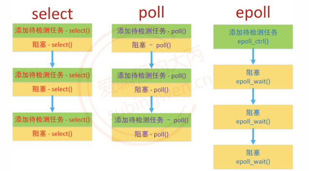

### 代码实现

**服务器端**

```c
#include <stdio.h>
#include <ctype.h>
#include <unistd.h>
#include <stdlib.h>
#include <sys/types.h>
#include <sys/stat.h>
#include <string.h>
#include <arpa/inet.h>
#include <sys/socket.h>
#include <sys/epoll.h>

int main(int argc, const char* argv[])
{
    // 创建监听的套接字
    int lfd = socket(AF_INET, SOCK_STREAM, 0);
    if(lfd == -1)
    {
        perror("socket error");
        exit(1);
    }

    // 绑定
    struct sockaddr_in serv_addr;
    memset(&serv_addr, 0, sizeof(serv_addr));
    serv_addr.sin_family = AF_INET;
    serv_addr.sin_port = htons(9999);
    serv_addr.sin_addr.s_addr = htonl(INADDR_ANY);  // 本地多有的ＩＰ
    
    // 设置端口复用
    int opt = 1;
    setsockopt(lfd, SOL_SOCKET, SO_REUSEADDR, &opt, sizeof(opt));

    // 绑定端口
    int ret = bind(lfd, (struct sockaddr*)&serv_addr, sizeof(serv_addr));
    if(ret == -1)
    {
        perror("bind error");
        exit(1);
    }

    // 监听
    ret = listen(lfd, 64);
    if(ret == -1)
    {
        perror("listen error");
        exit(1);
    }

    // 现在只有监听的文件描述符
    // 所有的文件描述符对应读写缓冲区状态都是委托内核进行检测的epoll
    // 创建一个epoll模型
    int epfd = epoll_create(100);
    if(epfd == -1)
    {
        perror("epoll_create");
        exit(0);
    }

    // 往epoll实例中添加需要检测的节点, 现在只有监听的文件描述符
    struct epoll_event ev;
    ev.events = EPOLLIN;    // 检测lfd读读缓冲区是否有数据
    ev.data.fd = lfd;
    ret = epoll_ctl(epfd, EPOLL_CTL_ADD, lfd, &ev);
    if(ret == -1)
    {
        perror("epoll_ctl");
        exit(0);
    }

    struct epoll_event evs[1024];
    int size = sizeof(evs) / sizeof(struct epoll_event);
    // 持续检测
    while(1)
    {
        // 调用一次, 检测一次
        int num = epoll_wait(epfd, evs, size, -1);
        for(int i=0; i<num; ++i)
        {
            // 取出当前的文件描述符
            int curfd = evs[i].data.fd;
            // 判断这个文件描述符是不是用于监听的
            if(curfd == lfd)
            {
                // 建立新的连接
                int cfd = accept(curfd, NULL, NULL);
                // 新得到的文件描述符添加到epoll模型中, 下一轮循环的时候就可以被检测了
                ev.events = EPOLLIN;    // 读缓冲区是否有数据
                ev.data.fd = cfd;
                ret = epoll_ctl(epfd, EPOLL_CTL_ADD, cfd, &ev);
                if(ret == -1)
                {
                    perror("epoll_ctl-accept");
                    exit(0);
                }
            }
            else
            {
                // 处理通信的文件描述符
                // 接收数据
                char buf[1024];
                memset(buf, 0, sizeof(buf));
                int len = recv(curfd, buf, sizeof(buf), 0);
                if(len == 0)
                {
                    printf("客户端已经断开了连接\n");
                    // 将这个文件描述符从epoll模型中删除
                    epoll_ctl(epfd, EPOLL_CTL_DEL, curfd, NULL);
                    close(curfd);
                }
                else if(len > 0)
                {
                    printf("客户端say: %s\n", buf);
                    send(curfd, buf, len, 0);
                }
                else
                {
                    perror("recv");
                    exit(0);
                } 
            }
        }
    }

    return 0;
}
```

### 工作模式

**水平模式**

水平模式可以简称为LT模式，LT（level triggered）是缺省的工作方式，并且同时支持block和no-block socket。在这种做法中，内核通知使用者哪些文件描述符已经就绪，之后就可以对这些已就绪的文件描述符进行IO操作了。

水平模式的特点

- 读事件
  - 如果不能全部将缓冲区数据读出，那么读事件会继续被触发，直到数据被全部读出
  - 因为读数据是被动的，必须要通过读事件才能知道有数据到达了，因此对于读事件的检测是必须的
- 写事件
  - 如果写缓冲区没有被写满，写事件会一直被触发
  - 因为写数据是主动的，并且写缓冲区一般情况下都是可写的（缓冲区不满），因此对于写事件的检测不是必须的

**边沿模式**

边沿模式可以简称为ET模式，ET（edge-triggered）是高速工作方式，只支持no-block socket。在这种模式下，当文件描述符从未就绪变为就绪时，内核会通过epoll通知使用者。不会再为那个文件描述符发送更多的就绪通知（only once）。如果我们对这个文件描述符做IO操作，从而导致它再次变成未就绪，当这个未就绪的文件描述符再次变成就绪状态，内核会再次进行通知，并且还是只通知一次。

ET模式在很大程度上减少了epoll事件被重复触发的次数，因此效率要比LT模式高。

边沿模式的特点

- 读事件
  - 如果数据没有被全部读走，并且没有新数据进入，读事件不会再次触发，只通知一次
  - 如果数据被全部读走或者只读走一部分，此时有新数据进入，读事件被触发，并且只通知一次
- 写事件
  - 写缓冲区从满到不满，状态变为可写，写事件只会被触发一次，直到再次变满再变非满

综上所述，epoll的边沿模式下 epoll_wait()检测到文件描述符有新事件才会通知，如果不是新的事件就不通知，通知的次数比水平模式少，效率比水平模式要高。

**ET模式的设置**

边沿模式不是默认的epoll模式，需要额外进行设置。epoll设置边沿模式是非常简单的，epoll管理的红黑树示例中每个节点都是struct epoll_event类型，只需要将EPOLLET添加到结构体的events成员中即可

```c
struct epoll_event ev;
ev.events = EPOLLIN | EPOLLET;	// 设置边沿模式
```

如果使用epoll的边沿模式进行读事件的检测，有新数据达到只会通知一次，那么必须要保证得到通知后将数据全部从读缓冲区中读出。那么，应该如何读这些数据呢？

- 方式1：准备一块特别大的内存，用于存储从读缓冲区中读出的数据，但是这种方式有很大的弊端
  - 内存的大小没有办法界定，太大浪费内存，太小又不够用
  - 系统能够分配的最大堆内存也是有上限的，栈内存就更不必多言了
- 方式2：循环接收数据

```c
int len = 0;
while((len = recv(curfd, buf, sizeof(buf), 0)) > 0)
{
    // 数据处理...
}
```


这样做也是有弊端的，因为套接字操作默认是阻塞的，当读缓冲区数据被读完之后，读操作就阻塞了也就是调用的read()/recv()函数被阻塞了，当前进程/线程被阻塞之后就无法处理其他操作了。

要解决阻塞问题，就需要将套接字默认的阻塞行为修改为非阻塞，需要使用fcntl()函数进行处理

```c
// 设置完成之后, 读写都变成了非阻塞模式
int flag = fcntl(cfd, F_GETFL);
flag |= O_NONBLOCK;                                                        
fcntl(cfd, F_SETFL, flag);
```

通过上述分析就可以得出一个结论：epoll在边沿模式下，必须要将套接字设置为非阻塞模式。但是，这样就会引发另外的一个bug，在非阻塞模式下，当缓冲区数据被读完了，调用的read()/recv()函数还会继续从缓冲区中读数据，此时函数调用就失败了，返回-1，对应的全局变量 errno 值为 EAGAIN。

**解决方法**

```c
#include <stdio.h>
#include <ctype.h>
#include <unistd.h>
#include <stdlib.h>
#include <sys/types.h>
#include <sys/stat.h>
#include <string.h>
#include <arpa/inet.h>
#include <sys/socket.h>
#include <sys/epoll.h>
#include <fcntl.h>
#include <errno.h>

// server
int main(int argc, const char* argv[])
{
    // 创建监听的套接字
    int lfd = socket(AF_INET, SOCK_STREAM, 0);
    if(lfd == -1)
    {
        perror("socket error");
        exit(1);
    }

    // 绑定
    struct sockaddr_in serv_addr;
    memset(&serv_addr, 0, sizeof(serv_addr));
    serv_addr.sin_family = AF_INET;
    serv_addr.sin_port = htons(9999);
    serv_addr.sin_addr.s_addr = htonl(INADDR_ANY);  // 本地多有的ＩＰ
    // 127.0.0.1
    // inet_pton(AF_INET, "127.0.0.1", &serv_addr.sin_addr.s_addr);
    
    // 设置端口复用
    int opt = 1;
    setsockopt(lfd, SOL_SOCKET, SO_REUSEADDR, &opt, sizeof(opt));

    // 绑定端口
    int ret = bind(lfd, (struct sockaddr*)&serv_addr, sizeof(serv_addr));
    if(ret == -1)
    {
        perror("bind error");
        exit(1);
    }

    // 监听
    ret = listen(lfd, 64);
    if(ret == -1)
    {
        perror("listen error");
        exit(1);
    }

    // 现在只有监听的文件描述符
    // 所有的文件描述符对应读写缓冲区状态都是委托内核进行检测的epoll
    // 创建一个epoll模型
    int epfd = epoll_create(100);
    if(epfd == -1)
    {
        perror("epoll_create");
        exit(0);
    }

    // 往epoll实例中添加需要检测的节点, 现在只有监听的文件描述符
    struct epoll_event ev;
    ev.events = EPOLLIN;    // 检测lfd读读缓冲区是否有数据
    ev.data.fd = lfd;
    ret = epoll_ctl(epfd, EPOLL_CTL_ADD, lfd, &ev);
    if(ret == -1)
    {
        perror("epoll_ctl");
        exit(0);
    }


    struct epoll_event evs[1024];
    int size = sizeof(evs) / sizeof(struct epoll_event);
    // 持续检测
    while(1)
    {
        // 调用一次, 检测一次
        int num = epoll_wait(epfd, evs, size, -1);
        printf("==== num: %d\n", num);

        for(int i=0; i<num; ++i)
        {
            // 取出当前的文件描述符
            int curfd = evs[i].data.fd;
            // 判断这个文件描述符是不是用于监听的
            if(curfd == lfd)
            {
                // 建立新的连接
                int cfd = accept(curfd, NULL, NULL);
                // 将文件描述符设置为非阻塞
                // 得到文件描述符的属性
                int flag = fcntl(cfd, F_GETFL);
                flag |= O_NONBLOCK;
                fcntl(cfd, F_SETFL, flag);
                // 新得到的文件描述符添加到epoll模型中, 下一轮循环的时候就可以被检测了
                // 通信的文件描述符检测读缓冲区数据的时候设置为边沿模式
                ev.events = EPOLLIN | EPOLLET;    // 读缓冲区是否有数据
                ev.data.fd = cfd;
                ret = epoll_ctl(epfd, EPOLL_CTL_ADD, cfd, &ev);
                if(ret == -1)
                {
                    perror("epoll_ctl-accept");
                    exit(0);
                }
            }
            else
            {
                // 处理通信的文件描述符
                // 接收数据
                char buf[5];
                memset(buf, 0, sizeof(buf));
                // 循环读数据
                while(1)
                {
                    int len = recv(curfd, buf, sizeof(buf), 0);
                    if(len == 0)
                    {
                        // 非阻塞模式下和阻塞模式是一样的 => 判断对方是否断开连接
                        printf("客户端断开了连接...\n");
                        // 将这个文件描述符从epoll模型中删除
                        epoll_ctl(epfd, EPOLL_CTL_DEL, curfd, NULL);
                        close(curfd);
                        break;
                    }
                    else if(len > 0)
                    {
                        // 通信
                        // 接收的数据打印到终端
                        write(STDOUT_FILENO, buf, len);
                        // 发送数据
                        send(curfd, buf, len, 0);
                    }
                    else
                    {
                        // len == -1
                        if(errno == EAGAIN)
                        {
                            printf("数据读完了...\n");
                            break;
                        }
                        else
                        {
                            perror("recv");
                            exit(0);
                        }
                    }
                }
            }
        }
    }

    return 0;
}
```

