<font size = 6>Git</font>

[toc]

# Git概述

Git是一个免费的、开源的分布式版本控制系统，可以快速高效地处理从小型到大型的各种项目。

Git易于学习，占地面积小，性能极快。 它具有廉价的本地库，方便的暂存区域和多个工作流分支等特性。其性能优于Subversion(svn)、CVS、Perforce和ClearCase等版本控制工具。

## 何为版本控制

版本控制是一种记录文件内容变化，以便将来查阅特定版本修订情况的系统。

版本控制其实最重要的是可以记录文件修改历史记录，从而让用户能够查看历史版本，方便版本切换。

## 为什么需要版本控制

个人开发过渡到团队协作。

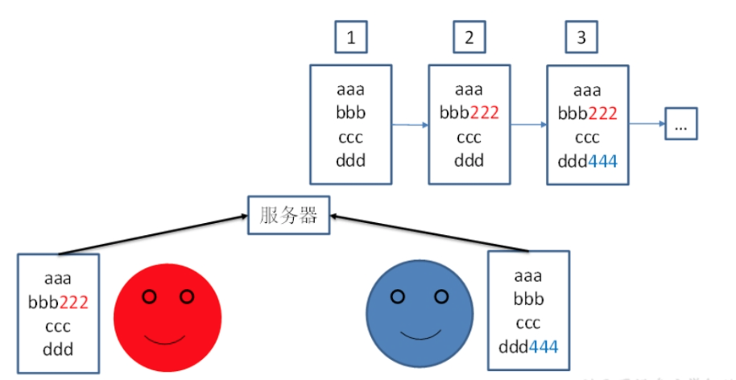


## 集中式与分布式

* **集中式版本控制工具**

CVS、SVN(Subversion)、VSS……

* **分布式版本控制工具**

Git、Mercurial、Bazaar、Darcs……

Git 属于分布式版本控制系统，而 SVN 属于集中式。

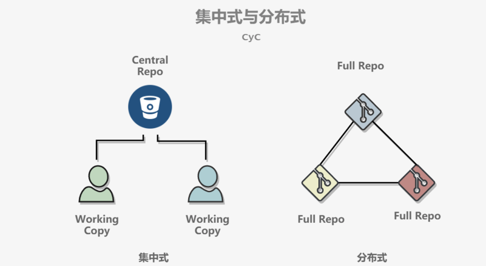

集中式版本控制只有中心服务器拥有一份代码，而分布式版本控制每个人的电脑上就有一份完整的代码。

集中式版本控制有安全性问题，当中心服务器挂了所有人都没办法工作了。

集中式版本控制需要连网才能工作，如果网速过慢，那么提交一个文件会慢的无法让人忍受。而分布式版本控制不需要连网就能工作。

分布式版本控制新建分支、合并分支操作速度非常快，而集中式版本控制新建一个分支相当于复制一份完整代码。

## 中心服务器

中心服务器用来交换每个用户的修改，没有中心服务器也能工作，但是中心服务器能够 24 小时保持开机状态，这样就能更方便的交换修改。

Github 就是一个中心服务器。

* **局域网**

GitLab

* **互联网**

GitHub（外网）

Gitee码云（国内网站）

# 工作流

默认编辑器为vim

新建一个仓库之后，当前目录就成为了工作区，工作区下有一个隐藏目录 .git，它属于 Git 的版本库。

Git 的版本库有一个称为 Stage 的暂存区以及最后的 History 版本库，History 存储所有分支信息，使用一个 HEAD 指针指向当前分支。

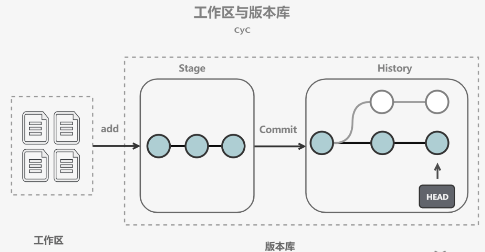

- git add files 把文件的修改添加到暂存区
- git commit 把暂存区的修改提交到当前分支，提交之后暂存区就被清空了
- git reset -- files 使用当前分支上的修改覆盖暂存区，用来撤销最后一次 git add files
- git checkout -- files 使用暂存区的修改覆盖工作目录，用来撤销本地修改

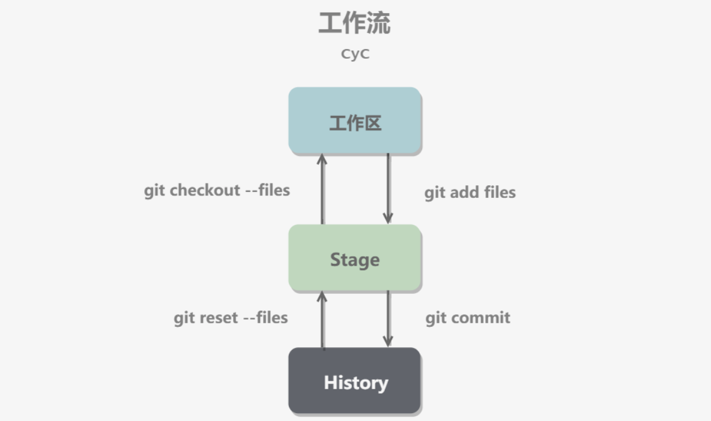

可以跳过暂存区域直接从分支中取出修改，或者直接提交修改到分支中。

- git commit -a 直接把所有文件的修改添加到暂存区然后执行提交
- git checkout HEAD -- files 取出最后一次修改，可以用来进行回滚操作

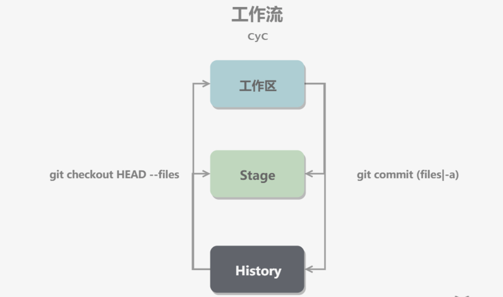

# 分支实现

使用指针将每个提交连接成一条时间线，HEAD 指针指向当前分支指针。

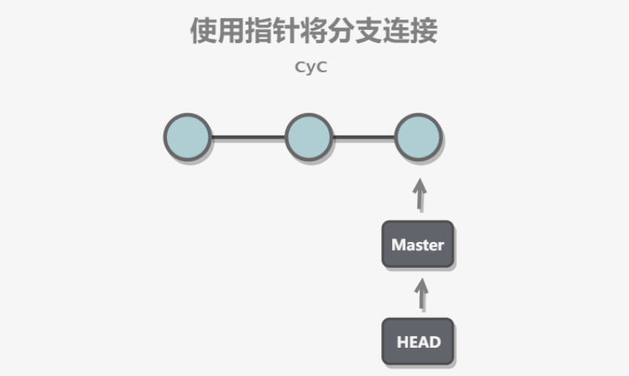

新建分支是新建一个指针指向时间线的最后一个节点，并让 HEAD 指针指向新分支，表示新分支成为当前分支。

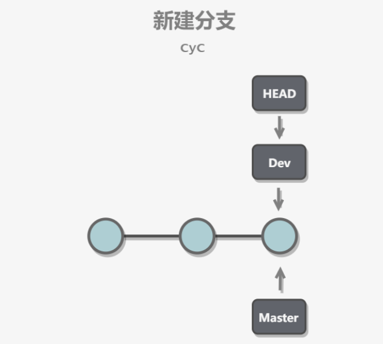

每次提交只会让当前分支指针向前移动，而其它分支指针不会移动。

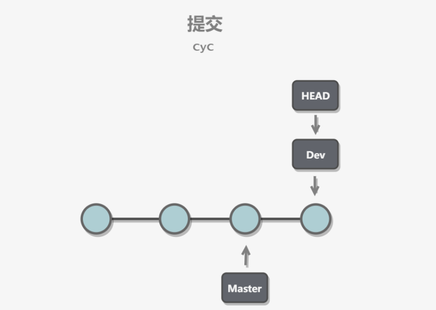

合并分支也只需要改变指针即可。

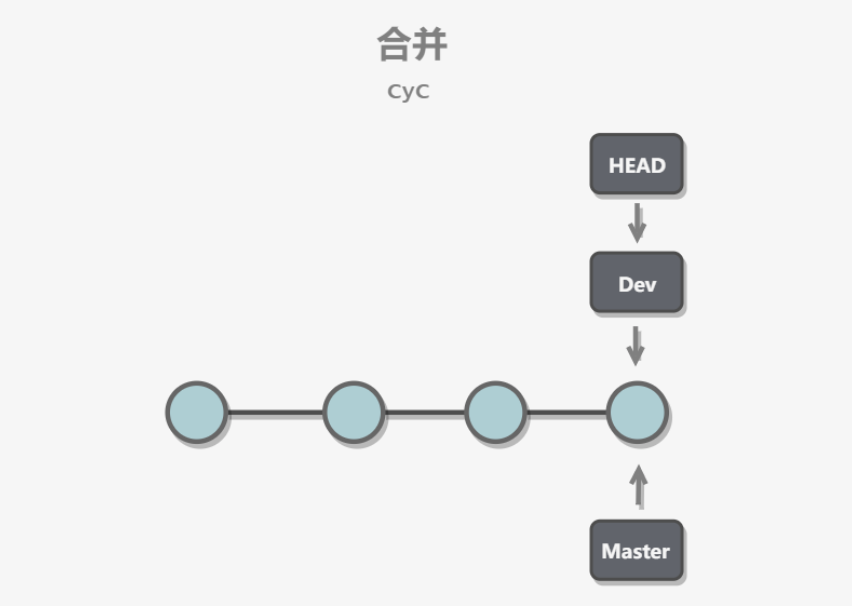

# 冲突

当两个分支都对同一个文件的同一行进行了修改，在分支合并时就会产生冲突。

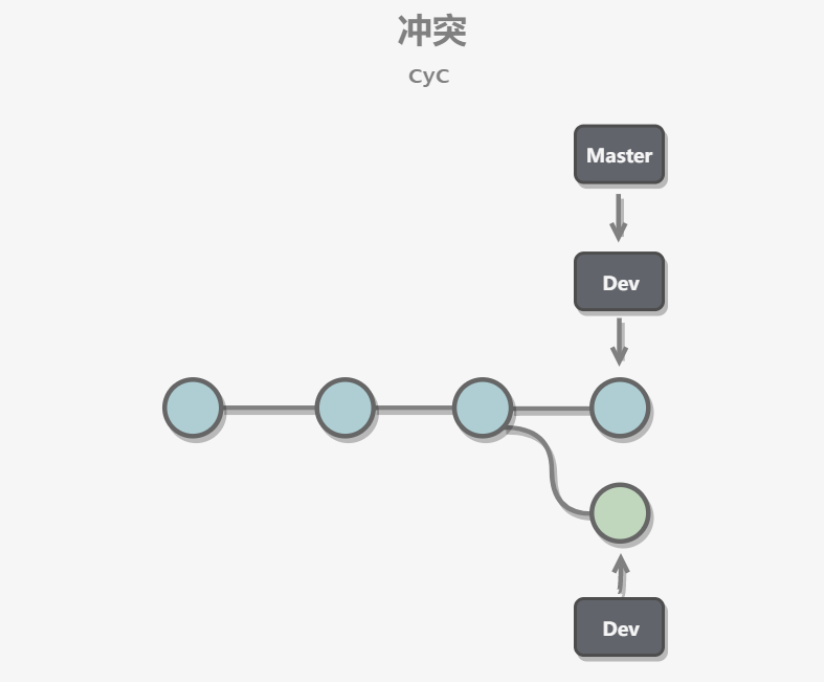

Git 会使用 <<<<<<< ，\=\=\=\=\=\=\= ，>>>>>>> 标记出不同分支的内容，只需要把不同分支中冲突部分修改成一样就能解决冲突。

```shell
<<<<<<< HEAD
Creating a new branch is quick & simple.
=======
Creating a new branch is quick AND simple.
>>>>>>> feature1
```

# Fast forward

"快进式合并"（fast-farward merge），会直接将 master 分支指向合并的分支，这种模式下进行分支合并会丢失分支信息，也就不能在分支历史上看出分支信息。

可以在合并时加上 --no-ff 参数来禁用 Fast forward 模式，并且加上 -m 参数让合并时产生一个新的 commit。

```cmd
$ git merge --no-ff -m "merge with no-ff" dev
```

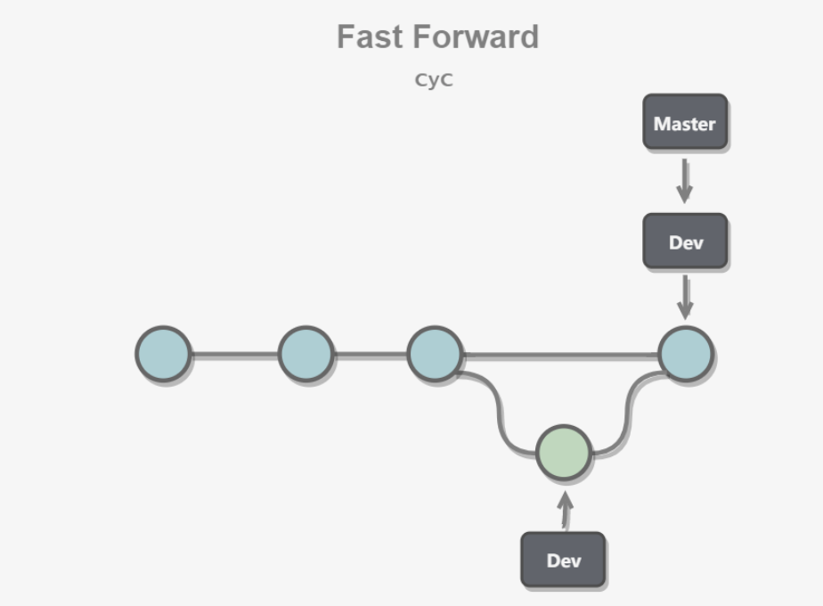

# 储藏（Stashing）

在一个分支上操作之后，如果还没有将修改提交到分支上，此时进行切换分支，那么另一个分支上也能看到新的修改。这是因为所有分支都共用一个工作区的缘故。

可以使用 git stash 将当前分支的修改储藏起来，此时当前工作区的所有修改都会被存到栈中，也就是说当前工作区是干净的，没有任何未提交的修改。此时就可以安全的切换到其它分支上了。

```cmd
$ git stash
Saved working directory and index state \ "WIP on master: 049d078 added the index file"
HEAD is now at 049d078 added the index file (To restore them type "git stash apply")
```

该功能可以用于 bug 分支的实现。如果当前正在 dev 分支上进行开发，但是此时 master 上有个 bug 需要修复，但是 dev 分支上的开发还未完成，不想立即提交。在新建 bug 分支并切换到 bug 分支之前就需要使用 git stash 将 dev 分支的未提交修改储藏起来。

# SSH 传输设置

Git 仓库和 Github 中心仓库之间的传输是通过 SSH 加密。

如果工作区下没有 .ssh 目录，或者该目录下没有 id_rsa 和 id_rsa.pub 这两个文件，可以通过以下命令来创建 SSH Key

```cmd
$ ssh-keygen -t rsa -C "youremail@example.com"
```

然后把公钥 id_rsa.pub 的内容复制到 Github "Account settings" 的 SSH Keys 中。

# .gitignore 文件

提交时可以忽略里面的文件，如`.log、.jar、.o、缩略图、敏感信息`等与项目无关的文件。

不需要全部自己编写，可以到[this](https://github.com/github/gitignore)中进行查询。

# LICENSE文件

开源许可证。

# Git 命令一览

## 全局范围的签名设置

签名的作用是区分不同操作者身份，用户的签名信息在每一个版本的提交信息中能够看到，以此确认本次提交是谁做的。

Git首次安装必须设置一下用户签名，否则无法提交代码。

```shell
git config --global user.name your_username
git config --global user.email your_email
git config --list # 查看全局配置
cat ~/.gitconfig  # linux中查看.gitconfig文件内容
```

## 初始化本地库

```shell
git init				# 当前目录下初始化本地仓库 
git init newDir # 在newDir目录下生成一个.git目录 
```

生成.git隐藏文件夹，且会默认生成一个master分支。

## 克隆仓库

使用git clone命令可以从Git仓库拷贝项目。

```shell
git clone <url> [directory]		# url为git仓库地址，directory为本地目录
```

 如

```shell
git clone git://github.com/schacon/grit.git newgit
```

## 查看当前状态

```shell
git status		# 查看当前状态（所在分支、进行的修改提交）
```

## 详细信息

git status只显示更新的状态，而 git diff 可以显示已写入缓存与已修改但尚未写入缓存的改动的区别具体的详细信息。

```shell
git diff			# 查看详细状态
```

> - 尚未缓存的改动：git diff
> - 查看已缓存的改动： git diff --cached
> - 查看已缓存的与未缓存的所有改动：git diff HEAD
> - 显示摘要而非整个 diff：git diff --stat

## 将工作区的文件添加到暂存区

```shell
git add fileName
git add.		# 全部文件添加到暂存区
git add *.c # 将全部c文件添加到暂存区
```

## 暂存区文件提交到本地库

```shell
git commit -m "log_info" fileName
git commit -m "log_info"	# 暂存区中文件全部提交
git commit -am "log_info" # 跳过add,直接提交
```

## 将修改的文件再次添加暂存区

将修改后的文件重新按照`git add、git commit`流程即可。

## 取消暂存区内容

 ```shell
 git reset HEAD cached_file	# 取消之前 git add 添加缓存区cached_file文件
 ```

## 移除文件

```shell
git rm fileName			# 移除文件 不允许已经放到暂存区域
git rm -f fileName	# 强制移除 允许已经放到暂存区域
git rm –r fileDir		# 递归删除	
```

## 移动or重命名

```shell
git mv test.txt newtest.txt	# 重命名
git mv test.txt ./newDir		# 移动
```

## 分支管理

### 查看/创建分支

```shell
git branch							# 查看本地分支
git branch branchName		# 创建分支
```

git的分支必须指向一个commit，没有commit就没有任何分支

### 切换/创建分支

```shell
git checkout branchName
git checkout -b branchName # 创建新分支并立即切换到该分支下
```

### 合并分支

```shell
git merge branchName		# 将branchName分支合并到到当前分支中
```

**合并冲突**

合并并不仅仅是简单的文件添加、移除的操作，Git 也会合并修改，如果我们在两个分支中同时修改了同一个文件，这时再合并，就可能会产生冲突。

### 删除分支

 ```shell
 git branch -d branchName
 ```

## 历史版本

### 查看历史版本

```shell
git reflog		# 显示所有的操作记录，包括提交，回退的操作
git log  			# 显示所有提交过的版本信息，不包括已经被删除的commit记录和reset的操作
```

关于`git log`的几种选项

> * --oneline ：查看历史记录的简洁版本
> * --graph ：查看历史中什么时候出现了分支、合并
> * --reverse ：逆向显示所有日志
> * --author ：查找指定用户的提交日志
> * --since、--before、 --until、--after： 指定筛选日期
> * --no-merges ：选项以隐藏合并提交

### 版本穿梭

```shell
git reset --hard version_num		# 转到该版本
```

注

开发过程尽量保持线性，不要有过多分支。

回滚只是为了查看，尽量不要在历史版本中修改文件的内容，否则容易导致项目难以管理，应该返回之前的最新版下进行开发。

## Git标签

使用标签可以很方便的永远的记住那个特别的提交快照，我们发一个新的版本时，可以给它加一个“vx.x”版本

### 创建新标签|追加标签

```shell
git tag -a vx.x								# 创建一个带注解的标签
git tag -a vx.x version_num 	# 对已发布提交的version_num追加标签
git tag -a vx.x -m "tag_info"	# 包含额外信息的注解标签，可修改
git tag -s vx.x -m "tag_info"	# 包含额外信息的签名的注解标签，不可修改	
```

### 查看标签

```shell
git tag		# 查看所有标签
```

## Git 远程仓库

### 添加远程仓库

```shell
git remote add alias url	 # 参数alias为别名， url为远程仓库的地址
```

远程仓库名称默认为 origin

### 查看当前远程仓库

```shell
git remote	# 查看当前有哪些远程仓库
```

### 提取远程仓库的数据

```shell
git fetch remote_name		# 提取远程仓库remote_name所有分支的数据 
```

该命令执行完后需要执行git merge远程分支到你所在的分支，如

```shell
git merge remote_name/branchName		# 将 remote_name/branchName 分支上的更改合并到当前检出（checked out）的本地分支
```

注

1. 本地须是一个空的仓库，如果非空，则会报：fatal: refusing to merge unrelated histories错误。

### 提取远程仓库的数据并合并

```shell
git pull remote_name branchName		# 将远程仓库 remote_name 的 branchName 分支的更改拉取到本地  分支
git pull remote_name branchName:localBranchName		# 从 remote_name 远程仓库的 branchName 分支拉取代码，并尝试合并到本地的 localBranchName 分支。如果本地分支不存在，Git 会创建它。
```

无需执行git merge

### 推送数据到远程仓库

```shell
git push remote_name (master)branchName		# 推送分支与数据到远端仓库
git push remote_name HEAD  		# 将本地的任何分支推送到远程仓库的同名分支
```

注

1. 此命令容易造成“删库跑路”的情况，应该谨慎使用，或使用成熟的软件（gitlab）或插件来避免。
2. 如果没有权限推送到远程仓库的特定分支，`git push` 会失败，那么可能需要先创建 Pull Request 或请求仓库管理员给予你推送权限。

### 删除远程仓库

```shell
git remote rm remote_name		# remote_name为别名
```

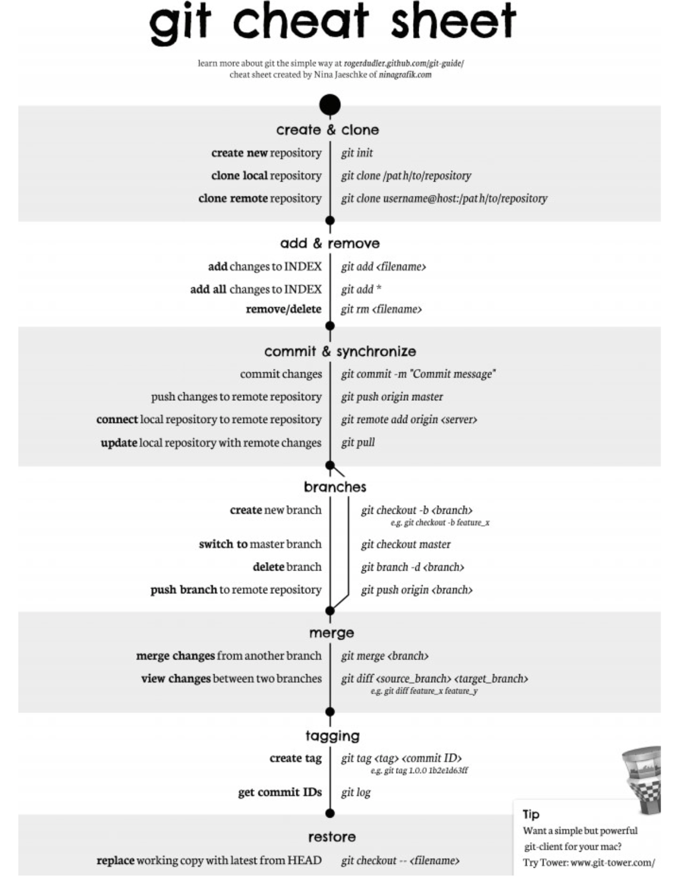

比较详细的地址：[this](./git-cheat-sheet.pdf)       

# GitHub

GitHub 是一个基于 Git 的代码托管平台，提供了一个基于 Web 的图形界面（GUI），使得用户可以更容易地使用 Git。

## fork

fork不是git操作，而是github操作，实现代码仓库的克隆。

fork之后会在自己github账户下创建一个新仓库，包含元仓库所有内容，如分支、tag、提交历史等。

## git交互

1. 使用git clone 仓库到本地
2. 修改并提交到本地仓库
3. 使用git push到远程仓库
4. 使用 pull request选择对应分支进行合并

## pull request

Pull Request是一种代码审查和代码合并的机制，用于将一个分支的更改合并到另一个分支。

# Gitee

GitHub的网站有时候会连接不上，无法登录。可以使用阿里提供的Git远程仓库网站Gitee来代替。

# GitLab  

GitLab 也是一个基于 Git 的代码托管和协作平台，类似于 GitHub，但它提供了一个自托管的选项。这意味着用户可以在自己的服务器上安装和运行 GitLab，从而拥有更多的控制权和隐私。

使用git，还需要一个远程代码仓库。常见的github、gitee这种远程代码仓库，公司中一般不会使用，因为他们是使用外网的，不够安全，易泄露数据。一般企业都会搭建一个仅内网使用的远程代码仓库，最常见就是 GitLab。

## 安装部署

GitLab一般由公司的运维人员安装部署，开发人员只需要申请账号和相应权限即可。

## 使用GitLab完成团队管理

去到一家公司，应该是已经有了GitLab平台，运维人员拥有root管理员账号。而作为一名普通的开发人员，你的leader和同事都拥有各自的GitLab账号和不同权限。入职后，你只需要申请开通GitLab账号和对应权限，不需要你来操作。

## 群组

在公司里会有前端、后端、大数据等一系列组，组中还有下属组。

对于人员权限以及角色的控制有如下五种：

- Owner：最高权限，谁去创建组，这个组就被谁拥有，可以开除管理员，但管理员无法操作owner的角色。

- Maintainer：管理员——只是具备sudo权限的用户，一般是给小组的组长或是产品线的总监。

- Developer：读写权限——程序员。

- Repoter：只读权限。

- guest：匿名，直接去掉，例如原成员离职

# 企业项目构建与开发分支

1. 在实际开发中，一般成员只负责自己那部分的feature分支，开发完成后合并到上一层开发分支，经审查测试通过后完成合并。

2. 完成develop分支后会在release分支进行测试。

3. （2-3反复多次）测试完成后release分支会合并到master并上线。

4. 对于上线版本中出现的bug，通过创建hotfix分支来进行修改，完成后进行测试同时合并到master分支。

## 工作流介绍

### 集中式工作流

所有修改都提交到 Master 这个分支。比较适合极小团队或单人维护的项目，不建议使用这种方式


### 功能开发工作流

功能开发应该在一个专门的分支，而不是在 master 分支上，适用于小团队开发


### GitFlow工作流

公司中最常用于管理大型项目。为功能开发、发布准备和维护设立了独立的分支，让发布迭代过程更流畅


### Forking工作流

在 GitFlow 基础上，充分利用 Git 的 Fork 和 pull request 的功能以达到代码审核的目的（合并到master时需要经过审查通过）。一般用于跨团队协作、网上开源项目


## 各分支功能介绍


### 主干分支 master

主要负责管理正在运行的生产环境代码，永远保持与正在运行的生产环境完全一致。为了保持稳定性一般不会直接在这个分支上修改代码，都是通过其他分支合并过来的。

### 热修分支 hotfix

主要负责管理生产环境下出现的紧急修复的代码， 从主干分支分出，修复完毕并测试上线后，并回主干分支和开发分支。

### 开发分支 develop

主要负责管理正在开发过程中的代码。

### 功能分支 feature

开发模块，会从开发分支中独立出来,，完成后会合并到开发分支。

### 准发布分支 release

较大的版本上线前，会从开发分支中分出准生产分支，进行最后阶段的集成测试。该版本上线后，会合并到主干分支。生产环境运行一段阶段较稳定后可以视情况删除。

# 冲突提交

实际单个模块的开发往往不是单独一个人来进行操作，当多个人协同开发相同的一个项目时，就会涉及到提交冲突的问题，以下均以同一分支下，本地push时版本已修改为前提。

## 不同人修改不同文件

1. 先pull后push

2. 直接merge

## 不同人修改同文件的不同区域

1. 先pull后push

2. 直接merge

## 不同人修改同文件的相同区域

1. 先merge，后人为判断进行合并或删除等操作

## 不同人同时变更文件名和文件内容

1. 先拉取，后git status查看状态，根据提示git rm 删除对应修改文件；git commit之后人为判断代码保留部分，再pull

# GitLab功能拓展

## code review

代码审查是指在软件开发过程中，对源代码的系统性检查。通常的目的是查找系统缺陷，保证软件总体质量和提高开发者自身水平。

##  CICD部署程序

自动化构建、测试和部署。

# Reference

[Git官方文档](https://git-scm.com/book/zh/v2)
