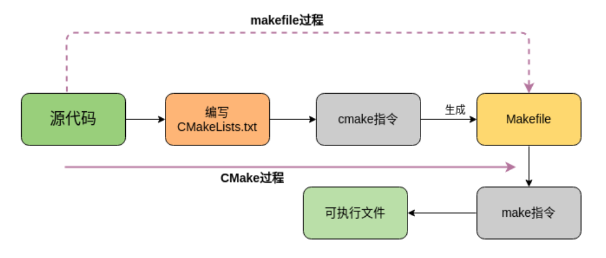

<font size = 6>Tools</font>

[toc]

# GCC

## 概述

GCC（GNU Compiler Collection）是 Linux 下的编译工具集，包含 gcc、g++ 等编译器，同时还包含其他工具集。GCC 工具集不仅能编译 C/C++语言，Objective-C、Java 等语言均能进行编译。GCC 可以根据不同的硬件平台进行编译（交叉编译），支持常见的 X86、ARM、PowerPC、mips 等硬件平台，以及 Linux、Windows 等软件平台。

## 工作流程

GCC 编译器对程序的编译分为 4 个阶段：预处理、编译、汇编和链接。


- 预处理：主要做了三件事，即展开头文件 、宏替换 、去掉注释行，需要GCC调用预处理器来完成，最终得到的还是源文件
- 编译：GCC调用编译器对文件进行编译，最终得到汇编文件
- 汇编：GCC调用汇编器对文件进行汇编,，最终得到一个二进制文件
- 链接：GCC调用链接器对程序需要调用的库进行链接, 最终得到一个可执行的二进制文件

| 文件名后缀 |              说明              | gcc 参数 |
| :--------: | :----------------------------: | :------: |
|     .c     |             源文件             |    无    |
|     .i     |       预处理后的 C 文件        |    -E    |
|     .s     | 编译之后得到的汇编语言的源文件 |    -S    |
|     .o     |     汇编后得到的二进制文件     |    -c    |

**举例**

`test.c`

```c
#include <stdio.h>
#include <stdlib.h>
#include <unistd.h>
#include <string.h>

int main()
{
    int array[5] = {1,2,3,4,5};
    for(int i=0; i<5; ++i)
    {
        printf("array[%d] = %d\n", i, array[i]);
    }
    return 0;
}
```

```shell
# 1. 预处理, -o 指定生成的文件名
$ gcc -E test.c -o test.i	
# 2. 编译, 得到汇编文件
$ gcc -S test.i -o test.s
# 3. 汇编
$ gcc -c test.s -o test.o
# 4. 链接
$ gcc test.o -o test
```

使用gcc可以通过参数控制内部自动执前几个步骤

```shell
# 参数 -c 是进行文件的汇编, 汇编之前的两步会自动执行
$ gcc test.c -c -o app.o

# 直接进行链接生成可执行程序, 链接之前的三步会自动执行
$ gcc test.c -o app 

$ gcc test.c		# Linux下默认生成可执行文件a.out
```

## 常用参数

下列参数在gcc命令中没有位置要求，只需要编译程序的时候将需要的参数指定出来即可。

|                   gcc编译选项                   | 含义                                                         |
| :---------------------------------------------: | :----------------------------------------------------------- |
|                       -E                        | 预处理                                                       |
|                       -S                        | 编译                                                         |
|                       -c                        | 编译、汇编                                                   |
| -o \<file1\> \<file2\> / \<file2\> -o \<file1\> | 将文件 file2 编译成文件 file1                                |
|                -I \<directory\>                 | 指定 include 包含文件的搜索目录                              |
|                       -g                        | 在编译的时生成调试信息，可以被调试器调试                     |
|                       -D                        | 在程序编译时声明一个宏                                       |
|                       -w                        | 不生成任何警告信息（不建议使用，有时警告就是错误）           |
|                      -Wall                      | 生成所有警告信息                                             |
|                       -On                       | 编译器的优化的4个级别，-O0表示没有优化，-O1为默认值，-O3优化级别最高 |
|                       -l                        | 在程序编译时指定使用的库                                     |
|                       -L                        | 指定编译时搜索的库的路径                                     |
|                   -fPIC/fpic                    | 生成与位置无关的代码                                         |
|                     -shared                     | 生成共享目标文件，通常用在建立共享库时                       |
|                      -std                       | 指定C版本，如：-std=c99，gcc默认的版本是GNU C                |

注

1. -c 模式下只能编译单个源文件生成一个 .o
2. -I 参数用来告诉编译器去哪里找头文件（"..."）,可以使用多个 `-I`，编译器会按照顺序查找

```shell
gcc -I ./include -I /usr/local/include src/main.c -o main
```

### 搜索头文件

如果程序中包含了一些头文件, 但是包含的一些头文件在程序预处理的时候因为找不到无法被展开，导致程序编译失败，这时可以在gcc命令中添加 -I参数重新指定要引用的头文件路径。

`tree`

```shell
├── add.c
├── div.c
├── include
│   └── head.h
├── main.c
├── mult.c
└── sub.c
```

```shell
# 编译当前目录中的所有源文件，得到可执行程序
$ gcc *.c -o calc
main.c:2:18: fatal error: head.h: No such file or directory
compilation terminated.
sub.c:2:18: fatal error: head.h: No such file or directory
compilation terminated.
# ❌ 源文件中包含的头文件无法被找到

# 可以在编译的时候重新指定头文件位置 -I 头文件目录 ✅
$ gcc *.c -o calc -I ./include
```

### 声明一个宏

在程序中可以通过宏控制某段代码是否能够被执行。

`test.c`

```c
#include <stdio.h>
#define NUMBER  3

int main()
{
    int a = 10;
#ifdef DEBUG
    printf("我是一个程序猿, 我不会爬树...\n");
#endif
    for(int i=0; i<NUMBER; ++i)
    {
        printf("hello, GCC!!!\n");
    }
    return 0;
}
```

```shell
# 在编译命令中不定义 DEBUG 宏,
$ gcc test.c -o app

$ ./app 
hello, GCC!!!
hello, GCC!!!
hello, GCC!!!

# 在编译命令中定义这个 DEBUG 宏, 
$ gcc test.c -o app -D DEBUG

# 执行生成的程序， 可以看到程序第9行的输出
$ ./app 
我是一个程序猿, 我不会爬树...
hello, GCC!!!
hello, GCC!!!
hello, GCC!!!
```

应用场景：在发布程序的时候，一般都会要求将程序中所有的log输出去掉，如果不去掉会影响程序的执行效率，很显然删除这些打印log的源代码是一件很麻烦的事情，此时就可以通过宏判定和-D参数来快速实现。

## 多文件编译

GCC 可以自动编译链接多个文件，不管是目标文件还是源文件，都可以使用同一个命令编译到一个可执行文件中。

`string.h`

```c
#ifndef _STRING_H_
#define _STRING_H_
int strLength(char *string);
#endif // _STRING_H_
```

`string.c`

```c
#include "string.h"

int strLength(char *string)
{
	int len = 0;
	while(*string++ != '\0') 	// 当*string 的值为'\0'时, 停止计算
    {
        len++;
    }
	return len; 	// 返回字符串长度
}
```

`main.c`

```c
#include <stdio.h>
#include "string.h"

int main(void)
{
	char *src = "Hello, I'am Monkey·D·Luffy!!!"; 
	printf("string length is: %d\n", strLength(src)); 
	return 0;
}
```

因为头文件是包含在源文件中的，因此在使用gcc编译程序的时候不需要指定头文件的名字（在头文件无法被找到的时候需要使用参数 -I 指定其具体路径而不是名字）。

```shell
# 直接生成可执行程序 test
$ gcc string.c main.c -o test 

# 运行可执行程序
$ ./test

# 分步进行 #

# 汇编生成二进制目标文件, 指定了 -c 参数之后, 源文件会自动生成 string.o 和 main.o
$ gcc string.c main.c –c 

# 链接目标文件, 生成可执行程序 test
$ gcc string.o main.o –o test 

# 运行可执行程序
$ ./test
```

##  gcc与g++

- gcc：GNU C Compiler，主要用来编译 C 语言程序，但也能编译 C++，默认当成 C 来处理
- g++：GNU C++ Compiler，专门用于编译 C++ 程序，默认会按照 C++ 的规则来处理代码

**区别**

- 编译阶段
  - 后缀为 .c 的，gcc 把它当作是C程序，而 g++ 当作是 C++ 程序
  - 后缀为.cpp的，两者都会认为是 C++ 程序

```shell
# 编译 c 程序
gcc test.c -o test   # 按 C 语言规则编译
g++ test.c -o test   # 按 C++ 语言规则编译
```

- 链接阶段
  - gcc 和 g++ 都可以自动链接到标准C库
  - g++ 可以自动链接到标准C++库，gcc如果要链接到标准C++库需要加参数 -lstdc++

```shell
# 编译 c++ 程序
gcc test.cpp -o test -lstdc++   # 按 C++ 语言规则编译
g++ test.cpp -o test  			# 按 C++ 语言规则编译
```

# 静态库和动态库

## 概述

不管是Linux还是Windows中的库文件其本质和工作模式都是相同的，只不过在不同的平台上库对应的文件格式和文件后缀不同，程序中调用的库有两种——静态库和动态库。

在项目中使用库一般有两个目的：一个是为了使程序更加简洁不需要在项目中维护太多的源文件，另一方面是为了源代码保密。当拿到了库文件（动态库、静态库）之后要想使用还必须有这些库中提供的API函数的声明，也就是头文件，把这些都添加到项目中，就可以使用库了。

## 静态库

### 基本知识

在Linux中静态库由程序 `ar` 生成，现在静态库已经不像之前那么普遍了，这主要是由于程序都在使用动态库。

**命名规则**

- Linux中静态库以`lib`作为前缀, 以 `.a` 作为后缀, 中间是库名自己指定即可，即：`libxxx.a`
- Windows中静态库一般以`lib`作为前缀，以 `lib` 作为后缀，中间是库名需要自己指定, 即：`libxxx.lib`

**静态链接库**

生成静态库，需要先对源文件进行汇编操作，得到二进制格式的目标文件，然后在通过 `ar`工具将目标文件打包就可以得到静态库文件了 (libxxx.a)。

使用 `ar`工具创建静态库的时候需要三个参数

- 参数c：创建一个库，不管库是否存在，都将创建
- 参数s：创建目标文件索引，这在创建较大的库时能加快时间
- 参数r：在库中插入模块(替换)，默认新的成员添加在库的结尾处，如果模块名已经在库中存在，则替换同名的模块


**步骤**

1. 将源文件进行汇编，得到 .o 文件

```shell
# 执行如下操作, 默认生成二进制的 .o 文件
# -c 参数位置没有要求
$ gcc main.c -o calc -c	
```

2. 将得到的 .o 进行打包，得到静态库

```shell
$ ar rcs <libxxx.a> <原材料(*.o)>

# Example
$ ar rcs libcalc.a *.o
```

3. 发布/使用静态库

```shell
1. 提供头文件 **.h
2. 提供制作出来的静态库 libxxx.a

# Example
$ gcc main.c -o app -L ./ -l calc	# 静态库“掐头去尾”，并且静态库在当前路径下
```

### 静态库举例

`tree`

```shell
# add.c div.c mult.c sub.c -> 算法的源文件, 函数声明在头文件 head.h
# main.c中是对接口的测试程序, 制作库的时候不需要将 main.c 算进去

├── add.c
├── div.c
├── include
│   └── head.h
├── main.c
├── mult.c
└── sub.c
```

```shell
# 1. 生成.o
$ gcc add.c div.c mult.c sub.c -c -I ./include/
# 2. 将生成的目标文件 .o 打包成静态库
$ ar rcs libcalc.a *.o   
# 3. 发布静态库
	1. head.h    => 函数声明
	2. libcalc.a => 函数定义(二进制格式)
# 4 将静态库, 头文件, 测试程序放到一个目录中准备进行测试
$ gcc main.c -o app -L ./ -l calc	# 指定静态库以及路径
```

## 动态库

### 基本知识

动态链接库是程序运行时加载的库，当动态链接库正确部署后，运行的多个程序可以使用同一个加载到内存中的动态库，因此在Linux中动态链接库也可称之为共享库。

动态链接库是目标文件的集合，库中函数和变量的地址使用的是相对地址（静态库中使用的是绝对地址），其真实地址是在应用程序加载动态库时形成的。

**命名规则**

- Linux中动态库以`lib`作为前缀，以 `.so` 作为后缀，中间是库的名字自己指定即可，即：`libxxx.so`
- Windows中动态库一般以`lib`作为前缀，以 `dll` 作为后缀，中间是库的名字需要自己指定, 即：`libxxx.dll`

**动态链接库**

生成动态链接库是直接使用gcc命令并且需要添加-fPIC（-fpic） 以及-shared 参数。

- -fPIC 或 -fpic 参数：作用是使得 gcc 生成的代码是与位置无关的，也就是使用相对位置

- -shared参数：作用是告诉编译器生成一个动态链接库


**步骤**

1. 将源文件进行汇编操作

```shell
# 得到若干个 .o文件
$ gcc <源文件(*.c)> -c -fpic
```

2. 将得到的.o文件打包成动态库


```shell
$ gcc <与位置无关的目标文件(*.o)> -o <动态库(libxxx.so)> -shared
```

3. 发布动态库和头文件

```shell
1. 提供头文件: xxx.h
2. 提供动态库: libxxx.so
```

### 动态库举例

`tree`

```shell
# add.c div.c mult.c sub.c -> 算法的源文件, 函数声明在头文件 head.h
# main.c中是对接口的测试程序, 制作库的时候不需要将 main.c 算进去

├── add.c
├── div.c
├── include
│   └── head.h
├── main.c
├── mult.c
└── sub.c
```

```shell
# 1. 将.c汇编得到.o
$ gcc add.c div.c mult.c sub.c -c -fpic
# 2. 将得到 .o 打包成动态库
$ gcc add.o div.o mult.o sub.o -o libcalc.so -shared
# 3. 发布库文件和头文件
	1. head.h
	2. libcalc.so
# 4 将动态库, 头文件, 测试程序放到一个目录中准备进行测试
$ gcc main.c -o app -L./ -l calc
```

## 动态库无法加载问题

### 基本描述

在程序链接阶段，提供的静态库会被打包到可执行程序中。当可执行程序被执行，静态库中的代码也会一并被加载到内存中，因此不会出现静态库找不到无法被加载的问题。而动态库在链接阶段，在gcc命令中虽然指定了库路径，但是这个路径并没有记录到可执行程序中，只是检查了这个路径下的库文件是否存在。对应的动态库文件没有被打包到可执行程序中，只是在可执行程序中记录了库的名字。

程序执行时会先检测需要的动态库是否可以被加载，加载不到就会提示错误信息。当动态库中的函数在程序中被调用了, 这个时候动态库才加载到内存，如果不被调用就不加载。动态库的检测和内存加载操作都是由动态连接器来完成的。

**动态链接器**

动态链接器是一个独立于应用程序的进程，属于操作系统，当用户的程序需要加载动态库的时候动态连接器就开始工作了，在动态链接器搜索动态库有一个默认的搜索顺序，按照优先级从高到低的顺序分别是

1. 可执行文件内部的 DT_RPATH 段
2. 系统的环境变量 LD_LIBRARY_PATH
3. 系统动态库的缓存文件 /etc/ld.so.cache
4. 存储动态库/静态库的系统目录 /lib/, /usr/lib等

按照以上四个顺序，依次搜索，找到之后结束遍历，最终还是没找到，动态连接器就会提示动态库找不到的错误信息。

### 解决方案

只需要将动态库的路径放到对应的环境变量或者系统配置文件中，同样也可以将动态库拷贝到系统库目录（或者是将动态库的软链接文件放到这些系统库目录中）。

**方案1：将库路径添加到环境变量 LD_LIBRARY_PATH 中**

1. 找到相关的配置文件
   - 用户级别: `~/.bashrc` —> 设置对当前用户有效
   - 系统级别: `/etc/profile` —> 设置对所有用户有效
2. 使用 vim 打开配置文件，在文件最后添加这样一句话

```shell
# 自己把路径写进去就行了
export LD_LIBRARY_PATH = $LD_LIBRARY_PATH:<动态库的绝对路径>
```

3. 让修改的配置文件生效
   - 修改了用户级别的配置文件，关闭当前终端，打开一个新的终端配置就生效了
   - 修改了系统级别的配置文件，注销或关闭系统，再开机配置就生效了

不想执行上边的操作，可以执行一个命令让配置重新被加载

```shell
# 修改的是哪一个就执行对应的那个命令
# source 可以简写为一个 . , 作用是让文件内容被重新加载
$ source ~/.bashrc          (. ~/.bashrc)
$ source /etc/profile       (. /etc/profile)
```

**方案2：更新 /etc/ld.so.cache 文件**

1. 找到动态库所在的绝对路径（不包括库的名字）比如：/home/robin/Library/
2. 使用vim 修改 `/etc/ld.so.conf` 文件, 将上边的路径添加到文件中(独自占一行)

```shell
# 1. 打开文件
$ sudo vim /etc/ld.so.conf

# 2. 添加动态库路径, 并保存退出
```

3. 更新 ` /etc/ld.so.conf` 中的数据到 ` /etc/ld.so.cache` 中

```shell
# 必须使用管理员权限执行这个命令
$ sudo ldconfig   
```

**方案3：拷贝动态库文件到系统库目录 /lib/ 或者 /usr/lib 中 (或者将库的软链接文件放进去)**

```shell
# 库拷贝
sudo cp /xxx/xxx/libxxx.so /usr/lib

# 创建软连接
sudo ln -s /xxx/xxx/libxxx.so /usr/lib/libxxx.so
```

**验证**

可以通过一个命令检测程序能不能够通过动态链接器加载到对应的动态库，这个命令叫做 ldd

```shell
# 语法:
$ ldd 可执行程序名

# 举例:
$ ldd app
	linux-vdso.so.1 =>  (0x00007ffe8fbd6000)
    libcalc.so => /home/robin/Linux/3Day/calc/test/libcalc.so (0x00007f5d85dd4000)
    libc.so.6 => /lib/x86_64-linux-gnu/libc.so.6 (0x00007f5d85a0a000)
    /lib64/ld-linux-x86-64.so.2 (0x00007f5d85fd6000)  ==> 动态链接器, 操作系统提供
```

## 优缺点

**静态库**


- 优点
  - 静态库被打包到应用程序中加载速度快
  - 发布程序无需提供静态库，移植方便
- 缺点
  - 相同的库文件数据可能在内存中被加载多份，消耗系统资源，浪费内存
  - 库文件更新需要重新编译项目文件， 生成新的可执行程序，浪费时间

**动态库**


- 优点
  - 可实现不同进程间的资源共享
  - 动态库升级简单，只需要替换库文件，无需重新编译应用程序
  - 程序猿可以控制何时加载动态库，不调用库函数动态库不会被加载
- 缺点
  - 加载速度比静态库慢（以现在计算机的性能可以忽略）
  - 发布程序需要提供依赖的动态库

# Makefile

## 概述

当工程中的文件逐渐增多，使用 GCC 命令编译就会变得力不从心。这种情况下需要借助项目构造工具 make 帮助完成。make是一个解释makefile中指令的命令工具，大多数的IDE都有这个命令。

make构造项目时需加载一个叫做makefile的文件，makefile定义了一系列的规则来指定如何构建项目。makefile带来的好处就是自动化编译，一旦写好，只需要一个make命令，整个工程完全自动编译，极大的提高了软件开发的效率。

makefile有两种命名方式 `makefile` 和 `Makefile`，构建项目的时候在哪个目录下执行构建命令 make，这个目录下的 makefile 文件就会别加载，因此在一个项目中可以有多个 makefile 文件，分别位于不同的项目目录中。

## 规则

Makefile 的框架是由规则构成的，make命令执行时先在Makefile文件中查找各种规则，对各种规则进行解析后运行规则。

**规则的基本格式**

```shell
# 每条规则的语法格式:
target1,target2...: depend1, depend2, ...
	command
	......
	......
```

每条规则由三个部分组成，分别是目标(target)、依赖(depend)和命令(command)。

- 目标(target)： 规则中的目标
	- 通过执行规则中的命令，可以生成一个和目标同名的文件
	- 目标也可以有很多个
	- 通过执行规则中的命令，可以只执行一个动作，不生成任何文件，这样的目标被称为伪目标
- 依赖(depend)：规则所必需的依赖条件，在规则的命令中可以使用这些依赖
	- 如果规则的命令中不需要任何依赖，那么规则的依赖可以为空
	- 依赖可以根据要执行的命令的实际需求, 指定很多个
- 命令(command)：当前这条规则的动作
	- 一般情况下这个动作就是一个 shell 命令
	- 动作可以是多个，每个命令前必须有一个Tab缩进并且独占占一行

**举例**

```shell
# 举例: 有源文件 a.c b.c c.c head.h, 需要生成可执行程序 app
################# 例1 #################
app:a.c b.c c.c
	gcc a.c b.c c.c -o app

################# 例2 #################
# 有多个目标, 多个依赖, 多个命令
app,app1:a.c b.c c.c d.c
	gcc a.c b.c -o app
	gcc c.c d.c -o app1
	
################# 例3 #################	
# 规则之间的嵌套
app:a.o b.o c.o
	gcc a.o b.o c.o -o app
# a.o 是第一条规则中的依赖
a.o:a.c
	gcc -c a.c
# b.o 是第一条规则中的依赖
b.o:b.c
	gcc -c b.c
# c.o 是第一条规则中的依赖
c.o:c.c
	gcc -c c.c
```

## 工作原理

### 规则的执行

在调用 make 命令编译程序的时候，make 会首先找到 Makefile 文件中的第 1 个规则，分析并执行相关的动作。如果要执行的动作（命令）中使用的依赖是不存在的，make就查找其他的规则，看哪一条规则是用来生成需要的这个依赖的，直到makefile中的第一条规则中的所有的依赖全部被生成，第一条规则中的命令就可以基于这些依赖生成对应的目标，make 的任务也就完成了。

```shell
# makefile
# 规则之间的嵌套 
# 规则1，未找到依赖则查找其他规则
app:a.o b.o c.o
	gcc a.o b.o c.o -o app
# 规则2
a.o:a.c
	gcc -c a.c
# 规则3
b.o:b.c
	gcc -c b.c
# 规则4
c.o:c.c
	gcc -c c.c
```

注

1. 如果想要执行 makefile 中非第一条规则对应的命令，需要将那条规则的目标也写到 make的后边, 比如只需要执行规则3中的命令, 就需要：`make b.o`

### 文件的时间戳

make 执行时会根据文件的时间戳来判定是否执行makefile文件中规则的命令。

- 规则中目标文件时间戳 > 规则中所有依赖的时间戳，那么规则中的命令就不会被执行
- 目标时间戳 < 某些依赖的时间戳，目标文件会通过规则中的命令被重新生成
- 如果规则中的目标对应的文件根本就不存在， 那么规则中的命令肯定会被执行

```shell
# makefile
# 规则1
app:a.o b.o c.o
	gcc a.o b.o c.o -o app
# 规则2
a.o:a.c
	gcc -c a.c
# 规则3
b.o:b.c
	gcc -c b.c
# 规则4
c.o:c.c
	gcc -c c.c
```

执行 make 命令生成对应的目标文件后，修改 a.c，使用make编译时，会先执行规则2更新目标文件a.o， 然后再执行规则1更新目标文件app，其余的规则是不会被执行的。

### 自动推导

虽然 make 需要根据 makefile 中指定的规则来完成源文件的编译，但 make 有自动推导的能力，不会完全依赖 makefile。

例如，使用 make 编译扩展名为.c 的 C 语言文件的时候，源文件的编译规则不用明确给出。在 Makefile 中只要给出需要构建的目标文件名（.o），make 会自动为这个.o 文件寻找合适的依赖文件（对应的.c 文件），并且使用默认的命令（cc -c）来构建这个目标文件。

例如本地由原文件如下

```shell
$ tree
.
├── add.c
├── div.c
├── head.h
├── main.c
├── makefile
├── mult.c
└── sub.c
```

`makefile`

```shell
# 这是一个完整的 makefile 文件
calc:add.o  div.o  main.o  mult.o  sub.o
	gcc  add.o  div.o  main.o  mult.o  sub.o -o calc
```

通过make构建项目

```shell
$ make
cc    -c -o add.o add.c
cc    -c -o div.o div.c
cc    -c -o main.o main.c
cc    -c -o mult.o mult.c
cc    -c -o sub.o sub.c
gcc  add.o  div.o  main.o  mult.o  sub.o -o calc
```

make 使用内部默认的构造规则先将这些依赖文件生成出来，然后在执行规则中的命令，最后生成目标文件 calc。

## 变量

使用 Makefile 进行规则定义的时候，为了写起来更加灵活，可以在里边使用变量。makefile中的变量分为三种：自定义变量，预定义变量和自动变量。

### 自定义变量

用 Makefile 进行规则定义的时候，用户可以定义自己的变量，称为用户自定义变量。makefile 中的变量是没有类型的，直接创建变量然后给其赋值就可以了。

```shell
# 创建一个变量名并且给其赋值
变量名=变量值

# 将变量的值取出
$(变量名)
```

自定义变量使用举例

```shell
# 这是一个规则，普通写法
calc:add.o  div.o  main.o  mult.o  sub.o
	gcc  add.o  div.o  main.o  mult.o  sub.o -o calc
        
# 这是一个规则，里边使用了自定义变量
obj = add.o  div.o  main.o  mult.o  sub.o
target = calc
$(target):$(obj)
	gcc $(obj) -o $(target)
```

### 预定义变量

在 Makefile 中有一些已经定义的变量，用户可以直接使用这些变量，不用进行定义，预定义变量的名字一般都是大写的。

常用预定义变量如下表所示

|  变量名  |             含义             |  默认值  |
| :------: | :--------------------------: | :------: |
|    AR    |    生成静态库库文件的程序    |    ar    |
|    AS    |          汇编编译器          |    as    |
|    CC    |         C 语言编译器         |    cc    |
|   CPP    |        C 语言预编译器        | $(CC)-E  |
|   CXX    |        C++语言编译器         |   g++    |
|    FC    |      FORTRAN 语言编译器      |   f77    |
|    RM    |         删除文件程序         |  rm -f   |
| ARFLAGS  |     生成静态库库文件程序     | 无默认值 |
| ASFLAGS  |   汇编语言编译器的编译选项   | 无默认值 |
|  CFLAGS  |    C 语言编译器的编译选项    | 无默认值 |
| CPPFLAGS |    C 语言预编译的编译选项    | 无默认值 |
| CXXFLAGS |   C++语言编译器的编译选项    | 无默认值 |
|  FFLAGS  | FORTRAN 语言编译器的编译选项 | 无默认值 |

预定义变量使用举例

```shell
# 这是一个规则，普通写法
calc:add.o  div.o  main.o  mult.o  sub.o
	gcc  add.o  div.o  main.o  mult.o  sub.o -o calc
        
# 这是一个规则，里边使用了自定义变量和预定义变量
obj=add.o  div.o  main.o  mult.o  sub.o
target=calc
CFLAGS=-O3 # 代码优化
$(target):$(obj)
	$(CC)  $(obj) -o $(target) $(CFLAGS)
```

### 自动变量

Makefile 中还有一类自动变量，自动变量常用来代表规则中的目标文件和依赖文件，并且它们只能在规则的命令中使用。

常见的自动变量如下表所示

| 变量 |                             含义                             |
| :--: | :----------------------------------------------------------: |
| `$*` |          表示目标文件的名称，不包含目标文件的扩展名          |
| `$@` |              表示目标文件的名称，包含文件扩展名              |
| `$+` | 表示所有的依赖文件，这些依赖文件之间以空格分开，按照出现的先后为顺序，可能包含重复的依赖文件 |
| `$^` |    依赖项中，所有不重复的依赖文件，这些文件之间以空格分开    |
| `$<` |               表示依赖项中第一个依赖文件的名称               |
| `$?` | 依赖项中，所有比目标文件时间戳晚的依赖文件，依赖文件之间以空格分开 |

自动变量使用举例

```shell
# 这是一个规则，普通写法
calc:add.o  div.o  main.o  mult.o  sub.o
	gcc  add.o  div.o  main.o  mult.o  sub.o -o calc
        
# 这是一个规则，里边使用了自定义变量
# 使用自动变量, 替换相关的内容
calc:add.o  div.o  main.o  mult.o  sub.o
	gcc $^ -o $@ 			# 自动变量只能在规则的命令中使用
```

## 模式匹配

可以将一系列的相同操作整理成一个模板，所有类似的操作都通过模板去匹配，makefile 会因此而精简不少，只是可读性会有所下降。

**模式匹配举例**

```shell
# 模式匹配 -> 通过一个公式, 代表若干个满足条件的规则
# 依赖有一个, 后缀为.c, 生成的目标是一个 .o 的文件, % 是一个通配符, 匹配的是文件名
%.o:%.c
	gcc $< -c
```

注

1. 模式匹配相当于一个模板，第一个规则中依赖的生成都需要基于这个（模式）规则完成
2. 模式规则中的 \% 是时时变化的，因此命令中依赖的名字必须使用自动变量

## 函数

makefile中有很多函数并且所有的函数都是有返回值的，其写法为： $(函数名 参数1, 参数2, 参数3, ...)。

### wildcard

```shell
# 作用：获取指定目录下指定类型的文件名
# 参数：
# 	- PATTERN：指某个或多个目录下的对应的某种类型的文件，可以指定若干目录文件，通过空格间隔
# 返回值：以空格分割的、指定目录下的所有符合条件的文件名列表

$(wildcard PATTERN...)

# E.g. 
# 目的：分别搜索三个不同目录下的 .c 格式的源文件
src = $(wildcard /home/robin/a/*.c /home/robin/b/*.c *.c)  # *.c == ./*.c
# 返回值: 得到一个大的字符串, 里边有若干个满足条件的文件名, 文件名之间使用空格间隔
/home/robin/a/a.c /home/robin/a/b.c /home/robin/b/c.c /home/robin/b/d.c e.c f.c
```

### patsubst

```shell
# 作用：按照指定的模式替换指定的文件名的后缀
# 参数：有三个参数, 参数之间使用逗号间隔
# 	- pattern：要被替换的文件名中的后缀，使用 % 表示即可
#	- replacement：被替换后的的类型，使用 % 表示即可
#	- text：存储这要被替换的原始数据
# 返回值：返回被替换过后的字符串

$(patsubst <pattern>,<replacement>,<text>)

# E.g. 
src = a.cpp b.cpp c.cpp e.cpp
# 把变量 src 中的所有文件名的后缀从 .cpp 替换为 .o
obj = $(patsubst %.cpp, %.o, $(src)) 
# obj 的值为: a.o b.o c.o e.o
```

## makefile编写

### test1

```shell
$ tree
.
├── add.c
├── div.c
├── head.h
├── main.c
├── mult.c
└── sub.c
# 需要编写makefile对该项目进行自动化编译
```

`makefile`

```shell
# 添加自定义变量
# 使用函数自动搜索当前目录下的源文件 .c
src=$(wildcard *.c)
# 将源文件的后缀替换为 .o
obj=$(patsubst %.c, %.o, $(src))
target=calc

# 使用自定义变量
$(target):$(obj)
	gcc $(obj)  -o $(target)

# 使用模式匹配
%.o:%.c
	gcc $< -c

# 添加规则, 删除生成文件 *.o 可执行程序
# 声明clean为伪文件，让 make 放弃对它的时间戳检测
.PHONY:clean
clean:
	# shell命令前 - 表示强制这个指令执行, 如果执行失败也不会终止
	# 若没有 -，则该命令执行失败后，make会停止构建
	-rm $(obj) $(target)
	echo "hello, 我是测试字符串"
```

### test2

```shell
$ tree
.
├── include
│   └── head.h	==> 头文件, 声明了加减乘除四个函数
├── main.c		==> 测试程序, 调用了head.h中的函数
└── src
    ├── add.c	==> 加法运算
    ├── div.c	==> 除法运算
    ├── mult.c  ==> 乘法运算
    └── sub.c   ==> 减法运算
```

`makefile`

```shell
# 最终的目标名 app
target = app
# 搜索当前项目目录下的源文件
src=$(wildcard *.c ./src/*.c)
# 将文件的后缀替换掉 .c -> .o
obj=$(patsubst %.c, %.o, $(src))
# 头文件目录
include=./include

# 第一条规则
# 依赖中都是 xx.o yy.o zz.o
# gcc命令执行的是链接操作
$(target):$(obj)
	gcc $^ -o $@

# 模式匹配规则
# 执行汇编操作, 前两步: 预处理, 编译是自动完成
%.o:%.c
	gcc $< -c -I $(include) -o $@
	
# or
# %.o: %.c $(HEADERS)
	# $(CC) $< -c -o $@

# 添加一个清除文件的规则
.PHONY:clean

clean:
	-rm $(obj) $(target) -f
```

# GDB

## 概述

GDB 是一套字符界面的程序集，可以使用命令 gdb 加载要调试的程序。GDB 是由 GNU 提供的调试器，同 gcc 配套组成了一套完整的开发环境，可移植性好，支持多种体系结构以及各种语言的编译和调试。

项目程序如果是为了进行调试而编译时， 必须打开调试选项(-g)，在可执行文件中加入源代码的信息。另外还有一些可选项，比如：在尽量不影响程序行为的情况下关掉编译器的优化选项(-O0)；-Wall选项打开所有 warning，可以发现许多问题，避免一些不必要的 bug。

```shell
# -g 将调试信息写入到可执行程序中
$ gcc -g -O0 -Wall args.c -o app

# 编译不添加 -g 参数
$ gcc args.c -o app1  

# 查看生成的两个可执行程序的大小
$ ll

-rwxrwxr-x  1 robin robin 9816 Apr 19 09:25 app*	# 可以用于gdb调试
-rwxrwxr-x  1 robin robin 8608 Apr 19 09:25 app1*	# 不能用于gdb调试
```

## 启动和退出

|              命令              |        说明        |
| :----------------------------: | :----------------: |
|         `gdb ./a.out`          |   加载可执行文件   |
| `gdb --args ./a.out arg1 arg2` |     带参数启动     |
|         `gdb -p <pid>`         | 调试正在运行的进程 |
|          `quit` (`q`)          |      退出 gdb      |

**启动gdb**

gdb进程启动之后，需要的被调试的应用程序是没有执行的.。

```shell
# 在终端中执行如下命令
# gdb程序启动了, 但是可执行程序并没有执行
$ gdb 可执行程序的名字

# 使用举例
$ gdb app
(gdb) 		# gdb等待输入调试的相关命令
```

有些程序在启动的时候需要传递命令行参数，如果要调试这类程序，这些命令行参数必须要在应用程序启动之前通过调试程序的gdb进程传递进去。

```shell
# 第一步: 编译出带条信息的可执行程序
$ gcc args.c -o app -g
# 第二步: 启动gdb进程, 指定需要gdb调试的应用程序名称
$ gdb app
(gdb) 
# 第三步: 在启动应用程序 app之前设置命令行参数
# gdb中设置参数的命令叫做set args ...
# 查看设置的命令行参数命令是 show args
(gdb) set args 参数1 参数2 .... ...
# 查看设置的命令行参数
(gdb) show args
```

使用举例

```shell
# 非gdb调试命令行传参
$ ./app 11 22 33 44 55		# 这是数据传递给main函数

# 启动gdb时载入参数
# gdb --args ./a.out arg1 arg2	带参数启动

# 启动gdb后载入参数
$ gdb app
# 通过gdb给应用程序设置命令行参数
(gdb) set args 11 22 33 44 55
# 查看设置的命令行参数
(gdb) show args
Argument list to give program being debugged when it is started is "11 22 33 44 55".
```

**退出gdb**

- quit/q：退出gdb调试，就是终止 gdb 进程

## 运行与继续

|       命令       |             说明             |
| :--------------: | :--------------------------: |
|   `run` (`r`)    |         从头运行程序         |
|     `start`      | 运行到 main 第一条语句后停下 |
| `continue` (`c`) |      继续运行到下一断点      |
|      `kill`      |      立即终止被调试程序      |

**运行**

在gdb中运行要调试的应用程序有两种方式，一种是使用run命令，另一种是使用start命令启动。在整个 gdb 调试过程中，启动应用程序的命令只能使用一次。

- run/r： 从头运行程序直到遇到断点
- start：运行到 main 第一条语句后停下，等待输入后续其它 gdb 指令

**继续**

- continue/c：继续运行到下一断点

## 查看代码

|       命令        |         说明         |
| :---------------: | :------------------: |
|   `list` (`l`)    | 显示当前行上下 10 行 |
|     `list -`      |       向前显示       |
|     `list 50`     |   显示第 50 行附近   |
|    `list func`    |     显示函数源码     |
| `set listsize 20` |  修改 list 默认行数  |

- list/l：查看项目中任意一个文件中的内容，并且还可以通过文件行号、函数名、文件名等方式查看

```shell
# 从第一行开始显示（默认main对应的的那个文件中）
(gdb) list 
# 显示这行号对应的上下文代码, 默认情况下只显示10行内容
(gdb) list 行号
# 显示这个函数的上下文内容
(gdb) list 函数名

# 切换到指定的文件，并列出这行号对应的上下文代码
(gdb) l 文件名:行号
# 切换到指定的文件，并显示这个函数的上下文内容
(gdb) l 文件名:函数名

# 以下两个命令中的 listsize 都可以写成 list
# 设置显示行数
(gdb) set listsize 行数
# 查看当前list一次显示的行数
(gdb) show listsize
```

注

1. 直接回车：再次执行上一次执行的那个gdb命令

## 断点操作

|             命令             |         说明         |
| :------------------------: | :----------------: |
|  `break main` (`b main`)   |    在函数 main 设断点    |
|     `break file.c:42`      | 在 file.c 第 42 行设断点 |
|  `break *0x5555555547c0`   |      在绝对地址设断点      |
| `info breakpoints` (`i b`) |       查看所有断点       |
|     `delete 1` (`d 1`)     |     删除编号 1 的断点     |
|          `delete`          |       删除全部断点       |
|  `enable 2` / `disable 2`  |   启用 / 禁用编号 2 断点   |
|     `condition 1 x==3`     |  给断点 1 加条件 `x==3`  |
|       `ignore 1 100`       |  断点 1 先跳过 100 次再停  |

- 常规断点：程序只要运行到这个位置就会被阻塞
- 条件断点：只有指定的条件被满足了程序才会在断点处阻塞

**设置断点**

- break/b：设置断点，程序指定到断点的位置就会阻塞

```shell
# 在当前文件的某一行上设置断点
(gdb) b 行号
(gdb) b 函数名			  # 停止在函数的第一行

# 在非当前文件的某一行上设置断点
(gdb) b 文件名:行号
(gdb) b 文件名:函数名		# 停止在函数的第一行
# 设置条件断点
# 通常情况下, 在循环中条件断点用的比较多
(gdb) b 行数 if 变量名==某个值
# 给已知断点添加条件
(gdb) condition numN 变量名==某个值
```

**查看断点**

- info break/i b：查看设置的断点信息

```shell
# 查查看设置的断点信息
(gdb) i b   #info break

# 举例
# - Num: 断点的编号, 删除断点或者设置断点状态的时候都需要使用
# - Enb: 当前断点的状态, y表示断点可用, n表示断点不可用
# - What: 描述断点被设置在了哪个文件的哪一行或者哪个函数上

(gdb) i b
Num     Type           Disp Enb Address            What
1       breakpoint     keep y   0x0000000000400cb5 in main() at test.cpp:12
2       breakpoint     keep y   0x0000000000400cbd in main() at test.cpp:13
3       breakpoint     keep y   0x0000000000400cec in main() at test.cpp:18
4       breakpoint     keep y   0x00000000004009a5 in insertionSort(int*, int) 
                                                   at insert.cpp:8
5       breakpoint     keep y   0x0000000000400cdd in main() at test.cpp:16
6       breakpoint     keep y   0x00000000004009e5 in insertionSort(int*, int) 
                                                   at insert.cpp:16
```

**删除断点**

- delete/del/d：删除断点，被删除的断点不再被使用

```shell
# 删除指定断点
(gdb) d 1          # 删除第1个断点
(gdb) d 2 4 6      # 删除第2,4,6个断点

# 删除一个连续区间的断点
(gdb) d num1-numN
```

**设置断点状态**

- disable/dis：将断点设置为不可用状态
- enable/ena：将断点恢复为可用状态

```shell
# 查看断点信息
(gdb) i b
Num     Type           Disp Enb Address            What
2       breakpoint     keep y   0x0000000000400cce in main() at test.cpp:14
4       breakpoint     keep y   0x0000000000400cdd in main() at test.cpp:16
5       breakpoint     keep y   0x0000000000400d46 in main() at test.cpp:23
6       breakpoint     keep y   0x0000000000400d4e in main() at test.cpp:25
7       breakpoint     keep y   0x0000000000400d6e in main() at test.cpp:28
8       breakpoint     keep y   0x0000000000400d7d in main() at test.cpp:30

# 设置第2, 第4 个断点无效
(gdb) dis 2 4

# 查看断点信息
(gdb) i b
Num     Type           Disp Enb Address            What
2       breakpoint     keep n   0x0000000000400cce in main() at test.cpp:14
4       breakpoint     keep n   0x0000000000400cdd in main() at test.cpp:16
5       breakpoint     keep y   0x0000000000400d46 in main() at test.cpp:23
6       breakpoint     keep y   0x0000000000400d4e in main() at test.cpp:25
7       breakpoint     keep y   0x0000000000400d6e in main() at test.cpp:28
8       breakpoint     keep y   0x0000000000400d7d in main() at test.cpp:30

# 设置 第5,6,7,8个 断点无效
(gdb) dis 5-8

# 查看断点信息
(gdb) i b
Num     Type           Disp Enb Address            What
2       breakpoint     keep n   0x0000000000400cce in main() at test.cpp:14
4       breakpoint     keep n   0x0000000000400cdd in main() at test.cpp:16
5       breakpoint     keep n   0x0000000000400d46 in main() at test.cpp:23
6       breakpoint     keep n   0x0000000000400d4e in main() at test.cpp:25
7       breakpoint     keep n   0x0000000000400d6e in main() at test.cpp:28
8       breakpoint     keep n   0x0000000000400d7d in main() at test.cpp:30

# 设置第2, 第4个断点有效
(gdb) ena 2 4

# 查看断点信息
(gdb) i b
Num     Type           Disp Enb Address            What
2       breakpoint     keep y   0x0000000000400cce in main() at test.cpp:14
4       breakpoint     keep y   0x0000000000400cdd in main() at test.cpp:16
5       breakpoint     keep n   0x0000000000400d46 in main() at test.cpp:23
6       breakpoint     keep n   0x0000000000400d4e in main() at test.cpp:25
7       breakpoint     keep n   0x0000000000400d6e in main() at test.cpp:28
8       breakpoint     keep n   0x0000000000400d7d in main() at test.cpp:30

# 设置第5,6,7个断点有效
(gdb) ena 5-7

# 查看断点信息
(gdb) i b
Num     Type           Disp Enb Address            What
2       breakpoint     keep y   0x0000000000400cce in main() at test.cpp:14
4       breakpoint     keep y   0x0000000000400cdd in main() at test.cpp:16
5       breakpoint     keep y   0x0000000000400d46 in main() at test.cpp:23
6       breakpoint     keep y   0x0000000000400d4e in main() at test.cpp:25
7       breakpoint     keep y   0x0000000000400d6e in main() at test.cpp:28
8       breakpoint     keep n   0x0000000000400d7d in main() at test.cpp:30
```

## 打印信息

|       命令        |         说明         |
| :---------------: | :------------------: |
| `print x` (`p x`) |   打印变量 x 的值    |
|    `display x`    |  每次停下自动打印 x  |
|   `undisplay 1`   | 取消 display 编号 1  |
|    `whatis x`     |     查看变量类型     |
|   `info locals`   | 当前栈帧所有局部变量 |
|    `info args`    |     当前函数参数     |

**手动打印**

- print/p：按照指定格式打印变量值
- ptype：打印变量类型

格式化输出表

| 格式化字符 (`/fmt`) | 说明                               |
| :-----------------: | :--------------------------------- |
|        `/x`         | 以十六进制的形式打印出整数         |
|        `/d`         | 以有符号、十进制的形式打印出整数   |
|        `/u`         | 以无符号、十进制的形式打印出整数   |
|        `/o`         | 以八进制的形式打印出整数           |
|        `/t`         | 以二进制的形式打印出整数           |
|        `/f`         | 以浮点数的形式打印变量或表达式的值 |
|        `/c`         | 以字符形式打印变量或表达式的值     |

```shell
# 打印变量值
(gdb) p 变量名
# 如果变量是一个整形, 默认对应的值是以10进制格式输出, 其他格式请参考上表
(gdb) p/fmt 变量名

# 举例
(gdb) p i       # 10进制
$5 = 3
(gdb) p/x i     # 16进制
$6 = 0x3
(gdb) p/o i     # 8进制
$7 = 03
```

```shell
# 打打印变量类型
(gdb) ptype 变量名

# 举例
(gdb) ptype i
type = int
(gdb) ptype array[i]
type = int
(gdb) ptype array
type = int [12]
```

**自动打印信息**

- display：每当程序暂停执行（例如单步执行）时，GDB 调试器都会自动打印信息

```shell
# 在变量的有效取值范围内, 自动打印变量的值(设置一次, 以后就会自动显示)
(gdb) display 变量名
# 以指定的整形格式打印变量的值, 关于 fmt 的取值, 请参考 print 命令
(gdb) display/fmt 变量名

# 查看自动显示列表
# Num : 变量或表达式的编号，GDB 调试器为每个变量或表达式都分配有唯一的编号
# Enb : 表示当前变量（表达式）是处于激活状态还是禁用状态
# Expression ：被自动打印值的变量或表达式的名字
(gdb) info display
Auto-display expressions now in effect:
Num Enb Expression
1:   y  i
2:   y  array[i]
3:   y  /x array[i]

# 删除自动显示列表中的变量或表达式
# 命令中的 num 是通过 info display 得到的编号
(gdb) undisplay num [num1 ...]
# num1 - numN 表示一个范围
(gdb) undisplay num1-numN
# 同上
(gdb) delete display num [num1 ...]
(gdb) delete display num1-numN

# 禁用自动显示列表中处于激活状态下的变量或表达式
# 编号可以是一个或者多个
(gdb) disable display num [num1 ...]
# num1 - numN 表示一个范围
(gdb) disable display num1-numN

# 启用自动显示列表中被禁用的变量或表达式
# 编号可以是一个或者多个
(gdb) enable  display num [num1 ...]
# num1 - numN 表示一个范围
(gdb) disable display num1-numN
```

## 调试命令

|       命令        |              说明              |
| :---------------: | :----------------------------: |
|   `next` (`n`)    |     单步跳过（不进入函数）     |
|   `step` (`s`)    |   单步进入（遇到函数则步入）   |
|     `finish`      |       运行到当前函数返回       |
|   `until` (`u`)   | 跑到当前函数内更高地址的下一行 |
|    `until 42`     |        跑到源码第 42 行        |
| `advance *0xaddr` |          跑到指定地址          |

**单步跳过**

- next/n：代码被向下执行一行，不会进入函数体内部

```shell
# 如果这一行是函数调用, 执行这个命令, 不会进入到函数体的内部
(gdb) next
```

**单步进入**

- step/s：代码被向下执行一行，会进入到函数体内部

```shell
# 从当前代码行位置, 调试当前行的下一行代码
# 如果这一行是函数调用, 执行这个命令, 就可以进入到函数体的内部
(gdb) step
```

**跳出**

- finish：想要跳出函数体，必须要保证函数体内不能有有效断点，否则无法跳出

```shell
# 如果通过 s 单步调试进入到函数内部, 想要跳出这个函数体
(gdb) finish
```

**跳到指定位置**

- until/u：跑到当前函数内更高地址的下一行，常用于跳出循环体

```shell
# 跳出当前循环体，需满足
# 1. 要跳出的循环体内部不能有有效的断点
# 2. 必须要在循环体的开始/结束行执行该命令
(gdb) u

# 跑到参数的指定位置
# 直接跑到 42 行
(gdb) until 42
# 跑到别的文件
(gdb) until utils.c:123
# 跑到绝对地址
(gdb) until *0x5555555547c0
```

## 修改执行流

|      命令      |        说明         |
| :------------: | :-----------------: |
| `set var x=5`  |     修改变量值      |
|   `jump 123`   |  跳到源码第 123 行  |
| `jump *0xaddr` |    跳到绝对地址     |
|  `return 42`   | 强制当前函数返回 42 |

**修改变量值**

- set var：手动设置某个变量等于某个特殊值

```shell
# 假设某个变量的值在程序中==90的概率是5%, 这时候可以直接通过命令将这个变量值设置为90
(gdb) set var 变量名=值
```

## 栈帧与线程

|         命令          |         说明         |
| :-------------------: | :------------------: |
|  `backtrace` (`bt`)   |      打印调用栈      |
|       `bt full`       |      带局部变量      |
|   `frame 2` (`f 2`)   |    切换到第 2 帧     |
|    `info threads`     |     查看线程列表     |
|      `thread 3`       |     切换到线程 3     |
| `thread apply all bt` | 一次性打印所有线程栈 |

注

1. backtrace（调用栈）：从当前函数一直到 main 的整条调用链
2. frame（栈帧）：调用链里的每一层函数都对应一个栈帧，保存该层函数的局部变量、参数和返回地址

# CMake

## 概述

CMake 是一个跨平台的项目构建工具，而 makefile 通常依赖于当前的编译平台，并且编写 makefile 的工作量较大，解决依赖关系时容易出错。而 CMake 恰好能解决上述问题，能够根据编译平台自动生成本地化的Makefile 和工程文件，最后用户只需 make 编译即可。所以可以把 CMake 看成一款自动生成 Makefile 的工具。



**优点**

- 跨平台
- 能够管理大型项目
- 简化编译构建过程和编译过程
- 可扩展：可以为 cmake 编写特定功能的模块，扩充 cmake 功能

## 变量

### 自定义变量

在 cmake 里定义变量需要使用 set。

```shell
# set 自定义变量
# [] 中的参数为可选项
set(VAR [VALUE] [CACHE TYPE DOCSTRING [FORCE]])
```

**举例**

```shell
# 方式1: 各个源文件之间使用空格间隔
set(SRC_LIST add.c div.c main.c mult.c sub.c)

# 方式2: 各个源文件之间使用分号 ; 间隔
set(SRC_LIST add.c;div.c;main.c;mult.c;sub.c)

add_executable(app ${SRC_LIST})
```

注

1. set 设置变量值时，其类型均为 string 类型
2. 在通过 set 组织列表的时候，如果某个字符串中有空格，可以通过双引号将其包裹起来

### 预定义宏

|            宏            |                             功能                             |
| :----------------------: | :----------------------------------------------------------: |
|    PROJECT_SOURCE_DIR    | 外层 CMakeLists.txt 调用 project() 命令所在目录的路径（固定），一般为顶层路径 |
|    PROJECT_BINARY_DIR    |                    执行 cmake 命令的目录                     |
| CMAKE_CURRENT_SOURCE_DIR |             当前处理的 CMakeLists.txt 所在的路径             |
| CMAKE_CURRENT_BINARY_DIR |                       target 编译目录                        |
|  EXECUTABLE_OUTPUT_PATH  |            重新定义目标二进制可执行文件的存放位置            |
|   LIBRARY_OUTPUT_PATH    |               重新定义目标链接库文件的存放位置               |
|       PROJECT_NAME       |             返回通过 PROJECT 指令定义的项目名称              |
|     CMAKE_BINARY_DIR     | 项目实际构建路径，假设在 build 目录进行的构建，那么得到的就是这个目录的路径 |

## 变量操作

### 拼接

**set拼接**

```shell
set(变量名1 ${变量名1} ${变量名2} ...)
```

**list拼接**

```shell
list(APPEND <list> [<element> ...])

# E.g.
# 追加(拼接)
list(APPEND SRC_1 ${SRC_1} ${SRC_2} ${TEMP})

# list 内部是一个由分号 ; 分割的一组字符串
```

### 移除

```shell
list(REMOVE_ITEM <list> <value> [<value> ...])

# E.g.
# 移除 main.cpp
list(REMOVE_ITEM SRC_1 ${PROJECT_SOURCE_DIR}/main.cpp)

# 通过 file 命令搜索源文件的时候得到的是文件的绝对路径，那么在移除的时候也要将该文件的绝对路径指定出来才可以
```

### list其他方法

**获取 list 的长度**

```shell
# 作用：获取 list 长度
# 参数：
# 	- LENGTH：子命令LENGTH用于读取列表长度
#	- <list>：当前操作的列表
#	- <output variable>：新创建的变量，用于存储列表的长度
list(LENGTH <list> <output variable>)
```

**读取列表中指定索引的的元素，可以指定多个索引**

```shell
# 作用：获取 list 指定索引元素
# 参数：
#	- <list>：当前操作的列表
#	- <element index>：列表元素的索引，0为第一个元素，-1为最后一个元素，超出列表长度报错
#	- <output variable>：新创建的变量，存储指定索引元素的返回结果，也是一个列表
list(GET <list> <element index> [<element index> ...] <output variable>)
```

**指定连接符**

```shell
# 作用：将列表中的元素用连接符（字符串）连接起来组成一个字符串
# 参数：
#	- <list>：当前操作的列表
#	- <glue>：指定的连接符（字符串）
#	- <output variable>：新创建的变量，存储返回的字符串
list (JOIN <list> <glue> <output variable>)
```

**查找指定元素**

```shell
# 作用：找列表是否存在指定的元素，若果未找到，返回-1
# 参数：
#	- <list>：当前操作的列表
#	- <value>：需要再列表中搜索的元素
#	- <output variable>：新创建的变量
# 返回值：返回<value>在列表中的索引，如果未找到则返回-1

list(FIND <list> <value> <output variable>)
```

**将元素追加到列表中**

```shell
list (APPEND <list> [<element> ...])
```

**在list中指定的位置插入若干元素**

```shell
list(INSERT <list> <element_index> <element> [<element> ...])
```

**将元素插入到列表的0索引位置**

```shell
list (PREPEND <list> [<element> ...])
```

**将列表中最后元素移除**

```shell
list (POP_BACK <list> [<out-var>...])
```

**将列表中第一个元素移除**

```shell
list (POP_FRONT <list> [<out-var>...])
```

**将指定索引的元素从列表中移除**

```shell
list (REMOVE_AT <list> <index> [<index> ...])
```

**移除列表中的重复元素**

```shell
list (REMOVE_DUPLICATES <list>)
```

**列表翻转**

```shell
list(REVERSE <list>)
```

**列表排序**

```shell
# 作用：列表排序
# 参数：
#	- COMPARE：指定排序方法。有如下几种值可选
#		- STRING:按照字母顺序进行排序，为默认的排序方法
#		- FILE_BASENAME：如果是一系列路径名，会使用basename进行排序
#		- NATURAL：使用自然数顺序排序
#	- CASE：指明是否大小写敏感。有如下几种值可选
#		- SENSITIVE: 按照大小写敏感的方式进行排序，为默认值
#		- INSENSITIVE：按照大小写不敏感方式进行排序
#	- ORDER：指明排序的顺序。有如下几种值可选
#		- ASCENDING:按照升序排列，为默认值
#		- DESCENDING：按照降序排列
list (SORT <list> [COMPARE <compare>] [CASE <case>] [ORDER <order>])
```

## 流程控制

在 CMake 的 CMakeLists.txt 中可以像写 shell 脚本那样进行流程控制。

### 条件判断

```shell
# 开始（if）和结束（endif）是必须要成对出现的
# condition 有以下三种情况：常量、变量、字符串
#	- 如果是1, ON, YES, TRUE, Y, 非零值，非空字符串时，条件判断返回True
#	- 如果是 0, OFF, NO, FALSE, N, IGNORE, NOTFOUND，空字符串时，条件判断返回False

if(<condition>)
  <commands>
elseif(<condition>) # 可选块, 可以重复
  <commands>
else()              # 可选块
  <commands>
endif()
```

**逻辑判断**

```shell
# NOT：取反
if(NOT <condition>)
# AND：并
if(<cond1> AND <cond2>)
# OR：或 
if(<cond1> OR <cond2>)
```

**比较**

```shell
# 1. 基于数值的比较
if(<variable|string> LESS <variable|string>)			# 左侧数值小于右侧，返回True
if(<variable|string> GREATER <variable|string>)			# 大于，返回True
if(<variable|string> EQUAL <variable|string>)
if(<variable|string> LESS_EQUAL <variable|string>)
if(<variable|string> GREATER_EQUAL <variable|string>)

# 2. 基于字符串的比较
if(<variable|string> STRLESS <variable|string>)			# 左侧字符串小于右侧，返回True
if(<variable|string> STRGREATER <variable|string>)
if(<variable|string> STREQUAL <variable|string>)
if(<variable|string> STRLESS_EQUAL <variable|string>)
if(<variable|string> STRGREATER_EQUAL <variable|string>)
```

**文件路径操作**

```shell
# 判断文件或者目录是否存在，如果文件或者目录存在返回True，否则返回False
if(EXISTS path-to-file-or-directory)
# 判断是不是目录，如果目录存在返回True，目录不存在返回False
if(IS_DIRECTORY path)		# path 必须是绝对路径
# 判断是不是软连接，如果软链接存在返回True，软链接不存在返回False
if(IS_SYMLINK file-name)	# file-name 对应的路径必须是绝对路径
# 判断是不是绝对路径，如果是绝对路径返回True，如果不是绝对路径返回False
if(IS_ABSOLUTE path)
# 比较两个路径是否相等，如果这个元素在列表中返回True，否则返回False
if(<variable|string> PATH_EQUAL <variable|string>)	# CMake 大于等于3.24
# 与 STREQUAL 不同，即使路径误有多个分隔符也可以自动剔除
# 判断某个元素是否在列表中，如果这个元素在列表中返回True，否则返回False
if(<variable|string> IN_LIST <variable>)			# CMake 大于等于3.3
```

### 循环

在 CMake 中循环有两种方式，分别是：foreach和while。

**foreach**

```shell
foreach(<loop_var> <items>)
    <commands>
endforeach()
```

``` shell
# 方法1
# 参数：
#	- RANGE：关键字，表示要遍历范围
#	- stop：这是一个正整数，表示范围的结束值，在遍历的时候从 0 开始，最大值为 stop
#	- loop_var：存储每次循环取出的值
foreach(<loop_var> RANGE <stop>)

# E.g.
# 从0到10遍历11次
foreach(item RANGE 10)
    message(STATUS "当前遍历的值为: ${item}" )
endforeach()

# 方法2
# 参数：
#	- RANGE：关键字，表示要遍历范围
#	- start：这是一个正整数，表示范围的起始值，也就是说最小值为 start
#	- stop：这是一个正整数，表示范围的结束值，也就是说最大值为 stop
#	- step：控制每次遍历的时候以怎样的步长增长，默认为1，可以不设置
#	- loop_var：存储每次循环取出的值
foreach(<loop_var> RANGE <start> <stop> [<step>])

# E.g.
# 从10到30，步长为2，遍历15次
foreach(item RANGE 10 30 2)
    message(STATUS "当前遍历的值为: ${item}" )
endforeach()

# 方法3
# 参数：
#	- IN：关键字，表示在 xxx 里边
#	- LISTS：关键字，对应的是列表list，通过set、list可以获得
#	- ITEMS：关键字，对应的也是列表
#	- loop_var：存储每次循环取出的值
foreach(<loop_var> IN [LISTS [<lists>]] [ITEMS [<items>]])

# E.g.
# 依次遍历 WORD 和 NAME 中字符串
# 创建 list
set(WORD a b c d)
set(NAME ace sabo luffy)
# 遍历 list
foreach(item IN LISTS WORD NAME)
    message(STATUS "当前遍历的值为: ${item}" )
endforeach()

# 使用 ITEMS 依次遍历 WORD 和 NAME 中字符串
set(WORD a b c "d e f")
set(NAME ace sabo luffy)
foreach(item IN ITEMS ${WORD} ${NAME})
    message(STATUS "当前遍历的值为: ${item}" )
endforeach()

# 方法4
# 参数：
#	- loop_var：存储每次循环取出的值，可以根据要遍历的列表指定多个变量，用于存储对应的列表当前取出的那个值
#		- 如果指定了多个变量名，它们的数量应该和列表的数量相等
#		- 如果只给出了一个 loop_var，那么它将一系列的 loop_var_N 变量来存储对应列表中的当前项，也就是说 loop_var_0 对应第一个列表，loop_var_1 对应第二个列表，以此类推......
#		- 如果遍历的多个列表中一个列表较短，当它遍历完成之后将不会再参与后续的遍历
#	- IN：关键字，表示在 xxx 里边
#	- ZIP_LISTS：关键字，对应的是列表list，通过set 、list可以获得
foreach(<loop_var>... IN ZIP_LISTS <lists>)

# E.g.
# 同时遍历多个列表
# 通过list给列表添加数据
list(APPEND WORD hello world "hello world")
list(APPEND NAME ace sabo luffy zoro sanji)
# 遍历列表
foreach(item1 item2 IN ZIP_LISTS WORD NAME)
    message(STATUS "当前遍历的值为: item1 = ${item1}, item2=${item2}" )
endforeach()

message("=============================")
# 遍历列表
foreach(item  IN ZIP_LISTS WORD NAME)
    message(STATUS "当前遍历的值为: item1 = ${item_0}, item2=${item_1}" )
endforeach()
```

**while**

```shell
while(<condition>)
    <commands>
endwhile()
```

```shell
# E.g.
# 创建一个列表 NAME
set(NAME luffy sanji zoro nami robin)
# 得到列表长度
list(LENGTH NAME LEN)
# 当列表中的元素全部被弹出之后循环停止
while(${LEN} GREATER  0)
    message(STATUS "names = ${NAME}")
    # 弹出列表头部元素
    list(POP_FRONT NAME)
    # 更新列表长度
    list(LENGTH NAME LEN)
endwhile()
```

## 基础知识

### 注释

- 行注释：使用 `#` 进行行注释
- 注释块：使用 `#[[ ]]` 进行块注释

```shell
# 行注释
#[[ 块注释 ]]
```

### 宏定义

```shell
# 1. gcc
$ gcc test.c -D <DEFINE_NAME> -o app
# 2. cmake
add_definitions(-D宏名称)

# E.g.
cmake_minimum_required(VERSION 3.0)
project(TEST)

# 自定义 DEBUG 宏
add_definitions(-DDEBUG)
add_executable(app ./test.c)
```

### 基本命令

- make_minimum_required：指定使用的 cmake 的最低版本
- project：定义工程名称，可指定工程的版本、工程描述、web主页地址、支持的语言等

```shell
# 定义工程
project(<PROJECT-NAME> [<language-name>...])
project(<PROJECT-NAME>
       [VERSION <major>[.<minor>[.<patch>[.<tweak>]]]]
       [DESCRIPTION <project-description-string>]
       [HOMEPAGE_URL <url-string>]
       [LANGUAGES <language-name>...])
```

- add_executable：生成一个可执行程序，源文件名可以是一个或多个

```shell
add_executable(可执行程序名 源文件名称)

# 多源文件
# 空格间隔
add_executable(app add.c div.c main.c mult.c sub.c)
# 分号间隔
add_executable(app add.c;div.c;main.c;mult.c;sub.c)
```

**举例**

```shell
$ tree
.
├── add.c
├── div.c
├── head.h
├── main.c
├── mult.c
└── sub.c
```

在项目所在目录添加文件 CMakeLists.txt。

`CMakeLists.txt`

```shell
cmake_minimum_required(VERSION 3.0)
project(calc)
# or
# project (
#		calc 
#		VERSION 1.2.3.4
#		DESCRIPTION “This is mytest project.”)

add_executable(app add.c div.c main.c mult.c sub.c)
```

### 指定c++标准

- DCMAKE_CXX_STANDARD：C++标准

```shell
# 两种方法
# 1. 在 CMakeLists.txt 中通过 set 命令指定
# 增加 -std=c++11
set(CMAKE_CXX_STANDARD 11)

# 2. 在执行 cmake 命令的时候指定出这个宏的值
cmake CMakeLists.txt文件路径 -D CMAKE_CXX_STANDARD=11
```

### 指定输出的路径

- EXECUTABLE_OUTPUT_PATH：指定可执行程序输出的路径

```shell
set(HOME /home/robin/Linux/Sort)			# 存储一个绝对路径
set(EXECUTABLE_OUTPUT_PATH ${HOME}/bin)		# 如果路径不存在，会自动生成
```

注

1. 由于可执行程序是基于 cmake 命令生成的 makefile 文件然后再执行 make 命令得到的，所以如果此处指定生成路径是相对路径 ./xxx/xxx，那么这个路径中的 ./ 对应的就是 makefile 文件所在的那个目录

### 包含头文件

```shell
# 指定头文件的目录
include_directories(headpath)
```

**举例**

```shell
$ tree
.
├── build
├── CMakeLists.txt
├── include
│   └── head.h
└── src
    ├── add.cpp
    ├── div.cpp
    ├── main.cpp
    ├── mult.cpp
    └── sub.cpp

3 directories, 7 files
```

`CMakeLists.txt`

```shell
cmake_minimum_required(VERSION 3.0)
project(CALC)

set(CMAKE_CXX_STANDARD 11)

set(HOME /home/robin/Linux/calc)
set(EXECUTABLE_OUTPUT_PATH ${HOME}/bin/)					# 指定输出路径
include_directories(${PROJECT_SOURCE_DIR}/include)			# 包含头文件目录
file(GLOB SRC_LIST ${CMAKE_CURRENT_SOURCE_DIR}/src/*.cpp)	# 搜索指定文件
add_executable(app  ${SRC_LIST})
```

### 日志

```shell
# 作用：显示一条消息
# 参数：
# 	- (无)：重要消息
#	- STATUS ：非重要消息
#	- WARNING：CMake 警告, 会继续执行
#	- AUTHOR_WARNING：CMake 警告 (dev), 会继续执行
#	- SEND_ERROR：CMake 错误, 继续执行，但是会跳过生成错误的步骤
#	- FATAL_ERROR：CMake 错误, 终止所有处理过程
message([STATUS|WARNING|AUTHOR_WARNING|FATAL_ERROR|SEND_ERROR] "message to display" ...)
```

CMake警告和错误消息的文本显示使用的是一种简单的标记语言。文本没有缩进，超过长度的行会回卷，段落之间以新行做为分隔符。

## 执行

```shell
# 执行cmake
$ cmake CMakeLists.txt文件所在路径
```

### 举例

```shell
robin@OS:~/Linux/3Day/calc$ cmake .

# 执行命令之后，源文件所在目录中多了一些文件

$ tree -L 1
.
├── add.c
├── CMakeCache.txt         # new add file
├── CMakeFiles             # new add dir
├── cmake_install.cmake    # new add file
├── CMakeLists.txt
├── div.c
├── head.h
├── main.c
├── Makefile               # new add file
├── mult.c
└── sub.c
```

生成了一个 makefile 文件，此时再执行 make 命令，就可以对项目进行构建得到所需的可执行程序。

```shell
$ make

# 查看可执行程序是否已经生成

$ tree -L 1
.
├── add.c
├── app					# 生成的可执行程序
├── CMakeCache.txt
├── CMakeFiles
├── cmake_install.cmake
├── CMakeLists.txt
├── div.c
├── head.h
├── main.c
├── Makefile
├── mult.c
└── sub.c
```

### 实际用法

如果在 CMakeLists.txt 文件所在目录执行了 cmake 命令之后就会生成一些目录和文件，为防止整个项目目录混乱，不易管理和维护，此时可以把生成的这些与项目源码无关的文件统一放到一个对应的目录里边。

```shell
$ mkdir build
$ cd build
$ cmake ..

$ tree build -L 1
build
├── CMakeCache.txt
├── CMakeFiles
├── cmake_install.cmake
└── Makefile
```

命令执行完毕之后，在 build 目录中会生成一个 makefile 文件，这样就可以在 build 目录中执行 make 命令编译项目，生成的相关文件自然也就被存储到 build 目录中了，这样构建文件就和项目源文件隔离开了。

## 搜索文件

### aux_source_directory

```shell
# 作用：查找某个路径下的所有源文件（.c、.cpp）
# 参数：
#	- dir：要搜索的目录
#	- variable：将从dir目录下搜索到的源文件列表存储到该变量中
aux_source_directory(< dir > < variable >)

# E.g. 
# CMakeLists.txt
cmake_minimum_required(VERSION 3.0)
project(CALC)
include_directories(${PROJECT_SOURCE_DIR}/include)
# 搜索 src 目录下的源文件
aux_source_directory(${CMAKE_CURRENT_SOURCE_DIR}/src SRC_LIST)
add_executable(app  ${SRC_LIST})
```

### file

```shell
# 作用：搜索指定格式的文件
# 参数：
#	- GLOB: 将指定目录下满足条件的所有文件名生成一个列表，并将其存储到变量中
# 	- GLOB_RECURSE：递归搜索指定目录，将满足条件的文件名生成一个列表，并将其存储到变量中

file(GLOB/GLOB_RECURSE 变量名 要搜索的文件路径和文件类型)

# E.g. 
file(GLOB MAIN_SRC ${CMAKE_CURRENT_SOURCE_DIR}/src/*.cpp)		# 非递归搜索
file(GLOB MAIN_HEAD ${CMAKE_CURRENT_SOURCE_DIR}/include/*.h)	# 递归搜索
file(GLOB MAIN_HEAD "${CMAKE_CURRENT_SOURCE_DIR}/src/*.h")		# 文件路径可加引号
```

## 制作库

### 制作静态库

```shell
# 参数：
# 	- 静态库名字：lib+库名字+.a，此处只需要指定出库的名字即可
add_library(库名称 STATIC 源文件1 [源文件2] ...) 
```

**举例**

```shell
.
├── build
├── CMakeLists.txt
├── include           # 头文件目录
│   └── head.h
├── main.cpp          # 用于测试的源文件
└── src               # 源文件目录
    ├── add.cpp
    ├── div.cpp
    ├── mult.cpp
    └── sub.cpp
```

`CMakeLists.txt`

```shell
cmake_minimum_required(VERSION 3.0)
project(CALC)

include_directories(${PROJECT_SOURCE_DIR}/include)
file(GLOB SRC_LIST "${CMAKE_CURRENT_SOURCE_DIR}/src/*.cpp")
add_library(calc STATIC ${SRC_LIST})			# 制作静态库文件
```

### 制作动态库

```shell
# 参数：
# 	- 动态库名字：lib+库名字+.so，此处只需要指定出库的名字即可
add_library(库名称 SHARED 源文件1 [源文件2] ...)  
```

根据上面的目录结构，编写 `CMakeLists.txt`

```shell
cmake_minimum_required(VERSION 3.0)
project(CALC)
include_directories(${PROJECT_SOURCE_DIR}/include)
file(GLOB SRC_LIST "${CMAKE_CURRENT_SOURCE_DIR}/src/*.cpp")
add_library(calc SHARED ${SRC_LIST})			# 制作动态库文件
```

### 指定输出路径

对于生成的库文件来说和可执行程序一样都可以指定输出路径。

**方式1 - 适用于动态库**

由于在Linux下生成的动态库默认是有执行权限的，所以可以按照生成可执行程序的方式去指定它生成的目录。

```shell
cmake_minimum_required(VERSION 3.0)
project(CALC)

include_directories(${PROJECT_SOURCE_DIR}/include)
file(GLOB SRC_LIST "${CMAKE_CURRENT_SOURCE_DIR}/src/*.cpp")

# 设置动态库生成路径
set(EXECUTABLE_OUTPUT_PATH ${PROJECT_SOURCE_DIR}/lib)
add_library(calc SHARED ${SRC_LIST})
```

**方式2 - 都适用**

使用 LIBRARY_OUTPUT_PATH 指定生成库对应路径。

```shell
cmake_minimum_required(VERSION 3.0)
project(CALC)

include_directories(${PROJECT_SOURCE_DIR}/include)
file(GLOB SRC_LIST "${CMAKE_CURRENT_SOURCE_DIR}/src/*.cpp")

# 设置动态库/静态库生成路径
set(LIBRARY_OUTPUT_PATH ${PROJECT_SOURCE_DIR}/lib)
# 生成动态库
add_library(calc SHARED ${SRC_LIST})
# 生成静态库
add_library(calc STATIC ${SRC_LIST})
```

## 包含库文件

### 链接静态库

```shell
# 作用：设置全局链接库，在这个目录和子目录里定义的所有 target 都会默认链接这些库
# 参数：
# 	- 指定出要链接的静态库的名字，可以是全名也可以掐头去尾
link_libraries(<static lib> [<static lib>...])

# 如果该静态库不是系统提供的，可能出现静态库找不到的情况，此时可以将静态库的路径也指定出来
link_directories(<lib path>)
```

**举例**

```shell
$ tree 
.
├── build
├── CMakeLists.txt
├── include
│   └── head.h
├── lib
│   └── libcalc.a     # 制作出的静态库的名字
└── src
    └── main.cpp

4 directories, 4 files
```

`CMakeLists.txt`

```shell
cmake_minimum_required(VERSION 3.0)
project(CALC)

# 搜索指定目录下源文件
file(GLOB SRC_LIST ${CMAKE_CURRENT_SOURCE_DIR}/src/*.cpp)
# 包含头文件路径
include_directories(${PROJECT_SOURCE_DIR}/include)
# 包含静态库路径
link_directories(${PROJECT_SOURCE_DIR}/lib)
# 链接静态库
link_libraries(calc)
# 生成可执行程序
add_executable(app ${SRC_LIST})
```

### 链接动态库

```shell
# 作用：指定目标（target） 要链接的库，更推荐
# 参数：
# 	- target：指定要加载的库的文件的名字，可以是源文件、动/静态库或者可执行程序
#	- PRIVATE|PUBLIC|INTERFACE：动态库的访问权限，默认为PUBLIC
#		- PUBLIC：依赖对当前目标生效，同时可传递
# 		- PRIVATE：依赖只对当前目标生效，不可传递
# 		- INTERFACE：依赖不会作用在当前目标，但可传递
target_link_libraries(
    <target> 
    <PRIVATE|PUBLIC|INTERFACE> <item>... 
    [<PRIVATE|PUBLIC|INTERFACE> <item>...]...)

# 如果该动态库不是系统提供的，可能出现动态库找不到的情况，此时可以将动态库的路径也指定出来
link_directories(<lib path>)
```

静态库会在生成可执行程序的链接阶段被打包到可执行程序中，而动态库在生成可执行程序的链接阶段不会被打包到可执行程序中，当可执行程序被启动并且调用了动态库中的函数的时候，动态库才会被加载到内存
因此，在 cmake 中指定要链接的动态库的时候，应该将命令写到生成了可执行文件之后。

**举例**

```shell
$ tree 
.
├── build
├── CMakeLists.txt
├── include
│   └── head.h            # 动态库对应的头文件
├── lib
│   └── libcalc.so        # 自己制作的动态库文件
└── main.cpp              # 测试用的源文件

3 directories, 4 files
```

`CMakeLists.txt`

```shell
cmake_minimum_required(VERSION 3.0)
project(TEST)

file(GLOB SRC_LIST ${CMAKE_CURRENT_SOURCE_DIR}/*.cpp)
# 指定源文件或者动态库对应的头文件路径
include_directories(${PROJECT_SOURCE_DIR}/include)

# 指定要链接的动态库的路径
link_directories(${PROJECT_SOURCE_DIR}/lib)
# 添加并生成一个可执行程序
add_executable(app ${SRC_LIST})
# 指定要链接的动态库
target_link_libraries(app pthread calc)
```

注

1. target_link_libraries 是更推荐的方式，因为它允许更精确的控制和管理链接库的依赖，特别是在大型项目中，它能够避免全局设置可能带来的问题
2. link_libraries 虽然简单，但在复杂的项目中可能会导致意外的问题，通常适用于简单的项目或临时设置

```shell
# 输出一般日志信息
message(STATUS "source path: ${PROJECT_SOURCE_DIR}")
# 输出警告信息
message(WARNING "source path: ${PROJECT_SOURCE_DIR}")
# 输出错误信息
message(FATAL_ERROR "source path: ${PROJECT_SOURCE_DIR}")
```

## 嵌套的CMake

在通过 CMake 管理项目的时候如果只使用一个 CMakeLists.txt，那么这个文件相对会比较复杂。给每个源码目录都添加一个 CMakeLists.txt 文件（头文件目录不需要），这样每个文件都不会太复杂，而且更灵活，更容易维护。

### 基本知识

**节点关系**

Linux的目录是树状结构，嵌套的 CMake 也是一个树状结构，最顶层的 CMakeLists.txt 是根节点，其次都是子节点。

- 根节点 CMakeLists.txt 中的变量全局有效
- 父节点 CMakeLists.txt 中的变量可以在子节点中使用
- 子节点 CMakeLists.txt 中的变量只能在当前节点中使用，不能在父节点使用

**添加子节点**

```shell
# 作用：添加子目录
# 参数：
#	- source_dir：指定的 CMakeLists.txt 目录
#	- binary_dir：指定输出文件的路径
#	- EXCLUDE_FROM_ALL：在子路径下的目标默认不会被包含到父路径的ALL目标里，用户必须显式构建在子路径下的目标
add_subdirectory(source_dir [binary_dir] [EXCLUDE_FROM_ALL])
```

### 举例

```shell
$ tree
.
├── build
├── calc
│   ├── add.cpp
│   ├── CMakeLists.txt
│   ├── div.cpp
│   ├── mult.cpp
│   └── sub.cpp
├── CMakeLists.txt
├── include
│   ├── calc.h
│   └── sort.h
├── sort
│   ├── CMakeLists.txt
│   ├── insert.cpp
│   └── select.cpp
├── test1					# 进行计算器相关的测试
│   ├── calc.cpp
│   └── CMakeLists.txt
└── test2					# 进行排序相关的测试
    ├── CMakeLists.txt
    └── sort.cpp

6 directories, 15 files
```

对于 calc 和 sort 目录中的源文件来说，可以将它们先编译成库文件，然后在提供给测试文件使用。

`./CMakeLists.txt`

```shell
cmake_minimum_required(VERSION 3.0)
project(test)

# 定义全局变量
# 静态库生成的路径
set(LIB_PATH ${CMAKE_CURRENT_SOURCE_DIR}/lib)
# 测试程序生成的路径
set(EXEC_PATH ${CMAKE_CURRENT_SOURCE_DIR}/bin)
# 头文件目录
set(HEAD_PATH ${CMAKE_CURRENT_SOURCE_DIR}/include)
# 静态库的名字
set(CALC_LIB calc)
set(SORT_LIB sort)
# 可执行程序的名字
set(APP_NAME_1 test1)
set(APP_NAME_2 test2)

# 添加子目录
add_subdirectory(calc)
add_subdirectory(sort)
add_subdirectory(test1)
add_subdirectory(test2)
```

`./calc/CMakeLists.txt`

```shell
cmake_minimum_required(VERSION 3.0)
project(CALCLIB)

aux_source_directory(./ SRC)				# 搜索当前目录（calc目录）下的所有源文件
include_directories(${HEAD_PATH})			# 包含头文件路径
set(LIBRARY_OUTPUT_PATH ${LIB_PATH})		# 设置库的生成的路径
add_library(${CALC_LIB} STATIC ${SRC})		# 生成静态库
```

`./sort/CMakeLists.txt`

```shell
cmake_minimum_required(VERSION 3.0)
project(SORTLIB)

aux_source_directory(./ SRC)				# 搜索当前目录（calc目录）下的所有源文件
include_directories(${HEAD_PATH})			# 包含头文件路径
set(LIBRARY_OUTPUT_PATH ${LIB_PATH})		# 设置库的生成的路径
add_library(${SORT_LIB} SHARED ${SRC})		# 生成动态库
```

`./test1/CMakeLists.txt`

```shell
cmake_minimum_required(VERSION 3.0)
project(CALCTEST)

aux_source_directory(./ SRC)
include_directories(${HEAD_PATH})
link_directories(${LIB_PATH})						# 指定要链接的库的路径
set(EXECUTABLE_OUTPUT_PATH ${EXEC_PATH})			# 指定可执行程序生成的路径

add_executable(${APP_NAME_1} ${SRC})				# 生成可执行程序
target_link_libraries(${APP_NAME_1} ${CALC_LIB})	# 指定可执行程序要链接的静态库
```

`./test2/CMakeLists.txt`

```shell
cmake_minimum_required(VERSION 3.0)
project(SORTTEST)

aux_source_directory(./ SRC)
include_directories(${HEAD_PATH})
link_directories(${LIB_PATH})						# 指定要链接的库的路径
set(EXECUTABLE_OUTPUT_PATH ${EXEC_PATH})			# 指定可执行程序生成的路径

add_executable(${APP_NAME_2} ${SRC})				# 生成可执行程序
target_link_libraries(${APP_NAME_2} ${SORT_LIB})	# 指定可执行程序要链接的动态库
```

进入到根节点目录的 build 目录中，执行cmake 命令

```shell
$ cmake ..

$ tree build -L 1     
build
├── calc                  # 目录
├── CMakeCache.txt        # 文件
├── CMakeFiles            # 目录
├── cmake_install.cmake   # 文件
├── Makefile              # 文件
├── sort                  # 目录
├── test1                 # 目录
└── test2                 # 目录

$ make

$ tree ../bin/ ../lib/
bin/
├── test1
└── test2
lib/
├── libcalc.a
└── libsort.so
```
