<font size = 6>Design Pattern</font>

[toc]

# 介绍

软件模式是将模式的一般概念应用于软件开发领域，即软件开发的**总体指导思路或参照样板**。软件模式并非仅限于设计模式，还包括架构模式、分析模式和过程模式等，实际上，在软件生存期的每一个阶段都存在着一些被认同的模式。

# UML类图和时序图

## UML示例

UML(Unified Modeling Language)统一建模语言，是用来对软件密集系统进行可视化建模的一种语言。

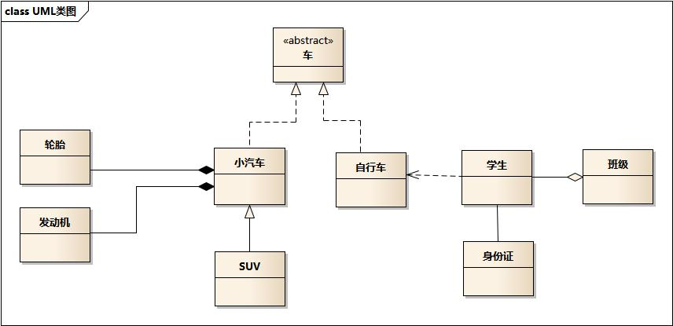

- 车的类图结构为`abstract`，表示车是一个抽象类
- 它有两个继承类：小汽车和自行车；它们之间的关系为**实现关系**，使用带空心箭头的虚线表示
- 小汽车为与SUV之间也是继承关系，它们之间的关系为**泛化关系**，使用带空心箭头的实线表示
- 小汽车与发动机之间是**组合关系**，使用带实心箭头的实线表示
- 学生与班级之间是**聚合关系**，使用带空心箭头的实线表示
- 学生与身份证之间为**关联关系**，使用一根实线表示
- 学生上学需要用到自行车，与自行车是一种**依赖关系**，使用带箭头的虚线表示

## 关系介绍

类的继承结构表现在UML中为泛化(generalize)与实现(realize)。

### 实现关系(realize)

"车"为一个抽象概念，在现实中并无法直接用来定义对象，只有指明具体的子类才可以用来定义对象。

实现关系用一条空心箭头的虚线表示，代码中表现为继承抽象类。

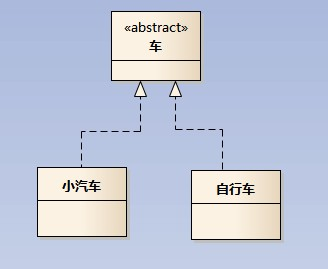

### 泛化关系(generalization)

汽车在现实中有实现，可用汽车定义具体的对象，汽车与SUV之间为泛化关系。

泛化关系用一条空心箭头的实线表示，代码中表现为继承非抽象类。

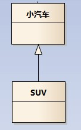

### 聚合关系(aggregation)

聚合关系用于表示实体对象之间的关系，表示整体由部分构成的语义。例如一个部门由多个员工组成。

与组合关系不同的是，整体和部分不是强依赖的，即使整体不存在了，部分仍然存在。例如，
部门撤销了，人员不会消失，他们依然存在。

聚合关系用一条空心菱形箭头的实线表示。

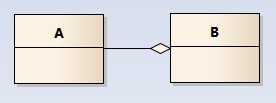

### 组合关系(composition)

与聚合关系一样，组合关系同样表示整体由部分构成的语义，比如公司由多个部门组成。

但组合关系是一种强依赖的特殊聚合关系，如果整体不存在了，则部分也不存在了。例如，
公司不存在了，部门也将不存在了。

组合关系用一条带实心菱形箭头实线表示。

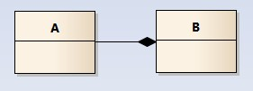

### 关联关系(association)

描述不同类的对象之间的结构关系，是一种静态关系，通常与运行状态无关，一般由常识等因素决定的。它一般用来定义对象之间静态的、天然的结构，是一种"强关联"的关系。

比如，乘车人和车票之间就是一种关联关系，学生和学校就是一种关联关系。

关联关系默认不强调方向，表示对象间相互知道。如果特别强调方向，如下图，表示A知道B，但
B不知道A。

关联关系是用一条直线表示的，在代码中通常以成员变量的形式实现的。

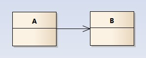

### 依赖关系(dependency)

描述一个对象在运行期间会用到另一个对象的关系。与关联关系不同的是，它是一种临时性的关系，通常在运行期间产生，并且随着运行时的变化，依赖关系也可能发生变化。

显然，依赖也有方向，双向依赖是一种非常糟糕的结构，应该总保持单向依赖，杜绝双向依赖的产生。

依赖关系是用一条带箭头的虚线表示的，在代码中，体现为类构造方法及类方法的传入参数，箭头的指向为调用关系。依赖关系除了临时知道对方外，还会"使用"对方的方法和属性。

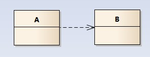

## 时序图

时序图(Sequence Diagram)是显示对象之间交互的图，这些对象是按时间顺序排列的。时序图中显示的是参与交互的对象及其对象之间消息交互的顺序。

时序图包括的建模元素主要有：对象(Actor)、生命线(Lifeline)、控制焦点(Focus of control)、消息(Message)等。

# 创建型

创建型模式对类的实例化过程进行了抽象，能够将对象的创建与对象的使用过程分离。

## 简单工厂模式( Simple Factory)

### 模式动机

在创建一个对象时不向客户暴露内部细节，并提供一个创建对象的通用接口。
### 模式定义

简单工厂模式专门定义一个类来负责创建其他类的实例，被创建的实例通常都具有共同的父类，可以根据参数的不同返回不同类的实例。
### 模式结构

包含角色

- Factory：工厂，负责实现创建所有实例的内部逻辑

- Product：抽象产品，是所创建的所有对象的父类，负责描述所有实例所共有的公共接口

- ConcreteProduct：具体产品，是创建目标，所有创建的对象都充当这个角色的某个具体类的实例

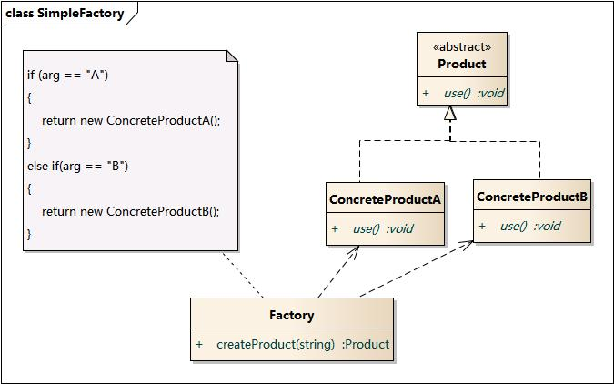

### 时序图 

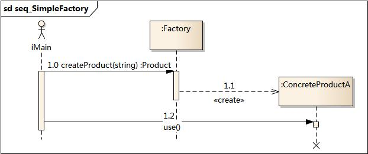

### 代码分析

```c++
#include "Factory.h"
#include "ConcreteProductA.h"
#include "ConcreteProductB.h"

Product* Factory::createProduct(string proname){
	if ( "A" == proname )
	{
		return new ConcreteProductA();
	}
	else if("B" == proname)
	{
		return new ConcreteProductB();
	}
	return  NULL;
}
```

### 优点

- 工厂类含有必要的判断逻辑，可以决定在什么时候创建哪一个产品类的实例，当需要什么，只需要传入一个正确的参数，就可以获取所需要的对象，而无须知道其创建细节
- 将对象的创建和对象本身业务处理分离可以降低系统的耦合度，使得两者修改起来都相对容易
- 通过引入配置文件，可以在不修改任何客户端代码的情况下更换和增加新的具体产品类，一定程度上提高了系统的灵活性

### 缺点

- 由于工厂类集中了所有产品创建逻辑，一旦不能正常工作，整个系统都要受到影响
- 使用简单工厂模式将会增加系统中类的个数，在一定程序上增加了系统的复杂度和理解难度
- 系统扩展困难，一旦添加新产品就不得不修改工厂逻辑，在产品类型较多时，有可能造成工厂逻辑过于复杂，不利于系统的扩展和维护
- 简单工厂模式由于使用了静态工厂方法，造成工厂角色无法形成基于继承的等级结构

### 适用环境

- 工厂类负责创建的对象比较少：由于创建的对象较少，不会造成工厂方法中的业务逻辑太过复杂
- 客户端既不需要关心创建细节，甚至连类名都不需要记住，只需要知道类型所对应的参数

### 模式应用

- JDK类库中广泛使用了简单工厂模式，如工具类java.text.DateFormat，它用于格式化一个本地日期或者时间

- Java加密技术，获取不同加密算法的密钥生成器

## 工厂方法模式(Factory Method) 

### 模式动机

先定义一个抽象工厂类，再定义具体的工厂类，它们实现在抽象工厂类中定义的方法。

### 模式定义

工厂方法模式是简单工厂模式的进一步抽象和推广。在工厂方法模式中，工厂父类负责定义创建产品对象的公共接口，而工厂子类则负责生成具体的产品对象，这样做的目的是将产品类的实例化操作延迟到工厂子类中完成，即通过工厂子类来确定究竟应该实例化哪一个具体产品。

### 模式结构 

包含角色

- Product：抽象产品，定义产品的接口
- ConcreteProduct：具体产品，实现了抽象产品接口，某种类型的具体产品由专门的具体工厂创建，它们之间往往一一对应
- Factory：抽象工厂，声明了工厂方法，用于返回一个产品，任何在模式中创建对象的工厂类都必须实现该接口
- ConcreteFactory：具体工厂，实现了抽象工厂中定义的工厂方法，并可由客户调用，返回一个具体产品类的实例

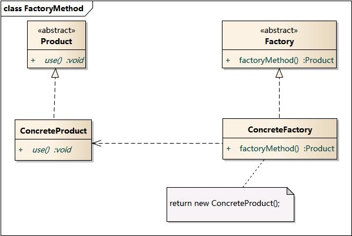

### 时序图

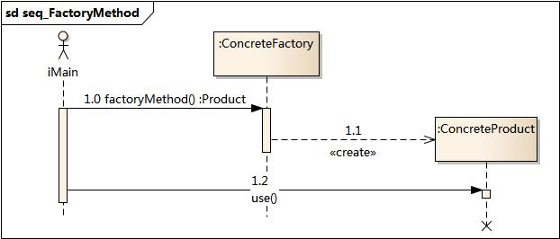

### 代码分析

```c++
#include "ConcreteFactory.h"
#include "ConcreteProduct.h"

Product* ConcreteFactory::factoryMethod(){

	return  new ConcreteProduct();
}
```

```c++
#include "Factory.h"
#include "ConcreteFactory.h"
#include "Product.h"
#include <iostream>
using namespace std;

int main(int argc, char *argv[])
{
	Factory * fc = new ConcreteFactory();
	Product * prod = fc->factoryMethod();
	prod->use();
	
	delete fc;
	delete prod;
	
	return 0;
}
```

### 模式分析

工厂方法模式是简单工厂模式的进一步抽象和推广。由于使用了面向对象的多态性，工厂方法模式保持了简单工厂模式的优点，而且克服了它的缺点。

在工厂方法模式中，核心的工厂类不再负责所有产品的创建，而是将具体创建工作交给子类去做。这个核心类仅仅负责给出具体工厂必须实现的接口，而不负责哪一个产品类被实例化这种细节，这使得工厂方法模式可以允许系统在不修改工厂角色的情况下引进新产品。

### 实例

**日志记录器**

某系统日志记录器要求支持多种日志记录方式，如文件记录、数据库记录等，且用户可以根据要求动态选择日志记录方式。

结构图

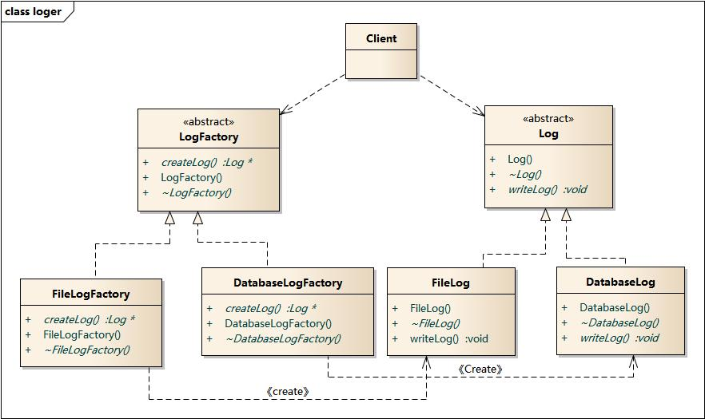

时序图

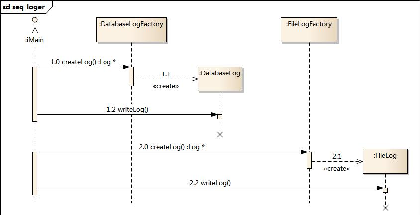

### 优点

- 在工厂方法模式中，用户只需要关心所需产品对应的工厂，无须关心创建细节，甚至无须知道具体产品类的类名
- 基于工厂角色和产品角色的多态性设计是工厂方法模式的关键。它能够使工厂可以自主确定创建何种产品对象，而如何创建这个对象的细节则完全封装在具体工厂内部
- 使用工厂方法模式的另一个优点是在系统中加入新产品时，无须修改抽象工厂和抽象产品提供的接口，无须修改客户端，也无须修改其他的具体工厂和具体产品，而只要添加一个具体工厂和具体产品就可以了。这样，系统的可扩展性也就变得非常好，完全符合"开闭原则"

### 缺点

- 在添加新产品时，需要编写新的具体产品类，而且还要提供与之对应的具体工厂类，系统中类的个数将成对增加，在一定程度上增加了系统的复杂度
- 由于考虑到系统的可扩展性，需要引入抽象层，在客户端代码中均使用抽象层进行定义，增加了系统的抽象性和理解难度

### 适用环境

- 一个类不知道它所需要的对象的类
- 一个类通过其子类来指定创建哪个对象
- 将创建对象的任务委托给多个工厂子类中的某一个，客户端在使用时无须关心是哪一个工厂子类创建产品子类，需要时再动态指定，可将具体工厂类的类名存储在配置文件或数据

### 模式扩展

- 使用多个工厂方法：在抽象工厂角色中可以定义多个工厂方法，从而使具体工厂角色实现这些不同的工厂方法，这些方法可以包含不同的业务逻辑，以满足对不同的产品对象的需求
- 产品对象的重复使用：工厂对象将已经创建过的产品保存到一个集合(如数组、List等)中，然后根据客户对产品的请求，对集合进行查询。如果有满足要求的产品对象，就直接将该产品返回客户端；如果集合中没有这样的产品对象，那么就创建一个新的满足要求的产品对象，然后将这个对象在增加到集合中，再返回给客户端
- 多态性的丧失和模式的退化：一般来说，工厂对象应当有一个抽象的父类型，当只有一个具体工厂，在具体工厂中可以创建所有的产品对象，并且工厂方法设计为静态方法时，工厂方法模式就退化成简单工厂模式

## 抽象工厂模式(Abstract Factory) 

### 模式动机

一般情况下，一个具体工厂中只有一个工厂方法或者一组重载的工厂方法。但是有时候我们需要一个工厂可以提供多个产品对象，而不是单一的产品对象。


为了更清晰地理解工厂方法模式，需要先引入两个概念

> - **产品等级结构**：产品等级结构即产品的继承结构，抽象电视机是父类，而具体品牌的电视机是其子类
>- **产品族**：在抽象工厂模式中，产品族是指由同一个工厂生产的，位于不同产品等级结构中的一组产品，如海尔电器工厂生产的海尔电视机、海尔电冰箱，海尔电视机位于电视机产品等级结构中，海尔电冰箱位于电冰箱产品等级结构中
>

当系统所提供的工厂所需生产的具体产品并不是一个简单的对象，而是多个位于不同产品等级结构中属于不同类型的具体产品时需要使用抽象工厂模式。

### 模式定义

提供一个创建一系列相关或相互依赖对象的接口，而无须指定它们具体的类。工厂方法模式针对的是一个产品等级结构，而抽象工厂模式则需要面对多个产品等级结构。

### 模式结构

包含角色

- AbstractFactory：抽象工厂，用于声明生成抽象产品的方法
- ConcreteFactory：具体工厂，实现了抽象工厂声明的生成抽象产品的方法，生成一组具体产品，这些产品构成了一个产品族，每一个产品都位于某个产品等级结构中
- AbstractProduct：抽象产品，为每种产品声明接口，在抽象产品中定义了产品的抽象业务方法
- Product：具体产品，定义具体工厂生产的具体产品对象，实现抽象产品接口中定义的业务方法

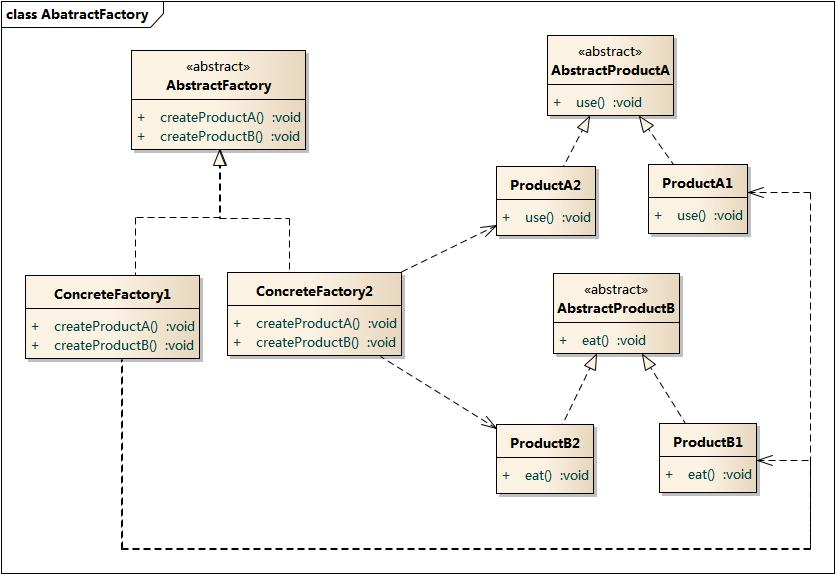

### 时序图

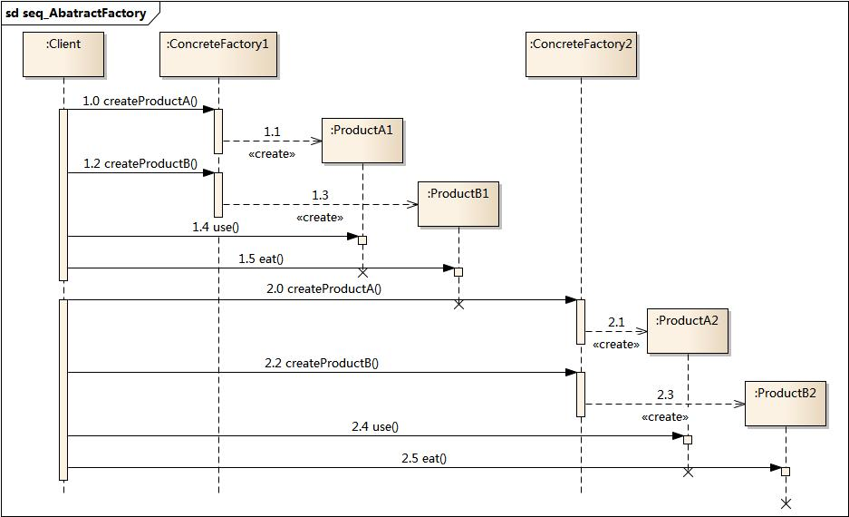

### 代码分析

```c++
#include <iostream>
#include "AbstractFactory.h"
#include "AbstractProductA.h"
#include "AbstractProductB.h"
#include "ConcreteFactory1.h"
#include "ConcreteFactory2.h"
using namespace std;

int main(int argc, char *argv[])
{
	AbstractFactory * fc = new ConcreteFactory1();
	AbstractProductA * pa =  fc->createProductA();
	AbstractProductB * pb = fc->createProductB();
	pa->use();
	pb->eat();
	
	AbstractFactory * fc2 = new ConcreteFactory2();
	AbstractProductA * pa2 =  fc2->createProductA();
	AbstractProductB * pb2 = fc2->createProductB();
	pa2->use();
	pb2->eat();
	
  return 0;
}
```

```c++
#include "ConcreteFactory1.h"
#include "ProductA1.h"
#include "ProductB1.h"
AbstractProductA * ConcreteFactory1::createProductA(){
	return new ProductA1();
}


AbstractProductB * ConcreteFactory1::createProductB(){
	return new ProductB1();
}
```

```c++
using namespace std;
void ProductA1::use(){
	cout << "use Product A1" << endl;
}
```

运行结果

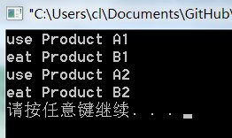

### 模式分析

- 增加产品族：对于新增加的产品族，只需要对应增加一个新的具体工厂即可，对已有代码无须做任何修改

- 对于增加新的产品等级结构，需要修改所有的工厂角色，包括抽象工厂类，在所有的工厂类中都需要增加生产新产品的方法，不能很好地支持"开闭原则"

### 优点

- 抽象工厂模式隔离了具体类的生成，使得客户并不需要知道什么被创建。由于这种隔离，更换一个具体工厂就变得相对容易。所有的具体工厂都实现了抽象工厂中定义的那些公共接口，因此只需改变具体工厂的实例，就可以在某种程度上改变整个软件系统的行为
- 当一个产品族中的多个对象被设计成一起工作时，它能够保证客户端始终只使用同一个产品族中的对象
- 增加新的具体工厂和产品族很方便，无须修改已有系统，符合"开闭原则"

### 缺点

- 增加新的产品等级结构很复杂，需要修改抽象工厂和所有的具体工厂类

### 适用环境

- 一个系统不应当依赖于产品类实例如何被创建、组合和表达的细节
- 系统中有多于一个的产品族，而每次只使用其中某一产品族
- 属于同一个产品族的产品将在一起使用
- 系统提供一个产品类的库，所有的产品以同样的接口出现，从而使客户端不依赖于具体实现

### 模式应用

在很多软件系统中需要更换界面主题，要求界面中的按钮、文本框、背景色等一起发生改变时，可以使用抽象工厂模式进行设计。

### 模式扩展

- 抽象工厂模式以一种倾斜的方式支持增加新的产品，它为新产品族的增加提供方便，但不能为新的产品等级结构的增加提供这样的方便

- 工厂模式的退化：当抽象工厂模式中每一个具体工厂类只创建一个产品对象，也就是只存在一个产品等级结构时，抽象工厂模式退化成工厂方法模式

## 建造者模式(Builder)

### 模式动机   

建造者返还给客户端的是一个已经建造完毕的完整产品对象，而用户无须关心该对象所包含的属性以及它们的组装方式，这就是建造者模式的模式动机。

### 模式定义

将一个复杂对象的构建与它的表示分离，使得同样的构建过程可以创建不同的表示。

建造者模式是一步一步创建一个复杂的对象，它允许用户只通过指定复杂对象的类型和内容就可以构建它们，用户不需要知道内部的具体构建细节。建造者模式又称生成器模式，属于对象创建型模式。

对象的创建过程独立于创建该对象的类。在建造者模式中引入了指挥者类，将创建过程封装在指挥者类中，而不在建造者类中。

### 模式结构

包含角色

- Builder：抽象建造者，创建一个产品对象的各个部件指定抽象接口
- ConcreteBuilder：具体建造者，实现了抽象建造者接口，实现各个部件的构造和装配方法，定义并明确它所创建的复杂对象，也可以提供一个方法返回创建好的复杂产品对象
- Director：指挥者，负责安排复杂对象的建造次序，指挥者与抽象建造者之间存在关联关系，可以在其construct()建造方法中调用建造者对象的部件构造与装配方法，完成复杂对象的建造
- Product：产品角色，是被构建的复杂对象，包含多个组成部件

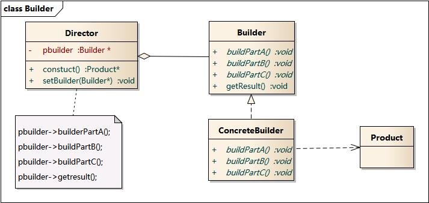

### 时序图  

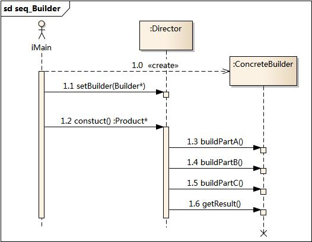

### 代码分析

```c++
#include <iostream>
#include "ConcreteBuilder.h"
#include "Director.h"
#include "Builder.h"
#include "Product.h"

using namespace std;

int main(int argc, char *argv[])
{
	ConcreteBuilder * builder = new ConcreteBuilder();
	Director  director;
	director.setBuilder(builder);
	Product * pd =  director.constuct();
	pd->show();
	
	delete builder;
	delete pd;
	return 0;
}
```

```c++
#include "ConcreteBuilder.h"


ConcreteBuilder::ConcreteBuilder(){

}


ConcreteBuilder::~ConcreteBuilder(){

}

void ConcreteBuilder::buildPartA(){
	m_prod->setA("A Style "); //不同的建造者，可以实现不同产品的建造  
}


void ConcreteBuilder::buildPartB(){
	m_prod->setB("B Style ");
}


void ConcreteBuilder::buildPartC(){
	m_prod->setC("C style ");
}
```

```c++
#include "Director.h"

Director::Director(){
}

Director::~Director(){
}

Product* Director::constuct(){
	m_pbuilder->buildPartA();
	m_pbuilder->buildPartB();
	m_pbuilder->buildPartC();
	
	return m_pbuilder->getResult();
}


void Director::setBuilder(Builder* buider){
	m_pbuilder = buider;
}
```

运行结果

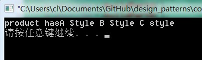

### 模式分析

抽象建造者类中定义了产品的创建方法和返回方法。

建造者模式的结构中还引入了一个指挥者类Director，该类的作用主要有两个：一方面它隔离了客户与生产过程；另一方面它负责控制产品的生成过程。

指挥者针对抽象建造者编程，客户端只需要知道具体建造者的类型，即可通过指挥者类调用建造者的相关方法，返回一个完整的产品对象

在客户端代码中，无须关心产品对象的具体组装过程，只需确定具体建造者的类型即可，建造者模式将复杂对象的构建与对象的表现分离开来，这样使得同样的构建过程可以创建出不同的表现。

### 实例

**KFC套餐**

建造者模式可以用于描述KFC如何创建套餐：套餐是一个复杂对象，它一般包含主食(如汉堡、鸡肉卷等)和饮料(如果汁、可乐等)等组成部分，不同的套餐有不同的组成部分，而KFC的服务员可以根据顾客的要求，一步一步装配这些组成部分，构造一份完整的套餐，然后返回给顾客。

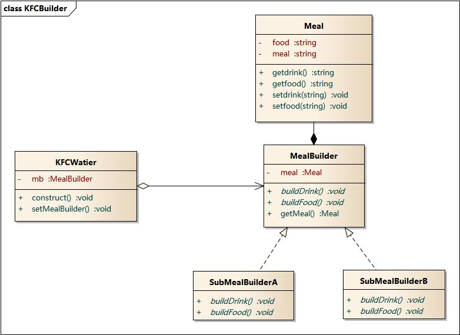

### 优点

- 在建造者模式中，客户端不必知道产品内部组成的细节，将产品本身与产品的创建过程解耦，使得相同的创建过程可以创建不同的产品对象
- 每一个具体建造者都相对独立，而与其他的具体建造者无关，因此可以很方便地替换具体建造者或增加新的具体建造者
- 将复杂产品的创建步骤分解在不同的方法中，使得创建过程更加清晰，也更方便使用程序来控制创建过程
- 增加新的具体建造者无须修改原有类库的代码，指挥者类针对抽象建造者类编程，系统扩展方便，符合"开闭原则

### 缺点  

- 建造者模式所创建的产品一般具有较多的共同点，如果产品之间的差异性很大，则不适合使用建造者模式
- 如果产品的内部变化复杂，可能会导致需要定义很多具体建造者类来实现这种变化，导致系统变得很庞大

### 适用环境

- 需要生成的产品对象有复杂的内部结构，这些产品对象通常包含多个成员属性
- 需要生成的产品对象的属性相互依赖，需要指定其生成顺序
- 隔离复杂对象的创建和使用，并使得相同的创建过程可以创建不同的产品

### 模式应用

在很多游戏软件中，地图包括天空、地面、背景等组成部分，人物角色包括人体、服装、装备等组成部分，可以使用建造者模式对其进行设计，通过不同的具体建造者创建不同类型的地图或人物。

### 模式扩展  

**简化**

- 省略抽象建造者角色：如果系统中只需要一个具体建造者的话，可以省略掉抽象建造者
- 省略指挥者角色：在具体建造者只有一个的情况下，如果抽象建造者角色已经被省略掉，那么还可以省略指挥者角色，让Builder角色扮演指挥者与建造者双重角色

建造者模式与抽象工厂模式的比较

- 与抽象工厂模式相比， 建造者模式返回一个组装好的完整产品 ，而抽象工厂模式返回一系列相关的产品，这些产品位于不同的产品等级结构，构成了一个产品族
- 在抽象工厂模式中，客户端实例化工厂类，然后调用工厂方法获取所需产品对象，而在建造者模式中，客户端可以不直接调用建造者的相关方法，而是通过指挥者类来指导如何生成对象，包括对象的组装过程和建造步骤，它侧重于一步步构造一个复杂对象，返回一个完整的对象

## 单例模式(Singleton)

### 模式动机

对于系统中的某些类来说，只有一个实例很重要，例如一个系统只能有一个计时工具或ID(序号)生成器。

如何保证一个类只有一个实例并且这个实例易于被访问呢？定义一个全局变量可以确保对象随时都可以被访问，但不能防止我们实例化多个对象。

### 模式定义

确保一个类只有一个实例，并提供该实例的全局访问点。

单例模式的要点有三个

- 某个类只能有一个实例
- 必须自行创建这个实例
- 必须自行向整个系统提供这个实例

### 模式结构

包含角色

- Singleton：单例

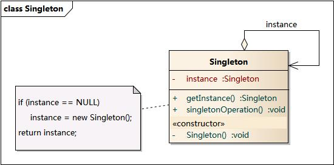

### 时序图

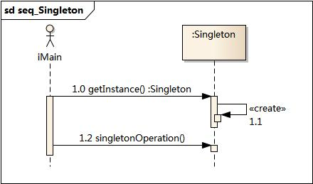

### 代码分析

```c++
#include <iostream>
#include "Singleton.h"
using namespace std;

int main(int argc, char *argv[])
{
	Singleton * sg = Singleton::getInstance();
	sg->singletonOperation();
	
	return 0;
}
```

```c++
#include "Singleton.h"
#include <iostream>
using namespace std;

Singleton * Singleton::instance = NULL;
Singleton::Singleton(){

}

Singleton::~Singleton(){
	delete instance;
}

Singleton* Singleton::getInstance(){
	if (instance == NULL)
	{
		instance = new Singleton();
	}
	
	return  instance;
}


void Singleton::singletonOperation(){
	cout << "singletonOperation" << endl;
}
```

运行结果

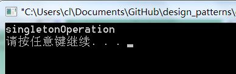

### 模式分析

单例模式的目的是保证一个类仅有一个实例，并提供一个访问它的全局访问点。单例模式包含的角色只有一个，就是单例类——Singleton。

单例类拥有一个私有构造函数，确保用户无法通过new关键字直接实例化它。除此之外，该模式中包含一个静态私有成员变量与静态公有的工厂方法，该工厂方法负责检验实例的存在性并实例化自己，然后存储在静态成员变量中，以确保只有一个实例被创建。

在单例模式的实现过程中，需要注意如下三点

- 单例类的构造函数为私有
- 提供一个自身的静态私有成员变量
- 提供一个公有的静态工厂方法

### 实例

在操作系统中，打印池(Print Spooler)是一个用于管理打印任务的应用程序，通过打印池用户可以删除、中止或者改变打印任务的优先级，在一个系统中只允许运行一个打印池对象，如果重复创建打印池则抛出异常。

### 优点

- 提供了对唯一实例的受控访问，严格控制客户怎样以及何时访问它，并为设计及开发团队提供了共享的概念
- 由于在系统内存中只存在一个对象，因此可以节约系统资源，对于一些需要频繁创建和销毁的对象，单例模式无疑可以提高系统的性能
- 允许可变数目的实例，可以基于单例模式进行扩展，使用与单例控制相似的方法来获得指定个数的对象实例

### 缺点 

- 由于单例模式中没有抽象层，因此单例类的扩展有很大的困难。
- 单例类的职责过重，因为单例类既充当了工厂角色，提供了工厂方法，同时又充当了产品角色，包含一些业务方法
- 现在很多面向对象语言(如Java、C#)的运行环境都提供了自动垃圾回收的技术，因此，如果实例化的对象长时间不被利用，系统会认为它是垃圾，会自动销毁并回收资源，下次利用时又将重新实例化，这将导致对象状态的丢失

### 适用环境   

- 系统只需要一个实例对象
- 客户调用类的单个实例只允许使用一个公共访问点，除了该公共访问点，不能通过其他途径访问该实例
- 在一个系统中要求一个类只有一个实例时才应当使用单例模式

### 模式应用

一个具有自动编号主键的表可以有多个用户同时使用，但数据库中只能有一个地方分配下一个主键编号，否则会出现主键重复，因此该主键编号生成器必须具备唯一性，可以通过单例模式来实现。

## 原型模式(Prototype)

### 模式定义

使用原型实例指定要创建对象的类型，通过复制这个原型来创建新对象。

### 模式结构

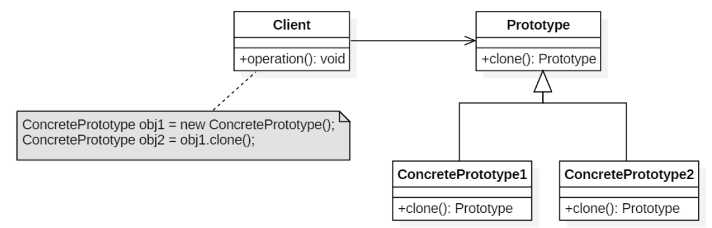

# 结构型模式   

结构型模式(Structural Pattern)描述如何将类或者对象结合在一起形成更大的结构，就像搭积木，可以通过
简单积木的组合形成复杂的、功能更为强大的结构。

结构型模式可以分为类结构型模式和对象结构型模式

- 类结构型模式关心类的组合，由多个类可以组合成一个更大的系统，在类结构型模式中一般只存在继承关系和实现关系
- 对象结构型模式关心类与对象的组合，通过关联关系使得在一个类中定义另一个类的实例对象，然后通过该对象调用其方法。

根据"合成复用原则"，在系统中尽量使用关联关系来替代继承关系，因此大部分结构型模式都是对象结构型模式。

## 适配器模式(Adapter)

### 模式动机  

在软件开发中采用类似于电源适配器的设计和编码技巧被称为适配器模式。

将一个接口转换成客户希望的另一个接口，适配器模式使接口不兼容的那些类可以一起工作。

### 模式定义   

在适配器模式中可以定义一个包装类，包装不兼容接口的对象，这个包装类指的就是适配器(Adapter)，它所包装的对象就是适配者(Adaptee)，即被适配的类。

当客户类调用适配器的方法时，在适配器类的内部将调用适配者类的方法，而这个过程对客户类是透明的，客户类并不直接访问适配者类。

适配器模式既可以作为类结构型模式，也可以作为对象结构型模式。

### 模式结构   

包含角色

- Target：目标抽象类，定义客户要用的特定领域的接口
- Adapter：适配器类，可以调用另一个接口，作为一个转换器，对适配者和抽象目标类进行适配，它是适配器模式的核心
- Adaptee：适配者类，是被适配的角色，它定义了一个已经存在的接口，这个接口需要适配
- Client：客户类，针对目标抽象类进行编程，调用在目标抽象类中定义的业务方法

两种实现

**对象适配器**

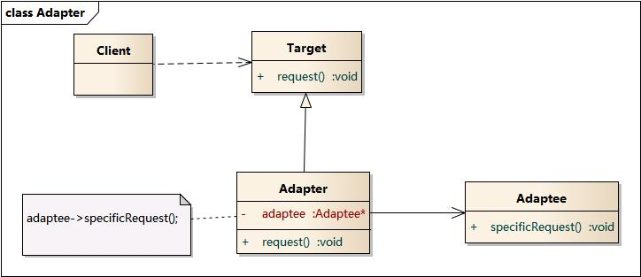

**类适配器**

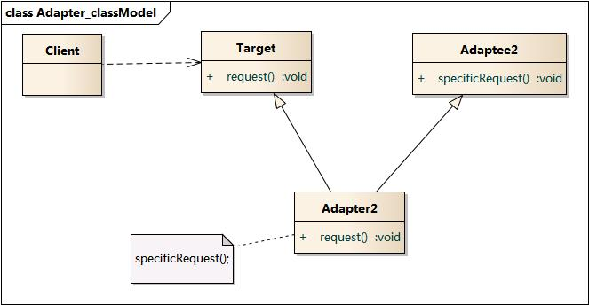

### 时序图

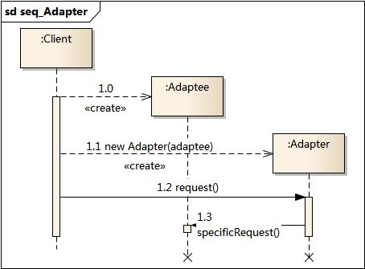

### 代码分析 

```c++
#include <iostream>
#include "Adapter.h"
#include "Adaptee.h"
#include "Target.h"

using namespace std;

int main(int argc, char *argv[])
{
	Adaptee * adaptee  = new Adaptee();
	Target * tar = new Adapter(adaptee);
	tar->request();
	
	return 0;
}
```

```c++
#include "Target.h"
#include "Adaptee.h"

class Adapter ：public Target
{

public:
	Adapter(Adaptee *adaptee);
	virtual ~Adapter();

	virtual void request();

private:
	Adaptee* m_pAdaptee;

};
```

```c++
#include "Adapter.h"

Adapter::Adapter(Adaptee * adaptee){
	m_pAdaptee =  adaptee;
}

Adapter::~Adapter(){

}

void Adapter::request(){
	m_pAdaptee->specificRequest();
}
```

```c++
class Adaptee
{

public:
	Adaptee();
	virtual ~Adaptee();

	void specificRequest();

};
```

运行结果

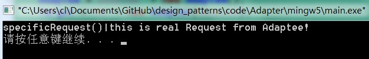

### 优点

- 将目标类和适配者类解耦，通过引入一个适配器类来重用现有的适配者类，而无须修改原有代码
- 增加了类的透明性和复用性，将具体的实现封装在适配者类中，对于客户端类来说是透明的，而且提高了适配者的复用性
- 灵活性和扩展性都非常好，通过使用配置文件，可以很方便地更换适配器，也可以在不修改原有代码的基础上增加新的适配器类，完全符合"开闭原则"
- 类适配器模式还具有如下优点：由于适配器类是适配者类的子类，因此可以在适配器类中置换一些适配者的方法，使得适配器的灵活性更强
- 对象适配器模式还具有如下优点：一个对象适配器可以把多个不同的适配者适配到同一个目标，也就是说，同一个适配器可以把适配者类和它的子类都适配到目标接口

### 缺点

- 类适配器模式的缺点如下：对于Java、C#等不支持多重继承的语言，一次最多只能适配一个适配者类，而且目标抽象类只能为抽象类，不能为具体类，其使用有一定的局限性，不能将一个适配者类和它的子类都适配到目标接口
- 对象适配器模式的缺点如下：与类适配器模式相比，要想置换适配者类的方法就不容易。如果一定要置换掉适配者类的一个或多个方法，就只好先做一个适配者类的子类，将适配者类的方法置换掉，然后再把适配者类的子类当做真正的适配者进行适配，实现过程较为复杂

### 适用环境

- 系统需要使用现有的类，而这些类的接口不符合系统的需要
- 想要建立一个可以重复使用的类，用于与一些彼此之间没有太大关联的一些类，包括一些可能在将来引进的类一起工作

### 模式扩展

当不需要全部实现接口提供的方法时，可先设计一个抽象类实现接口，并为该接口中每个方法提供一个默认实现(空方法)，那么该抽象类的子类可有选择地覆盖父类的某些方法来实现需求，它适用于一个接口不想使用其所有的方法的情况。因此也称为单接口适配器模式。

## 桥接模式(Bridge)

### 模式动机

桥接模式将继承关系转换为关联关系，从而降低了类与类之间的耦合，减少了代码编写量。

在桥接模式中，抽象化(Abstraction)与实现化(Implementation)脱耦，它们可以沿着各自的维度独立变化。

### 模式定义  

将抽象部分与它的实现部分分离，使它们都可以独立地变化。它是一种对象结构型模式，又称为柄体(Handle and Body)模式或接口(Interface)模式。

### 模式结构

- Abstraction：抽象类，定义了一个实现类接口类型的对象并可以维护该对象
- RefinedAbstraction：扩充抽象类，由抽象类定义的接口，它实现了在抽象类中定义的抽象业务方法，在扩充抽象类中可以调用在实现类接口中定义的业务方法
- Implementor：实现类接口，定义了实现类的接口，实现类接口仅提供基本操作，而抽象类定义的接口可能会做更多更复杂的操作
- ConcreteImplementor：具体实现类，实现了实现类接口并且具体实现它，在不同的具体实现类中提供基本操作的不同实现，在程序运行时，具体实现类对象将替换其父类对象，提供给客户端具体的业务操作方法

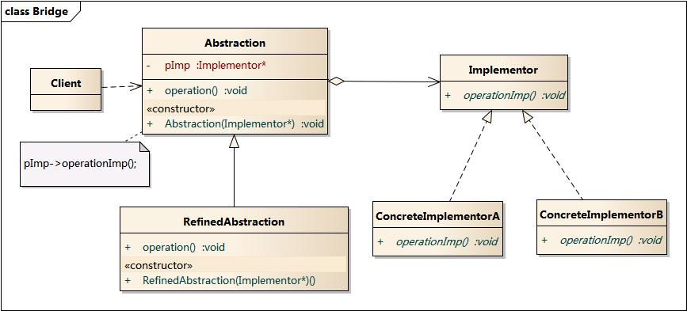

### 时序图

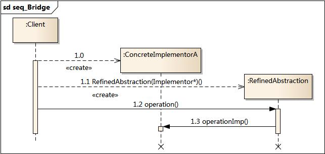

### 代码分析

```c++
#include <iostream>
#include "ConcreteImplementorA.h"
#include "ConcreteImplementorB.h"
#include "RefinedAbstraction.h"
#include "Abstraction.h"

using namespace std;

int main(int argc, char *argv[])
{
	
	Implementor * pImp = new ConcreteImplementorA();
	Abstraction * pa = new RefinedAbstraction(pImp);
	pa->operation();
	
	Abstraction * pb = new RefinedAbstraction(new ConcreteImplementorB());
	pb->operation();		
	
	delete pa;
	delete pb;
	
	return 0;
}
```

```c++
class RefinedAbstraction ：public Abstraction
{

public:
	RefinedAbstraction();
	RefinedAbstraction(Implementor* imp);
	virtual ~RefinedAbstraction();

	virtual void operation();

};
```

```c++
#include "RefinedAbstraction.h"
#include <iostream>
using namespace std;


RefinedAbstraction::RefinedAbstraction(){

}

RefinedAbstraction::RefinedAbstraction(Implementor* imp)
	:Abstraction(imp)
{
}

RefinedAbstraction::~RefinedAbstraction(){

}

void RefinedAbstraction::operation(){
	cout << "do something else ,and then " << endl;
	m_pImp->operationImp();
}
```

运行结果

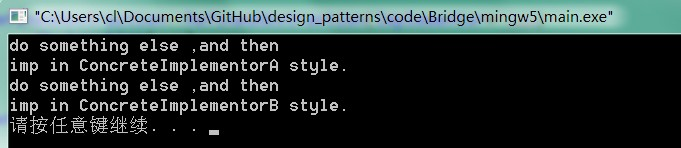

### 模式分析

理解桥接模式，重点需要理解如何将抽象化(Abstraction)与实现化(Implementation)脱耦，使得二者可以独立地变化。

- 抽象化：抽象化就是忽略一些信息，把不同的实体当作同样的实体对待。在面向对象中，将对象的共同性质抽取出来形成类的过程即为抽象化的过程
- 实现化：针对抽象化给出的具体实现，就是实现化，抽象化与实现化是一对互逆的概念，实现化产生的对象比抽象化更具体，是对抽象化事物的进一步具体化的产物
- 脱耦：脱耦就是将抽象化和实现化之间的耦合解脱开，或者说是将它们之间的强关联改换成弱关联，将两个角色之间的继承关系改为关联关系。桥接模式中的所谓脱耦，就是指在一个软件系统的抽象化和实现化之间使用**关联关系(组合或者聚合关系)而不是继承关系**，从而使两者可以相对独立地变化，这就是桥接模式的用意

### 实例

如果需要开发一个跨平台视频播放器，可以在不同操作系统平台(如Windows、Linux、Unix等)上播放多种格式的视频文件，常见的视频格式包括MPEG、RMVB、AVI、WMV等。

### 优点

- 分离抽象接口及其实现部分
- 桥接模式提高了系统的可扩充性，在两个变化维度中任意扩展一个维度，都不需要修改原有系统
- 实现细节对客户透明，可以对用户隐藏实现细节

### 缺点

- 桥接模式的引入会增加系统的理解与设计难度，由于聚合关联关系建立在抽象层，要求开发者针对抽象进行设计与编程
- 桥接模式要求正确识别出系统中两个独立变化的维度，因此其使用范围具有一定的局限性

### 适用环境

- 如果一个系统需要在构件的抽象化角色和具体化角色之间增加更多的灵活性，避免在两个层次之间建立静态的继承联系，通过桥接模式可以使它们在抽象层建立一个关联关系
- 即系统需要对抽象化角色和实现化角色进行动态耦合
- 一个类存在两个独立变化的维度，且这两个维度都需要进行扩展
- 对于那些不希望使用继承或因为多层次继承导致系统类的个数急剧增加的系统，桥接模式尤为适用

### 模式应用

一个Java桌面软件总是带有所在操作系统的视感，如果一个Java软件是在Unix系统上开发的，那么开发人员看到的是Motif用户界面的视感；在Windows上面使用这个系统的用户看到的是Windows用户界面的视感；Java语言是通过所谓的Peer架构做到这一点的。Java为AWT中的每一个GUI构件都提供了一个Peer构件，在AWT中的Peer架构就使用了桥接模式。

### 模式扩展   

适配器模式与桥接模式的联用

桥接模式和适配器模式用于设计的不同阶段，桥接模式用于系统的初步设计，对于存在两个独立变化维度的类可以将其分为抽象化和实现化两个角色，使它们可以分别进行变化；而在初步设计完成之后，当发现系统与已有类无法协同工作时，可以采用适配器模式。但有时候在设计初期也需要考虑适配器模式，特别是那些涉及到大量第三方应用接口的情况

## 装饰模式(Decorator)

### 模式动机

装饰模式可以在不需要创造更多子类的情况下，将对象的功能加以扩展。

### 模式定义

动态地给一个对象增加一些额外的职责(Responsibility)，就增加对象功能来说，装饰模式比生成子类实现更为灵活。

### 模式结构   

包含角色

- Component：抽象构件，定义了对象的接口，可以给这些对象动态增加职责(方法)
- ConcreteComponent：具体构件，定义了具体的构件对象，实现了在抽象构件中声明的方法，装饰器可以给它增加额外的职责(方法)
- Decorator：抽象装饰类，抽象构件类的子类，用于给具体构件增加职责，但是具体职责在其子类中实现
- ConcreteDecorator：具体装饰类，抽象装饰类的子类，负责向构件添加新的职责

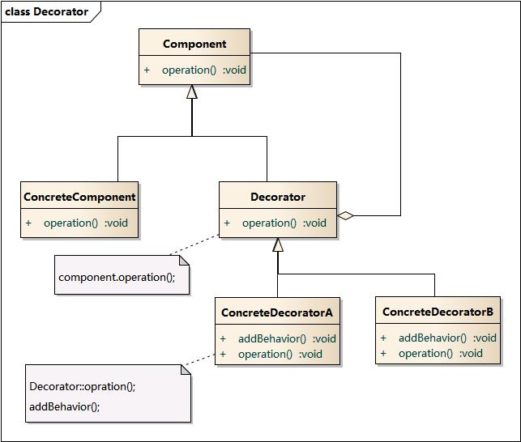

### 时序图

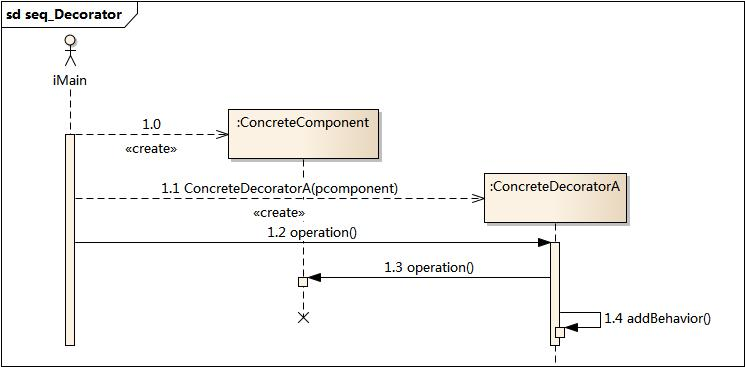

### 代码分析

```c++
#include "ConcreteComponent.h"
#include <iostream>
using namespace std;


ConcreteComponent::ConcreteComponent(){

}

ConcreteComponent::~ConcreteComponent(){

}

void ConcreteComponent::operation(){
	cout << "ConcreteComponent's normal operation!" << endl;
}
```

```c++
#include "Decorator.h"
#include "Component.h"

class ConcreteDecoratorA ：public Decorator
{

public:
	ConcreteDecoratorA(Component* pcmp);
	virtual ~ConcreteDecoratorA();

	void addBehavior();
	virtual void operation();

};
```

```c++
#include "ConcreteDecoratorA.h"
#include <iostream>
using namespace std;

ConcreteDecoratorA::ConcreteDecoratorA(Component* pcmp)
:Decorator(pcmp)
{

}

ConcreteDecoratorA::~ConcreteDecoratorA(){

}

void ConcreteDecoratorA::addBehavior(){
	cout << "addBehavior AAAA" << endl;
}


void ConcreteDecoratorA::operation(){
	Decorator::operation();
	addBehavior();
}
```

运行结果

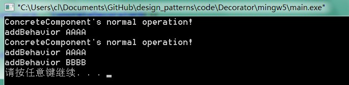

### 模式分析

- 与继承关系相比，关联关系的主要优势在于不会破坏类的封装性，而且继承是一种耦合度较大的静态关系，无法在程序运行时动态扩展。在软件开发阶段，关联关系虽然不会比继承关系减少编码量，但是到了软件维护阶段，由于关联关系使系统具有较好的松耦合性，因此使得系统更加容易维护。当然，关联关系的缺点是比继承关系要创建更多的对象
- 使用装饰模式来实现扩展比继承更加灵活，装饰模式可以在不需要创造更多子类的情况下，将对象的功能加以扩展

### 实例

**变形金刚**

变形金刚在变形之前是一辆汽车，它可以在陆地上移动。当它变成机器人之后除了能够在陆地上移动之外，还可以说话；如果需要，它还可以变成飞机，除了在陆地上移动还可以在天空中飞翔。

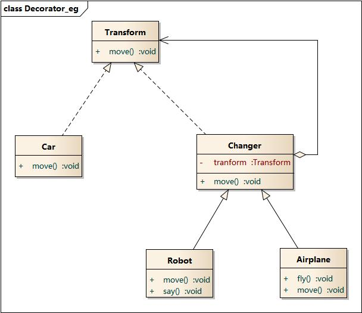

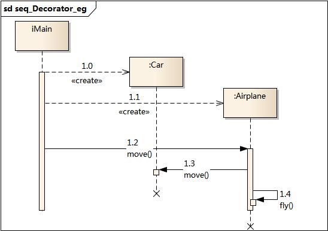

### 优点

- 装饰模式与继承关系的目的都是要扩展对象的功能，但是装饰模式可以提供比继承更多的灵活性
- 可以通过一种动态的方式来扩展一个对象的功能，通过配置文件可以在运行时选择不同的装饰器，从而实现不同的行为
- 通过使用不同的具体装饰类以及这些装饰类的排列组合，可以创造出很多不同行为的组合。可以使用多个具体装饰类来装饰同一对象，得到功能更为强大的对象
- 具体构件类与具体装饰类可以独立变化，用户可以根据需要增加新的具体构件类和具体装饰类，在使用时再对其进行组合，原有代码无须改变，符合"开闭原则"

### 缺点

- 使用装饰模式进行系统设计时将产生很多小对象，这些装饰类和小对象的产生将增加系统的复杂度，加大学习与理解的难度
- 这种比继承更加灵活机动的特性，也同时意味着装饰模式比继承更加易于出错，排错也很困难，对于多次装饰的对象，调试时寻找错误可能需要逐级排查，较为烦琐

### 适用环境

- 在不影响其他对象的情况下，以动态、透明的方式给单个对象添加职责
- 需要动态地给一个对象增加功能，这些功能也可以动态地被撤销
- 当不能采用继承的方式对系统进行扩充或者采用继承不利于系统扩展和维护时

注

1. 不能采用继承的情况主要有两类：第一类是系统中存在大量独立的扩展，为支持每一种组合将产生大量的子类，使得子类数目呈爆炸性增长；第二类是因为类定义不能继承(如final类)

### 模式扩展

装饰模式的简化需要注意的问题

- 一个装饰类的接口必须与被装饰类的接口保持相同，对于客户端来说无论是装饰之前的对象还是装饰之后的对象都可以一致对待
- 尽量保持具体构件类Component作为一个"轻"类，也就是说不要把太多的逻辑和状态放在具体构件类中，可以通过装饰类对其进行扩展
- 如果只有一个具体构件类而没有抽象构件类，那么抽象装饰类可以作为具体构件类的直接子类


## 外观模式(Facade)

### 模式定义

外部与一个子系统的通信必须通过一个统一的外观对象进行，为子系统中的一组接口提供一个一致的界面，外观模式定义了一个高层接口，这个接口使得这一子系统更加容易使用。

### 模式结构

包含角色

- Facade：外观角色，是在客户端直接调用的角色，在外观角色中可以知道相关的(一个或者多个)子系统的功能和责任，它将所有从客户端发来的请求委派到相应的子系统去，传递给相应的子系统对象处理
- SubSystem:子系统角色，在软件系统中可以同时有一个或者多个子系统角色，每一个子系统可以不是一个单独的类，而是一个类的集合，它实现子系统的功能

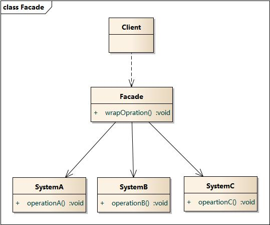

### 时序图

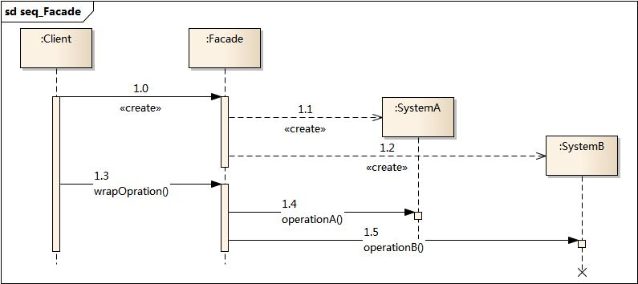

### 代码分析

```c++
#include <iostream>
#include "Facade.h"
using namespace std;

int main(int argc, char *argv[])
{
	Facade fa;
	fa.wrapOpration();
	
	return 0;
}
```

```c++
#include "SystemC.h"
#include "SystemA.h"
#include "SystemB.h"

class Facade
{

public:
	Facade();
	virtual ~Facade();

	void wrapOpration();

private:
	SystemC *m_SystemC;
	SystemA *m_SystemA;
	SystemB *m_SystemB;
};
```

```c++
#include "Facade.h"


Facade::Facade(){
	m_SystemA  = new SystemA();
	m_SystemB = new SystemB();
	m_SystemC = new SystemC();
}


Facade::~Facade(){
	delete m_SystemA;
	delete m_SystemB;
	delete m_SystemC;
}

void Facade::wrapOpration(){
	m_SystemA->operationA();
	m_SystemB->operationB();
	m_SystemC->opeartionC();
}
```

运行结果

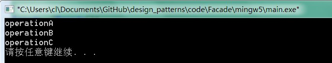

### 模式分析

在软件中将一个系统划分为若干个子系统有利于降低整个系统的复杂性，一个常见的设计目标是使子系统间的通信和相互依赖关系达到最小，而达到该目标的途径之一就是引入一个外观对象，它为子系统的访问提供了一个简单而单一的入口。

- 通过引入一个新的外观类可以降低原有系统的复杂度，同时降低客户类与子系统类的耦合度
- 外观模式要求一个子系统的外部与其内部的通信通过一个统一的外观对象进行，使得客户端只需要与外观对象打交道，而不需要与子系统内部的很多对象打交道
- 外观模式的目的在于降低系统的复杂程度

### 优点

- 对客户屏蔽子系统组件，减少了客户处理的对象数目并使得子系统使用起来更加容易
- 实现了子系统与客户之间的松耦合关系
- 降低了大型软件系统中的编译依赖性，并简化了系统在不同平台之间的移植过程
- 只是提供了一个访问子系统的统一入口，并不影响用户直接使用子系统类

### 缺点

- 不能很好地限制客户使用子系统类，如果对客户访问子系统类做太多的限制则减少了可变性和灵活性
- 在不引入抽象外观类的情况下，增加新的子系统可能需要修改外观类或客户端的源代码

### 适用环境

- 当要为一个复杂子系统提供一个简单接口时可以使用外观模式
- 客户程序与多个子系统之间存在很大的依赖性
- 在层次化结构中，可以使用外观模式定义系统中每一层的入口，层与层之间不直接产生联系，降低层之间的耦合度

### 模式扩展

一个系统有多个外观类：在外观模式中，通常只需要一个外观类，并且此外观类只有一个实例。当然这并不意味着在整个系统里只能有一个外观类，在一个系统中可以设计多个外观类，每个外观类都负责和一些特定的子系统交互，向用户提供相应的业务功能。

不要试图通过外观类为子系统增加新行为：不要通过继承一个外观类在子系统中加入新的行为，这种做法是错误的。外观模式的用意是为子系统提供一个集中化和简化的沟通渠道，而不是向子系统加入新的行为。


## 享元模式(Flyweight)

### 模式动机

享元模式通过共享技术实现相同或相似对象的重用。

- 在享元模式中可以共享的相同内容称为内部状态(Intrinsic State)，而那些需要外部环境来设置的不能共享的内容称为外部状态(Extrinsic State)，通过设置不同的外部状态使得相同的对象可以具有一些不同的特征，而相同的内部状态是可以共享的
- 在享元模式中通常会出现工厂模式，需要创建一个享元工厂来负责维护一个享元池(Flyweight Pool)用于存储具有相同内部状态的享元对象
- 在实际使用中，能够共享的内部状态是有限的，因此享元对象一般都设计为较小的对象，它所包含的内部状态较少。享元模式的目的就是使用共享技术来实现大量细粒度对象的复用

### 模式定义

运用共享技术有效地支持大量细粒度对象的复用。系统只使用少量的对象，而这些对象都很相似，状态变化很小，可以实现对象的多次复用。

由于享元模式要求能够共享的对象必须是细粒度对象，因此它又称为轻量级模式，它是一种对象结构型模式。

### 模式结构

包含角色

- Flyweight：抽象享元类，声明一个接口，通过它可以接受并作用于外部状态
- ConcreteFlyweight：具体享元类，实现了抽象享元接口，其实例称为享元对象
- UnsharedConcreteFlyweight：非共享具体享元类，是不能被共享的抽象享元类的子类
- FlyweightFactory：享元工厂类，用于创建并管理享元对象，它针对抽象享元类编程，将各种类型的具体享元对象存储在一个享元池中

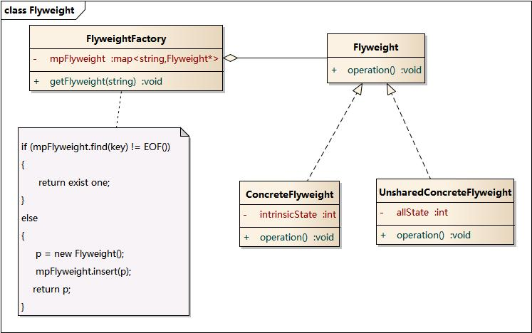

### 时序图

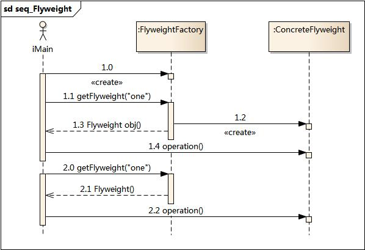

### 代码分析

```c++
#include <iostream>
#include "ConcreteFlyweight.h"
#include "FlyweightFactory.h"
#include "Flyweight.h"
using namespace std;

int main(int argc, char *argv[])
{
	FlyweightFactory factory;
	Flyweight * fw = factory.getFlyweight("one");
	fw->operation();
	
	Flyweight * fw2 = factory.getFlyweight("two");
	fw2->operation();
	//aready exist in pool
	Flyweight * fw3 = factory.getFlyweight("one");
	fw3->operation();
	return 0;
}
```

```c++
#include "FlyweightFactory.h"
#include "ConcreteFlyweight.h"
#include <iostream>
using namespace std;

FlyweightFactory::FlyweightFactory(){

}

FlyweightFactory::~FlyweightFactory(){

}

Flyweight* FlyweightFactory::getFlyweight(string str){
	map<string,Flyweight*>::iterator itr = m_mpFlyweight.find(str);
	if(itr == m_mpFlyweight.end())
	{
		Flyweight * fw = new ConcreteFlyweight(str);
		m_mpFlyweight.insert(make_pair(str,fw));
		return fw;	
	}
	else
	{
		cout << "aready in the pool,use the exist one:" << endl;
		return itr->second;
	}		
}
```

```c++
#include "Flyweight.h"
#include <string>
using namespace std;

class ConcreteFlyweight ：public Flyweight
{

public:
	ConcreteFlyweight(string str);
	virtual ~ConcreteFlyweight();

	virtual void operation();

private:
	string intrinsicState;

};
```

```c++
#include "ConcreteFlyweight.h"
#include <iostream>
using namespace std;


ConcreteFlyweight::ConcreteFlyweight(string str){
	intrinsicState = str;
}

ConcreteFlyweight::~ConcreteFlyweight(){

}

void ConcreteFlyweight::operation(){
	cout << "Flyweight[" << intrinsicState << "] do operation." << endl; 
}
```

运行结果

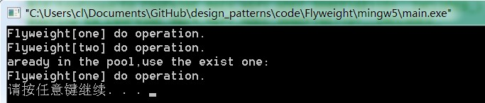

### 模式分析

享元模式是一个考虑系统性能的设计模式，通过使用享元模式可以节约内存空间，提高系统的性能。

享元模式的核心在于享元工厂类，享元工厂类的作用在于提供一个用于存储享元对象的享元池，用户需要对象时，首先从享元池中获取，如果享元池中不存在，则创建一个新的享元对象返回给用户，并在享元池中保存该新增对象。

享元模式以共享的方式高效地支持大量的细粒度对象，享元对象能做到共享的关键是区分内部状态(Internal State)和外部状态(External State)。

- 内部状态是存储在享元对象内部并且不会随环境改变而改变的状态，因此内部状态可以共享
- 外部状态是随环境改变而改变的、不可以共享的状态。享元对象的外部状态必须由客户端保存，并在享元对象被创建之后，在需要使用的时候再传入到享元对象内部

### 优点

- 可以极大减少内存中对象的数量，使得相同对象或相似对象在内存中只保存一份
- 享元模式的外部状态相对独立，而且不会影响其内部状态，从而使得享元对象可以在不同的环境中被共享

### 缺点

- 享元模式使得系统更加复杂，需要分离出内部状态和外部状态，这使得程序的逻辑复杂化
- 为了使对象可以共享，享元模式需要将享元对象的状态外部化，而读取外部状态使得运行时间变长

### 适用环境

- 一个系统有大量相同或者相似的对象，由于这类对象的大量使用，造成内存的大量耗费
- 对象的大部分状态都可以外部化，可以将这些外部状态传入对象中
- 使用享元模式需要维护一个存储享元对象的享元池，而这需要耗费资源，因此，应当在多次重复使用享元对象时才值得使用享元模式

### 模式应用

享元模式在编辑器软件中大量使用，如在一个文档中多次出现相同的图片，则只需要创建一个图片对象，通过在应用程序中设置该图片出现的位置，可以实现该图片在不同地方多次重复显示。

### 模式扩展

- 单纯享元模式：在单纯享元模式中，所有的享元对象都是可以共享的，即所有抽象享元类的子类都可共享，不存在非共享具体享元类
- 复合享元模式：将一些单纯享元使用组合模式加以组合，可以形成复合享元对象，这样的复合享元对象本身不能共享，但是它们可以分解成单纯享元对象，而后者则可以共享

享元模式与其他模式的联用

- 在享元模式的享元工厂类中通常提供一个静态的工厂方法用于返回享元对象，使用简单工厂模式来生成享元对象
- 在一个系统中，通常只有唯一一个享元工厂，因此享元工厂类可以使用单例模式进行设计
- 享元模式可以结合组合模式形成复合享元模式，统一对享元对象设置外部状态

## 代理模式(Proxy)

### 模式动机

在某些情况下，一个客户不想或者不能直接引用一个对象，此时可以通过一个称之为"代理"的第三者来实现间接引用。

代理对象可以在客户端和目标对象之间起到中介的作用，并且可以通过代理对象去掉客户不能看到的内容和服务或者添加客户需要的额外服务。

### 模式定义

给某一个对象提供一个代理，并由代理对象控制对原对象的引用。

### 模式结构

包含角色

- Subject：抽象主题角色，声明了真实主题和代理主题的共同接口
- Proxy：代理主题角色，内部包含对真实主题的引用，从而可以在任何时候操作真实主题对象
- RealSubject：真实主题角色，定义了代理角色所代表的真实对象，在真实主题角色中实现了真实的业务操作，客户端可以通过代理主题角色间接调用真实主题角色中定义的方法

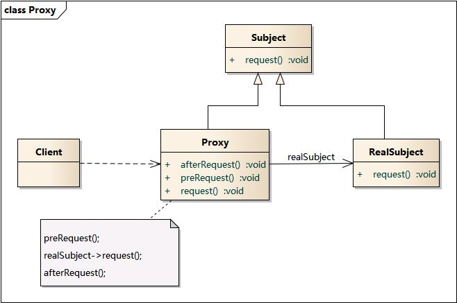

### 时序图

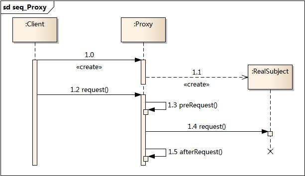

### 代码分析

```c++
#include <iostream>
#include "RealSubject.h"
#include "Proxy.h"

using namespace std;

int main(int argc, char *argv[])
{
	Proxy proxy;
	proxy.request();
	
	return 0;
}
```

```c++
#include "RealSubject.h"
#include "Subject.h"

class Proxy ：public Subject
{

public:
	Proxy();
	virtual ~Proxy();

	void request();

private:
	void afterRequest();
	void preRequest();	
	RealSubject *m_pRealSubject;

};
```

```c++
#include "Proxy.h"
#include <iostream>
using namespace std;


Proxy::Proxy(){
	m_pRealSubject = new RealSubject();
}

Proxy::~Proxy(){
	delete m_pRealSubject;
}

void Proxy::afterRequest(){
	cout << "Proxy::afterRequest" << endl;
}


void Proxy::preRequest(){
	cout << "Proxy::preRequest" << endl;
}


void Proxy::request(){
	preRequest();
	m_pRealSubject->request();
	afterRequest();
}
```

运行结果

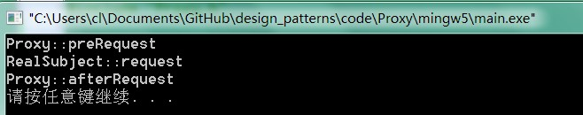

### 优点

- 代理模式能够协调调用者和被调用者，在一定程度上降低了系统的耦合度
- 远程代理使得客户端可以访问在远程机器上的对象，远程机器可能具有更好的计算性能与处理速度，可以快速响应并处理客户端请求
- 虚拟代理通过使用一个小对象来代表一个大对象，可以减少系统资源的消耗，对系统进行优化并提高运行速度
- 保护代理可以控制对真实对象的使用权限

### 缺点

- 由于在客户端和真实主题之间增加了代理对象，因此有些类型的代理模式可能会造成请求的处理速度变慢
- 实现代理模式需要额外的工作，有些代理模式的实现非常复杂

### 适用环境

- 远程(Remote)代理：为一个位于不同的地址空间的对象提供一个本地的代理对象，这个不同的地址空间可以是在同一台主机中，也可是在另一台主机中
- 虚拟(Virtual)代理：如果需要创建一个资源消耗较大的对象，先创建一个消耗相对较小的对象来表示，真实对象只在需要时才会被真正创建
- Copy-on-Write代理：它是虚拟代理的一种，把复制(克隆)操作延迟到只有在客户端真正需要时才执行
- 保护(Protect)代理：控制对一个对象的访问，可以给不同的用户提供不同级别的使用权限
- 缓冲(Cache)代理：为某一个目标操作的结果提供临时的存储空间，以便多个客户端可以共享这些结果
- 防火墙(Firewall)代理：保护目标不让恶意用户接近
- 同步化(Synchronization)代理：使几个用户能够同时使用一个对象而没有冲突
- 智能引用(Smart Reference)代理：当一个对象被引用时，提供一些额外的操作，如将此对象被调用的次数记录下来等

### 模式扩展

- 图片代理：一个很常见的代理模式的应用实例就是对大图浏览的控制。用户通过浏览器访问网页时先不加载真实的大图，而是通过代理对象的方法来进行处理，在代理对象的方法中，先使用一个线程向客户端浏览器加载一个小图片，然后在后台使用另一个线程来调用大图片的加载方法将大图片加载到客户端。当需要浏览大图片时，再将大图片在新网页中显示。如果用户在浏览大图时加载工作还没有完成，可以再启动一个线程来显示相应的提示信息。通过代理技术结合多线程编程将真实图片的加载放到后台来操作，不影响前台图片的浏览
- 远程代理：远程代理可以将网络的细节隐藏起来，使得客户端不必考虑网络的存在，远程代理对象承担了大部分的网络通信工作
- 虚拟代理：当一个对象的加载十分耗费资源的时候，虚拟代理的优势就非常明显地体现出来了。虚拟代理模式是一种内存节省技术。在应用程序启动的时候，可以用代理对象代替真实对象初始化，节省了内存的占用，并大大加速了系统的启动时间
- 动态代理是一种较为高级的代理模式。 在传统的代理模式中，客户端通过Proxy调用RealSubject类的request()方法，同时还在代理类中封装了其他方法(如preRequest()和postRequest())，可以处理一些其他问题。如果按照这种方法使用代理模式，那么真实主题角色必须是事先已经存在的，并将其作为代理对象的内部成员属性。如果一个真实主题角色必须对应一个代理主题角色，这将导致系统中的类个数急剧增加，因此需要想办法减少系统中类的个数，此外，如何在事先不知道真实主题角色的情况下使用代理主题角色，这都是动态代理需要解决的问题

## 组合模式(Composite)

### 模式定义

将对象组合成树形结构来表示“整体/部分”层次关系，允许用户以相同的方式处理单独对象和组合对象。

### 模式结构

组件(Component)类是组合类(Composite)和叶子类(Leaf)的父类，可以把组合类看成是树的中间节点。

组合对象拥有一个或者多个组件对象，因此组合对象的操作可以委托给组件对象去处理，而组件对象可以是另一个组合对象或者叶子对象。

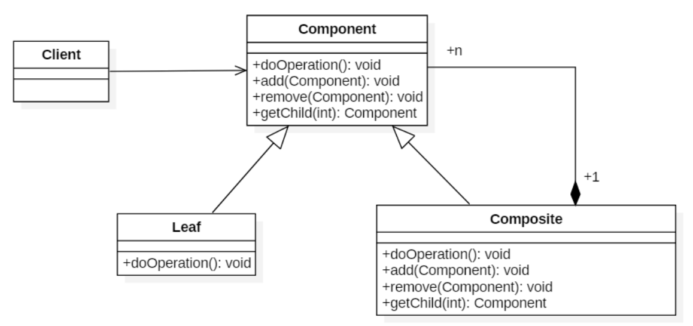

# 行为型模式   

在系统运行时，对象并不是孤立的，它们可以通过相互通信与协作完成某些复杂功能，一个对象在运行时也将影响到其他对象的运行。行为型模式不仅仅关注类和对象的结构，而且重点关注它们之间的相互作用。

行为型模式分为类行为型模式和对象行为型模式两种

- 类行为型模式：类的行为型模式使用继承关系在几个类之间分配行为，类行为型模式主要通过多态等方式来分配父类与子类的职责
- 对象行为型模式：对象的行为型模式则使用对象的聚合关联关系来分配行为，对象行为型模式主要是通过对象关联等方式来分配两个或多个类的职责

根据"合成复用原则"，系统中要尽量使用关联关系来取代继承关系，因此大部分行为型设计模式都属于对象行为型设计模式。

## 命令模式(Command)

### 模式动机

命令模式可以对发送者和接收者完全解耦，发送者与接收者之间没有直接引用关系，发送请求的对象只需要知道如何发送请求，而不必知道如何完成请求。这就是命令模式的模式动机。

### 模式定义

将一个请求封装为一个对象，从而使我们可用不同的请求对客户进行参数化。

### 模式结构

包含角色

- Command：抽象命令类，声明了用于执行请求的execute()等方法，通过这些方法可以调用请求接收者的相关操作
- ConcreteCommand：具体命令类，实现了在抽象命令类中声明的方法，它对应具体的接收者对象，将接收者对象的动作绑定其中
- Invoker：调用者，请求的发送者，又称为请求者，它通过命令对象来执行请求
- Receiver：接收者，执行与请求相关的操作，它具体实现对请求的业务处理
- Client:客户类

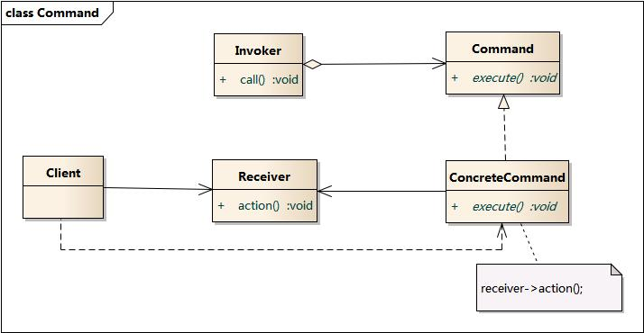

### 时序图

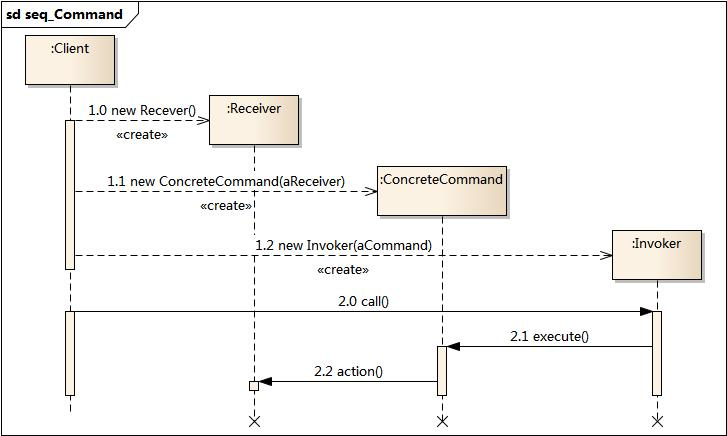

### 代码分析

```c++
#include <iostream>
#include "ConcreteCommand.h"
#include "Invoker.h"
#include "Receiver.h"

using namespace std;

int main(int argc, char *argv[])
{
	Receiver * pReceiver = new Receiver();
	ConcreteCommand * pCommand = new ConcreteCommand(pReceiver);
	Invoker * pInvoker = new Invoker(pCommand);
	pInvoker->call();
	
	delete pReceiver;
	delete pCommand;
	delete pInvoker;
	return 0;
}
```

```c++
class Receiver
{

public:
	Receiver();
	virtual ~Receiver();

	void action();

};
```

```c++
#include "Receiver.h"
#include <iostream>
using namespace std;

Receiver::Receiver(){

}

Receiver::~Receiver(){

}

void Receiver::action(){
	cout << "receiver action." << endl;
}
```

```c++
#include "Command.h"
#include "Receiver.h"

class ConcreteCommand ：public Command
{

public:
	ConcreteCommand(Receiver * pReceiver);
	virtual ~ConcreteCommand();
	virtual void execute();
private:
	Receiver *m_pReceiver;
};
```

```c++
#include "ConcreteCommand.h"
#include <iostream>
using namespace std;


ConcreteCommand::ConcreteCommand(Receiver *pReceiver){
	m_pReceiver = pReceiver;
}


ConcreteCommand::~ConcreteCommand(){

}

void ConcreteCommand::execute(){
	cout << "ConcreteCommand::execute"  << endl;
	m_pReceiver->action();
}
```

```c++
#include "Command.h"

class Invoker
{

public:
	Invoker(Command * pCommand);
	virtual ~Invoker();
	void call();

private:
	Command *m_pCommand;
};
```

```c++
#include "Invoker.h"
#include <iostream>
using namespace std;

Invoker::Invoker(Command * pCommand){
	m_pCommand = pCommand;
}

Invoker::~Invoker(){

}

void Invoker::call(){
	cout << "invoker calling" << endl;
	m_pCommand->execute();
}
```

运行结果

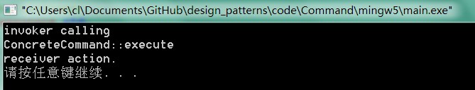

### 模式分析

命令模式的本质是对命令进行封装，将发出命令的责任和执行命令的责任分割开。

- 每一个命令都是一个操作：请求的一方发出请求，要求执行一个操作；接收的一方收到请求，并执行操作
- 命令模式允许请求的一方和接收的一方独立开来，使得请求的一方不必知道接收请求的一方的接口，更不必知道请求是怎么被接收，以及操作是否被执行、何时被执行，以及是怎么被执行的
- 命令模式使请求本身成为一个对象，这个对象和其他对象一样可以被存储和传递
- 命令模式的关键在于引入了抽象命令接口，且发送者针对抽象命令接口编程，只有实现了抽象命令接口的具体命令才能与接收者相关联

### 实例

**电视机遥控器**

电视机是请求的接收者，遥控器是请求的发送者，遥控器上有一些按钮，不同的按钮对应电视机的不同操作。抽象命令角色由一个命令接口来扮演，有三个具体的命令类实现了抽象命令接口，这三个具体命令类分别代表三种操作：打开电视机、关闭电视机和切换频道。显然，电视机遥控器就是一个典型的命令模式应用实例。

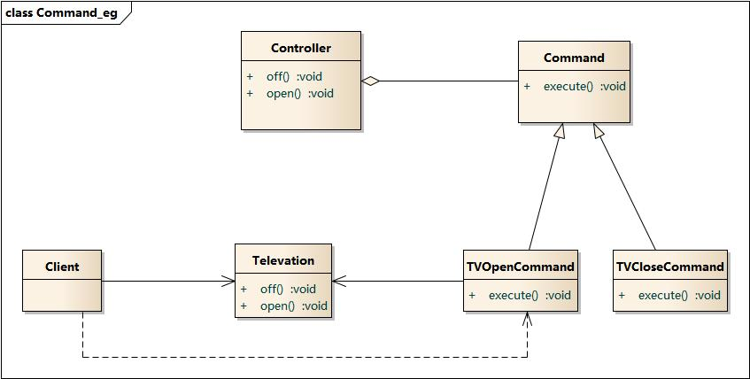

时序图

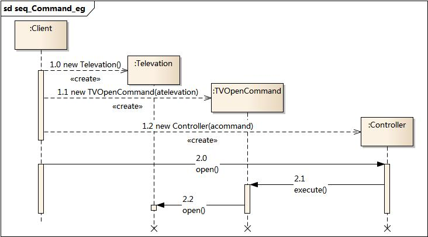

### 优点

- 降低系统的耦合度
- 新的命令可以很容易地加入到系统中
- 可以比较容易地设计一个命令队列和宏命令(组合命令)
- 可以方便地实现对请求的Undo和Redo

### 缺点

- 使用命令模式可能会导致某些系统有过多的具体命令类。因为针对每一个命令都需要设计一个具体命令类，因此某些系统可能需要大量具体命令类，这将影响命令模式的使用

### 适用环境

- 系统需要将请求调用者和请求接收者解耦，使得调用者和接收者不直接交互
- 系统需要在不同的时间指定请求、将请求排队和执行请求
- 系统需要支持命令的撤销(Undo)操作和恢复(Redo)操作
- 系统需要将一组操作组合在一起，即支持宏命

### 模式应用

很多系统都提供了宏命令功能，如UNIX平台下的Shell编程，可以将多条命令封装在一个命令对象中，只需要一条简单的命令即可执行一个命令序列，这也是命令模式的应用实例之一。

### 模式扩展

宏命令又称为组合命令，它是命令模式和组合模式联用的产物。

宏命令也是一个具体命令，不过它包含了对其他命令对象的引用，在调用宏命令的execute()方法时，将递归调用它所包含的每个成员命令的execute()方法，一个宏命令的成员对象可以是简单命令，还可以继续是宏命令。执行一个宏命令将执行多个具体命令，从而实现对命令的批处理。

## 中介者模式(Mediator)

### 模式动机

对于一个模块，可能由很多对象构成，而且这些对象之间可能存在相互的引用，为了减少对象两两之间复杂的引用关系，使之成为一个松耦合的系统，我们需要使用中介者模式，这就是中介者模式的模式动机。

### 模式定义

用一个中介对象来封装一系列的对象交互，中介者使各对象不需要显式地相互引用，从而使其耦合松散，而且可以独立地改变它们之间的交互。

每一个同事对象在需要和其他同事对象通信时，先与中介者通信，通过中介者来间接完成与其他同事类的通信。

### 模式结构
- Mediator：抽象中介者，用于定义一个接口，该接口用于与各同事对象之间的通信
- ConcreteMediator：具体中介者，是抽象中介者的子类，通过协调各个同事对象来实现协作行为，了解并维护它的各个同事对象的引用
- Colleague：抽象同事类，定义各同事的公有方法
- ConcreteColleague：具体同事类，实现了在抽象同事类中定义的方法

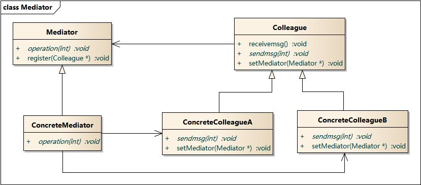

### 时序图

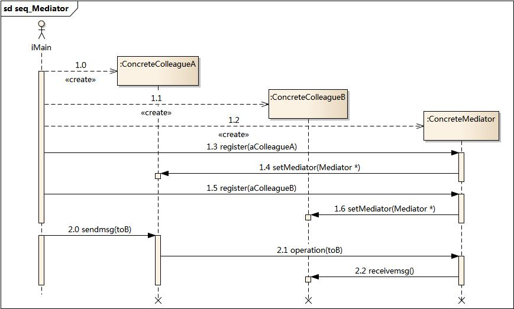

### 代码分析

```C++
#include <iostream>
#include "ConcreteColleagueA.h"
#include "ConcreteMediator.h"
#include "ConcreteColleagueB.h"

using namespace std;

int main(int argc, char *argv[])
{
	ConcreteColleagueA * pa = new ConcreteColleagueA();
	ConcreteColleagueB * pb = new ConcreteColleagueB();
	ConcreteMediator * pm = new ConcreteMediator();
	pm->registered(1,pa);
	pm->registered(2,pb);
	
	// sendmsg from a to b
	pa->sendmsg(2,"hello,i am a");
	// sendmsg from b to a
	pb->sendmsg(1,"hello,i am b");
	
	delete pa,pb,pm;
	return 0;
}
```

```C++
#include "ConcreteColleagueB.h"
#include "Mediator.h"
#include "ConcreteColleagueA.h"
#include <map>
using namespace std;
class ConcreteMediator : public Mediator
{

public:
	ConcreteMediator();
	virtual ~ConcreteMediator();

	virtual void operation(int nWho,string str);
	virtual void registered(int nWho, Colleague * aColleague);
private:
	map<int,Colleague*> m_mpColleague;
};
```

```C++
#include "ConcreteMediator.h"
#include <map>
#include <iostream>
using namespace std;

ConcreteMediator::ConcreteMediator(){

}

ConcreteMediator::~ConcreteMediator(){

}

void ConcreteMediator::operation(int nWho,string str){
	map<int,Colleague*>::const_iterator itr = m_mpColleague.find(nWho);
	if(itr == m_mpColleague.end())
	{
		cout << "not found this colleague!" << endl;
		return;
	}
	
	Colleague* pc = itr->second;
	pc->receivemsg(str);
}


void ConcreteMediator::registered(int nWho,Colleague * aColleague){
	map<int,Colleague*>::const_iterator itr = m_mpColleague.find(nWho);
	if(itr == m_mpColleague.end())
	{
		m_mpColleague.insert(make_pair(nWho,aColleague));
		//同时将中介类暴露给colleague 
		aColleague->setMediator(this);
	}
}
```

```C++
#include "Colleague.h"

class ConcreteColleagueA : public Colleague
{

public:
	ConcreteColleagueA();
	virtual ~ConcreteColleagueA();

	virtual void sendmsg(int toWho,string str);
	virtual void receivemsg(string str);

};
```

```C++
#include "ConcreteColleagueA.h"
#include <iostream>
using namespace std;

ConcreteColleagueA::ConcreteColleagueA(){
}

ConcreteColleagueA::~ConcreteColleagueA(){
}

void ConcreteColleagueA::sendmsg(int toWho,string str){
	cout << "send msg from colleagueA,to:" << toWho << endl;
	m_pMediator->operation(toWho,str);
}

void ConcreteColleagueA::receivemsg(string str){
	cout << "ConcreteColleagueA reveivemsg:" << str <<endl;
}
```

运行结果

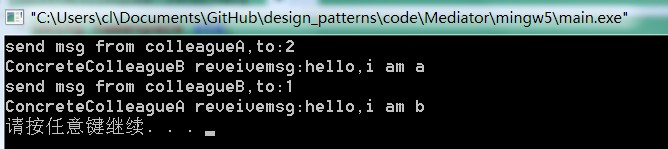

### 模式分析

中介者模式可以使对象之间的关系数量急剧减少。

通过引入中介者对象，可以将系统的网状结构变成以中介者为中心的星形结构。中介者类是中介者模式的核心，它对整个系统进行控制和协调，简化了对象之间的交互，还可以对对象间的交互进行进一步的控制。中介者承担了中转作用和协调作用。

- 中转作用(结构性)：通过中介者提供的中转作用，各个同事对象就不再需要显式引用其他同事，当需要和其他同事进行通信时，通过中介者即可
- 协调作用(行为性)：中介者可以更进一步的对同事之间的关系进行封装，同事可以一致地和中介者进行交互，而不需要指明中介者需要具体怎么做，中介者根据封装在自身内部的协调逻辑，对同事的请求进行进一步处理，将同事成员之间的关系行为进行分离和封装

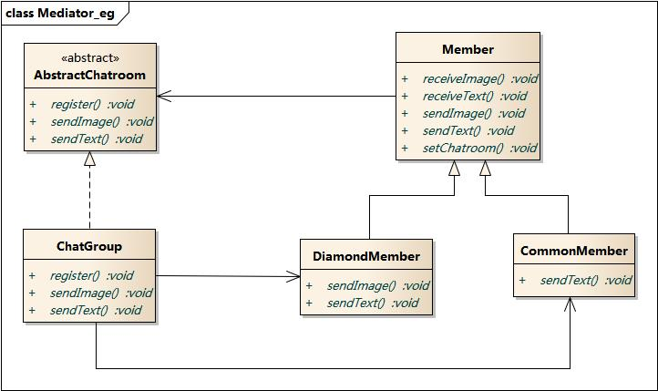

时序图

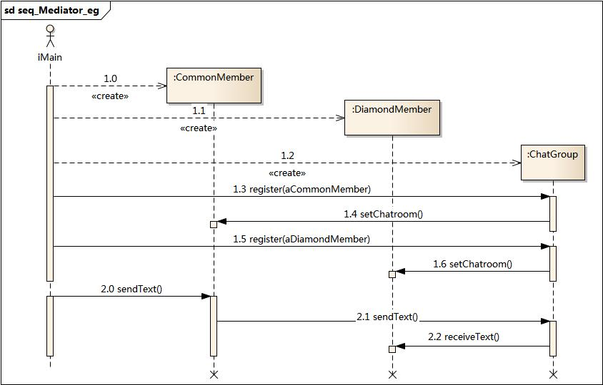

### 实例

**虚拟聊天室**

某论坛系统欲增加一个虚拟聊天室，允许论坛会员通过该聊天室进行信息交流，普通会员可以给其他会员发送文本信息，钻石会员既可以给其他会员发送文本信息，还可以发送图片信息。该聊天室可以对不雅字符进行过滤，如"日"等字符；还可以对发送的图片大小进行控制。

### 优点

- 简化了对象之间的交互
- 将各同事解耦
- 减少子类生成
- 可以简化各同事类的设计和实现

### 缺点

- 在具体中介者类中包含了同事之间的交互细节，可能会导致具体中介者类非常复杂，使得系统难以维护

### 适用环境

- 系统中对象之间存在复杂的引用关系，产生的相互依赖关系结构混乱且难以理解
- 一个对象由于引用了其他很多对象并且直接和这些对象通信，导致难以复用该对象
- 想通过一个中间类来封装多个类中的行为，而又不想生成太多的子类。可以通过引入中介者类来实现，在中介者中定义对象
- 交互的公共行为，如果需要改变行为则可以增加新的中介者类

### 模式扩展

中介者模式与GUI开发

- 中介者模式可以方便地应用于图形界面(GUI)开发中，在比较复杂的界面中可能存在多个界面组件之间的交互关系
- 对于这些复杂的交互关系，可以引入一个中介者类，将这些交互的组件作为具体的同事类，将它们之间的引用和控制关系交由中介者负责，在一定程度上简化系统的交互，这也是中介者模式的常见应用之一

## 观察者模式(Observer)

### 模式动机

建立一种对象与对象之间的依赖关系，一个对象发生改变时将自动通知其他对象，其他对象将相应做出反应。

发生改变的对象称为观察目标，而被通知的对象称为观察者，一个观察目标可以对应多个观察者，而且这些观察者之间没有相互联系，可以根据需要增加和删除观察者，使得系统更易于扩展，这就是观察者模式的模式动机。

### 模式定义

定义对象间的一种一对多依赖关系，使得每当一个对象状态发生改变时，其相关依赖对象皆得到通知并被自动更新。观察者模式又叫做发布-订阅(Publish/Subscribe)模式。

### 模式结构

包含角色

- Subject：目标，又称为主题，它是指被观察的对象
- ConcreteSubject：具体目标，包含有经常发生改变的数据，当它的状态发生改变时，向它的各个观察者发出通知
- Observer：观察者，将对观察目标的改变做出反应
- ConcreteObserver：具体观察者，维护一个指向具体目标对象的引用，它存储具体观察者的有关状态，这些状态需要和具体目标的状态保持一致

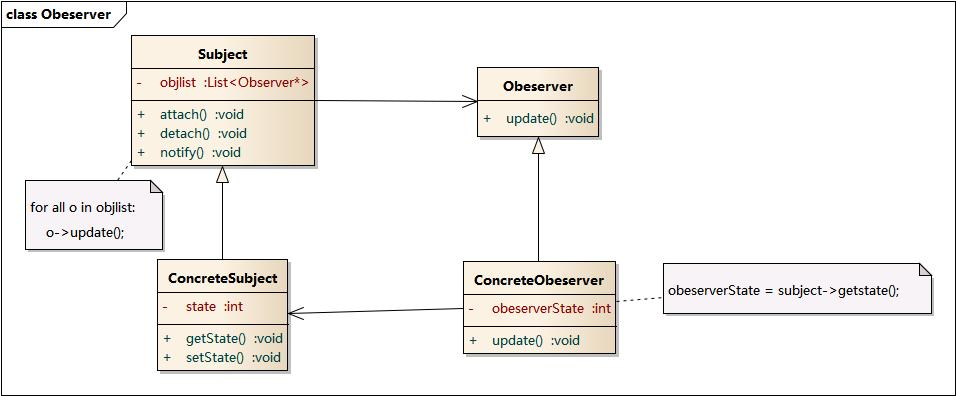

### 时序图

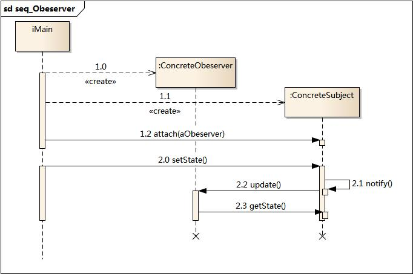

### 代码分析

```c++
#include <iostream>
#include "Subject.h"
#include "Obeserver.h"
#include "ConcreteObeserver.h"
#include "ConcreteSubject.h"

using namespace std;

int main(int argc, char *argv[])
{
	Subject * subject = new ConcreteSubject();
	Obeserver * objA = new ConcreteObeserver("A");
	Obeserver * objB = new ConcreteObeserver("B");
	subject->attach(objA);
	subject->attach(objB);
	
	subject->setState(1);
	subject->notify();
	
	cout << "--------------------" << endl;
	subject->detach(objB);
	subject->setState(2);
	subject->notify();
	
	delete subject;
	delete objA;
	delete objB;
		
	return 0;
}
```

```c++
#include "Obeserver.h"
#include <vector>
using namespace std;

class Subject
{

public:
	Subject();
	virtual ~Subject();
	Obeserver *m_Obeserver;

	void attach(Obeserver * pObeserver);
	void detach(Obeserver * pObeserver);
	void notify();
		
	virtual int getState() = 0;
	virtual void setState(int i)= 0;
	
private:
	vector<Obeserver*> m_vtObj;

};
```

```c++
#include "Subject.h"

Subject::Subject(){

}

Subject::~Subject(){

}

void Subject::attach(Obeserver * pObeserver){
	m_vtObj.push_back(pObeserver);
}

void Subject::detach(Obeserver * pObeserver){
	for(vector<Obeserver*>::iterator itr = m_vtObj.begin();
		itr != m_vtObj.end(); itr++)
	{
		if(*itr == pObeserver)
		{
			m_vtObj.erase(itr);
			return;
		}			
	}
}

void Subject::notify(){
	for(vector<Obeserver*>::iterator itr = m_vtObj.begin();
		itr != m_vtObj.end();
	 	itr++)
	{	
		(*itr)->update(this);		
	}
}
```

```c++
class Subject;

class Obeserver
{

public:
	Obeserver();
	virtual ~Obeserver();
	virtual void update(Subject * sub) = 0;
};
```

```c++
#include "Obeserver.h"
#include <string>
using namespace std;

class ConcreteObeserver : public Obeserver
{

public:
	ConcreteObeserver(string name);
	virtual ~ConcreteObeserver();
	virtual void update(Subject * sub);

private:
	string m_objName;
	int m_obeserverState;
};
```

```c++
#include "ConcreteObeserver.h"
#include <iostream>
#include <vector>
#include "Subject.h"
using namespace std;

ConcreteObeserver::ConcreteObeserver(string name){
	m_objName = name;
}

ConcreteObeserver::~ConcreteObeserver(){

}

void ConcreteObeserver::update(Subject * sub){
	m_obeserverState = sub->getState();
	cout << "update oberserver[" << m_objName << "] state:" << m_obeserverState << endl;
}
```

运行结果

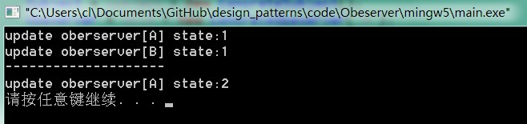

### 模式分析

- 一个目标可以有任意数目的与之相依赖的观察者，一旦目标的状态发生改变，所有的观察者都将得到通知
- 作为对这个通知的响应，每个观察者都将即时更新自己的状态，以与目标状态同步，这种交互也称为发布-订阅。目标是通知的发布者，它发出通知时并不需要知道谁是它的观察者，可以有任意数目的观察者订阅它并接收通知

### 优点

- 观察者模式可以实现表示层和数据逻辑层的分离，并定义了稳定的消息更新传递机制，抽象了更新接口，使得可以有各种各样不同的表示层作为具体观察者角色
- 观察者模式支持广播通信

### 缺点

- 如果一个观察目标对象有很多直接和间接的观察者的话，将所有的观察者都通知到会花费很多时间
- 如果在观察者和观察目标之间有循环依赖的话，观察目标会触发它们之间进行循环调用，可能导致系统崩溃
- 观察者模式没有相应的机制让观察者知道所观察的目标对象是怎么发生变化的，而仅仅只是知道观察目标发生了变化

### 适用环境

- 一个抽象模型有两个方面，其中一个方面依赖于另一个方面。将这些方面封装在独立的对象中使它们可以各自独立地改变和复用
- 一个对象的改变将导致其他一个或多个对象也发生改变，而不知道具体有多少对象将发生改变
- 一个对象必须通知其他对象，而并不知道这些对象是谁
- 需要在系统中创建一个触发链，A对象的行为将影响B对象，B对象的行为将影响C对象......，可以使用观察者模式创建一种链式触发机制

### 模式应用

观察者模式在软件开发中应用非常广泛，如某电子商务网站可以在执行发送操作后给用户多个发送商品打折信息，某团队战斗游戏中某队友牺牲将给所有成员提示等等，凡是涉及到一对一或者一对多的对象交互场景都可以使用观察者模式。

### 模式扩展

**MVC模式**

MVC模式是一种架构模式，它包含三个角色：模型(Model)，视图(View)和控制器(Controller)。观察者模式可以用来实现MVC模式，观察者模式中的观察目标就是MVC模式中的模型(Model)，而观察者就是MVC中的视图(View)，控制器(Controller)充当两者之间的中介者(Mediator)。当模型层的数据发生改变时，视图层将自动改变其显示内容。

## 状态模式(State)

### 模式动机

在很多情况下，一个对象的行为取决于一个或多个动态变化的属性，这样的属性叫做状态，这样的对象叫做有状态的(stateful)对象，这样的对象状态是从事先定义好的一系列值中取出的。

当一个这样的对象与外部事件产生互动时，其内部状态就会改变，从而使得系统的行为也随之发生变化。

### 模式定义

允许一个对象在其内部状态改变时改变它的行为，对象看起来似乎修改了它的类。

### 模式结构

包含角色

- Context：环境类，又称为上下文类，它是拥有状态的对象，在环境类中维护一个抽象状态类State的实例，这个实例定义当前状态，在具体实现时，它是一个State子类的对象，可以定义初始状态
- State：抽象状态类，用于定义一个接口以封装与环境类的一个特定状态相关的行为
- ConcreteState：具体状态类，是抽象状态类的子类，每一个子类实现一个与环境类的一个状态相关的行为，每一个具体状态类对应环境的一个具体状态，不同的具体状态类其行为有所不同

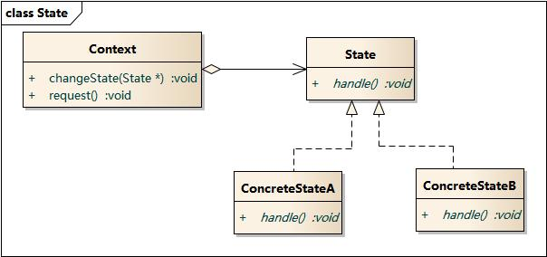

### 时序图

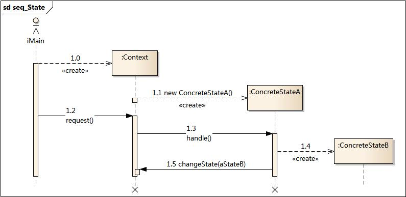


### 代码分析

```c++
#include <iostream>
#include "Context.h"
#include "ConcreteStateA.h"
#include "ConcreteStateB.h"

using namespace std;

int main(int argc, char *argv[])
{
	char a = '0';
	if('0' == a)
		cout << "yes" << endl;
	else
		cout << "no" << endl;
	
	Context * c = new Context();
	c->request();
	c->request();
	c->request();

	delete c;
	return 0;
}
```

```c++
class Context
{

public:
	Context();
	virtual ~Context();

	void changeState(State * st);
	void request();

private:
	State *m_pState;
};
```

```c++
#include "Context.h"
#include "ConcreteStateA.h"

Context::Context(){
	//default is a
	m_pState = ConcreteStateA::Instance();
}

Context::~Context(){
}

void Context::changeState(State * st){
	m_pState = st;
}

void Context::request(){
	m_pState->handle(this);
}
```

```c++
#include "State.h"

class ConcreteStateA : public State
{

public:
	virtual ~ConcreteStateA();
	
	static State * Instance();
	
	virtual void handle(Context * c);

private:
	ConcreteStateA();
	static State * m_pState;
};
```

```c++
#include "ConcreteStateA.h"
#include "ConcreteStateB.h"
#include "Context.h"
#include <iostream>
using namespace std;

State * ConcreteStateA::m_pState = NULL;
ConcreteStateA::ConcreteStateA(){
}

ConcreteStateA::~ConcreteStateA(){
}

State * ConcreteStateA::Instance()
{
	if ( NULL == m_pState)
	{
		m_pState = new ConcreteStateA();
	}
	return m_pState;
}

void ConcreteStateA::handle(Context * c){
	cout << "doing something in State A.\n done,change state to B" << endl;
	c->changeState(ConcreteStateB::Instance());
}
```

运行结果

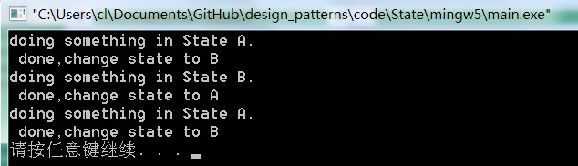

### 模式分析

- 状态模式描述了对象状态的变化以及对象如何在每一种状态下表现出不同的行为
- 状态模式的关键是引入了一个抽象类来专门表示对象的状态，这个类我们叫做抽象状态类，而对象的每一种具体状态类都继承了该类，并在不同具体状态类中实现了不同状态的行为，包括各种状态之间的转换
- 环境类实际上就是拥有状态的对象，环境类有时候可以充当状态管理器(State Manager)的角色，可以在环境类中对状态进行切换操作

抽象状态类可以是抽象类，也可以是接口，不同状态类就是继承这个父类的不同子类，状态类的产生是由于环境类存在多个状态，同时还满足两个条件

1. 这些状态经常需要切换
2. 在不同的状态下对象的行为不同

因此可以将不同对象下的行为单独提取出来封装在具体的状态类中，使得环境类对象在其内部状态改变时可以改变它的行为，对象看起来似乎修改了它的类，而实际上是由于切换到不同的具体状态类实现的。

### 实例

**TCPConnection**

这个示例来自《设计模式》，展示了一个简化版的TCP协议实现。TCP连接的状态有多种可能，状态之间的转换有相应的逻辑前提。这是使用状态模式的场合。

状态图


结构图

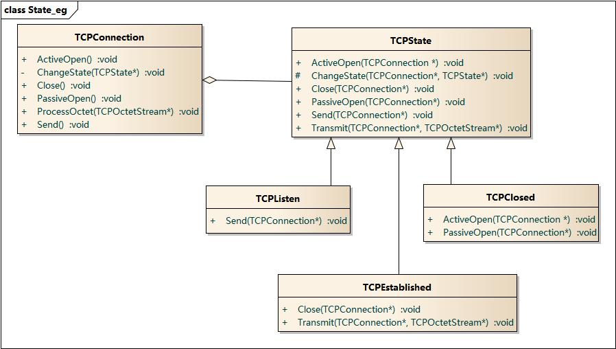

时序图

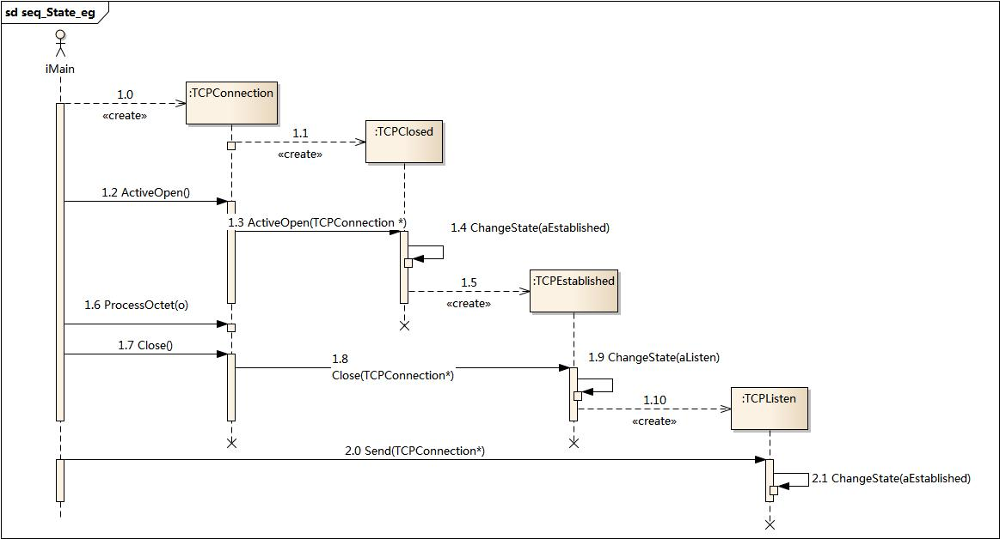

### 优点

- 封装了转换规则
- 枚举可能的状态，在枚举状态之前需要确定状态种类
- 将所有与某个状态有关的行为放到一个类中，并且可以方便地增加新的状态，只需要改变对象状态即可改变对象的行为
- 允许状态转换逻辑与状态对象合成一体，而不是某一个巨大的条件语句块
- 可以让多个环境对象共享一个状态对象，从而减少系统中对象的个数

### 缺点

- 状态模式的使用必然会增加系统类和对象的个数
- 状态模式的结构与实现都较为复杂，如果使用不当将导致程序结构和代码的混乱
- 对于可以切换状态的状态模式，增加新的状态类需要修改那些负责状态转换的源代码，否则无法切换到新增状态；而且修改某个状态类的行为也需修改对应类的源代码

### 适用环境

- 对象的行为依赖于它的状态(属性)并且可以根据它的状态改变而改变它的相关行为
- 代码中包含大量与对象状态有关的条件语句，这些条件语句的出现，会导致代码不能方便地增加和删除状态。在这些条件语句中包含了对象的行为，而且这些条件对应于对象的各种状态

### 模式应用

状态模式在工作流或游戏等类型的软件中得以广泛使用，甚至可以用于这些系统的核心功能设计，如在政府OA办公系统中，一个批文的状态有多种：尚未办理、正在办理、正在批示、正在审核、已经完成等各种状态，而且批文状态不同时对批文的操作也有所差异。使用状态模式可以描述工作流对象(如批文)的状态转换以及不同状态下它所具有的行为。

### 模式扩展

- 在有些情况下多个环境对象需要共享同一个状态，如果希望在系统中实现多个环境对象实例共享一个或多个状态对象，那么需要将这些状态对象定义为环境的静态成员对象
- 简单状态模式：简单状态模式是指状态都相互独立，状态之间无须进行转换的状态模式，这是最简单的一种状态模式。对于这种状态模式，每个状态类都封装与状态相关的操作，而无须关心状态的切换，可以在客户端直接实例化状态类，然后将状态对象设置到环境类中。如果是这种简单的状态模式，它遵循"开闭原则"，在客户端可以针对抽象状态类进行编程，而将具体状态类写到配置文件中，同时增加新的状态类对原有系统也不造成任何影响
- 可切换状态的状态模式：大多数的状态模式都是可以切换状态的状态模式，在实现状态切换时，在具体状态类内部需要调用环境类Context的setState()方法进行状态的转换操作，在具体状态类中可以调用到环境类的方法，因此状态类与环境类之间通常还存在关联关系或者依赖关系。通过在状态类中引用环境类的对象来回调环境类的setState()方法实现状态的切换。在这种可以切换状态的状态模式中，增加新的状态类可能需要修改其他某些状态类甚至环境类的源代码，否则系统无法切换到新增状态

## 策略模式(Strategy)

### 模式动机

实现某一个功能有多个途径，此时可以使用一种设计模式来使得系统可以灵活地选择解决途径，也能够方便地增加新的解决途径。

定义一些独立的类来封装不同的算法，每一个类封装一个具体的算法，在这里，每一个封装算法的类我们都可以称之为策略(Strategy)，为了保证这些策略的一致性，一般会用一个抽象的策略类来做算法的定义，而具体每种算法则对应于一个具体策略类。

### 模式定义

定义一系列算法，将每一个算法封装起来，并让它们可以相互替换。策略模式让算法独立于使用它的客户而变化。

### 模式结构

包含角色

- Context：环境类,在解决某个问题时可以采用多种策略，在环境类中维护一个对抽象策略类的引用实例
- Strategy：抽象策略类，为所支持的算法声明了抽象方法，是所有策略类的父类
- ConcreteStrategy：具体策略类，实现了在抽象策略类中定义的算法

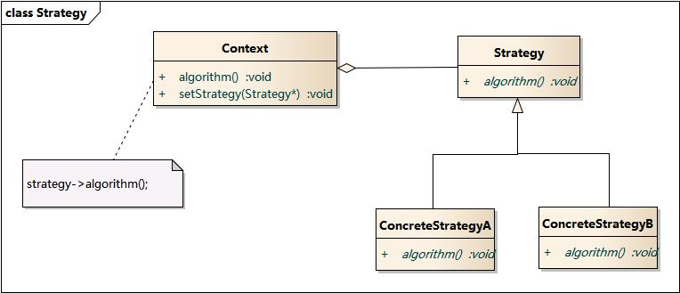

### 时序图

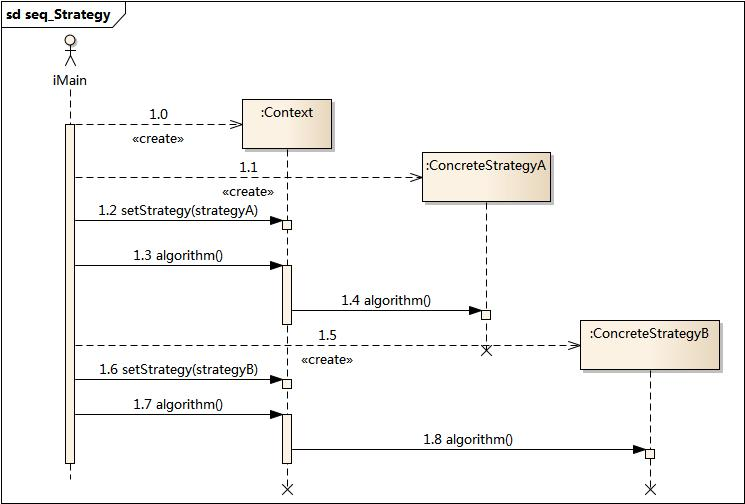

### 代码分析

```c++
#include <iostream>
#include "Context.h"
#include "ConcreteStrategyA.h"
#include "ConcreteStrategyB.h"
#include "Strategy.h"
#include <vector>
using namespace std;

int main(int argc, char *argv[])
{
	Strategy * s1 = new ConcreteStrategyA();
	Context * cxt = new Context();
	cxt->setStrategy(s1);
	cxt->algorithm();

	Strategy *s2 = new ConcreteStrategyB();
	cxt->setStrategy(s2);
	cxt->algorithm();
	
	delete s1;
	delete s2;
	
	int rac1 = 0x1;
	int rac2 = 0x2;
	int rac3 = 0x4;
	int rac4 = 0x8;
	
	int i = 0xe;
	int j = 0x5;

	int r1 = i & rac1;
	int r2 = i & rac2;
	int r3 = i & rac3;
	int r4 = i & rac4;
	
	cout <<"res:" << r1 << "/" << r2 << "/" << r3 << "/" << r4 << endl;
	
	return 0;
}
```

```c++
#include "Strategy.h"

class Context
{

public:
	Context();
	virtual ~Context();
	

	void algorithm();
	void setStrategy(Strategy* st);
	
private:
	Strategy *m_pStrategy;

};
```

```c++
#include "Context.h"

Context::Context(){
}

Context::~Context(){
}

void Context::algorithm(){
	m_pStrategy->algorithm();
}

void Context::setStrategy(Strategy* st){
	m_pStrategy = st;
}
```

```c++
#include "Strategy.h"

class ConcreteStrategyA : public Strategy
{

public:
	ConcreteStrategyA();
	virtual ~ConcreteStrategyA();

	virtual void algorithm();

};
```

```c++
#include "ConcreteStrategyA.h"
#include <iostream>
using namespace std;

ConcreteStrategyA::ConcreteStrategyA(){

}

ConcreteStrategyA::~ConcreteStrategyA(){

}

void ConcreteStrategyA::algorithm(){
	cout << "use algorithm A" << endl;
}
```

运行结果

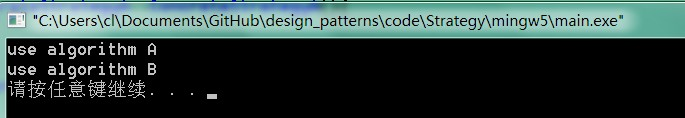

### 模式分析

- 策略模式是对算法的封装，它把算法的责任和算法本身分割开，委派给不同的对象管理
- 在策略模式中，应当由客户端自己决定在什么情况下使用什么具体策略角色
- 策略模式仅仅封装算法，提供新算法插入到已有系统中，以及老算法从系统中"退休"的方便，策略模式并不决定在何时使用何种算法，算法的选择由客户端来决定

### 优点

- 用户可以在不修改原有系统的基础上选择算法或行为，也可以灵活地增加新的算法或行为
- 策略模式提供了管理相关的算法族的办法
- 策略模式提供了可以替换继承关系的办法
- 使用策略模式可以避免使用多重条件转移语句

### 缺点

- 客户端必须知道所有的策略类，并自行决定使用哪一个策略类
- 策略模式将造成产生很多策略类，可以通过使用享元模式在一定程度上减少对象的数量

### 适用环境

- 如果在一个系统里面有许多类，它们之间的区别仅在于它们的行为，那么使用策略模式可以动态地让一个对象在许多行为中选择一种行为
- 一个系统需要动态地在几种算法中选择一种
- 如果一个对象有很多的行为，如果不用恰当的模式，这些行为就只好使用多重的条件选择语句来实现
- 不希望客户端知道复杂的、与算法相关的数据结构，在具体策略类中封装算法和相关的数据结构，提高算法的保密性与安全性

### 模式扩展

- 可以通过环境类状态的个数来决定是使用策略模式还是状态模式
- 策略模式的环境类自己选择一个具体策略类，具体策略类无须关心环境类；而状态模式的环境类由于外在因素需要放进一个具体状态中，以便通过其方法实现状态的切换，因此环境类和状态类之间存在一种双向的关联关系
- 使用策略模式时，客户端需要知道所选的具体策略是哪一个，而使用状态模式时，客户端无须关心具体状态，环境类的状态会根据用户的操作自动转换
- 如果系统中某个类的对象存在多种状态，不同状态下行为有差异，而且这些状态之间可以发生转换时使用状态模式；如果系统中某个类的某一行为存在多种实现方式，而且这些实现方式可以互换时使用策略模式

## 责任链模式(Chain Of Responsibility)

### 模式定义

使多个对象都有机会处理请求，从而避免请求的发送者和接收者之间的耦合关系。将这些对象连成一条链，并沿着这条链发送该请求，直到有一个对象处理它为止。

### 模式结构

- Handler：定义处理请求的接口，并且实现后继链(successor)

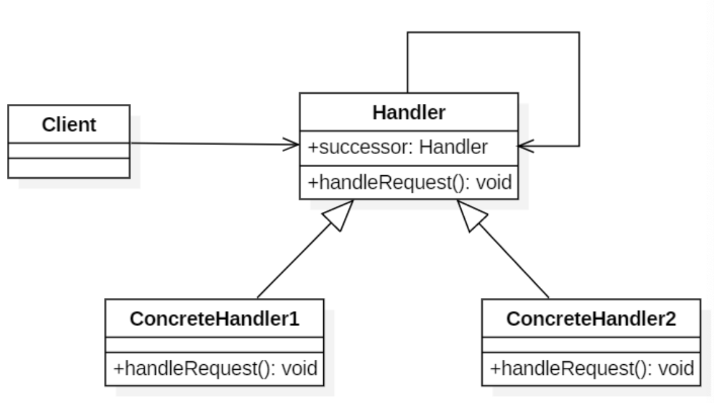

## 解释器(Interpreter)

### 模式定义

为语言创建解释器，通常由语言的语法和语法分析来定义。

### 模式结构

- TerminalExpression：终结符表达式，每个终结符都需要一个 TerminalExpression
- Context：上下文，包含解释器之外的一些全局信息
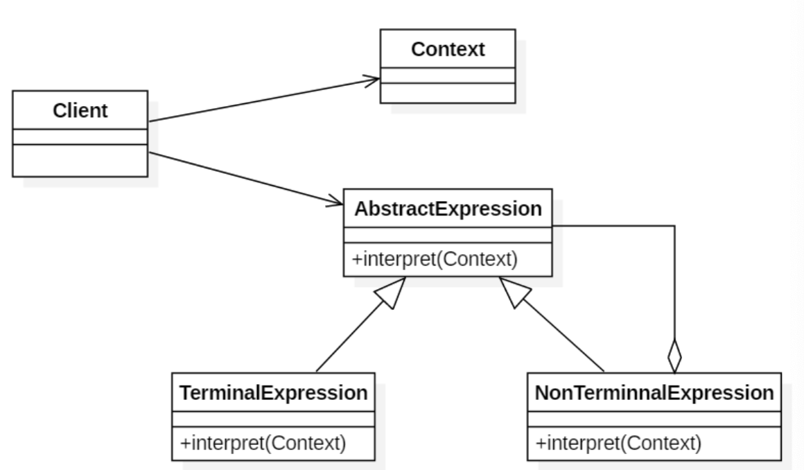
## 迭代器(Iterator)

### 模式定义

提供一种顺序访问聚合对象元素的方法，并且不暴露聚合对象的内部表示。

### 模式结构

- Aggregate 是聚合类，其中 createIterator() 方法可以产生一个 Iterator
- Iterator 主要定义了 hasNext() 和 next() 方法
- Client 组合了 Aggregate，为了迭代遍历 Aggregate，也需要组合 Iterator

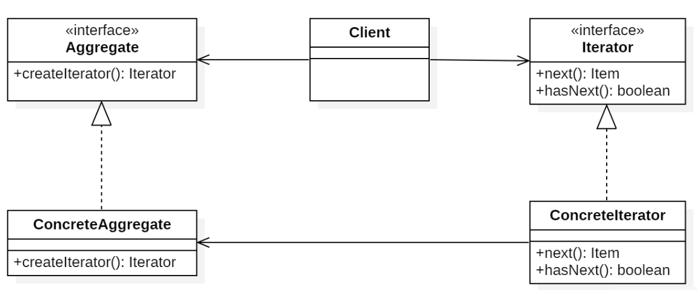

## 备忘录(Memento)

### 模式定义

在不违反封装的情况下获得对象的内部状态，从而在需要时可以将对象恢复到最初状态。

### 模式结构

- Originator：原始对象
- Caretaker：负责保存好备忘录
- Memento：备忘录，存储原始对象的状态。

备忘录实际上有两个接口，一个是提供给 Caretaker 的窄接口：它只能将备忘录传递给其它对象；一个是提供给 Originator 的宽接口，允许它访问到先前状态所需的所有数据。理想情况是只允许 Originator 访问本备忘录的内部状态。

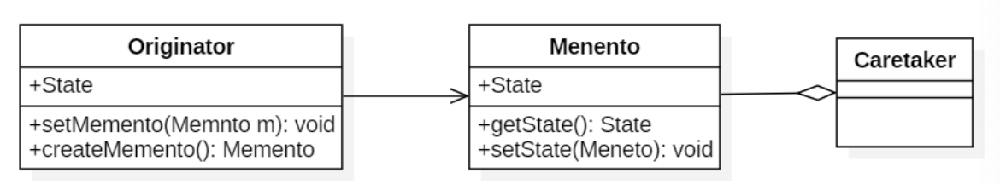

## 模板方法(Template Method)

### 模式定义

定义算法框架，并将一些步骤的实现延迟到子类。

通过模板方法，子类可以重新定义算法的某些步骤，而不用改变算法的结构。

### 模式结构

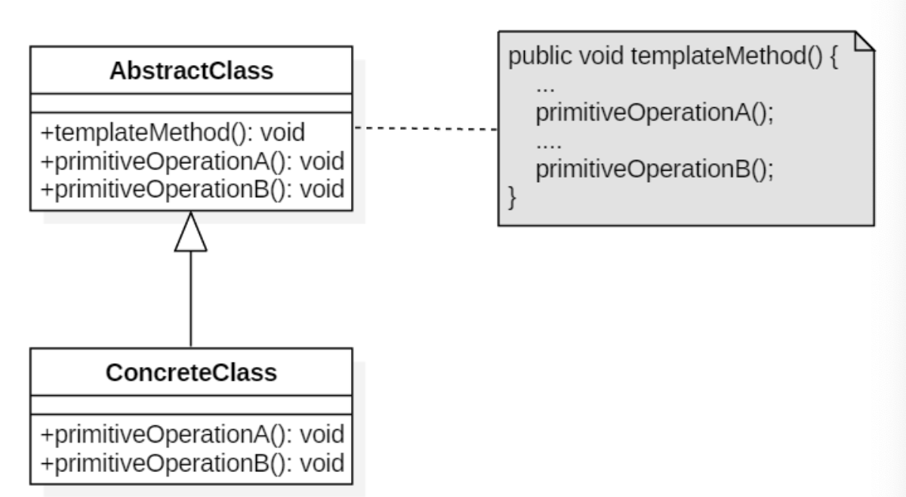

## 访问者(Visitor)

### 模式定义

为一个对象结构（比如组合结构）增加新能力。

### 模式结构

- Visitor：访问者，为每一个 ConcreteElement 声明一个 visit 操作
- ConcreteVisitor：具体访问者，存储遍历过程中的累计结果
- ObjectStructure：对象结构，可以是组合结构，或者是一个集合

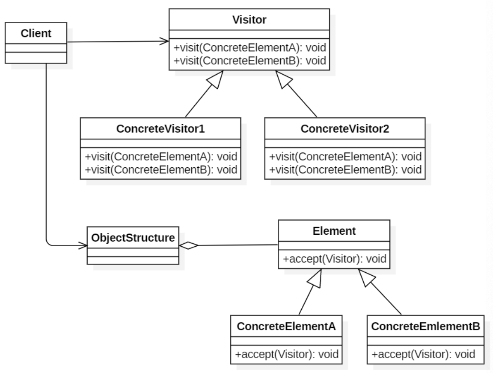

## 空对象(Null)

### 模式定义

使用什么都不做的空对象来代替 NULL。

一个方法返回 NULL，意味着方法的调用端需要去检查返回值是否是 NULL，这么做会导致非常多的冗余的检查代码。并且如果某一个调用端忘记了做这个检查返回值，而直接使用返回的对象，那么就有可能抛出空指针异常。

### 模式结构

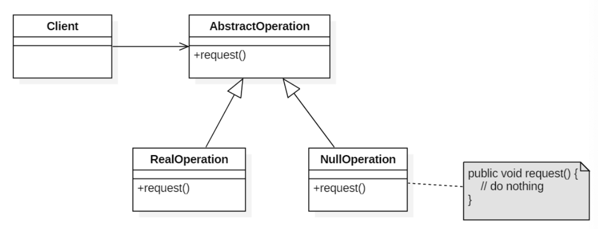
