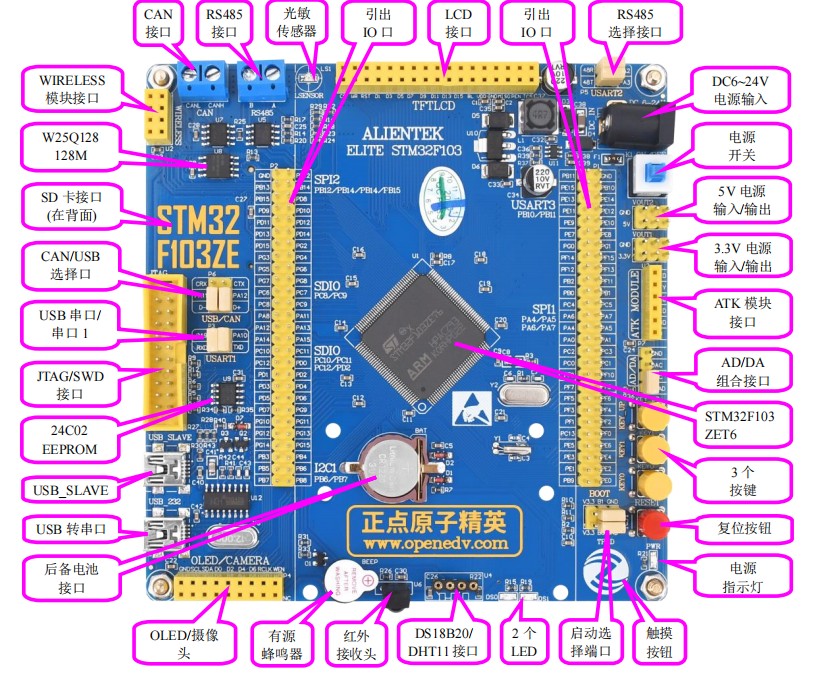
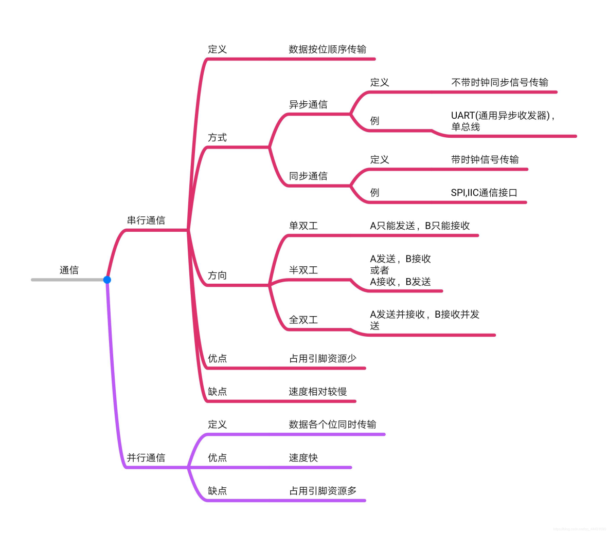
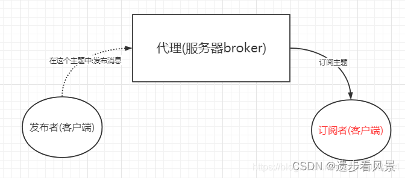

智能晾衣

[toc]

# 整体设计

## 硬件

MCU（单片机）采用STM32精英板，整体分为三个模块

- 信息采集模块：采集环境数据如温湿度、降雨量、光照、人体红-外检测等，供后续处理

- 设备处理模块：主要包括风扇、舵机（模拟窗户）、步进电机 （模拟晾衣杆）、led（模拟照明灯和警报灯）、蜂鸣器等，来根 据获取的信息做出相应的动作

- 通信模块：使用ESP-01S WiFi模块连接精英版的串口1，并通过AT 指令连接WiFi，之后向阿里云物联网平台发送AT+MQTT指令进行 MQTT消息的发布与订阅。通信时固定间隔发布Topic，订阅消息 时则通过串口1的中断程序进行接收数据

注

1. 设备分具有自动模式，如自动模式下当检测湿度过高时会打开窗户、开启风扇，同时风扇转速随湿度增大而递增
2. 当在一定范围内检测到人体时，晾衣杆会自动下降，等离开后再自动上升，方便晾衣
3. 当检测到下雨时，会自动关闭窗户

## 软件

采用安卓APP，通过阿里云物联网平台提供的SDK（实质为封装好的MQTT类）来与物联网平台进行Topic的订阅与发布。最后项目打包成.apk文件，在安卓手机进行下载安装。

## 阿里云物联网平台

使用物模型，为产品定义对应的属性（LED等、窗户、风扇等），随后硬件与APP均订阅发布自己设备的物模型Topic，两者Topic消息的交互是通过配置云产品流转解析器实现的。

# 芯片分类

- MPU (Microprocessor Unit, 微处理器单元)： MPU 是一种侧重于数据处理的芯片，不直接集成外围设备（如内存、外设控制器等），而是通过外部接口与这些组件相连，如CPU
- MCU (Microcontroller Unit, 微控制器单元)： MCU，也常被称为单片机，是将CPU、存储器（RAM、ROM或Flash）、外设接口（如串行端口、定时器、ADC/DAC、GPIO（通用输入/输出）等）集成在同一块硅片上的芯片。MCU设计用于实现特定的嵌入式控制应用，STM32系列是MCU的一个典型例子
- DSP (Digital Signal Processor, 数字信号处理器)： DSP专为高速实时信号处理设计，如音频、视频处理、通信系统中的信号编码解码、图像处理等。与一般CPU相比，具有更高的并行处理能力和更快的乘法累加运算速度
- SoC (System on Chip, 片上系统):：SoC是将一个完整的系统集成在单一芯片上，包括一个或多个处理器（可以是CPU、MCU、MPU或DSP）、内存、接口控制器以及其他模块（如GPU、通信模块等）。广泛应用于智能手机、平板电脑、物联网设备等

注

1. RAM(Random Access Memory, 随机存取存储器)，是一种易失性存储器，数据掉电丢失，随机读写速度快，常被用于主存
2. ROM (Read-Only Memory, 只读存储器)，是一种非易失性存储器，数据掉电不丢失，常用于存储系统数据
3. Flash Memory(闪存)，是一种非易失性存储器，即使无电也可长期保存数据，并且允许被多次擦除和重写，常用于固态硬盘

# STM32精英板

正点原子STM32F103ZET6（MCU），具有丰富的I/O引脚（约110个），在不接外设的情况下满足项目功能需求。

## 引脚模式

### 输入模式

- 模拟输入：将离散电压信号转换为数字值（通过ADC实现）

- 浮空输入：引脚的电平由外部电路决定

- 上拉输入：内部上拉电阻激活，当无外部信号时，默认状态为高电平

- 下拉输入：内部下拉电阻激活，当无外部信号时，默认状态为低电平

### 输出模式

- 推挽输出：可驱动负载至高电平或低电平

- 开漏输出：引脚只能拉低输出，需要外部上拉电阻才能实现高电平输出

### 复用功能输出

- 复用推挽输出：与推挽输出相同，不过由复用外设控制输出

- 复用开漏输出：与开漏输出相同，不过由复用外设控制输出

注

1. 电源到器件引脚上的电阻叫上拉电阻，作用是使该引脚为高电平

2. 地到器件引脚上的电阻叫下拉电阻，作用是使该引脚为低电平

#  Keil uvision5

是一个集成开发环境，用于对嵌入式系统中的微控制器进行编程，在项目编程中，主要使用C、C++以及少部分汇编语言进行编写。

# 串行通信接口

## UART

- 一种异步、全双工的串行通信协议
- 按字节传输数据，TxD信号线发送信号，RxD信号线接收信号
- 传输速度为几百bps到1.5Mbps

## USB

- 一种高速、通用的串行总线标准
- 支持热插拔
- 能够同时提供电力（5V）和数据传输（一般为几十到几百Mbps）
- 连接方便，易于扩展

## I2C

- 一个同步、半双工的串行通信接口
- 由数据线SDA和时钟线SCL组成
- 支持多主控或多从设备配置
- 片内通信
- 传输速率为0\--3.4Mbps

## SPI

- 一种同步、全双工的通信协议
- 使用四条线（MISO, MOSI, SCK,CS分别为数据发送、数据接收、时钟和片选）进行通信
- 一主多从
- 最大数据传输率为5Mbps

## CAN

- 一种用于实时应用的串行通信协议
- 具有错误检测和校正功能，可靠通信
- 使用差分信号（CAN-H和CAN-L）
- 支持多主结构
- 速度可达1Mbitps

# 中断程序

CPU停下当前的工作任务，转而去处理其他事情，处理完后回来继续执行刚才的任务。

## 中断分类

### 外部中断

- 可屏蔽中断：主要来自外部设备如硬盘，打印机等。此类中断并不会影响系统运行，可随时处理

- 不可屏蔽中断：如电源掉电，硬件线路故障等

### 内部中断(软中断，异常)

- 陷阱：是一种有意的，预先安排的异常事件
- 故障：在引起故障的指令被执行，但还没有执行结束时，CPU检测到的一类的意外事件，如物理页不存在、除数为0
- 终止：出现了CPU无法执行的硬件故障，如控制器出错、存储器校验错等

## 中断处理过程

1.  接收中断请求：指中断源(引起中断的事件或设备)向CPU发出请求中断的要求

2.  关中断：进入不响应中断状态，防止现场保存不完整，无法正确恢复断点

3.  保存断点和现场

4.  判别中断源，在多个中断源同时请求中断的情况下，转向优先权最高中断服务程序

5.  开中断，允许更高级中断请求得到响应，实现中断嵌套

6.  执行中断服务程序

7.  退出中断。即关中断，恢复现场、恢复断点，然后开中断，返回中断前原程序

# 无线通信技术

## 无线保真技术（Wireless Fidelity，WiFi）

一种允许电子设备连接到一个无线局域网的技术。

-   频段：主要使用2.4GHz和5GHz两个频段

-   传输距离：一般在100-300米范围内

-   数据速率：常见的是300Mbps至1Gbps

-   功耗：相对较高，适合高数据速率需求，如视频流、大文件传输

-   应用：家庭、办公室、公共场所的宽带无线接入，支持多设备同时连接

## 蓝牙（Blue tooth）

-   频段：工作在2.4GHz频段，全球通用

-   传输距离：一般范围2-30米

-   数据速率：约1-2Mbps

-   功耗：低功耗设计，适合短距离、间歇性数据传输

-   应用：耳机、智能手表、智能家居设备之间的短距离无线连接

## ZigBee

-   频段：工作在2.4GHz、868MHz和915MHz三个频道上

-   传输距离：约10-100米，可进行组网

-   数据速率：较低，一般为250kbps

-   功耗：极低，适合长期运行的电池供电设备

ZigBee网络中节点类型

1.  协调器：网络的中心节点，负责网络的发起组织、网络维护和管理功能

2.  路由器：负责数据的路由（指导报文转发的路径信息）转发

3.  终端节点：在网络的最边缘，负责数据的采集、设备的控制等外围功能，只进行本节点数据的发送和接收

#  MQTT

一种基于发布（发送消息）/订阅（接收消息）模式的轻量级通讯协议，该协议构建于TCP/IP协议上。

MQTT建立客户端到服务器的连接，提供两者之间的一个有序的、无损的、基于字节流的双向传输。作为一种低开销、低带宽占用的即时通讯协议，在物联网有广泛应用。

## 三种身份

包含发布者、代理、订阅者，其中，消息的发布者和订阅者都是客户端，消息代理则是是服务器。

-   MQTT客户端：订阅、发布消息

-   MQTT服务器端：接受来自客户端的网络连接；接收客户端发布的消息，进行处理后向订阅对应topic的客户端进行消息转发

## 传输的消息

传输的消息主要包含主题(Topic)和负载(payload)两部分

- Topic：可以理解为消息的类型，订阅者订阅对应topic后，就会收到该主题的消息内容

- payload：可以理解为消息的内容，指订阅者具体接收到的内容

## MQTTfx

使用Java语言编写的MQTT客户端工具。通过Topic订阅和发布消息，用来前期和物联网云平台(MQTT代理)进行连接调试。

# 指令集架构-ISA

一个处理器支持的指令和指令的字节级编码。

-   专用ISA模型

-   通用ISA模型

-   复杂指令集计算机模型（Complex Instruction Set Computing，CISC）

-   精简指令集计算机模型（Reduced Instruction Set Computing，RISC）

# AT指令

一系列用于控制和通信的指令集，主要用于串行通信设备。

# ESP-01S

一款基于ESP8266芯片的WiFi模块，低成本、低功耗。

# Android

## 介绍

一种基于Linux的开源的操作系统。

## Android Studio

进行安卓开发的主流工具，主要使用java编写，项目自动化建构工具默认使用gradle。

### 像素（pixel）单位

- px：像素单位，1px代表屏幕上的一个物理的像素点。但px单位不被建议使用，因为同样像素大小的图片在不同手机显示的实际大小可能不同

-   dp：虚拟像素，在不同的分辨率的设备上会自动适配

-   sp：针对于字体而言，会根据用户的字体大小来缩放

注

1.  使用px作为单位的，在不同的设备中会显示不同的效果；使用dp作为单位的，会根据不同的设备进行转化，适配不同机型，使视觉效果相同

2.  使用sp作为字体大小单位,会随着系统的字体大小改变；而dp作为单位则不会。所以在字体大小的数值要使用sp作为单位

# 阿里云物联网平台

集成了设备接入、设备管理、消息订阅转发和数据服务等能力的一体化平台。向下支持连接海量设备，采集设备数据上云，向上服务端可通过云端SDK调用云端API将指令下发至设备端，实现远程控制。

## 物模型

物模型是物理空间中的实体（如照明灯、风扇、窗户）在云端的数字化表示，从属性、服务和事件三个维度，可分别描述该实体是什么、能做什么、以及可以对外提供哪些信息。

## 云产品流转

在数据流转中，编写脚本来对Topic中的数据进行处理，并配置转发规则将处理后的数据转发到其他设备Topic。

注

1.  SDK（Software Development Kit，软件开发工具包），通常是由一个或多个软件开发工具组成的集合，用于帮助开发者创建、测试和部署软件应用程序

2.  API（Application Programming Interface，应用程序编程接口），供了一些预先定义的函数、接口，让程序可以访问某些软件或硬件的功能或数据，而不需要了解其内部细节
