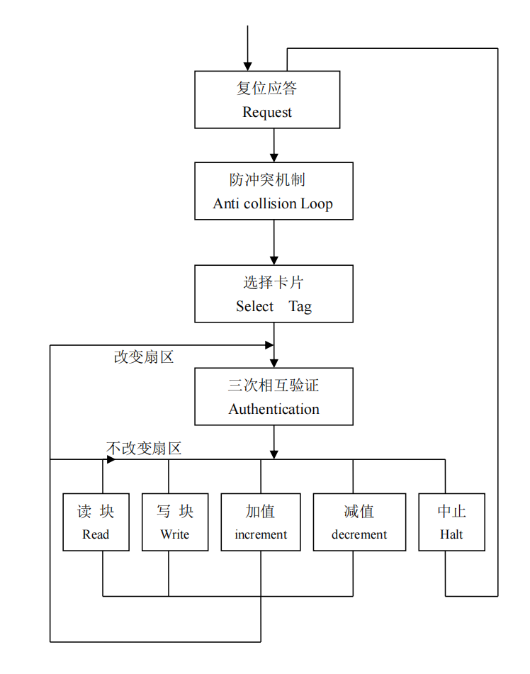
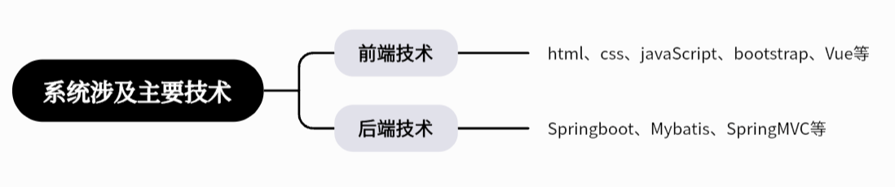

服装销售管理

[toc]

# 整体架构

## 硬件

构建的ZigBee网络由终端节点和协调器组成

### 终端节点

采用STM32ZET6 MCU作为终端节点的控制器，将储衣间环境温湿度数据上传至协调器，并实现自动除湿、火灾报警、自动照明等功能。

### 协调器

采用STM32C8T6 MCU作为协调器的控制器，实现终端节点与Web数据库以及微信小程序数据交互，同时搭载RFID-RC522模块，使用SPI通信与控制器通信，并将读取衣物标签发送至web数据库供店员后续操作。

## 微信小程序

通过开源的mqtt.js库来与物联网平台进行Topic的订阅与发布，最后项目打包经审核后发布在微信。

## Web数据库

通过物联网平台提供的SDK（实质为一系列用于MQTT的类）来实现与物联网平台进行MQTT通信，同时数据库实现了基本的人员管理、订单管理以及查看商店具体盈亏数额。

## 阿里云物联网平台

使用物模型，为产品定义对应的属性（温湿度、火灾报警等），随后硬件与Web数据库、微信小程序均订阅发布自己设备的物模型Topic。随后通过云产品流转将硬件topic与软件（Web数据库、微信小程序）的Topic关联起来，实现相互通信。

# 射频识别-RFID

通过无线电识别特定目标并读写相关数据，而无需识别系统与特定目标之间建立机械或光学接触。

## 硬件

一般由电子标签、读写器部分组成。

读写器通过发射天线发送特定频率的射频信号，当电子标签进入有效工作区域时产生感应电流，从而获得能量被激活，使得电子标签将自身编码信号通过内置射频天线发送出去；

读写器的接收天线接收到从标签发送来的调制信号，经天线调节器传送到读写器信号处理模块，经解调和解码后将有效信号送至后台主机系统进行相关处理；

### 电子标签

由IC芯片和无线通信天线组成的超微型的小标签，其内置的射频天线用于和阅读器进行通信。

- 有源射频标签：带有电池、体积比较大、识别距离较长，可达几十米甚至上百米，但寿命有限并且价格较高
- 无源射频标签不含有电池，重量轻、体积小，寿命非常长，但发射距离受限，一般是几十厘米到几十米，且需要有较大的读写器发射功率

### 读写器

主要负责与电子标签的双向通信，同时接受来自主机系统的控制指令。读写器的频率决定了射频识别的有效距离。

- 低频系统：用于短距离、低成本的应用中，如多数的门禁控制、货物跟踪
- 高频系统用于需传送大量数据的应用
- 超高频系统应用于需要较长的读写距离和较高的读写速度的场合，如高速公路收费等

## 软件

- 中间件：应用程序使用中间件提供的一组通用的应用程序接口（API），连到RFID阅读器，读取电子标签数据
- 应用系统软件：针对不同行业的特定需求开发的应用软件

注

1. IC卡 (Integrated Circuit Card，集成电路卡)，它是将一个微电子芯片嵌入以一定规范标准到卡基中，做成卡片形式。

## RC522模块

一种非接触式读写卡芯片，有两个部分——射频读写器和IC卡（M1卡），二者之间的通讯频率为13.56MHZ（低频系统）

- 复位应答：当有卡片进入读写器的操作范围时，读写器以特定的协议与它通讯，从而确定该卡是否为M1射频卡
- 防冲突机制：当有多张卡进入读写器操作范围时，防冲突机制会从其中选择一张进行操作，未选中的则处于空闲模式等待下一次选卡，该过程会返回被选卡的序列号
- 选择卡片：选择被选中的卡的序列号，并同时返回卡的容量代码
- 三次互相验证：选定要处理的卡片之后，读写器就确定要访问的扇区号，并对该扇区密码进行密码校验，在三次相互认证之后就可以通过加密流进行通讯（在选择另一扇区时，则必须进行另一扇区密码校验）

概括来说，主要就四部分：开关连接、寻卡、验证扇区密码、读取扇区数据。

注

1. M1卡分为16个扇区，每个扇区由4块（含数据块、控制块）组成

# ZigBee模块-DL-22

通过串口将信号转为2.4GHz频段并通过无线转发接收，收到的数据会使用串口接收。

# javascript

- HTML是一种标记语言，用来结构化网页内容。如定义段落、标题或在页面中嵌入图片和视频
- CSS是一种样式规则语言，可将样式应用于HTML内容。如设置背景颜色和字体，对内容进行布局
- JavaScript是一种脚本语言（轻量级解释型语言），用来创建网页动态更新的内容，使得网页能够具有交互性

## 解释（interpret）语言

在执行时，由解释器逐行或逐块读取源代码并直接转换为机器码执行，无需事先编译成可执行文件。

- 每次执行都要进行翻译，运行速度通常比编译型语言慢
- 解释型语言的程序通常以文本形式存在，只要系统上有兼容的解释器，就可以在任何平台上运行，增强了跨平台能力
- 错误通常在程序运行时被发现

## 编译（compile）语言

在程序执行前，需要通过编译器将源代码（高级语言代码）转换为低级语言。

- 运行时无需额外转换步骤，执行速度快，效率高
- 但编译后的程序常与硬件平台紧密相关，降低了跨平台性
- 错误可在编译阶段被发现，有助于提前发现问题

# 微信小程序

小程序的主要开发语言是 JavaScript。

# MQTT.js

一个开源的MQTT协议的客户端库，使用JavaScript 编写，是目前 JavaScript生态中使用最为广泛的MQTT客户端库。

# 数据库

## 数据库分类

### 关系型数据库

把复杂的数据结构归结为简单的二维表格形式，通过对这些表格分类、合并、连接等运算来实现数据库的管理。

### 非关系型数据库

-   键值存储数据库：使用简单的键值方法来存储数据，其中键作为唯一标识符（候选码——唯一标志一个元组）

-   面向文档数据库：呈现分层的树状结构

-   图形数据库：存储图形关系的数据库

## MySQL数据库

关系型数据库管理系统。

开源、体积小、使用简单、支持多种操作系统并提供多种API接口，广泛用于WEB应用方面。

## 数据库设计原则

### 范式

- 1NF：每个分量都是不可分的数据项，如人——男人、女人
- 2NF：满足1NF，且每一个非主属性都完全函数依赖于任何一个候选码。如学号，院系，学生姓名，宿舍楼号中，宿舍楼号还依赖于非候选码院系，故不满足2NF
- 3NF：满足1NF，每一个非主属性既不部分依赖于候选码，也不传递依赖于候选码。如学号→院系，院系→宿舍楼号，学号$\overset{传递}{\rightarrow} $宿舍楼号。故不满足3NF
- BCNF：满足1NF，且每一个决定因素包含候选码。如学生，教师，课程中，满足3NF，但教师是课程的决定因素，但教师却不包含候选码（教师，学生）、（学生、课程），因此不满足BCNF

注：

1. 函数依赖：假设X,Y是属性集U的子集，如果X唯一确定Y，则Y函数依赖于X，记作X→Y，X称为这个函数依赖的决定因素。如果对X的任意真子集都不能确定Y，则称Y完全依赖于X；否则Y部份函数依赖于X
2. 传递依赖：X→Y，Y×→X，Y→Z，则称X$\overset{传递}{\rightarrow} $Z

# Spring Boot

轻量级的Java开发框架。

# Mybaits

持久化层框架，用于将数据存入数据库，和从数据库中取出数据。

# 服装数据库

主要采用SpringBoot技术框架，通过前端调用Controller层接口，然后Controller层调用Service层的方法，Service层调用Dao层中的方法，Dao层再编写对应的对数据库进行增删改查等操作的语句，过程中实体是通过Entity层进行传递的。

