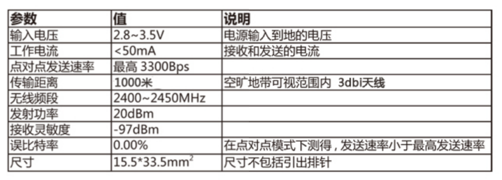
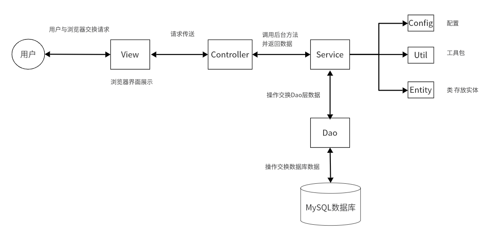
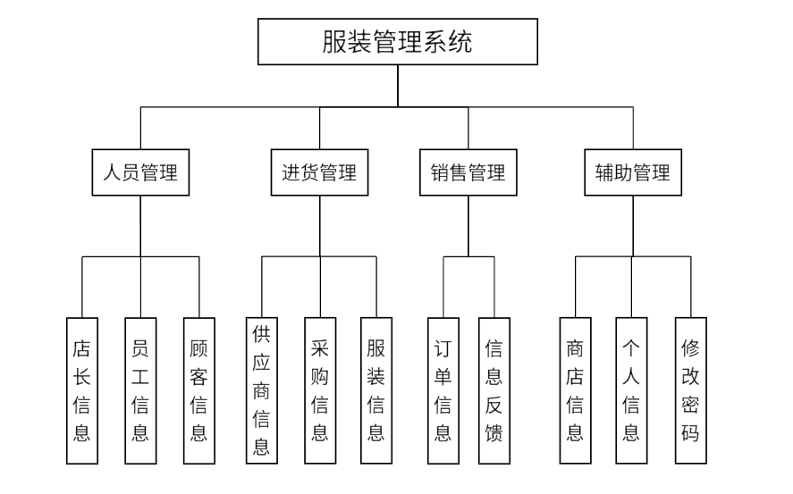

服装仓库物联系统

[toc]

# 整体架构

## 硬件（LVGL）

构建的ZigBee网络由终端节点和协调器组成

### 终端节点

采用STM32ZET6 MCU作为终端节点的控制器，将储衣间环境温湿度数据上传至协调器，并实现自动除湿、火灾报警、自动照明等功能。

### 协调器

采用STM32C8T6 MCU作为协调器的控制器，实现终端节点与Web数据库以及微信小程序数据交互，同时搭载RFID-RC522模块，使用SPI通信与控制器通信，并将读取衣物标签发送至web数据库供店员后续操作。

## 微信小程序

通过开源的mqtt.js库来与物联网平台进行Topic的订阅与发布，最后项目打包经审核后发布在微信。

## 安卓App

采用安卓APP，通过阿里云物联网平台提供的SDK（实质为封装好的MQTT类）来与物联网平台进行Topic的订阅与发布。最后项目打包成.apk文件，在安卓手机进行下载安装。

## Web数据库

通过物联网平台提供的SDK（实质为一系列用于MQTT的类）来实现与物联网平台进行MQTT通信，同时数据库实现了基本的人员管理、订单管理以及查看商店具体盈亏数额。

## 阿里云物联网平台

使用物模型，为产品定义对应的属性（温湿度、火灾报警等），随后硬件与Web数据库、微信小程序、App均订阅发布自己设备的物模型Topic。随后通过云产品流转将硬件topic与软件（Web数据库、微信小程序）的Topic关联起来，实现相互通信。

# 芯片分类

- MPU (Microprocessor Unit, 微处理器单元)： MPU 是一种侧重于数据处理的芯片，不直接集成外围设备（如内存、外设控制器等），而是通过外部接口与这些组件相连，如CPU
- MCU (Microcontroller Unit, 微控制器单元)： MCU，也常被称为单片机，是将CPU、存储器（RAM、ROM或Flash）、外设接口（如串行端口、定时器、ADC/DAC、GPIO（通用输入/输出）等）集成在同一块硅片上的芯片。MCU设计用于实现特定的嵌入式控制应用，STM32系列是MCU的一个典型例子
- DSP (Digital Signal Processor, 数字信号处理器)： DSP专为高速实时信号处理设计，如音频、视频处理、通信系统中的信号编码解码、图像处理等。与一般CPU相比，具有更高的并行处理能力和更快的乘法累加运算速度
- SoC (System on Chip, 片上系统):：SoC是将一个完整的系统集成在单一芯片上，包括一个或多个处理器（可以是CPU、MCU、MPU或DSP）、内存、接口控制器以及其他模块（如GPU、通信模块等）。广泛应用于智能手机、平板电脑、物联网设备等

注

1. RAM(Random Access Memory, 随机存取存储器)，是一种易失性存储器，数据掉电丢失，随机读写速度快，常被用于主存
2. ROM (Read-Only Memory, 只读存储器)，是一种非易失性存储器，数据掉电不丢失，常用于存储系统数据
3. Flash Memory(闪存)，是一种非易失性存储器，即使无电也可长期保存数据，并且允许被多次擦除和重写，常用于固态硬盘

# STM32精英板

正点原子STM32F103ZET6（MCU），具有丰富的I/O引脚（约110个），在不接外设的情况下满足项目功能需求。

## 引脚模式

### 输入模式

- 模拟输入：将离散电压信号转换为数字值（通过ADC实现）

- 浮空输入：引脚的电平由外部电路决定

- 上拉输入：内部上拉电阻激活，当无外部信号时，默认状态为高电平

- 下拉输入：内部下拉电阻激活，当无外部信号时，默认状态为低电平

### 输出模式

- 推挽输出：可驱动负载至高电平或低电平

- 开漏输出：引脚只能拉低输出，需要外部上拉电阻才能实现高电平输出

### 复用功能输出

- 复用推挽输出：与推挽输出相同，不过由复用外设控制输出

- 复用开漏输出：与开漏输出相同，不过由复用外设控制输出

注

1. 电源到器件引脚上的电阻叫上拉电阻，作用是使该引脚为高电平

2. 地到器件引脚上的电阻叫下拉电阻，作用是使该引脚为低电平

#  Keil uvision5

是一个集成开发环境，用于对嵌入式系统中的微控制器进行编程，在项目编程中，主要使用C、C++以及少部分汇编语言进行编写。

# 串行通信接口

## UART

- 一种异步、全双工的串行通信协议
- 按字节传输数据，TxD信号线发送信号，RxD信号线接收信号
- 传输速度为几百bps到1.5Mbps

## USB

- 一种高速、通用的串行总线标准
- 支持热插拔
- 能够同时提供电力（5V）和数据传输（一般为几十到几百Mbps）
- 连接方便，易于扩展

## I2C

- 一个同步、半双工的串行通信接口
- 由数据线SDA和时钟线SCL组成
- 支持多主控或多从设备配置
- 片内通信
- 传输速率为0\--3.4Mbps

## SPI

- 一种同步、全双工的通信协议
- 使用四条线（MISO, MOSI, SCK,CS分别为数据发送、数据接收、时钟和片选）进行通信
- 一主多从
- 最大数据传输率为5Mbps

## CAN

- 一种用于实时应用的串行通信协议
- 具有错误检测和校正功能，可靠通信
- 使用差分信号（CAN-H和CAN-L）
- 支持多主结构
- 速度可达1Mbitps

# 中断程序

CPU停下当前的工作任务，转而去处理其他事情，处理完后回来继续执行刚才的任务。

## 中断分类

### 外部中断

- 可屏蔽中断：主要来自外部设备如硬盘，打印机等。此类中断并不会影响系统运行，可随时处理

- 不可屏蔽中断：如电源掉电，硬件线路故障等

### 内部中断(软中断，异常)

- 陷阱：是一种有意的，预先安排的异常事件
- 故障：在引起故障的指令被执行，但还没有执行结束时，CPU检测到的一类的意外事件，如物理页不存在、除数为0
- 终止：出现了CPU无法执行的硬件故障，如控制器出错、存储器校验错等

## 中断处理过程

1.  接收中断请求：指中断源(引起中断的事件或设备)向CPU发出请求中断的要求

2.  关中断：进入不响应中断状态，防止现场保存不完整，无法正确恢复断点

3.  保存断点和现场

4.  判别中断源，在多个中断源同时请求中断的情况下，转向优先权最高中断服务程序

5.  开中断，允许更高级中断请求得到响应，实现中断嵌套

6.  执行中断服务程序

7.  退出中断。即关中断，恢复现场、恢复断点，然后开中断，返回中断前原程序

# 无线通信技术

## 无线保真技术（Wireless Fidelity，WiFi）

一种允许电子设备连接到一个无线局域网的技术。

-   频段：主要使用2.4GHz和5GHz两个频段

-   传输距离：一般在100-300米范围内

-   数据速率：常见的是300Mbps至1Gbps

-   功耗：相对较高，适合高数据速率需求，如视频流、大文件传输

-   应用：家庭、办公室、公共场所的宽带无线接入，支持多设备同时连接

## 蓝牙（Blue tooth）

-   频段：工作在2.4GHz频段，全球通用

-   传输距离：一般范围2-30米

-   数据速率：约1-2Mbps

-   功耗：低功耗设计，适合短距离、间歇性数据传输

-   应用：耳机、智能手表、智能家居设备之间的短距离无线连接

## ZigBee

-   频段：工作在2.4GHz、868MHz和915MHz三个频道上

-   传输距离：约10-100米，可进行组网

-   数据速率：较低，一般为250kbps

-   功耗：极低，适合长期运行的电池供电设备

ZigBee网络中节点类型

1.  协调器：网络的中心节点，负责网络的发起组织、网络维护和管理功能

2.  路由器：负责数据的路由（指导报文转发的路径信息）转发

3.  终端节点：在网络的最边缘，负责数据的采集、设备的控制等外围功能，只进行本节点数据的发送和接收

#  MQTT

一种基于发布（发送消息）/订阅（接收消息）模式的轻量级通讯协议，该协议构建于TCP/IP协议上。

MQTT建立客户端到服务器的连接，提供两者之间的一个有序的、无损的、基于字节流的双向传输。作为一种低开销、低带宽占用的即时通讯协议，在物联网有广泛应用。

## 三种身份

包含发布者、代理、订阅者，其中，消息的发布者和订阅者都是客户端，消息代理则是是服务器。

-   MQTT客户端：订阅、发布消息

-   MQTT服务器端：接受来自客户端的网络连接；接收客户端发布的消息，进行处理后向订阅对应topic的客户端进行消息转发

## 传输的消息

传输的消息主要包含主题(Topic)和负载(payload)两部分

- Topic：可以理解为消息的类型，订阅者订阅对应topic后，就会收到该主题的消息内容

- payload：可以理解为消息的内容，指订阅者具体接收到的内容

## MQTTfx

使用Java语言编写的MQTT客户端工具。通过Topic订阅和发布消息，用来前期和物联网云平台(MQTT代理)进行连接调试。

# 指令集架构-ISA

一个处理器支持的指令和指令的字节级编码。

-   专用ISA模型

-   通用ISA模型

-   复杂指令集计算机模型（Complex Instruction Set Computing，CISC）

-   精简指令集计算机模型（Reduced Instruction Set Computing，RISC）

# AT指令

一系列用于控制和通信的指令集，主要用于串行通信设备。

# ESP-01S

一款基于ESP8266芯片的WiFi模块，低成本、低功耗。

# ZigBee模块-DL-22

通过串口将信号转为2.4GHz频段并通过无线转发接收，收到的数据会使用串口接收。

# 射频识别-RFID

通过无线电识别特定目标并读写相关数据，而无需识别系统与特定目标之间建立机械或光学接触。

## 硬件

一般由电子标签、读写器部分组成。

读写器通过发射天线发送特定频率的射频信号，当电子标签进入有效工作区域时产生感应电流，从而获得能量被激活，使得电子标签将自身编码信号通过内置射频天线发送出去；

读写器的接收天线接收到从标签发送来的调制信号，经天线调节器传送到读写器信号处理模块，经解调和解码后将有效信号送至后台主机系统进行相关处理；

### 电子标签

由IC芯片和无线通信天线组成的超微型的小标签，其内置的射频天线用于和阅读器进行通信。

- 有源射频标签：带有电池、体积比较大、识别距离较长，可达几十米甚至上百米，但寿命有限并且价格较高
- 无源射频标签不含有电池，重量轻、体积小，寿命非常长，但发射距离受限，一般是几十厘米到几十米，且需要有较大的读写器发射功率

### 读写器

主要负责与电子标签的双向通信，同时接受来自主机系统的控制指令。读写器的频率决定了射频识别的有效距离。

- 低频系统：用于短距离、低成本的应用中，如多数的门禁控制、货物跟踪
- 高频系统用于需传送大量数据的应用
- 超高频系统应用于需要较长的读写距离和较高的读写速度的场合，如高速公路收费等

## 软件

- 中间件：应用程序使用中间件提供的一组通用的应用程序接口（API），连到RFID阅读器，读取电子标签数据
- 应用系统软件：针对不同行业的特定需求开发的应用软件

注

1. IC卡 (Integrated Circuit Card，集成电路卡)，它是将一个微电子芯片嵌入以一定规范标准到卡基中，做成卡片形式。

## RC522模块

一种非接触式读写卡芯片，有两个部分——射频读写器和IC卡（M1卡），二者之间的通讯频率为13.56MHZ（低频系统）

- 复位应答：当有卡片进入读写器的操作范围时，读写器以特定的协议与它通讯，从而确定该卡是否为M1射频卡
- 防冲突机制：当有多张卡进入读写器操作范围时，防冲突机制会从其中选择一张进行操作，未选中的则处于空闲模式等待下一次选卡，该过程会返回被选卡的序列号
- 选择卡片：选择被选中的卡的序列号，并同时返回卡的容量代码
- 三次互相验证：选定要处理的卡片之后，读写器就确定要访问的扇区号，并对该扇区密码进行密码校验，在三次相互认证之后就可以通过加密流进行通讯（在选择另一扇区时，则必须进行另一扇区密码校验）

概括来说，主要就四部分：开关连接、寻卡、验证扇区密码、读取扇区数据。

注

1. M1卡分为16个扇区，每个扇区由4块（含数据块、控制块）组成

# javascript

- HTML是一种标记语言，用来结构化网页内容。如定义段落、标题或在页面中嵌入图片和视频
- CSS是一种样式规则语言，可将样式应用于HTML内容。如设置背景颜色和字体，对内容进行布局
- JavaScript是一种脚本语言（轻量级解释型语言），用来创建网页动态更新的内容，使得网页能够具有交互性

## 解释（interpret）语言

在执行时，由解释器逐行或逐块读取源代码并直接转换为机器码执行，无需事先编译成可执行文件。

- 每次执行都要进行翻译，运行速度通常比编译型语言慢
- 解释型语言的程序通常以文本形式存在，只要系统上有兼容的解释器，就可以在任何平台上运行，增强了跨平台能力
- 错误通常在程序运行时被发现

## 编译（compile）语言

在程序执行前，需要通过编译器将源代码（高级语言代码）转换为低级语言。

- 运行时无需额外转换步骤，执行速度快，效率高
- 但编译后的程序常与硬件平台紧密相关，降低了跨平台性
- 错误可在编译阶段被发现，有助于提前发现问题

# 微信小程序

小程序的主要开发语言是 JavaScript。

# MQTT.js

一个开源的MQTT协议的客户端库，使用JavaScript 编写，是目前 JavaScript生态中使用最为广泛的MQTT客户端库。

# 数据库

## 数据库分类

### 关系型数据库

把复杂的数据结构归结为简单的二维表格形式，通过对这些表格分类、合并、连接等运算来实现数据库的管理。

### 非关系型数据库

-   键值存储数据库：使用简单的键值方法来存储数据，其中键作为唯一标识符（候选码——唯一标志一个元组）

-   面向文档数据库：呈现分层的树状结构

-   图形数据库：存储图形关系的数据库

## MySQL数据库

关系型数据库管理系统。

开源、体积小、使用简单、支持多种操作系统并提供多种API接口，广泛用于WEB应用方面。

## 数据库设计原则

### 范式

- 1NF：每个分量都是不可分的数据项，如人——男人、女人
- 2NF：满足1NF，且每一个非主属性都完全函数依赖于任何一个候选码。如学号，院系，学生姓名，宿舍楼号中，宿舍楼号还依赖于非候选码院系，故不满足2NF
- 3NF：满足1NF，每一个非主属性既不部分依赖于候选码，也不传递依赖于候选码。如学号→院系，院系→宿舍楼号，学号$\overset{传递}{\rightarrow} $宿舍楼号。故不满足3NF
- BCNF：满足1NF，且每一个决定因素包含候选码。如学生，教师，课程中，满足3NF，但教师是课程的决定因素，但教师却不包含候选码（教师，学生）、（学生、课程），因此不满足BCNF

注：

1. 函数依赖：假设X,Y是属性集U的子集，如果X唯一确定Y，则Y函数依赖于X，记作X→Y，X称为这个函数依赖的决定因素。如果对X的任意真子集都不能确定Y，则称Y完全依赖于X；否则Y部份函数依赖于X
2. 传递依赖：X→Y，Y×→X，Y→Z，则称X$\overset{传递}{\rightarrow} $Z

# Spring Boot

轻量级的Java开发框架。

# Mybaits

持久化层框架，用于将数据存入数据库，和从数据库中取出数据。

# 服装数据库

主要采用SpringBoot技术框架，通过前端调用Controller层接口，然后Controller层调用Service层的方法，Service层调用Dao层中的方法，Dao层再编写对应的对数据库进行增删改查等操作的语句，过程中实体是通过Entity层进行传递的。

# Android

## 介绍

一种基于Linux的开源的操作系统。

## Android Studio

进行安卓开发的主流工具，主要使用java编写，项目自动化建构工具默认使用gradle。

### 像素（pixel）单位

- px：像素单位，1px代表屏幕上的一个物理的像素点。但px单位不被建议使用，因为同样像素大小的图片在不同手机显示的实际大小可能不同

- dp：虚拟像素，在不同的分辨率的设备上会自动适配

- sp：针对于字体而言，会根据用户的字体大小来缩放

注

1.  使用px作为单位的，在不同的设备中会显示不同的效果；使用dp作为单位的，会根据不同的设备进行转化，适配不同机型，使视觉效果相同

2.  使用sp作为字体大小单位,会随着系统的字体大小改变；而dp作为单位则不会。所以在字体大小的数值要使用sp作为单位

# 阿里云物联网平台

集成了设备接入、设备管理、消息订阅转发和数据服务等能力的一体化平台。向下支持连接海量设备，采集设备数据上云，向上服务端可通过云端SDK调用云端API将指令下发至设备端，实现远程控制。

## 物模型

物模型是物理空间中的实体（如照明灯、风扇、窗户）在云端的数字化表示，从属性、服务和事件三个维度，可分别描述该实体是什么、能做什么、以及可以对外提供哪些信息。

## 云产品流转

在数据流转中，编写脚本来对Topic中的数据进行处理，并配置转发规则将处理后的数据转发到其他设备Topic。

注

1.  SDK（Software Development Kit，软件开发工具包），通常是由一个或多个软件开发工具组成的集合，用于帮助开发者创建、测试和部署软件应用程序

2.  API（Application Programming Interface，应用程序编程接口），供了一些预先定义的函数、接口，让程序可以访问某些软件或硬件的功能或数据，而不需要了解其内部细节
