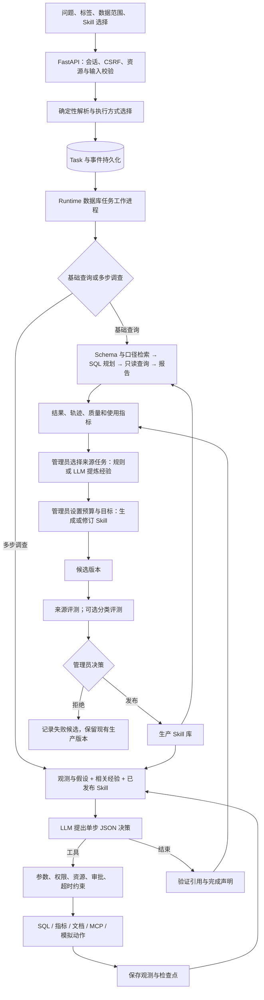
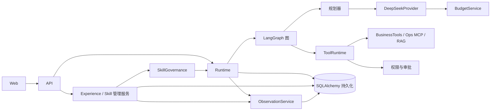
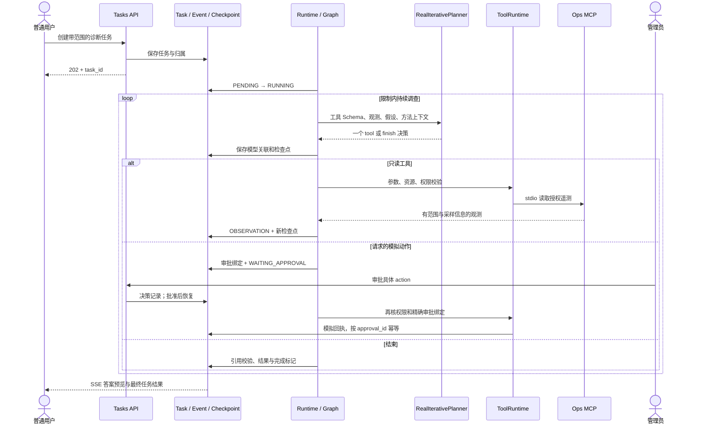
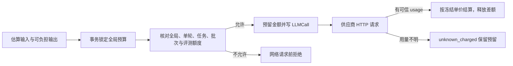
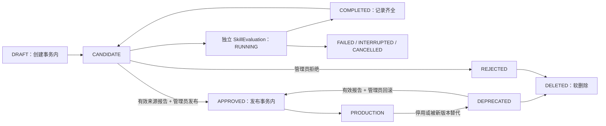
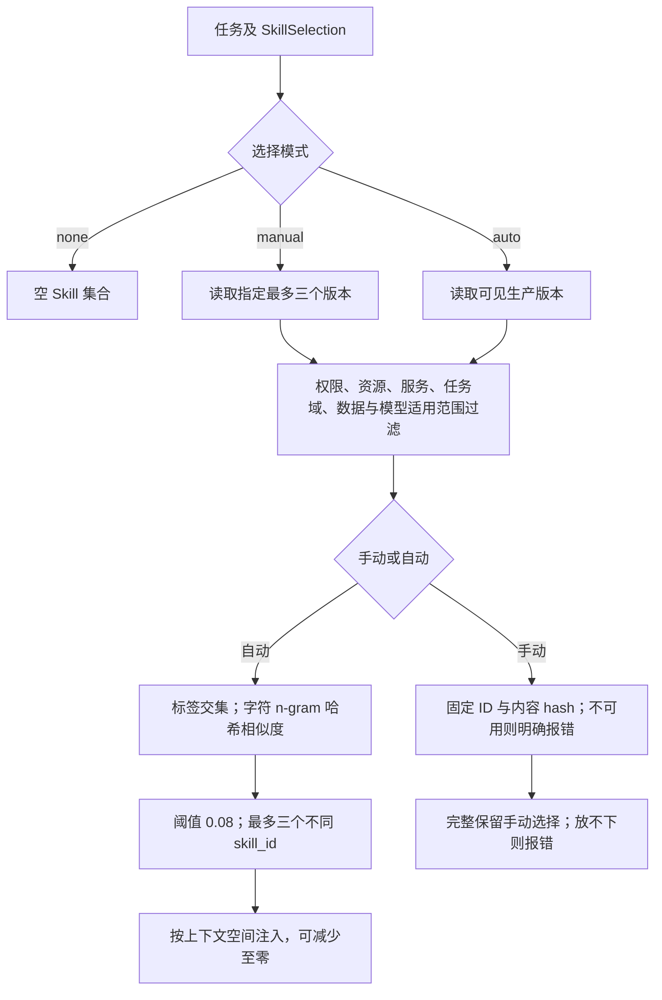
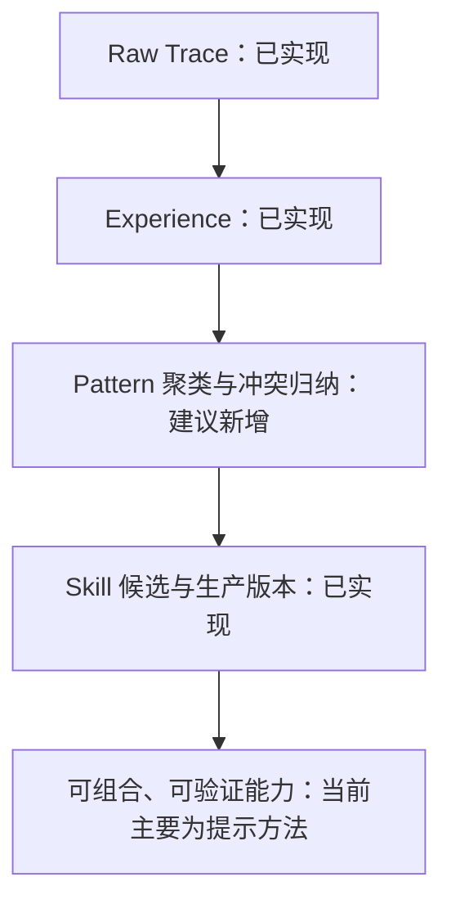
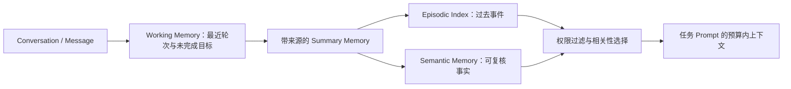
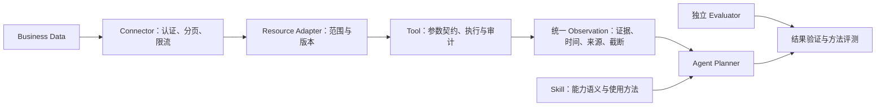

# EvoAgent 项目学习与面试指南

> 核对日期：2026-09-14。代码基线：`develop`，HEAD `a5b880f`，包含工作区已有的导航与页面调整。本文解释的是这份代码，不是早期 Phase 规划。配套：[面试速查表](INTERVIEW_CHEATSHEET.md)。
>
> 阅读范围：应用 Python 模块、前端自有实现、配置与部署文件、现存文档、测试契约、内置业务/运维数据和保留结果；对本地 OpenRCA 在线 JSON 做了结构与覆盖统计。未读取密钥、账号密码或生产数据库，未发起真实 LLM 实验。第三方压缩前端库不作为本项目原创实现分析。已删除的 `docs/PROJECT_SPEC.md`、`docs/ROADMAP.md`、`experiments/`、历史实验脚本和原始轨迹不在当前发布树中，不能据此复原全部历史实验。

全文约定：**【当前实现】**是可定位的代码行为；**【存在的问题】**是代码、数据或验证边界；**【推荐改进】**尚未落地，不能作为既有能力介绍。部分实现会明确说明覆盖了哪一段。

阅读导航：

- 主线：[1 概述](#1-项目概述) · [2 架构](#2-系统架构) · [3 请求执行](#3-核心执行流程) · [4 核心代码](#4-核心代码解析) · [5 自进化](#5-agent-自进化机制)
- 方法：[6 Skill](#6-skill-机制) · [7 Experience](#7-experience-机制) · [8 二者关系](#8-skill-与-experience-的关系) · [9 Tool](#9-tool-调用机制)
- 边界：[10 Memory](#10-memory-与长对话) · [11 新业务](#11-新业务接入) · [12 实验](#12-实验设计与结果分析) · [13 价值](#13-项目价值) · [14 局限](#14-当前局限) · [15 改进](#15-可落地的改进方向)
- 面试：[16 四十题](#16-面试问题与参考回答) · [17 一分钟介绍](#17-项目一分钟介绍) · [18 三分钟介绍](#18-项目三分钟介绍) · [19 源码速查](#19-面试速查与源码阅读索引)

## 1 项目概述

### 1.1 核心是什么，为什么值得做

EvoAgent 是面向业务分析与运维诊断的 **Agent Harness，即任务执行与方法管理的运行环境**。它试图同时回答两个问题：

1. 模型可以动态决定下一步时，如何保证工具、数据、危险动作和费用仍受程序控制？
2. 任务完成后，如何把执行反馈沉淀成可复用的方法，又避免一个未经验证的新方法直接影响线上任务？

项目的中心是“**受控执行 + 受控方法更新**”。Skill 是方法更新的载体，不是系统的全部。即使关闭 Skill，身份校验、任务调度、模型规划、工具访问、预算、审批、轨迹和结果展示仍然工作。

【当前实现】核心业务只有 `data_analysis`、`ops_diagnosis` 两类，见 [TaskType](../app/runtime/state_machine.py#L4)。知识文档用于口径检索，不代表已有独立知识问答 Agent；不存在已完成的客服、金融、医疗或代码执行工作流。

### 1.2 输入与输出

| 层次 | 实际内容 |
|---|---|
| 用户输入 | 问题、1–5 个业务标签、数据源、可选日期/分析类型/运维范围、Skill 自动/不用/手动最多三个版本、真实调用确认 |
| 隐式输入 | 当前登录者权限和资源范围、管理员预算、生产 Skill、已启用经验、工具目录、在线观测 |
| 提交响应 | `POST /api/tasks` 返回 202 和任务记录；不是同步等待模型答案 |
| 最终交付 | `Task.result` 中的报告、表格或结构化结论、证据引用、完成标记、停止原因；任务状态、轨迹、质量与费用分别可查 |
| 离线输出 | 经验、生成批次、候选 Skill 版本、配对评测报告、发布/拒绝/停用/回滚审计 |

入口契约见 [TaskSubmission / TaskCreate](../app/runtime/schemas.py#L53)、[create_task](../app/api/tasks.py#L31)。业务标签是分类元数据，不是答案标签，也不是授权凭证。

### 1.3 整体逻辑



图中的离线箭头**不是任务结束后自动触发**。在线任务记录使用事实，但不会自动提炼经验、生成或发布 Skill。

### 1.4 与常见 Agent 形态的关系

| 形态 | 决策方式 | EvoAgent 的对应关系 |
|---|---|---|
| 单次 Function Calling | 模型提出函数调用，程序执行 | 本项目也遵循模型提议、程序执行；但实际协议是 JSON 决策，不是供应商原生 `tools` 接口 |
| 固定 Workflow | 程序预定节点与顺序 | `build_business_graph` 是明确的基础流程 |
| ReAct 风格 Agent | 根据观测继续选择动作或结束 | `build_iterative_graph` 接近这一形态，有假设、观测和重新规划；不声称复现论文全部机制 |
| EvoAgent 的方法演进 | 将历史反馈转成版本化方法，再显式评测与发布 | 比单次执行多了来源、版本、预算、报告绑定和人工决策链 |

ReAct 强调推理与动作交替；LangGraph 本身既支持工作流，也支持动态 Agent，因此“用了 LangGraph”不能自动证明具备自主规划或学习能力。[ReAct 论文](https://arxiv.org/abs/2210.03629)、[LangGraph 的工作流与 Agent 说明](https://docs.langchain.com/oss/python/langgraph/workflows-agents)。

【存在的问题】项目名称、包描述和早期指南使用“multi-agent”，但当前主链是领域化执行函数和共享单规划器循环，**没有多个自主 Agent 讨论、委派和并行协作的团队实现**。面试可说“为多领域任务构建的可治理运行时”，不要把多个模块等同于多 Agent。

### 1.5 不要混淆四种“版本”

| 版本 | 当前含义 | 不代表什么 |
|---|---|---|
| 应用 `0.1.0` | `pyproject.toml`、`Settings.app_version` 的软件元数据 | 不等于实验 V0 |
| `SkillVersion.version` | 同一 `skill_id` 的整数版本，有 `parent_version_id` | 不等于整个系统统一升级到某个版本 |
| 图表 none / V0 / V1 / V2 | 无 Skill、初始 Skill、第一次修订、第二次修订的展示分组 | 现存 CSV 无法绑定具体数据库 Skill ID、模型或 Git 提交 |
| 协议/数据版本 | 如 `deterministic-v5`、`trajectory-v2`、`skill-task-records-v2`、数据集版本 | 不代表同一维度的产品版本 |

一次任务可以不用 Skill，也可以使用最多三个不同 Skill 的生产版本；既不是“一任务固定一个 Skill”，也不是“所有任务强制共用一个 Skill”。

## 2 系统架构

### 2.1 当前目录结构

```text
EvoAgent/
├── app/
│   ├── main.py                 FastAPI 应用与生命周期
│   ├── api/                    任务、身份、工作台、经验与 Skill API
│   ├── auth/                   数据库角色、会话、账号迁移
│   ├── core/                   配置、数据库/Redis、初始化与诊断命令
│   ├── runtime/                调度、任务契约、状态、检查点、路由
│   ├── graph/                  基础业务、旧基础运维、共享调查循环
│   ├── agents/                 规划器、上下文投影、运维规则与引用核验
│   ├── llm/                    DeepSeek HTTP、流式解析、Token 策略、Mock
│   ├── tools/data/             Schema、SQL 白名单、指标模板、业务种子
│   ├── tools/ops/              在线遥测、范围校验、代表性采样
│   ├── mcp/                    本机 stdio 运维服务及客户端
│   ├── governance/             权限、工具风险、预算账本
│   ├── observability/          轨迹、答案核验、示例契约、线上指标
│   ├── evaluation/             与执行分开的示例参考计算入口
│   ├── experience/             提炼、溯源、启停、归档、检索
│   ├── skills/                 候选生成、选择、版本、评测、发布、导出
│   ├── models/                 SQLAlchemy 持久化模型
│   ├── rag/                    本地文档检索和哈希 n-gram 向量
│   ├── assets/                 打包的知识 Markdown 与合成运维 JSON
│   └── web/                    原生 HTML/CSS/JS、Markdown 渲染、任务示例
├── tests/                      41 个 test_*.py 文件，覆盖实际业务边界
├── benchmark/mock_ops/         合成事故参考答案
├── mock_enterprise/            合成运维与调查样本生成器
├── docs/                       使用、部署、学习文档、截图
│   └── result/                 保留的情景图表与 summary.csv
├── data/                       本地运行数据，通常不提交 Git
├── pyproject.toml              依赖、包资源与 pytest 设置
├── Dockerfile                  Python 3.12 镜像，安装 app 包
├── docker-compose*.yml         API、PostgreSQL、Redis、开发/代理覆盖
└── .env.example                安全配置模板；实际 .env 不应入库
```

`app/core/seed_*` 是保留的应用命令，不是已经删除的顶层 `scripts/`。`ops_cases/ops_evidence` 可由 `seed_ops` 导入，但在线 MCP 实际读取 JSON；有数据库表不等于当前请求会查询它们。

### 2.2 核心模块的输入、输出与必要性

| 模块 | 输入 → 输出 | 为什么需要；去掉后的影响 |
|---|---|---|
| API / Auth | HTTP、Cookie → Principal、合法任务 | 隔离角色、任务所有权、写操作；去掉会让任务 ID 和客户端角色成为越权入口 |
| Runtime / Store | 已保存任务 → 状态变化、图执行 | 请求与执行解耦，集中处理生命周期；去掉难以取消、恢复和追溯 |
| Graph / Planner | 请求、观测、工具目录 → 下一动作/答案 | 让复杂任务依观测继续调查；基础图降低简单查询的调度负担 |
| ToolRuntime | 工具名、参数 → 受控结果/拒绝 | 模型输出不可信；去掉就把能力边界交给提示词 |
| BudgetService | 输入估算、输出预留 → 允许/拒绝与账本 | 并发请求不能只看余额再扣款；去掉批次/任务限额无法可靠执行 |
| ObservationService | 任务、事件、账本、审批 → 轨迹与评测 | 同一执行事实可回放、归因、学习；去掉只有最终答案，无法解释失败 |
| ExperienceService | 终态任务 → 细粒度经验；当前步骤 → 提示 | 保存可追溯教训；去掉每次又重复相同失败，但仅加它还没有受控方法版本 |
| SkillService | 经验、父版、目标 → 候选；任务 → 生产版本 | 方法组织、冻结和复用；去掉方法更新会退化成散乱 Prompt 修改 |
| SkillGovernance | 候选、来源任务、预算 → 报告和人工发布 | 把“生成”和“投入使用”分开；去掉无法说明谁依据什么采用新版 |
| Web | API 事实 → 任务、经验、Skill、额度界面 | 让操作和证据可读；它不承担服务端的权限或发布门禁 |

### 2.3 依赖关系与设计取舍



【当前实现】共享循环减少 Data/Ops 的重复代码；工具实现不需要知道 Skill 内容，Skill 无法直接扩权。

【存在的问题】`Runtime` 同时构造在线与离线服务，治理评测又浅拷贝 Runtime 并调用 `run_task`，耦合仍然明显。这是模块化单体，不是严格六边形架构。`PlannerProvider` 也没有统一覆盖 SQL、调查、生成和 Judge 的全部模型接口。

### 2.4 持久化与部署

默认部署是 PostgreSQL 16 + Redis 7 + API。业务只读账号与 Runtime 写账号使用不同连接；默认可在同一个 PostgreSQL 数据库中，以 `mock_business` Schema 分隔业务表。测试使用临时 SQLite，不能把测试库形态说成线上默认形态。

| 表组 | 真实表/模型 | 主要关联 |
|---|---|---|
| 身份 | `auth_roles`、`auth_accounts`、`auth_sessions`、`task_owners`、`auth_audit` | 用户归属、权限与操作审计 |
| 执行 | `tasks`、`task_events`、`runtime_checkpoints`、`runtime_model_calls` | task → 步骤 → call UUID |
| 审批 | `tool_approvals`、`mock_action_receipts` | task + step + action → 唯一审批与模拟回执 |
| 账本 | `llm_budget`、`llm_calls`、`budget_audit` | 全局额度、单请求用量与配置变更 |
| 轨迹/评价 | `trajectory_snapshots`、`evaluation_results`、`task_feedback`、`task_usage` | 原事件 → 版本化快照 → 评价/使用统计 |
| 经验 | `experience_runs`、`experiences`、`experience_sources`、`experience_policies`、`experience_model_calls` | 经验与多个来源轨迹关联 |
| Skill | `skill_batches`、`skill_generation_calls`、`skills`、`skill_versions`、`skill_evaluations` | 批次 → 不可原地改写的版本 → 评测 |
| 兼容/可选 | `skill_evaluation_suites`、`ops_cases`、`ops_evidence` | 旧评测集模型与可选遥测索引，不是当前主执行依赖 |

模型定义见 [models](../app/models/)。这里的“不改写”主要由应用约束和哈希校验实现，不是 WORM 存储或对数据库管理员也不可篡改的密码学审计。

Redis 当前被创建并参与 `/ready` 的 ping 检查，**没有作为队列、消息总线或会话记忆使用**。PostgreSQL 工作进程持有 advisory lock，在线任务逐个执行；API 可以并发接收请求，但不等于多个线上任务并行运行。离线生成/评测通过 `asyncio.create_task` 启动，是另一类并发来源。

迁移服务器主要迁移 PostgreSQL 数据/角色授权、在线 JSON、必要配置和密钥，并核对应用版本；不是复制 Git 仓库就能带走数据库。当前用 `create_all` 和若干显式兼容迁移，尚无统一 Alembic 迁移链。具体部署命令见 [OPERATIONS](OPERATIONS.md)。

## 3 核心执行流程

### 3.1 一次可验证业务查询

以网页内置 `eval-data-overview` 为例：

> 统计2025年6月订单数与收入，结果列名使用 orders、revenue_yuan。先检查数据库结构和指标口径，再进行只读 SQL 查询。

【当前实现】调用链如下，次数说明是**成功、未中断的基础路径代码结构**，不是本次运行真实模型得到的统计。

1. 前端提交任务；`identity` 校验 Cookie，写请求校验 CSRF。`TaskSubmission` 要求标签，拒绝客户端注入内部绑定。
2. `TaskFields.validate_modes` 确定 Data 域，`business_context` 解析分析类型和明确日期；`select_execution` 用规则选择基础查询。运维默认走多步调查。
3. `create_task` 做资源、真实调用和额度前置检查，手动 Skill 则预检并冻结版本 ID/hash；`TaskStore.create` 同时写任务、归属、创建与执行策略事件。
4. `Runtime.serve` 找到任务，`run_task` 原子地将 PENDING 改为 RUNNING，以任务所有者权限执行。
5. `build_business_graph` 依次检查 Schema、检索知识口径、获取经验/Skill 上下文。
6. 真实路径由 `DeepSeekProvider.plan_sql` 发起 **一次模型请求**，得到符合 `SQLPlan` 的 JSON。Mock 路径使用 SQL 模板，不收费。
7. SQL 经 AST 白名单、只读事务、超时和行数约束执行。报告由代码整理 SQL 结果、口径和引用，**没有固定的第二次“润色答案”模型调用**。
8. 保存结果与终态，`capture_trajectory` 重建轨迹、执行检查，并记录线上使用事实。可信示例可以进行独立答案核验。

基础成功路径逻辑工具数是 Schema、RAG、SQL 三项。创建前的 Schema 就绪检查是额外前置 I/O，不全算作任务轨迹中的逻辑工具调用；因此“tool_calls=3”不等于底层只有三次数据库/文件操作。

主要位置：[create_task](../app/api/tasks.py#L31)、[select_execution](../app/runtime/execution_policy.py#L8)、[build_business_graph](../app/graph/business.py#L29)、[plan_sql](../app/llm/deepseek_provider.py#L62)、[BusinessTools.query](../app/tools/data/service.py#L42)。

### 3.2 多步运维调查与审批



`Decision` 的主要字段是 `kind`、`tool`、`arguments`、`evidence_ids`、`hypotheses`、`answer`、`complete`、`final_answer`、`experience_ids`、`skill_ids`。自由文本 reason 是可见决策说明，不是保存供应商私有思维链。

正常情况下，每个工具决策对应一次规划请求、一次逻辑工具观测，最后再有一次 finish 规划。例如“指标→日志→部署→结束”可为 4 次模型请求、3 次工具调用；**这是流程示例，实际次数取决于轨迹**。拒绝、预算不足、无效输出和提前停止会改变这一关系。

循环伪代码，对应 [build_iterative_graph](../app/graph/iterative.py#L73)：

```text
load_checkpoint_or_initial_state()
while phase not in {done, waiting}:
    refresh_current_permissions()
    enforce_remaining_time_steps_and_model_calls()
    experiences = retrieve_for_task_and_current_step()
    skills = select_eligible_versions_or_offline_pinned_version()
    persist_model_pending_checkpoint_and_call_id()
    decision = plan_with_bounded_context_and_reserved_budget()
    validate_schema_and_references(decision)
    if finish:
        verify_requested_action_workflow_and_completion_declaration()
        save_result()
    else:
        validate_tool_arguments_scope_and_permission()
        reject_identical_tool_and_arguments_if_seen()
        if requires_approval_and_no_bound_approval:
            save_checkpoint_and_wait()
        else:
            execute_tool_with_timeout()
            save_observation_and_checkpoint()
            replan_or_stop_on_no_progress()
```

### 3.3 停止、恢复和完成不是一回事

| 情况 | 实际处理 | 面试解释 |
|---|---|---|
| 步数/请求数耗尽、无进展 | 返回已有证据和 `completion=incomplete`；可能任务状态仍 SUCCESS | 执行器正常收尾，不代表完成用户要求 |
| 引用虚构证据、权限拒绝、决策格式错误 | 明确失败或停止，不能继续调用相应工具 | 校验是程序边界 |
| 待审批 | 保存具体步骤和 action 后结束当前图调用 | 没有在内存里永久阻塞等待用户 |
| 进程重启 | PENDING/RUNNING 标为 RUNTIME_INTERRUPTED；有合法检查点才支持显式恢复 | 不是自动可靠重试队列 |
| 付费请求处于 model_pending | 恢复后停止 MODEL_CALL_INTERRUPTED | 不知道供应商是否收费时，不自动重复请求 |
| 模拟动作已产生回执后崩溃 | 依 approval_id 读回唯一回执 | 只证明模拟动作幂等，不保证外部系统 exactly-once |

依据：[ExecutionStore](../app/runtime/checkpoints.py#L9)、[TaskStore.recover](../app/runtime/store.py#L91)、[result_for](../app/graph/iterative.py#L37)。

### 3.4 无 Skill、有 Skill、进化后的区别

三者共享同一运行时和工具边界，差别主要在注入的版本内容。普通在线任务 `skill_selection=none` **只禁用 Skill，不必然禁用 Experience**；真正“无方法”实验组由离线评测同时关闭经验。不要把二者当成同一基线。

手动模式固定至版本 ID/hash，不能静默换新版；自动模式每次检索当前合格生产版本，线上发布变化可能影响后续步骤检索。修订未发布时，普通任务仍使用旧生产版本；离线评测通过内部绑定才能执行候选或旧版本。

### 3.5 仍在代码中的旧基础运维路径

[build_ops_graph](../app/graph/ops.py#L38) 仍提供固定收集五类 MCP 观测、再做一次诊断与引用核验的基础流程。真实分支调用一次模型，Mock 分支使用指标/日志驱动规则；它不是当前网页运维任务的默认链路，公共 API 会把运维选为 iterative。阅读旧测试时看到五工具固定调用，应先确认 execution_mode，不能据此推断当前每个运维请求都必须调用五个工具。

## 4 核心代码解析

### 4.1 `Runtime`：统一任务生命周期

- **职责/输入/输出**：接收数据库任务，组合当前身份、预算、图、工具，写状态、结果与轨迹。
- **关键方法**：`serve`、`run_task`、`for_user`、`refresh_identity`、`capture_trajectory`，见 [executor.py](../app/runtime/executor.py#L35)。
- **核心流程**：数据库工作进程锁 → 找待执行任务 → 校验身份和请求 → 选择图 → 运行/暂停/收尾 → 采集记录。
- **设计原因**：把“HTTP 已接收”和“任务完成”分离，所有图走统一终态处理。
- **潜在问题**：单在线工作进程、轮询、手工恢复、对象浅拷贝形成较强耦合；并非生产级分布式任务调度。
- **面试解释**：“我把模型循环放进可观察的任务生命周期，HTTP 请求不用保持到最终完成，审批和中断也有数据库状态。”

### 4.2 `TaskStore` 与 `ExecutionStore`：状态和副作用边界

- **输入**：task_id、预期旧状态、结果/事件、步骤和 action。
- **输出**：原子状态变更、检查点、模型调用关联、审批或模拟回执。
- **关键细节**：状态迁移用带旧状态条件的 UPDATE 并检查 rowcount；状态与事件在事务内提交。检查点为应用自己的 JSON，**不是直接使用 LangGraph 的持久化 saver**。
- **审批**：绑定 task、step、工具和规范化参数；执行前再次校验，普通用户不能自批。权限撤回即使在审批后也应生效。
- **去掉后的问题**：重复执行、批准 A 实际执行 B、崩溃后重放付费请求、取消与完成互相覆盖。
- **局限**：只保存最新检查点；外部动作还需幂等键、操作状态查询和补偿机制。

### 4.3 `RealIterativePlanner`：提出决策，而不是拥有执行权

- **输入**：请求、累计观测、假设、剩余步数/调用数、授权工具目录、检索方法。
- **输出**：Pydantic `Decision`。
- **核心**：`planner_messages` → `bounded_messages` → Skill/经验附加 → `DeepSeekProvider.complete_json`。
- **设计**：共享 Data/Ops 循环；领域区别通过工具目录、约束与观测体现，避免复制两套调查器。
- **局限**：每轮重新规划，未实现“先分解为可验证子任务 DAG，再安排多个执行 Agent”；结构有效不保证计划合理。
- **面试解释**：“规划器像不可信的建议来源，只有程序认可的一个结构化动作才能进入工具执行层。”

代码：[RealIterativePlanner](../app/agents/iterative.py#L253)、[Decision](../app/runtime/decisions.py#L38)。

### 4.4 `TokenPolicy` 与上下文投影

【当前实现】`Settings` 从环境和 `.env` 加载，`EVOAGENT_` 前缀，`get_settings` 缓存；网页预算是另一个持久化层。当前默认：

| 参数 | 默认值 | 位置/含义 |
|---|---:|---|
| `llm_context_tokens` | 1,000,000 | 本项目声明的窗口，不是对供应商规格的核验 |
| `llm_output_tokens` | 32,768 | 服务端输出上限；实际还受数据库策略和余额限制 |
| `llm_context_margin` | 4,096 | 估算安全余量 |
| `task_timeout_seconds` | 30 s | 基础任务超时 |
| `iterative_timeout_seconds` | 180 s | 调查累计执行时限 |
| `tool_timeout_seconds` | 15 s | 外层工具时限，工具内部另有更短限制 |
| `max_steps / max_model_calls / max_cost_rmb` | 12 / 8 / 1 | 内部任务默认，网页管理员策略可收紧 |

输入预算是窗口减输出预留及余量。有匹配本地 tokenizer 时使用它；默认采用 UTF-8/消息封装保守估算，不能说成精确 Token 计数。真实账单用供应商返回 usage 按配置单价折算。

`bounded_messages` 逐级压缩遥测行和长文本，保留来源、行数、截断说明与哈希；Schema、业务 SQL 结果和指标聚合属于尽量保持完整的关键证据，放不下就明确失败。手动 Skill 在投影前预留，不静默删除；自动 Skill 和经验可以减少数量，最后允许零注入。原始观测仍留在轨迹。

依据：[TokenPolicy](../app/llm/tokens.py#L28)、[bounded_messages](../app/agents/context.py#L69)、[planner_messages](../app/agents/iterative.py#L182)。这解决单任务上下文容量，**不等于长对话记忆压缩**。

### 4.5 `DeepSeekProvider` 与 `BudgetService`

模型入口直接使用 httpx；真实供应商接入目前专门写为 DeepSeek，固定 API 域名，显式代理配置，`trust_env=False`。返回必须是完整、可校验的 JSON；截断、HTTP 错误、格式失败分别记录，默认不做付费自动重试。[DeepSeekProvider](../app/llm/deepseek_provider.py#L55)。

预算不是“请求后累加金额”这么简单：



- 金额为人民币百万分之一的整数单位，避免二进制小数余额累积误差。
- 余额不足会尝试减少输出额度，低于最低输出要求则拒绝。
- 同一次事务限制全局与批次额度，失败会回滚预留，避免并发各自看见足够余额后超卖。
- 生成和评测可以共享批次总额；准备和启动之间检查配置是否改变。
- `llm_calls.task_id` 名称有历史包袱：多步路径存的是 call UUID，通过 `runtime_model_calls` 才关联任务，不能直接按该字段当真实 task_id 分组。
- 本地“实测用量估价”不等于供应商结算发票；价格变动、缓存优惠和用量缺失要保留口径。

代码：[reserve](../app/governance/budget.py#L181)、[settle](../app/governance/budget.py#L254)、[uncertain](../app/governance/budget.py#L270)。

### 4.6 `ObservationService` 与 `evaluate`

`project` 在任务记录一致性边界内读取事件、请求结果、模型账本、审批与回执；`build_trajectory` 形成步骤、证据、lineage 和指标；`persist` 按内容确定的 ID 防止重复快照。**轨迹回放只读记录，不重新执行工具或模型**。

`evaluate` 是确定性评价器，不是另一个 LLM：完成情况、引用时序、审批顺序与绑定、答案、工具需求分别给 `pass / fail / unknown`。`success=None` 是未充分核验，不应在聚合时转成成功。

去掉这个分层，就会把“调用没报错”“返回了答案”“答案正确”“业务动作成功”混为一谈。具体参考：[ObservationService](../app/observability/service.py#L15)、[evaluate](../app/observability/evaluation.py#L79)。

### 4.7 前端、Markdown 与流式输出

当前前端是原生 JS 模块，不是 React。导航为任务工作台、经验库、Skill 库、模型与额度；任务记录下有最近调用，Skill 生成和详情与仓库摘要分开组织。

流式链路是：供应商 SSE → `read_stream` 仅提取根级 finish.answer → 保存 `MODEL_ANSWER_DELTA` → 任务 SSE API 按游标读取 → 浏览器 Markdown 渲染。不会把 `reasoning_content` 当正文，也不会根据尚未闭合的 JSON 执行工具。最终完整决策仍须通过 Schema 和证据检查；无效预览可被撤销/替换。

Markdown 使用本地 `markdown-it`，HTML 等危险内容受渲染设置和 CSP 约束。流式输出改善感知等待，**不会减少模型实际推理或供应商请求耗时**；服务端轮询数据库事件也带来 I/O 成本。见 [streaming.py](../app/llm/streaming.py#L80)、[answer_stream](../app/api/tasks.py#L140)、[markdown.js](../app/web/markdown.js)、[streaming.js](../app/web/streaming.js)。

## 5 Agent 自进化机制

### 5.1 本项目到底什么在变

广义自进化指系统利用运行反馈持续调整可复用行为，并经过某种选择机制影响后续任务；不必限定为训练权重，也不能把每次生成不同文本都叫有效进化。

EvoAgent 更准确的定义是：**管理员发起、LLM 可辅助、以 Experience 和版本化 Skill 为载体的受控方法演进**。

| 对象 | 当前是否变化 | 如何变化 |
|---|---|---|
| 当前任务观测、假设与下一动作 | 是 | 每轮取证后重新规划；属于任务内适应 |
| Experience | 是 | 显式提炼新记录、去重合并来源、人工启停/归档 |
| Skill 方法正文 | 是 | 新建候选或在指定父版本上修订，形成新版本 |
| 注入 Prompt 的方法部分 | 是 | 检索到的经验/Skill 改变上下文 |
| 系统 Prompt、确定性 Router、工具代码 | 不由进化流程自动修改 | 仍需开发者改代码 |
| 模型参数 | 否 | 没有微调、梯度更新或在线训练 |
| 工具选择策略 | 间接可能改变 | Skill 指导模型，但是否改变实际行为要看轨迹 |

### 5.2 与相关概念的边界

| 概念 | 关注点 | 本项目对应 |
|---|---|---|
| Self-Evolution | 反馈驱动的跨任务方法更新与选择 | 部分自动化、人工治理的闭环 |
| Self-Learning | 宽泛的从反馈改进行为 | 可作宽泛描述，必须补充不训练模型 |
| Online Learning | 在线持续更新学习器参数/策略 | 未实现，在线与离线更新分离 |
| Reinforcement Learning | 基于回报优化策略 | 无 reward 训练器、策略梯度、bandit 或 RL 环境 |
| Reflection | 对执行失败/成功做总结 | 规则反思和可选 LLM 提炼 |
| Memory | 持久化并选择性复用过去信息 | 有经验/方法记忆，无完整对话记忆 |
| Prompt Optimization | 调整提示内容以影响行为 | Skill 修订在行为层面与其接近，但增加生命周期与证据管理 |
| Skill Learning | 抽象可复用的任务方法 | 当前是受约束的文本方法生成，没有训练可执行策略模型 |

### 5.3 闭环形成到什么程度

【当前实现】执行→轨迹→评价→人工选任务→提炼→人工设目标→生成候选→来源/分类评测→管理员发布→后续检索，链条可以走通。

【部分实现】反馈进入修订：生成器可见父版、优化目标、管理员指导、经验，以及父版相关评测摘要；这不是逐条失败步骤的完整因果归因器。生成假设包含收益、风险和验证计划，但不是已经实现收益。

【没有实现】自动挑选学习任务、经验聚类、自动择优搜索、根据统计收益自动发布、定时淘汰、模型权重训练。线上指标被记录，但不会自动触发下一轮更新。

“进化”成立在方法有继承、有变体、有评估和采用/拒绝决策；“每轮进化一定更好”不成立。若管理员保留旧版、拒绝新版，这是治理闭环的正常结果，不能删掉失败候选来制造单调提升。

### 5.4 优化目标与版本继承

`BatchRequest.objective` 支持 correctness、fewer_tools、lower_cost、lower_latency；guidance 可输入“保持答案质量，减少重复查询”。[generation.messages](../app/skills/generation.py#L9) 把目标、父版和来源组织为约束提示，要求有可执行的修改、验证条件，也允许说明无法改善并返回 NO_CHANGE。

【当前实现】没有把正确率、费用和延迟合成一个数值目标函数，更没有自动多目标优化算法。`objective_result` 是**评测后的比较报告**：正确性目标使用综合 `passed` 数，其他目标使用调用总数、费用总数或平均耗时；未知正确性会阻止“已改善”结论。默认对比旧生产版本，缺失时对比无方法组。

父版本通过 `parent_version_id` 指定；新版本不覆盖旧内容。同一父版本可生成多个分支，并非只能基于最新生产版本线性更新。生成成功不改变生产指针，必须独立评测并发布。正确性优先目前主要体现为生成约束和报告，而不是不可被管理员越过的性能阈值。

### 5.5 实际生命周期，不照搬旧状态图



当前来源/分类评测通常保留 Skill 原状态，写评测记录与 provenance；`SKILL_VERSION_EVALUATING` 是审计事件，不能据此说 Skill 一定持久化为 EVALUATING。`APPROVED` 在同一发布事务中转为 PRODUCTION，没有单独等待上线的阶段。

发布仍检查报告哈希、代码/数据/模型/来源绑定、记录完整性、权限/能力和 Skill 注入真实性，但**不会强制候选答案全对或更便宜**；管理员可在读到错误报告后决定发布，报告不会因此被改成正确。关键证据是 [validate_report](../app/skills/governance.py#L221)、[publish](../app/skills/governance.py#L303) 和 [允许管理员依据错误答案报告发布的测试](../tests/skills/test_task_quality.py)。

## 6 Skill 机制

### 6.1 Skill 到底是什么

【当前实现】Skill 是**结构化、带适用范围和版本来源的文本执行方法**，不是 Python 可执行插件，也不是训练好的新模型。在线最终仍以提示内容影响规划器，因此承认它含有 Prompt 并不削弱项目；真正增加的是结构、适用约束、来源、版本、评测和采用决策。

`SkillContent` 定义以下内容，见 [schemas.py](../app/skills/schemas.py#L41)：

| 内容 | 作用 | 当前限制 |
|---|---|---|
| `name / description` | 名称和目的，同时参与检索 | 有长度与非空校验 |
| `triggers` | 何时适用 | 1–5 项 |
| `workflow` | 条件 `when`、指令 `instruction`、工具 `tools` | 1–8 步，每步工具清单有上限 |
| `constraints` | 不应越过的边界 | 1–8 项 |
| `verification` | 如何检查交付 | 1–5 项 |
| `stop_conditions` | 何时停止或承认证据不足 | 1–5 项 |
| 外层 `scope` | task_family、data_source、dataset_version、services、权限/资源/工具 | 服务端负责过滤，正文不能替代授权 |
| 外层版本信息 | skill_id、version、parent、hash、provenance、生成目标和报告 | 支持继承、审计和回滚 |

例如“指标异常后，查相同服务和窗口的日志；只有指标和日志相互支持才保留候选原因，缺少部署记录时不要断言发布导致故障”，是一种方法。它不能凭空增加 `query_logs` 权限，也不能把历史事故结论作为新任务证据。

### 6.2 `SkillService` 的生成职责

- **输入**：管理员身份、1–20 条可用经验、标签、模型、预算、最多 1–3 个候选、可选父版本、目标和指导词。
- **输出**：冻结的 `SkillBatch`、生成尝试、候选 ID、版本正文与来源；失败也有停止原因和账本。
- **核心方法**：`prepare` → `start` → `execute`；`select` 负责在线选择，`delete_version` 负责受限删除。[SkillService](../app/skills/service.py#L73)。
- **生成约束**：来源必须同 task_family、data_source、dataset_version、services；公司范围内可跨用户，但不能仅因同标签就混合任意业务或服务范围。父版的范围也必须兼容。
- **去重**：fingerprint 包括内容、标签和排除 owner 的 scope。同样方法只改 objective/guidance 不会变成新版本；但仅改名造成的语义重复尚不能可靠识别。
- **局限**：方法正确性主要依赖后续测试和管理员；Schema 只能检查结构和工具集合，不能证明步骤有效。

每批最多三个候选不代表 Skill 库终生最多三个。库没有全局配额和自动淘汰策略；可见查询存在最多 1000 条的实现截断，这也不是合理的大规模容量设计。当前 scope.required_tools 从来源的成功和失败策略取并集，可能比候选实际需要的工具更宽，使后续权限过滤过于严格；应区分“来源出现过”和“方法必需”。

### 6.3 为什么不是只用 Tool Calling + Memory

| 维度 | 只保留 Tool Calling + 原始记忆时的压力 | Skill 带来的设计空间 | 当前能否证明收益 |
|---|---|---|---|
| 复用 | 每次从历史中重新推导步骤 | 抽象条件、步骤、验证和停止规则 | 机制已实现，跨任务收益需实验 |
| 稳定性 | 历史叙述可能相互矛盾 | 固定版本、来源冻结、人工发布 | 版本稳定不等于模型严格执行 |
| Token | 重复携带长历史 | 可将多条经验压成较短方法 | Skill 本身也耗 Token，不能保证更省 |
| 推理路径 | 每次重新搜索操作路线 | 提供有边界的调查顺序 | 需验证减少了哪些冗余步骤 |
| Tool 选择 | 仅靠工具描述 | 加入何时选/何时不选的上下文 | 没有现存真实结果证明准确率必升 |
| 复杂编排 | 每轮局部决策容易漏条件 | 组织跨步骤约束与验证条件 | 当前是指导文本，不是可执行 DAG |
| 维护 | Prompt 难以定位来源和影响范围 | 版本、hash、报告和回滚关联 | 已实现 |
| 演化 | 修改记忆即影响线上 | 候选与生产分离 | 已实现 |
| 解释 | “模型自己决定的”难以复盘 | 可解释选择了哪个版本、依据哪个报告 | 注入证据不等于因果贡献证明 |

面试重点不是“Skill 比 Memory 高级”，而是：**在需要稳定复用和审批更新时，把某类程序性知识提升为独立管理对象是有价值的。**如果系统只是极少量单步查询，一个固定 Prompt 或 Tool Calling 可能更简单，没有必要强行引入完整 Skill 生命周期。

### 6.4 Skill 如何选择

实际入口为 [SkillService.select](../app/skills/service.py#L426)，不存在单独的 LLM Skill Router。



算法细节：

1. 只向普通用户提供生产版本；先检查所需权限、资源和冻结来源是否可信。
2. 匹配任务域、数据源、数据版本和服务；真实模型任务不能使用仅 Mock 评测的生产版本，评测模型也需匹配当前配置。
3. 自动模式按标签交集过滤；旧版无标签记录有兼容通道。手动模式不强制标签相交，但仍执行能力与范围校验。
4. 对问题，以及 Skill 的 name + description + triggers，计算 512 维字符 1–3 gram 哈希向量，归一后点积排序；阈值 0.08，最多三个不同 Skill。
5. 同一 Skill 不同时选两个版本。自动无命中允许不用；手动不可用/变更/超窗则报错，不偷偷换成别的版本。

哈希向量实现见 [embedding](../app/rag/retriever.py#L12)。**Skill 侧是 Python 扫描与点积；知识和经验侧使用 FAISS IndexFlatIP。**“用了 FAISS”不代表语义向量模型，更不代表近似最近邻索引。

【存在的问题】有词面相似与哈希碰撞问题；评分不是校准置信度；没有效果权重、失败反馈降权、语义冲突检查、LLM rerank、Skill Graph。多 Skill 只是一起作为指导上下文，不是程序编排的组合。Skill 选错后没有专门的归因/替换策略，只能依赖规划器重规划和全局停止机制。

【推荐改进】先基于已记录的“检索候选→实际注入→效果”建立小规模标注集，再引入语义召回与规则/轻量 rerank；能力过滤仍必须在语义排序之前。10 万条时要先改数据库过滤、索引和分页，不能继续扫描截断的前 1000 条。

### 6.5 Skill 包与跨 Harness 迁移

`document.markdown` 将结构化内容转成含 YAML frontmatter 的 `SKILL.md`；ZIP 为稳定目录结构：

```text
evo-<stable-id>/
├── SKILL.md
└── references/
    ├── runtime.md
    └── skill.json
```

`native` 保留本 Harness 的工具名；默认 `portable` 用 [CAPABILITIES](../app/skills/capabilities.py) 将已知工具名替换为通用能力描述，保留原始/导出内容 hash 和适配说明。实现见 [document.py](../app/skills/document.py#L16)。

【部分实现】这是数据型方法包，具有可安装目录形态；**没有携带工具实现、业务凭据或目标 Harness 的权限策略**。替换工具名是静态映射，不是通用适配器或自动兼容验证。可以迁移方法，但不能保证解压后在任意 Harness 上等效执行，更不能把结构测试当跨 Harness 效果实验。

## 7 Experience 机制

### 7.1 经验保存什么

经验是从具体执行中提炼的局部方法或教训，主要包含失败类型、触发条件、成功/失败策略、修正步骤、验证条件、可复用规则和适用范围；来源关联到轨迹和评价，而不是只保存“上次答案”。

`ExperienceSource` 允许同一经验关联多个任务轨迹。因此不是严格一任务一经验：当前一次提炼对每个任务形成提案，可能合并到已有经验，也可能不产生可复用新经验。同一个任务在不同快照/提炼方式下也可能形成不同记录。

### 7.2 两条提炼路径

| 路径 | 输入 | 生成方式 | 上线前检查 |
|---|---|---|---|
| 规则提炼 | 终态轨迹、失败代码、调用次序 | `reflect` 的优先级分类和预设方法模板 | 范围、来源 hash、eligible；未知归因不直接作为可靠经验 |
| LLM 辅助 | 问题、状态、工具事件摘要、规则提示、允许工具 | `ReflectionRequest` 显式设置模型确认和预算；结构化 Lesson | 类别/事件 ID/工具集合校验；默认禁用，管理员复核后启用 |

规则类别覆盖 SQL 约束、工具范围、资源耗尽、证据、审批、运维交叉核验、数据口径及未知类型。[reflect](../app/experience/reflection.py#L38)、[LLM 提炼消息与校验](../app/experience/llm.py#L49)。

【当前实现】管理员显式选择 1–20 个已结束任务；正在执行、无归属或离线评测任务不能随意成为学习来源；混合标签必须显式给结果标签，同标签继承。规则提炼不发模型请求，LLM 提炼纳入预算账本。

【存在的问题】`ExperienceService.extract` 的旧 docstring 仍写“不调用模型”，实际已支持可选 LLM；应以分支代码为准。LLM 看到的是事件摘要，缺少部分失败参数和完整返回证据，归因针对性有限。格式检查不能确认修正方法在业务上正确；规则中的“失败后有成功调用”也不自动证明最初根因被修复。

### 7.3 去重、检索与删除

`ExperienceService.retrieve` 先检查启用、eligible、归档、权限、资源、服务、数据版本、内容/索引有效性，再用当前步骤适用规则和相似度选择。排除当前任务来源，动作相关经验也不能扩大用户明确请求的动作范围。当前最多三条、阈值 0.12；可选经验检索失败允许退回空集合。

经验按公司共享，owner 保留来源身份，不作为独占使用开关；原始任务访问权限仍独立。内容 fingerprint 去重可合并多个来源，但**不做近义改写语义去重或经验聚类**。当前没有自动置信度校准。

管理员可启停、归档，已归档经验可删除；活动生成/评测存在时会阻止危险的来源操作。删除经验记录不会抹掉任务轨迹与批次冻结副本。依据：[ExperienceService](../app/experience/service.py#L34)、[retrieve](../app/experience/service.py#L293)。

## 8 Skill 与 Experience 的关系

### 8.1 为什么两个都保留

| 对象 | 粒度与用途 | 生命周期 | 当前在模型中的角色 |
|---|---|---|---|
| Raw Trace | 一次任务的事件、证据、调用与状态 | 执行时追加，终态投影 | 主要作当前观测或事后追溯 |
| Experience | 特定失败/成功情境的触发、修正和验证 | 提炼、去重、启停、归档、删除 | 与当前步骤相关的局部提示 |
| Skill | 一类任务可复用的结构化方法 | 候选、评测、发布、版本修订、回滚 | 较完整的方法指导 |
| Tool | 实际读取数据或产生效果的能力 | 开发、注册、授权、审计 | 被模型提出、由程序调用 |

“经验”关注**发生了什么、在什么条件下该改怎么做**；“Skill”关注**遇到这类任务时按什么方法执行与验证**。多条经验可以成为同一候选的输入，但合并必须满足当前严格的范围兼容要求。

如果只有经验，系统可能每次把多条局部教训交给模型临时整合；Skill 将整合结果固定成可审批版本。反过来，只保留 Skill 会丢失方法为何出现、适用失败是什么、是否应该重新修订的具体依据。

### 8.2 是否冗余、是否相互依赖

**允许一定信息重叠，不能把重叠当独立证据。**当前靠不同存储、来源关联、分别检索、注入上限和不可把历史经验当新证据来维持边界；尚无针对“Skill 已吸收某经验”的在线语义去重，二者同时注入时可能增加 Token 或产生重复约束。

生成阶段依赖当前有效经验；生成完成后依赖的是**批次冻结来源**，不再依赖活动经验库条目一直启用。归档或删除来源经验后，已生成 Skill 仍可评测、发布、使用；未来新生成则不能用已撤回来源。这解决了“旧版本因为来源经验停用而根本没执行”的问题。[frozen_source_access](../app/skills/service.py#L165)、[独立生命周期测试](../tests/skills/test_source_independence.py)。

代价是：若发现来源有事实错误，只归档经验不会自动撤回所有衍生 Skill。管理员还要停用受影响版本；未来可建立影响传播和批量复核，而不是无条件级联删除。

### 8.3 分层改造是否合适



Pattern 层只在经验增长到难以人工筛选时才值得加。建议记录簇成员、公共触发条件、反例和适用范围，再让生成器给方法提案。不要只把三层相同文本换三个名字；每层都应有不同输入、输出和质量标准。

## 9 Tool 调用机制

### 9.1 当前工具目录

| 工具组 | 名称 | 实际动作 |
|---|---|---|
| 知识 | `retrieve_documents` | 检索打包的口径文档 |
| 业务 | `inspect_schema`、`execute_readonly_sql`、`query_business_metric` | 读取真实数据库结构/数据；指标工具使用受控 SQL 模板 |
| 运维读取 | `get_metrics`、`query_logs`、`get_dependency_graph`、`get_deployment_history`、`get_traces` | 经 stdio MCP 读取授权在线 JSON |
| 模拟处置 | `restart_service`、`rollback_deployment` | 写入审批绑定的模拟回执，不重启真实服务 |

工具目录与参数类型是 [ToolRuntime](../app/tools/runtime.py#L62) 中的静态注册；`ToolRule` 默认需要审批，明确只读工具才免审批。没有通用浏览器、任意文件读写、Shell 或在线安装工具能力。

### 9.2 SQL 安全与适用范围

`sqlglot` 解析 AST，仅允许受限 SELECT；拦截多语句、CTE、子查询、通配列、窗口函数、写入、锁、危险函数和非白名单表。业务库执行时还有 PostgreSQL 只读事务、statement/lock timeout；结果最多返回 1000 行并标注截断。[guard](../app/tools/data/sql_guard.py#L32)。

这是防写入、防访问系统表和约束复杂度的多层设计；**并非支持任意 SQL，也没有通用行级/列级 ABAC**。当前 `mock_business` 是较粗的资源权限；对任意 SQL 的业务日期意图主要由上下文/生成约束表达，并不能把 AST 白名单等价成按自然语言请求自动强制行级范围。

`BusinessTools.schema` 要求 13 张内置业务表存在且可 SELECT，`orders` 非空。这样的前置检查可以阻止缺表后才付费，但也说明仅换数据库连接串不足以接入任意业务。

### 9.3 MCP 与 OpenRCA 边界

每次 `OpsMCPClient.call` 会经 `collect(selected=[tool])` 启动 stdio 服务并完成初始化。先在客户端检查范围，再由服务端独立检查工具与资源；子进程不加载模型 `.env`，也不接收答案目录。

【当前实现】在线只读 JSON 包包含 case、服务、时间、五类遥测、来源与局限；服务过滤也约束依赖目标。窗口为 `start <= timestamp < end`，不能通过工具参数扩大到任务范围外。文件名来自 source 白名单，不支持任意路径，拒绝符号链接和过大文件。

返回前使用 `representative_rows` 保留时间跨度及每个服务/指标的极值或日志信号，同时报告 matched/returned coverage。随后模型上下文还可能进一步投影采样，**不是模型看到了全部原始数据**。[OpsTools.query](../app/tools/ops/service.py#L75)、[采样](../app/tools/ops/sampling.py#L6)。

【存在的问题】每次工具调用创建子进程、读并解析整个 JSON，有明显固定开销；采样启发式可能漏掉因果关键事件，coverage 仅针对已导入且授权的行，不代表原始数据完整性。可缓存只读包与长驻 MCP 会话，但必须保持每请求身份和范围隔离。

## 10 Memory 与长对话

### 10.1 当前到底有没有 Memory

| 类型 | 当前状态 | 代码事实 |
|---|---|---|
| Context | 已实现 | 问题、范围、工具、观测、假设和方法提示 |
| 单任务 Working State | 已实现 | `runtime_checkpoints.state`，观测和循环阶段 |
| Conversation History | 未实现 | 无 conversation_id、Message 模型和多轮追加接口 |
| Auth Session | 已实现，但不是对话记忆 | Cookie 登录会话用于身份认证 |
| 长期 Experience Memory | 已实现 | 持久化经验与跨任务检索 |
| 长期 Procedural Memory | 已实现 | 公司共享生产 Skill |
| 通用 Episodic Memory | 部分基础 | 原始轨迹持久化，但未做通用跨任务情节检索 |
| Semantic Memory | 很有限 | 静态口径知识检索，不自动形成持续更新的事实库 |
| User Memory | 未实现 | 无用户偏好、画像和个人事实提炼机制 |

明确回答：**当前支持持久化的任务状态和经验/方法记忆，不支持真正的连续长对话。**把几条历史任务显示在页面中、保留登录 Session、或把观测放进 Prompt，都不能等同于完整聊天记忆系统。

### 10.2 怎样扩展长对话



【推荐改进】

1. **会话层**：新增 Conversation/Message、owner、资源范围、parent_message_id；Task 关联 conversation_id。API 支持追加消息，明确是在继续任务、修改要求还是新建任务，不能仅把所有文本拼接。
2. **短期状态**：在当前检查点之上记录待完成目标、已接受事实和待确认事项；不可把聊天摘要覆盖工具原始证据。
3. **摘要**：超过预算时压缩旧消息，保存 source_message_ids、摘要版本、生成模型、费用和不确定性。摘要是有损索引，需能回到原文。
4. **长期记忆**：事实、事件、用户偏好和方法分库或分命名空间；个人记忆不能直接写入公司经验库。向量召回前过滤用户、资源、有效期。
5. **冲突与遗忘**：记录时间、来源、置信度和 supersedes 关系；新旧冲突不能简单取相似度最高。过期、用户撤回和低价值记忆支持 TTL、降权或删除。
6. **上下文调度**：优先级为当前指令/权限→任务关键证据→近期未完成状态→相关摘要/记忆。完整窗口仍不够时，明确要求缩小任务，而不是无提示丢证据。

修改落点：`models/`、`api/tasks.py`、`runtime/schemas.py`、`runtime/checkpoints.py`、`agents/context.py` 和新 `memory/` 服务；复用现有预算与审计。验证跨用户隔离、事实更正、长期目标召回和超窗恢复，而不只测试消息能保存。

## 11 新业务接入

### 11.1 哪些能复用，哪些必须改

【当前实现】可复用的是任务生命周期、身份与资源框架、预算账本、审批绑定、轨迹、候选/生产版本隔离、报告记录和导出机制。**工具注册、数据源名称、任务域、指标和参考答案目前并非配置化插件系统**，接入新领域通常需要改代码。

| 接入类型 | 少改/不改核心运行时的部分 | 当前要改或补齐的部分 |
|---|---|---|
| 同 Schema 的另一套业务数据 | 只读连接、部署与账号配置 | 数据版本和独立参考；默认种子不可当新库答案 |
| 不同 Schema 的数据库问数 | Store、Budget、循环可复用 | 表白名单、Schema 发现策略、指标、SQL 方言、资源授权、Evaluator |
| 相同契约的运维在线包 | `OpsTools` 与 MCP 读取机制 | 准备 JSON、配置允许来源/服务；新增 source 名还要改 Literal/白名单 |
| 企业知识库/RAG | RAG 调用与资源过滤思想 | 文档 Connector、分块、来源 ACL、语义索引、更新删除和引用评价 |
| 客服/私有 API | Task、审批、轨迹、Skill 版本 | 客户/工单工具、脱敏、会话记忆、动作幂等、结果评价 |
| 金融/医疗 | 治理与可追溯框架 | 领域数据授权、可信知识、专家审阅、业务级验证；不能直接复制演示阈值 |
| 代码 Agent | 规划与候选评测框架 | 仓库/文件工具、隔离执行、构建测试、补丁评审和资源预算 |
| Web 数据 | 受控工具调度 | 域名/网络策略、抓取解析、来源时间和注入防护；当前无通用 Web 工具 |

### 11.2 推荐的接入抽象



【推荐改进】新增 `DomainAdapter`，至少提供 `resolve_request`、`tool_catalog`、`validate_scope`、`dataset_fingerprint`、`evaluation_cases`。工具包装提供参数 Schema、只读/风险声明、授权范围与规范化 Observation。Planner 依赖能力接口，业务模板和资源枚举放在领域适配器里。

不要让 Connector 返回的数据直接成为系统指令；统一 Observation 建议包括 evidence_id、resource_id、source_version、time_range、payload、truncated、availability。必须区分“没有记录”“无权限”“数据源缺失”和“查询结果证明为零”。

### 11.3 一个实际的数据库接入清单

1. 建立只读账号和资源范围，调整 `BusinessTools` 与 `catalog.TABLE_NAMES`；先做 `check_business` 同类就绪检查。
2. 定义金额、时间、分母和业务实体，替换 `assets/knowledge` 口径；不要只改 Prompt 中表名。
3. 替换 `analysis` 枚举、`business_context`、指标模板和执行策略中的业务假设，确保复杂任务仍走调查路径。
4. 为高频查询写独立 Python/人工参考，不使用同一段 LLM SQL 的结果反过来验证它自己。
5. 在相同授权边界下收集小批真实轨迹，提炼经验、生成候选、来源评测、人工发布；新领域不自动继承旧领域 Skill 的有效性结论。

### 11.4 OpenRCA 当前能使用到什么程度

当前本地在线文件统计如下，**仅代表本机已准备子集，不是原始 OpenRCA 全集，也不是实验成功率**；这些文件在 Git 之外，另一台服务器需要单独准备。

| 数据源 | cases | metrics | logs | dependencies | deployments | traces |
|---|---:|---:|---:|---:|---:|---:|
| openrca_bank | 2 | 11,792 | 963 | 39 | 0 | 2,861 |
| openrca_market_cloudbed1 | 2 | 42,640 | 8,250 | 160 | 0 | 9,378 |
| openrca_telecom | 2 | 34,517 | 0 | 30 | 0 | 2,977 |

三个 bundle 标记 `openrca-subset-v2`，在线窗口读取与证据采样已实现。所有部署记录为空，Telecom 日志为空；“没有部署记录”不能推出“没有发生部署”。如果 Skill 强制每次都查日志和部署并要求完整证据，会对这种数据覆盖形成天然不匹配。

网页有 OpenRCA 请求入口，但当前十个可信示例来自合成业务/合成运维；`example_worker.reference_for` 没有自动读取 OpenRCA 答案目录的分支。因此“能执行 OpenRCA 任务”和“网页能对它自动给可信正确率”是两项不同能力。来源评测可以走 observational，分类评测若没有相应可信案例会无可用任务。

## 12 实验设计与结果分析

### 12.1 先区分三种证据

| 证据 | 当前仓库情况 | 可以支持的结论 |
|---|---|---|
| 机制测试 | `tests/` 使用 Mock、HTTP 替身、临时数据库，也测试真实 SQL/MCP 路径 | 权限、状态、账本、候选与报告绑定是否按契约工作 |
| 模型效果实验 | 历史曾运行，但当前发布树未保留完整逐任务轨迹、运行脚本与冻结配置 | 不能凭历史描述复原或宣称新的统计结论 |
| 展示情景数据 | `docs/result/summary.csv` 与 comparison 图；此前人工修改、加入扰动 | 展示指标与取舍的阅读方式，不能证明真实 LLM 增益 |

`model_mode=deepseek` 的测试不一定真的访问供应商；许多测试通过 `httpx.MockTransport` 返回预设响应。要判断是不是实测，需要同时看传输、配置、账本和原始响应来源。

### 12.2 当前三种评价用途

| 用途 | 如何选任务 | 有没有可信参照 | 对发布的影响 |
|---|---|---|---|
| 来源评测 | 沿候选及父版来源链找到原始任务，去重后重新运行 | 有则核对；没有则 observational | 必须完成有效来源评测；管理员最终决策 |
| 分类评测 | 按标签与数据源匹配当前内置可验证示例 | 当前要求有参照 | 补充记录，不是硬性发布前置 |
| 线上使用观察 | 普通任务完成后按实际注入版本更新统计 | 可信示例可核对；其他保留 unknown 和用户评分 | 不自动发布/降级，只为管理员提供依据 |

当前不要求网页维护验证集/回归集/保留集。旧 `suites.py` 和旧 `cases()` 仍存在，但 `planning.plan` 的新入口只接受 source/category，API 没有创建评测集的公开路由。所谓“回归”在产品上可通过对已发布或旧版本重新做来源/分类对照完成，不应介绍成仍强制固定 mock-01/02/03/04 分割。

来源评测刻意复跑见过的任务，所以它检查来源兼容和执行变化，不证明泛化。分类评测也没有排除所有见过的案例；它是同类任务比较，不自动成为未见测试集。

### 12.3 配对组究竟有没有注入正确方法

| 组 | Skill | Experience | 关键含义 |
|---|---|---|---|
| baseline | 禁用 | 禁用 | 干净的无方法基线 |
| experience | 禁用 | 限定来源经验，且仍需满足当前可用性 | 仅经验对照；来源已归档可能实际无注入，应查事件 |
| candidate | 内部固定候选 ID/hash | 禁用 | 独立观察候选效果 |
| previous | 同一 Skill 的旧生产版本 ID/hash，若存在 | 禁用 | 不是任意父版本；需核对 previous_id |

内部 `offline_skill_binding` 是可信服务端注入，不是用户可在创建任务时填写的字段。`context_valid` 检查实际 `SKILL_CONTEXT` 中的版本和 hash，避免“旧版本零调用”被当作真实低成本对照。

评测任务**仍保存在数据库和报告中**，用于复核和审计；它们通过 `offline_skill_evaluation` 标记从普通用户任务历史、评分和线上使用汇总中排除。“不记录到用户任务列表”不等于不保留执行证据。

当前重复 1–3 次，批次内顺序运行；奇偶轮反转分组顺序，但 `seed=7` 只是记录字段，不是完整的随机化实验实现。多个管理作业与在线任务可能争用资源，因此耗时还受环境影响。

### 12.4 指标的准确定义

| 指标 | 当前实现口径 | 不能这样理解 |
|---|---|---|
| completion | 终态 SUCCESS 且结果 `completion=complete`；基础路径缺失标记按 complete 兼容 | HTTP 200/202、SUCCESS 就等于任务要求都完成 |
| answer_correctness | 可信参考 + 结构化最终结论，pass/fail/unknown | 任意有文本回复就是正确 |
| success / passed | 结合完成、确定性维度及答案核验的综合结果；可能未知 | 与 answer_correctness 完全同义 |
| tool_selection | 成功调用覆盖所需工具/可替代工具组，或来源 observational 的当前证据检查 | 工具越多越好 |
| tool_coverage | 保留 CSV 的展示字段；缺少生成器，无法确认其原始分母 | 当前评价器一定直接计算相同连续比例 |
| model_requests | 轨迹的 `llm_calls`，关联本任务的账本请求 | HTTP retry 次数、图节点数、Mock 决策步数 |
| tool_calls | 轨迹中逻辑调用记录数，包含失败/部分未执行尝试 | SQL 内部查询数或 MCP 协议消息数 |
| latency | wall_latency_ms 从创建到事件末尾；另有审批等待/非审批耗时 | 纯模型推理时间 |
| cost | `charged_rmb`，有 usage 时按配置价格估计，否则可能保守预留 | 供应商最终发票金额 |
| repeated_errors | 重复出现的 `(tool, error)` 对，首个不计重复 | 所有模型 reasoning 错误或语义重复推理 |
| 用户评分 | 任务所有者 0–10 整数评分；显示覆盖率和平均值 | 客观正确率或专业领域真值 |

综合评价代码见 [evaluate](../app/observability/evaluation.py#L79)、[score](../app/skills/evaluation.py#L67)、[summarize / objective_result](../app/skills/reporting.py)、[aggregate](../app/observability/usage.py#L87)。

**正确率必须一起报告分母与未知数量**：例如 10 个任务中 6 个 pass、2 个 fail、2 个 unknown，已核验正确率是 6/8=75%，核验覆盖率 8/10=80%。不能直接称总体正确率 75%，更不能把 unknown 填成 pass。失败任务也可能因未产生答案而显示答案未知，完成失败仍单独计入。

### 12.5 可信参考和 LLM Judge

当前网页有 33 个示例，其中 **10 个可验证示例：8 个业务、2 个合成运维**。8 个业务示例主要覆盖 overview 的不同时间窗及 channel_revenue、net_revenue，不等于十种完全不同的能力。

业务参考由 `example_worker.reference_for` 对固定种子做独立 Python 聚合；运维参考是合成事故规范中的标签和服务。`match_example` 要求问题文本和结构化范围匹配；随意改写问题即使语义类似，也不会自动得到可信参照。参照不进入在线模型 Prompt；示例核验子进程不带模型凭据，不过它不是独立 OS 级强沙箱。

答案归一采用明确别名与单位转换，不用模糊包含判断：

- 数值按字段映射、元/分/万元、比例和天等单位规范化，比较无序行多重集合与容差；未知字段/单位冲突记 unknown。
- 根因通过明确别名、支持状态、服务对象与引用证据核对。`memory_pressure` 与 `memory_leak` 保持区分，不能为了提高通过率把压力和泄漏混为同义词。
- 多步任务核验最终 `final_answer`，不把最后一个中间工具表自动当成模型最终答案；引用匹配还需检查所需类型的非空证据。
- 这些检查仍不证明自由文本说明的语义或真实因果；工具覆盖仅表示所需能力证据存在。

【部分实现】`skills/judge.py` 已有 rubric LLM 打分、证据 ID 和人工复核结构，但**当前 source/category 规划生成 reference 或 observational，不生成 rubric**；常规页面无参照来源评测不会自动调用该 Judge。旧 human_review 入口还要求 NEEDS_REVIEW，而当前正常完成直接记 COMPLETED。这是留存但未贯通的能力，不能宣传“所有开放任务已有 LLM 自动评审”。

### 12.6 保留图表与 CSV：可以怎样读

以下是**人工情景汇总**，不作为真实实验结果。图中的“成功率”对应 CSV `answer_correctness` 展示值，不能等同当前代码的综合 `success`。散点仍在图上，但发布树没有其逐点原始表，无法从汇总数核验散点来源。


[汇总 CSV](result/summary.csv) · [PDF](result/comparison.pdf)

| 组 | rows | 完成率 | 答案正确率 | 工具覆盖 | 模型请求/任务 | 工具调用/任务 | 耗时 s/任务 | 费用 ¥/任务 |
|---|---:|---:|---:|---:|---:|---:|---:|---:|
| none | 20 | 75% | 70% | 86.67% | 4.90 | 4.00 | 12.221 | 0.022546 |
| V0 | 20 | 90% | 85% | 96.67% | 5.55 | 4.55 | 15.137 | 0.028731 |
| V1 | 20 | 85% | 80% | 93.33% | 5.10 | 4.10 | 13.482 | 0.024962 |
| V2 | 20 | 95% | 90% | 98.33% | 5.20 | 4.20 | 12.684 | 0.023114 |

只在这组设定数字内部分析：

1. V2 的质量展示值最高；none 的耗时和费用最低，所以 V2 并非所有维度全面优于无 Skill。
2. V0 比 none 多调用、耗时费用更高，质量也高；它可以展示“额外取证换质量”的假设，但没有轨迹不能证明原因就是额外取证。
3. V1 比 V0 更省，质量却回落；V2 比 V1 请求/工具略多而耗时费用更低，说明次数不是费用/耗时的唯一决定因素，也可能受 Token 长度、工具类别、环境影响。**这些是待验证解释，不是当前数据证明的因果。**
4. 如果把质量越高、资源越少都视为目标，V2 在这组情景均值中支配 V0；不支配 V1（调用次数更高），也不支配 none。不能无条件称 V2 具有 Pareto 全面优势。
5. 工具覆盖和正确性同向变动并不能证明相关关系，更不能推断因果；只有四组汇总且数据经过人工设定。

即使换成真实的每组 20 条：95% 可能只是 19/20，90% 是 18/20，两者只差一个样本；V2 答案正确率 90% 对 V0 的 85% 也是一个样本。还需要逐任务配对，判断改善的是哪些任务，以及是否出现旧任务退化。**本表是人工情景，不能据它计算显著性后声称模型有效。**

### 12.7 怎样把效果验证补成可信证据

【推荐改进】不必立刻做大量 Harness/模型组合，先把当前 Harness 内的证据做实：

1. 固定模型、代码、工具与资源政策、Token 配置、任务合同、数据快照、Skill 内容/hash和价格，确保基础与多步执行策略一致。
2. 先定义验收：正确性/权限优先，再看工具冗余、耗时和费用。开放任务的完成、人工评分和 LLM 意见分开，不混成有真值正确率。
3. 保存 none、experience、初始 Skill、两轮候选的所有运行；每轮依据开发任务报告选择是否沿用候选，失败候选也保留。**采用版可不变，候选序列不要求单调提升。**
4. 另留一批生成器未见的同类任务做正式比较；来源测试仍用于发布记录，实验隔离不必变成网页强制三套集合。
5. 先做小试点估计失败率和方差，再决定更多独立任务、重复次数和预算。按任务/事故分组，避免同一事故不同时间切片被当成独立样本。
6. 正确性用配对二元比较（例如 McNemar）；均值差可按任务分组 bootstrap；报告样本数、未知率、置信区间、耗时 P50/P95。只有合理样本设计和足够数据时才作显著性结论。
7. 扩展检验：新任务表达、不同数据覆盖、缺日志等 OOD、更多工具与更多 Skill，以及错误 Skill 的负迁移。跨 Harness 可在后续再加，并明确成本。

最小可复核产物是 `manifest + 每任务每组 run.jsonl + 必要原始事件/答案 + evaluator version + Skill 快照 + 汇总/绘图代码`。如果只保留图和均值，就只能展示，不能让别人复核“为什么 V2 更好”。

### 12.8 本次核验做了什么

本次在临时测试环境执行以下现有测试，**72 passed in 40.84s**；没有真实模型费用：

```bash
.venv/bin/python -m pytest -q \
  tests/skills/test_task_quality.py \
  tests/skills/test_source_independence.py \
  tests/observability/test_answer_comparison.py \
  tests/runtime/test_execution_policy.py \
  tests/llm/test_token_policy.py
```

它们验证来源评测/管理员发布语义、旧版与经验独立性、明确答案别名、路由和 Token 边界，不证明真实模型的正确率。完整非 integration 测试命令在 README，本次文档任务没有重新运行全部套件或远端部署验证。

## 13 项目价值

### 13.1 工程价值

最有说服力的价值是：**把模型不确定的决策放在可检查的执行和更新协议里**。具体可以举四个真实设计：

- 模型只能提议动作；参数、资源与审批由程序核对，文本“已经申请”不会变成真实审批记录。
- 预算调用前事务预留；模型响应丢失时保守记账且不自动重复付费。
- 经验与 Skill 有来源和独立生命周期，归档经验不会莫名让旧 Skill 评测零调用。
- 评测绑定版本/报告/轨迹/环境，发布不等于生成完成，管理员决策可审计且保留实际错误结果。

减少重复推理、提升工具准确率、降低费用和业务扩展成本是合理目标，不是现存图表已经证明的效果。项目也没有消除 Prompt Engineering，只是让方法提示更结构化、可维护和可追溯。

### 13.2 技术/研究价值

可以研究“怎样把经验变成可复用方法”“方法何时有负迁移”“什么更新机制能避免回归”“相同预算下方法是否有净收益”。这些问题比增加几个 Agent 名字更实质。

LangGraph 是本项目采用的图执行基础，不是竞争对象；本项目补的是应用层任务合同、治理、方法来源与评测工作流。AutoGen AgentChat 的团队抽象面向多 Agent 对话协作，而本项目当前没有那种团队执行实现。[LangGraph 概览](https://docs.langchain.com/oss/python/langgraph/overview)、[AutoGen AgentChat 教程](https://microsoft.github.io/autogen/dev/user-guide/agentchat-user-guide/tutorial/index.html)。

CrewAI 将角色协作的 Crew 与结构化、事件驱动的 Flow 作为编排概念；本项目的重点是具体企业工具上的治理和方法版本闭环，且未依赖 CrewAI。二者所处层次和当前实现范围不同，不能据此下性能优劣结论。[CrewAI 官方介绍](https://docs.crewai.com/core-concepts/Agents)。替换框架不自动获得本项目的数据契约，也不自动证明演进有效。

不能把“治理、版本、RAG、反思”单个概念包装为原创算法。个人项目可强调将这些机制完整串联，处理了实际边界，并能解释设计取舍；研究增益则须用真实实验独立证明。

## 14 当前局限

### 14.1 能力与规模边界

| 真实问题 | 代码依据/后果 | 优先级 |
|---|---|---|
| 真实效果证据不足 | 仅存人工情景汇总，不能证明 Skill 改善 | 最高 |
| 发布性能门槛由管理员决定 | 错误候选也可在完整安全报告后发布 | 需透明展示，不应伪称自动择优 |
| 领域与 Router 硬编码 | Data/Ops 枚举、关键词、固定日期/表/区域；相对日期无完整解析 | 高 |
| 默认事故不是语义识别 | 未指定 ops 时取首个授权 case | 高；应要求显式选择或解释默认 |
| Skill/经验检索有限 | 字符哈希、1000 条截断、Python/N+1 读取、经验 FAISS 每次构建 | 规模增长时高 |
| Skill 冲突与过拟合 | 无语义冲突检测；来源与分类有已见重叠 | 高 |
| 生成反馈不够具体 | 父版评测多为聚合摘要，经验 LLM 缺完整失败证据 | 高 |
| 没有完整长对话 | 无 Conversation/Message 和记忆治理 | 取决于新场景 |
| 在线统计缺因果归因 | 按注入 Skill 归属，联合使用重复归属同一任务 | 必须在报告中解释 |
| OpenRCA 覆盖不齐 | 部署全空、部分日志缺失；导入与上下文再次采样 | 运维质量分析必查 |
| 调度吞吐与恢复有限 | 单在线 worker、数据库轮询、管理作业内存任务 | 生产扩展前处理 |
| 缺统一供应商接口 | SQL/调查/生成调用与 DeepSeek 实现绑定 | 换模型供应商前处理 |
| 静态安全检查不等于语义安全 | schema/hash/tool subset 无法证明生成指令无误导 | 需对抗与行为测试 |
| 手工迁移与依赖可复现性 | create_all +兼容逻辑，无统一迁移链/完整依赖锁定 | 可发布维护需补齐 |

已有版本、回滚、删除、线上使用指标，不能再泛泛把“缺版本管理”“无在线评估”列为全部未实现。准确说法是：有版本管理与描述性观察，缺自动效果选择、规模化检索与因果评估。

### 14.2 代码与说明不一致/值得特别复盘的地方

1. **名称与实际执行**：multi-agent 不是当前自主团队实现；基础图和单调查器才是主链。
2. **旧生命周期**：早期要求固定回归门禁和 EVALUATING 状态，现行产品是来源记录 + 管理员质量决策，不能混讲。
3. **旧接口残留**：`SuiteService`、rubric Judge、人审 NEEDS_REVIEW 和旧 split helper 还在，但不构成当前 source/category 的完整正常路径。`transfer_from_version_id` 在生成后端仍能进入有限 Data→Ops 分支，网页已删除迁移入口；不能说后端已完全删除，也不能说通用迁移成熟。
4. **模型和限制**：网页只选择真实模型，但内部/API 保留 Mock 测试路径；配置中的模型名和百万上下文只是项目默认，不能当作供应商最新官方规格。
5. **实验展示**：README 图片 alt 和目录说明仍提人工情景，但图本身无明显标注，正文也没有充分说明证据性质；本指南明确保留区分。
6. **运行版本要求**：`pyproject.toml` 声明 Python ≥3.11，[API 导出响应](../app/api/skills.py#L96) 等位置使用 f-string 表达式复用外层引号，属于 Python 3.12 放宽的语法；Docker 使用 3.12。部署宜按 3.12+ 核验并修正元数据，不能只引用 README 的 3.11+ 就声称兼容。[Python 3.12 官方语法变更](https://docs.python.org/3.12/whatsnew/3.12.html#pep-701-syntactic-formalization-of-f-strings)。本次没有运行 Python 3.11 解释器做兼容验证。
7. **数据 hash 不完整**：`skills.evaluation.dataset` 对业务只摘要 orders 的 id/date/金额，未覆盖 refunds/channels 等参与答案的表；修改退款金额可能不触发预期的数据变化拒绝。应按实际读取的数据资产或完整数据版本计算。
8. **任务合同一致性**：来源保留原执行模式，`catalog_cases` 的业务案例构造默认 basic，而在线 API 用规则路由；现有可信案例多为简单统计，但扩展复杂类别时会产生评测/线上路径偏差，应统一解析入口。
9. **指标名称**：旧图的成功率字段与当前综合 success 不同，`tool_coverage` 也没有可追溯分母，必须重新明确指标协议。

这些是复盘发现，不是本次文档已修复的代码项。

## 15 可落地的改进方向

### 15.1 按收益排序的五项工作

| 顺序 | 改动落点 | 验收标准 |
|---|---|---|
| 1 评价证据与合同一致 | `evaluation.py`、`planning.py`、`example_worker`、数据指纹 | 错误/未知分开；同任务在线/评测模式一致；参与答案的数据变更能使报告失效；少量真实配对可复核 |
| 2 基于失败的定向修订 | `reflection.py`、`llm.py`、`SkillService.prepare` | 生成器看到具体失败动作、能力缺口、反例和修复依据；报告保留每次失败候选 |
| 3 候选比较与人工选优 | `reporting.py`、`publish`、管理界面 | 展示与当前生产版的质量/开销差异；退化默认建议保留旧版，但发布仍按既定管理员权限操作 |
| 4 检索与库治理 | `select/retrieve`、索引、usage | 先消除截断/N+1，建立召回质量集；支持语义去重、冲突标注、停用建议和最少样本数 |
| 5 领域适配与稳定执行 | DomainAdapter、Provider 接口、worker/checkpoint | 新领域不复制整个 Runtime；真实动作幂等/结果查询；需要多轮时再加入 Conversation/Memory |

### 15.2 完整 Skill 生命周期的增量方案

当前已有 Create、结构 Validate、Store、Retrieve、版本 Update、管理员停用/软删除。**Merge 和按效果 Prune 未实现**。

建议流程：同范围经验聚类→公共模式与反例→候选 Skill→结构/权限检查→配对评测→人工采用→按版本观察→达到样本数后建议合并/降权/停用。合并也生成新候选，不能原地改生产内容；被合并的版本继续保留引用和历史指标。

Skill confidence 应分别记录“检索相关度”“来源可信度”“效果估计及样本量”，不要把三者混成一个任意加权分。自动淘汰要区分少用、任务难、数据缺失和方法无效，不能仅按平均分删除。

### 15.3 Planner + Skill Graph 何时值得做

当存在真实依赖，例如“先确定统计口径→查询聚合→异常时再诊断”，才值得把方法节点建成有输入/输出前提的图。最小版本可用 `requires / produces / conflicts_with` 元数据，Planner 选择满足当前前提的 Skill，程序校验循环和权限。它会增加失败恢复、组合爆炸和测试成本，不应在只有少量技能时先造复杂图平台。

### 15.4 三项应保留的边界

1. 在线行为数据可以用于学习，但不得自动改写当前生产 Skill。
2. 效果好不代表有操作权限；任何优化都不能删掉独立审批和资源校验。
3. 没有可信答案时可以记录质量意见，但不能把意见冒充独立真值。

## 16 面试问题与参考回答

以下 40 题按基础、设计、深入、系统、工程和开放问题组织。每题先给可直接口述的回答，再给代码依据和边界；涉及收益时不要背诵人工情景数作为真实成绩。

### 基础问题

#### Q01：用 30 秒介绍 EvoAgent

**简洁版：** EvoAgent 是面向数据分析和运维诊断的可治理 Agent 运行平台。它约束模型的工具、权限、审批和费用，记录轨迹，再由管理员把反馈提炼成经验、生成并评测 Skill，决定是否用于后续任务。

**深入版：** 在线有基础查询和按观测重规划两条 LangGraph 路径，离线有来源冻结、候选版本、配对评测和人工发布。重点是执行与方法更新都可追溯，不是训练新模型。主入口为 `create_task → Runtime.run_task`，更新入口为 `SkillService → SkillGovernance`。

**可能追问：** 与普通 Tool Calling 多了什么？有没有实测提升？

**避免误区：** 不用多 Agent 数量包装价值；不把保留情景图称为真实模型增益。

#### Q02：项目解决的核心问题是什么

**简洁版：** 模型能灵活决策，但企业系统不能把权限、费用和方法发布也交给模型自由决定；项目把这些控制权留给确定性服务。

**深入版：** 工具结果可能出错、模型可能重复调用、新经验可能过拟合。Runtime 限制执行，ToolRuntime 拦截越权，Budget 调用前预留，Skill 候选和生产分开。它解决“怎么允许变化且能解释变化”，不是承诺任务永不失败。

**可能追问：** 哪个约束是真正服务端执行的？

**避免误区：** 只说加了提示词提醒模型遵守规则，而不解释事务、参数校验和状态检查。

#### Q03：整体架构和一次请求怎么走

**简洁版：** FastAPI 校验并保存任务，Runtime 取任务执行，Graph 调规划器和受控工具，结果写回数据库，再生成轨迹与质量记录；浏览器通过 API/SSE 展示。

**深入版：** `TaskSubmission` 和内部 `TaskCreate` 分开，避免用户传离线候选绑定；task owner 决定执行权限。基础流程单次规划 SQL，多步流程反复 tool/finish。状态、账本、审批、轨迹和方法版本各有独立持久化对象。

**可能追问：** 为什么 API 不同步等结果？任务崩溃怎么办？

**避免误区：** 把 Redis 说成当前任务队列，或把 LangGraph 说成自动负责了所有持久化。

#### Q04：什么是 Agent 自进化，本项目为什么算

**简洁版：** 这里的自进化是利用历史执行反馈更新可复用方法，而不是修改模型权重；变体生成、评测和管理员采用/拒绝形成跨任务闭环。

**深入版：** Experience 保存局部教训，Skill 抽象程序性方法，父版本关系表达继承，报告和人工发布表达选择。闭环需要管理员主动启动，所以更准确是受控、部分自动的方法演进，不是完全自主学习系统。

**可能追问：** 如果下一版更差还算进化吗？

**避免误区：** 把生成新文本等同于提高能力；拒绝退化候选也是正常选择结果。

#### Q05：V0、V1、V2 分别是什么

**简洁版：** 图表表示初始 Skill、第一次修订、第二次修订；它们不是软件版本号，也不等于库里所有 Skill 同时处于同一版本。

**深入版：** 数据库存 `skill_id + version + parent_version_id`，生产版由状态管理。none 是无 Skill 展示组。保留 CSV 没有具体 Skill ID 和冻结配置，无法把 V2 绑定到某段现存方法正文，不能反推出其真实改动。

**可能追问：** V2 的父版一定是 V1 吗？

**避免误区：** 当前机制允许指定父版分支；实验想保证逐轮继承，需要 manifest 显式记录。

### 设计问题

#### Q06：为什么选择 Skill，而不只用 Tool Calling + Memory

**简洁版：** Tool 提供能力，Memory 保存历史，Skill 把重复使用的方法固定成可评测、可审批和可回滚的版本对象。

**深入版：** 原始历史需要每次临时归纳，容易冗长和相互矛盾。Skill 提供触发、步骤、边界、验证和停止条件，并关联来源与报告；但它仍是模型上下文，不保证省 Token 或改善效果。适合需要治理的方法复用，简单一次性查询未必需要。

**可能追问：** 这不就是一个 Prompt 吗？

**避免误区：** 否认 Prompt 属性；应解释新增的数据结构和生命周期管理价值。

#### Q07：Skill、Tool、Prompt、Workflow 有什么区别

**简洁版：** Tool 真正执行动作，Prompt 影响模型判断，Workflow 由程序定义控制流，Skill 是带范围和版本的结构化方法提示。

**深入版：** `workflow` 虽然是 Skill 的字段，却不被 Runtime 编译成可执行图；真正图在 `graph/`。Skill 可以建议查日志，只有 ToolRuntime 校验后才会调用日志工具。权限来自用户与 ToolRule，不来自 Skill 正文。

**可能追问：** 模型不按 Skill 顺序走怎么办？

**避免误区：** 把方法中的步骤列表说成强制执行的确定性 DAG。

#### Q08：Experience 与 Skill 是不是重复

**简洁版：** 有信息重叠，但粒度不同：Experience 保留具体触发、失败和修复教训，Skill 把兼容经验组织成可版本化复用方法。

**深入版：** ExperienceSource 关联轨迹和评价；SkillBatch 冻结多条经验后生成 SkillContent。二者独立检索和管理。当前没有语义级“已被 Skill 吸收”的经验去重，同时注入可能重复，适合后续增加依赖感知去重与冲突检查。

**可能追问：** 删除经验后 Skill 是否还能用？

**避免误区：** 说 Skill 在线必须加载所有原始经验；它依赖冻结来源而不是活动条目一直存在。

#### Q09：经验和 Skill 是谁生成的，数量有限制吗

**简洁版：** 管理员选任务提炼经验，再选经验发起 Skill 批次；真实 LLM 可参与两步，批次有预算和数量上限，在线任务不会自行无限生成。

**深入版：** 提炼最多选择 20 个任务，生成最多 20 条来源经验、1–3 个候选；请求上限和金额有内部约束。可生成、NO_CHANGE、重复或失败，不能保证每任务一条新经验/每批一定有新 Skill。没有库级自动淘汰或全局条数策略。

**可能追问：** 只保留预算为什么还有内部请求数？

**避免误区：** 页面简化字段不代表后端取消防无限循环的限制。

#### Q10：为什么不直接用纯 ReAct

**简洁版：** 当前多步执行本身接近 ReAct，但 ReAct 式循环不能替代权限、账本、审批和方法发布管理。

**深入版：** 我没有试图用 Skill 取代观测驱动规划，而是给规划器可复用方法，并用代码控制执行。简单统计仍走固定流程，避免每一步都付费重规划；复杂调查才循环。这样可按任务需求在固定流程与动态决策之间取舍。

**可能追问：** 路由错了会怎样？

**避免误区：** 把其他框架或 ReAct 说成天然没有安全能力；这里只比较项目承担的职责。

#### Q11：为什么在线与离线演进必须分开

**简洁版：** 一次任务的错误总结不能立刻改变所有后续任务；先生成候选、留报告和人工决策，才能限制影响并支持回滚。

**深入版：** 在线只读生产 Skill 并写使用事实。离线需要管理员权限、来源快照和预算。即使真实生成成功，也不改变生产状态；只有绑定有效来源评测后才可发布。更新失败不会覆盖旧版本，这是变更隔离，不是模型准确性的保证。

**可能追问：** 能不能自动发布？

**避免误区：** 把未来自动策略说成已实现；当前用户要求最终发布由管理员决定。

#### Q12：为什么来源评测不要求每次都有答案

**简洁版：** 实际任务经常没有标准答案，但仍可检查完成声明、工具证据和权限行为；正确性不足以核验时明确保留 unknown，由管理员读结果作决定。

**深入版：** `source_definition` 能匹配可信示例时用 reference，否则 observational。来源评测是发布前执行记录，不是未见泛化证明。开放任务未来可补 rubric Judge 和人工复核，但当前正常流程未贯通 Judge；不能把用户满意度当可信正确率。

**可能追问：** 错误 Skill 能发布吗？

**避免误区：** 当前在安全与完整记录成立后，管理员可选择发布质量差的候选；要诚实说明这一治理策略。

### 深入问题

#### Q13：Skill 是怎么检索出来的

**简洁版：** 先按生产状态、权限、资源、服务、数据与模型版本过滤，再按标签和字符哈希相似度排序，自动取最多三个；也可手动固定版本或不用。

**深入版：** 使用 512 维字符 n-gram 哈希向量，Skill 名称、描述和触发词参与点积，阈值 0.08。它不是语义模型，也不是 LLM Router。手动模式仍核对范围和 hash，不能绕过生产状态；真实任务不能用仅 Mock 验证的生产版本。

**可能追问：** 中文同义词能召回吗？

**避免误区：** 不把哈希向量称为已具备强语义泛化能力。

#### Q14：十万个 Skill 怎么办

**简洁版：** 当前扫描和 1000 条截断不适合这个规模；先把能力与范围过滤下推数据库，建立持久索引，再做语义召回、重排和库治理。

**深入版：** 分区键可包括 domain/source/capability/version，保留权限前置过滤与二次核验。检索采用候选召回再 rerank，缓存要带权限和生产版本变更失效机制。加最少使用样本、重复合并和人工停用建议，衡量 recall@k、误选率、延迟和更新成本。

**可能追问：** 先向量召回再过滤权限不行吗？

**避免误区：** 为召回率牺牲权限隔离，或仅说“换向量数据库”就完成规模化。

#### Q15：Skill 选错了、多个冲突了如何恢复

**简洁版：** 当前有过滤、少量注入和循环停止，但没有专门的语义冲突解决器；选错后主要靠规划器根据新证据调整，手动不可用会明确失败。

**深入版：** 同一 Skill 的不同版本不能同时选择，但不同 Skill 可能给出相反方法。建议增加 prerequisites/conflicts、模型拒用理由和失败归因，允许自动模式降级无 Skill；手动约束的修改应让用户知道，不能静默替换。验证要加入故意错误方法的负迁移组。

**可能追问：** 最多三个是否等于支持组合？

**避免误区：** 多条提示并列注入不等于具有输入输出依赖的组合规划。

#### Q16：如何保证修订真的是新方法而非改名

**简洁版：** 当前要求父版、目标和修改假设，并用内容 fingerprint 拦截完全重复；但语义上只改名还缺硬性检测。

**深入版：** 生成 Prompt 要求可执行的步骤变化，允许 NO_CHANGE；服务端校验工具集合不能扩大，保存父版和尝试。objective/guidance 单独变化不算内容变化，但 name/description 仍属于 fingerprint，尚不能证明程序性差异。可新增结构化变更 diff 和定向测试覆盖。

**可能追问：** 多个候选如何择优？

**避免误区：** 将生成概率或 expected_benefit 当实测收益；当前没有自动搜索择优器。

#### Q17：如何防止经验污染和 Skill 过拟合

**简洁版：** 来源可追溯、范围受限、LLM 经验默认待审核、候选不直接上线；但真正防过拟合还要未见任务和反例评测。

**深入版：** 当前哈希与工具集合防篡改/扩权，不保证方法语义正确。来源回放本来就用见过的任务，分类也可能重叠，所以不能证明泛化。建议冻结生成可见任务与正式评估任务，加入覆盖缺失、无故障和相似但不同根因等反例，再看差异。

**可能追问：** 来源经验后来发现错误怎么办？

**避免误区：** 归档经验不会自动停用其衍生 Skill，需要影响分析和管理员撤回。

#### Q18：评测后为什么没有自动发布

**简洁版：** 评测只生成记录，当前产品明确由管理员决定发布。候选状态保留，报告完成不等于版本进入生产。

**深入版：** publish 需要指定 evaluation_id 和 report_hash，并核对最新来源报告、代码、数据、模型、内容和轨迹，再锁定 Skill 切换生产状态。类别报告不能单独替代来源报告；候选失败也不能伪造客户端指标来越过检查。

**可能追问：** gate.passed=false 能不能发布？

**避免误区：** gate 的质量/开销结论当前是 advisory；权限、能力与绑定要求仍是硬门禁。

#### Q19：旧版本为什么可能没有真正执行

**简洁版：** 要先看有没有 previous_id，以及旧版的冻结来源、范围、内容 hash 是否有效，不能把零调用直接理解为旧方法更快。

**深入版：** 当前 previous 指向同一 Skill 的旧生产版；开始前调用 offline_candidate 预检，执行用内部固定绑定。已经修正“活动来源经验停用导致 Skill 不可用”的耦合，测试确认经验归档后旧版仍产生调用；损坏冻结快照则在创建评测任务前拒绝。

**可能追问：** previous 一定等于 parent 吗？

**避免误区：** 不一定；修订父版与评测对照旧生产版是不同字段。

#### Q20：导出的 ZIP 可以直接交给其他 Harness 吗

**简洁版：** 可以交付结构化方法包，但目标 Harness 还要适配工具能力和权限，不能保证解压即等效运行。

**深入版：** portable 导出将已知内部工具名映射为通用能力，含 SKILL.md 和 references，保留原始/导出 hash；native 保留本系统工具名。包不带真正的 SQL/MCP 实现或凭据，也没有跨 Harness 效果验证。先检查安装结构，再测试行为，两者分别报告。

**可能追问：** 去掉工具名会不会丢精度？

**避免误区：** 通用性与可执行精确性有取舍，需 capability mapping 而不是单纯删词。

### 系统问题

#### Q21：当前是否支持长对话和 Memory

**简洁版：** 有单任务检查点、持久化经验和 Skill，但没有真正的多轮 Conversation/Message 机制，因此不能说支持完整长对话。

**深入版：** `auth_sessions` 是登录会话；`runtime_checkpoints` 保存一次调查的工作状态；经验和 Skill 是跨任务方法记忆。任务列表不是 conversation history，静态文档 RAG 也不是自动增长的语义记忆。新增对话必须定义消息归属、目标延续和结果版本。

**可能追问：** 下一句“继续”能理解上一任务吗？

**避免误区：** 当前没有基于会话的连续目标解析，不能从产品里有历史记录推断存在该能力。

#### Q22：如果要支持长期记忆，你怎么设计

**简洁版：** 分开保存会话摘要、事件、事实、用户偏好和方法，所有记忆带来源、权限、时间与撤回机制，按当前任务检索。

**深入版：** 新建 Conversation/Message 与 memory 服务，摘要保留原文指针；事实记录冲突与替代关系，事件按任务和资源索引。检索先 ACL 后相关性/新鲜度；个人偏好不能自动进入公司经验。接入现有 TokenPolicy、预算和审计，并测试跨用户泄漏与事实更正。

**可能追问：** 记忆越多是不是越好？

**避免误区：** 向量数据库只解决一部分检索问题，不会自动处理遗忘、冲突和用户授权。

#### Q23：Context Window 不够怎么办

**简洁版：** 当前按配置计算输入预算，压缩遥测而保留关键结构和证据标识；自动方法可少注入，手动 Skill 不静默丢弃，确实放不下就报错。

**深入版：** 手动 Skill 在 `planner_messages` 投影前预留，原始观测存轨迹，模型只看到带截断说明的投影；关键 SQL/Schema 不能任意截掉。长对话还需要有来源摘要和分层检索，这是下一步，不是现有投影已经完成的事。实际输出还受余额约束。

**可能追问：** 百万窗口为什么还会超限？

**避免误区：** 配置值不是供应商认证容量；保守估算、输出预留、重复观测和预算共同限制可发送内容。

#### Q24：支持并发吗，为什么没有直接扩 worker

**简洁版：** API 是异步的，但 PostgreSQL 下同库在线 Runtime 用 advisory lock 保证一个工作进程，在线任务顺序执行；离线批次可异步并发。

**深入版：** 这样简化任务领取、审批恢复和避免重复执行，代价是吞吐与队首阻塞。要多 worker，需租约/原子领取、心跳、超时回收、幂等副作用和持久管理任务队列；预算事务仍需串行化关键预留。多起 uvicorn 不是现有架构的无损扩容方式。

**可能追问：** 一个慢任务会影响其他任务吗？

**避免误区：** async/await 不等于已有并行任务调度或多 Agent 并行。

#### Q25：系统重启如何恢复，能保证不重复执行吗

**简洁版：** 保留应用检查点和事件，标记中断任务；恢复时避免重复不明状态的付费请求，模拟动作通过审批回执幂等。

**深入版：** `model_pending` 表示模型请求可能已发出但响应未落盘，恢复后停止而不重发；已记录工具观测可继续利用。模拟回执以 approval_id 唯一，可读回结果。对真实服务动作需要远端幂等键、查询执行状态或补偿，当前不能保证任意外部 exactly-once。

**可能追问：** 有检查点为什么还要人工恢复？

**避免误区：** 不确定副作用和付费状态下，盲目自动重试可能更危险。

#### Q26：权限与审批有什么区别

**简洁版：** 权限决定用户有没有资格请求能力，审批决定这一次具体高风险操作是否获准；两者都要满足。

**深入版：** 普通用户可请求动作但不能审批，管理员有审批权限但默认不直接创建业务任务。工具执行前验证数据源、服务、参数与 action 绑定，批准后再刷新权限。审批重启 A 服务不能用于回滚 B 服务，文本写“管理员已批准”也无效。

**可能追问：** 权限在审批后被撤回怎么办？

**避免误区：** 不能把已有审批视为永远有效的能力授权。

#### Q27：多个用户/Agent 是否共享经验，如何隔离

**简洁版：** 当前经验和 Skill 是公司共享方法，但使用仍受权限、资源、服务和版本范围限制，原始任务归属保持隔离。

**深入版：** owner 字段用于来源与执行身份，不是方法独占开关；跨用户兼容经验可以生成同一方法。普通用户仍不能读取别人的原始任务记录。当前不是多租户企业隔离系统，方法文本的业务敏感内容也不能仅靠去掉 owner_id 就认为完全脱敏。

**可能追问：** 将来支持多公司怎么办？

**避免误区：** 公司共享不等于跨租户共享；需 tenant_id、命名空间和独立 ACL。

#### Q28：怎么换模型，接本地模型要改什么

**简洁版：** 同一 DeepSeek 接口下可调整配置模型、价格和容量；换供应商或本地服务则需统一 Provider 适配，并重新验证输出协议和方法效果。

**深入版：** 当前 API 地址与 DeepSeek 类耦合，SQLPlan、Decision、Proposal、Judge 输出不同；适配器需统一 JSON 校验、流式事件、usage、错误分类、超时和价格。模型变化后，旧 Skill 的评测适用范围可能不匹配，不能自动继承原效果结论。

**可能追问：** OpenAI-compatible 就能完全兼容吗？

**避免误区：** URL/字段类似不代表 finish_reason、JSON 能力、流式 usage 和计费语义完全一致。

### 工程与实验问题

#### Q29：费用是怎么计算并防止超预算的

**简洁版：** 发请求前根据输入估算和最大可负担输出事务预留，返回后按 usage 和冻结价格结算；不明用量保留预留而不记零。

**深入版：** Budget.reserve 同时约束全局、单轮、任务、生成批次和评测额度，用整数微元记账。余额不足先压输出，仍不够则网络前拒绝；并发预留通过数据库写锁串行化。结果是本地估价账本，不是供应商账单，价格准确性仍由管理员维护。

**可能追问：** 请求超时为什么还收费？

**避免误区：** 超时不证明供应商没处理；自动退还全部额度会低估费用。

#### Q30：工具调用少了，为什么耗时或费用没降

**简洁版：** 次数只是一个维度，模型输入/输出长度、单工具成本、MCP 启动、数据库 I/O 和排队都会影响耗时费用。

**深入版：** Skill 注入会增加 Prompt；少一个工具却可能多做一轮长规划。运维每次 MCP 调用启动子进程和读取包，业务指标内部还执行 SQL。应分解模型耗时、工具耗时、等待/持久化、输入输出 Token，而不是用总调用次数解释一切。

**可能追问：** 流式输出能降低成本吗？

**避免误区：** 流式主要改善首屏体验，不天然减少 Token 或总耗时。

#### Q31：Tool Coverage 应该越高越好吗

**简洁版：** 只应覆盖当前任务需要的证据能力，不应追求调用工具库的比例；不需要的工具越多反而增加噪声和开销。

**深入版：** 当前 reference 支持 required_tools 和替代工具组，检查成功调用覆盖。可替代的指标查询与 SQL 不一定都要执行；有返回也还要看最终是否引用非空证据。保留图中连续 coverage 缺原始分母，不能直接解释成当前评价器字段。

**可能追问：** 如何同时评价覆盖与效率？

**避免误区：** 不把 required set 写成某条固定最优路径；允许等价能力后统计冗余调用。

#### Q32：为什么工作台已结束，评测说没完成

**简洁版：** 工作台可能显示执行终态，而完成度检查还要看最终 `complete` 和未满足要求；正确性又是独立维度。

**深入版：** Runtime 达到调用上限或无进展可以正常收尾为 SUCCESS，但 `result_for` 标记 incomplete。动作回执存在也不自动完成其他要求。判断时先看 status、completion、stop_reason、completion_reason，再看 structured final_answer 的参考核验，不能只看绿色终态。

**可能追问：** 模型自己声明 complete 可靠吗？

**避免误区：** 完成主要来自运行状态与声明，虽有动作流程校验，仍不是独立语义评审。

#### Q33：修复评测后为什么通过率反而降低

**简洁版：** 如果以前误把中间表、宽松字符串或未知答案算正确，修复后通过率下降可能是去掉假阳性；也可能暴露真实模型问题，需逐例复核。

**深入版：** 应固定原轨迹，分别运行旧/新评价器，列出判定变化及原因：格式无法识别记 unknown，明确数值/已识别根因不匹配才 fail，证据不足不确认。明确同义词可以补充，但不能为了提升数字合并内存压力和内存泄漏这种不同概念。

**可能追问：** 怎么证明评价器更准确？

**避免误区：** 通过率高不是评价器正确的标准；需要人工标注样本、正反例和版本化回归。

#### Q34：当前评测有没有使用 LLM

**简洁版：** 被测任务可以用真实 LLM，但常规答案核验是确定性规则；无参照时记未知。仓库有 Judge 组件，当前正常 source/category 流程没有自动贯通它。

**深入版：** reference_for 生成可信参考，evaluate 归一结构化答案并核对。Judge 只有 rubric 分支触发，而当前计划仅产生 reference/observational；不能把“真实 LLM 评测”页面理解成“让另一个 LLM 判断对错”。人工评分也不是 Judge。

**可能追问：** 开放任务应该如何评？

**避免误区：** 应用固定 rubric、盲评、证据引用和人工抽查，保留与可信正确性的区别。

#### Q35：为什么 V2 优于 V0/V1

**简洁版：** 现存图是人工情景数据，我不能据此证明真实 V2 更好；真实解释必须比较具体版本改动和逐任务轨迹。

**深入版：** 情景中 V2 质量最高、相对 V0 开销下降，但相对 V1 调用略增、相对 none 成本耗时仍高。若要验证，应找出修掉哪些失败、减少哪些重复调用、增加多少 Token，并保持模型/任务/数据一致。没有冻结版本和原始记录，就不能归因于某条 Skill 修改。

**可能追问：** 面试为什么还展示这个图？

**避免误区：** 只能作为指标展示样例；真实收益应另附可复核实验，不能以“噪声看起来真实”代替实测。

#### Q36：每组 20 条能说明什么，怎么设计更严谨

**简洁版：** 可以发现明显故障与估计运行成本，但一条样本就是五个百分点，不能据小幅差异下强结论。

**深入版：** 应按同任务配对、区分独立任务与重复运行，固定配置和任务暴露边界。报告每组分母、未知率、配对胜负、区间、P50/P95；扩充任务类型与覆盖缺失反例，再按任务分组做 bootstrap 或合适的配对检验。生成失败和未采用候选也要记录。

**可能追问：** 为什么不能把同一任务跑 100 次当 100 个任务？

**避免误区：** 重复运行衡量随机性，不等于场景多样性；同事故切片也有相关性。

### 开放与复盘问题

#### Q37：线上平均指标能证明某 Skill 有效吗

**简洁版：** 只能显示使用关联，不能单独证明因果收益；因为使用它的任务可能本来就不同，多个 Skill 也可能联合注入。

**深入版：** capture_usage 按实际注入版本记录 TaskUsage，按有/无参照、模型、单独/联合使用分组，评分还显示覆盖率。这样能发现退化线索，但没有随机对照。要证明有效，需要同任务对照或受控线上试验；注入不等于模型真正采用，更不等于该 Skill 单独贡献全部结果。

**可能追问：** 同时用三个 Skill，收益归谁？

**避免误区：** 三个版本都关联该任务不代表产生三份独立成功样本；不要直接求和当总任务数。

#### Q38：如果接入新的企业业务、金融或医疗场景

**简洁版：** 复用任务、预算、审计和版本框架，替换数据适配、工具契约、资源范围、任务理解和领域评价；高要求领域还要专家审核。

**深入版：** 当前有固定业务表、source 枚举、指标模板和合成参考，不能仅改连接串。建议 DomainAdapter 管解析、目录、范围、数据版本和测试案例；Connector 管认证/分页/限流；工具输出统一证据结构。先验证只读接入和评价，再生成领域 Skill。

**可能追问：** 哪部分真正业务无关？

**避免误区：** 当前是可复用基础加具体领域实现，尚不是零代码业务平台；也不能把演示权限当领域合规完备。

#### Q39：如果重构，先改什么

**简洁版：** 先统一任务合同与评价口径、完善数据指纹和失败反馈，再做候选对照与检索扩展，最后按需求引入领域适配和对话记忆。

**深入版：** 当前最危险的是数据看似可比却合同不同，或者 hash 未覆盖真实答案依赖。先保留正确/错误/未知和版本快照，让失败可复核；再给生成器具体操作证据。扩大 Skill 数量或加更多 Agent 之前，应证明少量方法在相同约束下确有收益。

**可能追问：** 为什么不先换更强模型？

**避免误区：** 模型变强可能掩盖评价与数据缺陷；评测不可信时很难知道改进来自哪里。

#### Q40：项目最大价值和最大局限是什么

**简洁版：** 最大价值是把动态执行和方法更新都做成可治理、可追溯的流程；最大局限是现存真实效果证据不足，且领域、检索和调度仍是个人项目规模。

**深入版：** 我能用代码说明事务预算、精确审批、不可原地覆盖的版本、来源报告与人工发布，以及旧版/经验独立性；不能宣称模型会自动持续变强、跨 Harness 等效或支持完整长对话。下一步先补可复核真实配对，拿到正负收益证据，再决定扩展方向。

**可能追问：** 怎样证明它不是 toy？

**避免误区：** 不靠堆框架；用失败路径测试、真实边界、可重复证据和对限制的准确解释建立可信度。

## 17 项目一分钟介绍

我做的 EvoAgent 是一个面向业务数据分析和运维诊断的 Agent 运行平台，核心是让任务执行和方法更新都受控。

在线侧，系统用 FastAPI 接收任务，用 LangGraph 跑基础查询或观测驱动的多步调查。模型决定下一步，但工具参数、数据范围、预算和危险操作审批由程序检查；执行状态、证据和费用都会保存。

离线侧，管理员从任务轨迹提炼经验，再设置目标和预算生成或修订 Skill。候选必须留下来源评测记录，由管理员决定发布；后续任务检索生产版本，并记录实际使用指标。这里的自进化是方法版本更新，没有训练模型权重。

我最关注的是不确定性下的工程边界：未知答案不算正确、超时请求不盲目重试、生成成功不等于上线。当前还需要补完整真实配对证据，并改进检索和领域适配。

## 18 项目三分钟介绍

这个项目来自两个实际问题。第一，模型处理企业任务时不能只会调用工具，还要在权限、成本和数据范围内稳定运行。第二，做完一个任务后，怎样复用有价值的方法，又不让错误总结直接污染后续任务。

所以我把系统分成在线运行和离线演进。在线先校验身份和任务范围，再由确定性规则选择基础查询或多步调查。基础查询做 Schema 检查、指标口径检索、SQL 规划和受控只读查询；复杂调查由共享规划器根据观测选择一个工具或结束。工具结果进入观测，模型下一轮继续调整。循环有步骤、请求、预算、超时和无进展限制。

其中有几个关键工程点。预算在请求前事务预留，返回 usage 后结算，不明用量保守记账。审批绑定任务、步骤、工具和参数，批准后仍刷新权限。检查点记录调查状态，但遇到不明付费请求不自动重发。最后的评价区分任务运行结束、用户要求完成、答案正确和证据有效。

离线演进不是修改模型参数。Experience 保存具体情境的教训，Skill 是从兼容经验归纳出的结构化方法，带触发条件、步骤、约束、验证和停止规则。管理员选择来源、目标、父版和预算后生成候选。候选与生产隔离；来源评测可有标准答案，也可只检查执行与证据，正确性未知就保留未知。分类评测补充同类案例对照，最终是否发布由管理员决定。

我特意把经验和 Skill 的生命周期分开：来源经验归档后，已生成 Skill 依赖冻结快照仍可使用；生成新版本则必须使用当前有效来源。线上支持自动检索、手动最多三个或不用，记录实际注入版本、完成与费用等指标，但这些平均值是关联指标，不是因果收益。

这个项目的价值是把完整的执行、反馈、候选和发布链做实，而不是创造新的基础模型算法。当前主链也不是多个自主 Agent 并行协作。现存结果图是人工情景展示，我不会用它证明 V2 提升；真正要补的是冻结配置、逐任务轨迹和未见任务的真实配对。后续再改进语义检索、领域适配和长对话记忆，更符合实际开发顺序。

## 19 面试速查与源码阅读索引

独立的 2–4 页版本见 [EvoAgent 面试速查表](INTERVIEW_CHEATSHEET.md)。下面是回到源码最快的入口。

| 想回忆什么 | 先看哪里 | 记住的判断 |
|---|---|---|
| 请求契约与路由 | [schemas](../app/runtime/schemas.py)、[execution_policy](../app/runtime/execution_policy.py) | 用户不能决定可信内部绑定；Router 是规则 |
| 任务执行主干 | [Runtime.run_task](../app/runtime/executor.py#L191) | 单在线 worker；统一结果与失败收尾 |
| 基础/多步区别 | [business graph](../app/graph/business.py)、[iterative graph](../app/graph/iterative.py) | 单次 SQL 规划 vs 观测循环 |
| 模型实际看到什么 | [planner_messages](../app/agents/iterative.py#L182)、[context](../app/agents/context.py) | 模型看到投影，不一定是全部遥测 |
| Token 与费用 | [tokens](../app/llm/tokens.py)、[budget](../app/governance/budget.py) | 配置窗口不等于供应商规格，预留不等于实际发票 |
| 工具与审批 | [ToolRuntime](../app/tools/runtime.py)、[ExecutionStore](../app/runtime/checkpoints.py) | permission 与 approval 都要过 |
| 答案怎么评分 | [evaluation](../app/observability/evaluation.py)、[answer_comparison](../app/observability/answer_comparison.py) | pass/fail/unknown；引用不是语义正确 |
| 经验怎么来 | [reflect](../app/experience/reflection.py)、[extract](../app/experience/service.py#L160) | 人工发起；规则或受约束 LLM |
| Skill 怎么变 | [prepare/execute](../app/skills/service.py)、[generation](../app/skills/generation.py) | 指定父版生成候选，无自动训练或选优 |
| 为什么没发布 | [planning](../app/skills/planning.py)、[publish](../app/skills/governance.py#L303) | 来源记录必需，发布是独立人工动作 |
| 旧版为何不受归档影响 | [frozen_source_access](../app/skills/service.py#L165) | 使用冻结来源，活动经验可独立撤回 |
| 线上指标 | [usage](../app/observability/usage.py) | 注入关联、分组平均，不是因果贡献 |
| 迁移其他 Harness | [document](../app/skills/document.py)、[capabilities](../app/skills/capabilities.py) | 方法包可移交，能力仍需适配 |
| 验证机制而非背结论 | [tests/runtime](../tests/runtime/)、[tests/skills](../tests/skills/)、[tests/observability](../tests/observability/) | 读拒绝/中断/反例测试比只读成功路径更重要 |

推荐复习顺序：第 1–5 节建立主线，第 6–9 节理解方法与工具边界，第 12–15 节准备证据与局限，第 16 节练习连续追问。讲项目时，先说明解决的问题，再拿一条真实调用链和一个失败边界解释设计。
