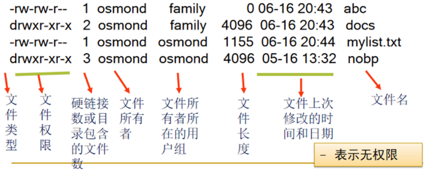
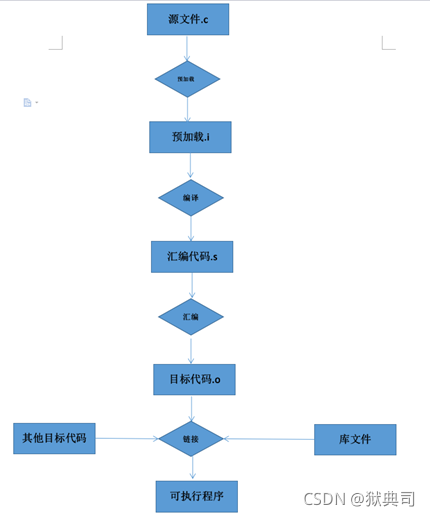
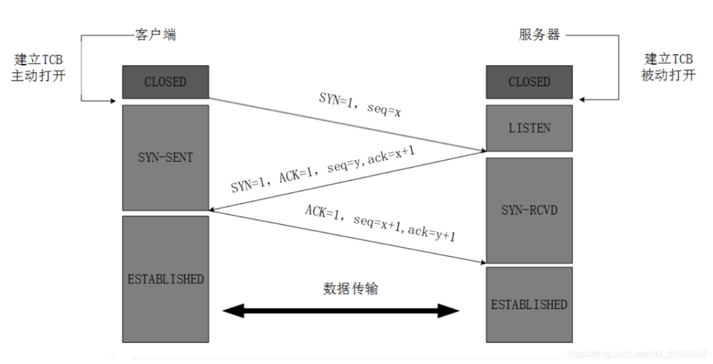
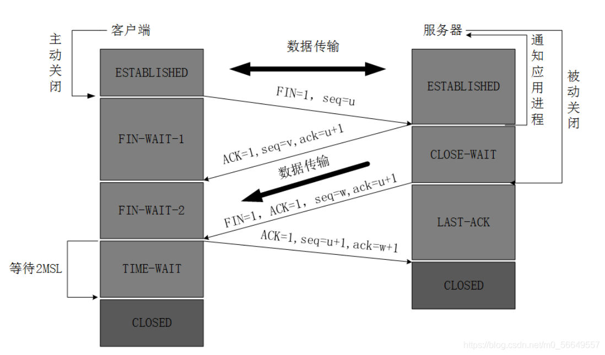
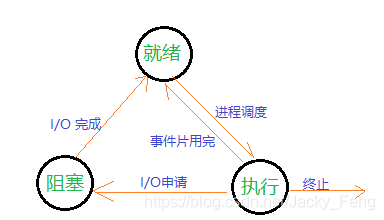
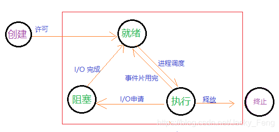

酒店预约系统

[toc]

# 整体框架

1.  自定义结构体：包含用户结构体以及酒店房间结构体

2.  数据类型转换：字符串与结构体数组之间的转换（所有socket api的接口，在读写数据时，都是按字符串的方式来发送接收的）

3.  日志记录：记录用户进行的操作

4.  检查：检查输入参数是否规范

5.  .dat数据文件：存储用户信息、房间信息以及日志信息

6.  读写文件：对用户、房间信息数据文件进行读写

7.  界面：主要包含命令行级的主界面以及用户登录界面

8.  可执行操作：增、删、改、查

9.  CS架构：客户端与循环并发式服务器

# 循环并发式服务器

## 服务器端

1.  首先定义全局变量。例如缓冲区、进程描述符、共享内存描述符以及指向共享内存用于读写数据的指针（使用shmget和shmat函数创建并映射了一块指定大小的共享内存，用于进程间通信）

2.  读数房间数据信息，以初始化服务器端的房间数据信息

3.  利用套接字，建立TCP服务器。包括绑定IP地址和端口、监听连接等

**循环并发**

4.  主循环等待客户端连接请求，使用accept函数接受连接。每当有新的客户端连接时，通过fork创建子进程处理该客户端（主进程一直循环，服务器持续工作）

5.  在子进程中创建子循环，并再次fork生成两个子进程，分别负责发送和接收数据

6.  子主进程：将房间信息结构体数组转化为字符串，通过strcat累加到缓冲区buf中

7.  将缓冲区内容复制到共享内存shmq，然后通过send发送给客户端

8.  子子进程：接收客户端发送的数据到共享内存，然后将接收到的字符串，转换成结构体数组。最后将更新后的房间信息保存到数据文件中

## 客户端

1.  首先初始化基本变量与资源。例如缓冲区、套接字描述符、service地址等

2.  调用函数显示用户登录界面

3.  在循环中，利用套接字，建立TCP客户端，并与服务器通过connect()函数建立连接

4.  成功连接后，从服务器接收数据至缓冲区，然后将接收到的字符串转换成结构体数组，用于后续操作

5.  根据用户登录权限，显示不同的操作界面。并选择操作（如预约房间、退房、查看预约信息等）

6.  执行不同的操作之后，都将更新后的数据通过send发送到服务器

#  Linux

一切皆文件

## 常用指令

> - pwd 查看当前所在路径
> - \~ 表示根/root
> - Ctrl+L 清屏
> - Ctrl+C 终止当前命令
> - home 光标移动到本行行首
> - end 光标移动到本行行尾
> - Tab 自动补全
> - Tab+Tab 显示可选择的文件或目录
> - mkdir 创建目录
>   - -p 当其父目录不存在时，强行创建
> - touch 创建文件
> - touch {a..e}.txt 创建a.txt---e.txt
> - rm 删除
>   - -r 递归，删除目录
>   - -f 强制删除
>   - \* 删除当前目录下所有文件和目录
> - cd 切换路径
> - cd.. 回到上一级
> - cd - 回到上次去过的目录
> - ls 查看当前目录下有哪些文件和目录
>   - -l 以列表的形式查看
>   - -a 查看所有文件，包括隐藏文件
>   - . 表示当前目录隐藏文件
>   - ..表示上级目录隐藏文件
> - man 帮助手册
> - man ls 查看ls的使用方法
> - \--help 帮助手册
> - date 查看时间
> - yum 安装服务
> - cp 文件名 路径 拷贝文件
>   - :-r 文件名 路径 递归拷贝文件夹
>   - 如：cp 1.txt /tmp/
> - mv 文件名 路径 移动文件
> - mv 原文件名 新文件名 文件改名
> - cat 文件名 查看文件的所有内容
> - vim 文件 编辑文件
>   - :q! 不保存退出
>   - :wq! 保存退出
>   - Esc 退出编辑模式
>   - a 进入编辑模式
>   - :/root 查找root关键词，按n键关键词光标移动
>   - u 撤销
>   - gg 定位到文本顶端
>   - G 定位到文本底部
>   - dd 删除当前光标所在行
>   - dG 删除光标所在行及下面所有行
>   - yy 复制
>   - 3yy 复制3行
>   - p 粘贴

## 文件权限

- u user，属主，文件的所有者
- g group，属组，属组内的组成员
- o other，其他人，既不是文件所有者，也不是文件属主的组的成员
- r read，读权限，4
- w write，写权限，2
- x execute，执行权限，1

chmod 修改权限

如

`chmod u+x 1.txt`

`chmod 755 2.txt`

- sh 脚本名.sh 运行脚本：无需权限

- ./ 脚本名.sh 运行脚本：需权限

# GCC

GCC 编译器是 Linux 下默认的 C/C++ 编译器。

在使用gcc编译程序时，编译过程可以简要划分为4个阶段：预处理、编译、汇编、链接。

## 预处理(Pre-Processing)

这个阶段主要是把一些include的头文件和一些宏定义，放到源文件中。

输入的是C语言的源文件，输出一个中间/预加载文件 \*.i（以 .i结尾的文件）。

## 编译(Compiling)

编译就是把C/C++代码(比如上述的".i"文件)翻译成汇编代码。

输入为中间文件\*.i，输出编译后生成的汇编编语言文件\*.s。

## 汇编(Assembling)

将汇编代码翻译成符合一定格式的机器代码，在Linux系统上一般表现为OBJ文件。

输入汇编文件\*.s，输出二进制机器代码\*.o。

## 链接(Linking)

链接就是将上步生成的OBJ文件和其它的OBJ文件、库文件链接起来，最终生成可以在特定平台运行的可执行文件。

## gcc使用例子

1.  gcc -c test.c：只进行编译，而不进行链接。编译完成后，会产生一个名为test.o的目标文件。包含了从源代码编译得到的机器代码，但还不能直接作为一个可执行程序来运行

2.  gcc -o test test.c：完成了从编译到链接的整个过程，并直接生成一个可执行文件test

3. ./test：运行

# 传输控制协议-TCP

是一种面向连接的、可靠的、基于字节流的传输层通信协议。

## TCP连接过程——三次握手

TCP三次握手的目的是为了确保双方都能发送和接收数据，并且为之后的可靠数据传输打下基础。

### 第一次握手

客户端向服务器发送一个TCP报文段，该报文段中：SYN（Synchronize）标志被置为1，表示这是一个同步序列请求。同时序列号字段设置为一个初始值ISN。这个报文段不包含应用层数据，仅作为连接请求。

### 第二次握手

服务器接收到客户端的报文后，若同意建立连接，则会响应一个TCP报文段，其中：SYN标志同样被置为1，表示服务器也在进行同步序列的初始化。ACK标志被置为1，表示这是一个确认报文。确认号（Acknowledgment Number）字段设置为客户端序列号+1，表明已成功接收客户端的SYN报文。同时服务器也会选择自己的初始序列号ISN，并将其序列号字段设置为此值。

### 第三次握手

客户端收到服务器的报文后，会再向服务器发送一个TCP报文段，其中：ACK标志被置为1，表示确认收到了服务器的SYN报文。确认号设置为服务器序列号字段值+1，确认服务器的SYN报文。此时，客户端的序列号为之前客户端发送的SYN报文的序列号加1，即ISN+1，表明从这个序列号开始发送数据。

完成这三次握手后，客户端和服务器都进入了ESTABLISHED状态，表示连接已经建立，双方可以开始传输数据。三次握手过程中不仅建立了连接，还协商了双方的初始序列号，为后续的数据包排序和确认提供了基础，确保了数据传输的可靠性。

注

1.  通过初始序列号(ISN)和确认号的机制，确保了双方知晓对方期望接收的第一个数据包的序列号，避免了旧数据包干扰，确保数据的有序和完整。

2.  防止资源浪费：通过握手过程，可以有效防止无用连接的建立。例如，如果服务器发送了SYN-ACK但客户端没有响应（可能是客户端崩溃或网络问题），那么服务器不会一直等待这个无效的连接，而是会在一段时间后放弃这个未完成的连接尝试，释放相应的资源。

##  TCP断开链接——四次挥手

是TCP连接断开的过程，确保数据传输的完整性以及安全关闭连接。

### 第一次挥手

当某一方（通常是客户端）想要关闭连接时，它会向另一方（服务器）发送一个TCP报文段，该报文段中：FIN（Finish）标志被置为1，表示它希望结束这次TCP会话。序列号（Sequence Number）字段设置为当前发送数据的最后一个字节的序列号加1。这意味着客户端不再发送数据，但还能接收数据。

### 第二次挥手

服务器接收到客户端的报文后，会回复一个确认报文段，其中：ACK标志被置为1，表示确认收到了FIN报文。确认号（Acknowledgment Number）设置为客户端报文的序列号加1，表明已收到客户端的断开请求。同时服务器也会选择自己的序列号ISN，并将其序列号字段设置为此值。此时服务器可能还有数据需要发送给客户端，因此不会立即关闭连接，而是进入半关闭状态。

### 第三次挥手

当服务器确定自己也没有数据要发送给客户端时，会向客户端发送一个报文段，表示服务器也准备好关闭连接。此报文的FIN标志被置为1。确认号（Acknowledgment Number）设置为上次服务器的确认号的值。服务器也会选择自己的序列号ISN，并将其序列号字段设置为此值。此时服务器进入最后确认状态，等待客户端的确认。

### 第四次挥手

客户端收到服务器的报文后，会发送一个ACK报文作为应答：ACK标志被置为1。确认号设置为服务器报文的序列号加1。序列号为之前客户端发送的FIN报文的序列号加1。随后客户端进入时间等待状态，等待足够的时间（通常为2MSL，即两倍的最大段生存期），以确保最后一个ACK报文能够到达服务器。之后，客户端关闭连接。服务器在收到最终的ACK后，关闭连接。

通过这四次挥手过程，确保了双方都知道连接已被关闭，所有数据都已正确传输完毕，且可以安全地释放连接占用的资源。

## 特点

1. 面向连接：指发送数据之前必须在两端建立连接
2. 面向字节流
3. 可靠传输
4. 仅支持单播传输：每条TCP传输连接只能有两个端点，只能进行点对点的数据传输，不支持多播和广播传输方式
5. 提供拥塞控制：当网络出现拥塞的时候，TCP能够减小向网络注入数据的速率和数量，缓解拥塞
6. TCP提供全双工通信：因为TCP连接的两端都设有缓存，用来临时存放双向通信的数据

# 用户数据报协议-UDP

## 特点

1.  面向无连接：不需要和TCP一样在发送数据前进行三次握手建立连接的，想发数据就可以开始发送了。并且也只是数据报文的搬运工，不会对数据报文进行任何拆分和拼接操作

2.  不可靠性

3.  有单播、多播、广播的功能：UDP不止支持一对一的传输方式，同样支持一对多，多对多，多对一的方式

4.  没有拥塞控制：一直会以恒定的速度发送数据，在网络条件不好的情况下可能会导致丢包

5.  头部固定8字节且开销小：传输数据报文时是很高效的

# TCP与UDP异同

1.  通信方式：TCP协议是面向连接的通信协议，即在传输数据前先在发送端和接收端建立逻辑连接，然后再传输数据。相反，UDP协议是无连接通信协议，即在数据传输时，数据的发送端和接收端不建立逻辑连接

2.  通信效率：TCP协议每次连接的创建都需要经过"三次握手"，通信效率比UDP低。UDP协议可以直接传输，通信效率高

3.  数据完整性：TCP协议可以保证传输数据的安全性和完整性。而UDP协议不能保证数据的完整性，可能会造成数据的丢失

4.  数据格式：TCP首部最小20字节，最大60字节，包含较多信息。而UDP首部固定8字节，包括较少信息

5.  应用场景：TCP通信是严格区分客户端与服务器端的，只能是一对一通信。UDP中只有发送端和接收端，不区分客户端与服务器端，计算机之间可以任意地发送数据

# 套接字-Socket

网络上的两个程序通过一个双向的通信连接实现数据的交换，这个连接的一端称为一个Socket。建立网络通信连接至少要一对端口号(Socket)。

套接字是操作系统提供的API（Application Programming Interface，应用程序编程接口），通过设置对端的 IP地址、端口号、通讯协议来实现数据的发送与接收。

# 操作系统——进程

可独立运行的基本单元（程序），能与其它进程并发执行。

## 包含

-   程序段

-   相关数据段

-   PCB（进程控制块）：PCB是进程存在的唯一标志，OS根据PCB来对并发执行的进程进行控制和管理

## 进程基本状态转换 

## 进程同步

使并发进程有效共享资源与合作，程序结果可再现。

1.  临界区：访问临界资源的那段代码（临界资源是一次仅允许一个进程使用的共享资源)

2.  进入区：进入临界区前进行检查的代码

3.  退出区：将临界区访问标志设为未被访问

4.  剩余区：其他部分

## 同步准则

1.  空闲让进

2.  忙则等待

3.  有限等待

4.  让权等待

## 死锁

指多个进程在运行过程中因争夺资源而造成的一种僵局，若无外力作用，将无法向前推进。

### 产生原因

1. 竞争（临时）资源

2. 进程间推进顺序非法

### 产生必要条件

1.  互斥条件：一段时间内某资源只由一个进程占用

2.  请求和保持条件：申请新资源阻塞并且对已获得资源保持不放

3.  不抢占条件：进程只有使用完资源才释放

4.  环路等待条件：存在进程------资源的环形链

### 解决死锁

1.  预防死锁：破坏死锁产生必要条件一个或多个

2.  避免死锁：资源动态分配过程中，防止系统进入不安全状态，总而避免发生死锁

3.  检测死锁：及时检测出死锁的发生

4.  解除死锁：剥夺资源或撤销进程
