<font size = 6>Hiarin</font>

[toc]

# 测试类型

在软件测试领域，测试主要包含以下几种类型

- 单元测试（Unit Testing）
  - 单元测试是针对软件中最小的可测试部分进行检查和验证的过程。通常，一个单元测试会针对一个函数(接口)或一个类中的一个方法
  - 单元测试的目的是验证接口的每个部分是否按照预期工作，确保基本逻辑和功能是正确的
- 集成测试（Integration Testing）
  - 集成测试是在单元测试之后进行的，目的是检查多个单元或模块是否能够协同工作。 涉及将独立的单元组合在一起，并测试它们之间的接口和交互
  - 集成测试有助于发现单元之间的接口错误和数据流问题
- 系统测试（System Testing）
  - 系统测试是在完整的、集成的软件系统上进行的测试，以验证系统满足需求规格
  - 它包括功能测试、性能测试、安全测试等多个方面，以确保系统作为一个整体能够正常运行
- 验收测试（Acceptance Testing）
  - 验收测试是由客户或最终用户执行的测试，以确定软件产品是否满足业务需求和用户期望
  - 这通常在系统测试之后进行，是软件交付前的最后一步测试
- 性能测试（Performance Testing）
  - 性能测试是评估软件在不同工作负载下的性能，包括响应时间、吞吐量、资源利用率等
  - 目的是确保软件在实际使用中能够达到预期的性能标准
- 负载测试（Load Testing）
  - 负载测试是模拟预期的用户负载，以验证软件在高负载下的行为和性能
  - 它有助于识别性能瓶颈和优化系统以处理更高的负载
- 压力测试（Stress Testing）
  - 压力测试是将系统推向极限，以确定系统在极端条件下的行为
  - 这包括超出预期负载的测试，以查看系统何时开始失败
- 安全测试（Security Testing）
  - 安全测试是评估软件的安全性，包括识别和修复安全漏洞，确保数据保护和遵守安全标准
- 回归测试（Regression Testing）
  - 回归测试是在软件变更后进行的测试，以确保新代码没有引入新的错误，并且原有功能仍然按预期工作

# 测试的原则

1. 证明软件中存在缺陷
2. 不能穷尽测试
3. 测试应用尽早介入
4. 28原则
5. 不存在缺陷谬论
6. 妥善保存一切文档

# 软件测试模型

## v模型

开发和测试同时进行来缩短开发周期，提高开发效率。
- 优点：展示测试由底层（代码）到高层（用户业务）按阶段测试的实现过程 
- 缺点：不适用于需求变化，灵活性差 

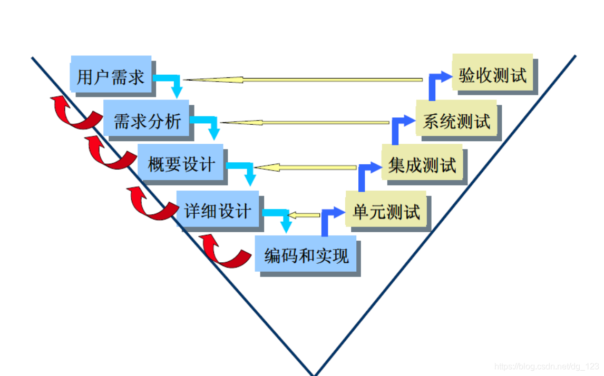

注

1. 单元测试的测试用例是依据研发人员做所做的详细设计而设计的
2. 集成测试用例根据概要设计中的模块功能及接口等实现方法编写出来的
3. 系统测试用例是根据需求说明书来编写出来的 

## w模型

W模型，简称“双V”模型，即以开发主导的一个“V”，和以测试主导的另一个“V”，为了克服V模型的缺点，引入了W模型。  

- 优点：测试伴随整个产品开发周期，测试对象不仅是程序还有需求、设计文档 测试介入较早，及早发现问题，降低修复成本  
- 缺点：实施起来比较复杂，难度大，对于需求阶段和设计阶段的测试设计要求较高（计算机技术、业务知 识、管理能力、测试素质等）

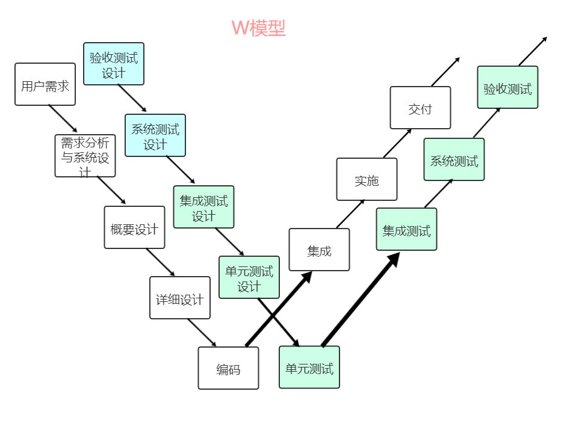

# 覆盖率介绍

代码覆盖率（Code Coverage）是衡量测试质量的一种指标，它用来描述测试用例执行时覆盖到的代码范围。高代码覆盖率意味着更多的代码被测试用例执行到，但这并不等同于测试的质量高或者软件没有缺陷。代码覆盖率是一个有用的度量，但它应该与其他测试指标和实际测试结果一起使用。 

- C0（Statement Coverage）—— 语句覆盖：测试是否执行了程序中的每条语句
- C1（Branch Coverage）—— 分支覆盖：测试是否执行了程序中的每个分支的所有可能结果
- DC（Decision Coverage）—— 判断覆盖：同 C1 分支覆
- MC/DC（Modified Condition/Decision Coverage）—— 修正条件/判定覆盖：确保每个条件独立地影响决策的输出，即每个条件至少一次导致不同的结果 
- MCC（Multiple Condition Coverage）—— 条件组合覆盖：确保程序中所有可能的条件组合都至少被一次测试用例执行到
- CPC（Call Pair Coverage）—— 调用对覆盖：评估程序中函数调用关系的测试情况，CPC 的目的是确保程序中所有可能的函数调用对（即一个函数调用另一个函数的每一种方式）都至少被执行一次 
- EPC（Entry Point Coverage）—— 入口点覆盖：确保程序中所有可能的入口点（函数或方法的开始处）都被至少执行一次 
- FC（Function Coverage）—— 函数覆盖：测试是否执行了程序中的每个函数 

# 测试用例的设计

## 黑盒测试方法 

不知道代码内部逻辑，例如系统测试。

- 等价类划分：将输入数据分为有效等价类和无效等价类，每个等价类中的数据被认为是等效的，只需要测试一个代表值。目的是确保每个等价类至少有一个测试用例
- 边界值分析：测试输入域和输出域的边界条件。通常在等价类划分的基础上，对边界值进行额外的测试
- 因果图分析：使用因果图来表示输入条件和输出结果之间的关系，帮助设计覆盖所有功能的测试用例
- 错误推测法：基于经验和直觉推测程序中可能存在的错误，并设计测试用例来检测这些错误

## 白盒测试方法

知道代码的内部逻辑，类似于单元测试和集成测试。

- 语句覆盖：确保程序中的每条语句至少执行一次
- 判定覆盖：确保程序中的每个分支（if、switch、while、for等）的每个可能的结果（真和假）都被测试到
- 条件覆盖：确保每个条件表达式（如if语句中的条件）的所有可能结果都被测试
- 判定/条件覆盖：同时满足判定覆盖和条件覆盖
- 条件组合覆盖：每个判定中各条件的每一种组合至少出现一次
- 路径覆盖：使程序中每一条可能的路径至少执行一次  

## 灰盒测试 

大概知道代码逻辑实现，不需要看懂所有的代码,类似于合格性测试。

# AUTOSAR

## 概要

### 简介

AUTOSAR（汽车开放系统架构）是由汽车制造商、供应商及工具开发商联合制定的开放式软件架构标准，旨在提升汽车电子控制单元（ECU）软件的可重用性、可互换性和可扩展性，降低开发复杂度与成本。

### 作用

可以为应对软件复杂性问题提供重要的技术支撑，并且可以让 Tier1（一级供应商） 和 OEM（整车厂） 更专注于软件功能的设计与开发。

基于 AUTOSAR 平台，用户可以开发动力总成、底盘、车身和驾驶辅助系统等领域的 ECU 软件。它涵盖了构建现代 ECU 所需的实时调度、通信、诊断、存储管理、功能安全和信息安全等功能。

### 优势

- 提高软件复用度，尤其是跨平台的复用度
- 便于软件的交换和更新
- 软件功能可以进行先期架构级别的定义和验证，从而减少开发错误
- 减少手工代码量，减轻测试验证负担，提高软件质量
- 使用一种标准化的数据交换格式，方便各厂商之间的合作交流

总的来说，使用 AUTOSAR 可以在保证软件质量的同时，大大降低开发的风险与成本。

### 原则

AUTOSAR 提倡的原则是：在标准上合作，在实现上竞争。

其核心思想在于 “统一标准、分散实现、集中配置”。

- 统一标准：是为了给各个厂商提供一个开放的、通用的平台
- 分散实现：要求软件系统高度的层次化和模块化，同时还要降低应用软件与硬件平台之间的耦合
- 集中配置：将不同厂商开发的所有模块的配置信息以统一的格式集中整合并管理起来，形成一个完整的配置系统，从而完成最终的软件系统集成

### AUTOSAR对微控制器的要求

- 处理能力
	- 支持实时操作系统（AUTOSAR OS）的多任务调度
	- 满足复杂算法（如ADAS、电机控制）的算力需求
- 内存资源
	- 足够的Flash和RAM空间以运行AUTOSAR软件栈
	- 支持内存保护单元（MPU）以实现功能安全
- 外设支持
	- 集成CAN、LIN、以太网等通信接口
	- 提供高精度定时器、ADC/DAC等模拟模块
- 安全性
	- 符合ISO 26262功能安全标准（ASIL等级）
	- 支持硬件安全模块（HSM）或加密引擎
- 实时性
	- 低延迟中断响应，满足汽车控制的实时需求

### 平台分类

- 经典平台（CP）：面向传统嵌入式ECU（如发动机控制），强调实时性和确定性
- 自适应平台（AP）：针对高性能计算（如自动驾驶），基于POSIX/Linux，支持动态部署和OTA更新

## 系统架构

与传统 ECU 软件架构相比，AUTOSAR 分层架构的高度抽象使得汽车嵌入式系统软硬件耦合度大大降低，两者对比如下图所示

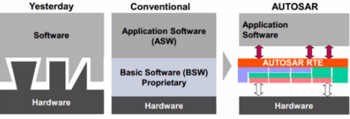

AUTOSAR分层架构是实现软硬件分离的关键，它使汽车嵌入式系统控制软件开发者摆脱了以往ECU软件开发与验证时对硬件系统的依赖。

在 AUTOSAR 分层架构中，汽车嵌入式系统软件自上而下分别为

- 应用软件层（Application Software Layer，ASW）：实现具体的车辆功能（如发动机控制、刹车系统等）
- 运行时环境（Runtime Environment，RTE）：负责应用层与底层软件之间的通信
- 基础软件层（Basic SoftwareLayer，BSW）：提供标准化的服务（如通信、存储、诊断等）
- 微控制器（Microcontroller）：将硬件特性（如GPIO、ADC、PWM等）抽象为统一的接口，使上层软件无需直接依赖具体硬件

为保证上层与下层的无关性，在通常情况下，每一层只能使用下一层所提供的接口，并向上一层提供相应的接口。

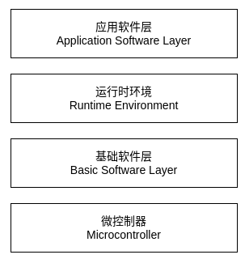

### AUTOSAR 应用软件层

AUTOSAR 应用软件层（Application Software Layer，ASW）包含若干个软件组件（Software Component，SWC），软件组件间通过端口（Port）进行交互。每个软件组件可以包含一个或者多个运行实体（Runnable Entity，RE），运行实体中封装了相关控制算法，其可由 RTE 事件（RTE Event）触发。

### AUTOSAR 运行时环境

AUTOSAR 运行时环境（Runtime Environment，RTE）作为应用软件层和基础软件层交互的桥梁，为软硬件分离提供了可能。RTE 可以实现软件组件间、基础软件间以及软件组件和基础软件之间的通信。

RTE 封装了基础软件层的通信和服务，为应用层软件组件提供了标准化的基础软件和通信接口，使得应用层可以通过 RTE 接口函数调用基础软件的服务。此外，RTE抽象了ECU之间的通信，即RTE通过使用标准化的接口将其统一为软件组件之间的通信。由于 RTE 的实现与具体 ECU 有关，所以必须为每个 ECU 分别实现。

### AUTOSAR 基础软件层

AUTOSAR 基础软件层（Basic Software Layer，BSW）又可分为四层，

- 服务层（Services Layer）
- ECU 抽象层（ECU Abstraction Layer）
- 微控制器抽象层（Microcontroller Abstraction Layer，MCAL）
- 复杂驱动（Complex Drivers）

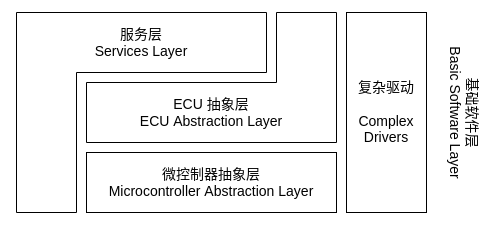

各个基础软件层又由一系列基础软件组件构成，包括系统服务（System Services）、存储器服务（Memory Services）、通信服务（Communication Services）等。它们主要用于提供基础软件服务，包括标准化的系统功能和功能接口。

**服务层**

服务层（Services Layer）提供了汽车嵌入式系统软件常用的一些服务，其可分为系统服务（System Services）、存储器服务（Memory Services）以及通信服务（Communication Services）三大部分。提供包括网络通信管理、存储管理、ECU模式管理和实时操作系统（RTOS）等服务。除了操作系统外，服务层的软件模块都是与 ECU 平台无关的。

**ECU抽象层**

ECU 抽象层（ECU Abstraction Layer）包括板载设备抽象、存储器硬件抽象、通信硬件抽象和 I/O 硬件抽象。该层将 ECU 结构进行了抽象，负责提供统一的访问接口，实现对通信、存储器以及I/O的访问，从而不需要考虑这些资源是由微控制器片内提供的，还是由微控制器片外设备提供的。该层与ECU平台相关，但与微控制器无关，这种无关性正是由微控制器抽象层来实现的。

**微控制器抽象层**

微控制器抽象层（Microcontroller Abstraction Layer，MCAL）是实现不同硬件接口统一化的特殊层。通过微控制器抽象层可将硬件封装起来，避免上层软件直接对微控制器的寄存器进行操作。微控制器抽象层包括微控制器驱动、存储器驱动、通信驱动、I/O 驱动等模块。

**复杂驱动层**

由于对复杂传感器和执行器进行操作的模块涉及严格的时序问题，难以抽象，所以在 AUTOSAR 规范中这部分没有被标准化，统称为复杂驱动（Complex Drivers）。

## 软件组件

前面说到，AUTOSAR 应用软件层（Application Software Layer，ASW）包含若干个软件组件（Software Component，SWC）。软件组件不仅仅是应用层的核心，也是一些抽象层、复杂驱动层等实现的载体。

AUTOSAR 软件组件大体上可分为原子软件组件（Atomic SWC）和部件（Composition SWC）。其中，部件可以包含多干原子软件组件或部件。

原子软件组件则可根据不同用途分为以下几种类型

- 应用软件组件（Application SWC）：主要用于实现应用层控制算法
- 传感器/执行器软件组件（Sensor/Actuator SWC）：用于处理具体传感器/执行器的信号，可以直接与 ECU 抽象层交互
- 标定参数软件组件（Parameter SWC）：主要提供标定参数值
- ECU 抽象软件组件（ECU Abstraction SWC）：提供访问 ECU 具体 I/O 的能力。此外，ECU抽象软件组件也可以直接和一些基础软件进行交互
- 复杂设备驱动软件组件（Complex Device Driver SWC）：推广了 ECU 抽象软件组件，它可以定义端口与其他软件组件通信，还可以与 ECU 硬件直接交互。因此这类软件组件的灵活性最强，但由于其和应用对象强相关，从而导致其可移植性较差
- 服务软件组件（Service SWC）：主要用于基础软件层，可通过标准接口或标准 AUTOSAR 接口和其他类型的软件组件进行交互

上述这些软件组件有的仅仅是概念上的区分，从具体实现及代码生成角度而言都是相通的。

## AUTOSAR 数据类型

AUTOSAR 规范中定义了三种数据类型（Data Type）

- 应用数据类型（Application Data Type，ADT）
- 实现数据类型（Implementation Data Type，IDT）
- 基础数据类型（Base Type）

### 应用数据类型

应用数据类型（Application Data Type，ADT）是在软件组件设计阶段抽象出来的数据类型，用于表征实际物理世界的量，是提供给应用层使用的，仅仅是一种功能的定义，并不生成实际代码。

ADT 从应用逻辑的角度描述数据，体现该数据在现实中的物理语义、物理取值范围、物理单位等。在 ADT 中通常会关联一个计算公式（Computation Method），描述数据从物理（值）范围到内部数字（位）级别的转换关系。一般地，在功能定义的过程中，我们会使用 ADT 的方式对数据进行描述。

### 实现数据类型

实现数据类型（Implementation Data Type，IDT）是代码级别的数据类型，是对应用数据类型的具体实现；它需要引用基础数据类型（Base Type），并且还可以配置一些计算方法（Compute Method）和限制条件（Data Constraint）。

在 AUTOSAR 中，对于应用数据类型没有强制要求使用，用户可以直接使用实现数据类型。而如果使用了应用数据类型，那么必须进行数据类型映射（Data Type Mapping），即将应用数据类型和实现数据类型进行映射，从而来对每个应用数据类型进行具体实现。

### 基础数据类型

基础数据类型（Base Type）是从 Bit 或 Byte 的角度描述底层平台（Platform）支持的原生类型，这些原生类型最终构建了 IDT的实现。

完整的 AUTOSAR 数据类型定义包含 ADT、IDT 和 Base Type，且 ADT 和 IDT 之间需要定义映射关系，IDT 和 Base Type 之间需要定义关联关系。ADT 和 IDT 各有关注点和使用场合，实际应用过程中，当我们对物理语义不是很关心的时候，可以只定义 IDT 而不定义 ADT。

## AUTOSAR 应用接口

在 AUTOSAR 规范中，将不同模块间通信的接口划分为以下三类

- AUTOSAR 接口（AUTOSAR Interface）
- 标准 AUTOSAR 接口（Standardized AUTOSAR Interface）
- 标准接口（Standardized Interface）

三种应用接口在 AUTOSAR 架构中的示意图如下图所示

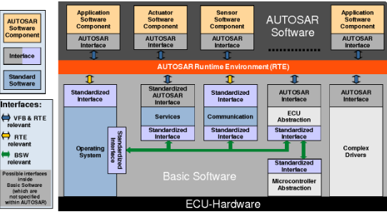


### AUTOSAR 应用接口（AUTOSAR Interface）

是从软件组件的端口衍生而来的通用接口，用于描述数据或服务。它由 RTE 提供给软件组件，可以作为软件组件间通信的接口，也可以作为软件组件与 I/O 硬件抽象层或复杂设备驱动层间的接口。AUTOSAR 接口非标准，可自定义，但在 AUTOSAR 规范中目前已对车身、底盘及动力传动系统控制领域的应用接口做了一些标准化工作。

### 标准 AUTOSAR 接口（Standardized AUTOSAR Interface）

是一中特殊的 AUTOSAR 接口，在 AUTOSAR 规范中有明确的定义。由 RTE 向软件组件提供 BSW 中的服务，如存储器管理、ECU 状态管理、“看门狗”管理等。

### 标准接口（Standardized Interface）

在 AUTOSAR 规范中以 C 语言中 API 的形式明确定义。主要用于 ECU 上的 BSW 各模块间、RTE 和操作系统间、RTE 和通信模块间，应用软件组件不可访问。

## AUTOSAR 虚拟功能总线

虚拟功能总线（Virtual Function Bus，VFB）是对 AUTOSAR 提供的所有通信机制的一种抽象，是所有软件组件进行交互的桥梁。通过虚拟功能总线，软件组件之间的通讯细节被抽象出来，软件组件通过 AUTOSAR 定义的接口对通讯进行描述，即可最大程度地独立于具体的通讯机制，实现与其他软件组件和硬件的交互。

AUTOSAR 虚拟功能总线的示意图如下图所示。

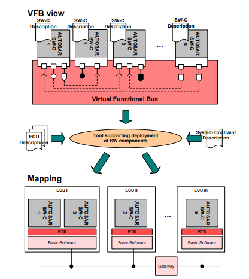

如果从整车级别去看待整车上所有的功能模块，主要有两种通信形式

- 在单个 ECU 内部的通信（Intra-ECU Communication）
- 在多个 ECU 之间的通信（Inter-ECU Communication）

如果使用传统的系统设计方法，则会带来一个问题，即在定义整车级别的应用层软件架构的时候会受到具体实现手段的束缚，这主要体现在与底层软件的接口。AUTOSAR 为了实现一种“自顶向下”的整车级别的软件组件定义，提出了虚拟功能总线（VFB）的概念。

使用虚拟功能总线，可以使得负责应用层软件的开发人员不用去关心一个软件组件最终在整车中的哪个 ECU 中具体实现，从而使得应用软件的开发可以独立于具体的 ECU 开发。因此，可以让应用软件开发人员专注于应用软件组件的开发。而 VFB 的真实通信实现则由 RTE 和基础软件来保证，从这一角度来看，RTE 是 AUTOSAR 虚拟功能总线的具体实现。

## AUTOSAR 方法论

AUTOSAR 方法论（AUTOSAR Methodology）中车用控制器软件的开发涉及系统级、ECU 级和软件组件级。

- 系统级主要考虑系统功能需求、硬件资源、系统约束，然后建立系统架构
- ECU 级根据抽象后的信息对 ECU 进行配置
- 系统级和 ECU 级设计的同时，伴随着软件组件级的开发

上述每个环节都有良好的通信接口，并使用统一的 arxml（AUTOSAR Extensible Markup Language）描述文件，以此构建了 AUTOSAR 方法论。

下图展示了 AUTOSAR 方法论中“自顶向下”的软件组件设计和 VFB 实现方法。

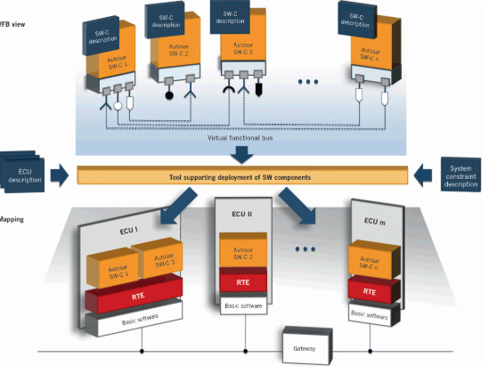

在开发 AUTOSAR 之前，需要先编写系统配置描述文件，三部分内容

1. 软件组件描述（SW-Component Description）：包含系统中所涉及的软件组件的接口信息，例如数据类型、端口接口、端口等
2. ECU 资源描述（ECU Resource Description - HW only）：包含系统中每个ECU所需要的处理器及其外设、传感器、执行器等信息
3. 系统约束描述（System Constraint Description）：包含总线信号、软件组件间的拓扑结构和一些映射关系等信息

基于上述系统配置输入描述文件，系统配置根据 ECU 资源和时序要求，将软件组件映射到对应的 ECU 上，生成系统配置描述文件（System Configuration Description）。该文件包含了设计过程中非常重要的一个描述—— 系统通信矩阵，其描述了网络中所有运行的数据帧及其对应的时序和内容。

从系统级到 ECU 级的过渡操作是指 ECU 信息抽取（ECU Extract）。在系统配置阶段已经将每个 ECU 所包含的所有软件组件、网络通信等信息封装好，ECU 信息抽取阶段只需将待配置 ECU 信息抽取出来即可，服务于之后的 ECU 配置。

ECU 配置过程主要是对 RTE 和 BSW 的配置。在 RTE 配置阶段，需要将软件组件的运行实体映射到相应的操作系统任务。在 BSW 配置阶段，需要详细配置 BSW 层中所需要用到的模块，一般有操作系统、通信服务、ECU 抽象层和微控制器抽象层等。然后根据ECU配置信息生成BSW和RTE代码，再结合软件组件级实现的应用代码，最终进行代码集成，编译链接，生成单片机可执行文件。

# 协议栈测试

## 简介

- DID（Data Identifier）用于请求特定车辆数据，如传感器读数、状态信息等
- DTC（Diagnostic Trouble Code）用于指示车辆存在的故障或问题，并提供有关问题的更多信息

## 协议

### ISO 15765

ISO 15765是CAN的诊断通信标准，聚焦于网络层与应用层的实现。确保长消息在CAN总线（单帧仅支持8字节）上的可靠传输。

聚焦CAN总线的网络层与部分应用层实现，解决物理层传输限制（如多帧拆分）。


### ISO 14229协议解析

作为统一诊断服务（UDS, Unified Diagnostic Services）的国际标准，ISO 14229定义应用层诊断服务的通用接口，独立于底层通信协议（如CAN、Ethernet）。 

定义独立于物理层的应用层服务逻辑，确保诊断功能在不同总线（CAN、FlexRay等）上的一致性。 

## 工具

### CanDelaStudio

诊断数据库配置工具，用于定义ECU诊断规范。 

**功能**

- 诊断参数配置：定义DID（数据标识符）、DTC（故障码）、诊断服务（如UDS服务）及ECU通信参数（CAN ID、定时参数）
- 标准化输出：生成符合行业标准的诊断描述文件（.cdd、.odx），如CDD（CANdela诊断描述）

### CANoe.Diva

基于诊断数据库的自动化测试设计模块，集成于CANoe环境中。 

**功能**

- 测试用例生成：通过解析诊断数据库（.cdd/.odx），自动生成基础测试用例（如服务有效性、DTC触发条件验证）

### CANoe（集成开发与测试平台）

汽车总线仿真、诊断及测试的综合性工具链。 

**功能**

- 总线仿真：模拟CAN/LIN/Ethernet等车载网络，构建虚拟ECU节点或整车网络环境
- 诊断协议栈支持：内置ISO 15765（DoCAN）、ISO 14229（UDS）等协议栈，支持诊断通信的交互式测试
- 数据分析：通过Logging模块记录原始数据，结合CANoe.DiVa离线分析

### 协同流程
1. 需求阶段：利用CanDelaStudio将诊断需求转化为标准化的.cdd数据库文件 
2. 测试设计：在CANoe中导入.cdd文件，通过Diva工程生成自动化测试用例，补充自定义测试逻辑 
3. 执行验证：在CANoe的仿真环境中执行测试，结合真实ECU或虚拟节点验证诊断功能 
4. 迭代优化：根据测试结果调整诊断数据库或ECU软件，形成闭环开发流程

# CAN四类帧

CAN报文被划分为四类帧：单帧（SF, Single Frame）、首帧（FF, First Frame）、连续帧（CF, Consecutive Frame）和流控帧（FC, Flow Control Frame）。这些帧类型用于解决CAN总线单帧传输数据长度受限（最大8字节）的问题，支持长消息的分段传输与重组。

## 单帧（SF, Single Frame）

- 用途：传输长度≤7字节的短消息（因需预留1字节协议控制信息）
- 数据结构
	- 首字节（PCI）：最高位为0（标识单帧），低7位表示数据长度（DL）
	- 后续字节：实际数据（最多7字节）

示例 

```plaintext
| 0x03 | Data1 | Data2 | Data3 | ... |   // 0x03表示数据长度为3字节
```

## 首帧（FF, First Frame）

- 用途：长消息传输的起始帧，声明总数据长度
- 数据结构
	- 首字节（PCI）：最高位为1（标识首帧），低7位与次字节共同表示数据总长度（12位，最大4095字节）
	- 后续字节：前2字节为长度信息，其余为数据段

示例 

```plaintext
| 0x10 | 0x00 | 0x20 | Data1 | Data2 | ... |  // 0x1000表示总长度256字节
```

## 连续帧（CF, Consecutive Frame）

- 用途：继首帧之后传输长消息的后续数据块
- 数据结构
	- 首字节（PCI）：最高两位为10（标识连续帧），低6位为序列号（SN），取值范围0-15，循环递增
	- 后续字节：数据段（最多7字节）

示例

```plaintext
| 0x21 | Data1 | Data2 | ... |   // 0x21表示序列号为1
```

## 流控帧（FC, Flow Control Frame）

- 用途：接收方控制发送方的连续帧传输速率，避免数据溢出
- 数据结构
	- 首字节（PCI）：最高两位为11（标识流控帧），低6位为流控状态（FS）
		- 0x00：继续发送（CTS, Continue To Send）
		- 0x01：等待（WT, Wait）
		- 0x02：溢出（OVFLW, Overflow）
	- 次字节：块大小（BS），指定发送方可连续发送的连续帧数量（0=无限制）
	- 第三字节：最小间隔时间（STmin），单位为毫秒（0x00-0x7F）或预留扩展（0x80-0xF0）

示例

```plaintext
| 0x30 | 0x0A | 0x05 |   // CTS状态，允许连续发送10帧，帧间隔≥5ms
```

## 多帧传输流程示例

1. 发送方发送首帧（FF），声明总长度（如256字节）
2. 接收方回复流控帧（FC），指定BS=3（允许连续发送3帧）、STmin=10ms 
3. 发送方按流控参数发送3个连续帧（CF），每帧间隔≥10ms
4. 接收方再次发送流控帧（BS=3），循环直至所有数据接收完成

## 关键参数与约束

- 序列号（SN）：连续帧的SN从0开始循环计数（0→1→…→15→0），用于检测丢帧。
- 超时机制
	- N_As：首帧发送后等待流控帧的超时时间（默认1000ms） 
	- N_Br：连续帧发送间隔超时时间（默认1000ms）
- 错误处理：若接收方检测到序列号错误或超时，可终止传输并发送否定响应（NRC）

# Stub

## 概述

在软件开发领域，stub（存根或桩）是一种被设计用于替代真实实现的轻量级组件或模块。这些存根在开发过程中用作替代品，以便进行系统集成和测试。存根可以提供预定义的响应，以测试系统是否正确地与其依赖项进行交互。这种做法有助于并行开发，允许开发人员在不依赖实际实现的情况下继续工作。  

通过使用存根，开发人员可以在系统中引入假的、轻量级的实现，而不必等待实际组件完成。这对于处理外部系统的依赖关系或测试系统在特定条件下的行为非常有用。  

## 目的

- 隔离：指将测试任务从产品项目中分离出来,使之能够独立编译、链接,并独立运行。隔离的基本方法就是打桩,将测试任务之外的,并且与测试任务相关的代码,用桩来代替,从而实现分离测试任务
- 补齐：指用桩来代替未实现的代码
- 控制：指在测试时,人为设定相关代码的行为,使之符合测试需求

# eHSM

eHSM，即嵌入式硬件安全模块（Embedded Hardware Security Module），是一种集成在微控制器（MCU）或其他系统芯片（SoC）中的硬件安全解决方案。它提供了高安全等级的信任根（Root of Trust），并对外提供包括安全启动、身份认证、密钥管理、生命周期管理等在内的丰富安全服务。 

主要特点

- 集成性：eHSM将硬件安全模块（HSM）集成在同一芯片内，与单独的硬件安全芯片相比，eHSM MCU可以在单个芯片上实现处理器核心、存储器、外设和安全功能，而独立的硬件安全芯片需要与MCU分开使用
- 成本效益：由于集成度的不同，eHSM MCU通常比单独的硬件安全芯片成本更低。单独的硬件安全芯片需要额外的封装和连接，而eHSM MCU则可以通过单一芯片实现多种功能
- 灵活性：单独的硬件安全芯片通常更加灵活，可以与不同类型的MCU和处理器配合使用。而eHSM MCU的安全功能通常是与特定的处理器核心和架构紧密集成的
- 性能：一般来说，单独的硬件安全芯片通常专注于提供高性能的安全功能，而eHSM MCU可能在性能上受到处理器核心和其他集成功能的限制

综上所述，eHSM是一种为汽车领域提供高安全性能的集成型硬件安全解决方案，它通过集成在SoC中来提供安全服务，满足智能网联汽车对信息安全的需求。

# Tessy

一款专为嵌入式系统设计的自动化测试工具，支持所有行业领先的编译器、调试器和微控制器，以及主机模拟，主要针对嵌入式软件的C/C++代码进行单元测试和集成测试。 

# 实例

## 项目文件结构

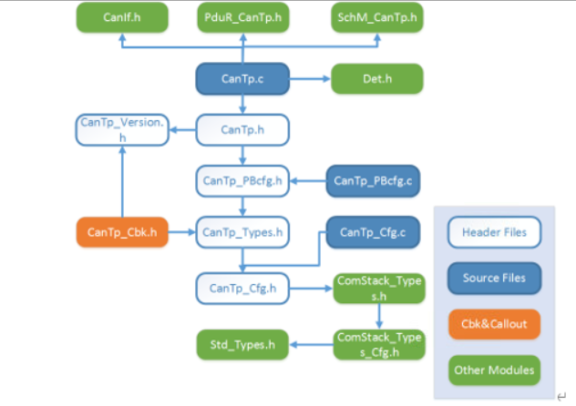

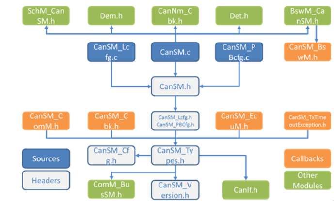

## 算法流程图

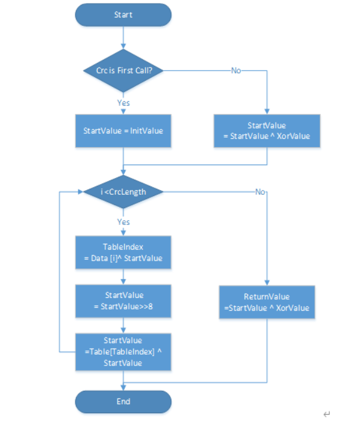

# Intern

- 掌握白盒/黑盒测试，熟练使用测试工具如Tessy，具有自动化测试经验

1. 单元测试：针对eHSM项目源码，设计并执行覆盖率分析策略，累计完成9个/天源文件测试，精确定位代码级缺陷4个/天，并输出7个/天测试报告
	- 主要Bug类型：类型不匹配、访问空指针、缺少头文件、缺少定义、语法错误（三元符）、格式错误
2. 集成测试：针对AUTOSAR架构项目进行集成测试（仅两人），主导BSW层模块的接口验证与功能联调，帮助团队建立标准化测试流程
	- 主要bug类型：被调接口参数与返回值、关注于接口间调度关系、被调参数格式不匹配，如将u16类型数据作为参数传入实际操作为u8类型的被调接口 
3. 基于Python开发Tessy自动化测试框架，测试耗时降低75%
	- 配置工程批量生成、测试用例自动执行、结果数据智能分析等功能 
4. 系统化编写《Tessy测试全流程指南》（约3.7万字），构建需求映射→用例设计→缺陷分析的标准化体系，使新成员上手效率提升60%
5. 主导基于ISO 14229、15765协议的ECU系统级验证，通过DIVA平台执行320+诊断服务测试用例，发现12处协议栈实现缺陷

